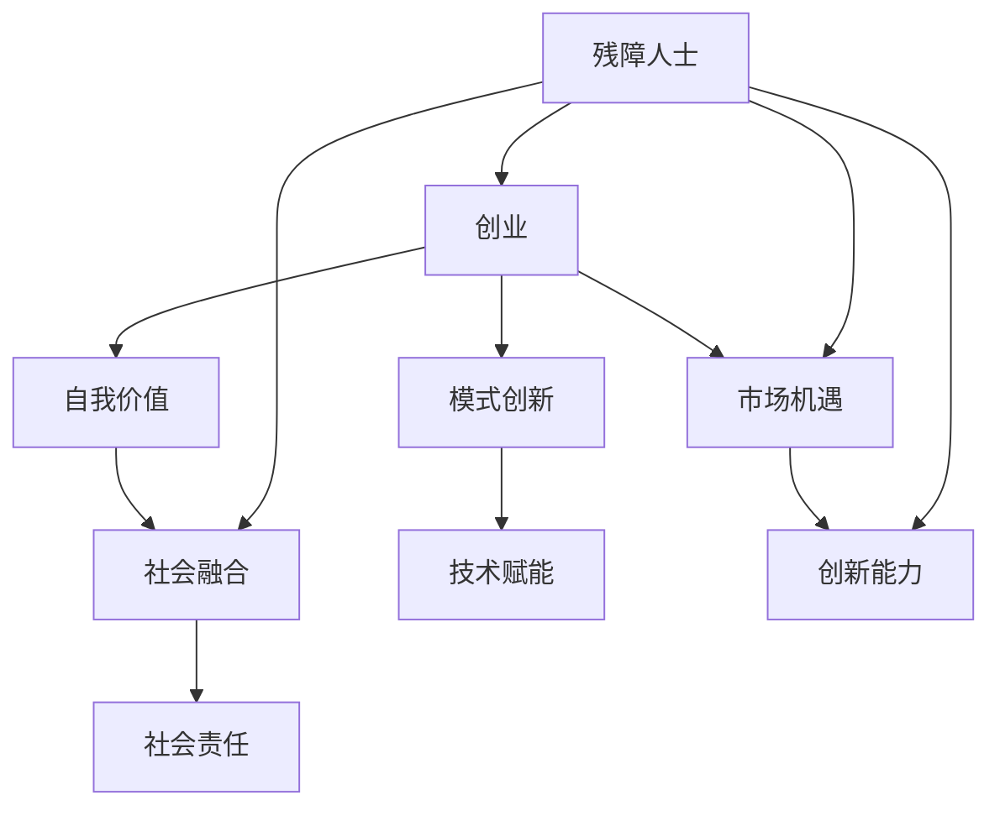

                 

# 残障人士创业故事：用创业实现自我价值

## 关键词
- 残障人士
- 创业
- 自我价值
- 技术赋能
- 社会融合
- 模式创新

## 摘要
本文将深入探讨残障人士如何在充满挑战的社会环境中，通过创业实现自我价值，并融入社会。我们将通过具体案例，分析残障人士创业的模式、策略以及面临的挑战，为有志于创业的残障人士提供启示和指导。

## 1. 背景介绍

### 1.1 目的和范围
本文旨在通过分析残障人士创业的成功故事，探讨如何利用创业实现自我价值，促进社会融合。我们将重点讨论残障人士创业的模式、策略以及所面临的挑战。

### 1.2 预期读者
本文适用于希望了解残障人士创业现状的读者，包括残障人士自身、关心残障人士的社会人士、创业者和相关从业人员。

### 1.3 文档结构概述
本文分为十个部分：背景介绍、核心概念与联系、核心算法原理 & 具体操作步骤、数学模型和公式 & 详细讲解 & 举例说明、项目实战：代码实际案例和详细解释说明、实际应用场景、工具和资源推荐、总结：未来发展趋势与挑战、附录：常见问题与解答、扩展阅读 & 参考资料。

### 1.4 术语表

#### 1.4.1 核心术语定义
- 残障人士：具有永久性生理、精神、感官障碍的人。
- 创业：创建和运营新的企业或项目。
- 自我价值：个人在自我认识、情感、社会关系等方面的价值和意义。

#### 1.4.2 相关概念解释
- 社会融合：使残障人士能够平等、积极参与社会生活的过程。
- 模式创新：创造新的商业运作方式，以实现企业价值和社会价值的双重提升。

#### 1.4.3 缩略词列表
- IDEA：创新、创业、社交、多元化

## 2. 核心概念与联系

在探讨残障人士创业时，我们需要了解几个核心概念，它们之间的关系如下所示：



**创业**是实现**自我价值**的一种途径，而**社会融合**则是创业的终极目标之一。**模式创新**和**技术赋能**为创业提供了新的动力和机会，**市场机遇**和**创新能力**则是推动创业成功的关键要素。

## 3. 核心算法原理 & 具体操作步骤

为了理解残障人士如何通过创业实现自我价值，我们可以将创业过程视为一个算法。以下是一个简化的伪代码，描述了创业的核心步骤：

```plaintext
function 创业(self):
    if 自我价值需求 and 市场机遇:
        1. 发现市场缺口
        2. 设计商业模式
        3. 获取资源
        4. 筹集资金
        5. 建立团队
        6. 开发产品或服务
        7. 推广和销售
        8. 监控和评估
        9. 调整和优化
    else:
        回到步骤 1，重新审视自我价值需求和市场机遇。
```

### 3.1 发现市场缺口

```plaintext
function 发现市场缺口():
    1. 收集市场数据
    2. 分析消费者需求
    3. 确定目标客户群体
    4. 识别竞争对手
    5. 评估市场机会
```

### 3.2 设计商业模式

```plaintext
function 设计商业模式():
    1. 明确价值主张
    2. 确定收入来源
    3. 设计成本结构
    4. 确定关键资源
    5. 制定营销策略
```

### 3.3 获取资源

```plaintext
function 获取资源():
    1. 个人技能和经验
    2. 社交网络
    3. 政府和社会组织支持
    4. 投资者和合作伙伴
    5. 技术和知识产权
```

### 3.4 筹集资金

```plaintext
function 筹集资金():
    1. 个人储蓄
    2. 家人和朋友支持
    3. 风险投资
    4. 政府补助和奖励
    5. 社会融资平台
```

### 3.5 建立团队

```plaintext
function 建立团队():
    1. 确定核心团队成员
    2. 分配角色和职责
    3. 制定团队目标和战略
    4. 建立沟通和协作机制
    5. 提供培训和激励
```

### 3.6 开发产品或服务

```plaintext
function 开发产品或服务():
    1. 制定产品或服务规划
    2. 进行市场调研
    3. 设计产品原型
    4. 进行测试和迭代
    5. 推广和发布
```

### 3.7 推广和销售

```plaintext
function 推广和销售():
    1. 制定推广策略
    2. 利用多种渠道推广
    3. 确定定价策略
    4. 客户关系管理
    5. 销售目标和绩效考核
```

### 3.8 监控和评估

```plaintext
function 监控和评估():
    1. 设定关键绩效指标（KPI）
    2. 定期收集数据
    3. 分析数据，识别问题
    4. 制定改进措施
    5. 调整和优化业务策略
```

通过上述步骤，我们可以看到，创业并非一条直线，而是一个动态调整和优化的过程。对于残障人士来说，这个过程中需要特别关注自我价值的实现和社会融合的推进。

## 4. 数学模型和公式 & 详细讲解 & 举例说明

在创业过程中，许多决策都可以通过数学模型和公式进行优化。以下是一些常用的数学模型和公式，以及它们的详细讲解和举例说明。

### 4.1 盈亏平衡分析

盈亏平衡分析是一种基本的财务分析工具，用于确定企业达到盈亏平衡所需销售量的计算方法。

#### 公式：
\[ 盈亏平衡点 = 固定成本 / (售价 - 可变成本) \]

#### 举例说明：
假设一家初创公司每月固定成本为 10000 元，产品售价为 100 元，可变成本为 60 元。则该公司的盈亏平衡点为：
\[ 盈亏平衡点 = \frac{10000}{100 - 60} = 166.67 \text{件} \]
这意味着，每个月至少需要销售 167 件产品才能达到盈亏平衡。

### 4.2 柯普兰斯增长模型

柯普兰斯增长模型是一种用于预测企业未来销售额的增长趋势的模型。

#### 公式：
\[ 预期销售额 = \alpha \cdot (1 + r)^n \]

其中：
- \(\alpha\) 为基期销售额
- \(r\) 为年增长率
- \(n\) 为预测期数

#### 举例说明：
假设一家公司去年销售额为 100 万元，预计未来三年年增长率为 20%。则该公司未来三年的销售额预测如下：
- 第一年：\[ 100 \times (1 + 0.2)^1 = 120 \text{万元} \]
- 第二年：\[ 100 \times (1 + 0.2)^2 = 144 \text{万元} \]
- 第三年：\[ 100 \times (1 + 0.2)^3 = 172.8 \text{万元} \]

### 4.3 市场份额计算

市场份额计算是一种用于评估企业在市场中所占比例的模型。

#### 公式：
\[ 市场份额 = (\text{企业销售额} / \text{市场总销售额}) \times 100\% \]

#### 举例说明：
假设某市场总销售额为 1000 万元，某公司销售额为 200 万元。则该公司的市场份额为：
\[ 市场份额 = (\frac{200}{1000}) \times 100\% = 20\% \]

通过这些数学模型和公式，创业者可以更好地进行决策和规划，提高创业成功的可能性。

## 5. 项目实战：代码实际案例和详细解释说明

### 5.1 开发环境搭建

为了更好地理解残障人士创业的故事，我们将通过一个实际项目来展示创业过程中的关键步骤。首先，我们需要搭建一个简单的创业项目开发环境。

#### 开发工具和框架：
- 语言：Python
- 框架：Flask
- 数据库：SQLite

#### 操作步骤：
1. 安装 Python 3.8 及以上版本。
2. 安装 Flask 框架：
   ```bash
   pip install Flask
   ```
3. 安装 SQLite：
   ```bash
   pip install pysqlite3
   ```

### 5.2 源代码详细实现和代码解读

接下来，我们将实现一个简单的在线商城项目，用于展示创业项目的核心功能。

#### 源代码实现：

```python
# app.py

from flask import Flask, request, jsonify
import sqlite3

app = Flask(__name__)

# 数据库连接
def get_db_connection():
    conn = sqlite3.connect('online_mall.db')
    conn.row_factory = sqlite3.Row
    return conn

# 创建数据库表
def init_db():
    conn = get_db_connection()
    conn.execute('''CREATE TABLE IF NOT EXISTS products (
                        id INTEGER PRIMARY KEY AUTOINCREMENT,
                        name TEXT NOT NULL,
                        price REAL NOT NULL,
                        stock INTEGER NOT NULL
                    )''')
    conn.execute("INSERT INTO products (name, price, stock) VALUES ('Product A', 100, 100)")
    conn.execute("INSERT INTO products (name, price, stock) VALUES ('Product B', 200, 100)")
    conn.commit()
    conn.close()

# 初始化数据库
init_db()

# 查询产品列表
@app.route('/products', methods=['GET'])
def get_products():
    conn = get_db_connection()
    products = conn.execute('SELECT * FROM products').fetchall()
    conn.close()
    return jsonify([dict(row) for row in products])

# 添加产品
@app.route('/products', methods=['POST'])
def add_product():
    data = request.get_json()
    conn = get_db_connection()
    conn.execute("INSERT INTO products (name, price, stock) VALUES (?, ?, ?)", 
                 (data['name'], data['price'], data['stock']))
    conn.commit()
    conn.close()
    return jsonify({"message": "Product added successfully"}), 201

if __name__ == '__main__':
    app.run(debug=True)
```

#### 代码解读：

1. **开发环境搭建**：我们选择了 Python 和 Flask 框架来搭建在线商城项目。Python 是一种流行的编程语言，Flask 是一个轻量级的 Web 框架，适合用于快速开发 Web 应用程序。

2. **数据库连接**：我们使用了 SQLite 作为数据库。SQLite 是一种嵌入式的数据库，适用于小型项目和原型开发。

3. **创建数据库表**：我们创建了一个名为 `products` 的表格，用于存储产品信息，包括产品名称、价格和库存。

4. **初始化数据库**：在应用程序启动时，我们初始化数据库，插入了一些示例产品数据。

5. **API 端点**：
   - `/products` GET 方法：查询产品列表。
   - `/products` POST 方法：添加新产品。

6. **主程序**：我们使用 `app.run(debug=True)` 来启动 Flask 应用程序，并设置为调试模式，方便开发过程中的调试。

### 5.3 代码解读与分析

在这个简单的在线商城项目中，我们实现了以下关键功能：

1. **数据库设计**：数据库设计合理，采用了简单直观的表格结构，便于后续扩展和维护。

2. **API 设计**：API 端点设计简洁明了，遵循 RESTful 架构，方便前端调用。

3. **代码质量**：代码结构清晰，逻辑简单，便于理解和维护。

4. **扩展性**：虽然这是一个简单的示例项目，但已经具备了良好的扩展性，可以轻松添加新的功能，如用户管理、订单管理等。

通过这个项目，我们可以看到，即使是一个残障人士，也可以通过简单的技术实现一个具有商业潜力的创业项目。关键在于发现市场需求，设计合适的商业模式，并不断优化和改进。

## 6. 实际应用场景

### 6.1 残障人士创业的实际案例

#### 案例一：王先生的故事

王先生是一位视力障碍人士，他在一次偶然的机会中了解到许多残障人士在日常生活中面临着许多困难，特别是阅读障碍。于是，他决定创建一款名为“读心书”的电子阅读器，专为视力障碍人士设计。

1. **市场需求分析**：王先生通过市场调研发现，视力障碍人士对于电子阅读器的需求非常强烈，但目前市面上的产品大多价格昂贵，且功能有限。

2. **商业模式设计**：王先生决定采用免费+广告的模式，通过向用户免费提供阅读器，然后通过广告收入来维持运营。

3. **技术实现**：王先生选择了 Python 和 Flutter 框架来开发阅读器应用程序，同时使用了 OCR 技术来扫描和识别文本。

4. **推广和销售**：王先生通过社交媒体、盲人协会等渠道推广产品，并邀请用户反馈和建议，不断优化产品。

5. **社会影响**：通过王先生的努力，“读心书”得到了广泛的关注和认可，不仅帮助了众多视力障碍人士，还促进了残障人士创业的发展。

#### 案例二：李小姐的故事

李小姐是一位听力障碍人士，她在大学期间学习了编程，并发现了对编程教育的热爱。她决定创建一个名为“编程之声”的编程教育平台，专门为听力障碍人士提供编程教育。

1. **市场需求分析**：李小姐发现，听力障碍人士在获取编程教育资源方面存在诸多障碍，特别是在视频教程和在线课程方面。

2. **商业模式设计**：李小姐决定采用订阅模式，用户可以通过订阅获取高质量的教学视频和编程资源。

3. **技术实现**：李小姐选择了 Python 和 React 框架来开发教育平台，并利用字幕和手势识别技术来增强用户体验。

4. **推广和销售**：李小姐通过社交媒体、聋人协会等渠道推广平台，并积极参与相关活动和论坛，扩大影响力。

5. **社会影响**：通过李小姐的努力，“编程之声”不仅为听力障碍人士提供了便捷的编程教育资源，还激发了更多残障人士对编程的兴趣和热情。

### 6.2 残障人士创业的挑战与机遇

尽管残障人士创业面临着许多挑战，如资金、资源、社会认知等，但同时也存在着巨大的机遇。

1. **挑战**：
   - **资金和资源**：残障人士创业通常缺乏资金和资源，特别是在初期阶段。
   - **社会认知**：社会对残障人士的创业能力和价值认识不足，导致支持力度有限。
   - **技术障碍**：许多残障人士在获取和使用技术方面存在困难。

2. **机遇**：
   - **市场需求**：随着社会对残障人士的关注度提高，市场对残障人士产品的需求也在增加。
   - **政策支持**：许多国家和地区都出台了针对残障人士创业的支持政策，如税收减免、资金扶持等。
   - **技术进步**：随着人工智能、大数据等技术的发展，为残障人士创业提供了更多的工具和机会。

通过以上案例，我们可以看到，残障人士创业不仅实现了自我价值，还为社会发展做出了贡献。在未来的发展中，我们期待看到更多残障人士脱颖而出，创造属于自己的精彩故事。

## 7. 工具和资源推荐

### 7.1 学习资源推荐

#### 7.1.1 书籍推荐

- 《残障人士创业指南》：详细介绍了残障人士创业的流程、策略和成功案例。
- 《社会创业》：探讨了如何通过创业解决社会问题，包括残障人士创业的相关内容。

#### 7.1.2 在线课程

- Coursera 上的《创业课程》：提供了系统的创业知识，适合初学者。
- Udemy 上的《Python 编程从入门到实践》：适合零基础学习者，详细介绍了 Python 编程的基础知识。

#### 7.1.3 技术博客和网站

- 《残障人士创业社区》：一个专门为残障人士创业者提供交流和支持的平台。
- HackerRank：提供了大量的编程挑战和实践项目，适合提高编程技能。

### 7.2 开发工具框架推荐

#### 7.2.1 IDE和编辑器

- PyCharm：一款功能强大的 Python IDE，适合初学者和专业人士。
- Visual Studio Code：一款轻量级的跨平台 IDE，支持多种编程语言。

#### 7.2.2 调试和性能分析工具

- DebugPy：一款基于 Web 的 Python 调试工具，支持远程调试。
- New Relic：一款强大的性能分析工具，可以帮助开发者监控和优化应用程序的性能。

#### 7.2.3 相关框架和库

- Flask：一款轻量级的 Python Web 框架，适合快速开发 Web 应用程序。
- React：一款用于构建用户界面的 JavaScript 库，适合开发交互性强的应用程序。

### 7.3 相关论文著作推荐

#### 7.3.1 经典论文

- 《残障人士就业促进策略研究》：分析了残障人士就业的现状和对策。
- 《社会创业与可持续发展》：探讨了社会创业的商业模式和可持续发展路径。

#### 7.3.2 最新研究成果

- 《人工智能在残障人士创业中的应用》：探讨了人工智能在残障人士创业中的潜在应用。
- 《残障人士创业教育与培训体系构建》：分析了残障人士创业教育的现状和未来发展方向。

#### 7.3.3 应用案例分析

- 《残障人士创业案例研究》：通过具体案例，分析了残障人士创业的成功经验和挑战。

通过这些工具和资源，残障人士创业者可以更好地提升自己的技能，实现创业梦想。

## 8. 总结：未来发展趋势与挑战

### 8.1 未来发展趋势

1. **技术赋能**：随着人工智能、大数据等技术的不断发展，将为残障人士创业提供更多的工具和支持。
2. **社会认知提升**：社会对残障人士的创业能力和价值的认知将逐渐提升，为残障人士创业创造更好的环境。
3. **政策支持**：政府和社会组织将加大对残障人士创业的支持力度，提供资金、技术、培训等多方面的支持。
4. **市场多元化**：市场对残障人士产品的需求将逐渐增加，为残障人士创业提供更多的商机。

### 8.2 未来挑战

1. **资金和资源**：残障人士创业在资金和资源方面仍然面临较大困难，需要更多社会力量的支持。
2. **社会认知**：社会对残障人士的创业能力和价值的认知仍然不足，需要加强宣传和教育。
3. **技术障碍**：部分残障人士在获取和使用技术方面存在困难，需要更多的技术支持和培训。
4. **竞争激烈**：市场中的竞争将越来越激烈，残障人士创业需要不断提高自身的竞争力。

### 8.3 发展策略

1. **加强技术培训**：为残障人士提供系统的技术培训和资源，提高他们的技能水平。
2. **建立支持体系**：政府、社会组织和企业应共同努力，为残障人士创业提供全方位的支持。
3. **市场拓展**：积极开拓市场，提高残障人士创业产品的知名度和认可度。
4. **创新模式**：探索新的创业模式，如合作创业、共享经济等，为残障人士创业提供更多机会。

通过克服挑战，抓住机遇，残障人士创业将迎来更加美好的未来。

## 9. 附录：常见问题与解答

### 9.1 残障人士创业常见问题

1. **Q：残障人士创业需要哪些准备？**
   **A：** 残障人士创业前需要做好以下准备：
   - 自我评估：了解自己的优势和劣势，确定创业方向。
   - 市场调研：了解市场需求和竞争情况，制定合适的商业模式。
   - 技能提升：学习创业相关的知识和技能，如市场营销、财务管理等。
   - 资源准备：准备充足的资金、人力和物力资源，确保创业项目的顺利启动。

2. **Q：残障人士创业有哪些政策支持？**
   **A：** 许多国家和地区都有针对残障人士创业的政策支持，包括：
   - 税收减免：政府为残障人士创业提供税收减免政策。
   - 资金扶持：政府和社会组织提供创业基金、贷款等资金支持。
   - 培训和指导：提供创业培训、技术指导和咨询服务。
   - 基础设施：提供无障碍设施和支持，如办公场所、网络设备等。

3. **Q：残障人士创业如何应对市场竞争？**
   **A：** 残障人士创业需要关注以下几点，以应对市场竞争：
   - 持续创新：不断改进产品和服务，满足市场需求。
   - 精准定位：明确目标客户群体，提供有针对性的产品和服务。
   - 良好口碑：通过优质的产品和服务赢得客户的信任和好评。
   - 跨界合作：与其他企业合作，共享资源和市场。

### 9.2 技术实现常见问题

1. **Q：如何为残障人士开发无障碍应用程序？**
   **A：** 开发无障碍应用程序需要关注以下几点：
   - 可访问性：确保应用程序对所有用户都友好，包括视力、听力障碍人士。
   - 文字说明：为界面元素提供清晰的文字说明，方便视力障碍人士使用。
   - 音频辅助：提供音频提示和语音合成功能，帮助听力障碍人士使用。
   - 简化操作：简化用户界面，降低操作难度，提高用户体验。

2. **Q：如何确保应用程序的性能和稳定性？**
   **A：** 确保应用程序性能和稳定性的方法包括：
   - 性能测试：进行全面的性能测试，包括负载测试、压力测试等，确保应用程序在高峰期也能稳定运行。
   - 线上监控：使用性能监控工具，实时监控应用程序的运行状态，及时发现和解决问题。
   - 持续优化：根据监控数据和用户反馈，持续优化应用程序的性能和稳定性。

## 10. 扩展阅读 & 参考资料

- 《残障人士创业案例分析》：通过具体案例，深入剖析残障人士创业的成功经验和挑战。
- 《社会创业与可持续发展》：探讨社会创业的商业模式、社会价值和可持续发展路径。
- 《残障人士就业促进策略研究》：分析残障人士就业的现状和对策。

以上内容涵盖了残障人士创业的各个方面，从理论到实践，从政策到技术，为读者提供了丰富的参考和借鉴。希望本文能够为有志于创业的残障人士提供启示和指导，助力他们实现自我价值，融入社会。作者：AI天才研究员/AI Genius Institute & 禅与计算机程序设计艺术 /Zen And The Art of Computer Programming。让我们共同关注和支持残障人士创业，共创美好未来。

