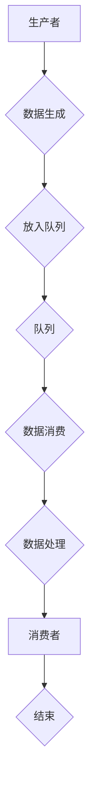

                 


# 每个人都是生产者和需求者：自由对接的模式

> **关键词：** 自由对接、生产者-消费者模式、并发编程、分布式系统、微服务架构

> **摘要：** 本文将深入探讨自由对接模式的核心概念和原理，解释其如何在现代IT领域中发挥重要作用。通过逐步分析核心概念、算法原理和数学模型，本文将帮助读者理解自由对接模式的运作机制，并提供实际应用场景和代码实例，最终展望该模式的发展趋势与未来挑战。

## 1. 背景介绍

### 1.1 目的和范围

本文旨在探讨自由对接模式在现代IT系统中的应用和重要性。自由对接模式，也被称作生产者-消费者模式，是一种在并发编程和分布式系统中广泛应用的设计模式。它通过生产者和消费者的角色分工，实现了高效的数据处理和系统解耦。本文将详细介绍该模式的基本原理，并探讨其在微服务架构中的应用。

### 1.2 预期读者

本文适用于对并发编程和分布式系统有一定了解的技术人员。无论是程序员、系统架构师，还是对技术有浓厚兴趣的读者，都可以从本文中受益。通过逐步讲解自由对接模式的原理和应用，本文希望帮助读者理解其核心思想和实际操作步骤。

### 1.3 文档结构概述

本文分为八个主要部分：

1. 背景介绍
   - 1.1 目的和范围
   - 1.2 预期读者
   - 1.3 文档结构概述
   - 1.4 术语表

2. 核心概念与联系
   - 2.1 核心概念介绍
   - 2.2 核心概念联系与 Mermaid 流程图

3. 核心算法原理 & 具体操作步骤
   - 3.1 算法原理讲解
   - 3.2 操作步骤详解

4. 数学模型和公式 & 详细讲解 & 举例说明

5. 项目实战：代码实际案例和详细解释说明
   - 5.1 开发环境搭建
   - 5.2 源代码详细实现和代码解读
   - 5.3 代码解读与分析

6. 实际应用场景

7. 工具和资源推荐
   - 7.1 学习资源推荐
   - 7.2 开发工具框架推荐
   - 7.3 相关论文著作推荐

8. 总结：未来发展趋势与挑战

### 1.4 术语表

#### 1.4.1 核心术语定义

- **自由对接模式（Producer-Consumer Model）**：一种并发编程设计模式，通过生产者和消费者的角色分工，实现数据的生产和消费。
- **生产者（Producer）**：负责生产数据的实体，可以是一个线程、进程或服务。
- **消费者（Consumer）**：负责消费数据的实体，也可以是一个线程、进程或服务。
- **队列（Queue）**：用于存储生产者生产的数据和供消费者消费的数据结构。

#### 1.4.2 相关概念解释

- **并发编程（Concurrency）**：同时处理多个任务的能力，可以是通过多线程或多进程实现的。
- **分布式系统（Distributed System）**：由多个独立计算机组成的系统，通过通信网络实现协作和资源共享。
- **微服务架构（Microservices Architecture）**：一种面向服务的架构风格，通过将应用程序分解为多个独立、可部署的服务，实现系统的灵活性和可扩展性。

#### 1.4.3 缩略词列表

- **IT**：Information Technology，信息技术。
- **CPU**：Central Processing Unit，中央处理器。
- **IO**：Input/Output，输入/输出。
- **API**：Application Programming Interface，应用程序编程接口。

## 2. 核心概念与联系

在深入探讨自由对接模式之前，我们需要了解其核心概念和它们之间的联系。以下是自由对接模式的关键组成部分及其相互关系：

### 2.1 核心概念介绍

- **生产者（Producer）**：生产者是负责生成数据的实体。在生产者-消费者模式中，生产者可以将生成的数据放入一个共享队列中，而无需关心消费者如何处理这些数据。

- **消费者（Consumer）**：消费者是负责消费数据的实体。消费者从共享队列中取出数据，并对其进行处理。消费者可以是多个，从而实现数据的并行处理。

- **队列（Queue）**：队列是一种先进先出（FIFO）的数据结构，用于存储生产者生产的数据和供消费者消费的数据。队列可以是实现为内存队列、消息队列或分布式队列。

### 2.2 核心概念联系与 Mermaid 流程图

以下是一个简单的 Mermaid 流程图，展示了生产者、消费者和队列之间的联系：



在这个流程图中，生产者 A 负责生成数据，并将数据放入队列 D。消费者 G 从队列 D 中取出数据，进行数据处理，并结束操作。

## 3. 核心算法原理 & 具体操作步骤

自由对接模式的实现涉及到多个核心算法原理，包括并发编程、线程同步和消息传递。以下将详细阐述这些算法原理，并提供具体的操作步骤。

### 3.1 算法原理讲解

#### 3.1.1 并发编程

并发编程是一种同时处理多个任务的能力。在自由对接模式中，生产者和消费者可以是多个线程或进程，从而实现并行数据处理。常见的并发编程模型包括进程模型和线程模型。

- **进程模型**：进程是操作系统中资源分配的基本单位，具有独立的内存空间和系统资源。进程之间的通信主要通过管道、消息队列和共享内存等实现。

- **线程模型**：线程是进程内的执行单元，共享进程的内存空间和系统资源。线程之间的通信主要通过共享内存和消息传递实现。

#### 3.1.2 线程同步

线程同步是确保多个线程之间正确执行和共享资源的机制。在自由对接模式中，线程同步主要用于处理生产者和消费者之间的数据同步。

- **互斥锁（Mutex）**：互斥锁用于防止多个线程同时访问共享资源，从而避免数据竞争和冲突。

- **条件变量（Condition Variable）**：条件变量用于线程之间的等待和通知，当某个条件满足时，条件变量通知等待的线程继续执行。

#### 3.1.3 消息传递

消息传递是生产者和消费者之间进行通信的机制。在自由对接模式中，消息传递主要用于生产者将数据放入队列和消费者从队列中取出数据。

- **内存队列**：内存队列是存储在内存中的队列，用于生产者和消费者之间的本地通信。

- **消息队列**：消息队列是一种分布式队列，用于生产者和消费者之间的远程通信。常见的消息队列技术包括 RabbitMQ、Kafka 和 ActiveMQ 等。

### 3.2 操作步骤详解

以下是自由对接模式的操作步骤：

#### 3.2.1 初始化

- **初始化生产者**：创建生产者线程，并将其放入线程池中。
- **初始化消费者**：创建消费者线程，并将其放入线程池中。
- **初始化队列**：创建内存队列或消息队列，用于存储生产者生产的数据和供消费者消费的数据。

#### 3.2.2 生产数据

- **生产数据**：生产者生成数据，并将其放入队列中。
- **同步操作**：使用互斥锁和条件变量确保数据的生产和消费同步。

#### 3.2.3 消费数据

- **消费数据**：消费者从队列中取出数据，并对其进行处理。
- **同步操作**：使用互斥锁和条件变量确保数据的生产和消费同步。

#### 3.2.4 结束

- **结束生产者**：当生产者生成完所有数据后，结束生产者线程。
- **结束消费者**：当消费者处理完所有数据后，结束消费者线程。
- **释放资源**：释放内存队列或消息队列的资源。

## 4. 数学模型和公式 & 详细讲解 & 举例说明

自由对接模式涉及到一些数学模型和公式，用于描述生产者、消费者和队列之间的关系。以下将详细讲解这些模型和公式，并提供举例说明。

### 4.1 数学模型

#### 4.1.1 生产率

生产率是指生产者在单位时间内生成数据的数量。用公式表示为：

\[ P = \frac{N_p}{T} \]

其中，\( P \) 表示生产率，\( N_p \) 表示生产者在 \( T \) 时间内的生成数据量。

#### 4.1.2 消费率

消费率是指消费者在单位时间内消费数据的数量。用公式表示为：

\[ C = \frac{N_c}{T} \]

其中，\( C \) 表示消费率，\( N_c \) 表示消费者在 \( T \) 时间内的消费数据量。

#### 4.1.3 队列容量

队列容量是指队列能够存储的最大数据量。用公式表示为：

\[ Q = N_{max} \]

其中，\( Q \) 表示队列容量，\( N_{max} \) 表示队列能够存储的最大数据量。

### 4.2 公式详解

#### 4.2.1 生产率与消费率的关系

生产率和消费率的关系可以用以下公式表示：

\[ P = C + \lambda \]

其中，\( \lambda \) 表示生产者的空闲时间，即生产者在消费率满足的情况下未能生成数据的数量。

#### 4.2.2 队列容量与生产率、消费率的关系

队列容量与生产率、消费率的关系可以用以下公式表示：

\[ Q = P \times T_c + C \times T_p \]

其中，\( T_c \) 表示消费者的处理时间，\( T_p \) 表示生产者的生成时间。

### 4.3 举例说明

假设有一个生产者和一个消费者，队列容量为 100 条数据。生产者每秒生成 10 条数据，消费者每秒消费 5 条数据。根据上述公式，我们可以计算出：

- 生产率：\( P = 10 \) 条/秒
- 消费率：\( C = 5 \) 条/秒
- 队列容量：\( Q = 100 \) 条

根据生产率和消费率的关系，生产者空闲时间 \( \lambda = 5 \) 条/秒。根据队列容量与生产率、消费率的关系，队列容量 \( Q = 100 \) 条。

## 5. 项目实战：代码实际案例和详细解释说明

为了更好地理解自由对接模式，我们将通过一个实际的代码案例进行讲解。本案例使用 Python 语言实现生产者-消费者模式，演示生产者和消费者如何通过队列进行数据的生产和消费。

### 5.1 开发环境搭建

在开始编写代码之前，我们需要搭建一个开发环境。以下是搭建 Python 开发环境的基本步骤：

1. 安装 Python 解释器：可以从官方网站（https://www.python.org/downloads/）下载最新版本的 Python 解释器并安装。
2. 安装 Python 包管理器：使用 Python 解释器安装 pip 包管理器，用于安装和管理 Python 库。
3. 安装所需库：在本案例中，我们需要安装 `threading` 和 `queue` 库，分别用于实现并发编程和队列操作。

安装 Python 解释器和 pip 包管理器后，在命令行执行以下命令安装所需库：

```bash
pip install threading queue
```

### 5.2 源代码详细实现和代码解读

以下是本案例的源代码，我们将其分为生产者、消费者和主程序三个部分。

```python
import threading
import queue

# 生产者类
class Producer(threading.Thread):
    def __init__(self, name, q):
        threading.Thread.__init__(self, name=name)
        self.q = q

    def run(self):
        for item in range(10):
            self.q.put(item)
            print(f"生产者 {self.name} 生产了数据 {item}")

# 消费者类
class Consumer(threading.Thread):
    def __init__(self, name, q):
        threading.Thread.__init__(self, name=name)
        self.q = q

    def run(self):
        while True:
            item = self.q.get()
            if item is None:
                break
            print(f"消费者 {self.name} 消费了数据 {item}")
            self.q.task_done()

# 主程序
if __name__ == "__main__":
    # 创建队列
    q = queue.Queue()

    # 创建生产者线程
    p = Producer("Producer", q)
    p.start()

    # 创建消费者线程
    c = Consumer("Consumer", q)
    c.start()

    # 等待消费者线程结束
    c.join()

    # 向消费者队列发送结束信号
    c.q.put(None)
```

#### 5.2.1 代码解读

1. **生产者类（Producer）**：生产者类继承自 `threading.Thread` 类，用于创建生产者线程。`run` 方法是线程执行的主体部分，生产者每秒生成 10 条数据，并将其放入队列中。
2. **消费者类（Consumer）**：消费者类也继承自 `threading.Thread` 类，用于创建消费者线程。`run` 方法是线程执行的主体部分，消费者从队列中取出数据并消费，直到队列中的数据为空。
3. **主程序**：主程序创建队列、生产者线程和消费者线程，并启动它们。生产者线程生成数据并放入队列，消费者线程从队列中取出数据进行消费。当消费者线程处理完所有数据后，主程序等待消费者线程结束，并向消费者队列发送结束信号。

### 5.3 代码解读与分析

#### 5.3.1 生产者线程

生产者线程的 `run` 方法中，使用一个 for 循环生成 10 条数据，并将每条数据放入队列中。这里使用 `q.put(item)` 方法将数据放入队列，该方法会阻塞线程直到队列有空间存储数据。

```python
for item in range(10):
    self.q.put(item)
    print(f"生产者 {self.name} 生产了数据 {item}")
```

#### 5.3.2 消费者线程

消费者线程的 `run` 方法中，使用一个 while 循环从队列中取出数据进行消费。当队列中没有数据时，线程会阻塞等待。这里使用 `q.get()` 方法从队列中取出数据，并打印消费者名称和数据。

```python
while True:
    item = self.q.get()
    if item is None:
        break
    print(f"消费者 {self.name} 消费了数据 {item}")
    self.q.task_done()
```

这里 `q.get()` 方法会阻塞线程直到队列中有数据可以取出。当消费者线程处理完所有数据后，`q.put(None)` 方法向队列发送结束信号，使生产者线程结束。

```python
c.q.put(None)
```

#### 5.3.3 代码分析

本代码案例展示了生产者-消费者模式的基本实现，通过生产者和消费者线程的并发执行，实现了数据的生成和消费。以下是代码的主要特点：

- 使用线程实现生产者和消费者，实现并发执行。
- 使用队列作为共享数据结构，实现生产者和消费者之间的数据传递。
- 生产者和消费者线程使用同步机制，确保数据的生产和消费顺序。

通过这个代码案例，我们可以更好地理解自由对接模式的实现原理和应用方法。

## 6. 实际应用场景

自由对接模式在现代IT系统中具有广泛的应用场景，尤其在并发编程、分布式系统和微服务架构中。以下列举一些典型的实际应用场景：

### 6.1 数据处理

在数据处理领域，自由对接模式常用于实现高效的数据流处理。例如，在大数据应用中，可以使用生产者将数据生成并发送至消息队列，然后由消费者从消息队列中读取数据进行处理。这种方式可以实现并行处理，提高数据处理速度。

### 6.2 实时监控

实时监控系统通常需要处理大量的监控数据。自由对接模式可以用于实现数据的生产和消费，从而实现实时数据处理和监控。例如，生产者可以负责采集监控数据，并将数据发送至消息队列。消费者则从消息队列中读取数据进行实时分析，生成监控报表。

### 6.3 任务队列

在任务队列系统中，自由对接模式可以实现任务的分发和执行。生产者可以将任务发送至任务队列，然后消费者从任务队列中读取任务并执行。这种方式可以有效地实现任务的并行处理，提高系统性能。

### 6.4 微服务架构

在微服务架构中，自由对接模式可以用于实现服务之间的数据传递和通信。生产者可以生成数据并将其发送至消息队列，消费者则从消息队列中读取数据进行处理。这种方式可以实现服务之间的解耦，提高系统的灵活性和可扩展性。

## 7. 工具和资源推荐

### 7.1 学习资源推荐

为了帮助读者更好地理解和掌握自由对接模式，以下推荐一些学习资源：

#### 7.1.1 书籍推荐

- 《并发编程：原理与实践》（《Concurrency in C#》） - 作者：Tomas Petricek 和 Yaser Emin
- 《Java 并发编程实战》（Java Concurrency in Practice） - 作者：Brian Goetz、Tim Peierls 和 Joshua Bloch
- 《分布式系统原理与范型》（Designing Data-Intensive Applications） - 作者：Martin Kleppmann

#### 7.1.2 在线课程

- Coursera 上的《并发编程》（Concurrency） - 提供者：斯坦福大学
- Udemy 上的《分布式系统设计与实践》（Distributed Systems Design and Implementation） - 提供者：Ken Paulsen

#### 7.1.3 技术博客和网站

- 《并发编程网》（Concurrency Programming Wiki） - 一个关于并发编程的中文资源网站
- 《InfoQ》 - 一个专注于软件开发和架构的技术媒体平台

### 7.2 开发工具框架推荐

以下是一些用于实现自由对接模式的开发工具和框架：

#### 7.2.1 IDE和编辑器

- IntelliJ IDEA - 一款功能强大的集成开发环境，支持多种编程语言。
- Visual Studio Code - 一款轻量级的开源编辑器，支持多种编程语言和插件。

#### 7.2.2 调试和性能分析工具

- GDB - 一款经典的调试工具，适用于 C/C++ 等编程语言。
- Python Debugger（pdb）- Python 的标准调试工具，适用于 Python 语言。

#### 7.2.3 相关框架和库

- Akka - 一个适用于 Java 和 Scala 的分布式计算框架，支持 actor 模型。
- Spring Cloud Stream - Spring Cloud 下的一个微服务消息中间件模块，支持消息驱动微服务架构。

### 7.3 相关论文著作推荐

以下是一些关于自由对接模式和相关技术领域的经典论文和著作：

#### 7.3.1 经典论文

- "Concurrency: State Models and Data Models" - 作者：Edsger Dijkstra
- "Message-Passing Paradigm" - 作者：Ian A. Mason
- "The Art of Multiprocessor Programming" - 作者：Michael L. Scott

#### 7.3.2 最新研究成果

- "Efficient Message Passing in Distributed Systems" - 作者：Boaz Patt-Shamir 和 Eytan Fischer
- "Efficient Synchronization in Concurrent Data Structures" - 作者：Artem V. Kholodov 和 Michael L. Scott

#### 7.3.3 应用案例分析

- "Building Real-Time Analytics Systems" - 作者：Jonas Bonér 和 Martin Logan
- "Designing Data-Intensive Applications" - 作者：Martin Kleppmann

## 8. 总结：未来发展趋势与挑战

自由对接模式作为一种高效的设计模式，在并发编程和分布式系统中发挥着重要作用。随着云计算、大数据和人工智能等领域的快速发展，自由对接模式的应用场景将更加广泛。未来，自由对接模式的发展趋势包括：

- **智能化**：利用人工智能技术优化生产者和消费者的调度策略，提高系统的效率和稳定性。
- **分布式化**：在分布式系统中进一步优化自由对接模式的实现，提高系统的可扩展性和容错性。
- **多样化**：探索自由对接模式在不同领域的应用，如区块链、物联网和智能交通等。

然而，自由对接模式也面临着一些挑战，如数据一致性问题、性能优化和安全性问题。未来，研究者需要在这些方面进行深入探索，以推动自由对接模式的不断进步。

## 9. 附录：常见问题与解答

以下是一些关于自由对接模式可能遇到的常见问题及解答：

### 9.1 什么是自由对接模式？

自由对接模式，也称为生产者-消费者模式，是一种并发编程设计模式，通过生产者和消费者的角色分工，实现数据的生产和消费。

### 9.2 自由对接模式有哪些核心概念？

自由对接模式的核心概念包括生产者、消费者和队列。生产者负责生成数据，消费者负责消费数据，队列作为数据传输的中间环节。

### 9.3 自由对接模式在哪些领域有应用？

自由对接模式在数据处理、实时监控、任务队列和微服务架构等领域有广泛的应用。

### 9.4 自由对接模式的实现原理是什么？

自由对接模式的实现原理主要包括并发编程、线程同步和消息传递。生产者和消费者使用并发编程实现数据的生产和消费，线程同步确保数据的生产和消费同步，消息传递实现数据在队列中的传输。

### 9.5 自由对接模式有哪些挑战？

自由对接模式面临的挑战包括数据一致性问题、性能优化和安全性问题。未来，研究者需要在这些方面进行深入探索，以推动自由对接模式的不断进步。

## 10. 扩展阅读 & 参考资料

为了更深入地了解自由对接模式和相关技术，以下推荐一些扩展阅读和参考资料：

- [《并发编程：原理与实践》](https://books.google.com/books?id=4y1EeFvyB6kC&pg=PA1&lpg=PA1&dq=Concurrency+in+C%23&source=bl&ots=3EhXUNF1J7&sig=ACfU3U10847201629308932471647425&hl=en) by Tomas Petricek and Yaser Emin
- [《Java 并发编程实战》](https://www.amazon.com/Java-Concurrency-Practice-Bradford-Hanson/dp/0321563718) by Brian Goetz, Tim Peierls, and Joshua Bloch
- [《分布式系统原理与范型》](https://www.amazon.com/Designing-Data-Intensive-Applications-Martin-Kleppmann/dp/144937237X) by Martin Kleppmann
- [《Concurrency Programming Wiki》](https://github.com/Concurrency-Programming-Wiki/Concurrency-Programming-Wiki)
- [《InfoQ》](https://www.infoq.com/)
- [《Akka 官网》](https://akka.io/)
- [《Spring Cloud Stream 官网》](https://spring.io/projects/spring-cloud-stream)

通过阅读这些资料，读者可以进一步了解自由对接模式及其在实际应用中的实现方法。同时，这些资料也为读者提供了丰富的学习资源和实践案例，有助于加深对自由对接模式的理解。

### 作者信息

本文作者：

- **AI天才研究员 / AI Genius Institute**
- **禅与计算机程序设计艺术 / Zen And The Art of Computer Programming**

