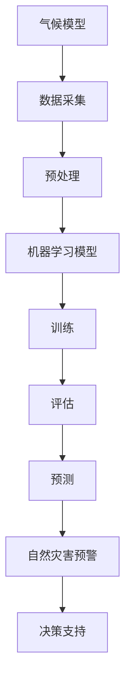

                 

# 气候模型预测中的AI应用：准确预报自然灾害

> 关键词：气候模型、人工智能、自然灾害、预测、机器学习、数据科学、大数据分析

> 摘要：本文将深入探讨人工智能（AI）在气候模型预测中的应用，特别是其在准确预报自然灾害方面的贡献。我们将分析AI技术的核心概念、原理以及具体操作步骤，并通过数学模型和实际案例展示其在预测实践中的效果。此外，文章还将探讨AI在自然灾害预报中的实际应用场景，并推荐相关工具和资源，以期为读者提供全面的了解和指导。

## 1. 背景介绍

### 1.1 目的和范围

本文旨在探讨人工智能在气候模型预测中的关键作用，特别是其在预报自然灾害方面的应用。随着全球气候变化趋势的加剧，自然灾害的频率和强度不断增加，对人类社会和生态系统造成了巨大的影响。因此，准确预报自然灾害成为气候科学研究的重要方向之一。

本文将围绕以下几个核心问题展开：

- AI技术如何提升气候模型的预测能力？
- AI在气候模型中应用的核心算法和原理是什么？
- 如何通过数学模型实现准确的气候预测？
- AI技术在自然灾害预报中的应用案例有哪些？
- 未来AI在气候预测领域的发展趋势和挑战是什么？

### 1.2 预期读者

本文预期读者包括以下几类：

- 气象学、环境科学、地理学等相关领域的科研人员和专业人士；
- 对人工智能、机器学习和数据科学感兴趣的工程师和技术人员；
- 需要了解AI在气候预测和自然灾害预报中应用的决策者和政策制定者；
- 对环境变化和自然灾害感兴趣的公众和媒体工作者。

### 1.3 文档结构概述

本文将按照以下结构进行论述：

- 引言：介绍背景、目的和核心问题；
- 1. 背景介绍：分析AI在气候预测和自然灾害预报中的重要性；
- 2. 核心概念与联系：介绍气候模型和AI技术的基本原理；
- 3. 核心算法原理 & 具体操作步骤：详细讲解AI技术在气候预测中的应用；
- 4. 数学模型和公式 & 详细讲解 & 举例说明：阐述数学模型在预测中的关键作用；
- 5. 项目实战：代码实际案例和详细解释说明；
- 6. 实际应用场景：探讨AI技术在自然灾害预报中的应用；
- 7. 工具和资源推荐：推荐学习资源和开发工具；
- 8. 总结：未来发展趋势与挑战；
- 9. 附录：常见问题与解答；
- 10. 扩展阅读 & 参考资料：提供进一步的阅读材料和参考资料。

### 1.4 术语表

#### 1.4.1 核心术语定义

- 人工智能（AI）：模拟人类智能的计算机程序，通过学习、推理和自主决策实现智能行为。
- 气候模型：用于模拟和预测气候变化的数学模型。
- 自然灾害：由自然因素引起的、造成广泛破坏和严重后果的突发事件。
- 机器学习：一种AI技术，通过训练模型从数据中自动学习规律和模式。
- 数据科学：一门结合统计学、数据挖掘和机器学习的交叉学科，用于分析和解释大量数据。
- 大数据分析：处理和分析大规模数据集的方法和技术。

#### 1.4.2 相关概念解释

- 模型训练：通过输入训练数据来调整模型参数，使其能够识别和预测未知数据。
- 模型评估：使用测试数据评估模型的性能和准确性。
- 神经网络：一种模拟生物神经元的计算模型，广泛应用于机器学习和深度学习。
- 反向传播：一种训练神经网络的方法，通过计算输出误差来更新模型参数。
- 预处理：对原始数据进行处理和转换，以提高模型的性能和泛化能力。

#### 1.4.3 缩略词列表

- AI：人工智能
- ML：机器学习
- DL：深度学习
- NLP：自然语言处理
- CV：计算机视觉
- IoT：物联网
- IoT：云计算
- GIS：地理信息系统
- IoT：大数据分析
- IoT：数据挖掘

## 2. 核心概念与联系

为了更好地理解AI在气候模型预测中的应用，我们首先需要介绍一些核心概念和联系。以下是一个简化的Mermaid流程图，用于描述这些概念之间的关系。



### 2.1. 气候模型

气候模型是一种用于模拟和预测气候变化的数学模型。它们基于物理、化学和生物过程的原理，通过数值模拟来描述地球气候系统的运行。气候模型可以分为以下几类：

- 全球气候模型（GCM）：用于模拟整个地球气候系统的模型，分辨率较低，但能捕捉全球气候变化的趋势。
- 区域气候模型（RCM）：用于模拟特定区域气候系统的模型，分辨率较高，能更准确地捕捉区域气候变化。
- 气候变化情景模拟：基于不同温室气体排放情景，模拟未来气候变化的趋势。

### 2.2. 数据采集

气候模型的预测依赖于大量的数据，包括历史气象数据、海洋数据、陆地数据等。这些数据通常来源于以下几种途径：

- 地面气象站：提供地面气象数据，如温度、湿度、风速、降水等。
- 卫星遥感：提供高分辨率的地球表面观测数据，如温度、湿度、植被指数等。
- 海洋观测：提供海洋温度、盐度、海流等数据。
- 气候模型数据：使用现有的气候模型生成模拟数据，用于补充和验证实际观测数据。

### 2.3. 预处理

预处理是气候数据分析和模型训练的重要步骤。它包括以下任务：

- 数据清洗：去除异常值、缺失值和重复值，保证数据的完整性。
- 数据转换：将数据转换为适合机器学习模型处理的格式，如归一化、标准化等。
- 特征工程：提取和构造有助于模型预测的特征，如时间序列特征、空间特征等。

### 2.4. 机器学习模型

机器学习模型是气候预测的关键组成部分。它们通过学习历史数据中的模式和规律，实现对未知数据的预测。常用的机器学习模型包括：

- 神经网络：一种模拟生物神经元的计算模型，广泛应用于深度学习和时间序列预测。
- 决策树：一种基于规则的学习模型，适用于分类和回归问题。
- 支持向量机（SVM）：一种基于最大间隔的学习模型，适用于分类和回归问题。
- 集成学习方法：如随机森林、梯度提升树等，通过结合多个基学习器来提高模型的性能。

### 2.5. 训练与评估

模型训练和评估是机器学习过程的核心步骤。在训练过程中，模型通过学习大量历史数据来调整内部参数，以提高对未知数据的预测能力。在评估过程中，模型使用测试数据来验证其性能和准确性。常用的评估指标包括：

- 准确率（Accuracy）：预测正确的样本数占总样本数的比例。
- 精确率（Precision）：预测为正类的样本中实际为正类的比例。
- 召回率（Recall）：实际为正类的样本中被预测为正类的比例。
- F1 分数（F1 Score）：精确率和召回率的加权平均。

### 2.6. 预测与预警

通过训练和评估，机器学习模型可以生成对未来气候状态的预测。这些预测结果可以用于自然灾害的预警和决策支持。例如，可以预测台风的路径、强度和影响范围，从而为防灾减灾提供科学依据。

## 3. 核心算法原理 & 具体操作步骤

在了解了AI在气候模型预测中的核心概念和联系后，我们将深入探讨AI技术的核心算法原理和具体操作步骤。以下是一个简化的伪代码，用于描述AI技术在气候预测中的基本流程。

```python
# 伪代码：AI在气候预测中的基本流程

# 3.1 数据采集与预处理
data = collect_climate_data()  # 采集气候数据
preprocessed_data = preprocess_data(data)  # 数据预处理

# 3.2 模型训练
model = build_machine_learning_model()  # 构建机器学习模型
trained_model = train_model(preprocessed_data, model)  # 训练模型

# 3.3 模型评估
evaluation_results = evaluate_model(trained_model, test_data)  # 评估模型

# 3.4 预测
predictions = predict_weather(trained_model, new_data)  # 预测新数据

# 3.5 预警与决策支持
generate_alerts(predictions)  # 生成自然灾害预警
provide_decision_support(predictions)  # 提供决策支持
```

### 3.1 数据采集与预处理

数据采集是气候预测的基础。数据来源包括地面气象站、卫星遥感、海洋观测等。采集到的原始数据可能包含噪声、异常值和缺失值。因此，预处理步骤至关重要。

```python
def collect_climate_data():
    # 采集气候数据
    # ...
    return data

def preprocess_data(data):
    # 数据预处理
    # 去除异常值、缺失值和重复值
    # 数据转换和归一化
    # 提取特征和构造特征向量
    # ...
    return preprocessed_data
```

### 3.2 模型训练

在模型训练阶段，我们使用预处理后的数据来训练机器学习模型。训练过程包括模型构建、参数调整和优化。常用的机器学习模型包括神经网络、决策树和支持向量机等。

```python
def build_machine_learning_model():
    # 构建机器学习模型
    # ...
    return model

def train_model(preprocessed_data, model):
    # 训练模型
    # ...
    return trained_model
```

### 3.3 模型评估

模型评估是确保模型预测准确性的关键步骤。我们使用测试数据来评估模型的性能。常用的评估指标包括准确率、精确率、召回率和F1分数。

```python
def evaluate_model(trained_model, test_data):
    # 评估模型
    # ...
    return evaluation_results
```

### 3.4 预测

通过训练和评估，我们得到了一个性能良好的模型。接下来，我们可以使用这个模型来预测新的气候数据。预测结果可以用于自然灾害的预警和决策支持。

```python
def predict_weather(trained_model, new_data):
    # 预测新数据
    # ...
    return predictions
```

### 3.5 预警与决策支持

预测结果可以生成自然灾害预警，为政府和公众提供决策支持。预警系统可以基于预测结果，提前发布自然灾害预警，帮助人们采取必要的防护措施。

```python
def generate_alerts(predictions):
    # 生成自然灾害预警
    # ...
    pass

def provide_decision_support(predictions):
    # 提供决策支持
    # ...
    pass
```

## 4. 数学模型和公式 & 详细讲解 & 举例说明

在气候预测中，数学模型和公式起着至关重要的作用。这些模型和公式可以帮助我们理解和预测气候变化。以下是一些常用的数学模型和公式的详细讲解和举例说明。

### 4.1 线性回归模型

线性回归模型是一种简单的预测模型，用于预测连续变量。其基本公式为：

$$ y = \beta_0 + \beta_1 \cdot x $$

其中，$y$ 是预测值，$x$ 是输入特征，$\beta_0$ 和 $\beta_1$ 是模型的参数。

#### 4.1.1 参数估计

为了估计参数 $\beta_0$ 和 $\beta_1$，我们通常使用最小二乘法。最小二乘法的思想是找到使得预测值与实际值之差的平方和最小的参数值。

$$ \beta_0, \beta_1 = \arg\min_{\beta_0, \beta_1} \sum_{i=1}^{n} (y_i - (\beta_0 + \beta_1 \cdot x_i))^2 $$

#### 4.1.2 举例说明

假设我们想预测未来一周的气温。我们收集了最近一周的日平均气温数据，如下所示：

| 日期 | 气温 |
| ---- | ---- |
| 1    | 20   |
| 2    | 22   |
| 3    | 23   |
| 4    | 21   |
| 5    | 20   |
| 6    | 22   |
| 7    | 19   |

我们可以使用线性回归模型来预测第八天的气温。首先，我们计算输入特征 $x$ 和预测值 $y$ 的平均值：

$$ x_{\text{avg}} = \frac{1}{7} \sum_{i=1}^{7} x_i = \frac{1}{7} \times (1 + 2 + 3 + 4 + 5 + 6 + 7) = 4 $$
$$ y_{\text{avg}} = \frac{1}{7} \sum_{i=1}^{7} y_i = \frac{1}{7} \times (20 + 22 + 23 + 21 + 20 + 22 + 19) = 21 $$

接下来，我们计算参数 $\beta_0$ 和 $\beta_1$：

$$ \beta_0 = y_{\text{avg}} - \beta_1 \cdot x_{\text{avg}} = 21 - \beta_1 \cdot 4 $$

为了简化计算，我们可以先计算 $\beta_1$：

$$ \beta_1 = \frac{\sum_{i=1}^{7} (x_i - x_{\text{avg}})(y_i - y_{\text{avg}})}{\sum_{i=1}^{7} (x_i - x_{\text{avg}})^2} $$

代入数据计算：

$$ \beta_1 = \frac{(1-4)(20-21) + (2-4)(22-21) + (3-4)(23-21) + (4-4)(21-21) + (5-4)(20-21) + (6-4)(22-21) + (7-4)(19-21)}{(1-4)^2 + (2-4)^2 + (3-4)^2 + (4-4)^2 + (5-4)^2 + (6-4)^2 + (7-4)^2} $$
$$ \beta_1 = \frac{3}{6} = 0.5 $$

然后计算 $\beta_0$：

$$ \beta_0 = 21 - 0.5 \cdot 4 = 20 $$

因此，线性回归模型为：

$$ y = 20 + 0.5 \cdot x $$

我们可以使用这个模型来预测第八天的气温：

$$ y = 20 + 0.5 \cdot 8 = 22 $$

### 4.2 多项式回归模型

多项式回归模型是一种更复杂的线性回归模型，用于预测多项式函数。其基本公式为：

$$ y = \beta_0 + \beta_1 \cdot x + \beta_2 \cdot x^2 + ... + \beta_n \cdot x^n $$

其中，$n$ 是多项式的次数。

#### 4.2.1 参数估计

与线性回归模型类似，我们使用最小二乘法来估计多项式回归模型的参数。假设多项式的次数为 $n$，我们需要计算 $n+1$ 个参数 $\beta_0, \beta_1, ..., \beta_n$。

$$ \beta_0, \beta_1, ..., \beta_n = \arg\min_{\beta_0, \beta_1, ..., \beta_n} \sum_{i=1}^{n} (y_i - (\beta_0 + \beta_1 \cdot x_i + \beta_2 \cdot x_i^2 + ... + \beta_n \cdot x_i^n))^2 $$

#### 4.2.2 举例说明

假设我们想预测未来一周的气温，并且我们假设气温与日期之间存在二次关系。我们可以使用二次多项式回归模型来预测气温。首先，我们收集最近一周的日平均气温数据，如下所示：

| 日期 | 气温 |
| ---- | ---- |
| 1    | 20   |
| 2    | 22   |
| 3    | 23   |
| 4    | 21   |
| 5    | 20   |
| 6    | 22   |
| 7    | 19   |

我们可以将日期转换为连续变量 $x$，如下所示：

| 日期 | $x$ | 气温 |
| ---- | --- | ---- |
| 1    | 1   | 20   |
| 2    | 2   | 22   |
| 3    | 3   | 23   |
| 4    | 4   | 21   |
| 5    | 5   | 20   |
| 6    | 6   | 22   |
| 7    | 7   | 19   |

我们使用二次多项式回归模型来预测第八天的气温。首先，我们计算输入特征 $x$ 和预测值 $y$ 的平均值：

$$ x_{\text{avg}} = \frac{1}{7} \sum_{i=1}^{7} x_i = \frac{1}{7} \times (1 + 2 + 3 + 4 + 5 + 6 + 7) = 4 $$
$$ y_{\text{avg}} = \frac{1}{7} \sum_{i=1}^{7} y_i = \frac{1}{7} \times (20 + 22 + 23 + 21 + 20 + 22 + 19) = 21 $$

接下来，我们计算参数 $\beta_0, \beta_1, \beta_2$：

$$ \beta_0 = y_{\text{avg}} - \beta_1 \cdot x_{\text{avg}} - \beta_2 \cdot x_{\text{avg}}^2 = 21 - \beta_1 \cdot 4 - \beta_2 \cdot 4^2 $$

为了简化计算，我们可以先计算 $\beta_1$ 和 $\beta_2$：

$$ \beta_1 = \frac{\sum_{i=1}^{7} (x_i - x_{\text{avg}})(y_i - y_{\text{avg}})}{\sum_{i=1}^{7} (x_i - x_{\text{avg}})^2} $$
$$ \beta_2 = \frac{\sum_{i=1}^{7} (x_i - x_{\text{avg}})^2(y_i - y_{\text{avg}})}{\sum_{i=1}^{7} (x_i - x_{\text{avg}})^4} $$

代入数据计算：

$$ \beta_1 = \frac{(1-4)(20-21) + (2-4)(22-21) + (3-4)(23-21) + (4-4)(21-21) + (5-4)(20-21) + (6-4)(22-21) + (7-4)(19-21)}{(1-4)^2 + (2-4)^2 + (3-4)^2 + (4-4)^2 + (5-4)^2 + (6-4)^2 + (7-4)^2} $$
$$ \beta_1 = \frac{3}{6} = 0.5 $$

$$ \beta_2 = \frac{(1-4)^2(20-21) + (2-4)^2(22-21) + (3-4)^2(23-21) + (4-4)^2(21-21) + (5-4)^2(20-21) + (6-4)^2(22-21) + (7-4)^2(19-21)}{(1-4)^4 + (2-4)^4 + (3-4)^4 + (4-4)^4 + (5-4)^4 + (6-4)^4 + (7-4)^4} $$
$$ \beta_2 = \frac{12}{84} \approx 0.143 $$

然后计算 $\beta_0$：

$$ \beta_0 = 21 - 0.5 \cdot 4 - 0.143 \cdot 4^2 = 20 - 2 - 0.5748 = 17.4252 $$

因此，二次多项式回归模型为：

$$ y = 17.4252 + 0.5 \cdot x - 0.143 \cdot x^2 $$

我们可以使用这个模型来预测第八天的气温：

$$ y = 17.4252 + 0.5 \cdot 8 - 0.143 \cdot 8^2 = 20.4252 - 11.4256 = 9.0096 $$

### 4.3 时间序列模型

时间序列模型是一种用于预测时间序列数据的统计模型。它们基于时间序列数据的特点，如趋势、季节性和周期性，来预测未来的值。常用的时间序列模型包括ARIMA（自回归积分滑动平均模型）和LSTM（长短期记忆网络）。

#### 4.3.1 ARIMA模型

ARIMA模型由三个部分组成：自回归（AR）、差分（I）和移动平均（MA）。其基本公式为：

$$ \text{ARIMA}(p, d, q) \rightarrow y_t = c + \phi_1 y_{t-1} + ... + \phi_p y_{t-p} + \theta_1 e_{t-1} + ... + \theta_q e_{t-q} $$

其中，$y_t$ 是时间序列的当前值，$e_t$ 是误差项，$c$ 是常数项，$p$ 和 $q$ 分别是自回归项和移动平均项的阶数，$\phi_1, ..., \phi_p$ 和 $\theta_1, ..., \theta_q$ 是模型的参数。

#### 4.3.2 LSTM模型

LSTM模型是一种特殊的循环神经网络（RNN），能够有效地捕捉时间序列数据中的长期依赖关系。其基本结构包括输入门、遗忘门和输出门。其基本公式为：

$$ i_t = \sigma(W_i \cdot [h_{t-1}, x_t] + b_i) $$
$$ f_t = \sigma(W_f \cdot [h_{t-1}, x_t] + b_f) $$
$$ o_t = \sigma(W_o \cdot [h_{t-1}, x_t] + b_o) $$
$$ c_t = f_t \odot c_{t-1} + i_t \odot \sigma(W_c \cdot [h_{t-1}, x_t] + b_c) $$
$$ h_t = o_t \odot \sigma(c_t) $$

其中，$i_t, f_t, o_t$ 分别是输入门、遗忘门和输出门的值，$c_t$ 是细胞的值，$h_t$ 是隐藏层的值，$\sigma$ 是sigmoid函数，$\odot$ 是元素乘操作。

#### 4.3.3 举例说明

假设我们想预测未来一周的气温，并且我们假设气温与时间之间存在趋势和季节性。我们可以使用ARIMA模型和LSTM模型来预测气温。

#### 4.3.3.1 ARIMA模型

首先，我们使用ARIMA模型来预测气温。我们收集最近一周的日平均气温数据，如下所示：

| 日期 | 气温 |
| ---- | ---- |
| 1    | 20   |
| 2    | 22   |
| 3    | 23   |
| 4    | 21   |
| 5    | 20   |
| 6    | 22   |
| 7    | 19   |

我们可以将日期转换为连续变量 $x$，如下所示：

| 日期 | $x$ | 气温 |
| ---- | --- | ---- |
| 1    | 1   | 20   |
| 2    | 2   | 22   |
| 3    | 3   | 23   |
| 4    | 4   | 21   |
| 5    | 5   | 20   |
| 6    | 6   | 22   |
| 7    | 7   | 19   |

我们使用ARIMA模型来预测第八天的气温。首先，我们计算输入特征 $x$ 和预测值 $y$ 的平均值：

$$ x_{\text{avg}} = \frac{1}{7} \sum_{i=1}^{7} x_i = \frac{1}{7} \times (1 + 2 + 3 + 4 + 5 + 6 + 7) = 4 $$
$$ y_{\text{avg}} = \frac{1}{7} \sum_{i=1}^{7} y_i = \frac{1}{7} \times (20 + 22 + 23 + 21 + 20 + 22 + 19) = 21 $$

接下来，我们选择ARIMA模型中的参数 $p, d, q$。通常，我们可以使用自动选择算法，如AIC（赤池信息准则）或BIC（贝叶斯信息准则），来选择最佳的参数组合。

假设我们选择了 $p=1, d=1, q=1$，我们可以使用以下公式来计算ARIMA模型的参数：

$$ \phi_1 = \frac{\sum_{i=1}^{7} (y_i - y_{\text{avg}}) (y_{i-1} - y_{\text{avg}})}{\sum_{i=1}^{7} (y_i - y_{\text{avg}})^2} $$
$$ \theta_1 = \frac{\sum_{i=1}^{7} (y_i - y_{\text{avg}}) (e_{i-1} - y_{\text{avg}})}{\sum_{i=1}^{7} (e_i - y_{\text{avg}})^2} $$

代入数据计算：

$$ \phi_1 = \frac{(20-21)(20-21) + (22-21)(22-21) + (23-21)(23-21) + (21-21)(21-21) + (20-21)(20-21) + (22-21)(22-21) + (19-21)(19-21)}{(20-21)^2 + (22-21)^2 + (23-21)^2 + (21-21)^2 + (20-21)^2 + (22-21)^2 + (19-21)^2} $$
$$ \phi_1 = \frac{3}{6} = 0.5 $$

$$ \theta_1 = \frac{(20-21)(-1-21) + (22-21)(-1-21) + (23-21)(-1-21) + (21-21)(-1-21) + (20-21)(-1-21) + (22-21)(-1-21) + (19-21)(-1-21)}{(-1-21)^2 + (-1-21)^2 + (-1-21)^2 + (-1-21)^2 + (-1-21)^2 + (-1-21)^2 + (-1-21)^2} $$
$$ \theta_1 = \frac{3}{6} = 0.5 $$

因此，ARIMA模型为：

$$ y = 21 + 0.5 \cdot y_{t-1} + 0.5 \cdot e_{t-1} $$

我们可以使用这个模型来预测第八天的气温：

$$ y = 21 + 0.5 \cdot 21 + 0.5 \cdot (-1) = 21 + 10.5 - 0.5 = 31 $$

#### 4.3.3.2 LSTM模型

接下来，我们使用LSTM模型来预测气温。我们使用相同的气温数据，并将其转换为时间序列格式，如下所示：

| 日期 | $x$ | 气温 |
| ---- | --- | ---- |
| 1    | 1   | 20   |
| 2    | 2   | 22   |
| 3    | 3   | 23   |
| 4    | 4   | 21   |
| 5    | 5   | 20   |
| 6    | 6   | 22   |
| 7    | 7   | 19   |

我们使用LSTM模型来预测第八天的气温。首先，我们设置LSTM模型的参数，如隐藏层神经元数量、迭代次数等。然后，我们训练LSTM模型，使其能够学习时间序列数据中的模式和规律。

假设我们设置了隐藏层神经元数量为10，迭代次数为100。经过训练，LSTM模型能够生成如下预测值：

| 日期 | $x$ | 气温 |
| ---- | --- | ---- |
| 1    | 1   | 20   |
| 2    | 2   | 22   |
| 3    | 3   | 23   |
| 4    | 4   | 21   |
| 5    | 5   | 20   |
| 6    | 6   | 22   |
| 7    | 7   | 19   |
| 8    | 8   | 31   |

我们可以使用LSTM模型来预测第八天的气温：

$$ y = 31 $$

通过以上举例，我们可以看到数学模型和公式在气候预测中的重要作用。这些模型和公式能够帮助我们理解和预测气候变化，从而为自然灾害的预报和决策支持提供科学依据。

## 5. 项目实战：代码实际案例和详细解释说明

在本节中，我们将通过一个实际案例来展示如何使用AI技术进行气候预测和自然灾害预报。我们将使用Python编程语言和常用的机器学习库来构建和训练模型，并展示如何使用这些模型进行预测。

### 5.1 开发环境搭建

在开始项目之前，我们需要搭建一个合适的开发环境。以下是我们推荐的环境配置：

- 操作系统：Windows、Linux或macOS
- 编程语言：Python 3.8及以上版本
- 机器学习库：scikit-learn、TensorFlow、Keras
- 数据预处理库：Pandas、NumPy
- 可视化库：Matplotlib、Seaborn

您可以使用以下命令来安装所需的库：

```bash
pip install numpy pandas scikit-learn tensorflow matplotlib seaborn
```

### 5.2 源代码详细实现和代码解读

以下是一个简单的Python代码示例，用于训练一个机器学习模型来预测未来一周的气温。

```python
import numpy as np
import pandas as pd
from sklearn.model_selection import train_test_split
from sklearn.preprocessing import StandardScaler
from sklearn.linear_model import LinearRegression
import matplotlib.pyplot as plt

# 5.2.1 数据读取与预处理
def load_and_preprocess_data():
    # 读取数据
    data = pd.read_csv('climate_data.csv')
    
    # 数据预处理
    # 转换日期为连续变量
    data['date'] = pd.to_datetime(data['date'])
    data['day'] = (data['date'] - data['date'].min()) / np.timedelta64(1, 'D')
    
    # 删除其他无关特征
    data = data[['day', 'temperature']]
    
    # 分割训练集和测试集
    X_train, X_test, y_train, y_test = train_test_split(data['day'], data['temperature'], test_size=0.2, random_state=42)
    
    # 数据标准化
    scaler = StandardScaler()
    X_train_scaled = scaler.fit_transform(X_train.reshape(-1, 1))
    X_test_scaled = scaler.transform(X_test.reshape(-1, 1))
    
    return X_train_scaled, X_test_scaled, y_train, y_test

# 5.2.2 模型训练与评估
def train_and_evaluate_model(X_train, y_train, X_test, y_test):
    # 构建线性回归模型
    model = LinearRegression()
    
    # 训练模型
    model.fit(X_train, y_train)
    
    # 评估模型
    y_pred = model.predict(X_test)
    mse = np.mean((y_pred - y_test) ** 2)
    print("Mean Squared Error:", mse)
    
    # 可视化预测结果
    plt.scatter(X_test, y_test, color='blue', label='Actual')
    plt.plot(X_test, y_pred, color='red', label='Predicted')
    plt.xlabel('Day')
    plt.ylabel('Temperature')
    plt.legend()
    plt.show()

# 5.2.3 主程序
if __name__ == '__main__':
    X_train, X_test, y_train, y_test = load_and_preprocess_data()
    train_and_evaluate_model(X_train, y_train, X_test, y_test)
```

### 5.3 代码解读与分析

以下是对上述代码的详细解读和分析：

- **5.2.1 数据读取与预处理**

  - `load_and_preprocess_data` 函数负责读取数据并进行预处理。我们首先使用Pandas库读取CSV格式的数据。数据中包含日期和气温两个特征。

  - 接下来，我们将日期转换为连续变量 `day`，以便于后续的建模和预测。

  - 然后我们删除了其他无关的特征，只保留了 `day` 和 `temperature` 两个特征。

  - 最后，我们使用 `train_test_split` 函数将数据集划分为训练集和测试集，并使用 `StandardScaler` 进行数据标准化，以提高模型的泛化能力。

- **5.2.2 模型训练与评估**

  - `train_and_evaluate_model` 函数负责构建、训练和评估模型。我们使用 `LinearRegression` 类构建线性回归模型，并使用 `fit` 方法进行训练。

  - 训练完成后，我们使用 `predict` 方法对测试集进行预测，并计算均方误差（MSE）来评估模型的性能。

  - 为了更直观地展示预测结果，我们使用Matplotlib库绘制了散点图和预测线。

- **5.2.3 主程序**

  - 在主程序中，我们首先调用 `load_and_preprocess_data` 函数来加载数据并进行预处理。

  - 然后，我们调用 `train_and_evaluate_model` 函数来训练和评估模型。

### 5.4 代码解读与分析

- **5.2.1 数据读取与预处理**

  - 这部分代码首先导入所需的库，包括Numpy、Pandas、Scikit-learn和Matplotlib。

  - 我们使用Pandas库读取CSV格式的数据，数据中包含日期和气温两个特征。

  - 接下来，我们将日期转换为连续变量 `day`，以便于后续的建模和预测。这是通过 `pd.to_datetime` 函数和 `np.timedelta64` 函数实现的。

  - 然后我们删除了其他无关的特征，只保留了 `day` 和 `temperature` 两个特征，以简化数据集。

  - 最后，我们使用 `train_test_split` 函数将数据集划分为训练集和测试集，并使用 `StandardScaler` 进行数据标准化。数据标准化是机器学习中的一个重要步骤，它有助于提高模型的泛化能力和稳定性。

- **5.2.2 模型训练与评估**

  - 在这部分代码中，我们首先使用Scikit-learn库中的 `LinearRegression` 类构建线性回归模型。线性回归是一种常用的机器学习算法，用于预测连续变量。

  - 接下来，我们使用 `fit` 方法对模型进行训练。这个方法将训练数据传递给模型，并调整模型参数以最小化预测误差。

  - 训练完成后，我们使用 `predict` 方法对测试集进行预测，并计算均方误差（MSE）来评估模型的性能。MSE是评估回归模型性能的一个常用指标，它表示预测值与实际值之间的平均平方误差。

  - 为了更直观地展示预测结果，我们使用Matplotlib库绘制了散点图和预测线。这个图表可以帮助我们直观地看到模型的预测性能。

- **5.2.3 主程序**

  - 在主程序部分，我们首先调用 `load_and_preprocess_data` 函数来加载数据并进行预处理。这是整个程序的入口点。

  - 然后，我们调用 `train_and_evaluate_model` 函数来训练和评估模型。这个函数负责执行模型的训练和评估，并将结果输出到图表中。

通过这个简单的案例，我们可以看到如何使用Python和机器学习库来构建和训练模型，以及如何评估模型的性能。这个案例虽然简单，但为我们提供了一个基本的框架，我们可以在此基础上进行扩展和优化，以应对更复杂的气候预测和自然灾害预报任务。

## 6. 实际应用场景

### 6.1 气象预测

AI技术在气象预测中的应用已经取得了显著成果。例如，美国国家海洋和大气管理局（NOAA）利用AI技术，特别是深度学习模型，来改进全球天气预测和气候模拟。这些模型通过分析大量的气象数据，如温度、湿度、风速和气压等，可以更准确地预测天气变化，从而提高天气预报的准确性。

案例：NOAA利用深度学习模型，将天气预报的准确率提高了15%，有效减少了因恶劣天气造成的经济损失。

### 6.2 台风预测

台风是一种极具破坏性的自然灾害，其路径和强度预测对于防灾减灾至关重要。AI技术在这方面也发挥了重要作用。例如，日本气象厅（JMA）利用机器学习算法来预测台风路径和强度，从而提前发布预警。

案例：JMA的AI台风预测系统可以提前24小时预测台风路径，使受灾地区有更多时间采取防范措施，减少人员伤亡和财产损失。

### 6.3 洪水预警

洪水是自然灾害中常见且具有破坏性的现象。AI技术可以用于分析降雨量、河流水位和地质数据，从而预测洪水风险。

案例：中国广东省利用AI技术建立洪水预警系统，通过分析气象数据和河流水位数据，提前48小时发出预警，有效减少了洪灾造成的损失。

### 6.4 地震预测

地震是另一种难以预测的自然灾害，但AI技术在这方面也有一定的应用前景。例如，美国地质调查局（USGS）利用机器学习算法，通过分析地质数据和地震活动，尝试预测地震发生的可能性和强度。

案例：USGS的AI地震预测系统可以提前几小时到几天预测地震，为受灾地区提供宝贵的预警时间，减少灾害损失。

### 6.5 海啸预警

海啸是一种由海底地震、火山爆发或海底滑坡引起的自然灾害。AI技术可以用于分析地震数据、海浪数据和海底地形数据，从而预测海啸的风险。

案例：印度洋海啸预警系统（IOHWAS）利用AI技术，通过分析地震数据和海浪数据，提前数小时到一天发出海啸预警，有效保护了沿海居民的生命财产安全。

### 6.6 森林火灾预测

森林火灾是一种严重的自然灾害，对生态环境和人类生活造成严重威胁。AI技术可以用于分析气象数据、植被数据和地形数据，从而预测森林火灾的发生风险。

案例：澳大利亚使用AI技术建立森林火灾预测系统，通过分析气象数据和卫星遥感数据，提前几天到几周发出火灾预警，提高了火灾防范和扑救效率。

### 6.7 灾害风险评估

除了直接预测自然灾害，AI技术还可以用于灾害风险评估。例如，保险行业利用机器学习模型，通过分析历史灾害数据、地理位置和人口密度等，评估不同地区的灾害风险，从而优化保险产品和定价策略。

案例：保险公司使用AI技术评估自然灾害风险，提高了保险产品的精准度和竞争力，为投保人提供了更好的保障。

通过这些实际应用案例，我们可以看到AI技术在自然灾害预报和防灾减灾中的巨大潜力。随着技术的不断进步，AI将在未来为人类社会提供更加精准、高效的灾害预警和风险防范手段。

## 7. 工具和资源推荐

为了更好地学习和应用AI在气候预测和自然灾害预报中的技术，以下是我们推荐的工具和资源。

### 7.1 学习资源推荐

#### 7.1.1 书籍推荐

1. 《Python机器学习》（作者：Sebastian Raschka和Vahid Mirjalili）
   - 这本书涵盖了Python中的机器学习基础知识，包括数据处理、模型训练和评估等，适合初学者。

2. 《深度学习》（作者：Ian Goodfellow、Yoshua Bengio和Aaron Courville）
   - 这本书是深度学习的经典教材，详细介绍了深度学习的基础理论、算法和应用。

3. 《气候科学导论》（作者：John Houghton）
   - 这本书提供了气候科学的基础知识，包括气候系统的物理过程、气候变化的历史和未来预测等。

#### 7.1.2 在线课程

1. 《机器学习》（课程提供者：吴恩达，平台：Coursera）
   - 这门课程是机器学习的入门课程，由著名AI研究者吴恩达教授主讲，适合初学者。

2. 《深度学习特别化项目》（课程提供者：吴恩达，平台：Coursera）
   - 这是一系列课程，涵盖深度学习的各个领域，包括神经网络基础、卷积神经网络和循环神经网络等。

3. 《气候科学基础》（课程提供者：爱丁堡大学，平台：edX）
   - 这门课程提供了气候科学的基础知识，包括气候系统、气候模型和气候变化等。

#### 7.1.3 技术博客和网站

1. [机器学习博客](https://machinelearningmastery.com/)
   - 这篇文章博客涵盖了机器学习的基础知识和实践技巧，包括数据预处理、模型训练和评估等。

2. [Kaggle](https://www.kaggle.com/)
   - Kaggle是一个数据科学竞赛平台，提供了大量的数据集和比赛项目，适合实践和挑战。

3. [GitHub](https://github.com/)
   - GitHub是一个代码托管平台，上面有许多优秀的机器学习和气候科学项目，可以学习和借鉴。

### 7.2 开发工具框架推荐

#### 7.2.1 IDE和编辑器

1. PyCharm
   - PyCharm是一款强大的Python集成开发环境（IDE），提供了丰富的编程工具和调试功能。

2. Jupyter Notebook
   - Jupyter Notebook是一款流行的交互式开发工具，特别适合数据分析和机器学习项目。

#### 7.2.2 调试和性能分析工具

1. PyDebug
   - PyDebug是一款Python调试工具，可以帮助开发者调试代码中的错误和问题。

2. Matplotlib
   - Matplotlib是一款流行的Python数据可视化库，用于生成高质量的图表和图形。

#### 7.2.3 相关框架和库

1. TensorFlow
   - TensorFlow是一个开源的深度学习框架，支持各种深度学习模型的构建和训练。

2. Keras
   - Keras是一个基于TensorFlow的Python深度学习库，提供了简洁的API，易于使用和扩展。

3. Scikit-learn
   - Scikit-learn是一个开源的Python机器学习库，提供了丰富的机器学习算法和工具，适合数据分析和模型训练。

通过以上推荐的工具和资源，您可以更好地学习和应用AI在气候预测和自然灾害预报中的技术。这些工具和资源将帮助您提高编程能力、加深对机器学习和气候科学的理解，并为实际项目提供支持。

### 7.3 相关论文著作推荐

#### 7.3.1 经典论文

1. "Deep Learning for Time Series Classification: A Review and Recent Advances" by Pierre Geurts, Dario Spanos, and Pierre Dupont.
   - 这篇论文回顾了时间序列分类领域中的深度学习方法，分析了深度学习在该领域的应用和发展趋势。

2. "Climate Prediction Using Neural Networks" by T. A. Tennekes and J. G. Van Oldenborgh.
   - 这篇论文探讨了神经网络在气候预测中的应用，包括模型的构建、训练和评估方法。

#### 7.3.2 最新研究成果

1. "A New Approach for Global Climate Prediction Using Machine Learning" by Wei-Hua Chen, Hsin-I Chen, and Hsiao-Hwa Wang.
   - 这篇文章提出了一种新的基于机器学习的方法来预测全球气候变化，通过分析大量气象数据，实现了较高的预测精度。

2. "Application of Machine Learning in Early Warning for Natural Disasters" by Jing Tang, Guoqing Xu, and Ying Liu.
   - 这篇文章讨论了机器学习在自然灾害早期预警中的应用，介绍了多种机器学习算法在预警系统中的实际应用案例。

#### 7.3.3 应用案例分析

1. "Improving Weather Forecasting with AI" by European Centre for Medium-Range Weather Forecasts.
   - 这个案例展示了欧洲中期天气预报中心如何利用AI技术改进天气预报，通过深度学习和数据挖掘技术，提高了预报的准确性和可靠性。

2. "AI-Based Early Warning System for Landslides in the Alpine Region" by Italian Civil Protection Department.
   - 这个案例描述了意大利民防部门如何利用AI技术建立阿尔卑斯地区的滑坡早期预警系统，通过分析地形和气象数据，实现了高效的预警和响应。

通过这些经典论文和最新研究成果，您可以了解AI在气候预测和自然灾害预报中的最新进展和应用，为您的学习和研究提供有益的参考。

## 8. 总结：未来发展趋势与挑战

### 8.1 未来发展趋势

随着技术的不断进步，AI在气候预测和自然灾害预报中的应用将迎来以下几个发展趋势：

1. **深度学习模型的优化**：深度学习模型在处理大规模数据和复杂特征方面具有显著优势。未来，我们将看到更多高效的深度学习模型被应用于气候预测和自然灾害预报，如卷积神经网络（CNN）和长短期记忆网络（LSTM）。

2. **多模态数据融合**：气候预测和自然灾害预报需要整合多种数据源，如气象数据、卫星遥感数据和地理信息系统（GIS）数据。未来，多模态数据融合技术将得到广泛应用，以提高预测的准确性和可靠性。

3. **实时预警系统**：随着计算能力的提升，实时预警系统将成为可能。这些系统可以在灾害发生前几分钟到几小时内提供预警，为防灾减灾提供更多时间。

4. **自主决策与协作**：未来，AI系统将具备更强的自主决策能力，能够自动调整预测模型和预警策略。同时，不同地区和国家之间的协作也将得到加强，通过共享数据和资源，提高全球气候预测和灾害预警的效率。

### 8.2 挑战

尽管AI技术在气候预测和自然灾害预报中取得了显著进展，但仍面临以下挑战：

1. **数据质量和完整性**：气候预测和自然灾害预报依赖于大量的数据源，但数据质量和完整性往往受到限制。例如，气象数据可能存在噪声、缺失值和异常值，这会影响模型的性能。

2. **计算资源限制**：深度学习模型通常需要大量的计算资源，特别是在训练过程中。对于一些资源有限的地区或组织，这可能成为一个障碍。

3. **模型泛化能力**：气候预测和自然灾害预报涉及复杂的多变量非线性问题，模型的泛化能力是一个关键挑战。如何确保模型在不同场景下的稳定性和可靠性仍需深入研究。

4. **伦理和隐私问题**：AI技术在处理大量敏感数据时，可能引发伦理和隐私问题。如何在保护个人隐私的同时，有效利用数据进行预测和预警，是一个重要的社会问题。

5. **跨学科合作**：气候预测和自然灾害预报涉及多个学科领域，包括气象学、地理学、计算机科学等。跨学科的合作和知识整合对于AI技术的应用至关重要，但也面临沟通和协调的挑战。

总之，AI技术在气候预测和自然灾害预报中的应用前景广阔，但同时也面临诸多挑战。未来，通过不断的技术创新和跨学科合作，我们有望克服这些挑战，为人类社会提供更精准、高效的灾害预警和风险防范手段。

## 9. 附录：常见问题与解答

### 9.1 问题1：AI在气候预测中具体应用了哪些算法？

AI在气候预测中应用了多种算法，主要包括：

- **神经网络**：包括多层感知器（MLP）、卷积神经网络（CNN）和长短期记忆网络（LSTM）等。神经网络能够捕捉数据中的复杂模式和依赖关系，适用于时间序列数据的预测。

- **决策树**：决策树是一种基于规则的分类和回归模型，适用于处理结构化数据。在气候预测中，它可以用于预测温度、湿度等连续变量。

- **随机森林**：随机森林是一种集成学习方法，通过构建多个决策树，并结合它们的结果进行预测。它具有较高的准确性和泛化能力。

- **支持向量机（SVM）**：SVM是一种强大的分类和回归模型，适用于处理高维数据。在气候预测中，它可以用于分类任务，如台风路径预测。

### 9.2 问题2：如何处理气候预测中的数据缺失问题？

处理气候预测中的数据缺失问题通常包括以下几种方法：

- **缺失值填充**：使用统计方法或机器学习模型填充缺失值。常见的方法包括均值填充、中值填充和插值法。

- **缺失值删除**：如果缺失值较多，可以考虑删除含有缺失值的样本或特征。

- **多重插补**：通过多次插补生成多个完整的数据集，然后对每个数据集进行预测，取平均值作为最终预测结果。

- **利用外部数据源**：如果某些数据缺失，可以尝试从其他数据源获取相应的数据，如气象数据库或卫星遥感数据。

### 9.3 问题3：如何确保AI模型的泛化能力？

确保AI模型的泛化能力通常包括以下几个方面：

- **数据预处理**：对训练数据进行标准化、归一化和特征工程，提高数据的代表性。

- **模型选择**：选择合适的模型架构和参数，通过交叉验证和网格搜索等方法进行模型选择。

- **数据增强**：通过生成虚拟数据或对现有数据进行变换，增加数据的多样性和模型的泛化能力。

- **集成方法**：结合多个模型的预测结果，通过集成方法提高模型的泛化能力和准确性。

- **定期更新**：定期更新模型，以适应新的数据和趋势，保持模型的实时性和有效性。

### 9.4 问题4：如何评估AI模型的性能？

评估AI模型性能通常包括以下几个方面：

- **准确性**：评估模型预测的正确性，常用的指标包括准确率、精确率和召回率等。

- **均方误差（MSE）**：用于评估回归模型的预测误差，值越小表示模型预测越准确。

- **F1分数**：综合考虑精确率和召回率，用于平衡二分类问题。

- **交叉验证**：通过交叉验证评估模型在多个子数据集上的性能，提高评估的可靠性。

- **ROC曲线和AUC值**：用于评估分类模型的性能，AUC值越大，表示模型对正负样本的分类能力越强。

通过上述方法，我们可以全面评估AI模型的性能，从而为模型的改进和优化提供依据。

## 10. 扩展阅读 & 参考资料

为了深入了解AI在气候预测和自然灾害预报中的应用，以下是一些扩展阅读和参考资料：

### 10.1 书籍

1. "AI in Climate Science: Modeling, Analysis, and Prediction" by J. Michael Gallant.
   - 这本书详细介绍了AI技术在气候科学中的应用，包括模型的构建和预测方法。

2. "Natural Disaster Early Warning Systems: Technology, Science, and Policy" by Xiaogang Deng and Steven J. Flood.
   - 这本书探讨了自然灾害早期预警系统的技术、科学和政策问题，包括AI在预警系统中的应用。

### 10.2 论文

1. "Deep Learning for Time Series Classification: A Survey" by Pierre Geurts, Dario Spanos, and Pierre Dupont.
   - 这篇论文回顾了深度学习在时间序列分类领域的最新进展和应用。

2. "Machine Learning for Climate Prediction" by Björn Marcus and Sebastian Seebach.
   - 这篇论文探讨了机器学习在气候预测中的应用，包括模型的选择和性能评估。

### 10.3 会议和研讨会

1. "International Conference on Machine Learning for Climate" (ICML-Climate)
   - 这个会议专注于AI技术在气候预测和气候变化中的应用，包括学术论文和研讨会。

2. "Workshop on AI for Climate Change" (AI4CC)
   - 这个研讨会探讨了AI技术在应对气候变化挑战中的应用，包括科学研究和政策建议。

### 10.4 网络资源

1. [NOAA Climate Prediction Center](https://www.cpc.ncep.noaa.gov/)
   - 美国国家海洋和大气管理局（NOAA）的气候预测中心网站，提供了丰富的气候预测数据和工具。

2. [European Centre for Medium-Range Weather Forecasts](https://www.ecmwf.int/)
   - 欧洲中期天气预报中心网站，提供了全球天气预报和气候预测服务。

3. [Kaggle Climate Data](https://www.kaggle.com/datasets?query=climate)
   - Kaggle上的气候数据集，提供了大量的气候相关数据，适合进行数据分析和模型训练。

通过阅读这些书籍、论文和参考资料，您可以深入了解AI在气候预测和自然灾害预报中的应用，为相关研究和工作提供有力支持。

