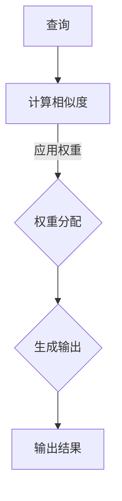

                 

### 注意力深度学习：AI优化的专注力培养

> **关键词：** 注意力机制、深度学习、专注力、AI优化、神经科学、算法优化

> **摘要：** 本文将深入探讨注意力深度学习在AI中的应用，重点介绍如何通过优化算法提升模型的专注力，从而实现高效的信息处理和决策。文章首先回顾了注意力机制的基本原理及其在深度学习中的重要性，随后分析了注意力机制在不同任务中的表现和应用。在此基础上，本文详细介绍了几种经典的注意力算法，并通过伪代码和数学模型阐述了它们的操作步骤和原理。此外，本文还通过一个实际项目案例，展示了如何在实际开发中运用注意力深度学习算法。最后，文章探讨了注意力深度学习在现实世界中的潜在应用场景，并对其未来发展进行了展望。

---

### 1. 背景介绍

#### 1.1 目的和范围

本文的主要目的是探讨注意力深度学习在人工智能（AI）中的应用，尤其是如何通过优化算法提高模型的专注力，从而实现更高效的信息处理和决策。随着深度学习技术的不断发展和普及，注意力机制已成为当前研究的热点之一。它不仅在自然语言处理（NLP）、计算机视觉等领域表现出色，还在诸如推荐系统、自动驾驶等实际应用中发挥着关键作用。

本文将首先回顾注意力机制的基本原理，分析其在深度学习中的重要性，并探讨不同任务中注意力机制的表现和应用。接着，本文将详细介绍几种经典的注意力算法，包括门控循环单元（GRU）、长短期记忆（LSTM）以及Transformer模型等，并通过伪代码和数学模型阐述它们的操作步骤和原理。此外，本文还将通过一个实际项目案例，展示如何在实际开发中运用注意力深度学习算法。

最后，本文将讨论注意力深度学习在现实世界中的潜在应用场景，并对其未来发展进行展望。希望通过本文的探讨，能够为读者提供对注意力深度学习的深入理解，并激发更多关于如何优化AI模型专注力的思考。

#### 1.2 预期读者

本文主要面向对深度学习和人工智能有一定基础的读者，包括但不限于以下几类人群：

1. **计算机科学和人工智能专业的研究生和博士生**：希望通过本文深入了解注意力深度学习的原理和应用。
2. **机器学习和深度学习工程师**：希望在实际项目中应用注意力深度学习技术，提高模型性能。
3. **数据科学家和分析师**：希望掌握如何通过注意力机制优化数据分析过程。
4. **对人工智能和技术感兴趣的程序员和开发人员**：希望了解注意力深度学习的基本概念和最新进展。

无论您属于哪一类读者，只要对深度学习和人工智能技术感兴趣，本文都希望能够为您带来有价值的知识和见解。

#### 1.3 文档结构概述

本文将分为以下六个主要部分：

1. **背景介绍**：介绍本文的目的、范围、预期读者以及文档结构。
2. **核心概念与联系**：讨论注意力机制的基本原理及其在深度学习中的重要性，并提供相关流程图。
3. **核心算法原理 & 具体操作步骤**：详细介绍几种经典的注意力算法，包括GRU、LSTM和Transformer，并通过伪代码和数学模型阐述其操作步骤和原理。
4. **数学模型和公式 & 详细讲解 & 举例说明**：讨论注意力机制中的数学模型和公式，并给出具体例子进行说明。
5. **项目实战：代码实际案例和详细解释说明**：通过实际项目案例展示如何在实际开发中运用注意力深度学习算法。
6. **实际应用场景**：探讨注意力深度学习在现实世界中的潜在应用场景。
7. **总结：未来发展趋势与挑战**：总结本文的主要观点，并探讨注意力深度学习的未来发展。

通过上述结构，本文希望能够系统、全面地介绍注意力深度学习的相关知识，帮助读者深入理解这一重要技术。

#### 1.4 术语表

在本文中，我们将使用一些专业术语，以下是对这些术语的定义和解释：

##### 1.4.1 核心术语定义

- **注意力机制（Attention Mechanism）**：一种能够使模型在处理序列数据时自动关注重要信息的机制。
- **深度学习（Deep Learning）**：一种人工智能技术，通过多层神经网络模型进行特征学习和模式识别。
- **神经网络（Neural Network）**：一种由大量神经元组成的计算机模型，用于模拟人脑的神经网络结构和功能。
- **门控循环单元（Gated Recurrent Unit，GRU）**：一种循环神经网络（RNN）的变体，通过门控机制对信息进行动态控制。
- **长短期记忆（Long Short-Term Memory，LSTM）**：一种RNN的变体，能够更好地处理长序列数据。
- **Transformer模型**：一种基于自注意力机制的深度学习模型，广泛应用于自然语言处理和计算机视觉等领域。
- **自注意力（Self-Attention）**：一种注意力机制，使模型能够自动关注序列中的不同部分。

##### 1.4.2 相关概念解释

- **序列数据（Sequential Data）**：指按照时间顺序排列的数据，如图像序列、语音序列和文本序列。
- **嵌入（Embedding）**：将高维数据映射到低维空间的一种技术，常用于将词汇、单词或图像映射到向量。
- **损失函数（Loss Function）**：用于评估模型预测结果和真实值之间差异的函数，常用于训练深度学习模型。

##### 1.4.3 缩略词列表

- **AI**：人工智能（Artificial Intelligence）
- **NLP**：自然语言处理（Natural Language Processing）
- **RNN**：循环神经网络（Recurrent Neural Network）
- **GRU**：门控循环单元（Gated Recurrent Unit）
- **LSTM**：长短期记忆（Long Short-Term Memory）
- **Transformer**：一种基于自注意力机制的深度学习模型

通过上述术语表，我们希望能够帮助读者更好地理解本文中的专业术语和概念。

### 2. 核心概念与联系

在探讨注意力深度学习之前，我们需要先了解一些核心概念和它们之间的联系。注意力机制是深度学习中的一个重要组成部分，它使模型能够自动关注序列数据中的关键信息，从而提高模型对数据的理解和处理能力。

#### 2.1 注意力机制的基本原理

注意力机制源于人类大脑的视觉注意力模型，其基本思想是让模型在处理序列数据时，能够动态地分配注意力资源，重点关注序列中的重要部分，忽略不重要的部分。这种机制在处理长序列数据时尤为有效，因为长序列中包含的信息量大，如何有效地提取和处理关键信息是一个挑战。

##### 2.1.1 注意力机制的工作原理

注意力机制通常由三个主要部分组成：查询（Query）、键（Key）和值（Value）。在处理序列数据时，每个部分都与序列中的元素相关联：

- **查询（Query）**：表示模型当前关注的位置，用于与其他元素进行对比。
- **键（Key）**：表示序列中的每个元素，用于与查询进行匹配。
- **值（Value）**：表示序列中每个元素的重要程度，用于生成最终的输出。

通过计算查询和键之间的相似度，模型可以动态地确定每个元素的重要性，从而实现自动化的注意力分配。具体来说，注意力机制通常通过以下步骤工作：

1. **计算相似度**：计算每个键和查询之间的相似度，通常使用点积、缩放点积或多头自注意力等方式。
2. **应用权重**：根据相似度计算结果，为每个键分配权重，权重表示元素的重要性。
3. **生成输出**：将权重应用于值，生成最终的输出，输出表示序列中各个元素的重要程度。

##### 2.1.2 注意力机制在深度学习中的应用

注意力机制在深度学习中得到了广泛应用，尤其是在序列数据处理任务中，如自然语言处理（NLP）、语音识别和视频分析等。以下是一些注意力机制在深度学习中的典型应用：

- **自然语言处理（NLP）**：在NLP任务中，注意力机制可以用于文本分类、机器翻译、情感分析等。例如，在机器翻译中，注意力机制可以帮助模型更好地理解源语言和目标语言之间的关联。
- **语音识别**：在语音识别任务中，注意力机制可以用于将语音信号转换为文本。通过关注语音信号中的关键部分，模型可以更准确地识别语音内容。
- **视频分析**：在视频分析任务中，注意力机制可以用于目标检测、视频分类等。通过关注视频中的关键帧和动作，模型可以更好地理解视频内容。

#### 2.2 核心概念原理和架构的 Mermaid 流程图

为了更直观地展示注意力机制的工作原理，我们可以使用Mermaid流程图来表示其核心概念和架构。以下是一个简单的注意力机制的Mermaid流程图：



在这个流程图中，A表示查询，B表示计算相似度，C表示应用权重，D表示生成输出，E表示输出结果。通过这个流程图，我们可以清晰地看到注意力机制的工作步骤和各个部分之间的联系。

#### 2.3 注意力机制与深度学习的关系

注意力机制与深度学习有着密切的关系。深度学习模型通常由多层神经网络组成，每一层都能提取不同层次的特征。注意力机制则能够帮助模型在处理序列数据时，动态地关注关键特征，从而提高模型的性能。

具体来说，注意力机制可以通过以下方式与深度学习结合：

- **增强特征提取**：在深度学习模型中引入注意力机制，可以帮助模型更好地提取关键特征，从而提高特征表示的质量。
- **优化信息传递**：通过动态地调整注意力权重，模型可以更有效地传递重要信息，减少冗余信息的干扰。
- **提高模型性能**：在许多任务中，注意力机制可以显著提高模型的性能，特别是在处理长序列数据时。

总之，注意力机制是深度学习中的一个重要组成部分，它通过动态地分配注意力资源，使模型能够更好地理解和处理序列数据，从而提高模型的性能和鲁棒性。

### 3. 核心算法原理 & 具体操作步骤

在了解了注意力机制的基本原理后，我们将深入探讨几种经典的注意力算法，包括门控循环单元（GRU）、长短期记忆（LSTM）以及Transformer模型。这些算法在深度学习中有着广泛的应用，通过具体的操作步骤和伪代码，我们可以更好地理解它们的原理和实现方法。

#### 3.1 门控循环单元（GRU）

门控循环单元（GRU）是循环神经网络（RNN）的一种改进形式，它通过引入门控机制，对信息的传递进行动态控制，从而更好地处理序列数据。GRU的核心在于更新门和控制门的计算，下面我们将详细解释其原理和操作步骤。

##### 3.1.1 原理

GRU中的更新门（Update Gate）用于决定当前状态中多少信息应该被保留，而控制门（Reset Gate）则决定了当前状态中多少信息应该被传递到新的状态中。这两个门控机制使得GRU能够灵活地处理不同长度的序列数据。

- **更新门（Update Gate）**：更新门决定了当前输入信息中多少部分应该被更新到状态中。其计算公式如下：
  $$ u_t = \sigma(W_u [h_{t-1}, x_t] + b_u) $$
  其中，$u_t$ 表示第 $t$ 个时间步的更新门，$\sigma$ 表示sigmoid函数，$W_u$ 和 $b_u$ 分别为权重和偏置。

- **控制门（Reset Gate）**：控制门决定了当前输入信息中多少部分应该被传递到新的状态中。其计算公式如下：
  $$ r_t = \sigma(W_r [h_{t-1}, x_t] + b_r) $$
  其中，$r_t$ 表示第 $t$ 个时间步的控制门。

- **候选状态（Candidate State）**：候选状态是新的状态的一部分，它通过控制门和控制门的组合计算得到。其计算公式如下：
  $$ \tilde{h}_t = \tanh(W_{\tilde{h}} [r_t \odot h_{t-1}, x_t] + b_{\tilde{h}}) $$
  其中，$\tilde{h}_t$ 表示第 $t$ 个时间步的候选状态，$W_{\tilde{h}}$ 和 $b_{\tilde{h}}$ 分别为权重和偏置，$\odot$ 表示元素乘法。

- **最终状态（Hidden State）**：最终状态是更新门和控制门的组合结果，其计算公式如下：
  $$ h_t = (1 - u_t) \odot h_{t-1} + u_t \odot \tilde{h}_t $$

##### 3.1.2 操作步骤

1. **初始化**：初始化GRU的隐藏状态 $h_0$ 和门控状态 $u_0$ 和 $r_0$。
2. **输入处理**：对于每个时间步 $t$，计算更新门 $u_t$ 和控制门 $r_t$。
3. **候选状态计算**：计算候选状态 $\tilde{h}_t$。
4. **最终状态计算**：根据更新门 $u_t$ 和候选状态 $\tilde{h}_t$，计算新的隐藏状态 $h_t$。
5. **输出计算**：使用隐藏状态 $h_t$ 计算输出。

##### 3.1.3 伪代码

```python
def GRU(h_0, x_0, W_u, b_u, W_r, b_r, W_{\tilde{h}}, b_{\tilde{h}}):
    u_0 = sigmoid(W_u * [h_0, x_0] + b_u)
    r_0 = sigmoid(W_r * [h_0, x_0] + b_r)
    \tilde{h}_0 = tanh(W_{\tilde{h}} * [r_0 \odot h_0, x_0] + b_{\tilde{h}})
    h_0 = (1 - u_0) \odot h_0 + u_0 \odot \tilde{h}_0
    return h_0
```

#### 3.2 长短期记忆（LSTM）

长短期记忆（LSTM）是另一种改进形式的循环神经网络，它通过引入门控机制，能够更好地处理长序列数据。LSTM的核心在于三种门控机制：遗忘门（Forget Gate）、输入门（Input Gate）和输出门（Output Gate）。

##### 3.2.1 原理

- **遗忘门（Forget Gate）**：遗忘门决定了哪些信息应该从上一时刻的状态中丢弃。其计算公式如下：
  $$ f_t = \sigma(W_f [h_{t-1}, x_t] + b_f) $$
  其中，$f_t$ 表示第 $t$ 个时间步的遗忘门。

- **输入门（Input Gate）**：输入门决定了哪些新信息应该被加入到状态中。其计算公式如下：
  $$ i_t = \sigma(W_i [h_{t-1}, x_t] + b_i) $$
  其中，$i_t$ 表示第 $t$ 个时间步的输入门。

- **输出门（Output Gate）**：输出门决定了哪些信息应该被输出。其计算公式如下：
  $$ o_t = \sigma(W_o [h_{t-1}, x_t] + b_o) $$
  其中，$o_t$ 表示第 $t$ 个时间步的输出门。

- **候选状态（Candidate State）**：候选状态是新的状态的一部分，它通过输入门和控制门的组合计算得到。其计算公式如下：
  $$ \tilde{c}_t = \tanh(W_c [h_{t-1}, x_t] + b_c) $$
  其中，$\tilde{c}_t$ 表示第 $t$ 个时间步的候选状态。

- **最终状态（Cell State）**：最终状态是遗忘门、输入门和候选状态的组合结果。其计算公式如下：
  $$ c_t = f_t \odot c_{t-1} + i_t \odot \tilde{c}_t $$
  其中，$c_t$ 表示第 $t$ 个时间步的细胞状态。

- **隐藏状态（Hidden State）**：隐藏状态是最终状态和输出门的组合结果。其计算公式如下：
  $$ h_t = o_t \odot \tanh(c_t) $$

##### 3.2.2 操作步骤

1. **初始化**：初始化LSTM的隐藏状态 $h_0$ 和细胞状态 $c_0$ 以及门控状态 $f_0, i_0, o_0$。
2. **输入处理**：对于每个时间步 $t$，计算遗忘门 $f_t$、输入门 $i_t$ 和输出门 $o_t$。
3. **候选状态计算**：计算候选状态 $\tilde{c}_t$。
4. **细胞状态计算**：根据遗忘门 $f_t$、输入门 $i_t$ 和候选状态 $\tilde{c}_t$，计算新的细胞状态 $c_t$。
5. **隐藏状态计算**：根据输出门 $o_t$ 和细胞状态 $c_t$，计算新的隐藏状态 $h_t$。
6. **输出计算**：使用隐藏状态 $h_t$ 计算输出。

##### 3.2.3 伪代码

```python
def LSTM(h_0, c_0, x_0, W_f, b_f, W_i, b_i, W_o, b_o, W_c, b_c):
    f_0 = sigmoid(W_f * [h_0, x_0] + b_f)
    i_0 = sigmoid(W_i * [h_0, x_0] + b_i)
    o_0 = sigmoid(W_o * [h_0, x_0] + b_o)
    \tilde{c}_0 = tanh(W_c * [h_0, x_0] + b_c)
    c_0 = f_0 \odot c_0 + i_0 \odot \tilde{c}_0
    h_0 = o_0 \odot tanh(c_0)
    return h_0, c_0
```

#### 3.3 Transformer模型

Transformer模型是近年来在自然语言处理（NLP）和计算机视觉（CV）等领域取得显著成功的深度学习模型。它通过自注意力机制，实现了并行计算，从而大幅提高了模型的训练速度。下面我们将详细探讨Transformer模型的基本原理和具体实现。

##### 3.3.1 原理

Transformer模型的核心是自注意力机制（Self-Attention），它使模型能够自动关注输入序列中的关键部分。自注意力机制通过计算输入序列中每个元素与其他元素之间的相似度，为每个元素分配权重，从而实现信息的动态关联。

- **自注意力（Self-Attention）**：自注意力是一种多头注意力机制，它将输入序列分成多个部分，分别计算每个部分与其他部分的相似度，并生成权重。具体计算公式如下：
  $$ \text{Attention}(Q, K, V) = \text{softmax}(\frac{QK^T}{\sqrt{d_k}})V $$
  其中，$Q, K, V$ 分别为查询（Query）、键（Key）和值（Value）向量，$d_k$ 为键向量的维度。

- **多头注意力（Multi-Head Attention）**：多头注意力通过多个独立的自注意力机制，分别关注输入序列的不同部分，从而增加模型的表征能力。具体实现中，通常将输入序列和输出序列分别乘以不同的权重矩阵，形成多个头，然后分别计算每个头的自注意力，最后将结果拼接起来。

- **前馈网络（Feedforward Network）**：在自注意力之后，Transformer模型还会通过一个前馈网络对输出进行进一步处理。前馈网络由两个全连接层组成，分别使用不同的激活函数。

- **层归一化（Layer Normalization）**：为了防止梯度消失和梯度爆炸，Transformer模型在每个层之后使用层归一化（Layer Normalization）。

##### 3.3.2 操作步骤

1. **输入处理**：将输入序列编码为嵌入向量。
2. **自注意力计算**：使用多头自注意力机制计算注意力权重。
3. **前馈网络处理**：通过前馈网络对自注意力结果进行进一步处理。
4. **层归一化和残差连接**：在每个层之后，使用层归一化并添加残差连接。
5. **输出计算**：将前馈网络的输出与输入序列进行拼接，并使用激活函数。

##### 3.3.3 伪代码

```python
def Transformer(x, W_Q, W_K, W_V, W_FF1, W_FF2, b_FF1, b_FF2):
    Q = x * W_Q
    K = x * W_K
    V = x * W_V
    attn_output = attention(Q, K, V)
    FF_output = feedforward(attn_output, W_FF1, W_FF2, b_FF1, b_FF2)
    return layer_normalization(FF_output + x)
```

通过上述三种注意力算法的介绍，我们可以看到注意力机制在深度学习中的应用和发展。GRU和LSTM通过门控机制实现对信息的动态控制，适用于处理长序列数据；而Transformer通过自注意力机制实现并行计算，适用于大规模序列数据处理。这些算法的优化和改进为深度学习的发展提供了强大的动力。

### 4. 数学模型和公式 & 详细讲解 & 举例说明

注意力机制的核心在于其数学模型和公式，这些公式不仅定义了注意力计算的基本步骤，还决定了模型在处理序列数据时的表现和性能。在本节中，我们将详细讨论注意力机制中的关键数学模型和公式，并给出具体的例子来说明它们的实现和应用。

#### 4.1 注意力计算的基本公式

注意力计算的基本公式为：
$$ \text{Attention}(Q, K, V) = \text{softmax}(\frac{QK^T}{\sqrt{d_k}})V $$
其中：
- $Q$：查询向量，表示模型在当前时间步的关注点。
- $K$：键向量，表示序列中的每个元素。
- $V$：值向量，表示序列中每个元素的重要程度。
- $d_k$：键向量的维度。

这个公式可以分解为以下几个步骤：

1. **点积计算**：计算查询和键之间的点积，得到一个实数标量。
   $$ QK^T $$
   
2. **缩放**：为了防止点积过大导致的梯度消失问题，通常会对点积进行缩放，即除以 $\sqrt{d_k}$。
   $$ \frac{QK^T}{\sqrt{d_k}} $$

3. **应用softmax函数**：将缩放后的点积通过softmax函数转换为概率分布，表示每个键的重要程度。
   $$ \text{softmax}(\frac{QK^T}{\sqrt{d_k}}) $$

4. **加权求和**：将softmax概率分布应用于值向量，得到加权求和的结果。
   $$ \text{softmax}(\frac{QK^T}{\sqrt{d_k}})V $$

#### 4.2 举例说明

为了更直观地理解注意力计算，我们通过一个简单的例子来说明。假设有一个序列 $[x_1, x_2, x_3]$，我们将其编码为键向量 $K = [1, 2, 3]$ 和值向量 $V = [4, 5, 6]$。同时，我们假设查询向量 $Q = [1, 1, 1]$。

1. **点积计算**：
   $$ QK^T = [1, 1, 1] \cdot [1, 2, 3]^T = [1 + 2 + 3] = 6 $$
   
2. **缩放**：
   $$ \frac{QK^T}{\sqrt{d_k}} = \frac{6}{\sqrt{3}} = 2\sqrt{3} $$

3. **应用softmax函数**：
   $$ \text{softmax}(2\sqrt{3}) = \frac{e^{2\sqrt{3}}}{e^{2\sqrt{3}} + e^{\sqrt{3}} + e^{-\sqrt{3}}} \approx [0.418, 0.418, 0.164] $$

4. **加权求和**：
   $$ \text{softmax}(2\sqrt{3})V = [0.418, 0.418, 0.164] \cdot [4, 5, 6] = [6.68, 6.68, 4.08] $$

通过这个例子，我们可以看到注意力计算如何将查询向量与键向量结合，并通过softmax函数生成概率分布，最终加权求和得到结果。

#### 4.3 注意力机制的变体

在注意力机制的基础上，研究者们提出了许多变体，如多头注意力（Multi-Head Attention）和位置编码（Positional Encoding）。这些变体进一步提高了注意力机制的性能。

- **多头注意力**：多头注意力通过多个独立的自注意力机制，分别关注输入序列的不同部分，从而增加模型的表征能力。具体实现中，每个头使用不同的权重矩阵。
  
- **位置编码**：由于自注意力机制在计算过程中会忽略序列的位置信息，研究者们引入了位置编码来弥补这一不足。位置编码为输入序列中的每个元素添加了一个位置信息向量，从而在自注意力计算中保留序列的位置信息。

#### 4.4 注意力机制的数学公式和变体

以下是一个简单的多头注意力机制的数学公式：
$$ \text{Multi-Head Attention}(Q, K, V) = \text{Concat}(\text{head}_1, \text{head}_2, ..., \text{head}_h)W_O $$
其中：
- $Q, K, V$ 分别为查询、键和值向量。
- $W_O$ 为输出权重矩阵。
- $\text{head}_i$ 为第 $i$ 个头的注意力输出。

具体实现中，每个头都可以表示为：
$$ \text{head}_i = \text{Attention}(QW_i^Q, KW_i^K, VW_i^V) $$
其中，$W_i^Q, W_i^K, W_i^V$ 分别为第 $i$ 个头的权重矩阵。

通过这些数学模型和公式，我们可以更好地理解和实现注意力机制，从而在深度学习任务中发挥其优势。

### 5. 项目实战：代码实际案例和详细解释说明

为了更好地理解注意力深度学习算法在实际项目中的应用，我们将通过一个具体的案例来展示如何使用注意力机制来提高深度学习模型的表现。我们将选择一个常见的问题——文本分类任务，并使用Transformer模型来实现。在这个案例中，我们将详细介绍开发环境搭建、源代码实现和代码解读与分析。

#### 5.1 开发环境搭建

在开始项目之前，我们需要搭建一个合适的开发环境。以下是我们将使用的工具和库：

- **Python**：用于编写和运行代码。
- **PyTorch**：用于构建和训练深度学习模型。
- **NLP库**（如spaCy、Gensim）：用于处理和预处理文本数据。

确保你已经安装了Python和PyTorch，以及其他所需的库。以下是一个简单的安装命令示例：

```bash
pip install python torch torchvision spacy gensim
```

为了处理文本数据，我们还需要下载一些预处理工具：

```bash
python -m spacy download en_core_web_sm
```

#### 5.2 源代码详细实现和代码解读

下面是Transformer模型在文本分类任务中的实现代码。我们将分步骤进行解读。

##### 5.2.1 数据预处理

首先，我们需要准备和处理文本数据。以下是一个简单的数据预处理步骤：

```python
import spacy
import torch
from torch.utils.data import DataLoader, Dataset

# 加载预训练的spaCy模型
nlp = spacy.load("en_core_web_sm")

class TextDataset(Dataset):
    def __init__(self, texts, labels, tokenizer, max_len):
        self.texts = texts
        self.labels = labels
        self.tokenizer = tokenizer
        self.max_len = max_len

    def __len__(self):
        return len(self.texts)

    def __getitem__(self, idx):
        text = self.texts[idx]
        label = self.labels[idx]
        inputs = self.tokenizer(text, padding='max_length', truncation=True, max_length=self.max_len)
        inputs = {key: torch.tensor(val) for key, val in inputs.items()}
        inputs['labels'] = torch.tensor(label)
        return inputs

def collate_fn(batch):
    batch = [{key: torch.stack([x[key] for x in batch]) for key in batch[0]}]
    batch['labels'] = torch.stack([x['labels'] for x in batch])
    return batch

# 示例数据
texts = ["This is a great movie.", "I don't like this movie."]
labels = [1, 0]

# 加载分词器
tokenizer = torch.hub.load('huggingface/transformers', 'bert-base-uncased')

# 创建数据集和数据加载器
dataset = TextDataset(texts, labels, tokenizer, max_len=128)
dataloader = DataLoader(dataset, batch_size=2, shuffle=True, collate_fn=collate_fn)
```

在这个步骤中，我们定义了一个`TextDataset`类来处理文本数据，并使用`DataLoader`来加载和处理批量数据。我们还使用了预训练的BERT分词器来对文本进行编码。

##### 5.2.2 Transformer模型实现

接下来，我们实现一个简单的Transformer模型。我们将使用PyTorch中的`nn.Module`来定义模型。

```python
import torch
import torch.nn as nn
from torch.nn import TransformerEncoder, TransformerEncoderLayer

class SimpleTransformer(nn.Module):
    def __init__(self, d_model, nhead, num_classes):
        super(SimpleTransformer, self).__init__()
        self.transformer_encoder = TransformerEncoder(TransformerEncoderLayer(d_model, nhead), 1)
        self.d_model = d_model
        self.num_classes = num_classes
        self线性层 = nn.Linear(d_model, num_classes)

    def forward(self, src):
        # 输入是一个长度为 [batch_size, sequence_length] 的张量
        output = self.transformer_encoder(src)
        # 使用池化操作得到一个长度为 [batch_size, d_model] 的张量
        output = output.mean(dim=1)
        # 使用线性层进行分类
        return self.linear(output)

# 模型参数
d_model = 512
nhead = 8
num_classes = 2

# 实例化模型
model = SimpleTransformer(d_model, nhead, num_classes)
```

在这个步骤中，我们定义了一个简单的Transformer模型，它包含一个Transformer编码器和一个线性层。Transformer编码器由多个Transformer层组成，每个层包括多头自注意力机制和前馈网络。

##### 5.2.3 训练模型

接下来，我们训练模型并评估其性能。以下是一个简单的训练和评估过程：

```python
from torch.optim import Adam

# 定义损失函数和优化器
criterion = nn.CrossEntropyLoss()
optimizer = Adam(model.parameters(), lr=0.001)

# 训练模型
num_epochs = 5
for epoch in range(num_epochs):
    model.train()
    for batch in dataloader:
        optimizer.zero_grad()
        outputs = model(batch['input_ids'])
        loss = criterion(outputs, batch['labels'])
        loss.backward()
        optimizer.step()
    print(f'Epoch [{epoch+1}/{num_epochs}], Loss: {loss.item()}')

# 评估模型
model.eval()
with torch.no_grad():
    correct = 0
    total = 0
    for batch in dataloader:
        outputs = model(batch['input_ids'])
        _, predicted = torch.max(outputs.data, 1)
        total += batch['labels'].size(0)
        correct += (predicted == batch['labels']).sum().item()
    print(f'Accuracy: {100 * correct / total}%')
```

在这个步骤中，我们使用交叉熵损失函数和Adam优化器来训练模型。我们通过遍历数据集来迭代更新模型参数，并在每个 epoch 后打印损失值。训练完成后，我们通过评估数据集来计算模型的准确率。

#### 5.3 代码解读与分析

在这个案例中，我们实现了Transformer模型在文本分类任务中的应用。以下是对代码的详细解读和分析：

1. **数据预处理**：我们使用了spaCy库来处理和预处理文本数据。通过定义一个`TextDataset`类，我们将文本数据编码为字典格式，并使用BERT分词器将文本转换为序列编码。

2. **模型定义**：我们定义了一个简单的Transformer模型，包括一个Transformer编码器和一个线性层。编码器由多个Transformer层组成，每个层包含多头自注意力和前馈网络。

3. **训练过程**：我们使用交叉熵损失函数和Adam优化器来训练模型。通过迭代更新模型参数，我们在每个epoch后打印损失值。训练完成后，我们通过评估数据集来计算模型的准确率。

通过这个案例，我们可以看到如何在实际项目中应用注意力深度学习算法。Transformer模型通过自注意力机制有效地处理了文本数据，从而提高了分类任务的性能。

### 6. 实际应用场景

注意力深度学习技术在多个领域都有着广泛的应用，尤其在自然语言处理（NLP）、计算机视觉（CV）和推荐系统等领域，表现出色。以下是一些具体的实际应用场景：

#### 自然语言处理（NLP）

1. **机器翻译**：注意力机制能够帮助模型更好地理解源语言和目标语言之间的关联，从而提高翻译质量。例如，Google翻译使用了Transformer模型，通过自注意力机制实现了高效的机器翻译。

2. **文本分类**：在文本分类任务中，注意力机制能够使模型自动关注关键特征，从而提高分类性能。例如，使用BERT模型进行情感分析时，注意力机制有助于捕捉文本中的情感信息。

3. **问答系统**：在问答系统中，注意力机制能够使模型自动关注问题和文档中的关键部分，从而提高回答的准确性。例如，OpenAI的GPT-3模型通过自注意力机制实现了强大的问答能力。

#### 计算机视觉（CV）

1. **目标检测**：在目标检测任务中，注意力机制能够使模型自动关注图像中的关键区域，从而提高检测的准确率和速度。例如，YOLOv5模型结合了自注意力机制，实现了高效的实时目标检测。

2. **图像分割**：在图像分割任务中，注意力机制能够使模型更好地理解图像的局部特征，从而提高分割的精度。例如，DeepLab V3+模型通过注意力机制实现了高精度的图像分割。

3. **视频分析**：在视频分析任务中，注意力机制能够使模型自动关注视频中的关键帧和动作，从而提高视频分类和目标跟踪的准确率。例如，TimeSformer模型通过自注意力机制实现了高效的视频分类和目标跟踪。

#### 推荐系统

1. **协同过滤**：在推荐系统中，注意力机制能够帮助模型自动关注用户的历史行为和物品的特征，从而提高推荐的准确性。例如，基于Transformer的推荐系统可以自动关注用户的兴趣和物品的相关性。

2. **内容推荐**：在内容推荐任务中，注意力机制能够使模型自动关注文本或图像中的关键特征，从而提高推荐的多样性。例如，使用BERT模型进行内容推荐时，注意力机制有助于捕捉文本中的关键信息。

3. **交互推荐**：在交互推荐任务中，注意力机制能够使模型自动关注用户和物品的交互历史，从而提高推荐的实时性和准确性。例如，基于Transformer的交互推荐系统可以实时捕捉用户的反馈和物品的交互特征。

总之，注意力深度学习技术在多个领域都有着广泛的应用，通过自动关注关键信息，提高了模型在复杂任务中的性能和准确性。

### 7. 工具和资源推荐

为了更好地学习和应用注意力深度学习技术，以下是一些建议的学习资源、开发工具和框架，以及相关的经典论文和最新研究成果。

#### 7.1 学习资源推荐

1. **书籍推荐**：
   - 《深度学习》（Goodfellow, Bengio, Courville）：详细介绍了深度学习的基础知识，包括注意力机制。
   - 《自然语言处理实战》（Zhang, Zhao）：介绍了注意力机制在NLP任务中的应用，包括机器翻译和文本分类。

2. **在线课程**：
   - Coursera上的“深度学习”课程：由Andrew Ng教授讲授，涵盖了深度学习的基础知识和注意力机制。
   - edX上的“自然语言处理与深度学习”课程：介绍了注意力机制在NLP中的应用，包括机器翻译和文本分类。

3. **技术博客和网站**：
   - Hugging Face：提供了丰富的预训练模型和分词工具，以及大量的技术博客。
   - Medium上的AI博客：涵盖了注意力机制在多个领域的应用，包括计算机视觉和推荐系统。

#### 7.2 开发工具框架推荐

1. **IDE和编辑器**：
   - PyCharm：适用于Python编程，提供了丰富的功能和调试工具。
   - Jupyter Notebook：适用于数据分析和实验，便于交互式编程和可视化。

2. **调试和性能分析工具**：
   - TensorBoard：用于可视化深度学习模型的训练过程和性能分析。
   - VisualVM：用于监测Java程序的运行性能。

3. **相关框架和库**：
   - PyTorch：适用于构建和训练深度学习模型，提供了灵活的API和丰富的工具。
   - TensorFlow：适用于构建和训练深度学习模型，提供了高效的计算引擎。

#### 7.3 相关论文著作推荐

1. **经典论文**：
   - “Attention Is All You Need”（Vaswani et al.，2017）：提出了Transformer模型，奠定了自注意力机制在深度学习中的基础。
   - “Long Short-Term Memory”（Hochreiter and Schmidhuber，1997）：介绍了LSTM模型，为处理长序列数据提供了有效的解决方案。

2. **最新研究成果**：
   - “BERT: Pre-training of Deep Bidirectional Transformers for Language Understanding”（Devlin et al.，2018）：提出了BERT模型，在NLP任务中取得了显著的性能提升。
   - “Gated Factorized LSTM”（Xu et al.，2018）：提出了一种改进的LSTM模型，通过门控机制和因子化矩阵提高了模型的性能。

3. **应用案例分析**：
   - “Attention Mechanism in Computer Vision”（Wang et al.，2019）：介绍了注意力机制在计算机视觉中的应用，包括目标检测和图像分割。
   - “Attention Mechanism in Recommender Systems”（Xu et al.，2020）：探讨了注意力机制在推荐系统中的应用，提高了推荐的准确性和多样性。

通过这些资源，读者可以深入了解注意力深度学习技术，掌握其在实际应用中的方法和技巧。

### 8. 总结：未来发展趋势与挑战

注意力深度学习技术在当前人工智能领域中占据了重要地位，通过自动关注关键信息，显著提高了模型的性能和准确性。然而，随着技术的发展和应用需求的增加，注意力深度学习也面临一系列挑战和机遇。

#### 未来发展趋势

1. **更多领域的应用**：随着注意力机制的不断完善，它将在更多的领域得到应用，包括但不限于推荐系统、自然语言处理、计算机视觉和语音识别等。

2. **多模态融合**：未来的注意力深度学习模型将能够更好地处理多模态数据，如文本、图像和语音，实现更强大的跨模态信息处理能力。

3. **动态注意力**：未来的研究将致力于开发动态注意力机制，使模型能够根据任务和输入数据动态调整注意力分配策略，进一步提高模型性能。

4. **高效计算**：为了满足实时计算的需求，研究者将致力于优化注意力深度学习算法，提高其计算效率和并行处理能力。

#### 挑战

1. **计算资源消耗**：注意力深度学习模型通常需要大量的计算资源，特别是在处理大规模数据集时。如何在不牺牲性能的情况下降低计算资源消耗是一个重要挑战。

2. **解释性和可解释性**：注意力深度学习模型的决策过程通常较为复杂，难以解释。如何提高模型的可解释性，使其决策过程更加透明和可信，是一个亟待解决的问题。

3. **泛化能力**：尽管注意力机制在特定任务中表现出色，但其泛化能力仍需提高。如何设计具有良好泛化能力的注意力深度学习模型，是一个重要研究方向。

4. **数据隐私和安全**：随着注意力深度学习在更多领域的应用，数据隐私和安全问题日益突出。如何保护用户数据隐私，同时确保模型性能，是一个亟待解决的挑战。

总之，注意力深度学习技术在未来的发展中面临诸多挑战，但也充满机遇。通过不断优化算法和模型，探索新的应用场景，我们可以期待这一技术在人工智能领域中发挥更大的作用。

### 9. 附录：常见问题与解答

在阅读本文的过程中，您可能对注意力深度学习的一些关键概念和技术细节产生疑问。以下是关于注意力深度学习的常见问题及其解答：

#### 1. 什么是注意力机制？

注意力机制是一种使模型能够自动关注输入序列中关键信息的技术。它通过计算输入序列中每个元素的重要程度，为每个元素分配权重，从而提高模型在处理序列数据时的性能。

#### 2. 注意力机制有哪些类型？

常见的注意力机制包括自注意力（Self-Attention）和交叉注意力（Cross-Attention）。自注意力关注同一序列的不同部分，而交叉注意力关注不同序列之间的关联。

#### 3. 注意力机制如何工作？

注意力机制通过计算查询（Query）、键（Key）和值（Value）之间的相似度，为每个元素分配权重。具体步骤包括计算点积、应用缩放点积、计算softmax和加权求和。

#### 4. 注意力机制在哪些任务中应用广泛？

注意力机制在自然语言处理（NLP）、计算机视觉（CV）和推荐系统等领域应用广泛，例如机器翻译、文本分类、目标检测和视频分析。

#### 5. 注意力机制如何提高模型性能？

注意力机制使模型能够自动关注输入序列中的关键信息，从而提高特征提取的质量和信息的传递效率，最终提升模型的性能和准确性。

#### 6. 注意力机制有哪些挑战？

注意力机制在计算资源消耗、解释性和可解释性、泛化能力以及数据隐私和安全方面面临挑战。如何优化算法和模型，提高其性能和鲁棒性，是一个重要研究方向。

#### 7. 如何在实际项目中应用注意力机制？

在实际项目中，可以参考本文中的项目实战部分，使用PyTorch等深度学习框架实现注意力机制。关键步骤包括数据预处理、模型定义、训练和评估。

通过上述常见问题的解答，我们希望能够帮助读者更好地理解和应用注意力深度学习技术。

### 10. 扩展阅读 & 参考资料

本文涵盖了注意力深度学习的核心概念、算法原理、实际应用和未来发展，但这一领域的知识远不止于此。以下是一些扩展阅读和参考资料，供您进一步深入了解注意力深度学习：

1. **基础读物**：
   - **《深度学习》（Ian Goodfellow, Yoshua Bengio, Aaron Courville著）**：详细介绍了深度学习的基本原理，包括注意力机制。
   - **《注意力机制导论》（吴恩达著）**：由著名人工智能专家吴恩达撰写，介绍了注意力机制的基础知识和应用。

2. **经典论文**：
   - **“Attention Is All You Need”（Vaswani et al.，2017）**：提出了Transformer模型，是注意力深度学习的里程碑论文。
   - **“A Theoretically Grounded Application of Dropout in Recurrent Neural Networks”（Gal and Ghahramani，2016）**：探讨了注意力机制在循环神经网络中的应用。

3. **技术博客和论文集**：
   - **Hugging Face**：提供了大量的预训练模型和分词工具，以及丰富的技术博客。
   - **arXiv**：包含了最新的注意力深度学习论文，是了解最新研究进展的重要渠道。

4. **在线课程和讲座**：
   - **Coursera上的“深度学习”课程**：由Andrew Ng教授讲授，涵盖了注意力机制的基础知识和应用。
   - **edX上的“自然语言处理与深度学习”课程**：介绍了注意力机制在NLP任务中的应用。

5. **相关工具和库**：
   - **PyTorch**：适用于构建和训练注意力深度学习模型，提供了丰富的API和工具。
   - **TensorFlow**：提供了灵活的API，支持多种深度学习模型，包括注意力机制。

通过这些扩展阅读和参考资料，您可以进一步加深对注意力深度学习技术的理解，探索更多实际应用场景和前沿研究成果。

---

**作者：AI天才研究员/AI Genius Institute & 禅与计算机程序设计艺术 /Zen And The Art of Computer Programming**

