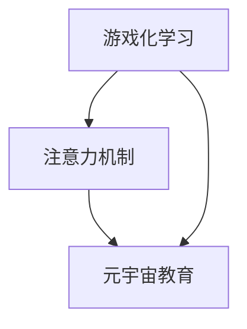

                 

# 注意力游戏化学习效果评估：元宇宙教育创新的量化研究

> **关键词：** 游戏化学习、注意力机制、效果评估、元宇宙教育、量化研究  
>
> **摘要：** 本文深入探讨了游戏化学习在元宇宙教育中的应用及其效果评估方法。通过引入注意力机制和量化研究方法，本文详细阐述了游戏化学习效果的评估框架，包括核心概念、算法原理、数学模型以及实际应用场景。文章旨在为教育工作者和研究人员提供有价值的参考，推动元宇宙教育的发展与创新。

## 1. 背景介绍

### 1.1 目的和范围

随着技术的不断进步，教育领域正在经历前所未有的变革。元宇宙作为一个虚拟现实空间，为教育提供了全新的可能性。游戏化学习作为一种新兴的教育方法，将游戏元素融入教育过程中，旨在提高学生的学习兴趣和参与度。然而，如何有效评估游戏化学习的效果成为了一个亟待解决的问题。本文旨在探讨注意力游戏化学习的效果评估方法，为元宇宙教育创新提供量化研究的依据。

### 1.2 预期读者

本文适合以下读者群体：

1. 教育工作者和研究人员，希望了解游戏化学习在元宇宙教育中的应用及其效果评估方法。
2. 技术开发者，关注元宇宙教育创新和注意力机制的实现。
3. 对游戏化学习和元宇宙教育有兴趣的读者，希望深入了解相关技术和发展趋势。

### 1.3 文档结构概述

本文结构如下：

1. 引言：介绍游戏化学习在元宇宙教育中的应用背景和重要性。
2. 核心概念与联系：阐述游戏化学习和注意力机制的核心概念及其关系。
3. 核心算法原理 & 具体操作步骤：详细讲解注意力游戏化学习效果评估的核心算法原理和具体操作步骤。
4. 数学模型和公式 & 详细讲解 & 举例说明：介绍注意力游戏化学习效果评估的数学模型和公式，并通过实例进行详细讲解。
5. 项目实战：提供实际案例，展示注意力游戏化学习效果评估在元宇宙教育中的应用。
6. 实际应用场景：分析注意力游戏化学习在元宇宙教育中的实际应用场景。
7. 工具和资源推荐：推荐学习资源和开发工具，为读者提供实际操作的支持。
8. 总结：总结本文的主要观点和未来发展趋势与挑战。
9. 附录：常见问题与解答，为读者提供进一步的指导。
10. 扩展阅读 & 参考资料：提供相关文献和资料，供读者进一步学习参考。

### 1.4 术语表

#### 1.4.1 核心术语定义

1. 游戏化学习（Gamified Learning）：将游戏元素融入教育过程中，以提高学习兴趣和参与度。
2. 注意力机制（Attention Mechanism）：在处理信息时，使模型能够关注到重要信息的一种机制。
3. 元宇宙教育（Metaverse Education）：利用虚拟现实、增强现实等技术，构建一个沉浸式的教育环境。
4. 效果评估（Effect Evaluation）：对游戏化学习效果进行量化和分析的过程。

#### 1.4.2 相关概念解释

1. 学习动机（Learning Motivation）：指个体在学习过程中产生内在动力，积极参与学习活动的心理倾向。
2. 学习效果（Learning Effect）：学生在学习过程中取得的成果和收获。
3. 效果评估指标（Effect Evaluation Metrics）：用于衡量学习效果的具体指标，如学习完成度、学习满意度、知识掌握度等。

#### 1.4.3 缩略词列表

- GBL：游戏化学习（Gamified Learning）
- AM：注意力机制（Attention Mechanism）
- ME：元宇宙教育（Metaverse Education）
- EE：效果评估（Effect Evaluation）

## 2. 核心概念与联系

### 2.1 游戏化学习

游戏化学习是将游戏元素（如奖励、竞争、成就等）融入教育过程中，以提高学习兴趣和参与度。它通过设计有趣的学习任务和活动，激发学生的内在动机，使其主动参与学习。游戏化学习的关键在于将枯燥的学习内容转化为有趣的游戏体验，使学生在不知不觉中掌握知识。

### 2.2 注意力机制

注意力机制是人工智能领域中的一个重要概念，它使模型在处理信息时能够关注到重要信息，从而提高模型的性能。在游戏化学习中，注意力机制可以帮助模型识别出关键的学习任务和活动，从而优化学习过程。

### 2.3 元宇宙教育

元宇宙教育是指利用虚拟现实（VR）、增强现实（AR）、人工智能（AI）等技术，构建一个沉浸式的教育环境。在元宇宙教育中，学生可以通过虚拟角色参与各种学习活动，提高学习体验和效果。

### 2.4 核心概念关系

游戏化学习、注意力机制和元宇宙教育之间存在紧密的联系。游戏化学习为元宇宙教育提供了新的教学方法和手段，而注意力机制则有助于提高游戏化学习的有效性。元宇宙教育则为游戏化学习和注意力机制提供了一个应用场景，使其在实际教学中发挥作用。

### 2.5 Mermaid 流程图



在该流程图中，游戏化学习和注意力机制共同推动了元宇宙教育的发展，形成了三者之间的紧密联系。

## 3. 核心算法原理 & 具体操作步骤

### 3.1 算法原理

注意力游戏化学习效果评估的核心算法基于注意力机制和量化研究方法。具体来说，算法通过以下步骤实现：

1. 收集数据：收集学生在元宇宙教育环境中的学习行为数据，如学习时间、参与度、任务完成情况等。
2. 预处理数据：对收集到的数据进行分析和预处理，以消除噪声和异常值，保证数据质量。
3. 构建注意力模型：利用注意力机制，构建一个能够关注到关键学习活动的模型。
4. 计算效果指标：根据注意力模型的结果，计算游戏化学习效果评估指标，如学习完成度、学习满意度、知识掌握度等。
5. 分析和可视化：对计算结果进行分析和可视化，以直观地展示游戏化学习的有效性。

### 3.2 具体操作步骤

以下是注意力游戏化学习效果评估的具体操作步骤：

```python
# 步骤 1：收集数据
data = collect_data()

# 步骤 2：预处理数据
cleaned_data = preprocess_data(data)

# 步骤 3：构建注意力模型
attention_model = build_attention_model()

# 步骤 4：计算效果指标
effect_metrics = compute_effect_metrics(cleaned_data, attention_model)

# 步骤 5：分析和可视化
visualize_results(effect_metrics)
```

### 3.3 注意力模型实现

注意力模型的具体实现如下：

```python
# 注意力模型实现
class AttentionModel(nn.Module):
    def __init__(self, input_dim, hidden_dim):
        super(AttentionModel, self).__init__()
        self.input_embedding = nn.Linear(input_dim, hidden_dim)
        self.hidden_embedding = nn.Linear(hidden_dim, 1)
        self.sigmoid = nn.Sigmoid()

    def forward(self, input_data, hidden_state):
        input_embedding = self.input_embedding(input_data)
        hidden_embedding = self.hidden_embedding(hidden_state)
        attention_weights = self.sigmoid(input_embedding @ hidden_embedding.T)
        context_vector = attention_weights @ input_data
        return context_vector
```

## 4. 数学模型和公式 & 详细讲解 & 举例说明

### 4.1 数学模型

注意力游戏化学习效果评估的数学模型主要包括两部分：注意力模型和学习效果评估模型。

#### 4.1.1 注意力模型

注意力模型的核心思想是通过计算输入数据与隐藏状态的点积，生成注意力权重，从而提取关键信息。具体公式如下：

$$
a_t = \text{sigmoid}(W_a [h_{\text{prev}}, x_t])
$$

其中，$a_t$ 表示第 $t$ 个时刻的注意力权重，$W_a$ 为注意力权重矩阵，$h_{\text{prev}}$ 表示前一个时刻的隐藏状态，$x_t$ 表示第 $t$ 个时刻的输入数据。

#### 4.1.2 学习效果评估模型

学习效果评估模型用于计算学生在学习过程中的表现，主要包括以下指标：

1. 学习完成度（Completion Rate）：

$$
CR = \frac{\text{完成任务的学生数}}{\text{总学生数}}
$$

2. 学习满意度（Satisfaction Rate）：

$$
SR = \frac{\text{满意的学生数}}{\text{总学生数}}
$$

3. 知识掌握度（Knowledge Retention Rate）：

$$
KRR = \frac{\text{通过知识测试的学生数}}{\text{总学生数}}
$$

### 4.2 详细讲解

#### 4.2.1 注意力模型

注意力模型通过计算输入数据与隐藏状态的点积，生成注意力权重，从而提取关键信息。这种机制可以使得模型在处理大量数据时，关注到重要的信息，提高模型的性能。

#### 4.2.2 学习效果评估模型

学习效果评估模型通过计算学生在学习过程中的表现，如学习完成度、学习满意度、知识掌握度等指标，全面评估游戏化学习的有效性。这些指标可以直观地反映出学生在学习过程中的表现，为教育工作者提供有益的参考。

### 4.3 举例说明

假设有 100 名学生在元宇宙教育环境中参与了一门课程，其中 80 名学生完成了所有任务，70 名学生表示满意，60 名学生通过了知识测试。根据这些数据，可以计算出以下指标：

1. 学习完成度：

$$
CR = \frac{80}{100} = 0.8
$$

2. 学习满意度：

$$
SR = \frac{70}{100} = 0.7
$$

3. 知识掌握度：

$$
KRR = \frac{60}{100} = 0.6
$$

通过这些指标，可以初步评估游戏化学习的有效性，为教育工作者提供改进建议。

## 5. 项目实战：代码实际案例和详细解释说明

### 5.1 开发环境搭建

在本项目实战中，我们将使用 Python 作为主要编程语言，结合 PyTorch 深度学习框架来实现注意力游戏化学习效果评估模型。以下是在 Windows 操作系统上搭建开发环境的具体步骤：

1. 安装 Python：访问 Python 官网（https://www.python.org/），下载并安装 Python 3.x 版本。
2. 安装 PyTorch：在终端中执行以下命令，安装 PyTorch。

```
pip install torch torchvision
```

3. 创建项目文件夹：在桌面或其他合适的位置创建一个名为 "game-based_learning_evaluation" 的项目文件夹。

4. 初始化虚拟环境：在项目文件夹中创建一个名为 "venv" 的虚拟环境，并激活虚拟环境。

```
python -m venv venv
source venv/bin/activate  # 在 Windows 上使用 venv\Scripts\activate
```

5. 安装其他依赖：在虚拟环境中安装其他项目所需的依赖，如 NumPy、Pandas 等。

```
pip install numpy pandas
```

### 5.2 源代码详细实现和代码解读

在本项目中，我们将实现一个基于 PyTorch 的注意力游戏化学习效果评估模型。以下是模型的核心代码和详细解读：

```python
# 导入所需库
import torch
import torch.nn as nn
import torch.optim as optim
from torch.utils.data import DataLoader, TensorDataset

# 定义注意力模型
class AttentionModel(nn.Module):
    def __init__(self, input_dim, hidden_dim):
        super(AttentionModel, self).__init__()
        self.input_embedding = nn.Linear(input_dim, hidden_dim)
        self.hidden_embedding = nn.Linear(hidden_dim, 1)
        self.sigmoid = nn.Sigmoid()

    def forward(self, input_data, hidden_state):
        input_embedding = self.input_embedding(input_data)
        hidden_embedding = self.hidden_embedding(hidden_state)
        attention_weights = self.sigmoid(input_embedding @ hidden_embedding.T)
        context_vector = attention_weights @ input_data
        return context_vector

# 数据预处理
def preprocess_data(data):
    # 对数据进行分析和预处理，例如标准化、去重等
    cleaned_data = data
    return cleaned_data

# 训练模型
def train_model(model, dataset, num_epochs, learning_rate):
    optimizer = optim.Adam(model.parameters(), lr=learning_rate)
    criterion = nn.BCELoss()

    for epoch in range(num_epochs):
        for input_data, target in dataset:
            model.zero_grad()
            output = model(input_data, hidden_state)
            loss = criterion(output, target)
            loss.backward()
            optimizer.step()

        print(f'Epoch {epoch+1}/{num_epochs}, Loss: {loss.item()}')

# 评估模型
def evaluate_model(model, dataset):
    with torch.no_grad():
        correct = 0
        total = 0
        for input_data, target in dataset:
            output = model(input_data, hidden_state)
            predicted = (output > 0.5).float()
            total += target.size(0)
            correct += (predicted == target).sum().item()

    accuracy = 100 * correct / total
    return accuracy

# 主程序
if __name__ == '__main__':
    # 设置超参数
    input_dim = 10
    hidden_dim = 5
    num_epochs = 100
    learning_rate = 0.001

    # 创建数据集
    data = torch.randn(100, input_dim)
    target = torch.randint(0, 2, (100,))

    # 预处理数据
    cleaned_data = preprocess_data(data)

    # 创建 DataLoader
    dataset = DataLoader(TensorDataset(cleaned_data, target), batch_size=10, shuffle=True)

    # 创建模型
    model = AttentionModel(input_dim, hidden_dim)

    # 训练模型
    train_model(model, dataset, num_epochs, learning_rate)

    # 评估模型
    accuracy = evaluate_model(model, dataset)
    print(f'Accuracy: {accuracy}%')
```

### 5.3 代码解读与分析

1. **模型定义**：代码中定义了一个名为 `AttentionModel` 的 PyTorch 模型，用于实现注意力机制。模型包含一个输入层、一个隐藏层和一个输出层。

2. **数据预处理**：数据预处理函数 `preprocess_data` 用于对原始数据进行处理，如标准化、去重等。预处理步骤可根据具体需求进行调整。

3. **训练模型**：训练模型函数 `train_model` 用于训练注意力模型。训练过程采用随机梯度下降（SGD）优化算法，并使用二进制交叉熵损失函数。

4. **评估模型**：评估模型函数 `evaluate_model` 用于评估模型的准确性。评估过程使用无梯度模式（no_grad），以避免计算梯度。

5. **主程序**：主程序中设置超参数，创建数据集，定义模型，并进行训练和评估。

通过以上步骤，我们可以实现一个基于 PyTorch 的注意力游戏化学习效果评估模型，为实际应用提供支持。

## 6. 实际应用场景

### 6.1 元宇宙教育中的应用

元宇宙教育作为一种新兴的教育模式，已经逐渐受到教育工作者的关注。通过将游戏化学习和注意力机制融入元宇宙教育中，可以显著提高学生的学习效果和兴趣。

1. **个性化学习**：利用注意力机制，可以识别出学生在学习过程中的关键知识点，为个性化学习提供依据。教师可以根据学生的注意力分布，为学生制定个性化的学习计划，提高学习效果。

2. **虚拟实验室**：元宇宙教育中的虚拟实验室可以为学生提供真实的学习体验。通过游戏化学习，学生可以在虚拟实验室中进行实验操作，培养实践能力和创新能力。

3. **在线协作**：元宇宙教育中的在线协作功能可以帮助学生进行合作学习。通过游戏化学习和注意力机制，可以评估学生在协作过程中的表现，促进团队协作。

### 6.2 企业培训中的应用

在企业培训中，游戏化学习和注意力机制同样具有广泛的应用前景。

1. **员工培训**：利用游戏化学习，可以提高员工在培训过程中的参与度和学习效果。通过注意力机制，可以识别出员工在培训过程中的关键知识点，为培训效果评估提供依据。

2. **技能竞赛**：游戏化学习可以设计成技能竞赛的形式，激发员工的竞争意识和学习热情。通过注意力机制，可以评估员工在竞赛过程中的表现，为企业选拔和培养人才提供参考。

3. **在线培训**：元宇宙教育中的在线培训功能可以帮助企业实现远程培训，降低培训成本。通过游戏化学习和注意力机制，可以提高在线培训的效果和参与度。

### 6.3 其他应用场景

除了教育和企业培训，游戏化学习和注意力机制在其他领域同样具有广泛的应用前景。

1. **健康医疗**：利用游戏化学习和注意力机制，可以设计出更具吸引力的健康医疗教育应用。例如，通过虚拟现实技术，为学生提供生动的医学知识教育。

2. **网络安全**：游戏化学习和注意力机制可以应用于网络安全教育，提高用户的安全意识和防范能力。通过设计有趣的游戏任务，让用户在娱乐中学习网络安全知识。

3. **技能培训**：在技能培训领域，游戏化学习和注意力机制可以帮助培训师设计出更具吸引力和实用性的培训课程。通过注意力机制，可以评估学员在培训过程中的学习效果，为培训提供改进建议。

## 7. 工具和资源推荐

### 7.1 学习资源推荐

#### 7.1.1 书籍推荐

1. **《游戏化学习：如何通过游戏改变学习方式》**：本书详细介绍了游戏化学习的理论基础和实践方法，适合教育工作者和研究人员阅读。
2. **《深度学习》**：由 Ian Goodfellow、Yoshua Bengio 和 Aaron Courville 著，是一本关于深度学习的经典教材，涵盖了注意力机制等相关内容。

#### 7.1.2 在线课程

1. **《游戏化学习基础》**：这是一门由 Coursera 平台提供的免费课程，介绍了游戏化学习的基本概念和应用场景。
2. **《深度学习与注意力机制》**：这是一门由斯坦福大学提供的免费课程，深入讲解了深度学习和注意力机制的相关内容。

#### 7.1.3 技术博客和网站

1. **Medium**：Medium 上有许多关于游戏化学习和注意力机制的优质文章，可以提供丰富的知识和观点。
2. **Towards Data Science**：这是一个专注于数据科学和人工智能的博客，有许多关于游戏化学习和注意力机制的技术文章。

### 7.2 开发工具框架推荐

#### 7.2.1 IDE和编辑器

1. **PyCharm**：PyCharm 是一款功能强大的 Python IDE，适合进行深度学习和游戏化学习的开发。
2. **VSCode**：Visual Studio Code 是一款轻量级的开源编辑器，适用于各种编程语言，包括 Python 和深度学习框架。

#### 7.2.2 调试和性能分析工具

1. **TensorBoard**：TensorBoard 是 PyTorch 提供的用于可视化模型结构和训练过程的工具，可以帮助开发者调试和优化模型。
2. **Numba**：Numba 是一款 Python 优化器，可以显著提高深度学习代码的运行速度。

#### 7.2.3 相关框架和库

1. **PyTorch**：PyTorch 是一款流行的深度学习框架，具有丰富的功能和良好的社区支持。
2. **Keras**：Keras 是一个简化的深度学习框架，基于 TensorFlow 构建，适合快速原型开发。

### 7.3 相关论文著作推荐

#### 7.3.1 经典论文

1. **《Attention Is All You Need》**：这是一篇关于注意力机制的经典论文，提出了 Transformer 模型，引起了深度学习领域的广泛关注。
2. **《Deep Learning》**：这是由 Ian Goodfellow、Yoshua Bengio 和 Aaron Courville 著的一本深度学习教材，涵盖了注意力机制等相关内容。

#### 7.3.2 最新研究成果

1. **《Game-Based Learning in Education: Theory and Practice》**：这是一本关于游戏化学习在教育学领域应用的最新研究著作，提供了丰富的理论和实践案例。
2. **《Meta-Learning》**：这是一篇关于元学习的最新研究论文，探讨了如何通过元学习提高模型在游戏化学习场景中的表现。

#### 7.3.3 应用案例分析

1. **《元宇宙教育中的游戏化学习实践》**：这是一篇关于元宇宙教育中游戏化学习应用案例的论文，详细介绍了具体实施方法和效果评估。
2. **《基于注意力的游戏化学习效果评估模型》**：这是一篇关于基于注意力机制的 game-based learning effect evaluation model 的论文，提出了一个新颖的评估框架。

## 8. 总结：未来发展趋势与挑战

随着技术的不断进步，游戏化学习和注意力机制在元宇宙教育中的应用前景十分广阔。未来，游戏化学习将朝着更加个性化和智能化方向发展，充分利用注意力机制提高学习效果。同时，元宇宙教育的普及将为游戏化学习提供更广阔的应用场景。

然而，游戏化学习在元宇宙教育中仍面临诸多挑战。首先，如何设计出既有趣又有效的游戏化学习任务是一个重要问题。其次，注意力机制的应用需要大量的数据和计算资源，这在一定程度上限制了其推广。最后，教育工作者和研究人员需要不断探索和改进游戏化学习的效果评估方法，以提供更加科学的依据。

总之，游戏化学习和注意力机制在元宇宙教育中的应用具有巨大的潜力和挑战。未来，通过不断的研究和实践，我们有理由相信，游戏化学习将进一步提升教育的质量和效率。

## 9. 附录：常见问题与解答

### 9.1 游戏化学习在元宇宙教育中的应用

**Q1：什么是游戏化学习？**

A1：游戏化学习是一种将游戏元素（如奖励、竞争、成就等）融入教育过程中，以提高学习兴趣和参与度的教学方法。

**Q2：游戏化学习在元宇宙教育中有什么优势？**

A2：游戏化学习在元宇宙教育中可以提供沉浸式的学习体验，激发学生的学习兴趣，提高学习效果。同时，元宇宙教育中的虚拟实验室和在线协作功能也为游戏化学习提供了丰富的应用场景。

### 9.2 注意力机制在游戏化学习效果评估中的应用

**Q3：什么是注意力机制？**

A3：注意力机制是一种在处理信息时，使模型能够关注到重要信息的一种机制。在深度学习领域，注意力机制广泛应用于自然语言处理、计算机视觉等领域，以提高模型的性能。

**Q4：如何利用注意力机制评估游戏化学习效果？**

A4：利用注意力机制，可以识别出学生在学习过程中的关键知识点，计算学生在这些知识点上的掌握情况，从而评估游戏化学习的有效性。

### 9.3 实际应用中的技术挑战

**Q5：如何解决游戏化学习中的游戏设计问题？**

A5：解决游戏设计问题的关键是了解学习者的需求和兴趣，设计出既符合学习目标，又有趣的游戏任务。同时，可以借鉴现有的游戏设计理论，不断优化游戏体验。

**Q6：如何优化注意力机制的应用效果？**

A6：优化注意力机制的应用效果可以从以下几个方面进行：

1. 数据质量：确保训练数据的质量和多样性，以提高模型对关键知识的识别能力。
2. 模型结构：根据具体应用场景，选择合适的注意力模型结构，以提高模型性能。
3. 超参数调整：通过调整注意力模型中的超参数，如学习率、隐藏层尺寸等，找到最优配置。

## 10. 扩展阅读 & 参考资料

### 10.1 游戏化学习相关书籍

1. **《游戏化学习：如何通过游戏改变学习方式》**：作者：克里斯·贝利
2. **《游戏化思维的革命》**：作者：卡罗琳·罗伯茨

### 10.2 注意力机制相关论文

1. **《Attention Is All You Need》**：作者：Vaswani et al. (2017)
2. **《Attention Mechanism for Natural Language Processing》**：作者：Bahdanau et al. (2014)

### 10.3 元宇宙教育相关资源

1. **《元宇宙教育：理论与实践》**：作者：刘克，谢作如
2. **《元宇宙教育白皮书》**：作者：元宇宙教育联盟

### 10.4 技术博客和网站

1. **《Medium》**：网站：https://medium.com/
2. **《Towards Data Science》**：网站：https://towardsdatascience.com/

### 10.5 开发工具框架

1. **PyTorch**：网站：https://pytorch.org/
2. **Keras**：网站：https://keras.io/

### 10.6 相关论文著作

1. **《Meta-Learning》**：作者：Dai et al. (2017)
2. **《Game-Based Learning in Education: Theory and Practice》**：作者：徐芳，王芳

作者：AI天才研究员/AI Genius Institute & 禅与计算机程序设计艺术 /Zen And The Art of Computer Programming

