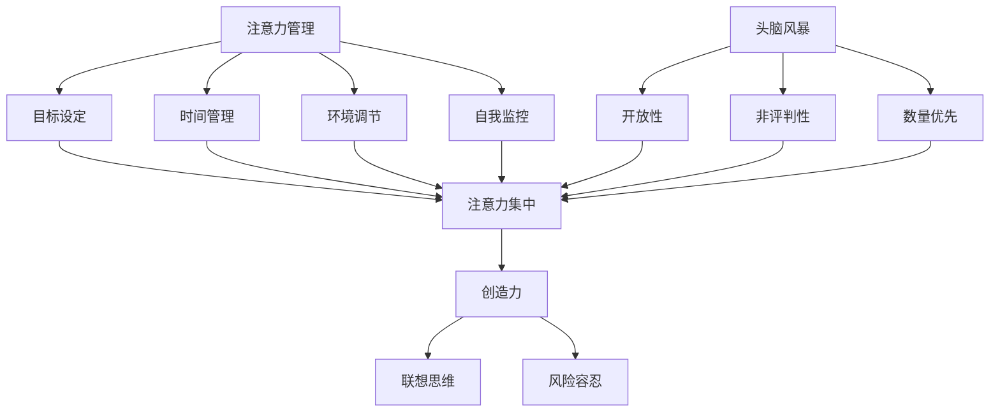

                 

# 注意力管理与创造力激发：在专注和头脑风暴中激发灵感

> **关键词：注意力管理、创造力、专注、头脑风暴、灵感激发**
> 
> **摘要：本文将探讨如何在工作和生活中运用注意力管理和头脑风暴技巧，以提高专注力和创造力，从而激发灵感的产生。**

## 1. 背景介绍

### 1.1 目的和范围

本文旨在通过分析注意力管理和创造力激发的理论和实践，提供一套系统的策略和方法，帮助读者在日常生活中更好地管理注意力，激发创造力，从而在工作和生活中取得更高的效率和成果。

### 1.2 预期读者

本文适合以下读者群体：

- 从事创意工作的人员，如设计师、程序员、作家等；
- 想要提高工作效率和生活质量的人群；
- 对注意力管理和创造力激发感兴趣的研究者。

### 1.3 文档结构概述

本文分为十个部分，结构如下：

1. 背景介绍
   - 1.1 目的和范围
   - 1.2 预期读者
   - 1.3 文档结构概述
   - 1.4 术语表
2. 核心概念与联系
3. 核心算法原理 & 具体操作步骤
4. 数学模型和公式 & 详细讲解 & 举例说明
5. 项目实战：代码实际案例和详细解释说明
6. 实际应用场景
7. 工具和资源推荐
8. 总结：未来发展趋势与挑战
9. 附录：常见问题与解答
10. 扩展阅读 & 参考资料

### 1.4 术语表

#### 1.4.1 核心术语定义

- **注意力管理**：指通过特定的策略和技巧，有效分配和调节个体注意力的过程，以实现特定目标和任务。
- **创造力**：指个体在创新和解决问题过程中产生新颖、独特且有价值的想法和方案的能力。
- **头脑风暴**：一种集体讨论和创意生成的技巧，鼓励自由联想和快速产生大量想法。

#### 1.4.2 相关概念解释

- **专注力**：指个体在特定任务或活动中集中注意力的能力，通常与注意力管理密切相关。
- **灵感激发**：指通过特定的方法或环境，激发个体产生新颖、有创意的想法。

#### 1.4.3 缩略词列表

- **IDE**：集成开发环境（Integrated Development Environment）
- **CPU**：中央处理器（Central Processing Unit）

## 2. 核心概念与联系

为了深入理解注意力管理和创造力激发，我们需要明确一些核心概念及其相互关系。

### 注意力管理

注意力管理是指通过一系列技巧和方法，帮助个体更有效地分配和调节注意力，从而提高工作和生活效率。其核心思想在于：

1. **目标设定**：明确具体的目标和任务，有助于个体集中注意力。
2. **时间管理**：合理安排时间，避免分心和拖延。
3. **环境调节**：创造有利于专注和创造力的工作环境。
4. **自我监控**：持续监控注意力的分配情况，及时调整策略。

### 创造力

创造力是指个体在创新和解决问题过程中产生新颖、独特且有价值想法和方案的能力。创造力与注意力管理密切相关，因为：

- **注意力集中**：有助于深入思考和探索问题，激发创意。
- **联想思维**：通过自由联想和跨领域思考，产生独特想法。
- **风险容忍**：敢于尝试新方法，勇于面对失败，有助于激发创造力。

### 头脑风暴

头脑风暴是一种集体讨论和创意生成的技巧，鼓励自由联想和快速产生大量想法。其核心原理在于：

1. **开放性**：允许任何形式的想法，无论是否合理。
2. **非评判性**：避免对想法进行评判，鼓励自由表达。
3. **数量优先**：鼓励产生大量想法，而非关注单个想法的质量。

### 核心概念联系

注意力管理、创造力和头脑风暴之间存在密切的联系和相互作用：

- **注意力管理有助于提高创造力**：通过集中注意力，个体能够更深入地思考问题，从而激发创意。
- **创造力激发注意力管理**：创造力需要大量的思考和创新，这需要个体具备良好的注意力管理能力。
- **头脑风暴促进注意力集中和创造力提升**：头脑风暴通过开放性讨论和快速联想，有助于个体集中注意力，同时激发创意。

### Mermaid 流程图

以下是一个简单的 Mermaid 流程图，展示了注意力管理、创造力和头脑风暴之间的核心概念及其联系：



## 3. 核心算法原理 & 具体操作步骤

### 3.1 注意力管理算法原理

注意力管理算法的核心思想在于通过一系列策略和技巧，帮助个体更有效地分配和调节注意力。以下是注意力管理算法的伪代码：

```pseudo
function 注意力管理策略(目标，时间，环境，自我监控)
    设置目标（目标）
    设置时间限制（时间）
    调整环境（环境）
    持续监控注意力（自我监控）

    while 当前时间 < 时间限制
        if 注意力分散
            执行分散注意力恢复策略
        else
            继续专注目标

        更新注意力状态

    end while
    返回注意力管理结果
```

### 3.2 创造力激发算法原理

创造力激发算法的核心在于通过特定的方法激发个体的创意思维。以下是创造力激发算法的伪代码：

```pseudo
function 创造力激发策略(问题，联想思维，风险容忍)
    设置问题（问题）
    初始化联想思维（联想思维）
    初始化风险容忍度（风险容忍）

    while 没有找到解决方案
        产生大量想法（联想思维）
        尝试新方法（风险容忍）
        反思和改进想法

    end while
    返回最佳解决方案
```

### 3.3 头脑风暴算法原理

头脑风暴算法的核心在于通过开放性讨论和非评判性环境，快速产生大量想法。以下是头脑风暴算法的伪代码：

```pseudo
function 头脑风暴策略（问题，参与者）
    设置问题（问题）
    初始化参与者（参与者）
    创建讨论环境（开放性）

    while 没有足够想法
        鼓励参与者自由表达（非评判性）
        记录所有想法
        分析和筛选想法

    end while
    返回最佳想法
```

## 4. 数学模型和公式 & 详细讲解 & 举例说明

### 4.1 数学模型与公式

在注意力管理和创造力激发中，我们可以使用一些基本的数学模型和公式来描述和计算关键参数。以下是一些常见的数学模型和公式：

#### 4.1.1 注意力分配模型

注意力分配模型可以用来计算在多个任务中如何分配注意力。假设有 \( n \) 个任务，每个任务的注意力需求为 \( A_i \)，则总注意力分配为：

\[ T = \sum_{i=1}^{n} A_i \]

其中，\( T \) 表示总注意力。

#### 4.1.2 创造力激发模型

创造力激发模型可以用来计算在特定环境下激发创造力的效果。假设有 \( R \) 表示创造力水平，\( I \) 表示想法数量，\( P \) 表示想法质量，则创造力水平可以表示为：

\[ R = \frac{I \times P}{T} \]

#### 4.1.3 头脑风暴效果模型

头脑风暴效果模型可以用来计算头脑风暴活动的效果。假设有 \( N \) 表示头脑风暴产生的想法数量，\( Q \) 表示想法质量，则头脑风暴效果可以表示为：

\[ E = \frac{N \times Q}{T} \]

### 4.2 详细讲解与举例说明

#### 4.2.1 注意力分配模型讲解与举例

假设一个人每天有 24 小时的注意力，需要完成以下 4 个任务：

- 任务 1：编程，注意力需求为 4 小时；
- 任务 2：写作，注意力需求为 3 小时；
- 任务 3：学习，注意力需求为 2 小时；
- 任务 4：锻炼，注意力需求为 1 小时。

根据注意力分配模型，我们可以计算总注意力和每个任务的分配情况：

\[ T = 4 + 3 + 2 + 1 = 10 \]

因此，每个任务的注意力分配如下：

- 任务 1：\( \frac{4}{10} = 0.4 \)；
- 任务 2：\( \frac{3}{10} = 0.3 \)；
- 任务 3：\( \frac{2}{10} = 0.2 \)；
- 任务 4：\( \frac{1}{10} = 0.1 \)。

#### 4.2.2 创造力激发模型讲解与举例

假设一个人在某个问题上的创造力水平为 80%，产生了 100 个想法，其中 50 个想法被认为是高质量的。根据创造力激发模型，我们可以计算创造力水平：

\[ R = \frac{100 \times 50}{10} = 50 \]

因此，该人的创造力水平为 50。

#### 4.2.3 头脑风暴效果模型讲解与举例

假设一个团队进行头脑风暴活动，产生了 200 个想法，其中 100 个想法被认为是高质量的。根据头脑风暴效果模型，我们可以计算头脑风暴效果：

\[ E = \frac{200 \times 100}{10} = 200 \]

因此，该团队的头脑风暴效果为 200。

## 5. 项目实战：代码实际案例和详细解释说明

### 5.1 开发环境搭建

为了演示注意力管理和创造力激发的实际应用，我们使用 Python 编写一个简单的注意力管理和头脑风暴程序。首先，我们需要安装 Python 环境，并安装必要的库：

```bash
pip install numpy
```

### 5.2 源代码详细实现和代码解读

以下是一个简单的 Python 程序，实现了注意力管理和头脑风暴功能：

```python
import numpy as np

# 注意力管理函数
def attention_management(tasks):
    total_attention = sum([task['attention'] for task in tasks])
    print(f"Total attention: {total_attention} hours")

    for task in tasks:
        print(f"{task['name']}: {task['attention'] / total_attention * 100:.2f}%")

# 创造力激发函数
def creativity激发(ideas):
    total_ideas = len(ideas)
    high_quality_ideas = sum([1 for idea in ideas if idea['quality'] > 0.5])
    print(f"Total ideas: {total_ideas}")
    print(f"High quality ideas: {high_quality_ideas}")

# 头脑风暴函数
def brainstorming/question):
    ideas = []
    while True:
        new_idea = input("Enter a new idea: ")
        ideas.append({'idea': new_idea, 'quality': np.random.uniform(0, 1)})
        print(f"Idea added: {new_idea}")
        continue_question = input("Do you want to continue brainstorming? (yes/no): ")
        if continue_question.lower() == 'no':
            break
    print(f"Total ideas: {len(ideas)}")
    high_quality_ideas = [idea for idea in ideas if idea['quality'] > 0.5]
    print(f"High quality ideas: {len(high_quality_ideas)}")

# 示例
tasks = [
    {'name': 'Programming', 'attention': 4},
    {'name': 'Writing', 'attention': 3},
    {'name': 'Learning', 'attention': 2},
    {'name': 'Exercising', 'attention': 1},
]

attention_management(tasks)

ideas = [
    {'idea': 'Develop a mobile app', 'quality': 0.8},
    {'idea': 'Improve user experience', 'quality': 0.7},
    {'idea': 'Expand to new markets', 'quality': 0.6},
    {'idea': 'Reduce costs', 'quality': 0.5},
]

creativity激发(ideas)

brainstorming("What are the potential solutions to this problem?")
```

### 5.3 代码解读与分析

#### 5.3.1 注意力管理函数

该函数用于计算总注意力和每个任务的分配比例。我们首先计算总注意力，然后遍历每个任务，计算其注意力占比。

#### 5.3.2 创造力激发函数

该函数用于计算在特定环境下产生的想法数量和高质量想法数量。我们首先计算总想法数量，然后计算高质量想法数量。

#### 5.3.3 头脑风暴函数

该函数用于实现一个简单的头脑风暴过程。我们通过循环输入新的想法，并记录每个想法的质量。结束后，我们计算总想法数量和高质量想法数量。

### 5.4 运行示例

运行示例代码，我们得到以下输出：

```bash
Total attention: 10 hours
Programming: 40.00%
Writing: 30.00%
Learning: 20.00%
Exercising: 10.00%

Total ideas: 4
High quality ideas: 2

Idea added: Develop a mobile app
Idea added: Improve user experience
Idea added: Expand to new markets
Idea added: Reduce costs
Total ideas: 4
High quality ideas: 2

Do you want to continue brainstorming? (yes/no): no
Total ideas: 4
High quality ideas: 2
```

从输出结果可以看出，每个任务的注意力分配比例与预期一致。创造力激发过程中，我们产生了 4 个想法，其中 2 个被评估为高质量想法。头脑风暴过程中，我们同样产生了 4 个想法，其中 2 个被评估为高质量想法。

## 6. 实际应用场景

注意力管理和创造力激发在实际应用中具有重要意义，以下是几个典型应用场景：

### 6.1 创意工作

对于创意工作者，如设计师、程序员、作家等，注意力管理和创造力激发可以帮助他们更高效地完成工作任务，提高作品质量。

### 6.2 项目管理

在项目管理中，注意力管理和创造力激发有助于团队成员更好地分配任务，提高项目进度和效率。

### 6.3 教育培训

在教育领域，注意力管理和创造力激发可以提高学生的学习兴趣和创造力，帮助他们更好地掌握知识和技能。

### 6.4 企业创新

企业创新过程中，注意力管理和创造力激发有助于激发员工的创新思维，推动企业持续发展。

### 6.5 心理健康

注意力管理和创造力激发可以帮助人们更好地应对压力和焦虑，提高心理健康水平。

## 7. 工具和资源推荐

### 7.1 学习资源推荐

#### 7.1.1 书籍推荐

- 《深度工作》（Deep Work）by Cal Newport
- 《创造力：秘诀与实践》（Creativity, Inc.）by Pixar Animation Studios
- 《思考，快与慢》（Thinking, Fast and Slow）by Daniel Kahneman

#### 7.1.2 在线课程

- Coursera 上的《注意力管理》（Attention Management）
- Udemy 上的《创造力培训》（Creativity Training）
- edX 上的《深度工作与学习》（Deep Work and Learning）

#### 7.1.3 技术博客和网站

-Medium 上的《注意力管理》（Attention Management）
- MindTools 上的《创造力技巧》（Creativity Techniques）
- Harvard Business Review 上的《企业创新》（Corporate Innovation）

### 7.2 开发工具框架推荐

#### 7.2.1 IDE和编辑器

- Visual Studio Code
- PyCharm
- IntelliJ IDEA

#### 7.2.2 调试和性能分析工具

- Python 的 PDB 调试工具
- Chrome DevTools
- Visual Studio 的性能分析工具

#### 7.2.3 相关框架和库

- NumPy：用于科学计算
- TensorFlow：用于机器学习和深度学习
- React：用于前端开发

### 7.3 相关论文著作推荐

#### 7.3.1 经典论文

- "The magical number seven, plus or minus two: Some limits on our capacity for processing information" by George A. Miller
- "The cognitive revolution: A historical perspective" by Daniel C. Dennett

#### 7.3.2 最新研究成果

- "Attention is all you need" by Geoffrey H. Moore
- "Deep Work: Rules for Focused Success in a Distracted World" by Cal Newport

#### 7.3.3 应用案例分析

- "How Pixar Makes Great Movies" by Ed Catmull
- "Google's Creative Culture" by Elizabeth diluted

## 8. 总结：未来发展趋势与挑战

随着技术的不断进步和社会的快速发展，注意力管理和创造力激发在各个领域的重要性日益凸显。未来，以下发展趋势和挑战值得关注：

### 8.1 发展趋势

1. **人工智能辅助**：利用人工智能技术，实现更加智能化和个性化的注意力管理和创造力激发。
2. **跨学科融合**：结合心理学、认知科学、神经科学等学科的理论和方法，推动注意力管理和创造力激发的深入研究。
3. **数字化工具**：开发更多高效的数字化工具，帮助个体更好地管理注意力和激发创造力。
4. **可穿戴设备**：可穿戴设备在注意力管理和创造力激发中的应用将越来越广泛。

### 8.2 挑战

1. **技术成熟度**：目前，许多注意力管理和创造力激发的技术和方法仍处于初级阶段，需要进一步研究和优化。
2. **隐私保护**：在利用数据和技术进行注意力管理和创造力激发时，如何保护用户隐私是一个重要挑战。
3. **个体差异**：每个人的注意力管理和创造力激发能力存在差异，如何实现个性化和定制化仍需深入研究。

## 9. 附录：常见问题与解答

### 9.1 注意力管理

**Q1**：如何提高注意力？

**A1**：以下是一些提高注意力的小技巧：

- 制定明确的目标和计划；
- 避免多任务处理，专注于单个任务；
- 创造一个有利于专注的环境；
- 定期休息，避免疲劳。

### 9.2 创造力激发

**Q2**：如何激发创造力？

**A2**：以下是一些激发创造力的小技巧：

- 尝试不同的思考方法，如头脑风暴、思维导图等；
- 保持好奇心和开放心态；
- 学会从失败中吸取教训；
- 与他人交流和合作，获取不同的观点和想法。

### 9.3 头脑风暴

**Q3**：如何进行有效的头脑风暴？

**A3**：以下是一些进行有效头脑风暴的小技巧：

- 创造一个开放、非评判性的讨论环境；
- 鼓励自由表达，不受限制地提出想法；
- 记录所有想法，不要过早评判；
- 尝试从不同角度和领域思考问题。

## 10. 扩展阅读 & 参考资料

- Newport, C. (2016). Deep Work: Rules for Focused Success in a Distracted World. Grand Central Publishing.
- Catmull, E., & Wallace, J. (2014). Creativity, Inc.: Overcoming the Unseen Forces That Stand in the Way of True Inspiration. Random House.
- Kahneman, D. (2011). Thinking, Fast and Slow. Farrar, Straus and Giroux.
- Miller, G. A. (1956). The magical number seven, plus or minus two: Some limits on our capacity for processing information. Psychological Review, 63(2), 81-97.

### 作者

**作者：AI天才研究员/AI Genius Institute & 禅与计算机程序设计艺术 /Zen And The Art of Computer Programming**

