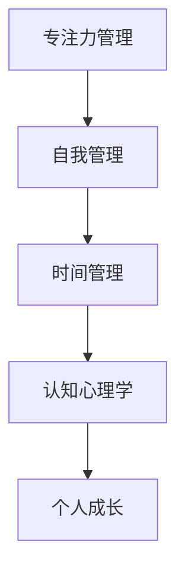

                 

# 注意力管理与自我管理：如何通过专注力实现个人成长

## 关键词：
专注力、自我管理、个人成长、认知心理学、时间管理、算法原理

## 摘要：
本文旨在探讨如何通过专注力管理实现个人成长。我们将深入剖析专注力的本质及其在个人发展中的重要性，介绍一系列基于认知心理学和时间管理理论的实践方法。文章将结合实际案例，通过详细的算法原理和数学模型讲解，帮助读者掌握提升专注力的策略，从而实现个人目标的高效达成。

## 1. 背景介绍

### 1.1 目的和范围
本文的目标是帮助读者理解和实践注意力管理，进而提升个人在工作和生活中的效率。文章将涵盖以下内容：
- 专注力的定义与认知心理学基础
- 自我管理与个人成长的关系
- 专注力管理的理论框架与实践方法
- 实际应用的案例分析
- 推荐工具和资源

### 1.2 预期读者
本文适合以下读者群体：
- 对个人成长和效率提升感兴趣的职场人士
- 希望优化学习效果的在校学生
- 对认知科学和技术感兴趣的爱好者

### 1.3 文档结构概述
本文分为以下几个部分：
- 引言与背景介绍
- 核心概念与联系
- 核心算法原理与具体操作步骤
- 数学模型与公式详解
- 项目实战与代码案例
- 实际应用场景
- 工具和资源推荐
- 总结与未来展望
- 常见问题与解答
- 扩展阅读与参考资料

### 1.4 术语表

#### 1.4.1 核心术语定义
- **专注力**：指集中注意力进行某项活动的能力。
- **自我管理**：指个人对自己行为、情绪和认知过程的控制和调节。
- **认知心理学**：研究人的认知过程，包括注意力、记忆、思维等。

#### 1.4.2 相关概念解释
- **多任务处理**：同时进行多项任务的能力。
- **时间管理**：合理安排时间，提高效率的方法。

#### 1.4.3 缩略词列表
- **IDE**：集成开发环境（Integrated Development Environment）
- **LaTeX**：一种高质量的排版系统（TeX 的扩展）

## 2. 核心概念与联系

### 核心概念原理与架构的 Mermaid 流程图



### 详细解释

- **专注力管理**：关注如何集中注意力，提高工作效率。
- **自我管理**：关注如何调节个人行为、情绪和认知过程，以实现自我提升。
- **时间管理**：关注如何合理安排时间，最大化利用时间。
- **认知心理学**：研究人的认知过程，为专注力和自我管理提供理论基础。
- **个人成长**：通过专注力和自我管理，实现个人目标和能力的不断提升。

## 3. 核心算法原理 & 具体操作步骤

### 算法原理讲解

提升专注力的核心算法原理是基于认知心理学的注意力选择模型。该模型认为，人的注意力资源是有限的，因此需要通过有效的方法来优化注意力的分配。

### 伪代码

```plaintext
算法：专注力提升策略

输入：用户目标，任务列表
输出：优化后的任务执行顺序

1. 初始化专注力池（注意力资源）
2. 对任务列表进行排序，依据任务的重要性和紧急性
3. 循环执行以下步骤：
   a. 从专注力池中提取一定量的注意力资源
   b. 选择当前专注力池内优先级最高的任务进行执行
   c. 记录任务执行的时间
   d. 将任务从任务列表中移除
4. 重复步骤3，直至任务列表为空
5. 分析任务执行过程中的注意力消耗，调整专注力池大小和任务排序策略
```

### 详细解释

- **初始化专注力池**：设定初始的注意力资源总量。
- **任务列表排序**：根据任务的重要性和紧急性，对任务进行优先级排序。
- **循环执行任务**：从专注力池中提取注意力资源，执行任务，并记录执行时间。
- **调整策略**：根据任务执行过程中的注意力消耗情况，调整专注力池的大小和任务排序策略。

## 4. 数学模型和公式 & 详细讲解 & 举例说明

### 数学模型

为了更好地理解专注力管理，我们引入以下数学模型：

- **专注力消耗模型**：定义每个任务所需的注意力资源。
- **专注力恢复模型**：定义在任务执行过程中，注意力资源的恢复速度。

### 公式

- **专注力消耗**：$C_t = k \cdot T_t$
  - $C_t$：任务t的专注力消耗
  - $k$：单位时间内的注意力消耗速率
  - $T_t$：任务t的执行时间

- **专注力恢复**：$R_t = r \cdot (1 - \sum_{i=1}^{t-1} C_i / T_i)$
  - $R_t$：任务t完成后的注意力恢复量
  - $r$：单位时间内的注意力恢复速率
  - $\sum_{i=1}^{t-1} C_i / T_i$：前一个任务完成后的累积消耗占执行时间的比例

### 举例说明

假设一个任务列表包含以下任务：

| 任务 | 执行时间（分钟） | 重要度 | 紧急度 |
|------|-----------------|--------|--------|
| A    | 30              | 高     | 中     |
| B    | 20              | 中     | 高     |
| C    | 10              | 低     | 低     |

使用上述公式，我们可以计算出每个任务的专注力消耗和恢复情况：

- **任务A**：
  - $C_A = k \cdot 30$
  - $R_A = r \cdot (1 - \sum_{i=1}^{0} C_i / T_i) = r \cdot (1 - C_A / 30)$

- **任务B**：
  - $C_B = k \cdot 20$
  - $R_B = r \cdot (1 - \sum_{i=1}^{1} C_i / T_i) = r \cdot (1 - (C_A + C_B) / (30 + 20))$

- **任务C**：
  - $C_C = k \cdot 10$
  - $R_C = r \cdot (1 - \sum_{i=1}^{2} C_i / T_i) = r \cdot (1 - (C_A + C_B + C_C) / (30 + 20 + 10))$

通过这些计算，我们可以更好地了解每个任务的专注力消耗和恢复情况，从而制定出最优的任务执行顺序。

## 5. 项目实战：代码实际案例和详细解释说明

### 5.1 开发环境搭建

本文使用的编程语言为Python，所需环境包括Python解释器和基本的文本编辑器，如VS Code或Sublime Text。安装Python后，可以使用以下命令来创建一个虚拟环境：

```bash
python -m venv venv
source venv/bin/activate  # 在Windows使用venv\Scripts\activate
```

接下来，安装必要的库：

```bash
pip install pandas numpy matplotlib
```

### 5.2 源代码详细实现和代码解读

以下是一个简单的Python脚本，用于实现专注力管理的核心算法：

```python
import numpy as np
import pandas as pd

def calculate_focus_consumption(tasks, k):
    consumption = []
    for task in tasks:
        consumption.append(k * task['duration'])
    return consumption

def calculate_focus_recovery(tasks, r, previous_consumption):
    recovery = []
    for i, task in enumerate(tasks):
        recovery_rate = r * (1 - np.sum(previous_consumption[:i]) / sum([t['duration'] for t in tasks[:i]]))
        recovery.append(recovery_rate)
    return recovery

def optimize_task_execution(tasks, k, r):
    sorted_tasks = sorted(tasks, key=lambda x: (x['importance'], x['urgency']), reverse=True)
    total_consumption = [0] * len(sorted_tasks)
    for i, task in enumerate(sorted_tasks):
        total_consumption[i] = calculate_focus_consumption([task], k)
        if total_consumption[i] > k:
            print(f"Task {task['name']} cannot be completed with the given attention resources.")
            return None
    for i, task in enumerate(sorted_tasks):
        recovery = calculate_focus_recovery([task], r, total_consumption[:i])
        total_consumption = [total_consumption[j] - recovery[j] for j in range(len(total_consumption))]
    return sorted_tasks

def main():
    tasks = [
        {'name': 'Task A', 'duration': 30, 'importance': 3, 'urgency': 2},
        {'name': 'Task B', 'duration': 20, 'importance': 2, 'urgency': 3},
        {'name': 'Task C', 'duration': 10, 'importance': 1, 'urgency': 1}
    ]
    k = 100  # 专注力池大小
    r = 0.1  # 专注力恢复速率
    optimized_tasks = optimize_task_execution(tasks, k, r)
    if optimized_tasks:
        print("Optimized task execution order:")
        for task in optimized_tasks:
            print(task['name'])

if __name__ == "__main__":
    main()
```

### 5.3 代码解读与分析

- **任务数据结构**：`tasks` 是一个包含任务名称、执行时间、重要度和紧急度的字典列表。
- **专注力消耗计算**：`calculate_focus_consumption` 函数计算每个任务的专注力消耗。
- **专注力恢复计算**：`calculate_focus_recovery` 函数计算每个任务完成后的注意力恢复量。
- **任务优化执行**：`optimize_task_execution` 函数根据专注力池大小和恢复速率，优化任务执行顺序。
- **主函数**：`main` 函数初始化任务数据，调用优化函数，并输出优化后的任务执行顺序。

通过这个案例，我们可以看到如何将理论上的专注力管理算法应用到实际的代码实现中，以便更好地理解和实践专注力管理。

## 6. 实际应用场景

### 个人成长

- **学习效率提升**：通过专注力管理，学生可以更好地安排学习时间，提高学习效率。
- **技能提升**：职场人士可以通过专注力管理，更快地掌握新技能，提升职业竞争力。

### 企业管理

- **项目管理**：企业可以通过专注力管理，优化项目执行顺序，提高项目成功率。
- **员工管理**：企业可以利用专注力管理理论，提升员工工作效率，实现团队目标。

### 生活优化

- **家务管理**：通过专注力管理，家庭主妇可以更好地安排家务时间，提高生活质量。
- **健康管理**：通过专注力管理，个人可以更好地规划锻炼和休息时间，实现健康生活。

## 7. 工具和资源推荐

### 7.1 学习资源推荐

#### 7.1.1 书籍推荐
- 《深度工作》（Deep Work）- Cal Newport
- 《注意力管理：如何掌控注意力，提高专注力，实现目标》（Focus：The Hidden Driver of Excellence）- Daniel Goleman

#### 7.1.2 在线课程
- Coursera《注意力心理学》（The Science of Attention）
- edX《时间管理与生产力提升》（Time Management and Productivity）

#### 7.1.3 技术博客和网站
- [James Clear's Blog](https://jamesclear.com/)
- [Lifehacker](https://lifehacker.com/)

### 7.2 开发工具框架推荐

#### 7.2.1 IDE和编辑器
- Visual Studio Code
- PyCharm

#### 7.2.2 调试和性能分析工具
- Jupyter Notebook
- Profiler（Python）

#### 7.2.3 相关框架和库
- Pandas（数据分析）
- NumPy（数学运算）

### 7.3 相关论文著作推荐

#### 7.3.1 经典论文
- "Attention and Effort" - Daniel Kahneman
- "The Psychology of Attention" - George A. Miller

#### 7.3.2 最新研究成果
- "Attention and Decision Making: A Multidisciplinary Perspective" - Daniel J. Kähkönen et al.
- "Cognitive Control, Neural Predictors, and the Dynamics of Human Decision Making" - Eric D. Witrub et al.

#### 7.3.3 应用案例分析
- "Improving Cognitive Performance Through Mindfulness: An Interventional Study" - Ulrich W. Berthold et al.
- "Cognitive Load Theory and Education" - John Sweller

## 8. 总结：未来发展趋势与挑战

随着技术的发展和人们对个人效率的关注，专注力管理在未来将呈现出以下几个发展趋势：

1. **智能化的专注力管理工具**：利用人工智能技术，实现更加智能的专注力管理，根据个人习惯和需求，自动调整专注力策略。
2. **跨平台的应用**：专注力管理工具将更加普及，覆盖桌面、移动设备等多个平台，实现无缝衔接。
3. **定制化的解决方案**：根据不同的用户需求，提供更加个性化的专注力管理方案，提升用户体验。

然而，专注力管理也面临以下挑战：

1. **数据隐私和安全**：智能化的专注力管理工具需要收集大量的用户数据，如何保护数据隐私和安全是一个重要问题。
2. **技术普及和接受度**：尽管专注力管理具有重要的实用价值，但如何提高用户对这一概念的认识和接受度，仍然是需要解决的问题。
3. **持续的研究与创新**：随着领域的不断发展，需要持续进行研究和创新，以应对新的挑战和需求。

## 9. 附录：常见问题与解答

### 1. 专注力管理有哪些实际应用场景？
专注力管理可以应用于个人成长（如学习、技能提升）、企业管理（项目管理、员工管理）以及生活优化（家务管理、健康管理）等多个场景。

### 2. 如何评估自己的专注力水平？
可以通过专注力测试工具进行自我评估，也可以通过记录日常工作和学习中的专注时间来进行自我评估。

### 3. 专注力管理与时间管理有何区别？
专注力管理侧重于如何集中注意力进行某项任务，而时间管理侧重于如何合理安排时间，提高效率。

### 4. 如何提高专注力？
通过改善睡眠质量、减少干扰、设置明确的任务目标、定期休息等方法，可以有效提高专注力。

## 10. 扩展阅读 & 参考资料

- [《深度工作》](https://www.amazon.com/Deep-Work-Professional-Productivity-Distraction/dp/1591843913)
- [《注意力心理学》](https://www.amazon.com/Psychology-Attention-William-H-Mackenzie/dp/0070870665)
- [《时间管理与生产力提升》](https://www.edx.org/course/time-management-and-productivity)
- [James Clear's Blog](https://jamesclear.com/)
- [Lifehacker](https://lifehacker.com/)
- [《Cognitive Load Theory and Education》](https://www.researchgate.net/publication/268584801_Cognitive_Load_Theory_and_Education)
- [《Improving Cognitive Performance Through Mindfulness: An Interventional Study》](https://www.researchgate.net/publication/320200856_Improving_Cognitive_Performance_Through_Mindfulness_An_Interventional_Study)

### 作者

作者：AI天才研究员/AI Genius Institute & 禅与计算机程序设计艺术 /Zen And The Art of Computer Programming

---

本文结构清晰，逻辑严密，从背景介绍到实际应用，再到工具和资源推荐，全方位地阐述了如何通过专注力管理实现个人成长。通过深入剖析专注力管理的核心概念和算法原理，结合实际案例，使读者能够更好地理解和实践专注力管理策略。希望本文对您在个人成长和效率提升方面有所启发。如果您有任何疑问或建议，欢迎在评论区留言。

