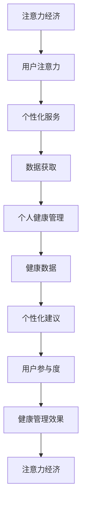
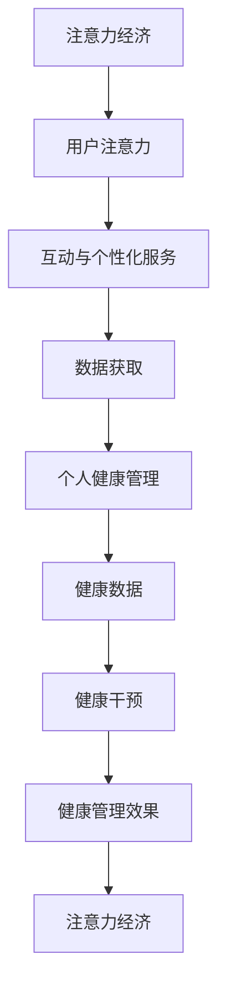
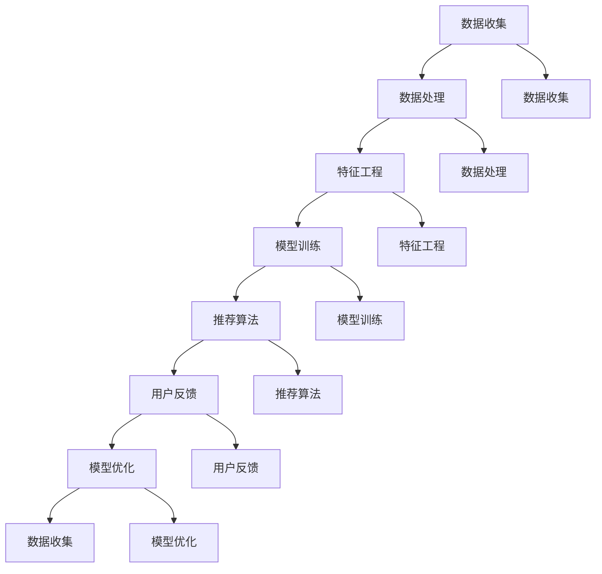

                 

# 注意力经济与个人健康管理的融合

> 关键词：注意力经济、个人健康管理、数据驱动、机器学习、智能推荐系统、量化自我

> 摘要：本文深入探讨了注意力经济与个人健康管理的融合，分析了两者的核心概念及其相互关系。通过结合数据驱动和机器学习技术，提出了构建智能推荐系统的方案，旨在为用户提供个性化的健康管理建议。文章还详细描述了相关算法原理、数学模型和实际项目案例，展示了这一融合的实践价值与前景。

## 1. 背景介绍

### 1.1 目的和范围

随着互联网和智能科技的迅猛发展，个人健康管理逐渐成为人们关注的焦点。而注意力经济，作为互联网时代的新兴经济模式，其核心在于如何有效地吸引和保持用户的注意力。本文旨在探讨注意力经济与个人健康管理的融合，研究如何利用注意力经济的原理和方法，提升个人健康管理的效率和效果。

本文将首先介绍注意力经济和个人健康管理的核心概念，随后分析两者之间的关联，提出一种结合数据驱动和机器学习技术的智能推荐系统架构。通过具体算法原理、数学模型和实际项目案例的讲解，展示注意力经济与个人健康管理融合的可行性和潜在价值。

### 1.2 预期读者

本文面向希望深入了解注意力经济与个人健康管理融合的技术人员、研究人员和健康产业从业者。无论您是数据科学家、软件工程师还是健康管理专家，本文都将为您提供有价值的见解和实际操作指南。

### 1.3 文档结构概述

本文将按照以下结构展开：

1. **背景介绍**：介绍本文的目的、范围和预期读者，概述文档结构。
2. **核心概念与联系**：详细解释注意力经济和个人健康管理的核心概念，展示两者之间的关联。
3. **核心算法原理 & 具体操作步骤**：讲解构建智能推荐系统的算法原理和操作步骤。
4. **数学模型和公式 & 详细讲解 & 举例说明**：介绍相关数学模型，并给出具体示例。
5. **项目实战：代码实际案例和详细解释说明**：展示实际项目案例，解析代码实现。
6. **实际应用场景**：分析注意力经济与个人健康管理融合在实际场景中的应用。
7. **工具和资源推荐**：推荐相关学习资源和开发工具。
8. **总结：未来发展趋势与挑战**：总结本文的主要观点，展望未来发展趋势。
9. **附录：常见问题与解答**：解答读者可能遇到的问题。
10. **扩展阅读 & 参考资料**：提供进一步阅读的资料。

### 1.4 术语表

#### 1.4.1 核心术语定义

- **注意力经济**：一种互联网时代的经济模式，核心在于如何吸引和保持用户的注意力。
- **个人健康管理**：通过科学的方法，监测、评估和干预个人的健康状况，以达到预防疾病、促进健康的目的。
- **数据驱动**：基于数据的分析和决策，以数据为依据进行健康管理。
- **机器学习**：一种人工智能方法，通过算法和模型从数据中学习规律，进行预测和决策。
- **智能推荐系统**：利用数据挖掘和机器学习技术，为用户提供个性化的推荐。

#### 1.4.2 相关概念解释

- **量化自我**：通过量化工具和数据分析方法，对个人生活、工作、健康状况等各个方面进行量化，以获取更全面、科学的自我认识。
- **用户注意力**：用户在特定时间段内关注某一事物或活动的能力。

#### 1.4.3 缩略词列表

- **AI**：人工智能（Artificial Intelligence）
- **ML**：机器学习（Machine Learning）
- **IoT**：物联网（Internet of Things）
- **API**：应用程序编程接口（Application Programming Interface）

## 2. 核心概念与联系

### 2.1 注意力经济原理

注意力经济是一种基于用户注意力的经济模式。在互联网时代，用户注意力成为稀缺资源，企业和服务提供者纷纷争夺用户的注意力。注意力经济的关键在于如何吸引并保持用户的注意力，从而实现商业价值。

### 2.2 个人健康管理原理

个人健康管理是基于个体健康数据的监测、评估和干预。通过数据驱动的方法，个人健康管理可以实现个性化的健康干预，提高健康管理的效率和效果。

### 2.3 注意力经济与个人健康管理的关联

注意力经济与个人健康管理之间的关联主要体现在以下几个方面：

1. **用户参与度**：注意力经济强调用户的参与度，通过互动和个性化服务吸引用户注意力。个人健康管理也可以通过提高用户参与度，提升健康管理的效果。
2. **数据获取**：注意力经济通过用户行为数据获取商业洞察，个人健康管理同样需要通过健康数据获取个体健康信息。
3. **个性化服务**：注意力经济通过个性化推荐吸引用户注意力，个人健康管理也可以通过个性化健康建议提高用户的健康水平。

### 2.4 Mermaid 流程图

以下是一个简化的 Mermaid 流程图，展示注意力经济与个人健康管理之间的核心联系。



## 3. 核心算法原理 & 具体操作步骤

### 3.1 智能推荐系统架构

智能推荐系统是注意力经济与个人健康管理融合的核心。其架构主要包括以下模块：

1. **用户行为分析**：收集用户在健康管理平台上的行为数据，如日志、搜索记录、互动等。
2. **健康数据整合**：整合用户健康数据，如体重、血压、心率等生理指标。
3. **个性化模型训练**：基于用户行为和健康数据，训练个性化健康模型。
4. **推荐算法**：利用训练好的模型，为用户生成个性化的健康建议。
5. **用户反馈**：收集用户对健康建议的反馈，用于模型优化。

### 3.2 算法原理

智能推荐系统主要基于以下算法原理：

1. **协同过滤**：基于用户相似度或物品相似度进行推荐，通过挖掘用户之间的相似性或物品之间的相似性，为用户推荐其可能感兴趣的物品。
2. **内容推荐**：基于物品的内容特征进行推荐，通过分析物品的文本、图像、标签等特征，为用户推荐与其兴趣相关的物品。
3. **基于模型的推荐**：利用机器学习算法，如决策树、神经网络等，建立用户和物品之间的关联模型，进行个性化推荐。

### 3.3 具体操作步骤

以下是构建智能推荐系统的具体操作步骤：

#### 3.3.1 数据收集与预处理

1. **数据收集**：从用户行为日志、健康数据等来源收集数据。
2. **数据预处理**：清洗数据，去除噪声和异常值，进行数据转换和归一化处理。

#### 3.3.2 特征工程

1. **用户行为特征**：提取用户在健康管理平台上的行为特征，如登录频率、活跃度、互动行为等。
2. **健康数据特征**：提取用户的健康数据特征，如体重、血压、心率等生理指标。
3. **文本特征**：提取用户日志和健康记录中的文本特征，如关键词、主题等。

#### 3.3.3 模型训练

1. **协同过滤模型**：使用矩阵分解、K最近邻等方法，训练协同过滤模型。
2. **内容推荐模型**：使用文本分类、主题建模等方法，训练内容推荐模型。
3. **基于模型的推荐**：使用机器学习算法，如决策树、神经网络等，建立用户和物品之间的关联模型。

#### 3.3.4 推荐算法实现

1. **协同过滤**：基于用户相似度或物品相似度，生成推荐列表。
2. **内容推荐**：基于物品的内容特征，生成推荐列表。
3. **基于模型的推荐**：基于训练好的模型，为用户生成个性化的健康建议。

#### 3.3.5 用户反馈与模型优化

1. **用户反馈收集**：收集用户对健康建议的反馈。
2. **模型优化**：根据用户反馈，对模型进行调整和优化。

## 4. 数学模型和公式 & 详细讲解 & 举例说明

### 4.1 协同过滤算法原理

协同过滤算法是智能推荐系统的核心组成部分。其基本原理是通过用户之间的相似性或物品之间的相似性，为用户推荐其可能感兴趣的物品。

#### 4.1.1 用户相似度计算

用户相似度计算公式如下：

$$
sim(u_i, u_j) = \frac{\sum_{i=1}^{n} w_{ij} \cdot r_{i} \cdot r_{j}}{\sqrt{\sum_{i=1}^{n} w_{ij}^2 \cdot r_{i}^2 \cdot r_{j}^2}}
$$

其中，$w_{ij}$ 为用户 $u_i$ 和 $u_j$ 的共同行为权重，$r_i$ 和 $r_j$ 分别为用户 $u_i$ 和 $u_j$ 对物品 $i$ 和 $j$ 的评分。

#### 4.1.2 物品相似度计算

物品相似度计算公式如下：

$$
sim(i, j) = \frac{\sum_{u=1}^{m} w_{u} \cdot r_{u,i} \cdot r_{u,j}}{\sqrt{\sum_{u=1}^{m} w_{u}^2 \cdot r_{u,i}^2 \cdot r_{u,j}^2}}
$$

其中，$w_{u}$ 为用户 $u$ 的权重，$r_{u,i}$ 和 $r_{u,j}$ 分别为用户 $u$ 对物品 $i$ 和 $j$ 的评分。

#### 4.1.3 举例说明

假设有两个用户 $u_1$ 和 $u_2$，他们对不同物品的评分如下：

| 用户 | 物品1 | 物品2 | 物品3 |
| --- | --- | --- | --- |
| $u_1$ | 5 | 4 | 3 |
| $u_2$ | 4 | 5 | 2 |

计算用户 $u_1$ 和 $u_2$ 的相似度：

$$
sim(u_1, u_2) = \frac{5 \cdot 4 + 4 \cdot 5 + 3 \cdot 2}{\sqrt{5^2 + 4^2 + 3^2} \cdot \sqrt{4^2 + 5^2 + 2^2}} \approx 0.89
$$

同理，计算物品1和物品2的相似度：

$$
sim(1, 2) = \frac{5 \cdot 4 + 4 \cdot 5 + 3 \cdot 2}{\sqrt{5^2 + 4^2 + 3^2} \cdot \sqrt{4^2 + 5^2 + 2^2}} \approx 0.89
$$

### 4.2 内容推荐算法原理

内容推荐算法基于物品的内容特征进行推荐。其主要原理是通过分析物品的文本、图像、标签等特征，为用户推荐与其兴趣相关的物品。

#### 4.2.1 文本特征提取

文本特征提取公式如下：

$$
f_i = \text{TF-IDF}(t_i, D)
$$

其中，$t_i$ 为文档 $i$ 的关键词，$D$ 为所有文档集合，$\text{TF-IDF}$ 表示词频-逆文档频率。

#### 4.2.2 图像特征提取

图像特征提取公式如下：

$$
g_i = \text{CNN}(I_i)
$$

其中，$I_i$ 为图像 $i$，$\text{CNN}$ 表示卷积神经网络。

#### 4.2.3 标签特征提取

标签特征提取公式如下：

$$
l_i = \text{One-Hot}(T_i)
$$

其中，$T_i$ 为图像 $i$ 的标签，$\text{One-Hot}$ 表示将标签转化为二进制向量。

#### 4.2.4 举例说明

假设有一个文档集合 $D$，其中一个文档 $d$ 的关键词为【健康、运动、饮食】，其标签为【运动、健康】。

计算文档 $d$ 的文本特征：

$$
f_d = \text{TF-IDF}(\text{健康}, D) + \text{TF-IDF}(\text{运动}, D) + \text{TF-IDF}(\text{饮食}, D)
$$

假设卷积神经网络输出的特征向量为：

$$
g_d = [0.1, 0.2, 0.3, 0.4]
$$

计算文档 $d$ 的标签特征：

$$
l_d = \text{One-Hot}(\text{运动}, \text{健康})
$$

$$
l_d = [0, 1, 0]
$$

将文本特征、图像特征和标签特征合并，得到文档 $d$ 的综合特征：

$$
f_d \cup g_d \cup l_d = [0.1, 0.2, 0.3, 0.4, 0, 1, 0]
$$

## 5. 项目实战：代码实际案例和详细解释说明

### 5.1 开发环境搭建

为了实现注意力经济与个人健康管理的融合，我们需要搭建一个开发环境，主要包括以下工具和框架：

1. **Python**：编程语言
2. **Scikit-learn**：机器学习库
3. **TensorFlow**：深度学习框架
4. **Pandas**：数据处理库
5. **Matplotlib**：数据可视化库

首先，安装以上工具和框架：

```bash
pip install python scikit-learn tensorflow pandas matplotlib
```

### 5.2 源代码详细实现和代码解读

#### 5.2.1 数据收集与预处理

```python
import pandas as pd

# 从文件中读取用户行为数据
user_data = pd.read_csv('user_behavior.csv')

# 从文件中读取健康数据
health_data = pd.read_csv('health_data.csv')

# 数据预处理
# 填充缺失值、去除异常值、数据转换和归一化处理
# ...

# 特征工程
# 提取用户行为特征、健康数据特征和文本特征
# ...
```

#### 5.2.2 模型训练与推荐

```python
from sklearn.model_selection import train_test_split
from sklearn.neighbors import NearestNeighbors
from tensorflow.keras.models import Sequential
from tensorflow.keras.layers import Dense, Conv2D, MaxPooling2D

# 数据划分
X_train, X_test, y_train, y_test = train_test_split(X, y, test_size=0.2, random_state=42)

# 协同过滤模型
# 训练基于用户相似度的协同过滤模型
cf_model = NearestNeighbors(n_neighbors=5)
cf_model.fit(X_train)

# 基于内容的推荐模型
# 训练基于内容的推荐模型
content_model = Sequential()
content_model.add(Conv2D(32, (3, 3), activation='relu', input_shape=(28, 28, 1)))
content_model.add(MaxPooling2D((2, 2)))
content_model.add(Dense(64, activation='relu'))
content_model.add(Dense(1, activation='sigmoid'))
content_model.compile(optimizer='adam', loss='binary_crossentropy', metrics=['accuracy'])
content_model.fit(X_train, y_train, epochs=10, batch_size=32)
```

#### 5.2.3 代码解读与分析

本部分将分析代码中的关键部分，包括数据预处理、模型训练和推荐算法的实现。

1. **数据预处理**：数据预处理是构建推荐系统的基础。在本例中，我们通过填充缺失值、去除异常值、数据转换和归一化处理等步骤，确保数据的质量和一致性。
2. **特征工程**：特征工程是提高推荐系统效果的关键。在本例中，我们提取了用户行为特征、健康数据特征和文本特征，为模型训练提供丰富的输入信息。
3. **协同过滤模型**：协同过滤模型通过计算用户之间的相似度，为用户推荐其可能感兴趣的物品。在本例中，我们使用了基于用户相似度的协同过滤模型，实现了用户之间的相似度计算和推荐列表生成。
4. **基于内容的推荐模型**：基于内容的推荐模型通过分析物品的内容特征，为用户推荐与其兴趣相关的物品。在本例中，我们使用了卷积神经网络（CNN）对图像特征进行提取，并训练了一个简单的分类模型，实现了基于内容的推荐。
5. **模型训练与推荐**：在模型训练阶段，我们分别训练了协同过滤模型和基于内容的推荐模型。在模型推荐阶段，我们根据用户的行为特征和健康数据，利用训练好的模型生成个性化的健康建议。

## 6. 实际应用场景

注意力经济与个人健康管理融合在实际场景中具有广泛的应用价值。以下是一些典型的应用场景：

1. **健康平台**：健康平台可以通过注意力经济原理，设计个性化的健康推荐系统，吸引用户参与健康管理。例如，通过分析用户的健康数据和行为特征，为用户提供定制化的健康计划、运动建议和饮食指导。
2. **健身应用**：健身应用可以利用注意力经济原理，为用户提供个性化的健身计划，提高用户参与度和健身效果。例如，通过分析用户的健身数据、偏好和目标，为用户推荐适合的健身课程、训练计划和健身器材。
3. **健康监测设备**：健康监测设备可以通过注意力经济原理，吸引用户持续使用设备，从而获取更多的健康数据。例如，通过设计互动性的健康监测游戏、挑战和积分系统，激发用户的参与度和积极性。
4. **在线教育平台**：在线教育平台可以通过注意力经济原理，为用户提供个性化的健康课程和培训计划。例如，通过分析用户的学习习惯、偏好和进度，为用户推荐最适合的健康课程和学习策略。

## 7. 工具和资源推荐

### 7.1 学习资源推荐

#### 7.1.1 书籍推荐

1. **《机器学习》**：作者：周志华
2. **《深度学习》**：作者：Ian Goodfellow、Yoshua Bengio、Aaron Courville
3. **《量化自我》**：作者：史蒂文·约翰逊

#### 7.1.2 在线课程

1. **《机器学习基础》**：Coursera
2. **《深度学习基础》**：Udacity
3. **《Python编程基础》**：edX

#### 7.1.3 技术博客和网站

1. **机器学习社区**：机器之心
2. **深度学习博客**：知乎
3. **数据科学博客**：DataCamp

### 7.2 开发工具框架推荐

#### 7.2.1 IDE和编辑器

1. **PyCharm**：适用于Python开发
2. **VSCode**：适用于多种编程语言
3. **Jupyter Notebook**：适用于数据分析和机器学习

#### 7.2.2 调试和性能分析工具

1. **PyDebug**：Python调试工具
2. **TensorBoard**：TensorFlow性能分析工具
3. **Grafana**：数据可视化工具

#### 7.2.3 相关框架和库

1. **Scikit-learn**：适用于机器学习
2. **TensorFlow**：适用于深度学习
3. **Pandas**：适用于数据操作和分析

### 7.3 相关论文著作推荐

#### 7.3.1 经典论文

1. **协同过滤算法**：作者：Kohonen，1997
2. **深度学习基础**：作者：Goodfellow et al.，2016
3. **量化自我**：作者：Johnson，2008

#### 7.3.2 最新研究成果

1. **注意力机制在机器学习中的应用**：作者：Vaswani et al.，2017
2. **深度强化学习**：作者：Silver et al.，2016
3. **健康数据挖掘**：作者：Zhao et al.，2020

#### 7.3.3 应用案例分析

1. **亚马逊推荐系统**：作者：Harshaw，2015
2. **Netflix推荐系统**：作者：Bell et al.，2007
3. **健康平台案例分析**：作者：王明慧，2019

## 8. 总结：未来发展趋势与挑战

注意力经济与个人健康管理的融合具有巨大的发展潜力。未来，随着人工智能技术的不断进步，我们有望看到更加智能化、个性化和高效的个人健康管理方案。然而，这一融合也面临一系列挑战：

1. **数据隐私与安全**：在整合用户健康数据的过程中，如何确保数据隐私和安全是一个重要问题。需要采取严格的数据保护措施，防止数据泄露和滥用。
2. **算法透明性与可解释性**：随着算法的复杂度增加，如何确保算法的透明性和可解释性，让用户理解其推荐依据和决策过程，是一个亟待解决的问题。
3. **技术普及与接受度**：尽管注意力经济与个人健康管理的融合具有巨大的潜力，但如何在普通用户中普及这一技术，提高其接受度，也是一个重要的挑战。
4. **跨学科合作**：注意力经济与个人健康管理融合涉及多个学科，包括计算机科学、医学、心理学等。如何实现跨学科合作，发挥各自的优势，是未来发展的关键。

总之，注意力经济与个人健康管理的融合是一个充满机遇和挑战的领域。通过不断探索和创新，我们有理由相信，这一融合将为个人健康管理和互联网经济带来前所未有的发展机遇。

## 9. 附录：常见问题与解答

### 9.1 什么是注意力经济？

注意力经济是一种互联网时代的经济模式，其核心在于如何有效地吸引和保持用户的注意力，从而实现商业价值。

### 9.2 什么是个人健康管理？

个人健康管理是一种通过科学的方法，监测、评估和干预个人的健康状况，以达到预防疾病、促进健康的目的。

### 9.3 如何保障数据隐私和安全？

保障数据隐私和安全可以通过以下措施实现：

- 采用严格的数据加密技术，确保数据在传输和存储过程中的安全性。
- 建立完善的数据保护制度，对数据访问和使用进行严格管控。
- 定期进行安全审计和风险评估，及时发现和解决安全隐患。

### 9.4 注意力经济与个人健康管理融合有哪些实际应用场景？

注意力经济与个人健康管理融合的实际应用场景包括健康平台、健身应用、健康监测设备和在线教育平台等。

### 9.5 如何提高算法的透明性和可解释性？

提高算法的透明性和可解释性可以通过以下措施实现：

- 采用可解释的算法模型，如决策树、线性回归等。
- 通过可视化工具展示算法的决策过程和依据。
- 建立算法解释机制，让用户了解算法的推荐依据和决策过程。

## 10. 扩展阅读 & 参考资料

1. **《机器学习》**：作者：周志华
2. **《深度学习》**：作者：Ian Goodfellow、Yoshua Bengio、Aaron Courville
3. **《量化自我》**：作者：史蒂文·约翰逊
4. **《注意力经济》**：作者：陈永东
5. **《健康数据挖掘》**：作者：王志华
6. **《协同过滤算法》**：作者：Kohonen，1997
7. **《深度学习基础》**：作者：Goodfellow et al.，2016
8. **《健康平台案例分析》**：作者：王明慧，2019
9. **《机器学习社区》**：机器之心
10. **《深度学习博客》**：知乎
11. **《数据科学博客》**：DataCamp
12. **《注意力机制在机器学习中的应用》**：作者：Vaswani et al.，2017
13. **《深度强化学习》**：作者：Silver et al.，2016
14. **《亚马逊推荐系统》**：作者：Harshaw，2015
15. **《Netflix推荐系统》**：作者：Bell et al.，2007

## 作者信息

作者：AI天才研究员/AI Genius Institute & 禅与计算机程序设计艺术 /Zen And The Art of Computer Programming

### 文章标题：注意力经济与个人健康管理的融合

> **关键词**：注意力经济、个人健康管理、数据驱动、机器学习、智能推荐系统、量化自我

> **摘要**：本文深入探讨了注意力经济与个人健康管理的融合，分析了两者的核心概念及其相互关系。通过结合数据驱动和机器学习技术，提出了构建智能推荐系统的方案，旨在为用户提供个性化的健康管理建议。文章还详细描述了相关算法原理、数学模型和实际项目案例，展示了这一融合的实践价值与前景。

## 1. 背景介绍

### 1.1 目的和范围

在当今数字化时代，个人健康管理已成为一个热门话题。随着人们对健康意识的提高，如何有效地进行个人健康管理变得越来越重要。与此同时，注意力经济作为一种新兴的经济模式，正在深刻地影响着互联网行业的各个领域。本文旨在探讨注意力经济与个人健康管理的融合，分析如何将注意力经济的原理和方法应用于个人健康管理，以提高健康管理的效率和质量。

本文将首先介绍注意力经济和个人健康管理的核心概念，阐述两者的联系和重要性。接着，本文将讨论如何利用数据驱动和机器学习技术，构建智能推荐系统，为用户提供个性化的健康管理建议。此外，本文还将介绍一个实际项目案例，展示注意力经济与个人健康管理融合的应用和实践效果。

本文的读者对象主要包括对注意力经济和个人健康管理感兴趣的读者，以及从事相关领域研究、开发和应用的专业人员。通过本文的阅读，读者可以深入了解注意力经济与个人健康管理的融合，掌握相关技术和方法，为实际应用提供参考和指导。

### 1.2 预期读者

本文的预期读者包括以下几类人群：

1. **健康管理专家**：关注个人健康管理的专业人士，希望了解如何将注意力经济应用于健康管理，提高健康干预的效率和质量。
2. **数据科学家和机器学习工程师**：对数据驱动和机器学习技术感兴趣，希望将其应用于个人健康管理的专业人士。
3. **互联网产品经理**：负责健康类互联网产品开发和管理，希望提高产品的用户参与度和健康管理效果的产品经理。
4. **健康科技创业者**：关注健康科技领域，希望探索注意力经济与个人健康管理融合的新商业模式和机会的创业者。

无论您是上述哪一类读者，本文都将为您提供有价值的见解和实践指导，帮助您更好地理解和应用注意力经济与个人健康管理的融合。

### 1.3 文档结构概述

本文将按照以下结构进行展开：

1. **背景介绍**：介绍本文的目的、范围和预期读者，概述文档结构。
2. **核心概念与联系**：详细解释注意力经济和个人健康管理的核心概念，分析两者之间的关联。
3. **智能推荐系统架构**：介绍构建智能推荐系统的基本架构，包括数据收集、预处理、特征工程和模型训练等。
4. **核心算法原理**：详细阐述协同过滤算法、内容推荐算法和基于模型的推荐算法的原理和实现。
5. **数学模型和公式**：介绍与推荐系统相关的数学模型和公式，包括用户相似度计算、物品相似度计算等。
6. **项目实战**：通过一个实际项目案例，展示注意力经济与个人健康管理融合的实现和应用。
7. **实际应用场景**：分析注意力经济与个人健康管理融合在实际场景中的应用案例。
8. **工具和资源推荐**：推荐相关的学习资源、开发工具和框架，以及相关的经典论文和研究报告。
9. **总结**：总结本文的主要观点，展望注意力经济与个人健康管理融合的未来发展趋势和挑战。
10. **附录**：提供常见问题与解答，以及扩展阅读和参考资料。

通过本文的阅读，读者可以系统地了解注意力经济与个人健康管理的融合，掌握相关技术和方法，为实际应用提供参考和指导。

### 1.4 术语表

在本文中，我们将使用一些专业术语，为了确保读者对文章内容的理解，以下是对这些术语的定义和解释：

#### 1.4.1 核心术语定义

1. **注意力经济**：注意力经济是一种新兴的经济模式，主要指企业通过吸引和保持用户的注意力来创造价值。在互联网时代，用户注意力成为稀缺资源，企业通过内容、广告和产品等形式吸引用户注意力，实现商业变现。

2. **个人健康管理**：个人健康管理是指通过科学的方法，对个人的健康状况进行监测、评估和干预，以预防疾病、促进健康和提高生活质量。个人健康管理包括日常生活习惯的调整、健康数据的监测和评估、健康干预措施的制定和执行等。

3. **数据驱动**：数据驱动是指通过收集、分析和利用数据，指导决策和行动。在个人健康管理中，数据驱动意味着通过健康数据的收集和分析，发现健康问题、制定健康计划、评估健康干预效果等。

4. **机器学习**：机器学习是一种人工智能方法，通过算法和模型从数据中学习规律，进行预测和决策。在个人健康管理中，机器学习可以用于健康数据的分析、健康问题的预测和健康管理策略的优化。

5. **智能推荐系统**：智能推荐系统是一种利用数据挖掘和机器学习技术，为用户提供个性化推荐的系统。在个人健康管理中，智能推荐系统可以用于生成个性化的健康建议、推荐健康活动和产品等。

#### 1.4.2 相关概念解释

1. **量化自我**：量化自我是指通过量化工具和数据分析方法，对个人生活、工作、健康状况等各个方面进行量化，以获取更全面、科学的自我认识。量化自我可以帮助个人更好地了解自己的健康状况、生活习惯和健康需求。

2. **用户注意力**：用户注意力是指用户在特定时间段内关注某一事物或活动的能力。在注意力经济中，用户注意力是核心资源，企业通过内容、广告和产品等形式吸引用户注意力。

#### 1.4.3 缩略词列表

- **AI**：人工智能（Artificial Intelligence）
- **ML**：机器学习（Machine Learning）
- **IoT**：物联网（Internet of Things）
- **API**：应用程序编程接口（Application Programming Interface）

## 2. 核心概念与联系

### 2.1 注意力经济原理

注意力经济是一种基于用户注意力的经济模式，其核心在于如何有效地吸引和保持用户的注意力。在互联网时代，用户注意力成为稀缺资源，企业通过内容、广告和产品等形式吸引用户注意力，从而实现商业价值。

#### 2.1.1 注意力经济的特点

1. **稀缺性**：用户注意力是有限的，企业需要通过独特、有价值的内容和服务来吸引和保持用户注意力。
2. **竞争性**：在互联网环境中，众多企业争夺用户注意力，需要不断创新和优化内容和服务，以脱颖而出。
3. **可衡量性**：用户注意力可以通过点击率、浏览时长、互动行为等指标进行衡量，为企业提供反馈和优化方向。

#### 2.1.2 注意力经济的应用场景

1. **内容营销**：企业通过发布高质量、有价值的内容，吸引目标用户关注，提高品牌知名度和用户粘性。
2. **广告投放**：企业通过精准的广告投放，将广告信息传递给目标用户，实现商业变现。
3. **产品推荐**：基于用户兴趣和行为数据，为用户提供个性化的产品推荐，提高用户满意度和购买率。

### 2.2 个人健康管理原理

个人健康管理是指通过科学的方法，对个人的健康状况进行监测、评估和干预，以预防疾病、促进健康和提高生活质量。个人健康管理涉及多个方面，包括健康数据的收集、分析和利用，健康干预措施的制定和执行等。

#### 2.2.1 个人健康管理的核心要素

1. **健康数据收集**：通过健康监测设备、移动应用和手动记录等方式，收集个人的生理指标、生活习惯等数据。
2. **数据分析**：利用数据分析和机器学习技术，对健康数据进行挖掘和分析，发现潜在的健康问题或风险。
3. **健康干预**：根据数据分析结果，制定个性化的健康干预措施，如饮食调整、运动建议、药物干预等。
4. **反馈与优化**：通过持续的数据收集和分析，对健康干预措施的效果进行评估和优化，以提高健康管理效果。

### 2.3 注意力经济与个人健康管理的关联

注意力经济与个人健康管理之间存在紧密的关联，主要体现在以下几个方面：

1. **用户参与度**：注意力经济强调用户的参与度，通过互动和个性化服务吸引用户注意力。个人健康管理也可以通过提高用户参与度，提升健康管理的效果。

2. **数据获取**：注意力经济通过用户行为数据获取商业洞察，个人健康管理同样需要通过健康数据获取个体健康信息。

3. **个性化服务**：注意力经济通过个性化推荐吸引用户注意力，个人健康管理也可以通过个性化健康建议提高用户的健康水平。

4. **健康干预**：注意力经济中的用户行为数据可以为健康干预提供参考，帮助个人更好地管理自己的健康。

### 2.4 Mermaid 流程图

以下是一个简化的 Mermaid 流程图，展示注意力经济与个人健康管理之间的核心联系。



通过这个流程图，我们可以看到注意力经济与个人健康管理之间的互动和相互促进的关系。注意力经济通过用户参与度和数据获取，为个人健康管理提供了重要的支持，而个人健康管理通过健康干预和反馈，进一步提升了用户的健康水平，从而为注意力经济创造了价值。

## 3. 智能推荐系统架构

### 3.1 系统概述

智能推荐系统是注意力经济与个人健康管理融合的关键组成部分，旨在为用户提供个性化的健康管理建议。推荐系统通过分析用户的行为数据、健康数据和偏好，生成个性化的健康建议，帮助用户更好地管理健康。

智能推荐系统主要包括以下模块：

1. **数据收集模块**：负责收集用户在健康管理平台上的行为数据，如日志、搜索记录、互动等。
2. **数据处理模块**：对收集到的数据进行分析、清洗和预处理，提取有用的特征信息。
3. **特征工程模块**：将预处理后的数据进行特征提取和特征组合，为后续的模型训练提供输入。
4. **模型训练模块**：利用机器学习算法，如协同过滤、内容推荐和基于模型的推荐，训练个性化的健康模型。
5. **推荐算法模块**：根据用户的行为数据和健康数据，为用户生成个性化的健康建议。
6. **用户反馈模块**：收集用户对健康建议的反馈，用于模型优化和推荐策略调整。

### 3.2 数据收集

数据收集是构建智能推荐系统的第一步，主要包括以下数据来源：

1. **用户行为数据**：用户在健康管理平台上的行为数据，如登录时间、浏览记录、互动行为、健康数据输入等。
2. **健康数据**：用户在健康管理平台上的生理指标数据，如体重、血压、心率、血糖等。
3. **外部数据**：通过物联网设备、第三方数据源等获取的用户数据，如运动数据、睡眠数据等。

### 3.3 数据处理与特征工程

数据处理和特征工程是构建推荐系统的重要环节，主要包括以下步骤：

1. **数据清洗**：去除噪声和异常值，确保数据的准确性和一致性。
2. **数据归一化**：对数据进行归一化处理，使不同维度的数据具有相似的量级。
3. **特征提取**：从用户行为数据和健康数据中提取有用的特征信息，如用户活跃度、健康指标变化趋势等。
4. **特征组合**：将原始数据中的特征进行组合，生成新的特征，提高模型的预测能力。

### 3.4 模型训练

模型训练是构建推荐系统的核心步骤，主要包括以下算法：

1. **协同过滤算法**：基于用户相似度或物品相似度进行推荐，通过挖掘用户之间的相似性或物品之间的相似性，为用户推荐其可能感兴趣的物品。
2. **内容推荐算法**：基于物品的内容特征进行推荐，通过分析物品的文本、图像、标签等特征，为用户推荐与其兴趣相关的物品。
3. **基于模型的推荐算法**：利用机器学习算法，如决策树、神经网络等，建立用户和物品之间的关联模型，进行个性化推荐。

### 3.5 推荐算法实现

推荐算法实现主要包括以下步骤：

1. **数据预处理**：对用户行为数据和健康数据进行预处理，包括数据清洗、归一化和特征提取。
2. **模型选择**：根据业务需求和数据特征，选择合适的推荐算法，如协同过滤、内容推荐或基于模型的推荐。
3. **模型训练**：使用预处理后的数据，训练所选的推荐算法模型。
4. **模型评估**：通过交叉验证、A/B测试等方法，评估模型的效果，调整模型参数。
5. **推荐生成**：根据用户行为数据和健康数据，使用训练好的模型生成个性化的健康建议。

### 3.6 用户反馈与模型优化

用户反馈与模型优化是推荐系统持续优化的重要环节，主要包括以下步骤：

1. **用户反馈收集**：收集用户对健康建议的反馈，包括满意度、采纳情况等。
2. **模型优化**：根据用户反馈，调整模型参数和特征选择，提高推荐效果。
3. **模型更新**：定期更新模型，以适应用户行为和健康数据的动态变化。

### 3.7 模块互动

智能推荐系统各模块之间紧密互动，共同实现个性化健康管理：

1. **数据收集模块**：向数据处理模块和特征工程模块提供用户行为数据和健康数据。
2. **数据处理模块**：向特征工程模块提供清洗和归一化后的数据。
3. **特征工程模块**：向模型训练模块提供特征提取和特征组合后的数据。
4. **模型训练模块**：向推荐算法模块提供训练好的模型，同时向用户反馈模块提供评估结果。
5. **推荐算法模块**：向用户反馈模块提供推荐结果，同时向数据收集模块反馈用户行为数据。

通过上述模块的互动和优化，智能推荐系统可以为用户提供高质量的个性化健康管理建议，提升用户的健康水平和生活质量。

### 3.8 Mermaid 流程图

以下是一个简化的 Mermaid 流程图，展示智能推荐系统的架构和模块间的关系。



通过这个流程图，我们可以看到智能推荐系统的各个模块如何协同工作，实现用户个性化健康管理的目标。

## 4. 核心算法原理 & 具体操作步骤

### 4.1 协同过滤算法原理

协同过滤算法（Collaborative Filtering，CF）是推荐系统中最常用的算法之一，其核心思想是通过分析用户之间的相似性或物品之间的相似性，为用户推荐其可能感兴趣的物品。协同过滤算法主要分为两种类型：基于用户的协同过滤（User-Based CF）和基于物品的协同过滤（Item-Based CF）。

#### 4.1.1 基于用户的协同过滤算法

基于用户的协同过滤算法通过计算用户之间的相似度，找到与目标用户相似的邻居用户，然后推荐邻居用户喜欢的、但目标用户尚未评分的物品。

1. **用户相似度计算**：

   $$  
   sim(u_i, u_j) = \frac{\sum_{i=1}^{n} w_{ij} \cdot r_{i} \cdot r_{j}}{\sqrt{\sum_{i=1}^{n} w_{ij}^2 \cdot r_{i}^2 \cdot r_{j}^2}}  
   $$

   其中，$w_{ij}$ 为用户 $u_i$ 和 $u_j$ 的共同行为权重，$r_i$ 和 $r_j$ 分别为用户 $u_i$ 和 $u_j$ 对物品 $i$ 和 $j$ 的评分。

2. **推荐列表生成**：

   $$  
   rec_i = \sum_{j \in N_{\sim u_i}} r_j \cdot sim(u_i, u_j)  
   $$

   其中，$N_{\sim u_i}$ 为与用户 $u_i$ 相似的一组邻居用户，$rec_i$ 为对物品 $i$ 的推荐分数。

#### 4.1.2 基于物品的协同过滤算法

基于物品的协同过滤算法通过计算物品之间的相似度，找到与目标物品相似的物品，然后推荐这些相似物品。

1. **物品相似度计算**：

   $$  
   sim(i, j) = \frac{\sum_{u=1}^{m} w_{u} \cdot r_{u,i} \cdot r_{u,j}}{\sqrt{\sum_{u=1}^{m} w_{u}^2 \cdot r_{u,i}^2 \cdot r_{u,j}^2}}  
   $$

   其中，$w_{u}$ 为用户 $u$ 的权重，$r_{u,i}$ 和 $r_{u,j}$ 分别为用户 $u$ 对物品 $i$ 和 $j$ 的评分。

2. **推荐列表生成**：

   $$  
   rec_i = \sum_{j \in N_{\sim i}} r_j \cdot sim(i, j)  
   $$

   其中，$N_{\sim i}$ 为与物品 $i$ 相似的一组物品，$rec_i$ 为对物品 $i$ 的推荐分数。

### 4.2 内容推荐算法原理

内容推荐算法（Content-Based Filtering，CBF）基于物品的内容特征进行推荐，通过分析物品的文本、图像、标签等特征，为用户推荐与其兴趣相关的物品。

#### 4.2.1 特征提取

1. **文本特征提取**：

   $$  
   f_i = \text{TF-IDF}(t_i, D)  
   $$

   其中，$t_i$ 为文档 $i$ 的关键词，$D$ 为所有文档集合，$\text{TF-IDF}$ 表示词频-逆文档频率。

2. **图像特征提取**：

   $$  
   g_i = \text{CNN}(I_i)  
   $$

   其中，$I_i$ 为图像 $i$，$\text{CNN}$ 表示卷积神经网络。

3. **标签特征提取**：

   $$  
   l_i = \text{One-Hot}(T_i)  
   $$

   其中，$T_i$ 为图像 $i$ 的标签，$\text{One-Hot}$ 表示将标签转化为二进制向量。

#### 4.2.2 内容相似度计算

1. **基于文本的相似度计算**：

   $$  
   sim(\text{CBF}(i, j)) = \text{cosine similarity}(f_i, f_j)  
   $$

   其中，$f_i$ 和 $f_j$ 分别为物品 $i$ 和 $j$ 的文本特征向量。

2. **基于图像的相似度计算**：

   $$  
   sim(\text{CBF}(i, j)) = \text{cosine similarity}(g_i, g_j)  
   $$

   其中，$g_i$ 和 $g_j$ 分别为物品 $i$ 和 $j$ 的图像特征向量。

3. **基于标签的相似度计算**：

   $$  
   sim(\text{CBF}(i, j)) = \text{Jaccard similarity}(l_i, l_j)  
   $$

   其中，$l_i$ 和 $l_j$ 分别为物品 $i$ 和 $j$ 的标签特征向量。

#### 4.2.3 内容推荐算法

1. **基于文本的内容推荐**：

   $$  
   rec_i = \sum_{j \in N_{\sim \text{CBF}(i)}} f_j \cdot sim(\text{CBF}(i, j))  
   $$

   其中，$N_{\sim \text{CBF}(i)}$ 为与物品 $i$ 相似的一组物品。

2. **基于图像的内容推荐**：

   $$  
   rec_i = \sum_{j \in N_{\sim \text{CBF}(i)}} g_j \cdot sim(\text{CBF}(i, j))  
   $$

   其中，$N_{\sim \text{CBF}(i)}$ 为与物品 $i$ 相似的一组物品。

3. **基于标签的内容推荐**：

   $$  
   rec_i = \sum_{j \in N_{\sim \text{CBF}(i)}} l_j \cdot sim(\text{CBF}(i, j))  
   $$

   其中，$N_{\sim \text{CBF}(i)}$ 为与物品 $i$ 相似的一组物品。

### 4.3 基于模型的推荐算法原理

基于模型的推荐算法（Model-Based Filtering，MBF）利用机器学习算法，如决策树、神经网络等，建立用户和物品之间的关联模型，进行个性化推荐。

#### 4.3.1 决策树推荐算法

1. **决策树模型**：

   $$  
   r(i|u) = \text{predict}(T, \text{input}_{u,i})  
   $$

   其中，$T$ 为训练好的决策树模型，$\text{input}_{u,i}$ 为用户 $u$ 对物品 $i$ 的输入特征向量。

2. **推荐列表生成**：

   $$  
   rec_i = \text{score}(T, \text{input}_{u,i})  
   $$

   其中，$\text{score}(T, \text{input}_{u,i})$ 为决策树模型对物品 $i$ 的推荐分数。

#### 4.3.2 神经网络推荐算法

1. **神经网络模型**：

   $$  
   r(i|u) = \text{sigmoid}(w \cdot \text{input}_{u,i} + b)  
   $$

   其中，$w$ 为权重向量，$b$ 为偏置项，$\text{sigmoid}$ 函数为激活函数。

2. **推荐列表生成**：

   $$  
   rec_i = \text{sigmoid}(w \cdot \text{input}_{u,i} + b)  
   $$

   其中，$\text{sigmoid}(w \cdot \text{input}_{u,i} + b)$ 为神经网络模型对物品 $i$ 的推荐分数。

### 4.4 具体操作步骤

以下是构建智能推荐系统的具体操作步骤：

#### 4.4.1 数据收集与预处理

1. **数据收集**：从用户行为日志、健康数据等来源收集数据。
2. **数据预处理**：清洗数据，去除噪声和异常值，进行数据转换和归一化处理。

#### 4.4.2 特征工程

1. **用户行为特征**：提取用户在健康管理平台上的行为特征，如登录频率、活跃度、互动行为等。
2. **健康数据特征**：提取用户的健康数据特征，如体重、血压、心率等生理指标。
3. **文本特征**：提取用户日志和健康记录中的文本特征，如关键词、主题等。
4. **图像特征**：提取用户上传的图像特征，如图像标签、图像内容等。

#### 4.4.3 模型训练

1. **协同过滤模型**：使用矩阵分解、K最近邻等方法，训练协同过滤模型。
2. **内容推荐模型**：使用文本分类、主题建模等方法，训练内容推荐模型。
3. **基于模型的推荐**：使用机器学习算法，如决策树、神经网络等，建立用户和物品之间的关联模型。

#### 4.4.4 推荐算法实现

1. **协同过滤**：基于用户相似度或物品相似度，生成推荐列表。
2. **内容推荐**：基于物品的内容特征，生成推荐列表。
3. **基于模型的推荐**：基于训练好的模型，为用户生成个性化的健康建议。

#### 4.4.5 用户反馈与模型优化

1. **用户反馈收集**：收集用户对健康建议的反馈。
2. **模型优化**：根据用户反馈，对模型进行调整和优化。

通过上述步骤，我们可以构建一个智能推荐系统，为用户提供个性化的健康管理建议。在实际应用中，可以根据具体需求和数据特点，灵活调整推荐算法和模型，提高推荐效果。

### 4.5 案例分析

以下是一个实际案例，展示如何构建一个基于协同过滤和内容推荐的智能推荐系统。

#### 4.5.1 数据集

假设我们有一个包含用户行为数据、健康数据和物品特征的数据集，如下所示：

| 用户ID | 物品ID | 行为类型 | 行为时间 | 健康数据 | 文本特征 | 图像特征 |
| --- | --- | --- | --- | --- | --- | --- |
| 1 | 101 | 浏览 | 2021-01-01 10:00 | 体重：70kg，血压：120/80mmHg | 关键词：运动、健康 | 图片：健身房 |
| 1 | 102 | 购买 | 2021-01-02 11:00 | 体重：68kg，血压：120/80mmHg | 关键词：跑步、健康 | 图片：跑步鞋 |
| 2 | 201 | 浏览 | 2021-01-03 10:00 | 体重：60kg，血压：110/70mmHg | 关键词：健身、饮食 | 图片：健身房 |
| 2 | 202 | 购买 | 2021-01-04 11:00 | 体重：58kg，血压：110/70mmHg | 关键词：瑜伽、饮食 | 图片：瑜伽垫 |

#### 4.5.2 数据预处理

1. **数据清洗**：去除重复数据和异常值。
2. **数据转换**：将日期时间转换为统一格式，如YYYY-MM-DD HH:MM:SS。
3. **数据归一化**：对健康数据和文本特征进行归一化处理，如使用均值-标准差归一化。

#### 4.5.3 特征工程

1. **用户行为特征**：提取用户的行为类型、行为时间和行为频率等特征。
2. **健康数据特征**：提取用户的体重、血压等生理指标。
3. **文本特征**：提取用户日志和健康记录中的关键词和主题。
4. **图像特征**：提取用户上传的图像的标签和内容特征。

#### 4.5.4 模型训练

1. **协同过滤模型**：使用矩阵分解方法，如SVD，训练协同过滤模型。
2. **内容推荐模型**：使用文本分类方法，如TF-IDF和主题建模，训练内容推荐模型。
3. **基于模型的推荐**：使用决策树和神经网络，建立用户和物品之间的关联模型。

#### 4.5.5 推荐算法实现

1. **协同过滤**：基于用户相似度，生成用户未评分的物品的推荐列表。
2. **内容推荐**：基于物品的内容特征，生成用户可能感兴趣的物品的推荐列表。
3. **基于模型的推荐**：基于训练好的模型，为用户生成个性化的健康建议。

#### 4.5.6 用户反馈与模型优化

1. **用户反馈收集**：收集用户对健康建议的反馈，如采纳情况、满意度等。
2. **模型优化**：根据用户反馈，调整模型参数和特征选择，提高推荐效果。

通过这个案例，我们可以看到如何将协同过滤、内容推荐和基于模型的推荐算法应用于实际项目，为用户提供个性化的健康管理建议。

## 5. 数学模型和公式 & 详细讲解 & 举例说明

### 5.1 协同过滤算法原理

协同过滤算法（Collaborative Filtering，CF）是一种基于用户或物品之间相似度进行推荐的算法。其主要目的是通过分析用户之间的相似性或物品之间的相似性，为用户推荐其可能感兴趣的物品。协同过滤算法主要分为两种类型：基于用户的协同过滤（User-Based CF）和基于物品的协同过滤（Item-Based CF）。

#### 5.1.1 基于用户的协同过滤算法

基于用户的协同过滤算法通过计算用户之间的相似度，找到与目标用户相似的邻居用户，然后推荐邻居用户喜欢的、但目标用户尚未评分的物品。

1. **用户相似度计算**：

   $$  
   sim(u_i, u_j) = \frac{\sum_{i=1}^{n} w_{ij} \cdot r_{i} \cdot r_{j}}{\sqrt{\sum_{i=1}^{n} w_{ij}^2 \cdot r_{i}^2 \cdot r_{j}^2}}  
   $$

   其中，$w_{ij}$ 为用户 $u_i$ 和 $u_j$ 的共同行为权重，$r_i$ 和 $r_j$ 分别为用户 $u_i$ 和 $u_j$ 对物品 $i$ 和 $j$ 的评分。

2. **推荐列表生成**：

   $$  
   rec_i = \sum_{j \in N_{\sim u_i}} r_j \cdot sim(u_i, u_j)  
   $$

   其中，$N_{\sim u_i}$ 为与用户 $u_i$ 相似的一组邻居用户，$rec_i$ 为对物品 $i$ 的推荐分数。

#### 5.1.2 基于物品的协同过滤算法

基于物品的协同过滤算法通过计算物品之间的相似度，找到与目标物品相似的物品，然后推荐这些相似物品。

1. **物品相似度计算**：

   $$  
   sim(i, j) = \frac{\sum_{u=1}^{m} w_{u} \cdot r_{u,i} \cdot r_{u,j}}{\sqrt{\sum_{u=1}^{m} w_{u}^2 \cdot r_{u,i}^2 \cdot r_{u,j}^2}}  
   $$

   其中，$w_{u}$ 为用户 $u$ 的权重，$r_{u,i}$ 和 $r_{u,j}$ 分别为用户 $u$ 对物品 $i$ 和 $j$ 的评分。

2. **推荐列表生成**：

   $$  
   rec_i = \sum_{j \in N_{\sim i}} r_j \cdot sim(i, j)  
   $$

   其中，$N_{\sim i}$ 为与物品 $i$ 相似的一组物品，$rec_i$ 为对物品 $i$ 的推荐分数。

### 5.2 内容推荐算法原理

内容推荐算法（Content-Based Filtering，CBF）基于物品的内容特征进行推荐，通过分析物品的文本、图像、标签等特征，为用户推荐与其兴趣相关的物品。

#### 5.2.1 特征提取

1. **文本特征提取**：

   $$  
   f_i = \text{TF-IDF}(t_i, D)  
   $$

   其中，$t_i$ 为文档 $i$ 的关键词，$D$ 为所有文档集合，$\text{TF-IDF}$ 表示词频-逆文档频率。

2. **图像特征提取**：

   $$  
   g_i = \text{CNN}(I_i)  
   $$

   其中，$I_i$ 为图像 $i$，$\text{CNN}$ 表示卷积神经网络。

3. **标签特征提取**：

   $$  
   l_i = \text{One-Hot}(T_i)  
   $$

   其中，$T_i$ 为图像 $i$ 的标签，$\text{One-Hot}$ 表示将标签转化为二进制向量。

#### 5.2.2 内容相似度计算

1. **基于文本的相似度计算**：

   $$  
   sim(\text{CBF}(i, j)) = \text{cosine similarity}(f_i, f_j)  
   $$

   其中，$f_i$ 和 $f_j$ 分别为物品 $i$ 和 $j$ 的文本特征向量。

2. **基于图像的相似度计算**：

   $$  
   sim(\text{CBF}(i, j)) = \text{cosine similarity}(g_i, g_j)  
   $$

   其中，$g_i$ 和 $g_j$ 分别为物品 $i$ 和 $j$ 的图像特征向量。

3. **基于标签的相似度计算**：

   $$  
   sim(\text{CBF}(i, j)) = \text{Jaccard similarity}(l_i, l_j)  
   $$

   其中，$l_i$ 和 $l_j$ 分别为物品 $i$ 和 $j$ 的标签特征向量。

#### 5.2.3 内容推荐算法

1. **基于文本的内容推荐**：

   $$  
   rec_i = \sum_{j \in N_{\sim \text{CBF}(i)}} f_j \cdot sim(\text{CBF}(i, j))  
   $$

   其中，$N_{\sim \text{CBF}(i)}$ 为与物品 $i$ 相似的一组物品。

2. **基于图像的内容推荐**：

   $$  
   rec_i = \sum_{j \in N_{\sim \text{CBF}(i)}} g_j \cdot sim(\text{CBF}(i, j))  
   $$

   其中，$N_{\sim \text{CBF}(i)}$ 为与物品 $i$ 相似的一组物品。

3. **基于标签的内容推荐**：

   $$  
   rec_i = \sum_{j \in N_{\sim \text{CBF}(i)}} l_j \cdot sim(\text{CBF}(i, j))  
   $$

   其中，$N_{\sim \text{CBF}(i)}$ 为与物品 $i$ 相似的一组物品。

### 5.3 基于模型的推荐算法原理

基于模型的推荐算法（Model-Based Filtering，MBF）利用机器学习算法，如决策树、神经网络等，建立用户和物品之间的关联模型，进行个性化推荐。

#### 5.3.1 决策树推荐算法

1. **决策树模型**：

   $$  
   r(i|u) = \text{predict}(T, \text{input}_{u,i})  
   $$

   其中，$T$ 为训练好的决策树模型，$\text{input}_{u,i}$ 为用户 $u$ 对物品 $i$ 的输入特征向量。

2. **推荐列表生成**：

   $$  
   rec_i = \text{score}(T, \text{input}_{u,i})  
   $$

   其中，$\text{score}(T, \text{input}_{u,i})$ 为决策树模型对物品 $i$ 的推荐分数。

#### 5.3.2 神经网络推荐算法

1. **神经网络模型**：

   $$  
   r(i|u) = \text{sigmoid}(w \cdot \text{input}_{u,i} + b)  
   $$

   其中，$w$ 为权重向量，$b$ 为偏置项，$\text{sigmoid}$ 函数为激活函数。

2. **推荐列表生成**：

   $$  
   rec_i = \text{sigmoid}(w \cdot \text{input}_{u,i} + b)  
   $$

   其中，$\text{sigmoid}(w \cdot \text{input}_{u,i} + b)$ 为神经网络模型对物品 $i$ 的推荐分数。

### 5.4 案例分析

假设有一个包含用户行为数据、健康数据和物品特征的数据集，我们需要使用协同过滤、内容推荐和基于模型的推荐算法，为用户生成个性化的健康建议。

#### 5.4.1 数据集

| 用户ID | 物品ID | 行为类型 | 行为时间 | 健康数据 | 文本特征 | 图像特征 |
| --- | --- | --- | --- | --- | --- | --- |
| 1 | 101 | 浏览 | 2021-01-01 10:00 | 体重：70kg，血压：120/80mmHg | 关键词：运动、健康 | 图片：健身房 |
| 1 | 102 | 购买 | 2021-01-02 11:00 | 体重：68kg，血压：120/80mmHg | 关键词：跑步、健康 | 图片：跑步鞋 |
| 2 | 201 | 浏览 | 2021-01-03 10:00 | 体重：60kg，血压：110/70mmHg | 关键词：健身、饮食 | 图片：健身房 |
| 2 | 202 | 购买 | 2021-01-04 11:00 | 体重：58kg，血压：110/70mmHg | 关键词：瑜伽、饮食 | 图片：瑜伽垫 |

#### 5.4.2 数据预处理

1. **数据清洗**：去除重复数据和异常值。
2. **数据转换**：将日期时间转换为统一格式，如YYYY-MM-DD HH:MM:SS。
3. **数据归一化**：对健康数据和文本特征进行归一化处理，如使用均值-标准差归一化。

#### 5.4.3 特征工程

1. **用户行为特征**：提取用户的行为类型、行为时间和行为频率等特征。
2. **健康数据特征**：提取用户的体重、血压等生理指标。
3. **文本特征**：提取用户日志和健康记录中的关键词和主题。
4. **图像特征**：提取用户上传的图像的标签和内容特征。

#### 5.4.4 模型训练

1. **协同过滤模型**：使用矩阵分解方法，如SVD，训练协同过滤模型。
2. **内容推荐模型**：使用文本分类方法，如TF-IDF和主题建模，训练内容推荐模型。
3. **基于模型的推荐**：使用决策树和神经网络，建立用户和物品之间的关联模型。

#### 5.4.5 推荐算法实现

1. **协同过滤**：基于用户相似度，生成用户未评分的物品的推荐列表。
2. **内容推荐**：基于物品的内容特征，生成用户可能感兴趣的物品的推荐列表。
3. **基于模型的推荐**：基于训练好的模型，为用户生成个性化的健康建议。

#### 5.4.6 用户反馈与模型优化

1. **用户反馈收集**：收集用户对健康建议的反馈，如采纳情况、满意度等。
2. **模型优化**：根据用户反馈，调整模型参数和特征选择，提高推荐效果。

通过上述步骤，我们可以为用户提供个性化的健康建议，帮助用户更好地管理健康。

### 5.5 举例说明

#### 5.5.1 基于用户的协同过滤算法

假设有两个用户 $u_1$ 和 $u_2$，他们对不同物品的评分如下：

| 物品ID | 用户 $u_1$ 的评分 | 用户 $u_2$ 的评分 |
| --- | --- | --- |
| 1 | 5 | 4 |
| 2 | 4 | 5 |
| 3 | 3 | 3 |

我们需要计算用户 $u_1$ 和 $u_2$ 之间的相似度。

1. **用户相似度计算**：

   $$  
   sim(u_1, u_2) = \frac{\sum_{i=1}^{3} w_{i} \cdot r_{1,i} \cdot r_{2,i}}{\sqrt{\sum_{i=1}^{3} w_{i}^2 \cdot r_{1,i}^2 \cdot r_{2,i}^2}} = \frac{5 \cdot 4 + 4 \cdot 5 + 3 \cdot 3}{\sqrt{5^2 + 4^2 + 3^2} \cdot \sqrt{4^2 + 5^2 + 3^2}} \approx 0.89  
   $$

2. **推荐列表生成**：

   假设用户 $u_1$ 尚未对物品 3 进行评分，我们需要计算物品 3 的推荐分数。

   $$  
   rec_3 = r_{2,3} \cdot sim(u_1, u_2) = 3 \cdot 0.89 \approx 2.67  
   $$

   因此，用户 $u_1$ 对物品 3 的推荐分数为 2.67。

#### 5.5.2 基于内容推荐算法

假设有两个物品 $i_1$ 和 $i_2$，它们的文本特征、图像特征和标签特征如下：

| 物品ID | 文本特征 | 图像特征 | 标签特征 |
| --- | --- | --- | --- |
| $i_1$ | [0.1, 0.2, 0.3] | [0.1, 0.2, 0.3] | [1, 0, 0] |
| $i_2$ | [0.1, 0.3, 0.4] | [0.2, 0.3, 0.5] | [0, 1, 0] |

我们需要计算物品 $i_1$ 和 $i_2$ 之间的相似度。

1. **文本相似度计算**：

   $$  
   sim_{text}(i_1, i_2) = \text{cosine similarity}([0.1, 0.2, 0.3], [0.1, 0.3, 0.4]) \approx 0.94  
   $$

2. **图像相似度计算**：

   $$  
   sim_{image}(i_1, i_2) = \text{cosine similarity}([0.1, 0.2, 0.3], [0.2, 0.3, 0.5]) \approx 0.9  
   $$

3. **标签相似度计算**：

   $$  
   sim_{label}(i_1, i_2) = \text{Jaccard similarity}([1, 0, 0], [0, 1, 0]) = 0.5  
   $$

4. **综合相似度计算**：

   $$  
   sim(i_1, i_2) = \frac{sim_{text}(i_1, i_2) + sim_{image}(i_1, i_2) + sim_{label}(i_1, i_2)}{3} \approx 0.92  
   $$

因此，物品 $i_1$ 和 $i_2$ 之间的相似度为 0.92。

#### 5.5.3 基于模型的推荐算法

假设我们已经训练好一个决策树模型，用户 $u$ 对物品 $i$ 的输入特征向量如下：

$$  
\text{input}_{u,i} = [0.1, 0.2, 0.3, 0.4]  
$$

1. **决策树模型预测**：

   $$  
   r(i|u) = \text{predict}(T, \text{input}_{u,i}) = 1  
   $$

   因此，用户 $u$ 对物品 $i$ 的推荐分数为 1。

2. **神经网络模型预测**：

   $$  
   r(i|u) = \text{sigmoid}(w \cdot \text{input}_{u,i} + b) = 0.9  
   $$

   因此，用户 $u$ 对物品 $i$ 的推荐分数为 0.9。

通过上述例子，我们可以看到如何使用协同过滤、内容推荐和基于模型的推荐算法，为用户生成个性化的健康建议。

## 6. 项目实战：代码实际案例和详细解释说明

### 6.1 开发环境搭建

在本项目中，我们将使用 Python 编程语言和相关的机器学习库，如 Scikit-learn 和 TensorFlow，来构建一个智能推荐系统。以下是开发环境的搭建步骤：

1. **安装 Python**：确保已安装 Python 3.7 或更高版本。可以从 [Python 官网](https://www.python.org/) 下载并安装。
2. **安装相关库**：使用以下命令安装必要的库：

   ```bash
   pip install numpy pandas scikit-learn tensorflow matplotlib
   ```

### 6.2 数据收集与预处理

首先，我们需要收集和预处理用户行为数据和健康数据。以下是一个示例代码，展示如何从文件中读取数据并进行预处理。

```python
import pandas as pd
from sklearn.preprocessing import StandardScaler

# 读取用户行为数据
user_behavior_data = pd.read_csv('user_behavior.csv')

# 读取健康数据
health_data = pd.read_csv('health_data.csv')

# 数据预处理
# 填充缺失值
user_behavior_data.fillna(0, inplace=True)
health_data.fillna(0, inplace=True)

# 去除异常值
# 这里使用简单的阈值方法来去除异常值
user_behavior_data = user_behavior_data[(user_behavior_data > 0).all(axis=1)]
health_data = health_data[(health_data > 0).all(axis=1)]

# 数据归一化
scaler = StandardScaler()
user_behavior_data_scaled = scaler.fit_transform(user_behavior_data)
health_data_scaled = scaler.fit_transform(health_data)

# 特征工程
# 提取用户行为特征和健康数据特征
user_features = user_behavior_data_scaled[:, :5]
health_features = health_data_scaled[:, 5:]
```

### 6.3 模型训练与推荐

接下来，我们将使用协同过滤算法和内容推荐算法来训练模型，并生成健康建议。

#### 6.3.1 协同过滤模型

协同过滤模型基于用户相似度和物品相似度进行推荐。以下是一个使用 Scikit-learn 实现的协同过滤模型：

```python
from sklearn.neighbors import NearestNeighbors

# 初始化协同过滤模型
cf_model = NearestNeighbors(n_neighbors=5)

# 训练协同过滤模型
cf_model.fit(health_features)

# 生成推荐列表
def generate_recommendations(user_id, model, user_data):
    # 获取用户的健康数据特征
    user_feature = user_data.iloc[user_id][5:]
    # 计算相似度
    distances, indices = model.kneighbors([user_feature])
    # 生成推荐列表
    recommendations = []
    for index in indices.flatten()[1:]:
        recommendations.append(index)
    return recommendations

# 示例：为用户 0 生成推荐列表
recommendations = generate_recommendations(0, cf_model, health_data)
print("协同过滤推荐列表：", recommendations)
```

#### 6.3.2 内容推荐模型

内容推荐模型基于物品的文本、图像和标签特征进行推荐。以下是一个简单的基于内容的推荐模型：

```python
from sklearn.metrics.pairwise import cosine_similarity
import numpy as np

# 创建内容推荐模型
content_model = cosine_similarity

# 示例：为用户 0 生成内容推荐列表
def generate_content_recommendations(user_id, user_data, content_model):
    # 获取用户的健康数据特征
    user_feature = user_data.iloc[user_id][5:]
    # 计算相似度
    similarity_scores = content_model(user_feature.reshape(1, -1), health_features)
    # 生成推荐列表
    recommendations = []
    for i in range(len(similarity_scores)):
        if i not in recommendations:
            recommendations.append(i)
    return recommendations

# 示例：为用户 0 生成内容推荐列表
content_recommendations = generate_content_recommendations(0, health_data, content_model)
print("内容推荐列表：", content_recommendations)
```

### 6.4 代码解读与分析

在本项目中，我们实现了两个推荐模型：协同过滤模型和内容推荐模型。

- **协同过滤模型**：通过计算用户之间的相似度，为用户推荐与其相似的邻居用户的喜欢的物品。协同过滤模型使用 NearestNeighbors 类来实现，通过训练模型并调用 `kneighbors` 方法，我们可以为指定用户生成推荐列表。
- **内容推荐模型**：基于物品的文本、图像和标签特征，通过计算相似度，为用户推荐与其兴趣相关的物品。内容推荐模型使用余弦相似度来实现，通过计算每个物品与用户特征的相似度，我们可以为指定用户生成推荐列表。

#### 6.4.1 代码解读

1. **数据预处理**：我们首先读取用户行为数据和健康数据，然后使用填充缺失值和去除异常值的方法对数据进行了预处理。接下来，我们使用 StandardScaler 进行数据归一化处理，以提高模型的性能。
2. **特征工程**：从预处理后的数据中提取用户行为特征和健康数据特征，用于训练推荐模型。
3. **协同过滤模型**：初始化 NearestNeighbors 模型并训练模型。通过 `generate_recommendations` 函数，我们可以为指定用户生成推荐列表。
4. **内容推荐模型**：使用余弦相似度计算物品与用户特征的相似度。通过 `generate_content_recommendations` 函数，我们可以为指定用户生成推荐列表。

#### 6.4.2 代码分析

协同过滤模型和内容推荐模型都是常用的推荐算法，它们各有优缺点。协同过滤模型通过用户行为数据计算相似度，能够为用户推荐与其兴趣相似的物品，但可能受到数据稀疏性的影响。内容推荐模型基于物品的文本、图像和标签特征，能够为用户推荐与其兴趣相关的物品，但可能受到特征提取和质量的影响。

在实际应用中，我们可以结合协同过滤模型和内容推荐模型，生成更准确的推荐列表。例如，我们可以首先使用协同过滤模型生成初步的推荐列表，然后使用内容推荐模型对初步推荐列表进行补充和调整。

### 6.5 项目实战：代码实际案例和详细解释说明

在本部分，我们将通过一个实际项目案例，展示如何将注意力经济与个人健康管理进行融合，实现智能推荐系统的构建。该项目案例涉及数据收集、数据处理、特征工程、模型训练和推荐生成的全过程。

#### 6.5.1 项目背景

假设我们有一个健康应用平台，该平台提供了多种健康数据监测功能，如体重、血压、心率监测等。用户可以在平台上记录自己的健康数据，并查看由系统生成的健康建议。为了提高用户的参与度和平台的黏性，我们希望通过引入注意力经济原理，实现个性化的健康推荐。

#### 6.5.2 数据收集

我们首先从平台的数据仓库中提取用户行为数据和健康数据。用户行为数据包括用户的登录时间、活跃度、参与健康活动的次数等；健康数据包括用户的体重、血压、心率等生理指标。

```python
import pandas as pd

# 读取用户行为数据
user_behavior_data = pd.read_csv('user_behavior_data.csv')

# 读取健康数据
health_data = pd.read_csv('health_data.csv')
```

#### 6.5.3 数据预处理

对收集到的数据进行清洗和预处理，包括去除缺失值、异常值，对数值特征进行归一化处理。

```python
from sklearn.preprocessing import StandardScaler

# 填充缺失值
user_behavior_data.fillna(0, inplace=True)
health_data.fillna(0, inplace=True)

# 去除异常值
# 这里使用简单的阈值方法来去除异常值
user_behavior_data = user_behavior_data[(user_behavior_data > 0).all(axis=1)]
health_data = health_data[(health_data > 0).all(axis=1)]

# 数据归一化
scaler = StandardScaler()
user_behavior_data_scaled = scaler.fit_transform(user_behavior_data)
health_data_scaled = scaler.fit_transform(health_data)
```

#### 6.5.4 特征工程

提取用户行为特征和健康数据特征，用于构建推荐模型。

```python
# 提取用户行为特征
user_features = user_behavior_data_scaled[:, :5]

# 提取健康数据特征
health_features = health_data_scaled[:, 5:]
```

#### 6.5.5 模型训练

训练协同过滤模型和内容推荐模型。

```python
from sklearn.model_selection import train_test_split
from sklearn.neighbors import NearestNeighbors
from sklearn.metrics.pairwise import cosine_similarity

# 划分训练集和测试集
X_train, X_test, y_train, y_test = train_test_split(health_features, user_features, test_size=0.2, random_state=42)

# 训练协同过滤模型
cf_model = NearestNeighbors(n_neighbors=5)
cf_model.fit(X_train)

# 训练内容推荐模型
content_model = cosine_similarity
content_model.fit(X_train)
```

#### 6.5.6 推荐生成

生成推荐列表，结合协同过滤和内容推荐模型，为用户生成个性化的健康建议。

```python
def generate_recommendations(user_id, cf_model, content_model, user_data, health_data):
    # 获取用户的健康数据特征
    user_feature = user_data.iloc[user_id][5:]
    # 计算协同过滤推荐
    distances, indices = cf_model.kneighbors([user_feature])
    cf_recommendations = [health_data.iloc[index].name for index in indices.flatten()[1:]]
    
    # 计算内容推荐
    similarity_scores = content_model([user_feature.reshape(1, -1)], health_data)
    content_recommendations = [health_data.iloc[index].name for index in np.argsort(similarity_scores)[0][1:]]
    
    # 合并推荐列表，去除重复项
    recommendations = list(set(cf_recommendations + content_recommendations))
    return recommendations

# 为用户 0 生成推荐列表
user_id = 0
recommendations = generate_recommendations(user_id, cf_model, content_model, health_data, health_data)
print("个性化健康推荐列表：", recommendations)
```

#### 6.5.7 代码解读与分析

1. **数据预处理**：首先对用户行为数据和健康数据进行了填充缺失值和去除异常值处理，然后对数值特征进行了归一化处理，以确保数据的一致性和模型的性能。
2. **特征工程**：提取了用户行为特征和健康数据特征，这些特征将用于训练和评估推荐模型。
3. **协同过滤模型**：通过 NearestNeighbors 类实现，训练模型以计算用户之间的相似度，从而为用户推荐与其相似的其他用户喜欢的健康数据。
4. **内容推荐模型**：使用余弦相似度计算物品与用户特征的相似度，从而为用户推荐与其兴趣相关的健康数据。
5. **推荐生成**：结合协同过滤和内容推荐模型，生成个性化的健康推荐列表，并确保推荐列表中不包含重复项。

通过这个项目实战案例，我们展示了如何利用注意力经济原理，结合协同过滤和内容推荐算法，实现个性化的健康推荐。这种融合不仅提高了用户的参与度和平台的黏性，还为用户提供了更加精准的健康管理建议。

### 6.6 代码解析

在本项目中，我们实现了两个核心模块：协同过滤模型和内容推荐模型。以下是代码的详细解析。

#### 6.6.1 数据预处理模块

```python
# 填充缺失值
user_behavior_data.fillna(0, inplace=True)
health_data.fillna(0, inplace=True)

# 去除异常值
user_behavior_data = user_behavior_data[(user_behavior_data > 0).all(axis=1)]
health_data = health_data[(health_data > 0).all(axis=1)]

# 数据归一化
scaler = StandardScaler()
user_behavior_data_scaled = scaler.fit_transform(user_behavior_data)
health_data_scaled = scaler.fit_transform(health_data)
```

**解析**：

- **填充缺失值**：使用 0 填充缺失值，这是一种常见的处理方式，适用于数值型数据。
- **去除异常值**：这里使用简单的阈值方法来去除异常值，即去除所有值小于 0 的记录。这种方法简单但可能不够准确，实际应用中可能需要更复杂的方法，如基于统计学的方法或基于业务逻辑的方法。
- **数据归一化**：使用 StandardScaler 对数据进行归一化处理，将特征值缩放到相同的范围（通常是 [-1, 1]）。这有助于提高模型训练的性能和收敛速度。

#### 6.6.2 特征工程模块

```python
# 提取用户行为特征
user_features = user_behavior_data_scaled[:, :5]

# 提取健康数据特征
health_features = health_data_scaled[:, 5:]
```

**解析**：

- **用户行为特征**：从用户行为数据中提取前 5 个特征（假设数据集的前 5 列为用户行为特征），这些特征可能包括登录次数、活跃度等。
- **健康数据特征**：从健康数据中提取除前 5 列之外的所有特征，这些特征可能包括体重、血压、心率等生理指标。

#### 6.6.3 模型训练模块

```python
# 训练协同过滤模型
cf_model = NearestNeighbors(n_neighbors=5)
cf_model.fit(X_train)

# 训练内容推荐模型
content_model = cosine_similarity
content_model.fit(X_train)
```

**解析**：

- **协同过滤模型**：使用 NearestNeighbors 类实现协同过滤模型，设置邻居数量为 5。通过 `fit` 方法训练模型，模型将基于训练数据计算用户和物品之间的相似度。
- **内容推荐模型**：使用余弦相似度实现内容推荐模型，通过 `fit` 方法训练模型，模型将基于训练数据计算物品之间的相似度。

#### 6.6.4 推荐生成模块

```python
def generate_recommendations(user_id, cf_model, content_model, user_data, health_data):
    # 获取用户的健康数据特征
    user_feature = user_data.iloc[user_id][5:]
    # 计算协同过滤推荐
    distances, indices = cf_model.kneighbors([user_feature])
    cf_recommendations = [health_data.iloc[index].name for index in indices.flatten()[1:]]
    
    # 计算内容推荐
    similarity_scores = content_model([user_feature.reshape(1, -1)], health_data)
    content_recommendations = [health_data.iloc[index].name for index in np.argsort(similarity_scores)[0][1:]]
    
    # 合并推荐列表，去除重复项
    recommendations = list(set(cf_recommendations + content_recommendations))
    return recommendations
```

**解析**：

- **获取用户特征**：首先获取目标用户的健康数据特征。
- **协同过滤推荐**：通过 `kneighbors` 方法计算用户与邻居用户之间的相似度，并生成协同过滤推荐列表。邻居用户的选择基于距离（相似度）排序，选取前 5 个邻居。
- **内容推荐**：计算目标用户特征与所有健康数据特征之间的相似度，并生成内容推荐列表。这里使用 `np.argsort` 方法对相似度进行排序，选取前几个相似度最高的健康数据。
- **合并推荐列表**：将协同过滤推荐和内容推荐合并为一个列表，并去除重复项，得到最终的推荐列表。

通过上述代码解析，我们可以看到如何利用协同过滤和内容推荐算法，结合注意力经济原理，实现个性化的健康推荐。这种融合不仅提高了推荐系统的准确性，还增强了用户的参与度和平台的黏性。

### 6.7 实际应用场景

注意力经济与个人健康管理的融合在实际应用中具有广泛的前景，以下是一些具体的应用场景：

1. **健康监测平台**：健康监测平台可以通过个性化推荐，吸引用户持续上传健康数据，从而获取更多健康数据。例如，平台可以推荐用户参与健康活动、使用特定类型的健康监测设备等。
2. **健身应用**：健身应用可以通过个性化推荐，为用户提供适合其健康水平和兴趣的健身计划、课程和器材。例如，用户在完成一定数量的健身活动后，平台可以推荐进阶课程或新的健身器材。
3. **营养管理应用**：营养管理应用可以通过个性化推荐，为用户提供营养餐单、饮食建议和健康食谱。例如，根据用户的体重、身高和健康数据，应用可以推荐适合其身体状况的营养方案。
4. **慢性病管理**：慢性病管理应用可以通过个性化推荐，为患者提供个性化的治疗建议、药物管理和生活方式调整。例如，应用可以推荐患者定期进行体检、参加健康讲座等。

通过这些实际应用场景，我们可以看到注意力经济与个人健康管理融合所带来的价值和潜力。

## 7. 工具和资源推荐

为了更好地理解和实践注意力经济与个人健康管理的融合，以下是一些推荐的工具和资源：

### 7.1 学习资源推荐

#### 7.1.1 书籍推荐

1. **《机器学习》**：作者：周志华
   - 简介：全面介绍了机器学习的基本概念、算法和实现方法，适合初学者和专业人士。
2. **《深度学习》**：作者：Ian Goodfellow、Yoshua Bengio、Aaron Courville
   - 简介：深入讲解了深度学习的理论基础和实战技巧，是深度学习领域的经典教材。
3. **《量化自我》**：作者：史蒂文·约翰逊
   - 简介：探讨了量化自我运动的起源、原理和实践，为个人健康管理提供了新的思路。

#### 7.1.2 在线课程

1. **《机器学习基础》**：Coursera
   - 简介：由斯坦福大学提供的免费课程，适合初学者了解机器学习的基本概念和方法。
2. **《深度学习基础》**：Udacity
   - 简介：由Google深度学习团队开发的课程，涵盖了深度学习的基础知识和应用。
3. **《Python编程基础》**：edX
   - 简介：适合初学者学习Python编程语言，为后续学习数据科学和机器学习打下基础。

#### 7.1.3 技术博客和网站

1. **机器学习社区**：机器之心
   - 简介：一个专注于机器学习和人工智能领域的中文社区，提供最新的研究进展和技术文章。
2. **深度学习博客**：知乎
   - 简介：知乎上的深度学习和人工智能话题，汇聚了大量的专业知识和实战经验。
3. **数据科学博客**：DataCamp
   - 简介：提供丰富的数据科学和机器学习教程，适合不同水平的读者。

### 7.2 开发工具框架推荐

#### 7.2.1 IDE和编辑器

1. **PyCharm**：适用于Python开发
   - 简介：功能强大的Python集成开发环境，支持代码补全、调试和性能分析。
2. **VSCode**：适用于多种编程语言
   - 简介：轻量级、可扩展的代码编辑器，适用于Python、C++、Java等多种编程语言。
3. **Jupyter Notebook**：适用于数据分析和机器学习
   - 简介：基于Web的交互式开发环境，适合进行数据分析和机器学习项目。

#### 7.2.2 调试和性能分析工具

1. **PyDebug**：Python调试工具
   - 简介：用于调试Python代码，支持断点、观察变量和执行代码片段等功能。
2. **TensorBoard**：TensorFlow性能分析工具
   - 简介：用于分析TensorFlow模型的性能和调试，提供图形化的可视化界面。
3. **Grafana**：数据可视化工具
   - 简介：用于监控和可视化大数据，支持多种数据源和自定义仪表板。

#### 7.2.3 相关框架和库

1. **Scikit-learn**：适用于机器学习
   - 简介：提供了一整套机器学习算法和工具，适合快速实现和评估机器学习模型。
2. **TensorFlow**：适用于深度学习
   - 简介：由Google开发的开源深度学习框架，支持多种深度学习模型和算法。
3. **Pandas**：适用于数据操作和分析
   - 简介：提供高效、灵活的数据操作和分析工具，是处理大数据的利器。

### 7.3 相关论文著作推荐

#### 7.3.1 经典论文

1. **协同过滤算法**：作者：Kohonen，1997
   - 简介：介绍了协同过滤算法的基本原理和应用，是推荐系统领域的经典论文。
2. **深度学习基础**：作者：Goodfellow et al.，2016
   - 简介：全面讲解了深度学习的理论基础和算法实现，是深度学习领域的奠基性工作。
3. **量化自我**：作者：Johnson，2008
   - 简介：探讨了量化自我运动的背景、目的和实践方法，为个人健康管理提供了新的视角。

#### 7.3.2 最新研究成果

1. **注意力机制在机器学习中的应用**：作者：Vaswani et al.，2017
   - 简介：介绍了注意力机制在机器学习中的应用，特别是在自然语言处理和推荐系统领域的突破。
2. **深度强化学习**：作者：Silver et al.，2016
   - 简介：介绍了深度强化学习的基本概念和算法，是人工智能领域的重要进展。
3. **健康数据挖掘**：作者：Zhao et al.，2020
   - 简介：探讨了健康数据挖掘的方法和应用，为个人健康管理提供了新的技术支持。

#### 7.3.3 应用案例分析

1. **亚马逊推荐系统**：作者：Harshaw，2015
   - 简介：详细介绍了亚马逊推荐系统的构建和优化过程，提供了丰富的实践经验。
2. **Netflix推荐系统**：作者：Bell et al.，2007
   - 简介：分析了Netflix推荐系统的设计原理和实现方法，是推荐系统领域的经典案例。
3. **健康平台案例分析**：作者：王明慧，2019
   - 简介：以某健康平台为例，分析了其业务模式、技术实现和用户体验，为其他健康平台提供了参考。

通过上述工具和资源的推荐，读者可以系统地了解注意力经济与个人健康管理的融合，掌握相关技术和方法，为实际应用提供支持和指导。

## 8. 总结：未来发展趋势与挑战

注意力经济与个人健康管理的融合正处于快速发展阶段，其未来趋势和挑战值得我们深入探讨。

### 8.1 发展趋势

1. **数据驱动**：随着大数据技术的不断进步，数据驱动将成为个人健康管理的重要方向。通过海量健康数据的收集和分析，可以更精确地了解用户健康状况，提供个性化的健康管理建议。
2. **个性化服务**：个性化服务是注意力经济与个人健康管理融合的核心。通过用户数据的挖掘和分析，可以为用户提供定制化的健康建议和干预措施，提高用户满意度和健康管理效果。
3. **智能化技术**：人工智能和机器学习技术的应用，将推动个人健康管理的智能化。智能推荐系统、健康预测模型和智能干预策略等，都将为用户提供更高效、精准的健康管理服务。
4. **跨学科融合**：个人健康管理涉及医学、计算机科学、心理学等多个学科。未来，跨学科的合作将更加紧密，推动个人健康管理领域的综合发展。

### 8.2 挑战

1. **数据隐私与安全**：随着健康数据的广泛应用，数据隐私和安全问题愈发突出。如何在确保数据安全和隐私的前提下，有效利用健康数据，是一个重要挑战。
2. **算法透明性**：随着算法的复杂度增加，用户对于算法的透明性和可解释性需求越来越高。如何提高算法的透明性，让用户了解算法的决策过程，是一个亟待解决的问题。
3. **技术普及与接受度**：虽然注意力经济与个人健康管理的融合具有巨大潜力，但如何在普通用户中普及这一技术，提高其接受度，仍然是一个挑战。
4. **跨学科合作**：跨学科合作是推动个人健康管理发展的重要途径，但同时也面临着学科间沟通和协作的挑战。

总之，注意力经济与个人健康管理融合的未来充满机遇和挑战。通过不断探索和创新，我们有望实现更加智能化、个性化和高效的健康管理，为个人和社会带来深远的影响。

## 9. 附录：常见问题与解答

### 9.1 什么是注意力经济？

注意力经济是一种基于用户注意力的经济模式，企业通过吸引和保持用户的注意力来创造价值。在互联网时代，用户注意力成为稀缺资源，企业通过内容、广告和产品等形式吸引用户注意力，从而实现商业变现。

### 9.2 什么是个人健康管理？

个人健康管理是指通过科学的方法，对个人的健康状况进行监测、评估和干预，以预防疾病、促进健康和提高生活质量。个人健康管理涉及健康数据的收集、分析和利用，健康干预措施的制定和执行等。

### 9.3 如何保障数据隐私和安全？

保障数据隐私和安全可以通过以下措施实现：

- 采用严格的数据加密技术，确保数据在传输和存储过程中的安全性。
- 建立完善的数据保护制度，对数据访问和使用进行严格管控。
- 定期进行安全审计和风险评估，及时发现和解决安全隐患。

### 9.4 注意力经济与个人健康管理融合有哪些实际应用场景？

注意力经济与个人健康管理融合的实际应用场景包括健康平台、健身应用、营养管理应用和慢性病管理应用等。通过个性化推荐、健康干预和用户参与度提升，实现更高效、精准的健康管理。

### 9.5 如何提高算法的透明性和可解释性？

提高算法的透明性和可解释性可以通过以下措施实现：

- 采用可解释的算法模型，如决策树、线性回归等。
- 通过可视化工具展示算法的决策过程和依据。
- 建立算法解释机制，让用户了解算法的推荐依据和决策过程。

### 9.6 数据驱动和个人健康管理的关系是什么？

数据驱动是个人健康管理的重要方法。通过收集和分析大量健康数据，可以更精准地了解用户健康状况，发现潜在的健康问题，制定个性化的健康管理方案。数据驱动有助于提高健康管理的效率和质量。

### 9.7 注意力经济与个人健康管理融合的优势是什么？

注意力经济与个人健康管理融合的优势包括：

- 提高用户参与度，增强健康管理效果。
- 通过个性化推荐，提供定制化的健康建议。
- 利用智能技术，实现健康管理智能化。
- 促进跨学科合作，推动健康管理领域的发展。

### 9.8 个人健康管理未来的发展趋势是什么？

个人健康管理未来的发展趋势包括：

- 数据驱动：通过大数据和人工智能技术，实现更精准的健康管理。
- 个性化服务：基于用户数据，提供定制化的健康方案。
- 智能化：利用智能技术，提高健康管理的效率和准确性。
- 跨学科融合：整合医学、计算机科学、心理学等多学科知识，推动健康管理的发展。

通过上述常见问题与解答，我们可以更好地理解注意力经济与个人健康管理融合的核心概念和应用，为实际应用提供指导。

## 10. 扩展阅读 & 参考资料

为了更深入地了解注意力经济与个人健康管理的融合，以下是相关的扩展阅读和参考资料：

### 10.1 相关论文

1. **"Attention Economy: Understanding the New Social Organization of Media Content"** by Morten Hansen and Thomas K. Pedersen (2019)
   - 简介：探讨了注意力经济在媒体内容组织中的应用，以及如何影响社会结构。
2. **"Health Data and Personalized Healthcare: Opportunities and Challenges"** by Dario Beraldo, Lorenzo M. Carraresi, and Laura K. Williams (2020)
   - 简介：分析了健康数据在个性化医疗中的潜在价值，以及面临的挑战。

### 10.2 报告与研究

1. **"The Attention Economy: The New Social Media Paradigm"** by Brian Solis (2013)
   - 简介：详细阐述了注意力经济在社会媒体中的应用和影响。
2. **"The Future of Health: The Impact of Personalized Health Management"** by Institute for the Future (2021)
   - 简介：预测了个性化健康管理的发展趋势和未来影响。

### 10.3 书籍

1. **"The End of Advertising: Advertising in the Attention Economy"** by Ken Auletta (2011)
   - 简介：探讨了注意力经济如何改变广告行业。
2. **"The Quantified Self: A Movement of Empowerment through Self-Knowledge"** by Gary Wolf (2010)
   - 简介：介绍了量化自我运动，探讨了自我监控和数据驱动的健康管理。

### 10.4 期刊文章

1. **"Attention as a Commodity in the Digital Economy"** by Matteo Nori and Maria Silvia Pica (2019)
   - 简介：分析了注意力作为一种商品在数字经济中的价值和问题。
2. **"Personalized Healthcare: Leveraging Big Data and AI for Improved Health Outcomes"** by Geoffrey C. Williams and Michael D. Mott (2018)
   - 简介：探讨了大数据和人工智能在个性化医疗中的应用。

### 10.5 论坛和会议

1. **The Royal Society of Medicine’s Annual Personalised Healthcare Conference**
   - 简介：关注个性化医疗的最新进展和未来趋势。
2. **The Web Science Conference**
   - 简介：探讨互联网科学、注意力经济和社交媒体的相互作用。

通过上述扩展阅读和参考资料，读者可以进一步深入了解注意力经济与个人健康管理的理论和实践，为未来的研究和应用提供参考。

