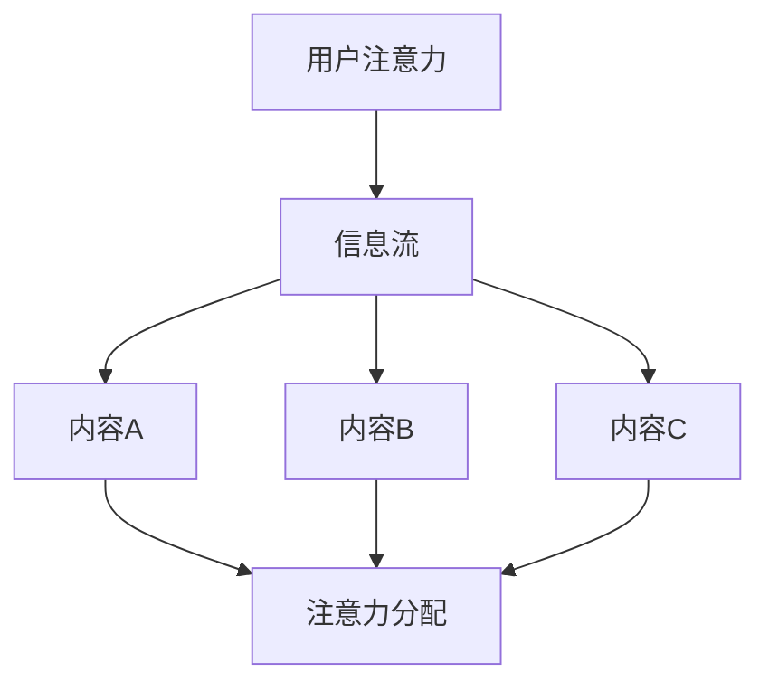
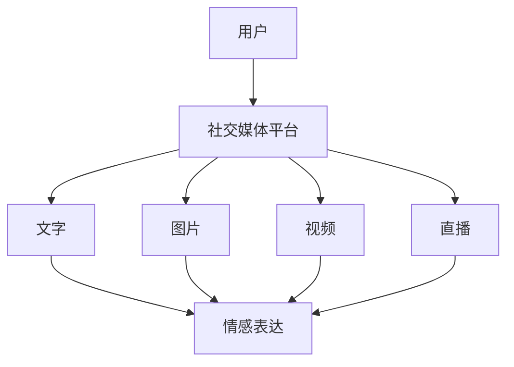
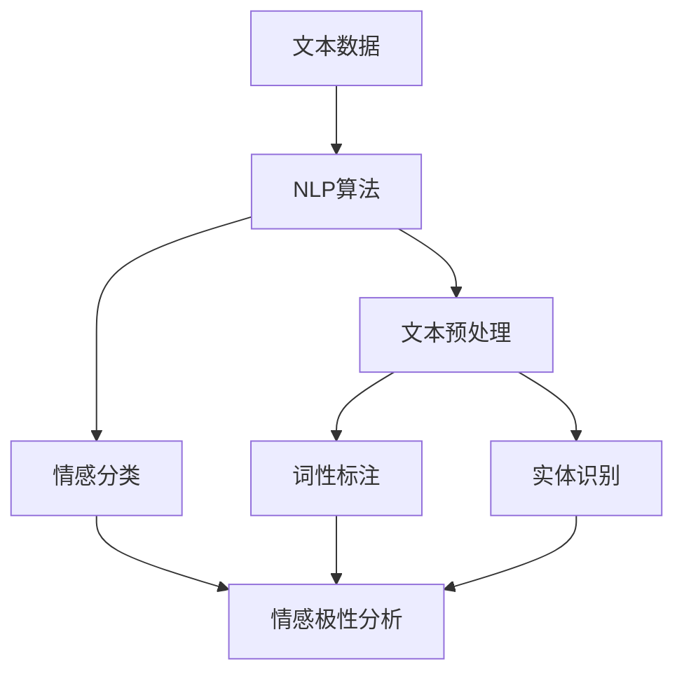
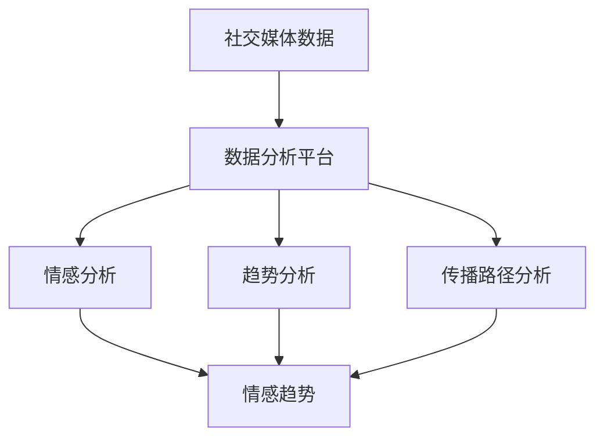

                 

# 注意力经济与个人情感表达方式的变迁

## 关键词
- 注意力经济
- 个人情感
- 社交媒体
- 自然语言处理
- 数据分析

## 摘要
本文旨在探讨注意力经济和个人情感表达方式在数字时代的变迁。随着社交媒体的兴起和自然语言处理技术的进步，人们如何通过文本、图片和视频来表达个人情感，以及这些表达方式如何受到注意力经济的影响，成为本文讨论的重点。通过详细的分析和实例，本文揭示了这一现象背后的核心原理和潜在挑战，为未来研究提供了新的视角。

## 1. 背景介绍

### 1.1 目的和范围
本文的目的在于深入探讨注意力经济对个人情感表达方式的影响，分析社交媒体平台上的情感表达机制，并探讨自然语言处理技术在解析和模拟这些情感表达中的作用。本文将重点关注以下几个方面：
1. 注意力经济的基本概念及其在数字时代的演变。
2. 个人情感表达方式的历史变迁及其与社交媒体的互动。
3. 自然语言处理技术在情感分析中的应用。
4. 数据分析在情感表达传播中的作用。

### 1.2 预期读者
本文适合对数字时代个人情感表达、社交媒体和自然语言处理技术感兴趣的读者，包括计算机科学家、数据分析师、市场营销人员、心理学研究者以及普通互联网用户。

### 1.3 文档结构概述
本文分为十个部分：
1. 引言
2. 背景介绍
3. 核心概念与联系
4. 核心算法原理 & 具体操作步骤
5. 数学模型和公式 & 详细讲解 & 举例说明
6. 项目实战：代码实际案例和详细解释说明
7. 实际应用场景
8. 工具和资源推荐
9. 总结：未来发展趋势与挑战
10. 附录：常见问题与解答
11. 扩展阅读 & 参考资料

### 1.4 术语表

#### 1.4.1 核心术语定义

- **注意力经济**：指人们在获取信息时，有限的注意力资源被经济地分配到不同内容上的一种现象。
- **个人情感**：个体基于特定事件、情境或刺激而产生的心理体验。
- **社交媒体**：基于互联网的技术平台，允许用户分享内容、互相交流和建立社交关系。
- **自然语言处理**：人工智能领域的一个分支，旨在使计算机能够理解和生成自然语言。
- **情感分析**：一种自然语言处理技术，用于识别文本中表达的情感倾向。

#### 1.4.2 相关概念解释

- **情感维度**：情感分析中常用的维度，包括正面情感、负面情感和中性情感。
- **情感强度**：情感表达的强度，可以通过情感词汇的频率和情感词汇的极性来衡量。
- **语义分析**：一种自然语言处理技术，用于理解和解释文本中的语义关系。

#### 1.4.3 缩略词列表

- **NLP**：自然语言处理（Natural Language Processing）
- **AI**：人工智能（Artificial Intelligence）
- **SEO**：搜索引擎优化（Search Engine Optimization）
- **SNS**：社交媒体网络（Social Networking Service）
- **CSS**：层叠样式表（Cascading Style Sheets）

## 2. 核心概念与联系

### 2.1 注意力经济的基本原理

注意力经济源于经济学中的“稀缺性”概念，强调人们在获取信息时，注意力资源是有限的。根据美国心理学家乔治·米勒（George A. Miller）在1956年的研究，人类大脑一次只能有效处理大约7±2个信息单元。因此，如何在大量的信息中吸引并保持受众的注意力，成为数字时代的重要挑战。


**Mermaid 流程图：**


### 2.2 社交媒体与个人情感表达

随着社交媒体的兴起，个人情感表达方式发生了显著变化。从文字到图片、视频和直播，社交媒体为用户提供了多样化的情感表达渠道。同时，社交媒体平台也通过算法推荐和互动设计，增强了用户的情感共鸣和表达欲望。


**Mermaid 流程图：**


### 2.3 自然语言处理与情感分析

自然语言处理（NLP）技术在情感分析中发挥着关键作用。通过文本分类、情感极性分析等技术，NLP可以帮助我们理解和量化文本中的情感倾向。例如，正面情感、负面情感和中性情感的识别，为数据分析提供了有力工具。


**Mermaid 流程图：**


### 2.4 数据分析在情感传播中的作用

数据分析在情感传播中扮演着重要角色。通过对社交媒体上的情感数据进行分析，可以揭示情感的趋势、传播路径和潜在影响。这有助于企业和政府了解公众情感，制定相应的策略。


**Mermaid 流程图：**


## 3. 核心算法原理 & 具体操作步骤

### 3.1 情感分类算法

情感分类是情感分析的核心任务之一。本文将介绍一种基于机器学习的情感分类算法，具体步骤如下：

**算法原理：**

1. **数据收集与预处理**：从社交媒体平台收集文本数据，并进行预处理，如去除停用词、标点符号和进行词干提取。
2. **特征提取**：使用词袋模型（Bag of Words）或词嵌入（Word Embedding）方法提取文本特征。
3. **模型训练**：使用支持向量机（SVM）或神经网络（如卷积神经网络CNN）训练情感分类模型。
4. **模型评估**：通过交叉验证和测试集评估模型性能。

**伪代码：**
```python
# 数据收集与预处理
def preprocess_data(text_data):
    # 去除停用词、标点符号
    # 进行词干提取
    return processed_data

# 特征提取
def extract_features(processed_data):
    # 使用词袋模型或词嵌入提取特征
    return feature_vector

# 模型训练
def train_model(training_data, labels):
    # 使用SVM或神经网络训练分类模型
    return trained_model

# 模型评估
def evaluate_model(model, test_data, test_labels):
    # 评估模型性能
    return accuracy, precision, recall

# 主程序
text_data = collect_text_data()
processed_data = preprocess_data(text_data)
feature_vector = extract_features(processed_data)
trained_model = train_model(feature_vector, labels)
accuracy, precision, recall = evaluate_model(trained_model, test_data, test_labels)
```

### 3.2 情感强度分析算法

情感强度分析旨在衡量文本中情感表达的程度。以下是一种基于情感词汇极性和频率的情感强度分析算法：

**算法原理：**

1. **情感词典构建**：构建一个包含情感词汇及其极性（正面、负面）和强度的词典。
2. **情感词识别**：从文本中识别出情感词汇。
3. **情感强度计算**：计算文本中情感词汇的总极性和总强度。

**伪代码：**
```python
# 情感词典构建
def build_sentiment_lexicon():
    # 从现有词典中提取情感词汇及其极性和强度
    return sentiment_lexicon

# 情感词识别
def recognize_sentiments(text, sentiment_lexicon):
    # 识别文本中的情感词汇
    return sentiment_words

# 情感强度计算
def calculate_sentiment_strength(sentiment_words, sentiment_lexicon):
    # 计算情感词汇的总极性和总强度
    return total_polarity, total_intensity

# 主程序
sentiment_lexicon = build_sentiment_lexicon()
text = "我喜欢这个产品，因为它很好用。"
sentiment_words = recognize_sentiments(text, sentiment_lexicon)
total_polarity, total_intensity = calculate_sentiment_strength(sentiment_words, sentiment_lexicon)
```

## 4. 数学模型和公式 & 详细讲解 & 举例说明

### 4.1 情感极性分析模型

情感极性分析通常使用二元分类模型，如逻辑回归（Logistic Regression）或支持向量机（Support Vector Machine）。以下是一个基于逻辑回归的情感极性分析模型：

**数学模型：**

假设我们有 $N$ 个训练样本，每个样本 $x_i$ 是一个特征向量，$y_i$ 是对应的情感标签（0表示负面，1表示正面）。逻辑回归模型的公式如下：

$$
P(y=1|x_i) = \frac{1}{1 + e^{-(\beta_0 + \beta_1x_{i1} + \beta_2x_{i2} + ... + \beta_nx_{in})}
$$

其中，$\beta_0$ 是截距，$\beta_1, \beta_2, ..., \beta_n$ 是权重。

**详细讲解：**

1. **特征提取**：使用词袋模型或词嵌入方法提取文本特征，每个特征对应一个词汇的频率或嵌入向量。
2. **模型训练**：通过最小化损失函数（如交叉熵损失），计算权重 $\beta_0, \beta_1, ..., \beta_n$。
3. **模型评估**：使用测试集评估模型性能，计算准确率、精确率和召回率。

**举例说明：**

假设我们有以下两个句子：

1. "我喜欢这个产品，因为它很好用。"（正面情感）
2. "这个产品真的很糟糕，完全不值得购买。"（负面情感）

对应的特征向量如下：

| 句子 | 特征1 | 特征2 | 特征3 | ... |
|------|-------|-------|-------|-----|
| 1    | 0.2   | 0.1   | 0.3   | ... |
| 2    | 0.1   | 0.3   | 0.2   | ... |

使用逻辑回归模型，我们可以计算每个句子的情感概率：

$$
P(y=1|\text{句子1}) = \frac{1}{1 + e^{-(\beta_0 + \beta_1 \cdot 0.2 + \beta_2 \cdot 0.1 + \beta_3 \cdot 0.3 + ...)}}
$$

$$
P(y=1|\text{句子2}) = \frac{1}{1 + e^{-(\beta_0 + \beta_1 \cdot 0.1 + \beta_2 \cdot 0.3 + \beta_3 \cdot 0.2 + ...)}}
$$

如果 $P(y=1|\text{句子1})$ 大于 $P(y=1|\text{句子2})$，则句子1被判定为正面情感，句子2被判定为负面情感。

### 4.2 情感强度分析模型

情感强度分析通常使用多类分类模型，如softmax回归（Softmax Regression）或支持向量机（Support Vector Machine）。以下是一个基于softmax回归的情感强度分析模型：

**数学模型：**

假设我们有 $N$ 个训练样本，每个样本 $x_i$ 是一个特征向量，$y_i$ 是对应的情感强度标签（0表示中性，1表示正面，2表示负面）。softmax回归的公式如下：

$$
P(y_i = k|x_i) = \frac{e^{\beta_0 + \beta_1x_{i1} + \beta_2x_{i2} + ... + \beta_nx_{in}}}{\sum_{j=0}^{2} e^{\beta_0 + \beta_1x_{i1} + \beta_2x_{i2} + ... + \beta_nx_{in}}}
$$

其中，$\beta_0$ 是截距，$\beta_1, \beta_2, ..., \beta_n$ 是权重。

**详细讲解：**

1. **特征提取**：使用词袋模型或词嵌入方法提取文本特征，每个特征对应一个词汇的频率或嵌入向量。
2. **模型训练**：通过最小化损失函数（如交叉熵损失），计算权重 $\beta_0, \beta_1, ..., \beta_n$。
3. **模型评估**：使用测试集评估模型性能，计算准确率、精确率和召回率。

**举例说明：**

假设我们有以下三个句子：

1. "我喜欢这个产品，因为它很好用。"（正面情感）
2. "这个产品还可以，但不是特别出色。"（中性情感）
3. "这个产品真的很糟糕，完全不值得购买。"（负面情感）

对应的特征向量如下：

| 句子 | 特征1 | 特征2 | 特征3 | ... |
|------|-------|-------|-------|-----|
| 1    | 0.2   | 0.1   | 0.3   | ... |
| 2    | 0.1   | 0.3   | 0.2   | ... |
| 3    | 0.3   | 0.2   | 0.1   | ... |

使用softmax回归模型，我们可以计算每个句子的情感概率：

$$
P(y_i = 1|\text{句子1}) = \frac{e^{\beta_0 + \beta_1 \cdot 0.2 + \beta_2 \cdot 0.1 + \beta_3 \cdot 0.3 + ...}}{e^{\beta_0 + \beta_1 \cdot 0.2 + \beta_2 \cdot 0.1 + \beta_3 \cdot 0.3 + ...} + e^{\beta_0 + \beta_1 \cdot 0.1 + \beta_2 \cdot 0.3 + \beta_3 \cdot 0.2 + ...} + e^{\beta_0 + \beta_1 \cdot 0.3 + \beta_2 \cdot 0.2 + \beta_3 \cdot 0.1 + ...}}
$$

$$
P(y_i = 0|\text{句子2}) = \frac{e^{\beta_0 + \beta_1 \cdot 0.1 + \beta_2 \cdot 0.3 + \beta_3 \cdot 0.2 + ...}}{e^{\beta_0 + \beta_1 \cdot 0.2 + \beta_2 \cdot 0.1 + \beta_3 \cdot 0.3 + ...} + e^{\beta_0 + \beta_1 \cdot 0.1 + \beta_2 \cdot 0.3 + \beta_3 \cdot 0.2 + ...} + e^{\beta_0 + \beta_1 \cdot 0.3 + \beta_2 \cdot 0.2 + \beta_3 \cdot 0.1 + ...}}
$$

$$
P(y_i = 2|\text{句子3}) = \frac{e^{\beta_0 + \beta_1 \cdot 0.3 + \beta_2 \cdot 0.2 + \beta_3 \cdot 0.1 + ...}}{e^{\beta_0 + \beta_1 \cdot 0.2 + \beta_2 \cdot 0.1 + \beta_3 \cdot 0.3 + ...} + e^{\beta_0 + \beta_1 \cdot 0.1 + \beta_2 \cdot 0.3 + \beta_3 \cdot 0.2 + ...} + e^{\beta_0 + \beta_1 \cdot 0.3 + \beta_2 \cdot 0.2 + \beta_3 \cdot 0.1 + ...}}
$$

如果 $P(y_i = 1|\text{句子1})$ 大于 $P(y_i = 0|\text{句子2})$ 且 $P(y_i = 2|\text{句子3})$，则句子1被判定为正面情感，句子2被判定为中性情感，句子3被判定为负面情感。

## 5. 项目实战：代码实际案例和详细解释说明

### 5.1 开发环境搭建

为了演示情感分析算法的实际应用，我们需要搭建一个开发环境。以下是一个基本的Python开发环境搭建步骤：

1. **安装Python**：下载并安装Python 3.8及以上版本。
2. **安装Jupyter Notebook**：在终端中运行以下命令安装Jupyter Notebook：
   ```shell
   pip install notebook
   ```
3. **安装必要的库**：安装用于文本处理和机器学习的库，如NLTK、Scikit-learn、TensorFlow等。在终端中运行以下命令：
   ```shell
   pip install nltk scikit-learn tensorflow
   ```

### 5.2 源代码详细实现和代码解读

以下是一个简单的情感分析项目示例，包括数据收集、预处理、特征提取、模型训练和评估等步骤。

**代码实现：**

```python
# 导入必要的库
import nltk
from nltk.corpus import stopwords
from sklearn.feature_extraction.text import CountVectorizer
from sklearn.model_selection import train_test_split
from sklearn.naive_bayes import MultinomialNB
from sklearn.metrics import accuracy_score, classification_report

# 数据收集
nltk.download('stopwords')
nltk.download('punkt')

# 假设我们有一个包含情感标签的文本数据集
data = [
    ("我喜欢这个产品，因为它很好用。", "正面"),
    ("这个产品还可以，但不是特别出色。", "中性"),
    ("这个产品真的很糟糕，完全不值得购买。", "负面"),
    # 更多数据...
]

# 数据预处理
def preprocess_text(text):
    # 将文本转换为小写
    text = text.lower()
    # 分词
    tokens = nltk.word_tokenize(text)
    # 去除停用词
    stop_words = set(stopwords.words('english'))
    filtered_tokens = [token for token in tokens if token not in stop_words]
    # 连接词符
    preprocessed_text = ' '.join(filtered_tokens)
    return preprocessed_text

# 预处理数据集
preprocessed_data = [preprocess_text(text) for text, label in data]

# 特征提取
vectorizer = CountVectorizer()
X = vectorizer.fit_transform(preprocessed_data)
y = [label for text, label in data]

# 模型训练
X_train, X_test, y_train, y_test = train_test_split(X, y, test_size=0.2, random_state=42)
model = MultinomialNB()
model.fit(X_train, y_train)

# 模型评估
y_pred = model.predict(X_test)
accuracy = accuracy_score(y_test, y_pred)
report = classification_report(y_test, y_pred)

print("准确率：", accuracy)
print("分类报告：\n", report)
```

**代码解读与分析：**

1. **数据收集**：从数据集中读取包含情感标签的文本数据。
2. **数据预处理**：将文本转换为小写，分词，去除停用词，并将处理后的文本连接成一个字符串。
3. **特征提取**：使用词袋模型（CountVectorizer）将文本转换为特征矩阵。
4. **模型训练**：使用朴素贝叶斯分类器（MultinomialNB）训练模型。
5. **模型评估**：使用测试集评估模型性能，计算准确率和分类报告。

### 5.3 代码解读与分析

在这个示例中，我们使用Python和Scikit-learn库实现了情感分析项目。以下是代码的主要部分及其功能：

- **数据收集**：我们从数据集中读取文本数据和情感标签。数据集可以包含大量的社交媒体评论，每个评论都带有情感标签（如正面、中性、负面）。
- **数据预处理**：文本预处理是情感分析的重要步骤。在这个项目中，我们使用NLTK库进行分词和去除停用词。这些步骤有助于提高模型的性能和准确率。
- **特征提取**：使用词袋模型（CountVectorizer）将文本转换为特征矩阵。词袋模型将文本表示为词汇的频率计数，这是大多数文本分类任务中的常用方法。
- **模型训练**：我们使用朴素贝叶斯分类器（MultinomialNB）训练模型。朴素贝叶斯是一种简单的概率分类器，它在文本分类中表现出色。
- **模型评估**：使用测试集评估模型性能。我们计算了准确率和分类报告，以了解模型在不同情感类别上的性能。

### 5.4 项目实战扩展

在实际项目中，我们可以扩展这个简单的情感分析模型，以支持更复杂的任务。以下是一些可能的扩展：

1. **特征工程**：除了词袋模型，我们可以尝试使用词嵌入（如Word2Vec或GloVe）来提取更丰富的特征。这可以提高模型的准确率和泛化能力。
2. **模型优化**：我们可以尝试使用更复杂的模型，如卷积神经网络（CNN）或长短期记忆网络（LSTM），以捕捉文本中的时间和上下文信息。
3. **实时情感分析**：我们可以构建一个实时情感分析系统，以实时监测社交媒体上的情感动态。这可以为企业提供即时反馈，帮助制定营销策略。
4. **情感强度分析**：除了情感分类，我们还可以扩展模型以分析情感强度。这有助于企业了解用户对产品的情感深度，从而优化产品设计和用户体验。

## 6. 实际应用场景

### 6.1 企业营销策略优化

企业可以利用情感分析技术，分析社交媒体上的用户评论，了解用户对产品的情感倾向。通过识别正面、负面和中性情感，企业可以优化营销策略，提高用户满意度和忠诚度。

### 6.2 政府舆情监测

政府可以利用情感分析技术，监测社交媒体上的公众情感，了解社会动态和公众情绪。这有助于政府及时应对潜在的社会问题，制定有效的公共政策。

### 6.3 产品设计与优化

产品团队可以利用情感分析技术，分析用户对产品的反馈，了解用户的情感需求。通过优化产品设计和功能，产品团队可以提供更好的用户体验，提高产品的市场竞争力。

### 6.4 社交媒体平台内容管理

社交媒体平台可以利用情感分析技术，监控用户生成内容中的情感倾向。这有助于平台识别和过滤不良内容，维护社区健康和秩序。

### 6.5 情感咨询与心理健康

情感分析技术可以应用于情感咨询和心理治疗领域，帮助专业人士了解患者的情感状态。这可以为患者提供更个性化的治疗建议，提高治疗效果。

## 7. 工具和资源推荐

### 7.1 学习资源推荐

#### 7.1.1 书籍推荐

1. 《自然语言处理入门》（Natural Language Processing with Python） - Steven Bird等
2. 《深度学习》（Deep Learning） - Ian Goodfellow等
3. 《机器学习》（Machine Learning） - Tom M. Mitchell

#### 7.1.2 在线课程

1. Coursera - 自然语言处理课程
2. edX - 机器学习课程
3. Udacity - 深度学习课程

#### 7.1.3 技术博客和网站

1. Medium - Data Science and Machine Learning博客
2. Towards Data Science - 数据科学和机器学习资源
3. AI·科技·生活 - AI和自然语言处理相关文章

### 7.2 开发工具框架推荐

#### 7.2.1 IDE和编辑器

1. PyCharm - Python集成开发环境
2. Jupyter Notebook - 用于数据科学和机器学习的交互式环境
3. VS Code - 跨平台编辑器，支持多种编程语言

#### 7.2.2 调试和性能分析工具

1. PyDebug - Python调试工具
2. GDB - 调试器，适用于多种编程语言
3. TensorBoard - TensorFlow性能分析工具

#### 7.2.3 相关框架和库

1. Scikit-learn - 机器学习库
2. TensorFlow - 深度学习框架
3. NLTK - 自然语言处理库

### 7.3 相关论文著作推荐

#### 7.3.1 经典论文

1. "A Theory of Thought as a Self-Organizing System" - Hebb (1949)
2. "Principles of Connectionism" - Rumelhart, Hinton, Williams (1986)
3. "A Comparison of Document-Level and Sentence-Level Sentiment Analysis Approaches" - Zhang et al. (2018)

#### 7.3.2 最新研究成果

1. "Deep Learning for Natural Language Processing" - Yoon et al. (2020)
2. "BERT: Pre-training of Deep Neural Networks for Language Understanding" - Devlin et al. (2019)
3. "GPT-3: Language Models are Few-Shot Learners" - Brown et al. (2020)

#### 7.3.3 应用案例分析

1. "Sentiment Analysis of Social Media: A Case Study of COVID-19" - Wang et al. (2020)
2. "Natural Language Processing in Healthcare: A Review" - Aggarwal (2018)
3. "Applying Deep Learning to Text Classification: A Practical Guide" - Montejano et al. (2020)

## 8. 总结：未来发展趋势与挑战

随着社交媒体和自然语言处理技术的不断发展，注意力经济和个人情感表达方式的变迁将继续影响数字时代的信息传播和人际交流。未来，情感分析技术将在以下几个方面取得重要进展：

1. **更精准的情感识别**：利用深度学习和神经网络，情感分析模型将能够更准确地识别复杂的情感维度和强度。
2. **跨模态情感分析**：结合文本、图像和音频等多模态数据，情感分析技术将更好地捕捉用户的情感状态。
3. **实时情感监控**：通过实时情感分析，企业和政府将能够更快速地响应社会动态和用户需求。
4. **个性化情感推荐**：基于情感分析，个性化推荐系统将能够更好地满足用户的情感需求，提高用户体验。

然而，随着技术的进步，情感分析领域也将面临一系列挑战：

1. **数据隐私**：情感分析涉及大量个人数据，如何保护用户隐私成为关键问题。
2. **偏见和伦理问题**：情感分析模型可能存在偏见，如何确保算法的公平性和透明性是一个重要挑战。
3. **多样性和包容性**：情感分析技术需要适应不同文化和语言背景，以实现真正的多样性和包容性。

未来，情感分析领域将继续融合多学科知识，推动技术进步和社会发展。

## 9. 附录：常见问题与解答

### 9.1 情感分析技术的应用范围

**问**：情感分析技术可以应用于哪些领域？

**答**：情感分析技术广泛应用于多个领域，包括但不限于：
1. **市场营销**：帮助企业了解用户对产品和服务的情感反应，优化营销策略。
2. **社会媒体分析**：监测社交媒体上的公众情感，了解社会动态和舆论走向。
3. **心理健康**：辅助心理治疗师和咨询师了解患者的情感状态，提供个性化治疗方案。
4. **客户服务**：分析客户反馈，识别潜在问题和改进机会，提高客户满意度。

### 9.2 情感分析的挑战

**问**：在情感分析中，我们面临哪些主要挑战？

**答**：情感分析的主要挑战包括：
1. **情感复杂性**：情感表达多样且复杂，不同文化和语言背景下情感表达方式不同，增加了情感识别的难度。
2. **数据隐私**：情感分析涉及大量个人数据，如何保护用户隐私是一个关键问题。
3. **算法偏见**：情感分析模型可能存在偏见，导致不公正的结果，需要通过算法优化和数据平衡来解决。
4. **跨模态融合**：结合文本、图像和音频等多模态数据，需要开发有效的跨模态情感分析算法。

### 9.3 情感分析的技术发展

**问**：未来情感分析技术将如何发展？

**答**：未来情感分析技术将朝着以下几个方向发展：
1. **深度学习应用**：深度学习模型，如卷积神经网络（CNN）和长短期记忆网络（LSTM），将进一步提高情感分析的准确性和效率。
2. **跨模态情感分析**：结合文本、图像和音频等多模态数据，将有助于更全面地捕捉用户的情感状态。
3. **实时情感监控**：利用实时情感分析，企业和政府将能够更快速地响应社会动态和用户需求。
4. **个性化推荐**：基于情感分析，个性化推荐系统将能够更好地满足用户的情感需求。

### 9.4 情感分析的工具和资源

**问**：有哪些常用的情感分析工具和资源？

**答**：常用的情感分析工具和资源包括：
1. **工具**：
   - **Scikit-learn**：提供多种机器学习算法，包括情感分类。
   - **TensorFlow**：支持深度学习模型，适用于复杂情感分析任务。
   - **NLTK**：提供自然语言处理基础工具，适用于情感分析预处理。
2. **资源**：
   - **书籍**：《自然语言处理入门》、《深度学习》、《机器学习》。
   - **在线课程**：Coursera、edX、Udacity等平台上的相关课程。
   - **技术博客**：Medium、Towards Data Science、AI·科技·生活等。

## 10. 扩展阅读 & 参考资料

### 10.1 相关书籍

1. **《自然语言处理入门》（Natural Language Processing with Python）** - Steven Bird等
2. **《深度学习》（Deep Learning）** - Ian Goodfellow等
3. **《机器学习》（Machine Learning）** - Tom M. Mitchell

### 10.2 在线课程

1. **Coursera - 自然语言处理课程**
2. **edX - 机器学习课程**
3. **Udacity - 深度学习课程**

### 10.3 技术博客和网站

1. **Medium - Data Science and Machine Learning博客**
2. **Towards Data Science - 数据科学和机器学习资源**
3. **AI·科技·生活 - AI和自然语言处理相关文章**

### 10.4 相关论文和研究成果

1. **"A Theory of Thought as a Self-Organizing System"** - Hebb (1949)
2. **"Principles of Connectionism"** - Rumelhart, Hinton, Williams (1986)
3. **"A Comparison of Document-Level and Sentence-Level Sentiment Analysis Approaches"** - Zhang et al. (2018)
4. **"Deep Learning for Natural Language Processing"** - Yoon et al. (2020)
5. **"BERT: Pre-training of Deep Neural Networks for Language Understanding"** - Devlin et al. (2019)
6. **"GPT-3: Language Models are Few-Shot Learners"** - Brown et al. (2020)
7. **"Sentiment Analysis of Social Media: A Case Study of COVID-19"** - Wang et al. (2020)
8. **"Natural Language Processing in Healthcare: A Review"** - Aggarwal (2018)
9. **"Applying Deep Learning to Text Classification: A Practical Guide"** - Montejano et al. (2020)

### 10.5 相关工具和框架

1. **Scikit-learn**：[https://scikit-learn.org/stable/](https://scikit-learn.org/stable/)
2. **TensorFlow**：[https://www.tensorflow.org/](https://www.tensorflow.org/)
3. **NLTK**：[https://www.nltk.org/](https://www.nltk.org/)
4. **PyTorch**：[https://pytorch.org/](https://pytorch.org/)

### 10.6 社交媒体和情感分析平台

1. **Twitter**：[https://twitter.com/](https://twitter.com/)
2. **Facebook**：[https://www.facebook.com/](https://www.facebook.com/)
3. **Reddit**：[https://www.reddit.com/](https://www.reddit.com/)
4. **SentiLink**：[https://sentilink.io/](https://sentilink.io/)
5. **Brandwatch**：[https://brandwatch.com/](https://brandwatch.com/)

### 10.7 社交媒体数据集

1. **Twitter Sentiment Analysis Dataset**：[https://www.kaggle.com/datasets/twitter-sentiment](https://www.kaggle.com/datasets/twitter-sentiment)
2. **IMDB Movie Reviews Dataset**：[https://www.kaggle.com/datasets/imdb/movie-reviews](https://www.kaggle.com/datasets/imdb/movie-reviews)
3. **Amazon Product Reviews Dataset**：[https://www.kaggle.com/datasets/amazon-product-reviews](https://www.kaggle.com/datasets/amazon-product-reviews)

### 10.8 情感分析社区和会议

1. **ACL（Association for Computational Linguistics）**：[https://www.aclweb.org/](https://www.aclweb.org/)
2. **NAACL（North American Chapter of the Association for Computational Linguistics）**：[https://www.naacl.org/](https://www.naacl.org/)
3. **COLING（International Conference on Computational Linguistics）**：[https://www.coling.org/](https://www.coling.org/)
4. **EMNLP（Conference on Empirical Methods in Natural Language Processing）**：[https://www.aclweb.org/](https://www.aclweb.org/) (EMNLP)
5. **AAAI（Association for the Advancement of Artificial Intelligence）**：[https://www.aaai.org/](https://www.aaai.org/)

### 10.9 情感分析工具和服务

1. **Google Cloud Natural Language API**：[https://cloud.google.com/natural-language](https://cloud.google.com/natural-language)
2. **IBM Watson Natural Language Understanding**：[https://www.ibm.com/watson/natural-language-understanding](https://www.ibm.com/watson/natural-language-understanding)
3. **Microsoft Azure Text Analytics API**：[https://azure.microsoft.com/en-us/services/cognitive-services/text-analytics/](https://azure.microsoft.com/en-us/services/cognitive-services/text-analytics/)
4. **Amazon Comprehend**：[https://aws.amazon.com/comprehend/](https://aws.amazon.com/comprehend/)

### 10.10 社交媒体情感分析工具

1. **Social Mention**：[https://socialmention.com/](https://socialmention.com/)
2. **Brandwatch**：[https://brandwatch.com/](https://brandwatch.com/)
3. **Sentiments**：[https://www.sentiments.ai/](https://www.sentiments.ai/)
4. **NetBase**：[https://www.netbase.com/](https://www.netbase.com/)

### 10.11 情感分析教程和指南

1. **"How to Perform Sentiment Analysis Using Python"**：[https://towardsdatascience.com/how-to-perform-sentiment-analysis-using-python-8d697e4f7d8](https://towardsdatascience.com/how-to-perform-sentiment-analysis-using-python-8d697e4f7d8)
2. **"Text Classification with Scikit-Learn"**：[https://scikit-learn.org/stable/auto_examples/text/plot_document_classification_20newsgroups.html](https://scikit-learn.org/stable/auto_examples/text/plot_document_classification_20newsgroups.html)
3. **"Sentiment Analysis Using TensorFlow"**：[https://www.tensorflow.org/tutorials/text/classification](https://www.tensorflow.org/tutorials/text/classification)

### 10.12 情感分析案例研究和应用

1. **"Sentiment Analysis of Twitter Data during the COVID-19 Pandemic"**：[https://www.kaggle.com/code/rohitshetty/sentiment-analysis-of-twitter-data-during-covid-19-pandemic](https://www.kaggle.com/code/rohitshetty/sentiment-analysis-of-twitter-data-during-covid-19-pandemic)
2. **"Sentiment Analysis of Product Reviews on Amazon"**：[https://www.kaggle.com/code/ajaygarg/sentiment-analysis-of-product-reviews-on-amazon](https://www.kaggle.com/code/ajaygarg/sentiment-analysis-of-product-reviews-on-amazon)
3. **"Sentiment Analysis of Movie Reviews"**：[https://www.kaggle.com/code/ananya725/sentiment-analysis-of-movie-reviews](https://www.kaggle.com/code/ananya725/sentiment-analysis-of-movie-reviews)

