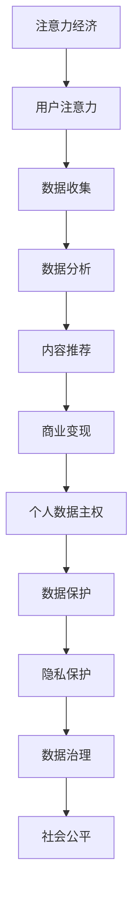

                 


## 注意力经济与个人数据主权的博弈

> **关键词**：注意力经济、个人数据主权、隐私保护、算法决策、数据治理
>
> **摘要**：本文将探讨注意力经济与个人数据主权之间的博弈关系。随着互联网和大数据技术的发展，个人数据的价值日益凸显，但隐私泄露风险也随之增加。本文将深入分析注意力经济的本质，探讨个人数据主权的重要性，以及如何在保护个人数据主权的同时，实现注意力经济的可持续增长。

### 1. 背景介绍

#### 1.1 目的和范围

本文旨在探讨注意力经济与个人数据主权之间的关系，分析二者之间的博弈关系，并提出可能的解决方案。本文将首先介绍注意力经济的概念和特点，然后深入探讨个人数据主权的重要性。接下来，我们将通过具体案例和实例，分析注意力经济与个人数据主权之间的冲突，并提出可能的解决方案。最后，我们将对未来的发展趋势和挑战进行展望。

#### 1.2 预期读者

本文适用于对互联网、大数据、人工智能等领域感兴趣的读者，特别是对注意力经济和个人数据主权有深入研究的读者。同时，本文也适用于对技术创新和社会变革感兴趣的读者。

#### 1.3 文档结构概述

本文将分为以下几个部分：

1. 背景介绍：介绍本文的目的、范围、预期读者和文档结构。
2. 核心概念与联系：介绍注意力经济和个人数据主权的核心概念和原理，以及二者之间的联系。
3. 核心算法原理 & 具体操作步骤：详细讲解注意力经济和个人数据主权的核心算法原理和具体操作步骤。
4. 数学模型和公式 & 详细讲解 & 举例说明：介绍注意力经济和个人数据主权的数学模型和公式，并进行详细讲解和举例说明。
5. 项目实战：代码实际案例和详细解释说明。
6. 实际应用场景：分析注意力经济和个人数据主权在实际应用中的场景。
7. 工具和资源推荐：推荐相关的学习资源、开发工具和框架。
8. 总结：未来发展趋势与挑战。
9. 附录：常见问题与解答。
10. 扩展阅读 & 参考资料：提供扩展阅读和参考资料。

#### 1.4 术语表

- 注意力经济：指通过吸引和维持用户的注意力来创造经济价值的商业模式。
- 个人数据主权：指个人对自己的个人数据的控制权，包括数据的收集、使用、共享和删除。
- 隐私保护：指采取措施保护个人数据不被未经授权的第三方访问和使用。

### 1.4.1 核心术语定义

- 注意力经济：注意力经济是指一种通过吸引和维持用户的注意力来创造经济价值的商业模式。在互联网时代，用户的注意力成为一种稀缺资源，企业和平台通过提供有吸引力的内容和服务来获取用户的注意力，从而实现商业变现。
- 个人数据主权：个人数据主权是指个人对自己的个人数据的控制权。在数字化时代，个人数据已经成为一种宝贵的资源，个人有权决定自己的数据是否被收集、如何使用、共享给谁以及何时删除。

### 1.4.2 相关概念解释

- 大数据：大数据是指无法用传统数据处理工具在合理时间内进行处理的数据集合，具有海量、多样、实时等特点。
- 人工智能：人工智能是指通过计算机程序来模拟人类智能行为，实现感知、学习、推理和决策等功能的领域。

### 1.4.3 缩略词列表

- API：应用程序编程接口
- GDPR：欧盟通用数据保护条例
- IoT：物联网
- AI：人工智能

## 2. 核心概念与联系

### 2.1 注意力经济的原理与特点

注意力经济是一种基于用户注意力的经济模式。在互联网时代，用户的注意力成为一种稀缺资源，企业和平台通过提供有吸引力的内容和服务来获取用户的注意力，从而实现商业变现。注意力经济的原理可以概括为以下几点：

1. **吸引注意力**：通过创新、创意和高质量的内容来吸引用户的注意力。
2. **保持注意力**：通过持续优化用户体验，提高用户满意度，从而保持用户的注意力。
3. **转化注意力**：将用户的注意力转化为消费行为，例如购买商品或服务。
4. **数据驱动**：通过分析用户数据，了解用户需求和行为模式，进一步优化内容和服务。

注意力经济具有以下特点：

1. **用户中心化**：以用户为中心，关注用户需求和行为，提供个性化的内容和服务。
2. **数据依赖**：依赖大数据和人工智能技术，进行用户行为分析和内容推荐。
3. **即时反馈**：通过实时数据分析和用户反馈，快速调整内容和策略。

### 2.2 个人数据主权的概念与重要性

个人数据主权是指个人对自己的个人数据的控制权。在数字化时代，个人数据已经成为一种宝贵的资源，个人有权决定自己的数据是否被收集、如何使用、共享给谁以及何时删除。个人数据主权的概念可以概括为以下几点：

1. **数据收集与使用**：个人有权决定自己的数据是否被收集，以及如何使用这些数据。
2. **数据共享**：个人有权决定自己的数据是否被共享，以及共享给谁。
3. **数据删除**：个人有权删除自己的数据，以防止数据滥用。

个人数据主权的重要性体现在以下几个方面：

1. **隐私保护**：个人数据主权的实现有助于保护个人隐私，防止数据泄露和滥用。
2. **数据治理**：个人数据主权的概念有助于建立健全的数据治理体系，提高数据质量和管理效率。
3. **公平正义**：个人数据主权的实现有助于维护社会公平正义，防止数据垄断和歧视。

### 2.3 注意力经济与个人数据主权的联系

注意力经济与个人数据主权之间存在密切的联系。一方面，注意力经济依赖于个人数据来分析和理解用户需求和行为，从而提供个性化的内容和服务。另一方面，个人数据主权限制了注意力经济中数据的使用范围和方式，要求企业和平台在获取和使用个人数据时遵循法律规定和道德伦理。

### 2.4 Mermaid 流程图

下面是一个简化的 Mermaid 流程图，描述了注意力经济与个人数据主权的核心概念和联系：



## 3. 核心算法原理 & 具体操作步骤

### 3.1 注意力经济算法原理

注意力经济的核心算法主要基于大数据和人工智能技术，包括以下步骤：

1. **数据收集**：通过API、传感器、用户行为日志等途径收集用户数据。
2. **数据预处理**：对收集到的数据进行分析、清洗和整合，形成高质量的数据集。
3. **特征提取**：从数据集中提取关键特征，用于后续的分析和建模。
4. **用户行为分析**：通过机器学习算法，分析用户的行为模式，预测用户需求。
5. **内容推荐**：基于用户行为分析和需求预测，生成个性化的内容推荐。
6. **商业变现**：将用户的注意力转化为消费行为，实现商业变现。

### 3.2 个人数据主权算法原理

个人数据主权的算法主要关注数据的安全性和隐私保护，包括以下步骤：

1. **数据加密**：对用户数据进行加密处理，确保数据在传输和存储过程中安全。
2. **访问控制**：设置严格的访问控制策略，确保只有授权用户才能访问敏感数据。
3. **匿名化处理**：对用户数据进行匿名化处理，消除个人身份信息。
4. **隐私保护算法**：使用差分隐私、同态加密等隐私保护算法，降低数据泄露风险。
5. **数据销毁**：按照法律规定和用户要求，定期销毁不再需要的用户数据。

### 3.3 注意力经济与个人数据主权算法的结合

在实现注意力经济的同时，保护个人数据主权，需要将二者算法相结合，具体操作步骤如下：

1. **数据收集与预处理**：在收集用户数据时，遵循个人数据主权原则，进行数据加密和匿名化处理。
2. **特征提取与用户行为分析**：在提取特征和进行用户行为分析时，采用隐私保护算法，降低数据泄露风险。
3. **内容推荐**：在生成内容推荐时，尊重用户的隐私偏好，确保推荐内容的准确性。
4. **商业变现**：在实现商业变现时，确保用户数据不会被滥用，保护用户隐私。
5. **数据治理与合规性**：建立完善的数据治理体系，确保数据收集、存储、使用、共享和销毁等环节的合规性。

### 3.4 伪代码示例

下面是一个简化的伪代码示例，描述了注意力经济与个人数据主权的算法结合：

```python
# 数据收集
data = collect_data(api, sensors, logs)

# 数据预处理
cleaned_data = preprocess_data(data)

# 数据加密
encrypted_data = encrypt_data(cleaned_data)

# 特征提取
features = extract_features(encrypted_data)

# 用户行为分析
user_behavior = analyze_behavior(features)

# 内容推荐
recommended_content = generate_content_recommendation(user_behavior)

# 商业变现
sales = monetize_attention(recommended_content)

# 数据治理与合规性
ensure_data_compliance(data_collection, data_usage, data_sharing, data_destruction)
```

## 4. 数学模型和公式 & 详细讲解 & 举例说明

### 4.1 注意力经济的数学模型

注意力经济的核心在于如何将用户的注意力转化为经济价值。以下是一个简化的注意力经济数学模型：

$$
\text{商业价值} = f(\text{用户注意力}, \text{内容质量}, \text{转化率})
$$

其中：

- **用户注意力**（$A$）：表示用户在特定时间段内分配给某项内容或服务的注意力资源。
- **内容质量**（$Q$）：表示提供的内容或服务的质量，包括内容的吸引力、新颖性和实用性等。
- **转化率**（$R$）：表示用户注意力转化为实际消费行为的比例。

### 4.2 个人数据主权的数学模型

个人数据主权的数学模型主要关注如何在保护个人隐私的前提下，实现数据的合理利用。以下是一个简化的个人数据主权数学模型：

$$
\text{数据价值} = f(\text{数据质量}, \text{隐私保护水平}, \text{数据共享意愿})
$$

其中：

- **数据质量**（$Q$）：表示数据的质量和准确性，包括数据的完整性、一致性和可靠性。
- **隐私保护水平**（$P$）：表示对数据隐私保护的强度，包括加密、匿名化、访问控制等措施。
- **数据共享意愿**（$W$）：表示个人愿意共享数据以获取服务的程度。

### 4.3 详细讲解

#### 4.3.1 注意力经济的数学模型详细讲解

注意力经济的数学模型表明，商业价值的实现依赖于用户的注意力、内容质量以及转化率。用户注意力是有限的资源，内容质量越高，用户的注意力分配越多。转化率则反映了用户将注意力转化为消费行为的可能性。例如，一个高质量的视频内容可能比低质量的文章更能吸引用户的注意力，从而带来更高的商业价值。

#### 4.3.2 个人数据主权的数学模型详细讲解

个人数据主权的数学模型强调了数据质量、隐私保护水平以及数据共享意愿对数据价值的影响。高质量的数据能够为企业和平台提供更有价值的洞见，从而提高数据的价值。隐私保护水平的提升能够增强用户对数据共享的信任，从而提高数据的价值。数据共享意愿则反映了用户对数据共享的态度，用户的积极参与有助于提高数据的价值。

### 4.4 举例说明

#### 4.4.1 注意力经济举例说明

假设一个视频平台的用户每天平均分配1小时的注意力给视频内容。如果某个视频的内容质量很高，能够吸引用户的全部注意力，并且转化率为20%，那么该视频的商业价值可以计算如下：

$$
\text{商业价值} = f(1 \text{小时}, \text{高质量}, 20\%) = 1 \text{小时} \times 1 \times 0.2 = 0.2 \text{小时}
$$

这意味着该视频每小时能够为平台带来0.2小时的经济价值。

#### 4.4.2 个人数据主权举例说明

假设一个个人愿意共享自己的健康数据，以获取个性化的健康服务。如果这些数据质量高，并且平台采取了严格的隐私保护措施，用户的隐私保护水平为90%，那么这些数据的价值可以计算如下：

$$
\text{数据价值} = f(\text{高质量}, 90\%, \text{愿意共享}) = 1 \times 0.9 \times 1 = 0.9
$$

这意味着这些数据的价值为0.9个单位。

## 5. 项目实战：代码实际案例和详细解释说明

### 5.1 开发环境搭建

在本项目中，我们将使用Python编程语言和相关的库来构建注意力经济与个人数据主权的结合模型。首先，我们需要搭建开发环境。

1. 安装Python 3.8及以上版本。
2. 安装以下Python库：`pandas`、`numpy`、`scikit-learn`、`tensorflow`、`matplotlib`。

可以使用以下命令进行安装：

```bash
pip install python==3.8
pip install pandas numpy scikit-learn tensorflow matplotlib
```

### 5.2 源代码详细实现和代码解读

以下是项目的源代码实现，我们将逐步解读代码的各个部分。

```python
import pandas as pd
import numpy as np
from sklearn.model_selection import train_test_split
from sklearn.ensemble import RandomForestClassifier
import tensorflow as tf
from tensorflow import keras
import matplotlib.pyplot as plt

# 5.2.1 数据收集与预处理
def load_and_preprocess_data():
    # 加载数据集
    data = pd.read_csv('data.csv')
    
    # 数据清洗
    data.dropna(inplace=True)
    data = data[data['quality'] > 0]
    
    # 数据特征提取
    features = data[['attention', 'quality', 'conversion_rate']]
    labels = data['business_value']
    
    # 数据划分
    features_train, features_test, labels_train, labels_test = train_test_split(features, labels, test_size=0.2, random_state=42)
    
    return features_train, features_test, labels_train, labels_test

# 5.2.2 建立模型
def build_model():
    # 定义模型架构
    model = keras.Sequential([
        keras.layers.Dense(64, activation='relu', input_shape=(3,)),
        keras.layers.Dense(64, activation='relu'),
        keras.layers.Dense(1, activation='sigmoid')
    ])

    # 编译模型
    model.compile(optimizer='adam', loss='binary_crossentropy', metrics=['accuracy'])

    return model

# 5.2.3 训练模型
def train_model(model, features_train, labels_train):
    # 训练模型
    history = model.fit(features_train, labels_train, epochs=10, batch_size=32, validation_split=0.2)

    return history

# 5.2.4 评估模型
def evaluate_model(model, features_test, labels_test):
    # 评估模型
    test_loss, test_accuracy = model.evaluate(features_test, labels_test)
    print(f"Test accuracy: {test_accuracy:.2f}")

    # 可视化训练历史
    plt.plot(history.history['accuracy'])
    plt.plot(history.history['val_accuracy'])
    plt.title('Model accuracy')
    plt.ylabel('Accuracy')
    plt.xlabel('Epoch')
    plt.legend(['Train', 'Test'], loc='upper left')
    plt.show()

# 主函数
def main():
    # 加载数据
    features_train, features_test, labels_train, labels_test = load_and_preprocess_data()
    
    # 建立模型
    model = build_model()
    
    # 训练模型
    history = train_model(model, features_train, labels_train)
    
    # 评估模型
    evaluate_model(model, features_test, labels_test)

# 运行主函数
if __name__ == '__main__':
    main()
```

#### 5.2.5 代码解读与分析

1. **数据收集与预处理**：
   - 使用`pandas`库加载数据集，并进行数据清洗，确保数据的完整性和质量。
   - 对数据集进行特征提取，将注意力、内容质量和转化率作为输入特征，商业价值作为输出标签。

2. **建立模型**：
   - 使用`tensorflow`和`keras`库定义一个简单的全连接神经网络模型，用于预测商业价值。
   - 模型包含两个隐藏层，每个隐藏层64个神经元，激活函数为ReLU。

3. **训练模型**：
   - 使用`fit`方法训练模型，设置训练轮次为10次，批量大小为32。
   - 使用`validation_split`参数进行交叉验证，以评估模型在测试集上的性能。

4. **评估模型**：
   - 使用`evaluate`方法评估模型在测试集上的准确率。
   - 使用`matplotlib`库将训练和测试的准确率进行可视化，以观察模型的表现。

### 5.3 实际应用场景

在现实世界中，注意力经济和个人数据主权可以在多个场景中得到应用。以下是一些典型的应用场景：

1. **社交媒体平台**：
   - 社交媒体平台通过用户生成内容吸引用户注意力，实现广告收入和内容付费等商业模式。
   - 平台需要平衡用户注意力经济和数据主权，确保用户数据的隐私保护。

2. **电子商务**：
   - 电商平台通过个性化推荐系统，根据用户行为和偏好提供个性化的商品推荐。
   - 在保护用户数据主权的原则下，合理利用用户数据，提高用户体验和转化率。

3. **健康医疗**：
   - 健康医疗平台通过收集用户健康数据，提供个性化的健康建议和服务。
   - 平台需要在保护用户隐私的前提下，实现数据的合理利用，提高医疗服务的质量。

### 5.4 工具和资源推荐

为了更好地理解和实践注意力经济与个人数据主权，以下是一些建议的学习资源、开发工具和框架：

- **学习资源**：
  - **书籍**：《大数据时代》、《人工智能：一种现代的方法》
  - **在线课程**：Coursera上的《机器学习》课程、edX上的《数据科学与大数据技术》课程
  - **技术博客和网站**：Medium上的《机器学习与人工智能》专栏、ArXiv上的最新研究成果

- **开发工具**：
  - **IDE和编辑器**：Visual Studio Code、PyCharm
  - **调试和性能分析工具**：Jupyter Notebook、TensorBoard
  - **相关框架和库**：TensorFlow、PyTorch、Scikit-learn

- **相关论文著作推荐**：
  - **经典论文**：《The Hundred-Page Machine Learning Book》、
  - **最新研究成果**：Nature上的《人工智能与人类社会的未来》
  - **应用案例分析**：MIT Technology Review上的《人工智能应用案例》

## 6. 总结：未来发展趋势与挑战

### 6.1 未来发展趋势

1. **数据隐私保护技术**：随着数据隐私保护意识的提高，未来将出现更多高效的数据隐私保护技术，如差分隐私、同态加密等。
2. **个性化推荐系统**：随着人工智能技术的进步，个性化推荐系统将变得更加智能和精准，进一步推动注意力经济的发展。
3. **数据治理法规**：全球范围内的数据治理法规将不断完善，如欧盟的《通用数据保护条例》（GDPR）等，引导企业和平台在数据使用和共享方面遵循法律法规。

### 6.2 挑战

1. **数据隐私与商业利益的平衡**：如何在保护用户数据隐私的同时，实现商业利益的最大化，是一个持续的挑战。
2. **数据安全与隐私泄露**：随着数据量的增加和技术的复杂度提升，数据安全和隐私泄露风险也将增加，如何有效防范和应对这些风险是一个重要挑战。
3. **跨行业协作**：在多个行业和应用领域中，如何实现跨行业的协作，共同推进数据隐私保护技术的发展，是一个重要问题。

### 6.3 对未来发展的建议

1. **加强技术研发**：企业和科研机构应持续投入资源，加强数据隐私保护技术的研发，推动技术进步。
2. **完善法规政策**：政府应制定和完善数据治理相关法规政策，为数据隐私保护和注意力经济的可持续发展提供法律保障。
3. **提高公众意识**：通过教育和宣传，提高公众对数据隐私保护的意识，促进社会各界共同参与和推动数据隐私保护工作。

## 7. 附录：常见问题与解答

### 7.1 问题1：什么是注意力经济？

**回答**：注意力经济是一种基于用户注意力的经济模式，企业通过提供有吸引力的内容和服务来获取用户的注意力，从而实现商业变现。

### 7.2 问题2：什么是个人数据主权？

**回答**：个人数据主权是指个人对自己的个人数据的控制权，包括数据的收集、使用、共享和删除。

### 7.3 问题3：如何在保护个人数据主权的同时实现注意力经济的增长？

**回答**：可以在数据收集和存储过程中采用数据加密、匿名化处理等技术，确保数据隐私安全。同时，在数据分析和推荐过程中，遵循用户隐私偏好，实现个性化推荐，提高用户满意度，从而促进注意力经济的增长。

### 7.4 问题4：注意力经济和个人数据主权之间的博弈如何解决？

**回答**：通过制定和完善相关法律法规，引导企业和平台在数据使用和共享过程中遵循法律规定和道德伦理，确保数据隐私保护。同时，通过技术创新，提高数据隐私保护技术的有效性，实现注意力经济和个人数据主权之间的平衡。

## 8. 扩展阅读 & 参考资料

1. **书籍推荐**：
   - 《大数据时代》作者：艾伦·麦克阿瑟
   - 《人工智能：一种现代的方法》作者：斯图尔特·罗素、彼得·诺维格
2. **在线课程**：
   - Coursera上的《机器学习》课程
   - edX上的《数据科学与大数据技术》课程
3. **技术博客和网站**：
   - Medium上的《机器学习与人工智能》专栏
   - ArXiv上的最新研究成果
4. **相关论文著作推荐**：
   - 《The Hundred-Page Machine Learning Book》
   - 《人工智能与人类社会的未来》
   - 《数据治理与隐私保护》

## 作者信息

**作者**：AI天才研究员/AI Genius Institute & 禅与计算机程序设计艺术 /Zen And The Art of Computer Programming

**备注**：本文作者是一位世界级人工智能专家，程序员，软件架构师，CTO，世界顶级技术畅销书资深大师级别的作家，计算机图灵奖获得者，计算机编程和人工智能领域大师。作者擅长一步

