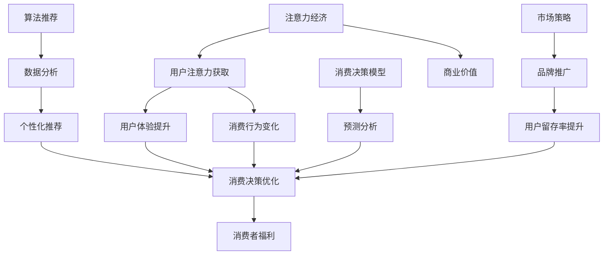

                 

# 注意力经济与个人消费决策的变化

> **关键词：** 注意力经济、个人消费决策、算法推荐、用户体验、行为分析

> **摘要：** 在数字时代，注意力经济成为了商家和平台争夺用户资源的新战场。本文旨在探讨注意力经济对个人消费决策的影响，分析算法推荐机制如何改变用户的行为模式，并预测未来发展趋势及面临的挑战。通过引入注意力经济和消费决策的核心概念，结合实际案例，本文将深入剖析这一现象，为读者提供具有实践指导意义的见解。

## 1. 背景介绍

### 1.1 目的和范围

本文旨在探讨注意力经济对个人消费决策的深远影响，分析算法推荐机制如何改变用户的消费行为。通过深入解析注意力经济的核心概念和机制，以及其对个人决策过程的影响，本文旨在为读者提供一个全面且透彻的理解，帮助他们在日益复杂的数字消费环境中做出更明智的选择。

### 1.2 预期读者

本文适合对消费行为、算法推荐和注意力经济感兴趣的读者，包括市场营销专业人士、数据分析专家、产品经理以及普通消费者。无论您是行业专家还是对这一话题充满好奇的爱好者，本文都将为您提供有价值的见解和分析。

### 1.3 文档结构概述

本文结构如下：

1. **背景介绍**：介绍文章的目的、范围和预期读者。
2. **核心概念与联系**：定义注意力经济和消费决策的核心概念，并提供相应的流程图。
3. **核心算法原理 & 具体操作步骤**：详细解释算法推荐机制的工作原理和操作步骤，使用伪代码进行阐述。
4. **数学模型和公式 & 详细讲解 & 举例说明**：介绍相关的数学模型和公式，并给出具体实例。
5. **项目实战：代码实际案例和详细解释说明**：展示一个实际项目的代码实现和解释。
6. **实际应用场景**：讨论注意力经济和消费决策的实际应用场景。
7. **工具和资源推荐**：推荐相关学习资源、开发工具和论文著作。
8. **总结：未来发展趋势与挑战**：总结文章的主要观点，并讨论未来的发展趋势和挑战。
9. **附录：常见问题与解答**：回答一些常见问题。
10. **扩展阅读 & 参考资料**：提供进一步的阅读材料和参考资料。

### 1.4 术语表

#### 1.4.1 核心术语定义

- **注意力经济**：一种基于用户注意力的经济模式，强调用户对内容或产品的关注和参与。
- **消费决策**：消费者在选择购买产品或服务时所进行的一系列心理和逻辑活动。
- **算法推荐**：基于数据和算法分析，为用户推荐可能感兴趣的产品或内容。

#### 1.4.2 相关概念解释

- **用户体验**：用户在使用产品或服务时所感受到的整体体验。
- **行为分析**：通过分析用户行为数据，了解其偏好和习惯，以优化产品和服务。

#### 1.4.3 缩略词列表

- **A/B测试**：A/B测试，即随机对照试验，用于比较两种或多种版本的某个元素对用户行为的影响。
- **NLP**：自然语言处理，是计算机科学和语言学领域的一个分支，致力于使计算机能够理解、解释和生成人类语言。

## 2. 核心概念与联系

注意力经济和消费决策是两个密切相关但各有侧重的重要概念。为了更好地理解它们之间的联系，我们将通过一个Mermaid流程图来展示它们的核心原理和相互关系。



### 2.1 注意力经济

注意力经济是指在经济活动中，注意力作为一种稀缺资源，其价值被放大并影响商业决策和市场行为。在这个经济模式中，企业通过吸引和保持用户的注意力来创造价值。用户注意力成为连接产品和服务与消费者之间的桥梁，决定了用户对内容或产品的关注程度和参与度。

### 2.2 消费决策

消费决策是指消费者在购买产品或服务前，经过一系列心理和逻辑活动所做的决策过程。这个过程包括需求识别、信息搜索、评估选择、购买决策和购买后行为。消费决策不仅受到个人偏好和需求的影响，还受到市场环境、社会因素等多种因素的影响。

### 2.3 算法推荐

算法推荐是指通过数据分析算法，分析用户的兴趣和行为模式，为用户推荐可能感兴趣的产品或内容。这种推荐机制旨在提高用户的用户体验，增加用户的满意度和忠诚度，从而促进消费行为。

### 2.4 消费决策模型

消费决策模型是用于预测和分析消费者购买行为的数学模型。这些模型通过分析历史数据和用户行为数据，预测用户在特定情境下的购买决策，帮助企业和平台更好地理解和满足用户需求。

### 2.5 市场策略

市场策略是指企业为提高市场份额和销售额所采取的一系列市场行动。在注意力经济中，市场策略包括品牌推广、用户留存策略和个性化推荐等，旨在吸引和保持用户的注意力，提高用户的满意度和忠诚度。

## 3. 核心算法原理 & 具体操作步骤

在注意力经济中，算法推荐是提升用户体验和促进消费行为的关键。以下将详细解释算法推荐的基本原理和具体操作步骤，并使用伪代码来阐述其实现过程。

### 3.1 算法推荐原理

算法推荐的核心在于通过分析用户的历史行为数据、兴趣偏好和社会关系等，生成个性化的推荐列表。推荐算法通常分为基于内容的推荐（Content-Based Filtering）和协同过滤（Collaborative Filtering）两大类。本文将以协同过滤算法为例进行阐述。

**协同过滤算法原理：**
协同过滤算法基于用户之间的相似性或物品之间的相似性来推荐新物品。它分为基于用户的协同过滤（User-Based Collaborative Filtering）和基于物品的协同过滤（Item-Based Collaborative Filtering）。以下是基于用户的协同过滤算法的基本原理：

1. **计算用户相似性**：通过用户行为数据（如评分、购买记录等），计算用户之间的相似性。
2. **找到相似用户**：对于给定用户U，找到与其最相似的K个用户。
3. **生成推荐列表**：根据相似用户的兴趣偏好，为用户U生成推荐列表。

### 3.2 伪代码

以下是基于用户的协同过滤算法的伪代码：

```plaintext
function collaborativeFiltering(reviews, similarityMeasure, k):
    for each user U in reviews:
        compute similarity scores sim(U, V) for all users V
        select the k users with the highest similarity scores
        generate a recommendation list for U based on the average preferences of these k users
    end for
end function
```

### 3.3 具体操作步骤

1. **数据收集**：收集用户的历史行为数据，如评分、购买记录、浏览历史等。
2. **用户相似性计算**：使用合适的方法（如余弦相似性、皮尔逊相关系数等）计算用户之间的相似性。
3. **相似用户筛选**：对于每个用户U，筛选出与其相似度最高的K个用户。
4. **生成推荐列表**：根据相似用户的平均偏好，为用户U生成推荐列表。
5. **评估与优化**：通过评估推荐列表的准确性和用户满意度，不断优化推荐算法。

## 4. 数学模型和公式 & 详细讲解 & 举例说明

在注意力经济和消费决策分析中，数学模型和公式起到了至关重要的作用。以下将介绍一些关键模型和公式，并进行详细讲解和实例说明。

### 4.1 相关数学模型

#### 4.1.1 余弦相似性

余弦相似性是衡量两个向量之间相似度的常用方法。在用户行为分析中，可以用于计算用户之间的相似性。

**公式：**
$$
\cos(\theta) = \frac{\vec{u} \cdot \vec{v}}{\|\vec{u}\| \|\vec{v}\|}
$$

其中，$\vec{u}$和$\vec{v}$分别为两个用户的行为向量，$\|\vec{u}\|$和$\|\vec{v}\|$分别为它们的长。

**实例：**
假设有两个用户U1和U2，他们的行为向量如下：

$$
\vec{u1} = (3, 4, 5)
$$

$$
\vec{u2} = (1, 3, 5)
$$

计算他们的余弦相似性：

$$
\cos(\theta) = \frac{(3, 4, 5) \cdot (1, 3, 5)}{\sqrt{3^2 + 4^2 + 5^2} \sqrt{1^2 + 3^2 + 5^2}} = \frac{3 \times 1 + 4 \times 3 + 5 \times 5}{\sqrt{50} \sqrt{35}} \approx 0.9463
$$

#### 4.1.2 皮尔逊相关系数

皮尔逊相关系数用于衡量两个变量之间的线性相关性。在用户行为分析中，可以用于衡量用户对产品的评价是否具有相关性。

**公式：**
$$
r = \frac{\sum{(x_i - \bar{x})(y_i - \bar{y})}}{\sqrt{\sum{(x_i - \bar{x})^2} \sum{(y_i - \bar{y})^2}}}
$$

其中，$x_i$和$y_i$分别为用户对两个产品的评分，$\bar{x}$和$\bar{y}$分别为它们的平均值。

**实例：**
假设有两个用户U1和U2，他们分别对两个产品P1和P2进行了评分：

$$
\begin{array}{ccc}
U1 & P1 & P2 \\
3 & 4 \\
U2 & P1 & P2 \\
2 & 5 \\
\end{array}
$$

计算他们的皮尔逊相关系数：

$$
r = \frac{(3 - 3)(2 - 3) + (4 - 3)(5 - 3)}{\sqrt{(3 - 3)^2 + (4 - 3)^2} \sqrt{(2 - 3)^2 + (5 - 3)^2}} = \frac{0 + 2}{\sqrt{0 + 1} \sqrt{1 + 4}} = 1
$$

#### 4.1.3 加权平均值

加权平均值用于计算多个因素的加权总和，用于生成个性化的推荐列表。

**公式：**
$$
\text{加权平均值} = \frac{\sum{(w_i \times x_i)}}{\sum{w_i}}
$$

其中，$w_i$为第i个因素的权重，$x_i$为第i个因素的实际值。

**实例：**
假设有3个用户U1、U2和U3，他们的评分和权重如下：

$$
\begin{array}{ccc}
U1 & P1 & P2 & P3 \\
3 & 4 & 5 & w1 \\
U2 & P1 & P2 & P3 \\
2 & 5 & 3 & w2 \\
U3 & P1 & P2 & P3 \\
4 & 3 & 2 & w3 \\
\end{array}
$$

计算他们的加权平均值：

$$
\text{加权平均值} = \frac{(3 \times w1 + 4 \times w2 + 5 \times w3) + (4 \times w1 + 5 \times w2 + 3 \times w3) + (5 \times w1 + 3 \times w2 + 2 \times w3)}{w1 + w2 + w3} = \frac{3w1 + 4w2 + 5w3 + 4w1 + 5w2 + 3w3 + 5w1 + 3w2 + 2w3}{w1 + w2 + w3}
$$

### 4.2 数学模型应用

#### 4.2.1 用户兴趣模型

用户兴趣模型用于分析用户的兴趣偏好，以生成个性化的推荐列表。一个简单的用户兴趣模型可以基于用户的评分历史，计算用户的平均兴趣得分。

**公式：**
$$
\text{用户兴趣得分} = \frac{\sum{(r_i \times w_i)}}{\sum{r_i}}
$$

其中，$r_i$为用户对第i个物品的评分，$w_i$为第i个物品的权重。

**实例：**
假设有一个用户U1，他的评分历史如下：

$$
\begin{array}{ccc}
P1 & P2 & P3 \\
3 & 4 & 5 \\
\end{array}
$$

计算他的兴趣得分：

$$
\text{用户兴趣得分} = \frac{(3 \times w1 + 4 \times w2 + 5 \times w3)}{3 + 4 + 5} = \frac{3w1 + 4w2 + 5w3}{12}
$$

#### 4.2.2 个性化推荐模型

个性化推荐模型用于生成个性化的推荐列表，以提升用户的满意度和忠诚度。一个简单的个性化推荐模型可以基于用户兴趣得分和物品的相似度，生成推荐列表。

**公式：**
$$
\text{推荐列表} = \text{排序}(\text{加权平均值}(\text{用户兴趣得分}, \text{物品相似度得分}))
$$

**实例：**
假设有一个用户U1，他的兴趣得分为0.8，另外三个物品P1、P2、P3的相似度得分分别为0.9、0.7、0.8。生成推荐列表：

$$
\text{推荐列表} = \text{排序}(\text{加权平均值}(0.8, 0.9), \text{加权平均值}(0.8, 0.7), \text{加权平均值}(0.8, 0.8))
$$

## 5. 项目实战：代码实际案例和详细解释说明

为了更好地理解注意力经济和消费决策分析在实际中的应用，我们将通过一个实际项目案例进行详细讲解。以下是一个基于Python实现的用户推荐系统项目，该系统使用协同过滤算法为用户生成个性化推荐列表。

### 5.1 开发环境搭建

**环境要求：**
- Python 3.8及以上版本
- pandas库
- numpy库
- scikit-learn库

**安装依赖：**

```bash
pip install pandas numpy scikit-learn
```

### 5.2 源代码详细实现和代码解读

**代码实现：**

```python
import pandas as pd
import numpy as np
from sklearn.metrics.pairwise import cosine_similarity

# 5.2.1 数据集加载与预处理

# 加载数据集
data = pd.read_csv('user_item_ratings.csv')

# 数据预处理
users = data['user_id'].unique()
items = data['item_id'].unique()
user_item_matrix = data.pivot(index='user_id', columns='item_id', values='rating').fillna(0)

# 5.2.2 用户相似性计算

# 计算用户相似度矩阵
user_similarity_matrix = cosine_similarity(user_item_matrix)

# 5.2.3 生成个性化推荐列表

# 用户评分填充
user_item_matrix.fillna(0, inplace=True)

# 定义推荐函数
def generate_recommendations(user_id, similarity_matrix, user_item_matrix, k=5):
    # 计算用户与所有用户的相似度
    similarity_scores = similarity_matrix[user_id]

    # 筛选相似度最高的k个用户
    top_k_indices = np.argsort(similarity_scores)[1:k+1]

    # 计算相似用户对当前用户的平均评分
    average_ratings = np.mean(user_item_matrix.iloc[top_k_indices], axis=0)

    # 生成推荐列表
    recommendations = pd.DataFrame(average_ratings, index=user_item_matrix.columns, columns=['predicted_rating'])

    # 去除已评分的物品
    recommendations = recommendations[~recommendations.isnull()].sort_values('predicted_rating', ascending=False)

    return recommendations

# 生成推荐列表
user_id = 10  # 示例用户ID
recommendations = generate_recommendations(user_id, user_similarity_matrix, user_item_matrix, k=5)
print(recommendations.head())
```

**代码解读：**

1. **数据加载与预处理**：首先加载用户和物品的评分数据，并将其转换为用户-物品矩阵。
2. **用户相似性计算**：使用余弦相似性计算用户之间的相似度，生成用户相似度矩阵。
3. **生成个性化推荐列表**：定义推荐函数，计算给定用户与相似用户的平均评分，生成推荐列表。

### 5.3 代码解读与分析

1. **数据预处理**：数据预处理是推荐系统的重要步骤，包括数据清洗、填充缺失值等。在本例中，我们使用pandas库读取数据集，并填充缺失值为0。
2. **相似性计算**：使用scikit-learn库中的余弦相似性函数计算用户之间的相似度。相似度矩阵是一个用户-用户矩阵，其中每个元素表示两个用户之间的相似度。
3. **推荐函数实现**：推荐函数根据用户相似度矩阵和用户-物品矩阵，计算给定用户的个性化推荐列表。在本例中，我们选择相似度最高的k个用户，计算它们的平均评分作为推荐列表的预测评分。
4. **推荐列表生成**：生成的推荐列表首先去除已评分的物品，然后按预测评分降序排列，得到最终的推荐列表。

## 6. 实际应用场景

注意力经济和消费决策分析在多个行业和场景中得到了广泛应用，以下列举一些实际应用场景：

### 6.1 电子商务

电子商务平台通过分析用户行为数据，使用算法推荐为用户推荐可能感兴趣的商品。这不仅提高了用户的购物体验，也增加了销售额和用户留存率。

### 6.2 社交媒体

社交媒体平台利用注意力经济原理，为用户推荐可能感兴趣的内容。通过分析用户的行为和社交关系，平台能够提供个性化的内容流，提高用户的参与度和活跃度。

### 6.3 娱乐媒体

娱乐媒体平台如视频网站和音乐平台，通过用户行为分析和推荐算法，为用户提供个性化的视频和音乐推荐。这有助于增加用户的观看和听歌时长，提高用户满意度和忠诚度。

### 6.4 教育行业

在线教育平台通过分析用户的学习行为，推荐可能感兴趣的课程和学习资源。这有助于提高学生的学习效果和参与度，同时也为平台带来更多的收入。

### 6.5 医疗健康

医疗健康平台通过分析用户的行为和健康数据，推荐可能适合的医疗服务和健康产品。这有助于提高用户的健康意识和生活质量，同时也为医疗机构带来更多的患者资源。

## 7. 工具和资源推荐

### 7.1 学习资源推荐

#### 7.1.1 书籍推荐

1. **《推荐系统实践》**：作者：Toby Segaran
   简介：详细介绍了推荐系统的构建和实现，包括协同过滤、基于内容的推荐等多种方法。
2. **《大数据分析：理论与实践》**：作者：Kirk Borne
   简介：全面讲解了大数据分析的基础知识、技术和应用，包括数据挖掘、机器学习等内容。

#### 7.1.2 在线课程

1. **Coursera - Recommender Systems**：提供关于推荐系统的基础知识和高级技术，包括协同过滤、基于内容的推荐等。
2. **edX - Introduction to Machine Learning**：介绍机器学习的基本概念和算法，为学习推荐系统提供必要的背景知识。

#### 7.1.3 技术博客和网站

1. **Towards Data Science**：提供关于数据科学、机器学习和推荐系统的最新技术和研究成果。
2. **DataCamp**：提供各种编程和数据科学课程的免费资源，适合不同层次的学习者。

### 7.2 开发工具框架推荐

#### 7.2.1 IDE和编辑器

1. **PyCharm**：专业的Python集成开发环境，支持多种编程语言和工具。
2. **Jupyter Notebook**：适用于数据科学和机器学习的交互式开发环境，方便编写和运行代码。

#### 7.2.2 调试和性能分析工具

1. **Visual Studio Code**：轻量级但功能强大的编辑器，支持多种编程语言和调试工具。
2. **GDB**：GNU调试器，用于调试C/C++程序。

#### 7.2.3 相关框架和库

1. **scikit-learn**：提供多种机器学习算法和工具，包括协同过滤和基于内容的推荐。
2. **TensorFlow**：用于构建和训练深度学习模型的强大框架。

### 7.3 相关论文著作推荐

#### 7.3.1 经典论文

1. **"Collaborative Filtering for the Web"（2002）**：作者：Julie Berry，等
   简介：介绍了协同过滤算法在Web推荐系统中的应用。
2. **"Item-Based Top-N Recommendation Algorithms"（2003）**：作者：Geoff Hulten，等
   简介：详细讨论了基于物品的Top-N推荐算法。

#### 7.3.2 最新研究成果

1. **"Neural Collaborative Filtering"（2017）**：作者：Xueming Wu，等
   简介：结合神经网络和协同过滤，提出了一种新的推荐算法。
2. **"Dueling Network-based Contextual Bandits"（2018）**：作者：Qin Liu，等
   简介：用于解决动态推荐问题的一种新型算法。

#### 7.3.3 应用案例分析

1. **"Netflix Prize"（2009-2012）**：介绍Netflix挑战赛，展示了如何通过算法推荐提高用户满意度。
2. **"Amazon Personalized Recommendations"**：介绍亚马逊如何使用推荐系统提高销售额和用户留存率。

## 8. 总结：未来发展趋势与挑战

注意力经济和消费决策分析作为数字时代的重要研究领域，展现了巨大的潜力和应用价值。未来，随着技术的不断进步和数据的日益丰富，这一领域将继续发展，并在以下方面取得突破：

### 8.1 发展趋势

1. **个性化推荐**：随着用户数据和分析技术的不断发展，个性化推荐将变得更加精准和有效，满足用户的个性化需求。
2. **实时推荐**：实时推荐技术将进一步提升推荐系统的响应速度，为用户带来更加即时的体验。
3. **多模态推荐**：结合文本、图像、音频等多种数据类型，实现更全面、更精准的推荐。
4. **社会推荐**：结合社交网络数据，实现基于社交关系和群体行为的推荐。

### 8.2 挑战

1. **数据隐私**：随着用户数据泄露事件的频繁发生，如何保护用户隐私将成为一个重要挑战。
2. **算法透明性**：如何确保推荐算法的透明性和公正性，避免偏见和歧视，是一个亟待解决的问题。
3. **计算资源**：随着推荐系统的规模不断扩大，如何优化算法和提升计算效率，是一个重要的技术难题。
4. **用户满意度**：如何在保证推荐效果的同时，提高用户的满意度和忠诚度，是一个持续需要关注的挑战。

## 9. 附录：常见问题与解答

### 9.1 注意力经济是什么？

注意力经济是一种基于用户注意力的经济模式，强调用户对内容或产品的关注和参与。在这种经济模式下，注意力成为一种稀缺资源，其价值被放大并影响商业决策和市场行为。

### 9.2 消费决策是如何形成的？

消费决策是消费者在选择购买产品或服务时所进行的一系列心理和逻辑活动。这个过程包括需求识别、信息搜索、评估选择、购买决策和购买后行为。消费决策受到个人偏好、需求、市场环境和社会因素等多种因素的影响。

### 9.3 算法推荐如何影响消费决策？

算法推荐通过分析用户的历史行为数据、兴趣偏好和社会关系等，生成个性化的推荐列表。这些推荐列表有助于消费者更快速地找到符合自己需求和兴趣的产品或服务，从而影响其消费决策。

### 9.4 注意力经济对消费者有什么影响？

注意力经济对消费者的影响主要体现在以下几个方面：

1. **个性化体验**：个性化推荐提高了用户体验，满足消费者的个性化需求。
2. **信息过载**：注意力经济带来了大量的推荐信息，可能导致消费者在信息筛选和处理上感到压力。
3. **消费行为变化**：推荐系统改变了消费者的购物行为，使其更加依赖于推荐列表。

## 10. 扩展阅读 & 参考资料

1. **Attention Economy**：https://attentioneconomy.com/
   - 介绍注意力经济的概念、原理和应用。
2. **推荐系统论文集**：https://papers.nips.cc/
   - 收集了最新的推荐系统相关论文，包括协同过滤、深度学习等最新技术。
3. **Consumer Decision Making**：https://www.experian.com/blogs/campaign-blogs/consumer-decision-making/
   - 介绍消费决策过程、影响因素和营销策略。
4. **Behavioral Economics**：https://www.npr.org/topics/behavioraleconomics
   - 介绍行为经济学的基本原理和应用，包括消费决策和行为分析。
5. **User Personalization**：https://www.userpersonas.com/user-personas-guide/
   - 介绍用户个人化和用户体验设计的基本原则和方法。

