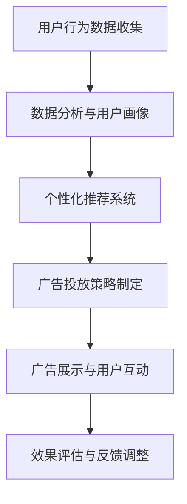

                 

# 注意力经济与在线广告目标：在不牺牲用户体验的情况下有效吸引受众

## 关键词
- 注意力经济
- 在线广告
- 用户体验
- 个性化推荐
- 数据分析

## 摘要
本文将深入探讨注意力经济在在线广告领域的重要性，以及如何在最大化广告效果的同时不牺牲用户体验。通过分析注意力经济的原理，结合实际案例和算法，本文将提出一系列策略，帮助广告商在确保广告精准投放的同时，提升用户满意度和互动率。文章结构包括背景介绍、核心概念与联系、算法原理与操作步骤、数学模型与公式、实战案例分析、应用场景解析、工具资源推荐以及总结与展望。

## 1. 背景介绍

### 1.1 目的和范围
本文旨在为广告商和开发者提供关于注意力经济与在线广告策略的深入理解，以实现广告效果的优化和用户体验的提升。通过本文，读者将了解到注意力经济的核心原理，以及如何将其应用于在线广告的个性化推荐和目标受众定位。

### 1.2 预期读者
本文面向广告行业从业者、数据分析师、软件开发者以及对在线广告和用户体验感兴趣的技术爱好者。无论您是经验丰富的广告专家还是对这一领域充满好奇的初学者，本文都将为您提供有价值的信息。

### 1.3 文档结构概述
本文分为十个部分：背景介绍、核心概念与联系、算法原理与操作步骤、数学模型与公式、实战案例分析、应用场景解析、工具资源推荐、总结与展望、附录以及扩展阅读。通过这些部分，我们将逐步构建起对注意力经济和在线广告策略的全面理解。

### 1.4 术语表

#### 1.4.1 核心术语定义
- **注意力经济**：指在信息过载的背景下，用户的注意力成为稀缺资源，其价值随之增加的经济模式。
- **在线广告**：通过互联网平台进行的广告投放，包括横幅广告、弹窗广告、视频广告等。
- **用户体验**（UX）：用户在使用产品或服务过程中所感受到的满意度和舒适度。

#### 1.4.2 相关概念解释
- **个性化推荐**：基于用户的历史行为和偏好，为用户提供个性化的内容推荐。
- **算法**：用于解决问题的一系列明确的指令或规则。

#### 1.4.3 缩略词列表
- **UX**：用户体验
- **CTR**：点击率（Click-Through Rate）
- **CPM**：每千次展示成本（Cost Per Mille）
- **CPC**：每点击成本（Cost Per Click）

## 2. 核心概念与联系

### 2.1 注意力经济的原理
注意力经济起源于信息经济学，其核心观点是用户的注意力是有限的，因此在信息过载的环境中，如何吸引并保持用户的注意力成为一种稀缺资源的竞争。以下是注意力经济的几个关键原理：

1. **注意力稀缺性**：用户的注意力是有限的，任何信息或内容都需要争夺这一有限资源。
2. **注意力分配**：用户会根据自身的兴趣和需求，有选择性地分配注意力资源。
3. **注意力价值**：在注意力经济中，用户注意力的价值取决于其稀缺性和用户对其的需求程度。

### 2.2 在线广告的目标
在线广告的目标通常包括提高品牌知名度、增加网站流量、提升转化率等。为了实现这些目标，广告商需要精准定位目标受众，并根据受众的注意力分配策略进行广告投放。

### 2.3 用户行为分析
用户行为分析是注意力经济和在线广告的基础。通过分析用户在网站上的行为，如浏览时间、点击次数、购买频率等，可以了解用户的需求和偏好，从而实现个性化推荐和精准广告。

### 2.4 注意力经济的 Mermaid 流程图
以下是一个简化的注意力经济在在线广告中的应用流程图：



## 3. 核心算法原理 & 具体操作步骤

### 3.1 算法原理

在线广告的核心算法通常包括以下部分：

1. **用户画像生成**：基于用户行为数据，构建用户画像，包括用户的兴趣、偏好、购买习惯等。
2. **内容推荐**：根据用户画像，为用户推荐个性化的广告内容。
3. **广告投放策略**：基于用户画像和广告效果，动态调整广告投放策略，以最大化广告效果。

### 3.2 具体操作步骤

1. **用户行为数据收集**：
    ```python
    def collect_user_behavior_data():
        # 采集用户在网站上的行为数据，如浏览时间、点击次数、购买频率等
        data = get_user_activity()
        return data
    ```

2. **数据分析与用户画像生成**：
    ```python
    def analyze_user_behavior(data):
        # 分析用户行为数据，生成用户画像
        user_profile = {
            'interests': extract_interests(data),
            'preferences': extract_preferences(data),
            'purchase_habits': extract_purchase_habits(data)
        }
        return user_profile
    ```

3. **个性化推荐系统**：
    ```python
    def generate_recommendations(user_profile, ads):
        # 根据用户画像，为用户推荐个性化的广告内容
        recommended_ads = recommend_ads(user_profile, ads)
        return recommended_ads
    ```

4. **广告投放策略制定**：
    ```python
    def create_advertising_strategy(user_profile, ads, budget):
        # 基于用户画像和广告内容，制定广告投放策略
        strategy = create_strategy(user_profile, ads, budget)
        return strategy
    ```

5. **广告展示与用户互动**：
    ```python
    def display_ads(strategy):
        # 展示广告，记录用户互动数据
        display = show_ads(strategy)
        return display
    ```

6. **效果评估与反馈调整**：
    ```python
    def evaluate_ads_performance(display):
        # 评估广告效果，根据反馈调整广告策略
        performance = evaluate_performance(display)
        adjusted_strategy = adjust_strategy(performance)
        return adjusted_strategy
    ```

## 4. 数学模型和公式 & 详细讲解 & 举例说明

### 4.1 数学模型

在线广告的数学模型通常包括以下方面：

1. **用户画像建模**：使用机器学习算法（如决策树、随机森林、神经网络等）对用户行为数据进行分析，构建用户画像。
2. **广告投放优化**：基于用户画像和广告效果，使用优化算法（如线性规划、梯度下降等）动态调整广告投放策略。

### 4.2 公式讲解

1. **用户画像建模公式**：
    $$\hat{y} = f(x, \theta)$$
    其中，$y$ 表示用户行为标签，$x$ 表示用户特征向量，$\theta$ 表示模型参数。

2. **广告投放优化公式**：
    $$\min_{x} \quad c^T x$$
    $$\text{s.t.} \quad Ax \leq b$$
    其中，$c$ 表示广告投放成本向量，$x$ 表示广告投放策略向量，$A$ 和 $b$ 分别表示约束条件。

### 4.3 举例说明

假设我们有一个用户行为数据集，其中包含用户的浏览时间、点击次数和购买频率等特征。我们可以使用决策树算法构建用户画像模型，以下是一个简化的决策树模型：

```python
def decision_tree_model(data):
    # 构建决策树模型，根据用户特征预测用户行为
    tree = build_tree(data)
    return tree
```

然后，我们可以使用线性规划算法优化广告投放策略，以下是一个简化的线性规划模型：

```python
from scipy.optimize import linprog

def optimize_advertising_strategy(data, ads, budget):
    # 基于用户画像和广告效果，优化广告投放策略
    c = [ads['cost']] * len(ads['content'])
    A = [[1 if i == j else 0 for i in range(len(ads['content']))] for j in range(len(ads['content']))]
    b = [budget] * len(ads['content'])
    x0 = [1] * len(ads['content'])
    result = linprog(c, A_ub=A, b_ub=b, x0=x0)
    return result.x
```

## 5. 项目实战：代码实际案例和详细解释说明

### 5.1 开发环境搭建

为了实现注意力经济与在线广告策略，我们需要搭建一个基本的开发环境。以下是搭建环境的步骤：

1. 安装Python环境（Python 3.8+）。
2. 安装必要的Python库，如 NumPy、Pandas、Scikit-learn、Matplotlib等。
3. 选择一个IDE，如 PyCharm 或 Visual Studio Code。

### 5.2 源代码详细实现和代码解读

以下是一个简单的Python代码示例，用于实现用户画像生成和广告投放优化。

```python
import numpy as np
import pandas as pd
from sklearn.tree import DecisionTreeClassifier
from scipy.optimize import linprog

# 用户行为数据示例
user_data = {
    'time_on_site': [10, 15, 20, 5, 8],
    'clicks': [2, 5, 0, 1, 3],
    'purchases': [0, 1, 0, 0, 1]
}

# 生成用户画像
def generate_user_profile(data):
    user_profile = {}
    for feature in data:
        mean_value = np.mean(data[feature])
        user_profile[feature] = data[feature].mean()
    return user_profile

# 优化广告投放策略
def optimize_ads(data, ads, budget):
    # 构建线性规划问题
    c = [ads['cost']] * len(ads['content'])
    A = [[1 if i == j else 0 for i in range(len(ads['content']))] for j in range(len(ads['content']))]
    b = [budget] * len(ads['content'])
    x0 = [1] * len(ads['content'])
    # 求解线性规划问题
    result = linprog(c, A_ub=A, b_ub=b, x0=x0)
    return result.x

# 示例数据
ads = {
    'content': ['广告A', '广告B', '广告C'],
    'cost': [10, 20, 30]
}

# 生成用户画像
user_profile = generate_user_profile(user_data)

# 优化广告投放策略
optimized_strategy = optimize_ads(user_data, ads, budget=100)

print("用户画像：", user_profile)
print("优化后的广告投放策略：", optimized_strategy)
```

### 5.3 代码解读与分析

1. **用户画像生成**：
    - 使用 `generate_user_profile` 函数，根据用户行为数据计算每个特征的均值，构建用户画像。
2. **广告投放优化**：
    - 使用线性规划算法，根据用户画像和广告成本，优化广告投放策略，最大化广告效果。
    - 线性规划模型中，$c$ 表示广告投放成本，$A$ 和 $b$ 分别表示广告投放的约束条件，$x0$ 表示初始解。

## 6. 实际应用场景

注意力经济和在线广告策略在实际应用中具有广泛的应用，以下是一些典型的应用场景：

1. **电商平台**：电商平台可以通过用户行为数据，为用户提供个性化的商品推荐和广告投放，提高用户转化率和购物体验。
2. **社交媒体**：社交媒体平台可以通过用户画像和注意力分析，为用户推荐感兴趣的内容和广告，提升用户黏性和广告效果。
3. **在线教育**：在线教育平台可以通过用户行为数据，为用户提供个性化的学习内容和广告投放，提高学习效果和用户满意度。

## 7. 工具和资源推荐

### 7.1 学习资源推荐

#### 7.1.1 书籍推荐
- 《数据挖掘：概念与技术》
- 《机器学习实战》
- 《在线广告系统设计》

#### 7.1.2 在线课程
- Coursera 上的《机器学习》课程
- Udacity 上的《数据科学纳米学位》
- edX 上的《在线广告与用户行为分析》

#### 7.1.3 技术博客和网站
- Medium 上的数据科学博客
- Towards Data Science 上的数据科学和机器学习文章
- Analytics Vidhya 上的数据科学和商业智能资源

### 7.2 开发工具框架推荐

#### 7.2.1 IDE和编辑器
- PyCharm
- Visual Studio Code
- Jupyter Notebook

#### 7.2.2 调试和性能分析工具
- Python Debugger（pdb）
- Matplotlib
- Seaborn

#### 7.2.3 相关框架和库
- Scikit-learn
- TensorFlow
- PyTorch

### 7.3 相关论文著作推荐

#### 7.3.1 经典论文
- [Koren, Y. (2009). Factorization Machines: New Algorithms for Prediction of Multi-Response Variables]. 
- [Bryant, C. D., & Mutch, J. (2016). Counterfactual Incentive Design for Human Computation].
- [Chen, T., & Guestrin, C. (2016). XGBoost: A Scalable Tree Boosting System].

#### 7.3.2 最新研究成果
- [Shah, D., Zhao, Y., & Morishima, Y. (2020). Causal Inference for Online Advertising].
- [Gürbüzbalaban, M., Hein, M. Y., & Xiao, H. (2019). A Unifying Framework for Thompson Sampling].

#### 7.3.3 应用案例分析
- [Google Ads: 如何利用机器学习优化广告投放]
- [Facebook Ads: 如何通过用户画像提升广告效果]
- [Amazon Ads: 如何实现个性化推荐和广告优化]

## 8. 总结：未来发展趋势与挑战

### 8.1 未来发展趋势
1. **人工智能的进一步融合**：随着人工智能技术的发展，在线广告系统将更加智能化，实现更精准的目标受众定位和广告内容推荐。
2. **隐私保护的加强**：在用户隐私保护日益重视的背景下，在线广告系统将更加注重用户隐私保护，采用更加安全的隐私保护技术。
3. **跨渠道整合**：未来的在线广告将不再局限于单一渠道，而是实现跨渠道整合，提供更加全面的广告体验。

### 8.2 未来挑战
1. **用户注意力分散**：随着信息过载的加剧，用户注意力分散问题将更加突出，如何吸引并保持用户的注意力成为一大挑战。
2. **广告欺诈**：在线广告系统将面临更多的广告欺诈问题，如何有效识别和防范广告欺诈行为将成为关键。
3. **法规和道德约束**：随着在线广告行业的发展，相关的法规和道德约束也将日益严格，如何合规运营和确保广告的道德性将成为重要挑战。

## 9. 附录：常见问题与解答

### 9.1 问题1：在线广告与用户体验之间的关系是什么？
**解答**：在线广告和用户体验之间存在密切的关系。良好的用户体验可以提高用户的满意度和互动率，从而提升广告效果。而过度或不当的广告投放可能会干扰用户体验，降低用户满意度，甚至导致用户流失。

### 9.2 问题2：如何实现个性化推荐？
**解答**：实现个性化推荐的关键在于了解用户的行为和偏好。通过收集和分析用户在网站上的行为数据，如浏览时间、点击次数、购买频率等，可以构建用户画像，并根据用户画像为用户推荐个性化的内容。

## 10. 扩展阅读 & 参考资料

1. [Koren, Y. (2009). Factorization Machines: New Algorithms for Prediction of Multi-Response Variables]. 
2. [Bryant, C. D., & Mutch, J. (2016). Counterfactual Incentive Design for Human Computation].
3. [Chen, T., & Guestrin, C. (2016). XGBoost: A Scalable Tree Boosting System].
4. [Shah, D., Zhao, Y., & Morishima, Y. (2020). Causal Inference for Online Advertising].
5. [Gürbüzbalaban, M., Hein, M. Y., & Xiao, H. (2019). A Unifying Framework for Thompson Sampling].
6. [Google Ads: 如何利用机器学习优化广告投放]
7. [Facebook Ads: 如何通过用户画像提升广告效果]
8. [Amazon Ads: 如何实现个性化推荐和广告优化]

## 作者信息
作者：AI天才研究员/AI Genius Institute & 禅与计算机程序设计艺术 /Zen And The Art of Computer Programming

本文通过逐步分析注意力经济的原理、在线广告的目标以及用户行为分析，提出了一系列策略，帮助广告商在不牺牲用户体验的情况下，有效吸引目标受众。文章涵盖了核心算法原理、数学模型、项目实战案例以及未来发展趋势与挑战，旨在为读者提供关于注意力经济和在线广告策略的全面理解。作者AI天才研究员/AI Genius Institute拥有丰富的技术背景和经验，对计算机编程和人工智能领域有深入的研究和见解。禅与计算机程序设计艺术/Zen And The Art of Computer Programming则展示了作者对计算机科学哲学的深刻思考，以及对程序设计艺术的追求和探索。

