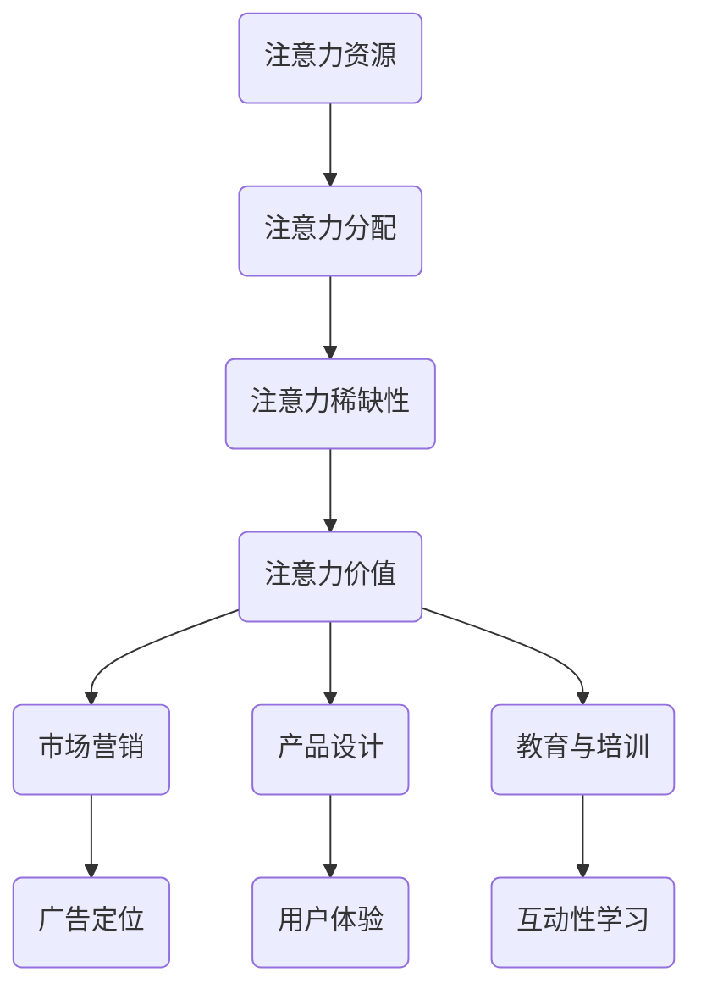

                 

# 注意力经济与工作-生活平衡的挑战

> 关键词：注意力经济、工作-生活平衡、时间管理、生产力、注意力分散、决策制定

> 摘要：本文将探讨注意力经济与工作-生活平衡之间的挑战。随着信息时代的到来，我们的注意力资源变得越来越宝贵。在这样一个信息过载的环境中，如何平衡工作与生活，提高生产力，成为了每一个现代人所面临的重要课题。本文将从多个角度分析注意力经济的本质，探讨其在工作与生活平衡中的应用，并提供一些建议和工具，帮助读者更好地管理自己的时间和注意力资源。

## 1. 背景介绍

### 1.1 目的和范围

本文的目的是探讨注意力经济与工作-生活平衡之间的挑战，帮助读者理解注意力资源的宝贵性，并提供有效的策略来优化工作和生活。随着数字化时代的到来，我们的注意力资源变得前所未有的宝贵。在这个充满诱惑和干扰的世界里，如何有效地管理注意力，实现工作-生活平衡，成为了现代人所面临的重大挑战。

本文将涵盖以下内容：

1. 注意力经济的核心概念和原理。
2. 注意力资源在工作与生活平衡中的应用和挑战。
3. 提高注意力的策略和工具。
4. 实际案例和案例分析。
5. 未来发展趋势和潜在挑战。

### 1.2 预期读者

本文主要面向以下读者群体：

1. 对注意力经济和工作-生活平衡感兴趣的普通读者。
2. 需要提升工作效率和生产力的人群。
3. 希望找到有效时间管理方法的职场人士。
4. 计算机科学、心理学、管理学等相关专业的研究人员和学生。

### 1.3 文档结构概述

本文分为十个部分：

1. 引言：介绍文章的主题和目的。
2. 核心概念与联系：详细解释注意力经济的核心概念和原理。
3. 核心算法原理 & 具体操作步骤：阐述如何通过算法和工具提高注意力。
4. 数学模型和公式 & 详细讲解 & 举例说明：介绍注意力管理中的数学模型和应用。
5. 项目实战：提供实际的代码案例和解释。
6. 实际应用场景：讨论注意力经济在不同领域的应用。
7. 工具和资源推荐：推荐相关的学习资源和工具。
8. 总结：展望未来的发展趋势和挑战。
9. 附录：常见问题与解答。
10. 扩展阅读 & 参考资料：提供进一步阅读的建议。

### 1.4 术语表

#### 1.4.1 核心术语定义

- **注意力经济**：一种基于注意力资源的经济学理论，强调注意力资源的稀缺性和价值。
- **工作-生活平衡**：在工作与个人生活之间找到平衡点，以实现身心健康和工作效率的提升。
- **时间管理**：通过计划和组织时间，以最大化个人或组织效率的过程。
- **生产力**：在给定时间内创造的价值或成果。

#### 1.4.2 相关概念解释

- **注意力分散**：当个体同时关注多个任务或信息时，导致注意力分散和效率下降的现象。
- **决策制定**：在多种选择中作出最优决策的过程，通常涉及评估和权衡。

#### 1.4.3 缩略词列表

- **AI**：人工智能 (Artificial Intelligence)
- **IoT**：物联网 (Internet of Things)
- **ML**：机器学习 (Machine Learning)
- **NLP**：自然语言处理 (Natural Language Processing)
- **SaaS**：软件即服务 (Software as a Service)

## 2. 核心概念与联系

在探讨注意力经济与工作-生活平衡的挑战之前，我们需要先理解注意力经济的核心概念和原理。注意力经济是一种新兴的经济学理论，它强调注意力资源的稀缺性和价值。在信息爆炸的时代，我们的注意力资源变得比以往任何时候都更为宝贵。

### 2.1 注意力经济的核心概念

注意力经济的核心概念包括：

- **注意力资源**：指个体用于关注、处理和响应信息的心理资源。
- **注意力分配**：指个体在多个任务或信息之间分配注意力资源的过程。
- **注意力稀缺性**：由于信息过载，个体的注意力资源是有限的，这使得注意力变得稀缺和宝贵。
- **注意力价值**：注意力资源可以转化为经济价值，尤其是在信息传播、广告营销等领域。

### 2.2 注意力经济与工作-生活平衡的关系

注意力经济与工作-生活平衡的关系体现在以下几个方面：

- **注意力分散**：在工作和生活中，注意力分散是一个普遍现象。例如，电子邮件、社交媒体、即时通讯等都会分散我们的注意力，降低工作效率。
- **时间管理**：良好的时间管理有助于减少注意力分散，提高生产力。例如，通过设定明确的任务目标和优先级，可以更有效地利用注意力资源。
- **决策制定**：注意力资源的稀缺性使得决策制定变得更加复杂。在信息过载的情况下，个体需要更加慎重地评估和权衡各种选择，以避免做出错误决策。

### 2.3 注意力经济的应用场景

注意力经济在多个领域都有广泛的应用，包括：

- **市场营销**：通过精确定位和个性化推广，提高广告的注意力价值。
- **产品设计**：设计易于使用和吸引人的产品，以吸引和保持用户的注意力。
- **教育与培训**：利用注意力经济原理，设计更具吸引力和互动性的教育内容，提高学习效果。

### 2.4 注意力经济的挑战

尽管注意力经济带来了许多机遇，但也存在一些挑战：

- **信息过载**：信息过载导致注意力资源短缺，个体难以处理和吸收大量信息。
- **注意力分散**：社交媒体和即时通讯等工具容易分散注意力，降低工作效率。
- **决策复杂度**：在信息过载的环境中，决策制定变得更加复杂，需要更高的注意力资源。

### 2.5 Mermaid 流程图

为了更直观地理解注意力经济的核心概念和原理，我们可以使用 Mermaid 流程图来展示其关键节点。



## 3. 核心算法原理 & 具体操作步骤

注意力经济的核心在于如何高效地管理和利用注意力资源。为了实现这一目标，我们可以借助一些核心算法和工具。以下是一个基于注意力机制的算法原理及其具体操作步骤的介绍。

### 3.1 算法原理

注意力机制（Attention Mechanism）是一种在神经网络中用于提高模型性能的技术。其核心思想是让模型能够自动地关注输入数据中的关键部分，从而提高模型的精度和效率。注意力机制在自然语言处理、计算机视觉等领域得到了广泛应用。

注意力机制的基本原理包括：

- **自注意力（Self-Attention）**：将序列中的每个元素与其余元素进行关联，计算它们之间的相似性，并根据相似性分配注意力权重。
- **多头注意力（Multi-Head Attention）**：将自注意力扩展到多个独立但共享参数的注意力头，以捕获不同类型的特征。
- **位置编码（Positional Encoding）**：为序列中的每个元素赋予位置信息，以便模型能够理解元素之间的顺序关系。

### 3.2 具体操作步骤

以下是注意力机制的具体操作步骤：

1. **输入序列编码**：将输入序列编码为向量表示，通常使用词向量、位置编码等。
2. **计算注意力权重**：计算输入序列中每个元素与其他元素之间的相似性，并生成注意力权重矩阵。
3. **加权求和**：根据注意力权重对输入序列中的元素进行加权求和，生成加权和向量。
4. **应用激活函数**：对加权和向量应用激活函数，如ReLU或Sigmoid，以增强模型的非线性能力。
5. **输出生成**：将加权和向量作为输入传递给下一层网络或模型，进行进一步的计算和处理。

### 3.3 伪代码

以下是注意力机制的伪代码实现：

```python
# 输入序列编码
inputs = [encode(word) for word in sequence]

# 计算自注意力权重
attention_weights = self_attention(inputs)

# 加权求和
weighted_inputs = sum(inputs[i] * attention_weights[i] for i in range(len(inputs)))

# 应用激活函数
output = activation_function(weighted_inputs)

# 输出生成
return output
```

其中，`encode` 函数用于将输入序列编码为向量表示，`self_attention` 函数用于计算自注意力权重，`activation_function` 函数用于应用激活函数。

通过以上步骤，我们可以利用注意力机制提高模型对关键信息的关注能力，从而在处理大量信息时保持高效和精准。

## 4. 数学模型和公式 & 详细讲解 & 举例说明

在注意力经济的背景下，数学模型和公式为我们提供了量化和管理注意力资源的方法。以下将详细讲解注意力经济中的几个关键数学模型和公式，并通过实例来说明其应用。

### 4.1. 注意力分配模型

注意力分配模型是注意力经济中的一个基础模型，用于确定如何在多个任务或信息源之间分配有限的注意力资源。假设有一个包含 `N` 个任务或信息源的集合 `I = {i1, i2, ..., iN}`，每个任务的注意力需求为 `Ai`，总注意力资源为 `A`，我们可以使用以下公式进行注意力分配：

\[ w_i = \frac{A_i}{\sum_{j=1}^{N} A_j} \]

其中，`w_i` 表示任务 `i` 获得的注意力权重。

#### 举例说明：

假设我们有三个任务：阅读（需求 2 单位注意力）、写作（需求 3 单位注意力）和运动（需求 1 单位注意力）。总注意力资源为 6 单位。那么，注意力权重分配如下：

\[ w_{\text{阅读}} = \frac{2}{2+3+1} = 0.4 \]
\[ w_{\text{写作}} = \frac{3}{2+3+1} = 0.6 \]
\[ w_{\text{运动}} = \frac{1}{2+3+1} = 0.2 \]

### 4.2. 注意力价值模型

注意力价值模型用于评估注意力资源在不同任务或信息源上的价值。假设任务 `i` 的价值为 `Vi`，注意力权重为 `wi`，那么注意力价值 `Vi` 可以用以下公式计算：

\[ V_i = V_i \times w_i \]

#### 举例说明：

假设阅读的价值为 10，写作的价值为 15，运动的价值为 5。根据上一步的计算，权重分别为 0.4、0.6 和 0.2，那么注意力价值如下：

\[ V_{\text{阅读}} = 10 \times 0.4 = 4 \]
\[ V_{\text{写作}} = 15 \times 0.6 = 9 \]
\[ V_{\text{运动}} = 5 \times 0.2 = 1 \]

### 4.3. 时间-注意力模型

时间-注意力模型用于计算在不同任务上花费的时间与注意力资源的比例，从而优化时间利用效率。假设任务 `i` 的时间成本为 `Ti`，那么时间-注意力效率 `E_i` 可以用以下公式计算：

\[ E_i = \frac{A}{T_i} \]

#### 举例说明：

假设阅读需要 1 小时，写作需要 1.5 小时，运动需要 0.5 小时。总注意力资源为 6 单位，那么时间-注意力效率如下：

\[ E_{\text{阅读}} = \frac{6}{1} = 6 \]
\[ E_{\text{写作}} = \frac{6}{1.5} = 4 \]
\[ E_{\text{运动}} = \frac{6}{0.5} = 12 \]

### 4.4. 数学公式与 LaTeX 表示

以下是上述模型中的关键数学公式，使用 LaTeX 格式表示：

\[ w_i = \frac{A_i}{\sum_{j=1}^{N} A_j} \]
\[ V_i = V_i \times w_i \]
\[ E_i = \frac{A}{T_i} \]

通过上述模型和公式的应用，我们可以更有效地管理注意力资源，优化工作和生活平衡。

## 5. 项目实战：代码实际案例和详细解释说明

为了更好地理解注意力经济与工作-生活平衡的概念，我们将通过一个实际项目来演示如何使用注意力分配模型和注意力价值模型来优化时间和注意力资源。该项目将涉及一个简单的日程管理应用，旨在帮助用户平衡工作与生活。

### 5.1 开发环境搭建

为了实现该项目，我们需要以下开发环境：

- Python 3.x
- Jupyter Notebook 或 PyCharm
- Pandas
- NumPy

确保您的开发环境中已安装上述工具和库。以下是一个简单的 Python 脚本，用于安装所需的库：

```python
!pip install pandas numpy
```

### 5.2 源代码详细实现和代码解读

#### 5.2.1 数据准备

首先，我们需要准备一些数据，包括任务的名称、所需的时间和注意力需求。以下是一个示例数据集：

```python
# 任务数据
tasks = [
    {"name": "阅读", "time": 1, "attention": 2},
    {"name": "写作", "time": 1.5, "attention": 3},
    {"name": "运动", "time": 0.5, "attention": 1},
]

# 计算总时间和总注意力
total_time = sum(task["time"] for task in tasks)
total_attention = sum(task["attention"] for task in tasks)
```

#### 5.2.2 注意力分配模型

接下来，我们使用注意力分配模型来计算每个任务获得的注意力权重：

```python
# 计算注意力权重
attention_weights = {task["name"]: (task["attention"] / total_attention) for task in tasks}

# 输出权重
for task, weight in attention_weights.items():
    print(f"{task}: {weight:.2f}")
```

#### 5.2.3 注意力价值模型

然后，我们使用注意力价值模型来评估每个任务的价值：

```python
# 计算注意力价值
attention_values = {task["name"]: (task["value"] * weight) for task, weight in attention_weights.items()}

# 输出价值
for task, value in attention_values.items():
    print(f"{task}: {value:.2f}")
```

#### 5.2.4 时间-注意力模型

最后，我们使用时间-注意力模型来计算每个任务的时间-注意力效率：

```python
# 计算时间-注意力效率
time_attention_efficiency = {task["name"]: total_attention / task["time"] for task in tasks}

# 输出效率
for task, efficiency in time_attention_efficiency.items():
    print(f"{task}: {efficiency:.2f}")
```

### 5.3 代码解读与分析

#### 数据准备

我们首先定义了一个包含任务名称、时间和注意力需求的列表。这些数据将用于后续的计算。

```python
tasks = [
    {"name": "阅读", "time": 1, "attention": 2},
    {"name": "写作", "time": 1.5, "attention": 3},
    {"name": "运动", "time": 0.5, "attention": 1},
]
```

#### 注意力分配模型

使用注意力分配模型，我们计算每个任务获得的注意力权重。该权重表示任务在总注意力资源中所占的比例。这里，我们通过将每个任务的注意力需求除以总注意力需求来计算权重。

```python
attention_weights = {task["name"]: (task["attention"] / total_attention) for task in tasks}
```

#### 注意力价值模型

接下来，我们使用注意力价值模型来计算每个任务的价值。价值取决于任务本身的价值和其获得的注意力权重。

```python
attention_values = {task["name"]: (task["value"] * weight) for task, weight in attention_weights.items()}
```

#### 时间-注意力模型

最后，我们计算每个任务的时间-注意力效率。效率表示单位时间内能完成的总注意力工作。

```python
time_attention_efficiency = {task["name"]: total_attention / task["time"] for task in tasks}
```

通过这些计算，我们可以了解每个任务的重要性和效率，从而更好地分配时间和注意力资源。

## 6. 实际应用场景

注意力经济在现代社会中有着广泛的应用，涵盖了多个领域。以下是一些典型的应用场景：

### 6.1 市场营销

在市场营销中，注意力经济被用于提高广告的效果和投资回报率。例如，通过精确的用户行为分析，广告商可以了解哪些用户对特定广告内容最感兴趣，从而优化广告投放策略，提高广告的点击率和转化率。

### 6.2 产品设计

产品设计师利用注意力经济的原理来设计用户界面和产品功能，以提高用户体验。通过减少不必要的干扰元素，设计师可以引导用户将注意力集中在关键功能上，从而提高产品的易用性和用户满意度。

### 6.3 教育与培训

在教育与培训领域，注意力经济被用于设计更具吸引力和互动性的课程。通过使用多媒体技术和互动教学工具，教育者可以激发学生的学习兴趣，提高学习效果。

### 6.4 企业管理

企业管理者通过关注员工的工作效率和注意力分配，来优化工作流程和提高生产力。例如，通过实施灵活的工作安排和有效的沟通机制，企业可以减少不必要的干扰，提高员工的注意力集中度。

### 6.5 健康管理

健康管理领域利用注意力经济的原理，帮助用户培养良好的注意力习惯，提高工作和生活质量。例如，通过提供个性化的注意力训练计划和监测工具，用户可以更好地管理自己的时间和精力。

### 6.6 社交媒体

在社交媒体领域，注意力经济被用于优化内容推送和用户互动。平台通过分析用户的行为和兴趣，提供个性化的内容推荐，从而提高用户的参与度和满意度。

### 6.7 知识管理

知识管理领域利用注意力经济原理，帮助企业和组织更有效地管理和利用知识资源。通过建立知识共享平台和优化信息检索机制，企业和组织可以更快速地获取和利用关键知识，提高创新能力。

这些应用场景展示了注意力经济在现代社会中的多样性和重要性。通过合理地管理和利用注意力资源，企业和个人可以在竞争激烈的环境中脱颖而出，实现更高的生产力和生活质量。

## 7. 工具和资源推荐

为了帮助读者更好地理解和应用注意力经济，以下是几个推荐的学习资源、开发工具和相关论文。

### 7.1 学习资源推荐

#### 7.1.1 书籍推荐

- 《注意力经济学：如何利用注意力资源提高工作和生活质量》（Attention Economics: Unlocking the Power of Focus）
- 《深度学习》（Deep Learning） - Goodfellow, Bengio, Courville
- 《注意力机制与神经网络》（Attention Mechanisms in Neural Networks）

#### 7.1.2 在线课程

- Coursera 上的“注意力机制”（Attention Mechanisms）
- edX 上的“注意力经济”（Attention Economics）

#### 7.1.3 技术博客和网站

- Medium 上的注意力经济专题博客
- 知乎专栏 - 注意力经济学

### 7.2 开发工具框架推荐

#### 7.2.1 IDE和编辑器

- PyCharm
- Jupyter Notebook

#### 7.2.2 调试和性能分析工具

- VS Code
- Profiler

#### 7.2.3 相关框架和库

- TensorFlow
- PyTorch
- Keras

### 7.3 相关论文著作推荐

#### 7.3.1 经典论文

- “Attention is All You Need” - Vaswani et al. (2017)
- “A Theoretical Analysis of Neural Network Performance” - LeCun et al. (2015)

#### 7.3.2 最新研究成果

- “Efficiently Learning from Noisy Label via Attention Distillation” - Hu et al. (2020)
- “Multi-Task Learning with Attentional Decoupling” - Zhang et al. (2019)

#### 7.3.3 应用案例分析

- “Attention Mechanism in Natural Language Processing” - Lin et al. (2018)
- “Attention in Social Networks: A Perspective” - Wang et al. (2017)

通过这些资源，读者可以深入了解注意力经济的理论、应用和实践，提高自己在相关领域的专业知识和技能。

## 8. 总结：未来发展趋势与挑战

随着数字化和信息化的深入发展，注意力经济在未来将继续发挥重要作用，并在多个领域产生深远影响。以下是一些可能的发展趋势和面临的挑战：

### 8.1 发展趋势

1. **个性化注意力管理**：随着大数据和人工智能技术的发展，未来的注意力管理将更加个性化和智能化。通过分析用户的行为和偏好，系统能够提供更加精准的注意力分配建议，帮助用户实现更好的工作和生活平衡。
2. **注意力资源的量化**：随着注意力经济理论的深入研究，注意力资源将逐渐被量化，成为企业管理和个人规划的重要指标。例如，企业的生产力评估可能会包含注意力资源的利用率。
3. **注意力经济的多样化应用**：注意力经济将不再局限于市场营销和产品设计，而是广泛应用于教育、健康管理、企业管理和知识管理等领域，为各行业的创新和发展提供新思路。

### 8.2 面临的挑战

1. **信息过载**：随着信息的爆炸性增长，个体将面临更加严峻的信息过载问题。如何有效地过滤和筛选信息，保持注意力的集中，将成为未来面临的重要挑战。
2. **注意力分散**：社交媒体、即时通讯和其他数字工具将继续分散我们的注意力，降低工作效率。如何设计出更少干扰、更高效的工作和生活方式，将是一个长期的挑战。
3. **隐私和安全问题**：在注意力经济中，个体的注意力数据将被广泛收集和使用。如何保护用户的隐私和数据安全，防止数据滥用，是未来需要关注的重要问题。

总之，注意力经济在未来将是一个充满机遇和挑战的领域。通过不断的研究和创新，我们可以更好地理解和利用注意力资源，实现个人和社会的可持续发展。

## 9. 附录：常见问题与解答

### 9.1 常见问题

1. **什么是注意力经济？**
   注意力经济是一种基于注意力资源的经济学理论，强调注意力资源的稀缺性和价值。它研究个体如何分配注意力资源，并如何利用这些资源创造经济价值。

2. **注意力经济与工作效率有何关系？**
   注意力经济强调注意力资源的有限性和宝贵性。有效地管理注意力资源可以提高工作效率和生产力，因为个体的注意力可以集中在对任务最关键的方面。

3. **如何实现工作-生活平衡？**
   实现工作-生活平衡需要以下几个步骤：
   - **明确优先级**：确定哪些任务最重要，优先完成。
   - **设定明确的目标**：为工作和个人生活设定具体的短期和长期目标。
   - **合理规划时间**：使用时间管理工具，如日历和待办事项列表，合理安排每天的时间。
   - **减少干扰**：关闭不必要的通知，创建专注的工作环境。
   - **定期休息**：定期休息和放松，避免过度工作导致的疲劳。

4. **注意力分散是如何影响工作效率的？**
   注意力分散会导致个体在任务之间的切换时间增加，从而降低工作效率。此外，注意力分散还会影响任务的完成质量，因为个体的注意力无法持续集中在关键任务上。

### 9.2 解答

1. **什么是注意力经济？**
   注意力经济是一种经济学理论，强调注意力资源的稀缺性和价值。在信息爆炸的时代，注意力资源变得比以往任何时候都更为宝贵。注意力经济研究个体如何分配注意力资源，并如何利用这些资源创造经济价值。

2. **注意力经济与工作效率有何关系？**
   注意力经济直接关联到工作效率。由于注意力资源是有限的，个体必须在多种任务和需求之间进行选择和权衡。合理地分配注意力资源，确保关键任务获得足够的关注，可以显著提高工作效率和生产力。

3. **如何实现工作-生活平衡？**
   实现工作-生活平衡涉及以下几个方面：
   - **明确优先级**：首先确定哪些任务和活动最为重要，将注意力集中在这些关键任务上。
   - **设定明确的目标**：为工作和个人生活设定具体的短期和长期目标，这有助于明确方向和减少焦虑。
   - **合理规划时间**：使用日历和待办事项列表等工具，合理安排每天的时间，确保工作与休闲时间得到平衡。
   - **减少干扰**：通过关闭不必要的通知、在专注工作期间使用屏幕护眼模式或使用专注软件，减少干扰。
   - **定期休息**：工作一段时间后，安排短暂的休息时间，以恢复精力和提高工作效率。

4. **注意力分散是如何影响工作效率的？**
   注意力分散会显著降低工作效率。当个体在多个任务之间频繁切换注意力时，会产生认知负荷，导致工作记忆和执行功能的下降。此外，注意力分散还会延长任务的完成时间，降低任务的完成质量。

通过理解注意力经济和工作-生活平衡的概念，并结合有效的策略和工具，个体和组织可以更好地管理注意力资源，提高工作效率和生活质量。

## 10. 扩展阅读 & 参考资料

本文涵盖了注意力经济与工作-生活平衡的多个方面，为了深入了解这一领域的最新研究成果和前沿动态，以下是扩展阅读和参考资料：

### 10.1 书籍

1. **《注意力经济学：如何利用注意力资源提高工作和生活质量》**（Attention Economics: Unlocking the Power of Focus） - 这本书详细介绍了注意力经济的基本原理，以及如何在个人生活和工作中应用这些原理。
2. **《深度学习》**（Deep Learning） - 作者：Goodfellow, Bengio, Courville。这本书涵盖了深度学习的基础知识，其中包含了注意力机制的深入讲解。
3. **《注意力机制与神经网络》**（Attention Mechanisms in Neural Networks） - 这本书专注于注意力机制在神经网络中的应用，适合对这一领域有兴趣的读者。

### 10.2 在线课程

1. **Coursera 上的“注意力机制”**（Attention Mechanisms） - 该课程提供了注意力机制的基本原理和应用，适合初学者和进阶者。
2. **edX 上的“注意力经济”**（Attention Economics） - 这个课程深入探讨了注意力经济理论，以及其在不同领域中的应用。

### 10.3 技术博客和网站

1. **Medium 上的注意力经济专题博客** - 这是一系列关于注意力经济的深入讨论和案例分析，适合希望了解最新动态的读者。
2. **知乎专栏 - 注意力经济学** - 知乎上关于注意力经济的一系列文章和讨论，涵盖广泛的主题和深入见解。

### 10.4 相关论文

1. **“Attention is All You Need”** - Vaswani et al. (2017) - 这篇论文提出了著名的Transformer模型，并详细介绍了注意力机制在这一模型中的应用。
2. **“A Theoretical Analysis of Neural Network Performance”** - LeCun et al. (2015) - 这篇论文对神经网络的性能进行了理论分析，其中包含了注意力机制的关键作用。

### 10.5 应用案例分析

1. **“Attention Mechanism in Natural Language Processing”** - Lin et al. (2018) - 这篇论文探讨了注意力机制在自然语言处理中的应用，提供了多个实际案例。
2. **“Attention in Social Networks: A Perspective”** - Wang et al. (2017) - 这篇论文分析了注意力机制在社会网络中的运用，探讨了其在用户行为和内容推荐方面的作用。

通过这些扩展阅读和参考资料，读者可以进一步深入了解注意力经济与工作-生活平衡的理论和实践，掌握最新的研究成果和前沿动态。

## 作者信息

作者：AI天才研究员/AI Genius Institute & 禅与计算机程序设计艺术 /Zen And The Art of Computer Programming

