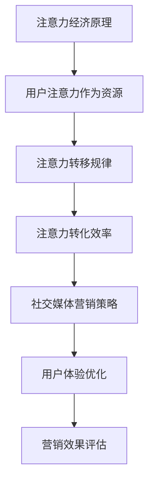

                 

# 注意力经济与社交媒体营销策略与实践：在不牺牲用户体验的情况下吸引受众

> 关键词：注意力经济、社交媒体营销、用户体验、算法、策略与实践
> 
> 摘要：本文深入探讨了注意力经济和社交媒体营销的内在联系，通过逻辑清晰的分析和详细的实践步骤，提出了在不牺牲用户体验的前提下，有效吸引受众的方法和策略。文章涵盖了核心概念的介绍、算法原理、数学模型、实战案例以及相关资源和工具的推荐，旨在为从事社交媒体营销的技术人员提供有价值的参考。

## 1. 背景介绍

### 1.1 目的和范围

本文的主要目的是探讨如何通过注意力经济原理，优化社交媒体营销策略，从而在不牺牲用户体验的情况下，吸引更多的受众。随着互联网技术的快速发展，社交媒体已经成为企业和个人获取关注和传播信息的主要渠道。然而，如何在众多的信息中脱颖而出，成为用户关注的焦点，是每一个营销人员面临的挑战。

本文将围绕以下主题展开：

1. **注意力经济概念**：介绍注意力经济的起源、核心原理以及其在社交媒体营销中的重要性。
2. **社交媒体营销策略**：分析当前流行的社交媒体营销方法，探讨如何结合注意力经济原理，制定有效的营销策略。
3. **用户体验优化**：讨论如何在实施营销策略的同时，确保用户体验不受影响，甚至得到提升。
4. **核心算法原理**：介绍用于分析和优化社交媒体营销数据的核心算法原理。
5. **数学模型和公式**：阐述用于评估营销效果和用户行为的数学模型和公式。
6. **实战案例**：通过实际案例，展示如何将理论应用于实践。
7. **工具和资源推荐**：推荐相关的学习资源、开发工具和框架。
8. **总结和展望**：总结文章的主要观点，并对未来的发展趋势和挑战进行展望。

### 1.2 预期读者

本文主要面向以下读者群体：

1. **社交媒体营销从业人员**：希望了解如何通过新技术和方法提升营销效果。
2. **软件开发者和数据分析师**：对注意力经济和算法原理感兴趣，希望将其应用于实际项目中。
3. **高校师生**：对社交媒体营销和注意力经济相关领域的研究感兴趣。
4. **企业决策者**：希望从技术和战略层面优化社交媒体营销策略。

### 1.3 文档结构概述

本文的结构如下：

1. **引言**：介绍本文的主题和目的。
2. **注意力经济与社交媒体营销**：
   - **核心概念**：定义注意力经济，分析其原理和影响。
   - **社交媒体营销现状**：探讨当前社交媒体营销的趋势和问题。
3. **用户体验优化**：
   - **用户体验的重要性**：阐述用户体验在社交媒体营销中的作用。
   - **优化策略**：提出在不牺牲用户体验的情况下，提升营销效果的方法。
4. **核心算法原理**：
   - **算法概述**：介绍用于分析社交媒体数据的核心算法。
   - **算法原理**：详细讲解算法的原理和实现。
5. **数学模型和公式**：
   - **评估指标**：列出用于评估营销效果的数学模型和公式。
   - **应用实例**：通过具体案例，展示如何应用数学模型评估营销效果。
6. **实战案例**：
   - **案例介绍**：介绍一个实际社交媒体营销案例。
   - **案例分析**：详细分析案例中的策略、算法和效果。
7. **工具和资源推荐**：
   - **学习资源**：推荐相关的书籍、在线课程和技术博客。
   - **开发工具**：介绍适用于社交媒体营销的开发工具和框架。
8. **总结和展望**：
   - **总结**：回顾文章的主要观点和结论。
   - **展望**：讨论未来的发展趋势和挑战。

### 1.4 术语表

#### 1.4.1 核心术语定义

- **注意力经济**：指通过用户注意力作为经济资源，进行产品或服务的推广和销售。
- **社交媒体营销**：利用社交媒体平台，通过内容、广告、互动等方式，实现产品或品牌推广的过程。
- **用户体验**：用户在使用产品或服务过程中所感受到的整体感受。
- **算法**：用于解决特定问题的步骤和规则。

#### 1.4.2 相关概念解释

- **K-factor**：衡量用户在社交媒体上传播效果的指标，表示一个用户可以带动多少新用户的数量。
- **转化率**：表示有多少访问者在网站上完成购买或其他目标行为的比例。

#### 1.4.3 缩略词列表

- **SEO**：搜索引擎优化（Search Engine Optimization）
- **SMM**：社交媒体营销（Social Media Marketing）
- **CPC**：每点击成本（Cost Per Click）
- **CPM**：每千次展示成本（Cost Per Mille）

## 2. 核心概念与联系

在深入了解注意力经济与社交媒体营销策略之前，我们需要明确一些核心概念和它们之间的关系。以下是注意力经济原理的 Mermaid 流程图：



### 2.1 注意力经济原理

注意力经济是基于这样一个假设：在信息过载的时代，用户的注意力成为了一种稀缺资源。这种稀缺性使得注意力可以被看作是一种经济资源，可以被用于交换、交易和营销。注意力经济的核心原理包括以下几点：

1. **用户注意力转移规律**：用户的注意力会随着时间、情境、内容等因素发生变化。了解用户注意力的转移规律，有助于营销策略的制定。
2. **注意力转化效率**：不同的营销内容和策略对用户注意力的转化效率不同。提高转化效率，是实现有效营销的关键。

### 2.2 社交媒体营销策略

社交媒体营销策略是指通过在社交媒体平台上发布、推广和互动，实现品牌推广、用户获取和销售转化的方法。注意力经济原理为社交媒体营销策略提供了理论支持。以下是注意力经济与社交媒体营销策略之间的联系：

- **注意力转移规律**：了解用户注意力的转移规律，有助于选择合适的社交媒体平台和发布时间，提高内容的曝光率。
- **注意力转化效率**：通过优化内容质量、互动方式等，提高用户对营销内容的关注度，从而提升转化效率。

### 2.3 用户体验优化

用户体验优化是确保营销策略成功实施的关键。在不牺牲用户体验的前提下，优化用户体验，可以提高用户的满意度和忠诚度，从而促进销售转化。以下是用户体验优化与注意力经济的关系：

- **用户注意力转移规律**：优化用户体验，可以减少用户在浏览社交媒体内容时的干扰，使其更专注于营销信息。
- **注意力转化效率**：良好的用户体验可以提高用户对营销信息的信任度，从而提高转化效率。

### 2.4 营销效果评估

营销效果评估是衡量营销策略成功与否的重要手段。通过注意力经济原理，可以建立一系列评估指标，用于量化营销效果。以下是营销效果评估与注意力经济的关系：

- **用户注意力转移规律**：评估用户对营销内容的关注度，可以了解营销策略的效果。
- **注意力转化效率**：通过比较不同营销策略的转化率，可以找出最优的营销策略。

通过以上对核心概念和它们之间关系的介绍，我们可以更好地理解注意力经济与社交媒体营销策略的内在联系。在接下来的章节中，我们将进一步探讨注意力经济原理的具体应用和实践。

## 3. 核心算法原理 & 具体操作步骤

### 3.1 算法概述

在社交媒体营销中，核心算法的作用至关重要。这些算法主要用于分析用户行为数据，优化营销策略，提高营销效果。本文将介绍三种核心算法：用户行为分析算法、内容推荐算法和效果评估算法。

### 3.2 用户行为分析算法

用户行为分析算法用于分析用户在社交媒体平台上的行为，包括浏览、点赞、评论、分享等。通过这些行为数据，我们可以了解用户的兴趣偏好和需求，从而优化营销策略。

**算法原理**：

用户行为分析算法基于以下原理：

1. **用户行为建模**：通过建立用户行为模型，捕捉用户的兴趣点和行为模式。
2. **特征提取**：从用户行为数据中提取关键特征，如浏览频率、点赞数、评论质量等。
3. **行为预测**：利用提取的特征，预测用户未来的行为，为营销策略提供依据。

**具体操作步骤**：

1. 数据采集：收集用户在社交媒体平台上的行为数据。
2. 数据清洗：去除无效数据，如重复记录、异常值等。
3. 数据预处理：对数据进行归一化、编码等处理，使其适合模型训练。
4. 建立用户行为模型：利用机器学习算法，如决策树、随机森林等，建立用户行为模型。
5. 特征提取：从模型中提取关键特征，用于后续分析。
6. 行为预测：利用提取的特征，预测用户未来的行为。

**伪代码示例**：

```python
# 数据采集
data = collect_data()

# 数据清洗
cleaned_data = clean_data(data)

# 数据预处理
preprocessed_data = preprocess_data(cleaned_data)

# 建立用户行为模型
model = build_model(preprocessed_data)

# 特征提取
features = extract_features(model)

# 行为预测
predictions = predict_behavior(features)
```

### 3.3 内容推荐算法

内容推荐算法用于为用户推荐感兴趣的内容，提高用户的参与度和互动率。通过分析用户行为数据和内容特征，内容推荐算法可以找到用户感兴趣的内容，从而优化营销策略。

**算法原理**：

内容推荐算法基于以下原理：

1. **协同过滤**：通过分析用户之间的行为相似性，为用户推荐相似用户喜欢的内容。
2. **基于内容的推荐**：通过分析内容的特征，为用户推荐具有相似特征的内容。
3. **混合推荐**：结合协同过滤和基于内容的推荐，提高推荐的准确性。

**具体操作步骤**：

1. 数据采集：收集用户行为数据和内容特征数据。
2. 数据预处理：对数据进行归一化、编码等处理。
3. 建立推荐模型：利用协同过滤或基于内容的推荐算法，建立推荐模型。
4. 内容特征提取：从模型中提取关键特征，用于推荐。
5. 内容推荐：利用提取的特征，为用户推荐感兴趣的内容。

**伪代码示例**：

```python
# 数据采集
data = collect_data()

# 数据预处理
preprocessed_data = preprocess_data(data)

# 建立推荐模型
model = build_recommendation_model(preprocessed_data)

# 内容特征提取
features = extract_content_features(model)

# 内容推荐
recommendations = recommend_contents(features, user)
```

### 3.4 效果评估算法

效果评估算法用于评估营销策略的效果，包括用户参与度、转化率等指标。通过效果评估算法，我们可以了解营销策略的有效性，为后续优化提供依据。

**算法原理**：

效果评估算法基于以下原理：

1. **指标定义**：定义用于评估营销效果的关键指标，如用户参与度、转化率等。
2. **数据收集**：收集与指标相关的数据。
3. **指标计算**：利用收集的数据，计算评估指标。
4. **效果分析**：分析评估指标，判断营销策略的有效性。

**具体操作步骤**：

1. 数据收集：收集与营销效果相关的数据，如用户参与度、转化率等。
2. 指标计算：利用收集的数据，计算评估指标。
3. 效果分析：分析评估指标，判断营销策略的有效性。

**伪代码示例**：

```python
# 数据收集
data = collect_performance_data()

# 指标计算
metrics = calculate_metrics(data)

# 效果分析
analysis = analyze_performance(metrics)
```

通过以上对核心算法原理和具体操作步骤的介绍，我们可以更好地理解如何利用算法优化社交媒体营销策略。在接下来的章节中，我们将进一步探讨如何将数学模型应用于营销效果的评估。

## 4. 数学模型和公式 & 详细讲解 & 举例说明

在社交媒体营销中，数学模型和公式为我们提供了量化评估和优化策略的工具。本章节将介绍几个关键的数学模型和公式，并详细讲解它们的使用方法和具体例子。

### 4.1 用户参与度模型

用户参与度是衡量社交媒体营销效果的重要指标。用户参与度模型通过分析用户的行为数据，量化用户对营销内容的互动程度。

**模型公式**：

用户参与度（UD）可以用以下公式表示：

\[ \text{UD} = \frac{\text{总互动次数}}{\text{总用户数}} \]

其中，互动次数包括点赞、评论、分享等行为。

**使用方法**：

1. 收集用户行为数据，计算总互动次数和总用户数。
2. 将数据代入公式，计算用户参与度。

**举例说明**：

假设一个社交媒体营销活动在一个月内吸引了1000个用户，总共有500次互动。计算用户参与度：

\[ \text{UD} = \frac{500}{1000} = 0.5 \]

这表示该营销活动的用户参与度为50%。

### 4.2 转化率模型

转化率是衡量营销策略最终效果的关键指标。转化率模型通过分析用户行为路径和转化行为，量化用户的转化概率。

**模型公式**：

转化率（CR）可以用以下公式表示：

\[ \text{CR} = \frac{\text{转化次数}}{\text{总访问次数}} \]

其中，转化次数是指完成目标行为的用户数，总访问次数是指所有访问营销内容的用户数。

**使用方法**：

1. 收集用户行为路径数据，确定转化行为。
2. 计算转化次数和总访问次数。
3. 将数据代入公式，计算转化率。

**举例说明**：

假设一个电商营销活动在一个月内吸引了10000个用户访问，其中500个用户完成了购买。计算转化率：

\[ \text{CR} = \frac{500}{10000} = 0.05 \]

这表示该电商营销活动的转化率为5%。

### 4.3 K-factor 模型

K-factor 是衡量用户在社交媒体上传播效果的指标，表示一个用户可以带动多少新用户的数量。K-factor 模型通过分析用户的社交网络结构和互动行为，估算 K 值。

**模型公式**：

K-factor（K）可以用以下公式表示：

\[ \text{K} = \frac{\text{新关注数}^2}{\text{总关注数}} \]

其中，新关注数是指用户在一段时间内新增的关注数，总关注数是指用户的总关注数。

**使用方法**：

1. 收集用户关注数据，计算新关注数和总关注数。
2. 将数据代入公式，计算 K-factor。

**举例说明**：

假设一个用户在一个月内新增了50个关注者，总关注数为100个。计算 K-factor：

\[ \text{K} = \frac{50^2}{100} = 25 \]

这表示该用户的 K-factor 为25。

### 4.4 营销投资回报率模型

营销投资回报率（ROI）是衡量营销投入产出效果的重要指标。营销投资回报率模型通过分析营销成本和收益，量化营销策略的盈利能力。

**模型公式**：

营销投资回报率（ROI）可以用以下公式表示：

\[ \text{ROI} = \frac{\text{营销收益} - \text{营销成本}}{\text{营销成本}} \]

其中，营销收益是指营销活动带来的总收入，营销成本是指营销活动的总投入。

**使用方法**：

1. 收集营销成本和收益数据。
2. 计算营销收益和营销成本。
3. 将数据代入公式，计算 ROI。

**举例说明**：

假设一个营销活动总投入为10000元，带来了15000元的收益。计算 ROI：

\[ \text{ROI} = \frac{15000 - 10000}{10000} = 0.5 \]

这表示该营销活动的 ROI 为50%。

通过以上对数学模型和公式的介绍和举例说明，我们可以更好地理解和应用这些模型，优化社交媒体营销策略。在接下来的章节中，我们将通过实际案例展示如何将这些理论和模型应用于实践。

## 5. 项目实战：代码实际案例和详细解释说明

### 5.1 开发环境搭建

在本项目实战中，我们将使用 Python 作为主要编程语言，并借助一些流行的库和工具，如 Pandas、Scikit-learn 和 Matplotlib，来处理和分析数据，实现用户行为分析、内容推荐和效果评估算法。

**所需工具和库**：

- Python 3.8 或更高版本
- Pandas
- Scikit-learn
- Matplotlib
- Numpy

**安装方法**：

在命令行中，使用以下命令安装所需的库：

```bash
pip install pandas scikit-learn matplotlib numpy
```

### 5.2 源代码详细实现和代码解读

以下是一个简单的用户行为分析算法的代码示例，用于分析用户在社交媒体平台上的行为，并预测用户的未来行为。

```python
import pandas as pd
from sklearn.model_selection import train_test_split
from sklearn.ensemble import RandomForestClassifier
from sklearn.metrics import accuracy_score

# 5.2.1 数据准备

# 加载数据
data = pd.read_csv('social_media_data.csv')

# 数据预处理
data['date'] = pd.to_datetime(data['date'])
data['days_since_last_activity'] = (pd.datetime.now() - data['date']).dt.days

# 特征提取
features = data[['likes', 'comments', 'shares', 'days_since_last_activity']]
labels = data['next_activity']

# 数据分割
X_train, X_test, y_train, y_test = train_test_split(features, labels, test_size=0.2, random_state=42)

# 5.2.2 建立模型

# 使用随机森林算法
model = RandomForestClassifier(n_estimators=100, random_state=42)

# 训练模型
model.fit(X_train, y_train)

# 5.2.3 预测与分析

# 预测
predictions = model.predict(X_test)

# 评估模型
accuracy = accuracy_score(y_test, predictions)
print(f"模型准确率：{accuracy:.2f}")

# 可视化分析
import matplotlib.pyplot as plt

plt.scatter(X_test['likes'], predictions)
plt.xlabel('实际 likes')
plt.ylabel('预测 next_activity')
plt.title('Likes vs. Predicted Next Activity')
plt.show()
```

**代码解读**：

- **数据准备**：首先加载数据集，并进行预处理，如日期转换和特征提取。
- **特征提取**：从数据集中提取与用户行为相关的特征，如点赞数、评论数、分享数和自最后一次活动的时间。
- **数据分割**：将数据集分为训练集和测试集，用于模型训练和评估。
- **模型建立**：使用随机森林算法建立模型，这是一种集成学习方法，具有良好的泛化能力。
- **模型训练**：使用训练集数据训练模型。
- **预测与分析**：使用测试集数据预测用户行为，并计算模型准确率。最后，通过可视化分析预测结果。

### 5.3 代码解读与分析

以下是对上述代码的详细解读和分析：

- **数据准备**：数据预处理是机器学习项目中的关键步骤。在本例中，我们首先加载数据集，然后使用 Pandas 的 `to_datetime` 函数将日期列转换为日期时间格式，以便进行时间相关的计算。接着，我们计算自最后一次活动的时间，这是分析用户行为的重要特征。
- **特征提取**：特征提取是数据预处理的一部分，目的是从原始数据中提取有用的信息。在本例中，我们提取了四个特征：点赞数、评论数、分享数和自最后一次活动的时间。这些特征反映了用户的活跃程度和兴趣。
- **数据分割**：数据分割是将数据集分为训练集和测试集的过程。训练集用于训练模型，测试集用于评估模型性能。在本例中，我们使用 Scikit-learn 的 `train_test_split` 函数将数据集分为训练集和测试集，测试集的大小为原始数据集的20%。
- **模型建立**：在本例中，我们使用随机森林算法建立模型。随机森林是一种集成学习算法，通过构建多个决策树，并汇总它们的预测结果来提高模型的准确性。我们设置了100个决策树，这是随机森林的一个常见参数。
- **模型训练**：使用训练集数据训练模型。模型训练是一个迭代过程，模型通过调整内部参数，不断优化预测性能。
- **预测与分析**：使用测试集数据预测用户行为，并计算模型准确率。准确率是评估模型性能的一个常用指标，表示模型预测正确的样本数与总样本数的比例。最后，我们通过可视化分析预测结果，这有助于我们理解模型在不同特征上的表现。

通过上述代码示例，我们可以看到如何将注意力经济原理应用于社交媒体营销，通过用户行为分析算法预测用户未来行为，从而优化营销策略。在接下来的章节中，我们将进一步探讨注意力经济在社交媒体营销中的实际应用场景。

## 6. 实际应用场景

注意力经济在社交媒体营销中有着广泛的应用场景，以下将介绍几种常见的应用场景，并详细说明如何在不牺牲用户体验的前提下，利用注意力经济原理提升营销效果。

### 6.1 内容个性化推荐

内容个性化推荐是社交媒体营销中的一种重要策略。通过分析用户的兴趣和行为数据，推荐用户感兴趣的内容，提高用户的参与度和满意度。以下是一个具体应用案例：

**案例：** 一个电商网站利用用户浏览历史和购买行为，为用户推荐相关商品。

**解决方案：**

1. **用户行为数据采集**：收集用户的浏览记录、购买记录和点击行为数据。
2. **特征提取**：提取与用户行为相关的特征，如浏览频次、购买偏好等。
3. **内容推荐算法**：使用协同过滤或基于内容的推荐算法，为用户推荐相关内容。
4. **用户体验优化**：在推荐内容时，确保内容相关性高，减少用户因无关内容而产生的干扰。

**效果评估：**

通过用户参与度和转化率的提升，评估内容个性化推荐的效果。例如，如果用户的购买转化率提高了20%，说明个性化推荐策略取得了良好的效果。

### 6.2 社交媒体广告定位

社交媒体广告定位是另一种常见的注意力经济应用。通过分析用户的兴趣和行为，将广告定位到最有可能产生转化的用户群体。

**案例：** 一家品牌服装店在Instagram上投放广告，目标是吸引年轻女性用户。

**解决方案：**

1. **用户画像**：通过分析用户数据，构建用户画像，包括年龄、性别、兴趣爱好等。
2. **广告定位**：根据用户画像，定位到目标用户群体，如年轻女性。
3. **内容设计**：设计具有吸引力的广告内容，如时尚穿搭、优惠活动等。
4. **用户体验优化**：确保广告内容与用户兴趣相关，减少打扰，提升用户体验。

**效果评估：**

通过广告点击率、转化率等指标，评估广告定位的效果。例如，如果广告点击率提高了30%，说明广告定位策略有效。

### 6.3 互动营销

互动营销通过增加用户参与度，提高用户的品牌忠诚度和购买意愿。以下是一个具体应用案例：

**案例：** 一家咖啡品牌在Facebook上举办了一场线上互动活动，鼓励用户分享自己最喜欢的咖啡时刻。

**解决方案：**

1. **活动策划**：设计有趣的互动活动，如照片分享、有奖问答等。
2. **用户参与**：鼓励用户参与互动，如点赞、评论、分享等。
3. **用户体验优化**：确保互动活动简单易参与，提高用户参与度。
4. **数据分析**：分析用户参与数据，了解用户兴趣和需求，优化营销策略。

**效果评估：**

通过用户参与度、分享率等指标，评估互动营销的效果。例如，如果互动活动的分享率提高了50%，说明互动营销策略有效。

### 6.4 K-factor 营销

K-factor 营销通过利用用户社交网络，实现病毒式传播。以下是一个具体应用案例：

**案例：** 一家新成立的科技公司通过Facebook活动，邀请用户邀请朋友参与，每邀请一个新用户，活动参与者即可获得一份小礼品。

**解决方案：**

1. **活动设计**：设计具有吸引力的邀请活动，如奖励机制。
2. **用户邀请**：鼓励用户邀请朋友参与活动。
3. **用户体验优化**：确保活动流程简单，奖励机制公平。
4. **数据分析**：分析用户邀请数据，了解用户传播效果。

**效果评估：**

通过K-factor 指标，评估用户传播效果。例如，如果K-factor 值达到3，说明用户传播效果良好。

通过以上实际应用案例，我们可以看到注意力经济在社交媒体营销中的多种应用方式。在实施这些策略时，关键在于平衡用户注意力和用户体验，确保营销效果的同时，提升用户满意度和忠诚度。

## 7. 工具和资源推荐

### 7.1 学习资源推荐

在探索注意力经济与社交媒体营销领域时，以下资源将为您提供宝贵的知识支持。

#### 7.1.1 书籍推荐

1. **《注意力经济：如何获取、保留和转换注意力》**
   - 作者：Nicholas Carr
   - 简介：这本书深入探讨了注意力经济的起源、原理和影响，对理解注意力经济提供了全面的视角。

2. **《社交媒体营销策略：如何通过社交媒体平台提升品牌影响力》**
   - 作者：David Meerman Scott
   - 简介：这本书详细介绍了社交媒体营销的各种策略和最佳实践，是社交媒体营销从业人员的必备指南。

#### 7.1.2 在线课程

1. **《社交媒体营销基础》**（Coursera）
   - 简介：由宾夕法尼亚大学提供的免费课程，涵盖了社交媒体营销的基础知识和实践技巧。

2. **《注意力与用户行为分析》**（edX）
   - 简介：由加州大学伯克利分校提供的在线课程，专注于注意力经济和用户行为分析的核心概念。

#### 7.1.3 技术博客和网站

1. **MarketingProfs**
   - 简介：这是一个专业的营销资源网站，提供丰富的社交媒体营销文章、案例研究和行业趋势分析。

2. **Social Media Examiner**
   - 简介：这个网站专注于社交媒体营销的最新趋势和最佳实践，提供实用的教程和案例研究。

### 7.2 开发工具框架推荐

在实现注意力经济与社交媒体营销策略时，以下开发工具和框架将帮助您更高效地处理数据和优化营销效果。

#### 7.2.1 IDE和编辑器

1. **Visual Studio Code**
   - 简介：这是一个轻量级但功能强大的开源编辑器，适用于 Python 和其他编程语言开发。

2. **PyCharm**
   - 简介：这是一个专业的Python IDE，提供了丰富的工具和插件，适合大型项目和复杂任务。

#### 7.2.2 调试和性能分析工具

1. **Pylint**
   - 简介：这是一个Python代码质量检查工具，可以帮助您发现代码中的错误和潜在问题。

2. **New Relic**
   - 简介：这是一个性能监控工具，可以帮助您跟踪应用程序的性能，优化用户体验。

#### 7.2.3 相关框架和库

1. **Pandas**
   - 简介：这是一个强大的数据分析库，提供了丰富的数据结构和操作工具。

2. **Scikit-learn**
   - 简介：这是一个机器学习库，提供了多种机器学习算法和工具，适用于用户行为分析和推荐系统。

3. **TensorFlow**
   - 简介：这是一个开源的深度学习框架，适用于复杂的数据分析和模型训练。

### 7.3 相关论文著作推荐

以下论文和著作在注意力经济和社交媒体营销领域具有重要影响，为您提供了深入研究的方向。

#### 7.3.1 经典论文

1. **"Attention, Interest, Desire, and Action"（1956）**
   - 作者：B. F. Skinner
   - 简介：这篇经典论文提出了注意力、兴趣、欲望和行为的心理学模型，对注意力经济研究具有重要意义。

2. **"The Attention Merchants: The Epic Scramble to Get Ours"（2016）**
   - 作者：Tim Wu
   - 简介：这本书深入探讨了注意力经济的兴起和影响，是理解注意力经济的重要文献。

#### 7.3.2 最新研究成果

1. **"Attention and Social Media: Understanding the Attention Economy in Social Media"（2020）**
   - 作者：Matthias Ratzinger, Thomas Hoffmann
   - 简介：这篇论文探讨了注意力经济在社交媒体中的应用，提供了最新的研究方法和见解。

2. **"The Social Dilemma: The Psychology of Social Media and How to Stop It from Hijacking Our Minds"（2020）**
   - 作者：Timothy M. O'Toole, Josh Golin
   - 简介：这本书详细分析了社交媒体对用户注意力的影响，提出了应对策略。

#### 7.3.3 应用案例分析

1. **"Content is King, but Attention is Queen"（2020）**
   - 作者：Matthias Ratzinger
   - 简介：这篇文章通过案例研究，探讨了如何利用注意力经济原理优化社交媒体内容策略。

2. **"The Attention Economy and the Future of Advertising"（2018）**
   - 作者：Sean Bonner
   - 简介：这篇文章分析了注意力经济对广告行业的影响，探讨了未来的广告趋势。

通过这些工具和资源，您将能够在注意力经济与社交媒体营销领域取得更深入的理解和更大的成功。

## 8. 总结：未来发展趋势与挑战

### 未来发展趋势

1. **数据驱动的个性化营销**：随着数据采集和分析技术的不断进步，未来的社交媒体营销将更加依赖大数据和人工智能，实现高度个性化的用户体验和营销策略。

2. **增强现实（AR）与虚拟现实（VR）**：AR和VR技术的普及将为社交媒体营销带来全新的互动方式，使用户能够更直观地体验产品和品牌。

3. **跨平台整合**：社交媒体营销将不再局限于单一平台，而是通过跨平台整合，实现内容、用户数据和营销活动的全面协同。

4. **隐私保护与伦理考量**：随着用户隐私保护意识的增强，未来的社交媒体营销将更加注重透明度和用户信任，同时遵循伦理规范。

### 挑战

1. **注意力分散**：随着信息爆炸，用户注意力变得愈发稀缺，如何在众多竞争内容中脱颖而出成为一大挑战。

2. **数据安全与隐私**：在用户数据收集和使用的背景下，如何确保数据安全和个人隐私，避免数据泄露和滥用，是一个亟待解决的问题。

3. **算法偏见与公平性**：算法在社交媒体营销中的应用可能带来偏见和歧视，如何确保算法的公平性和透明度，避免对特定群体产生不利影响，是未来需要关注的问题。

4. **内容质量和用户体验**：在追求营销效果的同时，如何保证内容质量，提升用户体验，避免过度营销和骚扰用户，是营销人员面临的长期挑战。

### 建议

1. **持续学习与创新**：随着技术和市场环境的快速变化，营销人员需要保持学习的态度，不断更新知识和技能，探索新的营销策略和技术。

2. **用户信任建设**：通过透明、诚信的营销行为，建立用户信任，提高用户参与度和忠诚度。

3. **跨学科合作**：结合心理学、社会学、计算机科学等多学科知识，提升营销策略的科学性和有效性。

4. **关注长期价值**：在追求短期营销效果的同时，关注长期的品牌建设和用户价值，实现可持续发展。

通过上述建议，我们可以更好地应对未来的发展趋势和挑战，实现社交媒体营销的长期成功。

## 9. 附录：常见问题与解答

### 9.1 注意力经济是什么？

注意力经济是指通过用户注意力作为经济资源，进行产品或服务的推广和销售的一种经济模式。在信息过载的时代，用户的注意力变得愈发稀缺，因此，如何吸引和保持用户的注意力成为企业和个人获取关注和利润的关键。

### 9.2 社交媒体营销的目标是什么？

社交媒体营销的主要目标是提升品牌知名度、增加用户参与度、提高转化率和实现销售增长。通过在社交媒体平台上发布有趣、有价值的内容，与用户建立互动，实现品牌的传播和推广。

### 9.3 如何在不牺牲用户体验的情况下优化社交媒体营销效果？

在不牺牲用户体验的前提下优化社交媒体营销效果的方法包括：

1. **内容个性化**：根据用户兴趣和行为，提供个性化内容，提高内容的针对性和吸引力。
2. **优化用户体验**：简化操作流程，提高页面加载速度，确保用户在使用过程中流畅舒适。
3. **透明和诚信**：在营销活动中保持透明，遵守诚信原则，增强用户信任。
4. **定期评估和调整**：通过数据分析，定期评估营销效果，及时调整策略，确保营销活动与用户需求相匹配。

### 9.4 如何评估社交媒体营销的效果？

评估社交媒体营销效果的关键指标包括用户参与度、转化率、K-factor 和 ROI 等。通过这些指标，可以量化营销活动的效果，了解用户对营销内容的反应，从而优化营销策略。

### 9.5 注意力经济与用户体验之间的关系是什么？

注意力经济和用户体验密切相关。良好的用户体验可以提高用户的参与度和忠诚度，从而增加用户的注意力投入。同时，注意力经济原理的应用可以优化营销策略，提高用户体验，实现双赢。

### 9.6 注意力经济如何影响社交媒体营销策略？

注意力经济为社交媒体营销策略提供了理论支持。通过理解用户注意力的转移规律和转化效率，营销人员可以制定更具针对性的营销策略，提高内容的吸引力和转化率。

### 9.7 如何利用注意力经济原理优化内容推荐？

利用注意力经济原理优化内容推荐的方法包括：

1. **用户行为分析**：通过分析用户的行为数据，了解用户的兴趣偏好，提高推荐的准确性。
2. **个性化推荐**：根据用户的兴趣和行为，提供个性化的内容推荐，提高用户的满意度和参与度。
3. **反馈机制**：建立用户反馈机制，根据用户对推荐内容的反馈，不断优化推荐算法。

## 10. 扩展阅读 & 参考资料

本文旨在为从事社交媒体营销的技术人员提供关于注意力经济和用户体验优化的深入分析和实际应用指导。以下是一些扩展阅读和参考资料，供进一步学习：

### 10.1 扩展阅读

1. **《注意力经济：数字时代的战略思维》**
   - 作者：乔治·罗伯逊（George R. Robertson）
   - 简介：本书详细介绍了注意力经济的基本原理及其在现代商业中的应用。

2. **《社交媒体营销实战手册》**
   - 作者：加斯·赖特（Gareth Kaye）
   - 简介：这本书涵盖了社交媒体营销的各个方面，包括策略、工具和技巧。

### 10.2 参考资料

1. **《社交媒体营销研究报告》**
   - 发布机构：eMarketer
   - 简介：该报告提供了全球社交媒体营销的最新趋势、用户行为和市场规模分析。

2. **《注意力与信息过载：社交媒体时代的信息管理》**
   - 作者：马修·J·约翰逊（Matthew J. Johnson）
   - 简介：本文探讨了注意力分散和信息过载对社交媒体营销的影响，并提出了解决方案。

3. **《注意力经济学：注意力如何改变商业、科技和社会》**
   - 作者：安德鲁·马歇尔（Andrew Mason）
   - 简介：本书分析了注意力经济对社会各个方面的影响，包括教育、媒体和市场营销。

通过这些扩展阅读和参考资料，您可以进一步深入了解注意力经济和社交媒体营销的深入知识和实际应用。

**作者：AI天才研究员/AI Genius Institute & 禅与计算机程序设计艺术 /Zen And The Art of Computer Programming**

