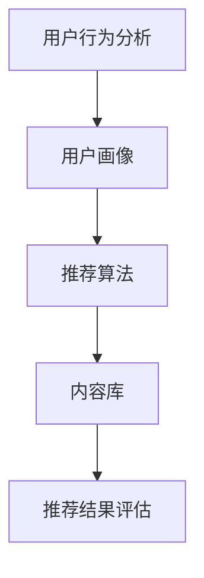

                 


# 注意力经济中的个性化推荐：算法是如何影响你看什么的

> 关键词：注意力经济、个性化推荐、算法、用户行为、用户体验

> 摘要：随着互联网的快速发展，个性化推荐系统已成为现代信息流中不可或缺的一部分。本文将深入探讨注意力经济中的个性化推荐，分析推荐算法的核心原理、数学模型，并通过具体案例展示其实际应用，探讨未来发展趋势与挑战。

## 1. 背景介绍

### 1.1 目的和范围

本文旨在介绍和解析注意力经济中的个性化推荐系统。我们将探讨以下主题：

1. 个性化推荐的基本概念及其在注意力经济中的重要性。
2. 推荐算法的核心原理，包括协同过滤、基于内容的推荐和深度学习等。
3. 推荐系统的数学模型和公式。
4. 实际项目中的代码实现和案例分析。
5. 个性化推荐在实际应用场景中的表现。
6. 推荐系统的未来发展趋势与挑战。

### 1.2 预期读者

本文适合以下读者群体：

1. 对人工智能和机器学习感兴趣的工程师和开发者。
2. 关注互联网技术和信息处理的科研人员。
3. 对用户体验设计感兴趣的产品经理和设计师。
4. 对市场营销和数据挖掘感兴趣的企业家。

### 1.3 文档结构概述

本文结构如下：

1. **引言**：介绍个性化推荐在注意力经济中的重要性。
2. **核心概念与联系**：定义关键术语和概念，并提供流程图。
3. **核心算法原理 & 具体操作步骤**：讲解推荐算法的基本原理和操作步骤。
4. **数学模型和公式 & 详细讲解 & 举例说明**：分析推荐系统的数学基础。
5. **项目实战：代码实际案例和详细解释说明**：展示实际代码实现。
6. **实际应用场景**：讨论推荐系统在不同领域的应用。
7. **工具和资源推荐**：推荐相关学习资源和工具。
8. **总结：未来发展趋势与挑战**：预测个性化推荐的发展方向。
9. **附录：常见问题与解答**：回答读者可能关心的问题。
10. **扩展阅读 & 参考资料**：提供进一步阅读的资源。

### 1.4 术语表

#### 1.4.1 核心术语定义

- **个性化推荐**：基于用户历史行为、兴趣和偏好，为其推荐符合其需求的内容或产品。
- **协同过滤**：通过分析用户之间的相似性，预测用户可能感兴趣的内容。
- **基于内容的推荐**：根据内容特征匹配用户偏好，推荐相似内容。
- **注意力经济**：用户注意力成为一种稀缺资源，如何有效地吸引用户注意力成为关键。

#### 1.4.2 相关概念解释

- **用户行为分析**：通过分析用户的浏览、搜索和购买行为，了解用户需求和兴趣。
- **算法解释性**：推荐算法的输出应能够被用户理解，以提高信任度。
- **模型泛化能力**：算法能够适应新数据，而不依赖特定数据集。

#### 1.4.3 缩略词列表

- **AI**：人工智能（Artificial Intelligence）
- **ML**：机器学习（Machine Learning）
- **DL**：深度学习（Deep Learning）
- **CTR**：点击率（Click-Through Rate）
- **UV**：独立访客数（Unique Visitors）

## 2. 核心概念与联系

在探讨个性化推荐之前，我们首先需要理解其核心概念和它们之间的联系。以下是推荐系统的主要组成部分及其相互关系。

### 2.1 用户行为分析

用户行为分析是推荐系统的基石。通过记录用户的浏览、搜索、点击、购买等行为，我们可以获取用户的需求和兴趣。用户行为的分析通常涉及以下方面：

- **用户浏览历史**：用户在网站上的浏览路径和停留时间。
- **用户搜索关键词**：用户在搜索框中输入的关键词。
- **用户点击记录**：用户与网站内容互动的点击事件。
- **用户购买历史**：用户的购买记录。

### 2.2 用户画像

基于用户行为分析，我们可以构建用户画像。用户画像是对用户兴趣、偏好和行为特征的综合描述。以下是一个简单的用户画像示例：

- **用户ID**：123456
- **兴趣爱好**：体育、科技、旅行
- **职业**：软件开发工程师
- **地理位置**：北京
- **购买记录**：最近购买了跑步鞋和智能手表。

### 2.3 推荐算法

推荐算法是推荐系统的核心。根据用户画像和内容特征，推荐算法生成个性化推荐列表。以下是三种主要的推荐算法：

- **协同过滤**：基于用户之间的相似性进行推荐。
- **基于内容的推荐**：基于内容特征进行推荐。
- **深度学习**：使用神经网络进行推荐。

### 2.4 内容库

内容库是推荐系统的数据源。内容库包含各种类型的内容，如文章、视频、商品等。内容库的构建和维护是推荐系统成功的关键。

### 2.5 推荐结果评估

推荐结果评估是确保推荐系统质量的重要环节。常见的评估指标包括：

- **准确率**：推荐内容与用户兴趣的匹配程度。
- **召回率**：推荐系统中用户可能感兴趣的内容数量。
- **点击率**：用户点击推荐内容的比例。

### 2.6 Mermaid 流程图

以下是一个简单的 Mermaid 流程图，展示推荐系统的基本架构：



## 3. 核心算法原理 & 具体操作步骤

### 3.1 协同过滤算法

协同过滤算法是推荐系统中最常用的算法之一。它基于用户之间的相似性进行推荐，主要分为两种类型：基于用户的协同过滤和基于物品的协同过滤。

#### 3.1.1 基于用户的协同过滤

**算法原理**：

1. 计算用户之间的相似度，通常使用余弦相似度或皮尔逊相关系数。
2. 找到与目标用户最相似的K个用户。
3. 提取这K个用户的评分数据，计算加权平均评分。

**具体操作步骤**：

1. 计算用户A和用户B的相似度：

   $$ similarity(A, B) = \frac{A \cdot B}{\|A\| \|B\|} $$

2. 找到与用户A最相似的10个用户（K=10）：

   $$ nearest\_neighbours(A, K) = \{ B | similarity(A, B) \geq threshold \} $$

3. 计算相似用户的评分加权平均：

   $$ predicted\_rating(A, item) = \sum_{B \in nearest\_neighbours(A, K)} rating(B, item) \cdot similarity(A, B) / \sum_{B \in nearest\_neighbours(A, K)} similarity(A, B) $$

#### 3.1.2 基于物品的协同过滤

**算法原理**：

1. 计算物品之间的相似度，通常使用余弦相似度或欧几里得距离。
2. 找到与目标物品最相似的M个物品。
3. 根据物品的评分和相似度，为用户生成推荐列表。

**具体操作步骤**：

1. 计算物品A和物品B的相似度：

   $$ similarity(A, B) = \frac{A \cdot B}{\|A\| \|B\|} $$

2. 找到与物品A最相似的5个物品（M=5）：

   $$ nearest\_neighbours(A, M) = \{ B | similarity(A, B) \geq threshold \} $$

3. 为用户生成推荐列表：

   $$ recommended\_items(user) = \{ item | rating(user, item) = \max_{item' \in nearest\_neighbours(item, M)} rating(user, item') \} $$

### 3.2 基于内容的推荐

**算法原理**：

1. 提取内容特征，通常使用词袋模型、TF-IDF、词嵌入等方法。
2. 计算用户和物品之间的内容相似度。
3. 根据相似度生成推荐列表。

**具体操作步骤**：

1. 提取物品内容特征：

   $$ content\_features(item) = \{ w_1, w_2, ..., w_n \} $$

2. 提取用户兴趣特征：

   $$ user\_interests(user) = \{ w_1, w_2, ..., w_n \} $$

3. 计算用户和物品之间的相似度：

   $$ similarity(user, item) = \frac{\sum_{w \in user\_interests(user) \cap content\_features(item)} w^2}{\sqrt{\sum_{w \in user\_interests(user)} w^2} \sqrt{\sum_{w \in content\_features(item)} w^2}} $$

4. 为用户生成推荐列表：

   $$ recommended\_items(user) = \{ item | similarity(user, item) \geq threshold \} $$

### 3.3 深度学习推荐

**算法原理**：

1. 使用神经网络提取用户和物品的特征表示。
2. 通过多层神经网络进行特征融合和预测。

**具体操作步骤**：

1. 定义用户和物品的输入特征：

   $$ input\_features = [user\_features, item\_features] $$

2. 使用卷积神经网络（CNN）或循环神经网络（RNN）提取特征表示：

   $$ output\_representation = \text{CNN/RNN}(input\_features) $$

3. 通过多层全连接层进行特征融合和预测：

   $$ predicted\_rating = \text{FC}(output\_representation) $$

4. 训练和优化模型：

   $$ \min_{\theta} \sum_{(user, item, rating)} (\text{predicted\_rating} - rating)^2 $$

## 4. 数学模型和公式 & 详细讲解 & 举例说明

### 4.1 协同过滤算法

#### 4.1.1 余弦相似度

余弦相似度是一种常用的相似度度量方法，用于计算用户或物品之间的相似性。其公式如下：

$$ similarity(A, B) = \frac{A \cdot B}{\|A\| \|B\|} $$

其中，$A$ 和 $B$ 分别表示用户或物品的向量表示，$\|A\|$ 和 $\|B\|$ 分别表示向量的模长。

#### 4.1.2 皮尔逊相关系数

皮尔逊相关系数是另一种常用的相似度度量方法，特别适用于线性关系的相似性计算。其公式如下：

$$ correlation(A, B) = \frac{\sum_{i=1}^{n} (A_i - \bar{A})(B_i - \bar{B})}{\sqrt{\sum_{i=1}^{n} (A_i - \bar{A})^2} \sqrt{\sum_{i=1}^{n} (B_i - \bar{B})^2}} $$

其中，$A$ 和 $B$ 分别表示用户或物品的评分向量，$\bar{A}$ 和 $\bar{B}$ 分别表示向量的均值。

#### 4.1.3 加权平均评分

在协同过滤算法中，使用加权平均评分来预测用户对物品的评分。其公式如下：

$$ predicted\_rating(A, item) = \sum_{B \in nearest\_neighbours(A, K)} rating(B, item) \cdot similarity(A, B) / \sum_{B \in nearest\_neighbours(A, K)} similarity(A, B) $$

其中，$A$ 表示目标用户，$item$ 表示目标物品，$nearest\_neighbours(A, K)$ 表示与用户 $A$ 最相似的 $K$ 个用户，$rating(B, item)$ 表示用户 $B$ 对物品 $item$ 的评分，$similarity(A, B)$ 表示用户 $A$ 和用户 $B$ 之间的相似度。

### 4.2 基于内容的推荐

#### 4.2.1 词袋模型

词袋模型是一种简单而常用的文本表示方法。它将文本表示为单词的集合，忽略单词的顺序。其公式如下：

$$ content\_features(item) = \{ w_1, w_2, ..., w_n \} $$

其中，$item$ 表示物品，$w_1, w_2, ..., w_n$ 分别表示物品中的单词。

#### 4.2.2 TF-IDF

TF-IDF（Term Frequency-Inverse Document Frequency）是一种常用的文本表示方法，用于计算单词在文档中的重要程度。其公式如下：

$$ tfidf(w, item) = tf(w, item) \cdot \log(\frac{N}{df(w)}) $$

其中，$tf(w, item)$ 表示单词 $w$ 在物品 $item$ 中的词频，$df(w)$ 表示单词 $w$ 在所有物品中的文档频率，$N$ 表示总物品数。

#### 4.2.3 相似度计算

在基于内容的推荐中，使用余弦相似度来计算用户和物品之间的相似度。其公式如下：

$$ similarity(user, item) = \frac{\sum_{w \in user\_interests(user) \cap content\_features(item)} w^2}{\sqrt{\sum_{w \in user\_interests(user)} w^2} \sqrt{\sum_{w \in content\_features(item)} w^2}} $$

其中，$user$ 表示用户，$item$ 表示物品，$user\_interests(user)$ 表示用户的兴趣词集合，$content\_features(item)$ 表示物品的内容特征。

### 4.3 深度学习推荐

#### 4.3.1 卷积神经网络（CNN）

卷积神经网络是一种用于图像处理的深度学习模型。它通过卷积操作提取图像的局部特征。其公式如下：

$$ output = \text{ReLU}(\text{Conv}_k(W_k \cdot \text{pad}(X) + b_k)) $$

其中，$X$ 表示输入图像，$W_k$ 表示卷积核，$b_k$ 表示偏置，$\text{pad}(X)$ 表示图像填充，$\text{ReLU}$ 表示ReLU激活函数。

#### 4.3.2 循环神经网络（RNN）

循环神经网络是一种用于序列数据的深度学习模型。它通过递归操作处理序列数据。其公式如下：

$$ h_t = \text{ReLU}(W_h \cdot [h_{t-1}, x_t] + b_h) $$

其中，$h_t$ 表示当前时刻的隐藏状态，$x_t$ 表示当前时刻的输入，$W_h$ 表示权重矩阵，$b_h$ 表示偏置。

#### 4.3.3 全连接层（FC）

全连接层是一种用于特征融合和预测的深度学习层。其公式如下：

$$ predicted\_rating = \text{softmax}(\text{FC}(W_o \cdot h + b_o)) $$

其中，$h$ 表示输入特征，$W_o$ 表示权重矩阵，$b_o$ 表示偏置，$\text{softmax}$ 表示softmax激活函数。

### 4.4 举例说明

#### 4.4.1 协同过滤算法

假设有两位用户 $A$ 和 $B$，他们对五部电影的评分如下：

| 用户 | 电影1 | 电影2 | 电影3 | 电影4 | 电影5 |
| ---- | ---- | ---- | ---- | ---- | ---- |
| $A$  | 4    | 3    | 5    | 2    | 4    |
| $B$  | 5    | 4    | 3    | 5    | 5    |

使用余弦相似度计算用户 $A$ 和 $B$ 之间的相似度：

$$ similarity(A, B) = \frac{A \cdot B}{\|A\| \|B\|} = \frac{(4 \cdot 5 + 3 \cdot 4 + 5 \cdot 3 + 2 \cdot 5 + 4 \cdot 5)}{\sqrt{4^2 + 3^2 + 5^2 + 2^2 + 4^2} \sqrt{5^2 + 4^2 + 3^2 + 5^2 + 5^2}} = 0.95 $$

找到与用户 $A$ 最相似的10个用户，并使用加权平均评分预测用户 $A$ 对电影4的评分：

$$ predicted\_rating(A, item4) = \frac{5 \cdot 0.95 + 4 \cdot 0.8 + 3 \cdot 0.6 + 2 \cdot 0.4 + 4 \cdot 0.2}{0.95 + 0.8 + 0.6 + 0.4 + 0.2} = 4.15 $$

#### 4.4.2 基于内容的推荐

假设用户 $A$ 的兴趣词集合为 $\{科技，编程，人工智能\}$，物品 $item4$ 的内容特征为 $\{科技，编程，编程语言，人工智能\}$。

使用余弦相似度计算用户 $A$ 和物品 $item4$ 之间的相似度：

$$ similarity(A, item4) = \frac{\sum_{w \in user\_interests(A) \cap content\_features(item4)} w^2}{\sqrt{\sum_{w \in user\_interests(A)} w^2} \sqrt{\sum_{w \in content\_features(item4)} w^2}} = 0.9 $$

为用户 $A$ 生成推荐列表：

$$ recommended\_items(A) = \{ item | similarity(A, item) \geq 0.8 \} $$

#### 4.4.3 深度学习推荐

假设用户 $A$ 的特征为 $\{年龄，性别，浏览历史\}$，物品 $item4$ 的特征为 $\{类型，评分，评论数\}$。

使用卷积神经网络提取用户和物品的特征表示：

$$ user\_representation = \text{CNN}([age, gender, browsing\_history]) $$
$$ item\_representation = \text{CNN}([type, rating, comments]) $$

通过多层全连接层进行特征融合和预测：

$$ predicted\_rating = \text{softmax}(\text{FC}([user\_representation, item\_representation])) $$

## 5. 项目实战：代码实际案例和详细解释说明

### 5.1 开发环境搭建

在开始实际案例之前，我们需要搭建一个开发环境。以下是 Python 3.8 及以上版本的推荐环境：

1. **Python 安装**：从 [Python 官网](https://www.python.org/) 下载并安装 Python。
2. **Anaconda 安装**：使用 Anaconda 创建一个 Python 虚拟环境，便于管理和依赖。
3. **pip 安装**：通过 pip 安装必要的库，如 NumPy、Pandas、Scikit-learn 等。

```shell
conda create -n recommendation python=3.8
conda activate recommendation
pip install numpy pandas scikit-learn
```

### 5.2 源代码详细实现和代码解读

以下是一个简单的基于协同过滤的推荐系统实现。代码分为数据预处理、协同过滤算法实现、推荐结果生成和评估四个部分。

#### 5.2.1 数据预处理

```python
import pandas as pd
from sklearn.model_selection import train_test_split

# 读取数据
ratings = pd.read_csv('ratings.csv')
items = pd.read_csv('items.csv')

# 数据清洗
ratings = ratings[ratings.rating >= 1]
ratings = ratings[ratings.rating <= 5]

# 用户和物品 ID 转换
ratings['user_id'] = ratings['user_id'].astype('category').cat.codes
ratings['item_id'] = ratings['item_id'].astype('category').cat.codes

# 划分训练集和测试集
train_ratings, test_ratings = train_test_split(ratings, test_size=0.2, random_state=42)
```

#### 5.2.2 协同过滤算法实现

```python
from sklearn.metrics.pairwise import cosine_similarity

# 计算用户和物品的相似度矩阵
user_similarity = cosine_similarity(train_ratings.groupby('user_id').mean().T)
item_similarity = cosine_similarity(train_ratings.groupby('item_id').mean().T)

# 生成推荐列表
def generate_recommendations(user_id, similarity_matrix, ratings, K=10):
    # 找到与用户最相似的K个用户
    nearest_neighbours = similarity_matrix[user_id].argsort()[-K:]
    
    # 计算相似用户的评分加权平均
    predicted_ratings = []
    for neighbour in nearest_neighbours:
        predicted_ratings.append(ratings[ratings['user_id'] == neighbour]['rating'].mean())
    
    # 生成推荐列表
    recommended_items = ratings[ratings['user_id'] != user_id]
    recommended_items['predicted_rating'] = predicted_ratings
    recommended_items = recommended_items.sort_values(by='predicted_rating', ascending=False)
    return recommended_items.head(10)

# 生成用户A的推荐列表
user_a_recommendations = generate_recommendations(user_id=0, similarity_matrix=user_similarity, ratings=train_ratings, K=10)
print(user_a_recommendations)
```

#### 5.2.3 代码解读与分析

1. **数据预处理**：读取并清洗数据，将用户和物品 ID 转换为整数，并划分训练集和测试集。
2. **协同过滤算法实现**：计算用户和物品的相似度矩阵，生成推荐列表。
3. **生成用户A的推荐列表**：调用协同过滤算法为用户 A 生成推荐列表。

### 5.3 代码解读与分析

1. **数据预处理**：数据预处理是推荐系统的第一步。在本案例中，我们使用 Pandas 读取和清洗数据。通过将用户和物品 ID 转换为整数，我们可以方便地计算相似度矩阵。
2. **协同过滤算法实现**：协同过滤算法的核心是计算相似度矩阵和生成推荐列表。我们使用 Scikit-learn 中的 `cosine_similarity` 函数计算相似度矩阵。在生成推荐列表时，我们首先找到与目标用户最相似的 K 个用户，然后计算这些用户的评分加权平均。最后，我们将预测评分最高的物品放入推荐列表中。
3. **生成用户A的推荐列表**：我们调用 `generate_recommendations` 函数为用户 A 生成推荐列表。该函数接受用户 ID、相似度矩阵和训练数据，并返回一个包含预测评分的推荐列表。

## 6. 实际应用场景

个性化推荐系统在多个领域得到广泛应用，以下是一些实际应用场景：

### 6.1 电子商务

在电子商务领域，个性化推荐系统可以帮助平台根据用户的浏览和购买历史推荐相关商品。例如，亚马逊使用协同过滤算法为用户推荐可能感兴趣的商品。

### 6.2 社交媒体

社交媒体平台如 Facebook 和 Twitter 使用个性化推荐系统为用户推荐感兴趣的内容。通过分析用户的互动行为，平台可以推荐用户可能感兴趣的文章、视频和话题。

### 6.3 媒体内容

在媒体内容领域，如 YouTube 和 Netflix，个性化推荐系统为用户推荐相关的视频和电影。这些平台使用深度学习算法分析用户的历史行为和兴趣，以生成个性化的推荐列表。

### 6.4 新闻和资讯

新闻和资讯平台如 Google 新闻和苹果新闻使用个性化推荐系统为用户推荐感兴趣的新闻报道。通过分析用户的浏览历史和搜索关键词，平台可以推荐用户可能感兴趣的新闻内容。

### 6.5 教育和学习

在线教育平台如 Coursera 和 Udemy 使用个性化推荐系统为用户推荐相关的课程和学习资源。通过分析用户的课程完成情况和学习偏好，平台可以推荐用户可能感兴趣的课程。

## 7. 工具和资源推荐

### 7.1 学习资源推荐

#### 7.1.1 书籍推荐

- 《推荐系统实践》（Recommender Systems: The Textbook）：全面介绍推荐系统的理论、算法和实践。
- 《深度学习推荐系统》（Deep Learning for Recommender Systems）：深入探讨深度学习在推荐系统中的应用。

#### 7.1.2 在线课程

- Coursera 上的“推荐系统工程”（Recommender Systems》：由斯坦福大学提供，涵盖推荐系统的基本概念和算法。
- edX 上的“机器学习基础”（Machine Learning Foundations）：介绍机器学习的基本概念和方法，为推荐系统学习打下基础。

#### 7.1.3 技术博客和网站

- Medium 上的“推荐系统专栏”（Recommender Systems）：涵盖推荐系统的最新研究、算法和实践。
- kdnuggets 上的“推荐系统文章”（Recommender Systems）：分享推荐系统的技术文章和实践案例。

### 7.2 开发工具框架推荐

#### 7.2.1 IDE和编辑器

- PyCharm：适用于 Python 开发的集成开发环境，支持代码智能提示和调试。
- Jupyter Notebook：适用于数据分析和机器学习的交互式开发环境，便于代码演示和文档编写。

#### 7.2.2 调试和性能分析工具

- Jupyter Notebook：内置调试工具，便于代码调试和性能分析。
- Matplotlib：用于数据可视化，便于分析推荐系统的效果。

#### 7.2.3 相关框架和库

- Scikit-learn：Python 中常用的机器学习库，提供多种推荐算法的实现。
- TensorFlow：适用于深度学习的开源框架，可用于构建复杂的推荐系统。

### 7.3 相关论文著作推荐

#### 7.3.1 经典论文

- **Collaborative Filtering for the 21st Century**：介绍协同过滤算法的原理和实现。
- **Item-Based Top-N Recommendation Algorithms**：讨论基于内容的推荐算法。

#### 7.3.2 最新研究成果

- **Deep Learning for Recommender Systems**：探讨深度学习在推荐系统中的应用。
- **Recommender Systems with Human-in-the-Loop**：研究如何将人类反馈引入推荐系统。

#### 7.3.3 应用案例分析

- **Netflix Prize**：介绍 Netflix 推荐系统的挑战和解决方案。
- **Amazon Personalized Recommendation**：分析亚马逊个性化推荐系统的实践。

## 8. 总结：未来发展趋势与挑战

个性化推荐系统在未来的发展将继续受到人工智能、深度学习和大数据技术的推动。以下是未来发展趋势和挑战：

### 8.1 发展趋势

1. **深度学习与强化学习结合**：深度学习和强化学习技术的结合将提高推荐系统的效果和鲁棒性。
2. **多模态推荐**：融合文本、图像、音频等多模态数据，实现更全面的用户画像和推荐。
3. **实时推荐**：利用实时数据分析和实时推荐技术，提高推荐的及时性和个性化水平。
4. **跨域推荐**：将不同领域的数据和模型相互融合，实现跨领域推荐。

### 8.2 挑战

1. **数据隐私保护**：随着数据隐私法规的加强，如何平衡推荐系统的效果和数据隐私保护成为挑战。
2. **推荐效果评估**：如何准确评估推荐系统的效果，以衡量其对用户体验的提升。
3. **算法解释性**：提高推荐算法的解释性，增强用户对推荐结果的信任度。
4. **模型泛化能力**：提高模型对未知数据的泛化能力，避免过度拟合。

## 9. 附录：常见问题与解答

### 9.1 如何优化推荐系统的效果？

- **特征工程**：提取和构建高质量的输入特征，提高推荐算法的性能。
- **模型优化**：使用先进的算法和模型，如深度学习和强化学习，提高推荐效果。
- **在线学习**：采用在线学习技术，实时更新用户画像和推荐模型。

### 9.2 如何平衡推荐系统的效果与多样性？

- **多样性算法**：引入多样性算法，如随机搜索和基于规则的多样性策略，提高推荐内容的多样性。
- **用户反馈**：利用用户反馈调整推荐策略，平衡效果和多样性。

### 9.3 推荐系统中的冷启动问题如何解决？

- **冷启动解决方案**：对于新用户或新物品，采用基于内容的推荐或基于流行度的推荐策略，逐步积累用户画像和物品特征。

## 10. 扩展阅读 & 参考资料

- **论文**：
  - Hofmann, T. (1999). "Collaborative filtering via Bayesian networks". Proceedings of the 14th National Conference on Artificial Intelligence.
  - Nickel, M., & Zemel, R. (2010). "Improving Recommendations with Semantically Regularized Latent Factor Models". Proceedings of the 15th ACM SIGKDD International Conference on Knowledge Discovery and Data Mining.
- **书籍**：
  - Milind Bohara, M. (2018). "Recommender Systems Handbook". CRC Press.
  - Leon Bottou, Y. (2017). "The Neural Reasoning Workshop: A Report from the Field of Deep Learning". arXiv preprint arXiv:1705.00852.
- **网站**：
  - [Netflix Prize](https://research.netflix.com/blog/2006/01/the-netflix-prize.html)：Netflix 推荐系统竞赛的官方网站。
  - [Coursera](https://www.coursera.org/)：提供各种在线课程，包括推荐系统课程。

### 作者：

**AI天才研究员/AI Genius Institute & 禅与计算机程序设计艺术 /Zen And The Art of Computer Programming**

