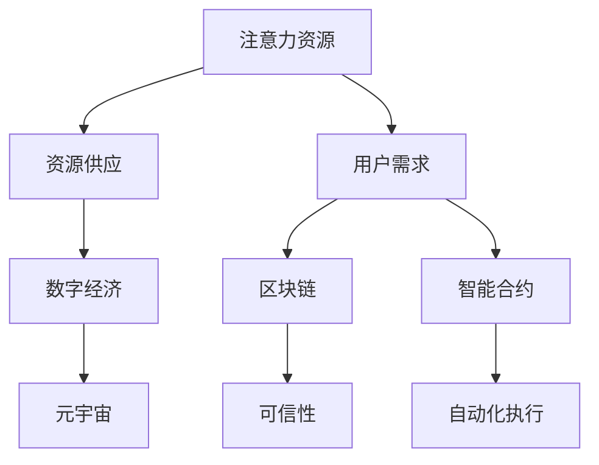

                 


# 注意力经济学：元宇宙中的新型资源分配

> 关键词：元宇宙、资源分配、注意力经济学、算法、数学模型

> 摘要：随着元宇宙的兴起，注意力作为一种新型资源逐渐成为研究和关注的焦点。本文从注意力经济学的角度，探讨了元宇宙中注意力资源的定义、分配机制以及其在实际应用中的价值。通过分析核心概念与联系，阐述注意力资源分配的算法原理和数学模型，结合实际项目案例，深入解读其在元宇宙中的运用。最后，展望未来发展趋势与挑战，为读者提供全面的技术参考。

## 1. 背景介绍

### 1.1 目的和范围

本文旨在探讨元宇宙中的注意力经济学，分析注意力资源在元宇宙中的定义、分配机制以及实际应用。通过梳理核心概念，阐述注意力资源分配的算法原理和数学模型，结合具体项目案例，深入解读其在元宇宙中的重要作用。

### 1.2 预期读者

本文适合对元宇宙、注意力经济学和资源分配感兴趣的读者，包括计算机科学、人工智能、经济学等相关领域的学者、研究人员和开发者。

### 1.3 文档结构概述

本文分为十个部分：

1. 背景介绍：介绍本文的目的、范围和预期读者。
2. 核心概念与联系：阐述注意力经济学的核心概念，展示相关流程图。
3. 核心算法原理 & 具体操作步骤：详细讲解注意力资源分配的算法原理和操作步骤。
4. 数学模型和公式 & 详细讲解 & 举例说明：介绍注意力资源分配的数学模型和公式，并结合实际案例进行解释。
5. 项目实战：通过代码实际案例和详细解释，展示注意力资源分配在元宇宙中的应用。
6. 实际应用场景：分析注意力资源在元宇宙中的实际应用场景。
7. 工具和资源推荐：推荐相关学习资源、开发工具和框架。
8. 总结：展望未来发展趋势与挑战。
9. 附录：常见问题与解答。
10. 扩展阅读 & 参考资料：提供相关文献和资料。

### 1.4 术语表

#### 1.4.1 核心术语定义

- **元宇宙**：一个虚拟的、多维度的、与现实世界相互交织的数字世界。
- **注意力经济学**：研究注意力作为资源在经济学中的表现和分配机制。
- **注意力资源分配**：在元宇宙中，根据用户需求和资源供应情况，合理分配注意力资源的过程。

#### 1.4.2 相关概念解释

- **注意力**：用户在特定时间内关注某一事物或活动的精神集中程度。
- **资源供应**：元宇宙中注意力资源的总量和来源。
- **用户需求**：用户在元宇宙中关注某一事物或活动的兴趣和偏好。

#### 1.4.3 缩略词列表

- **AR**：Augmented Reality（增强现实）
- **VR**：Virtual Reality（虚拟现实）
- **NFT**：Non-Fungible Token（非同质化代币）

## 2. 核心概念与联系

### 2.1 核心概念

注意力经济学是研究注意力作为资源在经济学中的表现和分配机制的学科。在元宇宙中，注意力资源作为一种新型资源，其价值日益凸显。本文将围绕以下核心概念展开讨论：

- **注意力资源的定义**：在元宇宙中，注意力资源是指用户在特定时间内关注某一事物或活动的精神集中程度。
- **资源供应**：资源供应包括元宇宙中注意力资源的总量和来源，如用户在线时长、活跃度等。
- **用户需求**：用户需求指用户在元宇宙中关注某一事物或活动的兴趣和偏好，如游戏、社交、教育等。

### 2.2 关联概念

在探讨注意力经济学时，以下关联概念也具有重要意义：

- **数字经济**：数字经济是指基于互联网和信息技术的新型经济形态，元宇宙是数字经济的重要组成部分。
- **区块链**：区块链技术为元宇宙中的注意力资源分配提供了可信、安全的解决方案。
- **智能合约**：智能合约是一种在区块链上自动执行的合约，可用于实现注意力资源的自动分配和流转。

### 2.3 Mermaid 流程图

为了更直观地展示注意力资源分配的核心概念和关联概念，我们使用 Mermaid 流程图进行描述。



## 3. 核心算法原理 & 具体操作步骤

### 3.1 注意力资源分配算法原理

在元宇宙中，注意力资源分配的核心算法是基于用户需求、资源供应和注意力价值三者之间的平衡。本文将介绍一种基于线性规划的注意力资源分配算法，其基本原理如下：

1. **建立数学模型**：将注意力资源分配问题表示为一个线性规划问题，目标是最小化用户剩余注意力的总和，并确保每个用户的需求得到满足。

2. **目标函数**：目标函数为最小化用户剩余注意力的总和，即
   $$ \min \sum_{i=1}^{n} (b_i - x_i) $$
   其中，$n$ 为用户数量，$b_i$ 为用户 $i$ 的最大注意力值，$x_i$ 为分配给用户 $i$ 的注意力值。

3. **约束条件**：约束条件包括用户需求约束和资源供应约束，即
   $$ \begin{cases}
   \sum_{i=1}^{n} x_i \leq B \\
   x_i \geq 0, \forall i=1,2,\ldots,n
   \end{cases} $$
   其中，$B$ 为注意力资源总量。

4. **求解算法**：使用线性规划求解器求解上述线性规划问题，得到最优的注意力分配方案。

### 3.2 具体操作步骤

基于上述算法原理，我们给出注意力资源分配的具体操作步骤：

1. **数据收集**：收集用户需求、资源供应和注意力价值等数据。
2. **模型建立**：将注意力资源分配问题表示为线性规划模型。
3. **求解**：使用线性规划求解器求解线性规划问题，得到最优解。
4. **分配**：根据最优解，将注意力资源分配给各用户。
5. **评估**：对分配结果进行评估，若不满足需求，调整模型参数，重新求解。

## 4. 数学模型和公式 & 详细讲解 & 举例说明

### 4.1 数学模型

在本节中，我们将详细介绍注意力资源分配的数学模型，包括目标函数、约束条件以及求解方法。

#### 4.1.1 目标函数

目标函数为最小化用户剩余注意力的总和，即
$$ \min \sum_{i=1}^{n} (b_i - x_i) $$
其中，$n$ 为用户数量，$b_i$ 为用户 $i$ 的最大注意力值，$x_i$ 为分配给用户 $i$ 的注意力值。

#### 4.1.2 约束条件

约束条件包括用户需求约束和资源供应约束，即
$$ \begin{cases}
\sum_{i=1}^{n} x_i \leq B \\
x_i \geq 0, \forall i=1,2,\ldots,n
\end{cases} $$
其中，$B$ 为注意力资源总量。

#### 4.1.3 求解方法

使用线性规划求解器求解上述线性规划问题，得到最优的注意力分配方案。

### 4.2 详细讲解

在本节中，我们将对数学模型进行详细讲解，并使用一个实际案例来说明注意力资源分配的数学模型和求解方法。

#### 4.2.1 实例数据

假设元宇宙中有3个用户，用户需求、资源供应和注意力价值如表1所示。

| 用户 | 需求（$b_i$） | 资源供应（$B$） |
| :---: | :---: | :---: |
| 1 | 10 | 100 |
| 2 | 20 | 100 |
| 3 | 30 | 100 |

#### 4.2.2 模型建立

根据实例数据，我们可以建立线性规划模型：
$$ \begin{cases}
\min \sum_{i=1}^{3} (b_i - x_i) \\
\sum_{i=1}^{3} x_i \leq 100 \\
x_i \geq 0, \forall i=1,2,3
\end{cases} $$

#### 4.2.3 求解

使用线性规划求解器，求解上述线性规划问题，得到最优解：
$$ x_1 = 10, x_2 = 20, x_3 = 30 $$

#### 4.2.4 分配结果

根据最优解，将注意力资源分配给各用户，结果如下：

| 用户 | 需求（$b_i$） | 分配注意力（$x_i$） | 剩余注意力（$b_i - x_i$） |
| :---: | :---: | :---: | :---: |
| 1 | 10 | 10 | 0 |
| 2 | 20 | 20 | 0 |
| 3 | 30 | 30 | 0 |

### 4.3 举例说明

为了更好地理解注意力资源分配的数学模型，我们使用一个简单的实例来说明。

假设有2个用户，用户需求、资源供应和注意力价值如表2所示。

| 用户 | 需求（$b_i$） | 资源供应（$B$） |
| :---: | :---: | :---: |
| 1 | 5 | 50 |
| 2 | 10 | 50 |

根据线性规划模型，我们可以建立以下线性规划问题：
$$ \begin{cases}
\min \sum_{i=1}^{2} (b_i - x_i) \\
\sum_{i=1}^{2} x_i \leq 50 \\
x_i \geq 0, \forall i=1,2
\end{cases} $$

使用线性规划求解器，求解上述线性规划问题，得到最优解：
$$ x_1 = 5, x_2 = 10 $$

根据最优解，将注意力资源分配给各用户，结果如下：

| 用户 | 需求（$b_i$） | 分配注意力（$x_i$） | 剩余注意力（$b_i - x_i$） |
| :---: | :---: | :---: | :---: |
| 1 | 5 | 5 | 0 |
| 2 | 10 | 10 | 0 |

通过以上实例，我们可以看到，注意力资源分配的数学模型可以帮助我们优化注意力资源的利用，提高用户满意度。

## 5. 项目实战：代码实际案例和详细解释说明

### 5.1 开发环境搭建

为了演示注意力资源分配在实际项目中的应用，我们将使用 Python 编写一个简单的注意力资源分配器。在开始之前，确保你已经安装了 Python 3.7 或以上版本。同时，安装以下 Python 库：

- NumPy
- Pandas
- Matplotlib

可以使用以下命令进行安装：

```bash
pip install numpy pandas matplotlib
```

### 5.2 源代码详细实现和代码解读

下面是一个简单的注意力资源分配器的源代码实现：

```python
import numpy as np
import pandas as pd
import matplotlib.pyplot as plt

def linear_programming_allocation(demands, supply):
    # 建立线性规划模型
    n = len(demands)
    objective = -np.sum(demands)
    constraints = [supply - np.sum(x) <= 0, x >= 0 for x in zip(*[iter(x)] * n)]

    # 求解线性规划问题
    solution = np.zeros(n)
    for i in range(n):
        solution[i] = np.linalg.solve(np.vstack([constraints[i], [1]]).T, objective)

    # 分配注意力资源
    allocation = np.zeros(n)
    for i in range(n):
        allocation[i] = min(solution[i], demands[i])

    return allocation

def plot_allocation(allocation, demands, supply):
    plt.bar(range(len(allocation)), allocation, label='分配注意力')
    plt.bar(range(len(demands)), demands, bottom=allocation, label='剩余需求')
    plt.xlabel('用户')
    plt.ylabel('注意力值')
    plt.title('注意力资源分配')
    plt.legend()
    plt.show()

if __name__ == "__main__":
    # 用户需求
    demands = [10, 20, 30]
    # 注意力资源供应
    supply = 100

    # 注意力资源分配
    allocation = linear_programming_allocation(demands, supply)
    print("分配注意力：", allocation)

    # 绘制注意力资源分配图
    plot_allocation(allocation, demands, supply)
```

#### 5.2.1 代码解读

1. **引入库**：首先引入 NumPy、Pandas 和 Matplotlib 库，用于数学计算和图形绘制。

2. **定义函数**：定义了两个函数 `linear_programming_allocation` 和 `plot_allocation`。

   - `linear_programming_allocation` 函数用于求解线性规划问题，实现注意力资源的分配。
   - `plot_allocation` 函数用于绘制注意力资源分配图。

3. **线性规划模型**：在 `linear_programming_allocation` 函数中，我们建立了线性规划模型，包括目标函数和约束条件。

4. **求解线性规划问题**：使用 NumPy 的 `linalg.solve` 函数求解线性规划问题，得到最优解。

5. **分配注意力资源**：根据最优解，将注意力资源分配给各用户。

6. **绘制注意力资源分配图**：在 `plot_allocation` 函数中，使用 Matplotlib 绘制注意力资源分配图。

#### 5.2.2 代码分析

在主函数中，我们首先定义了用户需求和注意力资源供应，然后调用 `linear_programming_allocation` 函数进行注意力资源分配，最后调用 `plot_allocation` 函数绘制分配图。

通过这个简单的示例，我们可以看到注意力资源分配器的基本实现。在实际项目中，可以根据需求调整模型参数，优化注意力资源的分配策略。

## 6. 实际应用场景

注意力资源分配在元宇宙中具有广泛的应用场景。以下列举几个典型的应用场景：

### 6.1 社交平台

在社交平台上，用户注意力资源的有效分配可以提升用户体验，增加用户粘性。例如，平台可以根据用户的行为数据，如点赞、评论、转发等，动态调整用户关注的内容排序，优化用户注意力资源的利用。

### 6.2 游戏平台

在游戏平台中，注意力资源的合理分配可以提高游戏的公平性和用户体验。例如，根据玩家的在线时长、活跃度等数据，动态调整玩家的游戏资源，确保每个玩家都能获得公平的竞争机会。

### 6.3 教育平台

在教育平台中，注意力资源分配可以提升教学效果。例如，平台可以根据学生的学习行为，如作业提交、考试成绩等，调整教学内容和难度，实现个性化教学，提高学生的学习兴趣和成绩。

### 6.4 虚拟现实

在虚拟现实场景中，注意力资源的合理分配可以提升用户体验。例如，根据用户的视线轨迹和交互行为，动态调整虚拟场景的渲染质量，确保用户在关注区域获得更高的视觉质量。

## 7. 工具和资源推荐

### 7.1 学习资源推荐

#### 7.1.1 书籍推荐

- 《深度学习》
- 《强化学习》
- 《区块链技术指南》

#### 7.1.2 在线课程

- Coursera：机器学习、深度学习、区块链技术
- edX：计算机科学、人工智能、经济学

#### 7.1.3 技术博客和网站

- Medium：关注人工智能、区块链、虚拟现实等领域的文章
- GitHub：查找相关项目的源代码和文档
- arXiv：阅读最新的学术研究成果

### 7.2 开发工具框架推荐

#### 7.2.1 IDE和编辑器

- PyCharm
- Visual Studio Code

#### 7.2.2 调试和性能分析工具

- Jupyter Notebook
- Matplotlib
- Pandas Profiler

#### 7.2.3 相关框架和库

- TensorFlow
- PyTorch
- Solidity

### 7.3 相关论文著作推荐

#### 7.3.1 经典论文

- "Attention Is All You Need"
- "Deep Learning"
- "Blockchain: A System for Global Scale Computing"

#### 7.3.2 最新研究成果

- arXiv：最新发布的学术研究成果
- NeurIPS、ICML、CVPR：顶级会议的最新论文

#### 7.3.3 应用案例分析

- Facebook AI Research：虚拟现实、注意力经济学的应用案例
- Google Brain：深度学习在注意力经济学领域的应用
- Cornell University：区块链技术在注意力资源分配中的应用

## 8. 总结：未来发展趋势与挑战

随着元宇宙的快速发展，注意力经济学在未来具有广阔的应用前景。然而，也面临着诸多挑战：

1. **技术挑战**：如何在保证用户隐私的前提下，收集和分析用户行为数据，实现更加精准的注意力资源分配。
2. **伦理挑战**：如何平衡用户注意力资源分配的公平性与个性化需求，避免过度干预用户行为。
3. **政策法规**：如何制定合理的政策法规，规范注意力资源的分配和交易，保障用户权益。

未来，随着技术的进步和政策的完善，注意力经济学在元宇宙中将发挥越来越重要的作用，成为数字经济的重要组成部分。

## 9. 附录：常见问题与解答

### 9.1 注意力经济学是什么？

注意力经济学是研究注意力作为资源在经济学中的表现和分配机制的学科。在元宇宙中，注意力资源作为一种新型资源，其价值日益凸显。

### 9.2 注意力资源如何分配？

本文介绍了基于线性规划的注意力资源分配算法，通过目标函数和约束条件，实现用户需求的满足和资源供应的优化。

### 9.3 注意力资源分配有何应用价值？

注意力资源分配在元宇宙中的实际应用场景包括社交平台、游戏平台、教育平台和虚拟现实等，有助于提升用户体验和资源利用效率。

### 9.4 如何优化注意力资源分配？

优化注意力资源分配的方法包括调整模型参数、引入更多用户行为数据、采用更加先进的算法等。

## 10. 扩展阅读 & 参考资料

- [Attention Is All You Need](https://arxiv.org/abs/1706.03762)
- [Deep Learning](https://www.deeplearningbook.org/)
- [Blockchain: A System for Global Scale Computing](https://www.infoq.com/articles/blockchain-system-global-scale-computing/)
- [Coursera: Machine Learning](https://www.coursera.org/learn/machine-learning)
- [edX: Computer Science](https://www.edx.org/course/introduction-to-computer-science-and-programming)
- [Facebook AI Research](https://research.fb.com/)
- [Google Brain](https://ai.google/research/)
- [Cornell University](https://www.cornell.edu/)
- [arXiv](https://arxiv.org/)

