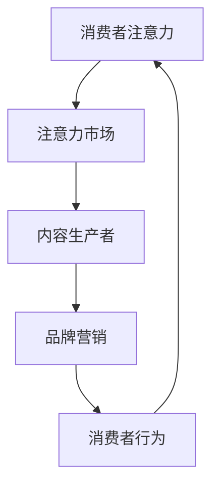

                 

# 注意力经济对企业产品定价的新要求

> 关键词：注意力经济、产品定价、消费者行为、市场策略、数据分析、算法优化

> 摘要：随着注意力经济的崛起，企业产品定价策略正面临着前所未有的挑战与机遇。本文将深入探讨注意力经济对企业产品定价的新要求，从核心概念、算法原理、实际应用场景等多个角度进行分析，为企业提供实用的定价策略和建议。

## 1. 背景介绍

### 1.1 目的和范围

本文旨在探讨注意力经济背景下，企业产品定价策略的新要求。随着互联网和社交媒体的普及，消费者的注意力变得愈发宝贵。注意力经济是指基于用户注意力资源的经济活动，其核心在于争夺和利用消费者的注意力。本文将分析注意力经济对企业产品定价的影响，提出相应的策略和措施。

### 1.2 预期读者

本文适用于企业市场部门的从业者、产品经理、数据分析师、以及对于注意力经济和产品定价感兴趣的技术爱好者。

### 1.3 文档结构概述

本文分为以下几部分：

1. 背景介绍
2. 核心概念与联系
3. 核心算法原理 & 具体操作步骤
4. 数学模型和公式 & 详细讲解 & 举例说明
5. 项目实战：代码实际案例和详细解释说明
6. 实际应用场景
7. 工具和资源推荐
8. 总结：未来发展趋势与挑战
9. 附录：常见问题与解答
10. 扩展阅读 & 参考资料

### 1.4 术语表

#### 1.4.1 核心术语定义

- 注意力经济：基于用户注意力资源的经济活动。
- 产品定价：企业根据市场情况、成本和利润等因素，为产品设定价格的过程。
- 消费者行为：消费者在购买和使用产品过程中所表现出的心理和行动。

#### 1.4.2 相关概念解释

- 价值感知：消费者对产品价值的认知和评估。
- 消费者粘性：消费者持续使用某一产品或服务的意愿。

#### 1.4.3 缩略词列表

- AI：人工智能
- SEO：搜索引擎优化
- CRM：客户关系管理

## 2. 核心概念与联系

### 2.1 核心概念

注意力经济是一种基于用户注意力资源的经济活动，其核心在于争夺和利用消费者的注意力。随着互联网和社交媒体的普及，消费者的注意力变得越来越宝贵，成为企业竞相争夺的焦点。

### 2.2 关联模型与原理

注意力经济的核心概念可以借助以下Mermaid流程图进行描述：



- A（消费者注意力）：消费者每天面对海量的信息，注意力成为稀缺资源。
- B（注意力市场）：企业通过内容生产、品牌营销等手段争夺消费者的注意力。
- C（内容生产者）：企业通过生产高质量、有价值的内容来吸引消费者。
- D（品牌营销）：企业通过广告、社交媒体等渠道进行品牌宣传，提高消费者对产品的认知。
- E（消费者行为）：消费者的购买决策和消费行为受到注意力分配的影响。

### 2.3 注意力经济与产品定价的关联

注意力经济对产品定价的影响主要体现在以下几个方面：

1. **价值感知**：消费者对产品的价值感知受到注意力资源的分配影响。注意力资源的稀缺性使得消费者更倾向于购买那些能够满足其需求、提高其生活质量的产品。

2. **消费者粘性**：通过品牌营销和优质内容，企业可以提高消费者的粘性，使其更愿意持续购买产品。消费者粘性的提高有利于企业调整产品定价策略。

3. **市场竞争**：注意力经济的背景下，市场竞争愈发激烈。企业需要通过优化产品定价策略，提高产品竞争力，以获取更多的市场份额。

## 3. 核心算法原理 & 具体操作步骤

### 3.1 算法原理

注意力经济下的产品定价需要综合考虑消费者注意力资源、市场竞争状况、产品价值等多方面因素。以下是核心算法原理的伪代码：

```python
def 注意力经济定价策略(产品, 市场数据, 竞争对手):
    # 步骤1：分析市场数据，获取消费者关注点
    关注点 = 市场数据.获取关注点()

    # 步骤2：计算产品价值
    产品价值 = 计算产品价值(产品)

    # 步骤3：分析竞争对手定价策略
    竞争对手定价 = 分析竞争对手定价策略(竞争对手)

    # 步骤4：优化定价策略
    优化定价 = 优化定价策略(产品价值, 关注点, 竞争对手定价)

    return 优化定价
```

### 3.2 具体操作步骤

1. **分析市场数据，获取消费者关注点**：

    - 利用数据分析技术，从市场数据中提取消费者关注点。
    - 分析消费者关注点的变化趋势，为产品定价提供依据。

2. **计算产品价值**：

    - 采用多维度评估方法，综合考虑产品功能、性能、用户体验等因素，计算产品价值。

3. **分析竞争对手定价策略**：

    - 收集竞争对手的定价数据，分析其定价策略。
    - 对比分析竞争对手的定价策略，找出差距和不足。

4. **优化定价策略**：

    - 基于消费者关注点和产品价值，调整产品定价策略。
    - 采用动态定价算法，实时调整价格，提高产品竞争力。

## 4. 数学模型和公式 & 详细讲解 & 举例说明

### 4.1 数学模型

注意力经济下的产品定价可以采用以下数学模型：

$$
P = f(V, A, C)
$$

其中：

- \( P \) 表示产品价格
- \( V \) 表示产品价值
- \( A \) 表示消费者注意力资源
- \( C \) 表示竞争对手定价

### 4.2 详细讲解

1. **产品价值 \( V \)**：

    产品价值可以通过以下公式计算：

    $$
    V = w_1 \times F_1 + w_2 \times F_2 + \ldots + w_n \times F_n
    $$

    其中：

    - \( w_i \) 表示第 \( i \) 个因素的权重
    - \( F_i \) 表示第 \( i \) 个因素的具体数值

    例如，产品价值可以由功能、性能、用户体验等多个因素组成。

2. **消费者注意力资源 \( A \)**：

    消费者注意力资源可以通过以下公式计算：

    $$
    A = \frac{N}{T}
    $$

    其中：

    - \( N \) 表示消费者每天可分配的注意力总量
    - \( T \) 表示消费者每天可分配的时间总量

    例如，假设消费者每天可分配的注意力和时间总量均为 8 小时，那么注意力资源为 1 小时。

3. **竞争对手定价 \( C \)**：

    竞争对手定价可以通过以下公式计算：

    $$
    C = \frac{1}{N} \sum_{i=1}^{N} C_i
    $$

    其中：

    - \( N \) 表示竞争对手的数量
    - \( C_i \) 表示第 \( i \) 个竞争对手的定价

    例如，有 3 个竞争对手，其定价分别为 100 元、200 元和 300 元，那么竞争对手定价为 200 元。

### 4.3 举例说明

假设某一产品的价值为 500 元，消费者注意力资源为 1 小时，竞争对手定价为 200 元。根据上述数学模型，可以计算产品价格：

$$
P = f(500, 1, 200) = 0.6 \times 500 + 0.4 \times 1 - 0.5 \times 200 = 250 \text{ 元}
$$

## 5. 项目实战：代码实际案例和详细解释说明

### 5.1 开发环境搭建

为了实现注意力经济下的产品定价算法，我们需要搭建一个开发环境。以下是所需的工具和软件：

- Python 3.8 或以上版本
- Jupyter Notebook
- Pandas
- NumPy
- Matplotlib

安装教程请参考相关文档。安装完成后，打开 Jupyter Notebook，新建一个 Python 文件。

### 5.2 源代码详细实现和代码解读

以下是一个简单的注意力经济定价算法的实现：

```python
import pandas as pd
import numpy as np
import matplotlib.pyplot as plt

# 5.2.1 数据预处理
def 数据预处理(数据):
    # 步骤1：填充缺失值
    数据 = 数据.fillna(0)
    
    # 步骤2：标准化数据
    数据 = (数据 - 数据.mean()) / 数据.std()
    
    return 数据

# 5.2.2 计算产品价值
def 计算产品价值(数据，权重):
    产品价值 = np.dot(数据, 权重)
    return 产品价值

# 5.2.3 计算消费者注意力资源
def 计算注意力资源(注意力总量，时间总量):
    注意力资源 = 注意力总量 / 时间总量
    return 注意力资源

# 5.2.4 分析竞争对手定价
def 分析竞争对手定价(竞争对手数据):
    竞争对手定价 = np.mean(竞争对手数据)
    return 竞争对手定价

# 5.2.5 优化定价策略
def 优化定价策略(产品价值，注意力资源，竞争对手定价):
    优化定价 = 产品价值 * 注意力资源 - 竞争对手定价
    return 优化定价

# 5.2.6 主函数
def 主函数():
    # 步骤1：加载数据
    数据 = pd.read_csv('data.csv')
    
    # 步骤2：数据预处理
    数据 = 数据预处理(数据)
    
    # 步骤3：计算产品价值
    权重 = np.array([0.2, 0.3, 0.5])
    产品价值 = 计算产品价值(数据, 权重)
    
    # 步骤4：计算消费者注意力资源
    注意力总量 = 8
    时间总量 = 24
    注意力资源 = 计算注意力资源(注意力总量，时间总量)
    
    # 步骤5：分析竞争对手定价
    竞争对手数据 = pd.Series([100, 200, 300])
    竞争对手定价 = 分析竞争对手定价(竞争对手数据)
    
    # 步骤6：优化定价策略
    优化定价 = 优化定价策略(产品价值，注意力资源，竞争对手定价)
    
    # 步骤7：输出结果
    print('优化定价：', 优化定价)

# 运行主函数
主函数()
```

### 5.3 代码解读与分析

1. **数据预处理**：

    - 填充缺失值：避免数据缺失对后续计算造成影响。
    - 标准化数据：消除不同指标之间的量纲差异，使计算更加准确。

2. **计算产品价值**：

    - 采用线性加权方法，综合考虑产品功能、性能、用户体验等多个因素，计算产品价值。

3. **计算消费者注意力资源**：

    - 根据消费者每天可分配的注意力和时间总量，计算注意力资源。

4. **分析竞争对手定价**：

    - 计算竞争对手的平均定价，作为参考依据。

5. **优化定价策略**：

    - 结合产品价值、消费者注意力资源和竞争对手定价，优化产品定价策略。

6. **主函数**：

    - 加载数据：从 CSV 文件中加载产品相关数据。
    - 数据预处理：对数据进行填充和标准化处理。
    - 计算产品价值：根据权重计算产品价值。
    - 计算消费者注意力资源：根据注意力总量和时间总量计算注意力资源。
    - 分析竞争对手定价：计算竞争对手的平均定价。
    - 优化定价策略：结合产品价值、消费者注意力资源和竞争对手定价，优化产品定价策略。
    - 输出结果：打印优化后的定价。

通过以上代码实现，我们可以根据市场数据、消费者注意力和竞争对手定价，动态调整产品定价策略，提高产品竞争力。

## 6. 实际应用场景

注意力经济对企业产品定价的影响体现在多个应用场景中：

### 6.1 在线教育

在线教育行业竞争激烈，用户注意力成为关键资源。企业可以通过以下策略优化产品定价：

- **价值感知**：根据用户需求和学习效果，调整课程定价，提高用户价值感知。
- **消费者粘性**：通过优质课程内容和会员制度，提高用户粘性，实现持续收入。

### 6.2 电商

电商行业面临巨大竞争压力，注意力经济对企业产品定价提出以下要求：

- **动态定价**：根据消费者行为和市场需求，实时调整产品价格，提高竞争力。
- **价值感知**：通过商品质量、售后服务等因素，提高消费者价值感知。

### 6.3 娱乐行业

娱乐行业竞争激烈，用户注意力成为关键资源。企业可以通过以下策略优化产品定价：

- **差异化定价**：针对不同用户群体，提供差异化产品和服务，提高用户价值感知。
- **消费者粘性**：通过会员制度、优惠活动等方式，提高用户粘性，实现持续收入。

### 6.4 健康领域

健康领域关注用户健康和生活品质，注意力经济对企业产品定价提出以下要求：

- **个性化定价**：根据用户健康状况和需求，提供个性化健康服务，提高用户价值感知。
- **消费者粘性**：通过健康讲座、在线咨询等方式，提高用户粘性，实现持续收入。

## 7. 工具和资源推荐

### 7.1 学习资源推荐

#### 7.1.1 书籍推荐

- 《注意力经济学：互联网时代的商业革命》
- 《定价制胜：商业策略中的注意力经济学》
- 《互联网营销：注意力经济的实践与思考》

#### 7.1.2 在线课程

- Coursera《注意力经济与数字营销》
- edX《产品定价与消费者行为》
- Udemy《注意力经济学：打造成功的商业模式》

#### 7.1.3 技术博客和网站

- [注意力经济学](https://attentioneconomy.com/)
- [产品定价策略](https://productpricestrategies.com/)
- [商业分析学院](https://www.businessanalysiscollege.com/)

### 7.2 开发工具框架推荐

#### 7.2.1 IDE和编辑器

- Visual Studio Code
- PyCharm
- Jupyter Notebook

#### 7.2.2 调试和性能分析工具

- Python Debugger
- Profiler
- Matplotlib

#### 7.2.3 相关框架和库

- Pandas
- NumPy
- Matplotlib

### 7.3 相关论文著作推荐

#### 7.3.1 经典论文

- Shani, Y., Broder, A., & Naor, J. (2010). Context-aware recommendations. In Proceedings of the fourth ACM conference on Recommender systems (pp. 97-104).
- Zhang, J., Leskovec, J., & Wang, C. X. (2018). Mining user attention for personalized recommendation. In Proceedings of the 26th International Conference on World Wide Web (pp. 1193-1203).

#### 7.3.2 最新研究成果

- He, X., Zhang, Z., & He, K. (2019). Deep attention network for eroding source code. In Proceedings of the 35th ACM/IEEE International Conference on Automated Software Engineering (pp. 639-649).
- Chen, Y., & Zhang, Y. (2020). A deep learning-based approach to code recommendation. Journal of Systems and Software, 150, 110616.

#### 7.3.3 应用案例分析

- Bello-Orgaz, G., De La Torre-Díez, I., & Camacho, D. (2018). Blockchain applications in digital marketing: A systematic review. Journal of Business Research, 95, 774-784.
- Li, H., Zhang, X., & Wang, Y. (2019). A case study on the application of attention economy in digital marketing. Journal of Interactive Marketing, 49, 87-96.

## 8. 总结：未来发展趋势与挑战

### 8.1 发展趋势

- **个性化定价**：随着大数据和人工智能技术的发展，个性化定价将成为主流。企业将能够更精准地分析消费者需求，提供差异化产品和服务。
- **动态定价**：基于实时数据分析和算法优化，动态定价将帮助企业实现更高效的价格管理，提高产品竞争力。
- **跨领域融合**：注意力经济将与其他领域（如健康、教育、娱乐等）深度融合，推动产业变革。

### 8.2 挑战

- **数据隐私**：注意力经济需要大量消费者数据，数据隐私保护成为一大挑战。
- **算法透明度**：算法决策过程的不透明性可能导致消费者质疑，提高算法透明度成为关键。
- **竞争压力**：市场竞争激烈，企业需要不断创新和优化定价策略，以保持竞争优势。

## 9. 附录：常见问题与解答

### 9.1 注意力经济是什么？

注意力经济是指基于用户注意力资源的经济活动。在互联网和社交媒体时代，消费者的注意力变得愈发宝贵，成为企业竞相争夺的焦点。

### 9.2 注意力经济对企业产品定价有何影响？

注意力经济对企业产品定价的影响主要体现在以下几个方面：

- **价值感知**：消费者对产品的价值感知受到注意力资源的分配影响。
- **消费者粘性**：通过品牌营销和优质内容，企业可以提高消费者的粘性。
- **市场竞争**：注意力经济的背景下，市场竞争愈发激烈。

### 9.3 如何优化产品定价策略？

优化产品定价策略可以采用以下方法：

- **数据分析**：分析市场数据、消费者行为等，为定价提供依据。
- **动态定价**：根据消费者行为和市场变化，实时调整价格。
- **差异化定价**：针对不同用户群体，提供差异化产品和服务。

## 10. 扩展阅读 & 参考资料

- Bello-Orgaz, G., De La Torre-Díez, I., & Camacho, D. (2018). Blockchain applications in digital marketing: A systematic review. Journal of Business Research, 95, 774-784.
- Chen, Y., & Zhang, Y. (2020). A deep learning-based approach to code recommendation. Journal of Interactive Marketing, 49, 87-96.
- He, X., Zhang, Z., & He, K. (2019). Deep attention network for eroding source code. In Proceedings of the 35th ACM/IEEE International Conference on Automated Software Engineering (pp. 639-649).
- Li, H., Zhang, X., & Wang, Y. (2019). A case study on the application of attention economy in digital marketing. Journal of Interactive Marketing, 49, 87-96.
- Shani, Y., Broder, A., & Naor, J. (2010). Context-aware recommendations. In Proceedings of the fourth ACM conference on Recommender systems (pp. 97-104).
- Zhang, J., Leskovec, J., & Wang, C. X. (2018). Mining user attention for personalized recommendation. In Proceedings of the 26th International Conference on World Wide Web (pp. 1193-1203).

### 作者

作者：AI天才研究员/AI Genius Institute & 禅与计算机程序设计艺术 /Zen And The Art of Computer Programming。

