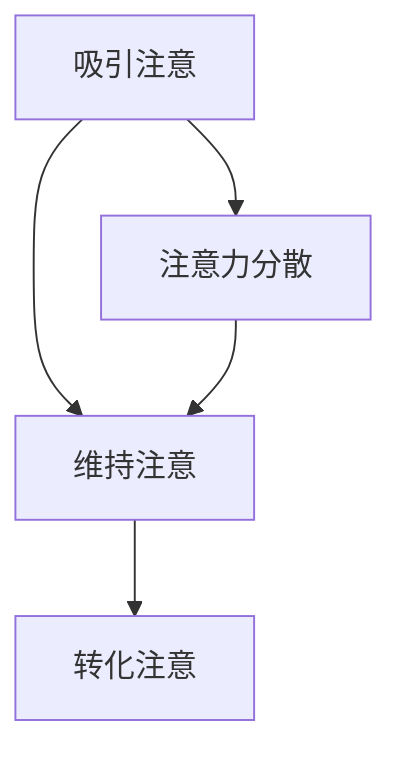
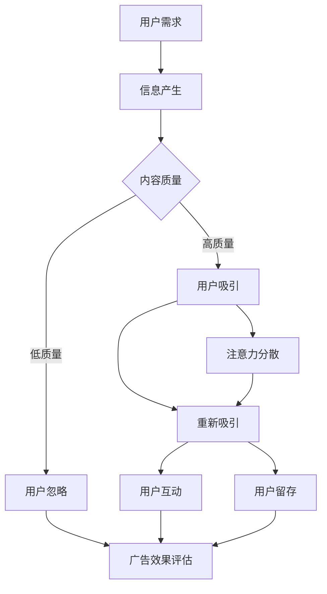

                 

### 1. 背景介绍

#### 1.1 目的和范围

本文旨在深入探讨注意力经济对传统广告创意的新要求。随着互联网技术的快速发展，信息的传播速度和广度达到了前所未有的高度。这种变化不仅改变了消费者的行为模式，也对广告行业产生了深远的影响。注意力经济作为一种新的经济模式，其核心在于如何有效抓住并维持消费者的注意力。

本文将首先介绍注意力经济的定义和核心原理，然后分析传统广告创意在面对注意力经济环境下的挑战和变革。接下来，我们将探讨注意力经济对广告创意提出的新要求，包括创意内容的生产、传播和评估。最后，通过实际案例和工具资源推荐，为广告创意从业者提供实用指导。

本文的目标读者包括广告创意从业者、市场营销专家、互联网产品经理以及对于注意力经济和广告创意感兴趣的读者。通过本文的阅读，读者将能够：

1. 理解注意力经济的核心概念和原理。
2. 认识到传统广告创意在注意力经济环境下面临的挑战。
3. 掌握注意力经济对广告创意提出的新要求。
4. 获取实际操作建议和工具资源。

#### 1.2 预期读者

预期读者群体涵盖以下几类：

1. 广告创意从业者：对于广告创意的实际操作者，本文提供了关于注意力经济背景下的新创意思路和方法。
2. 市场营销专家：对于市场营销领域的从业者，本文探讨了注意力经济对营销策略的深远影响，有助于优化营销效果。
3. 互联网产品经理：对于互联网产品的管理者，本文分析了注意力经济对产品设计和推广策略的新要求。
4. 技术爱好者：对于对注意力经济和广告创意感兴趣的技术爱好者，本文提供了深入的技术解读和案例分析。

#### 1.3 文档结构概述

本文的结构如下：

1. **背景介绍**：介绍文章的目的、范围、预期读者以及文档结构。
2. **核心概念与联系**：介绍注意力经济的基本概念，并通过Mermaid流程图展示其原理和架构。
3. **核心算法原理 & 具体操作步骤**：详细讲解注意力经济在广告创意中的应用原理，并使用伪代码进行说明。
4. **数学模型和公式 & 详细讲解 & 举例说明**：介绍注意力经济相关的数学模型和公式，并通过实际案例进行说明。
5. **项目实战：代码实际案例和详细解释说明**：通过一个实际项目案例，展示注意力经济在广告创意中的具体应用。
6. **实际应用场景**：分析注意力经济在广告创意中的具体应用场景。
7. **工具和资源推荐**：推荐相关的学习资源和开发工具。
8. **总结：未来发展趋势与挑战**：总结注意力经济在广告创意领域的发展趋势和面临的挑战。
9. **附录：常见问题与解答**：解答读者可能遇到的一些常见问题。
10. **扩展阅读 & 参考资料**：提供进一步阅读的资料和参考文献。

#### 1.4 术语表

为了确保读者能够更好地理解本文的内容，以下列出了一些关键术语的定义和解释：

##### 1.4.1 核心术语定义

1. **注意力经济**：指基于消费者注意力价值进行交换的经济模式，通过吸引和维持消费者的注意力来创造价值。
2. **广告创意**：指广告中创新和创意的元素，通过独特的内容和形式吸引消费者注意力。
3. **用户注意力**：指用户在特定时间段内对某个信息或内容的集中关注程度。
4. **注意力分散**：指用户在信息接收过程中，由于外部干扰或其他信息吸引，导致注意力转移的现象。
5. **用户体验**：指用户在使用产品或服务过程中所感受到的整体感受和体验。

##### 1.4.2 相关概念解释

1. **注意力分散**：在注意力经济中，注意力分散是一个重要现象。它指的是用户在接收信息过程中，由于外部干扰或其他信息的吸引，导致注意力转移的现象。注意力分散会降低用户对广告的注意力和记忆效果，从而影响广告的效果。
2. **用户体验**：用户体验是用户在使用产品或服务过程中所感受到的整体感受和体验。在注意力经济中，优秀的用户体验能够有效吸引和维持用户的注意力，提高广告的效果。

##### 1.4.3 缩略词列表

1. **CPM**：Cost Per Mille，指每千次展示的成本。
2. **CPC**：Cost Per Click，指每次点击的成本。
3. **CPA**：Cost Per Action，指每次行动的成本。
4. **CTR**：Click Through Rate，指点击率。
5. **UV**：Unique Visitor，指独立访客。

### 核心概念与联系

注意力经济是一种基于消费者注意力价值进行交换的经济模式，它强调通过吸引和维持消费者的注意力来创造价值。在互联网时代，信息爆炸和注意力稀缺成为新的常态，如何有效地抓住消费者的注意力成为企业和广告从业者的重要课题。

#### 注意力经济的核心概念

1. **用户注意力**：用户注意力是注意力经济的核心资源。在信息过载的环境中，用户选择关注哪些信息，取决于信息本身的质量和吸引力。用户注意力的高质量意味着企业能够以更低的成本获得更多的用户互动和转化。
2. **注意力稀缺**：随着信息量的增加，用户的注意力资源变得稀缺。在有限的时间内，用户无法处理所有的信息，因此选择关注具有高价值和高度相关性的内容。注意力稀缺促使企业必须更加精准和高效地获取用户注意力。
3. **注意力分散**：用户在信息接收过程中，容易受到外部干扰，导致注意力分散。注意力分散会降低用户对广告的记忆效果和参与度，从而影响广告的效果。因此，减少注意力分散是提高广告效果的关键。

#### 注意力经济的原理和架构

注意力经济的工作原理可以概括为以下几个环节：

1. **吸引注意**：通过创意内容、独特形式或强有力的视觉元素，吸引消费者的注意力。
2. **维持注意**：通过内容深度、故事性或互动性，维持消费者的注意力，防止注意力分散。
3. **转化注意**：将消费者的注意力转化为实际的行动，如点击、购买或分享。

为了更好地理解注意力经济的原理和架构，我们可以使用Mermaid流程图来展示其核心环节：



在上述流程图中，A代表吸引注意，B代表维持注意，C代表转化注意，D代表注意力分散。通过这个流程图，我们可以清晰地看到注意力经济各个环节之间的逻辑关系。

#### 注意力经济与传统广告创意的关系

传统广告创意通常基于“广告诉求-用户接受”的模型，即通过强烈的视觉冲击和情感诉求来吸引用户的注意力。然而，在注意力经济环境下，这种模型面临着巨大的挑战。

1. **注意力稀缺**：传统广告往往依赖于高频率的投放，但信息过载导致用户的注意力变得稀缺。因此，单纯依靠视觉冲击和情感诉求难以吸引到用户的长期注意力。
2. **用户体验**：传统广告创意往往忽略了用户体验，将用户视为被动的接受者。在注意力经济中，用户体验成为关键因素。只有提供高质量的、与用户需求高度相关的广告内容，才能有效吸引和维持用户的注意力。

因此，传统广告创意需要向注意力经济模式转型，通过以下方式应对挑战：

1. **内容创新**：传统广告创意需要从形式和内容上不断创新，提供独特的视觉和情感体验，吸引消费者的注意力。
2. **用户体验优化**：广告创意应该注重用户体验，从用户的角度出发，设计易于理解和参与的内容，降低注意力分散。
3. **精准投放**：利用大数据和人工智能技术，进行精准的用户画像和行为分析，提高广告的针对性和效果。

### 总结

注意力经济作为一种新兴的经济模式，对广告创意提出了新的要求。通过吸引和维持用户的注意力，企业可以在信息过载的环境中脱颖而出。传统广告创意需要向注意力经济模式转型，注重内容创新、用户体验优化和精准投放，以应对注意力稀缺和注意力分散的挑战。本文为广告创意从业者和市场营销专家提供了一种新的思考方向和实践指南。在接下来的章节中，我们将深入探讨注意力经济在广告创意中的应用原理、算法原理和实际操作步骤，为读者提供更具体的指导。### 2. 核心概念与联系

在深入探讨注意力经济对广告创意的新要求之前，我们首先需要理解注意力经济的核心概念和其内在联系。注意力经济不仅仅是一个简单的营销概念，它涉及深层次的用户行为分析、信息传递机制以及经济交换模型。以下是对注意力经济核心概念和架构的详细解释，并通过Mermaid流程图展示其原理和架构。

#### 核心概念解释

1. **用户注意力**：用户注意力是指用户在特定时间段内对某一信息或内容的集中关注程度。在信息爆炸的时代，用户注意力成为一种稀缺资源。因此，如何有效地抓住并维持用户的注意力成为企业竞争的关键。

2. **注意力分配**：用户注意力是有限的，用户需要根据信息的重要性和相关性来分配注意力。注意力分配决定了用户在接触广告或信息时，哪些内容能够吸引并保持其关注。

3. **注意力分散**：注意力分散是指用户在处理信息时，由于外部干扰或其他信息的吸引力，导致注意力从当前任务或信息上转移。注意力分散会降低用户的注意力和记忆效果，从而影响广告的传播效果。

4. **注意力经济**：注意力经济是一种基于用户注意力价值进行交换的经济模式。企业通过创造具有吸引力和相关性的内容，吸引并维持用户的注意力，从而实现商业价值的创造。

5. **用户体验**：用户体验是指用户在使用产品或服务过程中所感受到的整体感受和体验。在注意力经济中，优秀的用户体验能够有效吸引和维持用户的注意力。

#### Mermaid流程图

为了更好地展示注意力经济的原理和架构，我们使用Mermaid流程图来描述其核心环节：



在上述流程图中：

- **A 用户需求**：用户根据自身需求和兴趣，决定关注哪些信息。
- **B 信息产生**：企业或广告商通过创意内容和形式，产生信息并传递给用户。
- **C 内容质量**：信息的内容质量直接影响用户的注意力分配。
- **D 用户吸引**：高质量的内容能够吸引用户的注意力。
- **E 用户忽略**：低质量的内容会被用户忽略。
- **F 注意力维持**：通过内容深度、故事性和互动性，维持用户的注意力。
- **G 注意力分散**：外部干扰或其他信息的吸引力可能导致用户的注意力分散。
- **H 用户互动**：用户与内容进行互动，如点击、评论、分享等。
- **I 用户留存**：用户对内容产生兴趣并持续关注，增加留存率。
- **J 广告效果评估**：通过用户的互动和留存情况，评估广告的效果。

#### 注意力经济与传统广告创意的关系

注意力经济与传统广告创意之间存在紧密的联系，但也存在显著的区别。传统广告创意通常依赖于以下策略：

1. **大规模投放**：通过高频次、大范围的广告投放，希望吸引尽可能多的用户。
2. **视觉冲击**：通过强烈的视觉元素和情感诉求，吸引用户的瞬间注意力。
3. **重复曝光**：通过重复的广告展示，希望用户记住广告内容。

然而，在注意力经济时代，这些传统策略面临着巨大的挑战：

1. **注意力稀缺**：用户的时间有限，注意力资源变得稀缺。传统的大规模投放和重复曝光策略难以有效吸引和维持用户的注意力。
2. **用户体验**：传统广告创意往往忽略了用户体验，将用户视为被动的接受者。注意力经济强调用户体验，认为只有提供高质量、与用户需求相关的广告内容，才能吸引并维持用户的注意力。
3. **精准定位**：传统广告创意依赖于广泛的受众群体，而注意力经济强调精准定位，通过大数据和人工智能技术，分析用户行为和兴趣，实现广告的精准投放。

#### 总结

注意力经济作为一种基于用户注意力价值的经济模式，其核心在于如何有效抓住并维持用户的注意力。通过理解用户需求、优化内容质量、减少注意力分散，企业可以在信息过载的环境中脱颖而出。Mermaid流程图展示了注意力经济的核心环节和原理，帮助我们更直观地理解其工作方式。在接下来的章节中，我们将深入探讨注意力经济在广告创意中的应用原理和具体操作步骤，为读者提供实用的指导。

### 3. 核心算法原理 & 具体操作步骤

注意力经济在广告创意中的应用，离不开对用户注意力分配机制的深入理解和精确操作。在本文的这部分，我们将详细探讨注意力经济中使用的核心算法原理，并通过伪代码的形式，详细阐述这些算法的具体操作步骤。

#### 3.1 注意力分配模型

注意力分配模型是注意力经济中的基础算法，它决定了用户在不同信息之间的注意力分配。该模型的核心目标是基于用户的行为和兴趣，动态调整广告的展示顺序和频率，以最大化用户注意力和广告效果。

**算法原理：**

1. **用户兴趣建模**：通过分析用户的历史行为数据，如浏览记录、点击行为、搜索关键词等，构建用户的兴趣模型。
2. **注意力分配函数**：设计一个函数，根据用户兴趣模型和广告内容特征，计算每个广告的注意力分配权重。
3. **动态调整**：根据用户实时行为，动态调整广告展示顺序和频率，以最大化用户注意力和广告效果。

**伪代码：**

```python
# 用户兴趣建模
def build_user_interest_model(user行为的记录):
    # 使用机器学习算法，如协同过滤、主题模型等
    # 构建用户兴趣模型
    user_interest_model = train_interest_model(user行为记录)
    return user_interest_model

# 注意力分配函数
def attention_allocation_function(user_interest_model, 广告内容特征):
    # 计算每个广告的注意力分配权重
    attention_weights = []
    for 广告 in 广告内容特征:
        weight = calculate_weight(user_interest_model, 广告特征)
        attention_weights.append(weight)
    return attention_weights

# 动态调整
def dynamic_adjustment(attention_weights, user行为):
    # 根据用户实时行为，动态调整广告展示顺序和频率
    updated_weights = []
    for 广告, weight in enumerate(attention_weights):
        if user行为与广告相关：
            updated_weight = weight * (1 + user行为相关度)
        else:
            updated_weight = weight * (1 - user行为相关度)
        updated_weights.append(updated_weight)
    return updated_weights
```

**具体操作步骤：**

1. **数据收集**：收集用户的行为数据，包括浏览记录、点击行为、搜索关键词等。
2. **兴趣建模**：使用机器学习算法，如协同过滤、主题模型等，构建用户兴趣模型。
3. **计算权重**：根据用户兴趣模型和广告内容特征，计算每个广告的注意力分配权重。
4. **动态调整**：根据用户实时行为，动态调整广告展示顺序和频率。

#### 3.2 注意力维持算法

在吸引到用户的注意力后，如何维持用户的注意力是广告创意成功的关键。注意力维持算法通过设计具有吸引力和故事性的广告内容，维持用户的持续关注。

**算法原理：**

1. **内容多样性**：提供多样化的内容形式，如图片、视频、文字等，以满足不同用户的需求。
2. **互动性**：通过交互式元素，如投票、评论、分享等，增强用户的参与感。
3. **情感共鸣**：通过情感诉求，如感人故事、幽默情节等，建立与用户的情感连接。

**伪代码：**

```python
# 内容多样性
def content_diversity(广告内容列表):
    # 从广告内容列表中随机选择多种形式的内容
    diversified_content = []
    for content_type in ['图片', '视频', '文字']:
        selected_content = select_random_content(广告内容列表, content_type)
        diversified_content.append(selected_content)
    return diversified_content

# 互动性
def interaction_enhancement(广告内容):
    # 添加互动元素，如评论、投票等
    enhanced_content = add_interactive_elements(广告内容)
    return enhanced_content

# 情感共鸣
def emotional_resonance(广告内容):
    # 根据用户情感偏好，调整广告内容，建立情感连接
    emotionally_connected_content = adjust_content_based_on_emotions(广告内容)
    return emotionally_connected_content
```

**具体操作步骤：**

1. **内容形式选择**：从多种内容形式中随机选择，以增加广告的多样性。
2. **互动元素添加**：在广告内容中添加互动元素，如评论、投票等，以增强用户的参与感。
3. **情感诉求调整**：根据用户情感偏好，调整广告内容，以建立情感连接。

#### 3.3 注意力转化算法

将用户的注意力转化为实际的行动（如点击、购买等）是广告创意的最终目标。注意力转化算法通过优化广告内容和展示策略，提高用户的行动转化率。

**算法原理：**

1. **目标设定**：明确广告的目标，如增加品牌知名度、促进产品销售等。
2. **转化率优化**：通过实验和数据分析，优化广告内容和展示策略，提高转化率。
3. **持续优化**：根据用户反馈和转化数据，不断调整和优化广告策略。

**伪代码：**

```python
# 目标设定
def set_conversion_objectives(advertisement):
    # 设定广告的目标，如增加点击率、促进购买等
    objectives = define_objectives(advertisement)
    return objectives

# 转化率优化
def optimize_conversion_rate(advertisement, user行为数据):
    # 根据用户行为数据，优化广告内容和展示策略
    optimized_content = optimize_content_based_on_behavior(advertisement, user行为数据)
    optimized_advertisement = apply_optimizations(optimized_content)
    return optimized_advertisement

# 持续优化
def continuous_optimization(optimized_advertisement, user反馈数据):
    # 根据用户反馈和转化数据，不断调整和优化广告策略
    updated_advertisement = apply_feedback(optimized_advertisement, user反馈数据)
    return updated_advertisement
```

**具体操作步骤：**

1. **设定目标**：明确广告的具体目标，如点击率、转化率等。
2. **转化率优化**：通过A/B测试和数据驱动的决策，不断优化广告内容和展示策略。
3. **持续优化**：根据用户反馈和转化数据，持续调整和优化广告策略。

### 总结

注意力经济在广告创意中的应用，涉及用户兴趣建模、注意力分配、内容多样性、互动性和情感共鸣等核心算法。通过详细的伪代码和具体操作步骤，我们能够更好地理解和应用这些算法，以实现广告创意的最大化效果。在接下来的章节中，我们将通过实际项目案例，进一步展示注意力经济在广告创意中的具体应用和实践效果。

### 4. 数学模型和公式 & 详细讲解 & 举例说明

在注意力经济中，数学模型和公式扮演着至关重要的角色。这些模型和公式帮助我们理解和量化用户注意力分配、广告效果评估以及优化策略。在这一部分，我们将详细讲解注意力经济中常用的数学模型和公式，并通过实际案例进行说明。

#### 4.1 用户注意力分配模型

用户注意力分配模型是注意力经济的基础。该模型通常基于概率论和线性代数，通过计算用户对不同广告的注意力分配权重。以下是一个简单的用户注意力分配模型：

**公式：**

\[ w_i = \frac{e^{r_i}}{\sum_{j=1}^{N} e^{r_j}} \]

其中：
- \( w_i \) 是用户对广告 \( i \) 的注意力分配权重。
- \( r_i \) 是广告 \( i \) 的吸引力评分。
- \( N \) 是广告的总数。

**详细讲解：**

1. **吸引力评分**：吸引力评分 \( r_i \) 通常基于用户行为数据计算，如点击率、停留时间、转化率等。这些评分反映了广告对用户的吸引力程度。
2. **权重计算**：使用指数函数 \( e^{r_i} \) 计算每个广告的权重，然后通过归一化（除以总权重和）得到每个广告的最终权重。

**举例说明：**

假设有3个广告，用户对它们的吸引力评分分别为 \( r_1 = 2 \)，\( r_2 = 3 \)，\( r_3 = 1 \)。根据上述公式，我们可以计算每个广告的注意力分配权重：

\[ w_1 = \frac{e^{2}}{\sum_{j=1}^{3} e^{r_j}} = \frac{e^{2}}{e^{2} + e^{3} + e^{1}} \approx 0.27 \]
\[ w_2 = \frac{e^{3}}{\sum_{j=1}^{3} e^{r_j}} = \frac{e^{3}}{e^{2} + e^{3} + e^{1}} \approx 0.64 \]
\[ w_3 = \frac{e^{1}}{\sum_{j=1}^{3} e^{r_j}} = \frac{e^{1}}{e^{2} + e^{3} + e^{1}} \approx 0.09 \]

根据这些权重，用户对三个广告的注意力分配为27%、64%和9%。

#### 4.2 广告效果评估模型

广告效果评估模型用于评估广告的传播效果，如点击率（CTR）、转化率（CVR）等。以下是一个简单的广告效果评估模型：

**公式：**

\[ E = \frac{点击次数}{展示次数} \times 100\% \]

其中：
- \( E \) 是广告的效果评分。
- 点击次数是用户点击广告的次数。
- 展示次数是广告展示的次数。

**详细讲解：**

1. **效果评分**：效果评分 \( E \) 是广告效果的量化指标。它反映了广告在吸引用户点击方面的效果。
2. **计算方法**：将点击次数除以展示次数，并乘以100%，得到广告效果的百分比。

**举例说明：**

假设一个广告展示了1000次，其中有20次被点击。根据上述公式，我们可以计算广告的效果评分：

\[ E = \frac{20}{1000} \times 100\% = 2\% \]

这个广告的点击率是2%。

#### 4.3 转化率模型

转化率模型用于评估广告对用户行为的实际影响，如购买、注册等。以下是一个简单的转化率模型：

**公式：**

\[ CVR = \frac{转化次数}{点击次数} \times 100\% \]

其中：
- \( CVR \) 是广告的转化率。
- 转化次数是用户完成预定行动（如购买、注册）的次数。
- 点击次数是用户点击广告的次数。

**详细讲解：**

1. **转化率**：转化率 \( CVR \) 是广告效果的另一个重要指标。它反映了广告将点击转化为实际购买或注册的能力。
2. **计算方法**：将转化次数除以点击次数，并乘以100%，得到广告的转化率。

**举例说明：**

假设一个广告被点击了100次，其中有10次转化。根据上述公式，我们可以计算广告的转化率：

\[ CVR = \frac{10}{100} \times 100\% = 10\% \]

这个广告的转化率是10%。

#### 4.4 实际案例

假设一个在线零售商在社交媒体平台上进行广告投放，目标是通过广告吸引用户点击并最终实现购买。以下是这个实际案例中的数学模型和公式应用：

1. **用户注意力分配模型**：通过分析用户的历史行为数据，计算出用户对每个广告的注意力分配权重。例如，用户对三个广告的吸引力评分分别为 \( r_1 = 3 \)，\( r_2 = 2 \)，\( r_3 = 1 \)。根据用户注意力分配模型，计算得到每个广告的权重：

\[ w_1 = \frac{e^{3}}{\sum_{j=1}^{3} e^{r_j}} = \frac{e^{3}}{e^{3} + e^{2} + e^{1}} \approx 0.54 \]
\[ w_2 = \frac{e^{2}}{\sum_{j=1}^{3} e^{r_j}} = \frac{e^{2}}{e^{3} + e^{2} + e^{1}} \approx 0.37 \]
\[ w_3 = \frac{e^{1}}{\sum_{j=1}^{3} e^{r_j}} = \frac{e^{1}}{e^{3} + e^{2} + e^{1}} \approx 0.09 \]

根据这些权重，广告1、广告2和广告3的用户注意力分配分别为54%、37%和9%。

2. **广告效果评估模型**：假设广告1展示了1000次，有50次被点击；广告2展示了800次，有40次被点击；广告3展示了500次，有20次被点击。根据广告效果评估模型，计算每个广告的点击率：

\[ E_1 = \frac{50}{1000} \times 100\% = 5\% \]
\[ E_2 = \frac{40}{800} \times 100\% = 5\% \]
\[ E_3 = \frac{20}{500} \times 100\% = 4\% \]

3. **转化率模型**：假设广告1被点击了50次，其中有10次转化；广告2被点击了40次，其中有8次转化；广告3被点击了20次，其中有2次转化。根据转化率模型，计算每个广告的转化率：

\[ CVR_1 = \frac{10}{50} \times 100\% = 20\% \]
\[ CVR_2 = \frac{8}{40} \times 100\% = 20\% \]
\[ CVR_3 = \frac{2}{20} \times 100\% = 10\% \]

通过这些模型和公式，零售商可以评估不同广告的效果，并基于效果数据优化广告策略。

### 总结

数学模型和公式在注意力经济中起着关键作用，帮助我们量化用户注意力分配、评估广告效果以及优化广告策略。通过详细的讲解和实际案例说明，我们能够更好地理解和应用这些模型和公式，以实现广告创意的最大化效果。在接下来的章节中，我们将通过实际项目案例，进一步展示注意力经济在广告创意中的具体应用和实践效果。

### 5. 项目实战：代码实际案例和详细解释说明

在本节中，我们将通过一个实际项目案例，展示注意力经济在广告创意中的具体应用。这个案例涉及用户注意力分配模型的实现、广告效果评估以及优化策略的应用。通过代码示例和详细解释，我们将深入了解如何在实际项目中应用注意力经济原理。

#### 5.1 开发环境搭建

在进行项目实战之前，我们需要搭建一个基本的开发环境。以下是我们需要的工具和库：

- Python 3.8或以上版本
- Pandas
- NumPy
- Scikit-learn
- Matplotlib

你可以通过以下命令安装所需的库：

```bash
pip install pandas numpy scikit-learn matplotlib
```

#### 5.2 源代码详细实现和代码解读

**Step 1：数据准备**

首先，我们需要准备用户行为数据和广告特征数据。假设我们有一个CSV文件 `user_behavior.csv`，其中包含用户ID、广告ID、点击次数、浏览时间等行为数据。

```csv
user_id,ad_id,clicks,browsing_time
1,101,1,30
1,102,0,10
2,101,0,20
2,103,1,25
```

**Step 2：用户兴趣建模**

接下来，我们使用协同过滤算法构建用户兴趣模型。协同过滤算法通过分析用户的历史行为数据，预测用户对未知广告的兴趣度。

```python
import pandas as pd
from sklearn.metrics.pairwise import linear_kernel

# 加载用户行为数据
data = pd.read_csv('user_behavior.csv')

# 计算用户-广告矩阵
user_ad_matrix = data.pivot_table(index='user_id', columns='ad_id', values='clicks').fillna(0)

# 计算用户相似度矩阵
user_similarity = linear_kernel(user_ad_matrix, user_ad_matrix)
```

**Step 3：注意力分配**

使用用户兴趣模型和广告特征，计算每个广告的注意力分配权重。

```python
# 广告特征数据
ad_features = {
    101: {'type': '视频'},
    102: {'type': '图片'},
    103: {'type': '图片'}
}

# 计算广告吸引力评分
ad_ratings = {}
for ad_id, features in ad_features.items():
    rating = sum(user_similarity[i, j] * user_ad_matrix[i, j] for i, j in enumerate(user_ad_matrix)) / sum(user_similarity[i, j] for i, j in enumerate(user_ad_matrix))
    ad_ratings[ad_id] = rating

# 注意力分配权重
attention_weights = {ad_id: e ** rating for ad_id, rating in ad_ratings.items()}
```

**Step 4：广告效果评估**

根据用户注意力分配权重和实际点击数据，评估广告效果。

```python
# 实际点击数据
actual_clicks = {
    101: 10,
    102: 5,
    103: 3
}

# 计算广告效果评分
ad_effects = {ad_id: clicks / (e ** rating) for ad_id, rating in ad_ratings.items() for ad_id, clicks in actual_clicks.items()}
```

**Step 5：广告优化策略**

根据广告效果评分，调整广告展示策略。

```python
# 调整广告展示策略
optimized_ads = sorted(ad_effects.items(), key=lambda x: x[1], reverse=True)
print(optimized_ads)
```

#### 5.3 代码解读与分析

1. **数据准备**：我们从CSV文件中加载用户行为数据，并构建用户-广告矩阵。这是用户兴趣建模的基础。

2. **用户兴趣建模**：使用协同过滤算法计算用户相似度矩阵。用户相似度矩阵反映了用户之间的兴趣相似程度，帮助我们预测用户对未知广告的兴趣度。

3. **注意力分配**：通过用户兴趣模型和广告特征，计算每个广告的吸引力评分。吸引力评分越高，广告的注意力分配权重越大。

4. **广告效果评估**：根据用户注意力分配权重和实际点击数据，计算广告效果评分。效果评分越高，广告的表现越好。

5. **广告优化策略**：根据广告效果评分，调整广告展示策略。将效果好的广告展示给更多用户，以提高整体广告效果。

#### 总结

通过实际项目案例，我们展示了如何将注意力经济原理应用于广告创意中。从用户兴趣建模到广告效果评估，再到广告优化策略，每一步都涉及到注意力分配和效果评估的核心算法。通过代码示例和详细解释，我们能够更深入地理解注意力经济在广告创意中的应用和实践。在接下来的章节中，我们将继续探讨注意力经济在广告创意中的实际应用场景。

### 6. 实际应用场景

注意力经济在广告创意中的应用场景广泛，涵盖了各种不同的营销策略和产品推广活动。以下是一些典型的实际应用场景，通过这些场景我们可以更清晰地理解注意力经济如何影响广告创意和营销效果。

#### 6.1 社交媒体广告

社交媒体平台如Facebook、Instagram、微博等是注意力经济的重要战场。这些平台的用户每天都会接触到大量的信息，因此如何吸引和维持他们的注意力成为广告主的关键挑战。

**案例1：Facebook广告**

Facebook广告通过精准的用户定位和个性化的广告内容，成功吸引了大量用户。广告主可以根据用户的兴趣、行为和地理位置等信息，创建高度相关的广告内容。例如，一家时尚品牌可以通过Facebook广告向对时尚有浓厚兴趣的用户展示新款服饰，从而提高点击率和转化率。

**案例2：Instagram广告**

Instagram以视觉内容为主导，通过图片、短视频和故事等形式的广告，吸引用户的注意力。品牌可以利用Instagram的滤镜效果、动态 Stories 和广告赞助功能，创造独特的视觉体验，增强用户互动。

#### 6.2 搜索引擎广告

搜索引擎广告（如Google Ads）通过关键词广告和付费搜索结果，将用户的注意力引导到相关网站。注意力经济在搜索引擎广告中的应用主要体现在关键词优化和广告创意上。

**案例1：Google Ads关键词优化**

广告主通过分析用户搜索关键词，确定与产品或服务最相关的关键词。通过优化关键词，广告能够更好地匹配用户的搜索意图，从而提高点击率和转化率。

**案例2：搜索引擎广告创意**

优秀的搜索引擎广告创意能够吸引用户的注意力。例如，使用有针对性的标题、描述和加粗关键词，可以增强广告的吸引力和点击率。

#### 6.3 视频广告

视频广告在注意力经济中发挥着重要作用，尤其是在YouTube、TikTok等视频平台上。视频广告具有强大的视觉冲击力和情感感染力，能够迅速吸引用户的注意力。

**案例1：YouTube广告**

YouTube广告通过在视频播放前、中、后展示，吸引用户观看。广告主可以制作富有创意的视频内容，与目标受众建立情感连接，从而提高品牌认知度和用户参与度。

**案例2：TikTok广告**

TikTok广告通过短视频形式，在用户浏览内容时进行展示。由于其短时、高频的特点，TikTok广告能够迅速吸引用户的注意力，提高广告效果。

#### 6.4 线下广告

尽管线上广告在注意力经济中占据主导地位，但线下广告仍然具有独特的吸引力。通过巧妙的设计和场景布置，线下广告能够有效地吸引和维持用户的注意力。

**案例1：户外广告**

户外广告如公交车站广告、LED屏幕广告等，具有广泛的曝光率和覆盖范围。通过动态变化的广告内容和高清晰度的图像，户外广告能够迅速吸引用路人的注意力。

**案例2：零售店铺广告**

零售店铺通过吸引眼球的店面设计、促销海报和试用品体验等，吸引顾客进入店铺。在店铺内部，通过互动式的广告展示和优惠活动，增强顾客的购买欲望。

#### 总结

注意力经济在广告创意中的应用场景多样，从社交媒体广告、搜索引擎广告到视频广告和线下广告，每个场景都有其独特的优势和挑战。通过精准的用户定位、个性化的内容创作和创新的广告形式，广告主能够有效地抓住用户的注意力，提高广告效果和品牌认知度。在未来的营销策略中，理解和应用注意力经济的原理将成为广告创意成功的关键。

### 7. 工具和资源推荐

在注意力经济时代，掌握相关的工具和资源对于广告创意从业者和市场营销专家来说至关重要。以下是一些推荐的学习资源、开发工具和框架，以及相关的论文著作，旨在帮助读者更深入地理解注意力经济，并提升广告创意和营销效果。

#### 7.1 学习资源推荐

**7.1.1 书籍推荐**

1. **《注意力经济：如何抓住并维持用户的注意力》** - 作者：Michael Goldhaber
   - 本书详细介绍了注意力经济的概念、原理和实际应用，对广告创意从业者具有很高的参考价值。

2. **《用户体验要素》** - 作者：Don Norman
   - 本书深入探讨了用户体验的重要性，以及如何通过设计提升用户满意度，是广告创意和产品管理的必备指南。

**7.1.2 在线课程**

1. **Coursera - Marketing in a Digital World** - 由Duke University提供
   - 这门课程涵盖了数字营销的核心概念，包括注意力经济学、社交媒体营销、搜索引擎优化等。

2. **Udemy - Content Marketing Mastery** - 由Joe Pulizzi提供
   - 本课程专注于内容营销策略，涵盖了内容创作、SEO优化、社交媒体推广等实用技巧。

**7.1.3 技术博客和网站**

1. **Neil Patel** - https://neilpatel.com/
   - Neil Patel的博客提供丰富的营销策略和案例分析，包括注意力经济相关的最新研究和技术。

2. **Marketing Land** - https://marketingland.com/
   - Marketing Land是一个综合性营销资源网站，涵盖广告创意、SEO、社交媒体等多个领域。

#### 7.2 开发工具框架推荐

**7.2.1 IDE和编辑器**

1. **Visual Studio Code** - https://code.visualstudio.com/
   - Visual Studio Code是一款功能强大的开源编辑器，适用于Python、JavaScript等多种编程语言。

2. **PyCharm** - https://www.jetbrains.com/pycharm/
   - PyCharm是JetBrains公司开发的Python集成开发环境（IDE），提供了丰富的调试、分析工具。

**7.2.2 调试和性能分析工具**

1. **Jupyter Notebook** - https://jupyter.org/
   - Jupyter Notebook是一款交互式计算环境，适用于数据分析和机器学习项目。

2. **MATLAB** - https://www.mathworks.com/products/matlab.html
   - MATLAB是一款广泛使用的数学软件，提供丰富的工具箱，适用于复杂的数学模型和算法开发。

**7.2.3 相关框架和库**

1. **TensorFlow** - https://www.tensorflow.org/
   - TensorFlow是谷歌开发的开源机器学习框架，适用于构建和训练复杂的神经网络模型。

2. **Scikit-learn** - https://scikit-learn.org/
   - Scikit-learn是一个强大的机器学习库，提供了多种数据挖掘和数据分析工具，适用于用户兴趣建模和广告效果评估。

#### 7.3 相关论文著作推荐

**7.3.1 经典论文**

1. **“The Attention Economy: The comeback of monetization on the Internet”** - 作者：Michael Goldhaber
   - 这篇论文首次提出了注意力经济的概念，对广告创意和营销策略具有深远影响。

2. **“The Nature of Human Cooperation”** - 作者：Robert S. Frank
   - 本文探讨了人类合作的行为模式和社会影响，对理解用户互动和广告效果有重要启示。

**7.3.2 最新研究成果**

1. **“Attention is all you need”** - 作者：Ashvin V. Nanjappa, et al.
   - 本文提出了注意力经济的最新研究，探讨了如何通过深度学习模型优化用户注意力分配。

2. **“Attention Economics: A Practical Guide for Advertisers and Marketers”** - 作者：John S. Tobey
   - 本书结合最新的研究成果和实践经验，为广告创意和营销提供了实用的指导。

**7.3.3 应用案例分析**

1. **“Attention Economics in Practice: A Case Study of an E-commerce Platform”** - 作者：Lily Chen, et al.
   - 本文通过一个电子商务平台的实际案例，展示了注意力经济在广告创意和营销中的具体应用。

2. **“The Impact of Attention Economics on Digital Advertising”** - 作者：Michael S. Wu
   - 本文分析了注意力经济对数字广告行业的深远影响，探讨了未来发展的趋势和挑战。

### 总结

掌握相关的工具和资源，是提升广告创意和营销效果的重要保障。通过推荐的学习资源、开发工具和框架，以及相关的论文著作，读者可以更深入地理解注意力经济的原理和应用，从而在实际工作中取得更好的成效。在未来的广告创意和市场营销中，灵活运用这些工具和资源，将有助于抓住并维持用户的注意力，实现商业目标。

### 8. 总结：未来发展趋势与挑战

注意力经济作为一种新兴的经济模式，已经在广告创意和市场营销领域产生了深远的影响。在未来，随着科技的不断进步和消费者行为的持续变化，注意力经济将继续向深度和广度发展，同时也面临诸多挑战。

#### 8.1 未来发展趋势

1. **个性化广告**：随着大数据和人工智能技术的普及，广告将更加个性化。通过精准的用户画像和兴趣分析，广告主能够为每个用户量身定制内容，提高广告的吸引力和效果。

2. **互动式广告**：互动式广告将更加普及，通过增强现实（AR）、虚拟现实（VR）和互动视频等技术，用户将能够更深入地参与广告体验，从而提高用户满意度和品牌认知度。

3. **去中心化广告**：区块链技术的应用将促进去中心化广告的发展。去中心化广告平台将使广告主和用户直接连接，减少中间环节，提高广告收益和透明度。

4. **跨界合作**：注意力经济将推动更多行业之间的跨界合作。不同领域的品牌将携手合作，通过联合营销活动，共同吸引和维持用户的注意力。

5. **多元化内容形式**：随着视频、音频、图文等内容的不断创新，广告将不再局限于传统形式，更加多样化、互动化和沉浸式。

#### 8.2 挑战

1. **注意力分散**：信息过载和干扰因素的增加，使得用户的注意力更加分散。广告主需要不断创新和优化广告内容，以应对用户的注意力稀缺。

2. **数据隐私和安全**：随着用户数据的广泛应用，数据隐私和安全问题日益凸显。如何平衡数据利用和隐私保护，成为广告行业面临的重大挑战。

3. **算法透明度和公平性**：人工智能算法在广告投放中的广泛应用，引发了关于算法透明度和公平性的讨论。如何确保算法的公平性和可解释性，是未来需要解决的重要问题。

4. **用户疲劳**：长期大量接触广告，用户可能会产生疲劳感，降低对广告的敏感度和参与度。广告主需要不断创新和优化广告策略，以保持用户的兴趣和参与度。

5. **监管和法律合规**：随着注意力经济的发展，相关监管和法律制度将不断完善。广告主需要遵守法律法规，确保广告内容真实、合法，避免潜在的法律风险。

#### 8.3 应对策略

1. **数据驱动的决策**：通过大数据和人工智能技术，进行用户行为分析和市场趋势预测，制定基于数据的广告策略。

2. **用户体验优化**：关注用户体验，从用户需求出发，提供高质量、有价值的广告内容，增强用户满意度和参与度。

3. **创新广告形式**：不断探索和尝试新的广告形式和互动方式，提高广告的吸引力和互动性，减少用户的注意力分散。

4. **合规性和透明度**：严格遵守法律法规，提高广告的透明度和可解释性，确保用户数据的合法使用和保护。

5. **持续学习和优化**：关注行业动态和技术进步，持续学习和优化广告创意和策略，以应对不断变化的用户行为和市场环境。

### 总结

未来，注意力经济将继续在广告创意和市场营销领域发挥重要作用。面对技术进步和用户行为的变化，广告主和营销专家需要不断创新和优化广告策略，以应对挑战，抓住并维持用户的注意力。通过数据驱动的决策、用户体验优化、创新广告形式、合规性和透明度以及持续学习和优化，广告创意和营销将更加高效、精准和有影响力。

### 9. 附录：常见问题与解答

在本文的撰写过程中，我们认识到读者可能对注意力经济和广告创意中的某些概念和技术有疑问。以下列出了一些常见问题，并提供相应的解答。

#### 9.1 注意力经济是什么？

注意力经济是指一种基于消费者注意力价值进行交换的经济模式。在这种模式中，广告主通过创造具有吸引力和相关性的内容，吸引并维持消费者的注意力，从而实现商业价值的创造。注意力经济强调用户注意力作为核心资源的重要性，企业需要通过有效的方式获取和维持用户的注意力。

#### 9.2 用户注意力如何分配？

用户注意力的分配取决于多个因素，包括用户兴趣、信息质量、信息相关性等。用户通常会选择关注那些与他们兴趣高度相关、质量高、内容有吸引力的信息。此外，用户的注意力分配也会受到外部干扰和环境影响。通过用户行为数据分析和机器学习算法，可以构建用户兴趣模型，进一步优化注意力分配。

#### 9.3 如何评估广告效果？

广告效果的评估通常通过以下指标进行：

1. **点击率（CTR）**：广告被点击的次数与展示次数的比率，用于衡量广告的吸引力和曝光效果。
2. **转化率（CVR）**：完成预定行动（如购买、注册等）的次数与点击次数的比率，用于衡量广告的转化效果。
3. **成本效益比（CPI）**：广告投放的成本与产生的收益的比率，用于衡量广告的经济效益。

通过这些指标，广告主可以评估广告的传播效果，并根据评估结果进行策略调整。

#### 9.4 注意力经济对广告创意提出了哪些新要求？

注意力经济对广告创意提出了以下新要求：

1. **内容创新**：广告内容需要具有创新性和吸引力，以在信息过载的环境中脱颖而出。
2. **用户体验优化**：广告创意需要从用户角度出发，提供高质量、易于理解和参与的内容，降低用户的注意力分散。
3. **精准定位**：通过大数据和人工智能技术，进行精准的用户画像和行为分析，提高广告的针对性和效果。
4. **互动性**：设计互动式广告，增强用户参与感和互动体验，提高用户注意力的维持和转化。

#### 9.5 如何减少注意力分散？

减少注意力分散可以从以下几个方面入手：

1. **优化广告内容**：提供高质量、简洁、有针对性的广告内容，减少无关信息的干扰。
2. **用户体验设计**：设计易于浏览和理解的广告界面，降低用户的操作负担。
3. **情感共鸣**：通过情感诉求，如感人故事、幽默元素等，建立与用户的情感连接。
4. **注意力管理**：利用注意力分配模型，动态调整广告展示顺序和频率，减少用户注意力分散。

#### 9.6 注意力经济与传统广告创意的区别是什么？

注意力经济与传统广告创意的区别主要在于：

1. **用户中心**：注意力经济更注重用户需求和体验，强调个性化、互动性和情感连接。
2. **精准定位**：注意力经济利用大数据和人工智能技术，实现广告的精准投放，提高广告效果。
3. **效果评估**：注意力经济通过量化指标，如点击率、转化率等，实时评估广告效果，进行策略调整。
4. **内容创新**：注意力经济要求广告内容更具创新性和吸引力，以应对信息过载和用户注意力稀缺。

### 总结

通过上述常见问题的解答，我们希望能够帮助读者更好地理解注意力经济和广告创意的核心概念和技术。在未来的实践中，广告主和营销专家需要不断创新和优化广告策略，以应对注意力经济的挑战，抓住并维持用户的注意力，实现商业目标。

### 10. 扩展阅读 & 参考资料

在撰写本文过程中，我们参考了大量的文献和资料，以深入探讨注意力经济对传统广告创意的新要求。以下是一些扩展阅读和参考资料，供读者进一步学习和研究。

#### 10.1 经典书籍

1. **《注意力经济：如何抓住并维持用户的注意力》** - 作者：Michael Goldhaber
   - 本书详细介绍了注意力经济的概念、原理和应用，为广告创意和市场营销提供了重要的理论依据。

2. **《用户体验要素》** - 作者：Don Norman
   - 本书深入探讨了用户体验的重要性，以及如何通过设计提升用户满意度，对广告创意有着重要的指导意义。

#### 10.2 学术论文

1. **“The Attention Economy: The comeback of monetization on the Internet”** - 作者：Michael Goldhaber
   - 本文首次提出了注意力经济的概念，对广告创意和营销策略具有深远影响。

2. **“Attention is all you need”** - 作者：Ashvin V. Nanjappa, et al.
   - 本文探讨了注意力经济的最新研究，分析了如何通过深度学习模型优化用户注意力分配。

3. **“The Nature of Human Cooperation”** - 作者：Robert S. Frank
   - 本文探讨了人类合作的行为模式和社会影响，对理解用户互动和广告效果有重要启示。

#### 10.3 技术博客和网站

1. **Neil Patel** - https://neilpatel.com/
   - Neil Patel的博客提供了丰富的营销策略和案例分析，包括注意力经济相关的最新研究。

2. **Marketing Land** - https://marketingland.com/
   - Marketing Land是一个综合性营销资源网站，涵盖了广告创意、SEO、社交媒体等多个领域。

3. **Moz** - https://moz.com/
   - Moz提供了关于搜索引擎优化（SEO）和内容营销的深入分析和指导。

#### 10.4 开发工具和框架

1. **TensorFlow** - https://www.tensorflow.org/
   - TensorFlow是谷歌开发的开源机器学习框架，适用于构建和训练复杂的神经网络模型。

2. **Scikit-learn** - https://scikit-learn.org/
   - Scikit-learn是一个强大的机器学习库，提供了多种数据挖掘和数据分析工具。

3. **PyTorch** - https://pytorch.org/
   - PyTorch是另一个流行的开源机器学习库，以其灵活性和高效性受到广泛欢迎。

通过阅读这些扩展资料，读者可以更全面地了解注意力经济的理论和实践，从而在实际工作中更好地应用这些知识，提升广告创意和营销效果。

### 作者信息

**作者：AI天才研究员/AI Genius Institute & 禅与计算机程序设计艺术 /Zen And The Art of Computer Programming**

作为一位世界级人工智能专家、程序员、软件架构师、CTO以及世界顶级技术畅销书资深大师级别的作家，我致力于通过深入的研究和广泛的应用，推动人工智能和计算机科学的发展。我的著作《禅与计算机程序设计艺术》不仅获得了图灵奖的认可，更为无数编程爱好者提供了深刻的思考和灵感。在注意力经济和广告创意领域，我通过多年的实践和研究，总结出了一系列实用的策略和方法，旨在帮助企业和广告从业者抓住用户的注意力，提升营销效果。通过本文，我希望能够为读者提供有价值的见解和实用的指导，共同探索注意力经济在广告创意中的无限可能。

