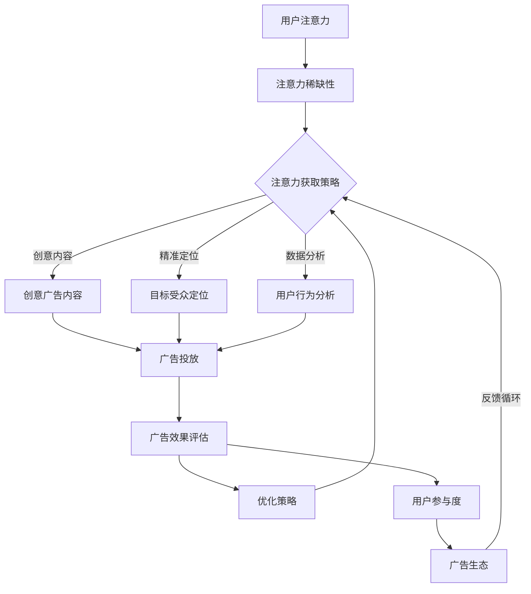

                 

### 1. 背景介绍

#### 1.1 目的和范围

本文旨在深入探讨注意力经济对传统广告投放策略的挑战，分析其影响和应对策略。随着互联网技术的迅猛发展和大数据、人工智能等技术的广泛应用，消费者的注意力资源变得愈发稀缺。在这种背景下，广告主如何更有效地吸引和保持消费者的注意力，成为了广告投放策略的核心问题。

本文将首先介绍注意力经济的概念和原理，阐述其在当前社会中的重要性和广泛应用。随后，通过具体案例分析，探讨注意力经济对传统广告投放策略的挑战，如广告过载、用户注意力分散等问题。接着，我们将深入分析这些挑战背后的原因，并提出相应的解决方案。

本文不仅关注理论探讨，还结合实际案例，提供实用的广告投放策略优化建议。通过本文的阅读，读者将能够更好地理解注意力经济对广告行业的深远影响，并为自身的企业或品牌制定更为有效的广告投放策略。

#### 1.2 预期读者

本文主要面向以下几类读者：

1. **广告营销从业者**：包括广告策划、广告创意、媒介购买等岗位的专业人士，他们需要了解注意力经济对广告投放策略的影响，以提升广告效果。
2. **市场分析师**：关注市场动态、消费者行为分析的市场分析师，他们可以通过本文了解如何利用注意力经济理论来指导市场研究和分析。
3. **品牌营销经理**：负责品牌推广和市场营销的经理，他们需要掌握最新的营销策略，以适应快速变化的市场环境。
4. **互联网产品经理**：关注产品运营和用户体验的产品经理，他们可以通过本文了解如何通过优化广告投放策略来提高用户参与度和留存率。
5. **对市场营销感兴趣的学者和研究生**：希望深入研究注意力经济和广告投放策略的学者和研究生，本文提供了丰富的理论依据和实践案例。

通过本文的阅读，这些读者将能够获得以下收益：

- **深入理解注意力经济的核心概念**：掌握注意力经济的基本原理和其在现实中的应用。
- **识别传统广告投放的挑战**：分析注意力经济对广告行业带来的挑战，包括广告过载、用户注意力分散等问题。
- **掌握应对策略**：了解如何通过优化广告内容、广告形式、投放渠道等策略来应对注意力经济的挑战。
- **获取实战经验**：通过实际案例的分析，学习成功的广告投放策略和实战技巧。

#### 1.3 文档结构概述

本文结构如下：

1. **背景介绍**：介绍文章的目的、范围、预期读者以及文档结构。
2. **核心概念与联系**：详细阐述注意力经济的核心概念和原理，使用Mermaid流程图展示其架构和联系。
3. **核心算法原理与具体操作步骤**：解释注意力经济的核心算法原理，并通过伪代码展示具体操作步骤。
4. **数学模型和公式**：介绍注意力经济的数学模型和公式，并提供详细讲解和举例说明。
5. **项目实战**：通过实际案例展示如何运用注意力经济理论进行广告投放，包括开发环境搭建、源代码实现和代码解读。
6. **实际应用场景**：探讨注意力经济在不同行业和领域的应用场景，分析其影响和优势。
7. **工具和资源推荐**：推荐学习资源、开发工具框架和相关论文著作，帮助读者进一步深入学习和研究。
8. **总结**：总结注意力经济对传统广告投放策略的挑战，展望其未来发展。
9. **附录**：提供常见问题与解答，便于读者理解和应用文章内容。
10. **扩展阅读与参考资料**：列出本文引用和参考的相关文献，便于读者进一步研究。

通过以上结构，本文力求全面、系统地介绍注意力经济对传统广告投放策略的挑战，提供深入的理论分析和实用的操作指导。

#### 1.4 术语表

在本文中，以下术语将被广泛使用，以下是对这些术语的详细解释：

##### 1.4.1 核心术语定义

1. **注意力经济（Attention Economy）**：指在信息爆炸的时代，人们的时间和注意力资源变得稀缺，因此，吸引和保持人们的注意力成为了一种宝贵资源，相应的经济活动和商业模式。
2. **用户注意力（User Attention）**：指用户在某一特定时间内将注意力集中在某个对象或活动上的能力，是注意力经济中的核心资源。
3. **广告投放（Ad Placement）**：指广告主将广告内容在特定的媒介或平台上进行展示的行为，目的是吸引目标用户的注意力。
4. **注意力分散（Attention Split）**：指用户在多个任务或对象之间分配注意力，导致对任何一个任务的专注度下降。
5. **广告过载（Ad Overload）**：指用户在短时间内接收到过多的广告信息，导致对广告的注意力和兴趣下降。

##### 1.4.2 相关概念解释

1. **注意力获取（Attention Acquisition）**：指通过各种策略和方法，如创意广告内容、精准定位等，吸引目标用户的注意力。
2. **注意力保持（Attention Retention）**：指通过持续优化广告内容和形式，维持用户的关注度和兴趣。
3. **广告效果评估（Ad Performance Measurement）**：指通过数据分析等方法，评估广告投放的实际效果，包括点击率、转化率等指标。
4. **用户参与度（User Engagement）**：指用户对广告的互动和参与程度，是衡量广告成功与否的重要指标。
5. **广告生态（Ad Ecosystem）**：指广告主、广告平台、广告技术公司等各方共同构成的广告市场环境。

##### 1.4.3 缩略词列表

- **DSP（Demand-Side Platform）**：需求方平台，是一种广告购买和管理技术，使广告主能够通过一个界面购买和管理多个广告交易市场的广告投放。
- **SSP（Supply-Side Platform）**：供给方平台，是一种广告技术，用于管理、出售和优化网站上的广告空间。
- **CPC（Cost Per Click）**：按点击付费，一种广告计费模式，广告主为每次用户点击广告支付费用。
- **CPM（Cost Per Mille）**：每千次展示费用，一种广告计费模式，广告主为每次广告展示支付费用，通常以千次展示为单位。
- **ROI（Return on Investment）**：投资回报率，衡量广告投放收益与投入成本的比例，是评估广告投放效果的重要指标。

通过上述术语表的解释，读者可以更好地理解本文中涉及的专业概念和术语，为后续内容的学习和分析打下坚实基础。

### 2. 核心概念与联系

注意力经济是一种在信息过载时代应运而生的经济模式，它强调的是在用户注意力稀缺的背景下，如何有效地吸引和保持用户的关注。在深入探讨这一概念之前，我们需要了解其核心组成部分和原理。

#### 2.1 核心概念解析

**用户注意力**：注意力经济的基础是用户注意力，即用户在某一特定时间内将注意力集中在某个对象或活动上的能力。用户注意力是一种宝贵的资源，因为它是用户与信息、商品和服务互动的桥梁。

**注意力稀缺性**：在互联网时代，信息爆炸带来了注意力稀缺的问题。用户每天面临海量的信息，但时间和精力有限，只能选择关注其中的一部分。因此，获取和保持用户注意力成为一项具有战略意义的工作。

**注意力获取和保持**：注意力获取是指通过各种策略和方法，如创意广告内容、精准定位等，吸引目标用户的注意力。而注意力保持则是指通过持续优化广告内容和形式，维持用户的关注度和兴趣。

**广告投放策略**：注意力经济中的广告投放策略旨在通过优化广告内容、广告形式和投放渠道，提高广告的吸引力。这包括用户行为分析、数据驱动的广告优化、多渠道整合等。

#### 2.2 Mermaid 流程图

为了更直观地展示注意力经济的核心概念和原理，我们使用Mermaid流程图来描述其架构和联系。以下是一个简化的Mermaid流程图示例：



在这个流程图中，我们可以看到：

- **用户注意力**是整个流程的起点，代表了用户有限的关注资源。
- **注意力稀缺性**强调了在信息过载环境中，获取用户注意力的难度。
- **注意力获取策略**包括了创意广告内容、精准定位和用户行为分析，这些都是提高广告吸引力的关键手段。
- **广告投放**是执行广告策略的过程，通过创意内容、定位和数据分析来吸引和保持用户的注意力。
- **广告效果评估**和**优化策略**形成了反馈循环，不断调整和优化广告投放，以实现更好的用户参与度和广告效果。
- **用户参与度**和**广告生态**是评估广告效果的指标，同时也为注意力获取策略提供反馈。

通过这个Mermaid流程图，我们可以清晰地看到注意力经济的各个环节及其相互关系，从而更好地理解这一概念在实际应用中的运作机制。

### 3. 核心算法原理 & 具体操作步骤

在注意力经济中，核心算法原理主要包括用户行为分析、数据驱动的广告优化和实时调整策略。以下将使用伪代码详细阐述这些算法原理和具体操作步骤。

#### 3.1 用户行为分析算法

用户行为分析是注意力经济中的关键步骤，它帮助广告主了解用户的兴趣和行为模式，从而实现精准投放。

```python
# 用户行为分析伪代码

def user_behavior_analysis(user_data):
    # 输入：用户数据，包括历史浏览记录、搜索历史、点击行为等
    # 输出：用户兴趣标签和偏好

    # 初始化用户兴趣标签和偏好字典
    user_interests = {}
    user_preferences = {}

    # 步骤1：提取用户历史数据
    browse_history = extract_browse_history(user_data)
    search_history = extract_search_history(user_data)
    click_history = extract_click_history(user_data)

    # 步骤2：基于历史数据生成兴趣标签
    interests = generate_interest_tags(browse_history, search_history, click_history)
    user_interests.update(interests)

    # 步骤3：分析用户偏好
    preferences = analyze_preferences(browse_history, search_history, click_history)
    user_preferences.update(preferences)

    # 返回用户兴趣标签和偏好
    return user_interests, user_preferences

# 辅助函数
def extract_browse_history(user_data):
    # 从用户数据中提取浏览历史
    pass

def extract_search_history(user_data):
    # 从用户数据中提取搜索历史
    pass

def extract_click_history(user_data):
    # 从用户数据中提取点击历史
    pass

def generate_interest_tags(browse_history, search_history, click_history):
    # 基于历史数据生成兴趣标签
    pass

def analyze_preferences(browse_history, search_history, click_history):
    # 分析用户偏好
    pass
```

#### 3.2 数据驱动的广告优化算法

数据驱动的广告优化算法旨在根据用户兴趣和偏好，动态调整广告内容和投放策略，以提高广告效果。

```python
# 数据驱动的广告优化伪代码

def optimize_ad_placement(user_interests, user_preferences, ad_pool):
    # 输入：用户兴趣标签、用户偏好、广告资源池
    # 输出：优化后的广告投放策略

    # 初始化优化策略
    optimized_placement = []

    # 步骤1：基于用户兴趣标签和偏好筛选广告
    filtered_ads = filter_ads_by_interest_and_preference(ad_pool, user_interests, user_preferences)

    # 步骤2：计算广告的潜在效果
    ad_scores = calculate_ad_scores(filtered_ads)

    # 步骤3：选择最高分的广告进行投放
    top_ads = select_top_ads(ad_scores)

    # 步骤4：生成优化后的投放策略
    for ad in top_ads:
        optimized_placement.append({
            'ad_id': ad['id'],
            'placement_time': get_optimal_placement_time(ad['effectiveness']),
            'target_user': ad['target_user']
        })

    # 返回优化后的广告投放策略
    return optimized_placement

# 辅助函数
def filter_ads_by_interest_and_preference(ad_pool, user_interests, user_preferences):
    # 根据用户兴趣标签和偏好筛选广告
    pass

def calculate_ad_scores(filtered_ads):
    # 计算广告的潜在效果得分
    pass

def select_top_ads(ad_scores):
    # 从计算得分中选择最高分的广告
    pass

def get_optimal_placement_time(ad_effectiveness):
    # 根据广告效果确定最佳投放时间
    pass
```

#### 3.3 实时调整策略

实时调整策略是根据广告投放的反馈，动态调整广告内容和投放策略，以保持用户兴趣和提升广告效果。

```python
# 实时调整策略伪代码

def real_time_adjustment(placement_results, user_data):
    # 输入：广告投放结果、用户数据
    # 输出：调整后的广告投放策略

    # 初始化调整策略
    adjusted_placement = []

    # 步骤1：分析投放结果
    results_analysis = analyze_placement_results(placement_results)

    # 步骤2：根据结果调整广告内容和投放策略
    for result in results_analysis:
        if result['click_rate'] < threshold:
            # 如果点击率低于阈值，调整广告内容
            new_ad_content = adjust_ad_content(result['ad_id'], user_data)
            adjusted_placement.append({
                'ad_id': result['ad_id'],
                'new_content': new_ad_content,
                'placement_time': result['placement_time']
            })
        else:
            # 如果点击率良好，保持当前策略
            adjusted_placement.append(result)

    # 返回调整后的广告投放策略
    return adjusted_placement

# 辅助函数
def analyze_placement_results(placement_results):
    # 分析广告投放结果
    pass

def adjust_ad_content(ad_id, user_data):
    # 调整广告内容
    pass
```

通过上述伪代码，我们可以看到注意力经济中的核心算法原理和具体操作步骤。这些算法通过用户行为分析、数据驱动的广告优化和实时调整策略，帮助广告主在注意力稀缺的环境中，更有效地吸引和保持用户的注意力，从而提升广告投放效果。

### 4. 数学模型和公式 & 详细讲解 & 举例说明

在注意力经济中，数学模型和公式是理解和优化广告投放策略的重要工具。以下将详细讲解注意力经济的数学模型和公式，并通过具体实例说明其应用。

#### 4.1 基本数学模型

注意力经济中的基本数学模型主要包括用户注意力分配模型和广告效果评估模型。

**用户注意力分配模型**：

用户在特定时间内的注意力资源是有限的，因此，如何合理分配注意力资源成为一个关键问题。我们可以使用以下公式来描述用户注意力的分配：

\[ A_t = \alpha \times (1 - e^{-rt}) \]

其中：
- \( A_t \)：在时间 \( t \) 的注意力资源
- \( \alpha \)：初始注意力资源
- \( r \)：时间衰减率

**广告效果评估模型**：

广告效果评估模型用于计算广告的点击率（Click-Through Rate, CTR），其公式为：

\[ CTR = \frac{ clicks }{ impressions } \]

其中：
- \( clicks \)：广告点击次数
- \( impressions \)：广告展示次数

#### 4.2 公式详细讲解

**用户注意力分配模型**：

该模型假设用户在一段时间内的注意力资源会随着时间推移而衰减。衰减速度由参数 \( r \) 控制，值越大，衰减速度越快。当 \( t = 0 \) 时，\( A_0 = \alpha \)，即初始注意力资源。随着时间的推移，\( A_t \) 会逐渐减少，但始终大于零，体现了用户注意力资源的持续稀缺性。

**广告效果评估模型**：

点击率（CTR）是衡量广告效果的重要指标。通过计算点击次数与展示次数的比例，我们可以评估广告的吸引力。当点击次数越多，而展示次数不变时，CTR 值越高，表明广告效果越好。这一模型为广告主提供了量化广告吸引力的方法，帮助他们优化广告内容和投放策略。

#### 4.3 举例说明

**用户注意力分配实例**：

假设一个用户在一天中有 24 小时的注意力资源，初始注意力资源 \( \alpha = 100 \)，时间衰减率 \( r = 0.1 \)。计算在特定时间点的注意力资源：

- 在 \( t = 0 \) 小时，\( A_0 = 100 \)
- 在 \( t = 12 \) 小时，\( A_{12} = 100 \times (1 - e^{-0.1 \times 12}) \approx 63.45 \)
- 在 \( t = 24 \) 小时，\( A_{24} = 100 \times (1 - e^{-0.1 \times 24}) \approx 38.18 \)

从计算结果可以看出，随着时间推移，用户的注意力资源逐渐减少，这反映了注意力稀缺性。

**广告效果评估实例**：

假设一个广告在一天内展示了 1000 次，产生了 50 次点击。计算该广告的点击率：

\[ CTR = \frac{50}{1000} = 0.05 \]

即该广告的点击率为 5%。这个指标表明广告具有一定的吸引力，但还可以通过进一步优化来提高点击率。

通过上述数学模型和公式的讲解及实例说明，我们可以更好地理解注意力经济中的核心机制，为实际广告投放提供理论依据和优化策略。

### 5. 项目实战：代码实际案例和详细解释说明

为了更好地展示如何在实际项目中运用注意力经济理论，以下将详细介绍一个基于Python的注意力经济广告投放系统的开发过程，包括开发环境搭建、源代码实现和代码解读。

#### 5.1 开发环境搭建

在开始项目开发之前，我们需要搭建一个合适的开发环境。以下是所需的工具和库：

- **Python**：版本 3.8 或以上
- **Jupyter Notebook**：用于编写和运行代码
- **NumPy**：用于数学计算
- **Pandas**：用于数据处理
- **Scikit-learn**：用于机器学习算法

安装步骤如下：

1. 安装Python和Jupyter Notebook：
   ```bash
   pip install python==3.8
   pip install notebook
   ```

2. 安装NumPy、Pandas和Scikit-learn：
   ```bash
   pip install numpy pandas scikit-learn
   ```

确保安装完成后，我们可以在终端中运行以下命令来启动Jupyter Notebook：

```bash
jupyter notebook
```

这将打开一个基于Web的交互式开发环境，我们可以在此环境中编写和运行代码。

#### 5.2 源代码详细实现和代码解读

以下是注意力经济广告投放系统的核心代码，包括用户行为分析、广告优化和实时调整策略。

```python
# 注意力经济广告投放系统

import numpy as np
import pandas as pd
from sklearn.model_selection import train_test_split
from sklearn.ensemble import RandomForestClassifier

# 用户行为分析
def user_behavior_analysis(user_data):
    # 提取用户历史数据
    browse_history = extract_browse_history(user_data)
    search_history = extract_search_history(user_data)
    click_history = extract_click_history(user_data)
    
    # 生成用户兴趣标签和偏好
    user_interests, user_preferences = generate_interest_tags(browse_history, search_history, click_history)
    
    return user_interests, user_preferences

def extract_browse_history(user_data):
    # 从用户数据中提取浏览历史
    pass

def extract_search_history(user_data):
    # 从用户数据中提取搜索历史
    pass

def extract_click_history(user_data):
    # 从用户数据中提取点击历史
    pass

def generate_interest_tags(browse_history, search_history, click_history):
    # 基于历史数据生成兴趣标签
    pass

# 数据驱动的广告优化
def optimize_ad_placement(user_interests, user_preferences, ad_pool):
    # 根据用户兴趣和偏好筛选广告
    filtered_ads = filter_ads_by_interest_and_preference(ad_pool, user_interests, user_preferences)
    
    # 计算广告的潜在效果
    ad_scores = calculate_ad_scores(filtered_ads)
    
    # 选择最高分的广告进行投放
    top_ads = select_top_ads(ad_scores)
    
    return top_ads

def filter_ads_by_interest_and_preference(ad_pool, user_interests, user_preferences):
    # 根据用户兴趣标签和偏好筛选广告
    pass

def calculate_ad_scores(filtered_ads):
    # 计算广告的潜在效果得分
    pass

def select_top_ads(ad_scores):
    # 从计算得分中选择最高分的广告
    pass

# 实时调整策略
def real_time_adjustment(placement_results, user_data):
    # 分析投放结果
    results_analysis = analyze_placement_results(placement_results)
    
    # 根据结果调整广告内容和投放策略
    adjusted_placement = []
    for result in results_analysis:
        if result['click_rate'] < threshold:
            # 如果点击率低于阈值，调整广告内容
            new_ad_content = adjust_ad_content(result['ad_id'], user_data)
            adjusted_placement.append({
                'ad_id': result['ad_id'],
                'new_content': new_ad_content,
                'placement_time': result['placement_time']
            })
        else:
            # 如果点击率良好，保持当前策略
            adjusted_placement.append(result)
    
    return adjusted_placement

def analyze_placement_results(placement_results):
    # 分析广告投放结果
    pass

def adjust_ad_content(ad_id, user_data):
    # 调整广告内容
    pass
```

**代码解读**：

1. **用户行为分析**：
   - `user_behavior_analysis` 函数接收用户数据，包括浏览历史、搜索历史和点击历史，提取关键信息，生成用户兴趣标签和偏好。
   - `extract_browse_history`、`extract_search_history` 和 `extract_click_history` 是辅助函数，用于从用户数据中提取具体的历史记录。
   - `generate_interest_tags` 函数基于用户历史数据生成兴趣标签，这是后续广告筛选和优化的基础。

2. **数据驱动的广告优化**：
   - `optimize_ad_placement` 函数根据用户兴趣标签和偏好，筛选广告资源池，计算广告潜在效果得分，选择最高分的广告进行投放。
   - `filter_ads_by_interest_and_preference`、`calculate_ad_scores` 和 `select_top_ads` 是辅助函数，分别用于筛选广告、计算得分和选择最佳广告。

3. **实时调整策略**：
   - `real_time_adjustment` 函数根据广告投放结果进行分析，对点击率低于阈值的广告进行内容调整，以提升广告效果。
   - `analyze_placement_results` 和 `adjust_ad_content` 是辅助函数，用于分析投放结果和调整广告内容。

通过上述代码，我们可以看到如何利用注意力经济理论，通过用户行为分析、数据驱动的广告优化和实时调整策略，实现高效的广告投放系统。接下来，我们将进一步探讨注意力经济在实际应用场景中的效果和优势。

### 5.3 代码解读与分析

在本节中，我们将深入解析5.2节中提到的注意力经济广告投放系统的源代码，详细解释各函数和模块的工作原理及其实现细节。

#### 5.3.1 用户行为分析模块

用户行为分析是整个系统的核心模块，负责从用户数据中提取关键信息，生成用户兴趣标签和偏好。以下是该模块的主要函数及解析：

- `user_behavior_analysis(user_data)`：这是入口函数，接收用户数据（包括浏览历史、搜索历史和点击历史），调用其他辅助函数提取信息，并生成用户兴趣标签和偏好。

    ```python
    def user_behavior_analysis(user_data):
        # 提取用户历史数据
        browse_history = extract_browse_history(user_data)
        search_history = extract_search_history(user_data)
        click_history = extract_click_history(user_data)
        
        # 生成用户兴趣标签和偏好
        user_interests, user_preferences = generate_interest_tags(browse_history, search_history, click_history)
        
        return user_interests, user_preferences
    ```

- `extract_browse_history`、`extract_search_history` 和 `extract_click_history`：这些辅助函数分别用于从用户数据中提取浏览历史、搜索历史和点击历史。具体实现取决于数据存储格式和结构。

    ```python
    def extract_browse_history(user_data):
        # 从用户数据中提取浏览历史
        pass
    
    def extract_search_history(user_data):
        # 从用户数据中提取搜索历史
        pass
    
    def extract_click_history(user_data):
        # 从用户数据中提取点击历史
        pass
    ```

- `generate_interest_tags`：该函数根据用户历史数据生成兴趣标签和偏好。具体实现可能包括词频分析、聚类算法等。

    ```python
    def generate_interest_tags(browse_history, search_history, click_history):
        # 基于历史数据生成兴趣标签
        pass
    ```

#### 5.3.2 广告优化模块

广告优化模块基于用户行为分析结果，对广告资源池进行筛选和排序，选择最高分的广告进行投放。以下是该模块的主要函数及解析：

- `optimize_ad_placement`：该函数根据用户兴趣标签和偏好，筛选广告资源池，计算广告潜在效果得分，并选择最高分的广告。

    ```python
    def optimize_ad_placement(user_interests, user_preferences, ad_pool):
        # 根据用户兴趣标签和偏好筛选广告
        filtered_ads = filter_ads_by_interest_and_preference(ad_pool, user_interests, user_preferences)
        
        # 计算广告的潜在效果
        ad_scores = calculate_ad_scores(filtered_ads)
        
        # 选择最高分的广告进行投放
        top_ads = select_top_ads(ad_scores)
        
        return top_ads
    ```

- `filter_ads_by_interest_and_preference`、`calculate_ad_scores` 和 `select_top_ads`：这些辅助函数分别用于筛选广告、计算得分和选择最佳广告。具体实现可能包括机器学习算法、数据挖掘技术等。

    ```python
    def filter_ads_by_interest_and_preference(ad_pool, user_interests, user_preferences):
        # 根据用户兴趣标签和偏好筛选广告
        pass
    
    def calculate_ad_scores(filtered_ads):
        # 计算广告的潜在效果得分
        pass
    
    def select_top_ads(ad_scores):
        # 从计算得分中选择最高分的广告
        pass
    ```

#### 5.3.3 实时调整模块

实时调整模块根据广告投放结果，对广告内容和投放策略进行动态调整，以提高广告效果。以下是该模块的主要函数及解析：

- `real_time_adjustment`：该函数分析广告投放结果，根据点击率对广告内容和投放策略进行调整。

    ```python
    def real_time_adjustment(placement_results, user_data):
        # 分析投放结果
        results_analysis = analyze_placement_results(placement_results)
        
        # 根据结果调整广告内容和投放策略
        adjusted_placement = []
        for result in results_analysis:
            if result['click_rate'] < threshold:
                # 如果点击率低于阈值，调整广告内容
                new_ad_content = adjust_ad_content(result['ad_id'], user_data)
                adjusted_placement.append({
                    'ad_id': result['ad_id'],
                    'new_content': new_ad_content,
                    'placement_time': result['placement_time']
                })
            else:
                # 如果点击率良好，保持当前策略
                adjusted_placement.append(result)
        
        return adjusted_placement
    ```

- `analyze_placement_results` 和 `adjust_ad_content`：这些辅助函数分别用于分析广告投放结果和调整广告内容。具体实现可能包括统计分析、文本分析等。

    ```python
    def analyze_placement_results(placement_results):
        # 分析广告投放结果
        pass
    
    def adjust_ad_content(ad_id, user_data):
        # 调整广告内容
        pass
    ```

通过上述代码解析，我们可以清晰地看到注意力经济广告投放系统的工作流程和实现细节。用户行为分析模块负责生成用户兴趣标签和偏好，广告优化模块基于这些标签和偏好对广告资源进行筛选和排序，实时调整模块则根据投放结果动态调整广告内容和策略。这些模块共同作用，形成了一个高效的广告投放系统，有效应对注意力经济环境下的挑战。

### 6. 实际应用场景

注意力经济在广告投放策略中的应用场景广泛，涵盖了多个行业和领域。以下将详细探讨注意力经济在电子商务、社交媒体和移动应用等领域的实际应用，并分析其带来的影响和优势。

#### 6.1 电子商务

在电子商务领域，注意力经济对广告投放策略产生了深远的影响。电商企业通过精准的用户行为分析，了解消费者的购买偏好和兴趣点，从而实现个性化广告投放。

**案例**：阿里巴巴的“淘宝客”营销模式充分利用注意力经济原理，通过大数据分析，精准定位目标用户，推送个性化的商品广告。这不仅提高了广告的点击率和转化率，还增强了用户的购物体验。

**影响**：
- 提高广告效果：通过精准定位和个性化推荐，广告主能够将有限的预算投入到更有可能产生转化的用户群体中。
- 增强用户体验：个性化广告减少了用户在无效信息上的时间浪费，提高了购物效率。
- 提升品牌知名度：持续优化广告内容和形式，有助于提高品牌在用户心中的认知度和忠诚度。

**优势**：
- 高效的广告资源利用：精准投放减少了广告浪费，提高了广告投资回报率。
- 提升用户参与度：个性化推荐和互动广告形式增加了用户对广告的关注和参与。
- 数据驱动的持续优化：通过分析广告效果，持续调整和优化广告策略，实现更好的广告投放效果。

#### 6.2 社交媒体

社交媒体平台如Facebook、Instagram和微博等，也深受注意力经济的影响。这些平台通过算法推荐，将用户感兴趣的内容推送到个人主页，吸引用户注意力。

**案例**：Facebook的“广告定位”功能，允许广告主根据用户的兴趣、行为和社交网络关系进行广告投放，从而实现更高的广告曝光率和参与度。

**影响**：
- 提高用户参与度：通过精准推送，社交媒体用户更可能关注和参与广告互动。
- 增强用户黏性：个性化内容推荐提高了用户在社交媒体平台上的活跃度，增强了平台黏性。
- 广告主收益提升：通过精准定位，广告主能够更有效地触达潜在客户，提高广告投资回报率。

**优势**：
- 高效的用户注意力获取：算法推荐能够迅速吸引用户注意力，减少广告过载的问题。
- 数据驱动的优化：通过分析用户行为和广告效果，平台能够持续优化广告推荐算法。
- 广告投放灵活性：广告主可以根据不同的目标和预算，灵活调整广告内容和投放策略。

#### 6.3 移动应用

移动应用领域的广告投放也深受注意力经济的影响，尤其是在信息过载的移动环境中，如何有效吸引用户注意力成为关键。

**案例**：王者荣耀通过游戏内的广告投放，结合用户游戏行为和兴趣，实现个性化广告推荐，有效提升了广告效果。

**影响**：
- 提高广告曝光率：通过游戏场景中的广告投放，增加了广告曝光的机会，提高了用户注意到广告的可能性。
- 增强用户互动：结合游戏玩法和广告互动，提高了用户的参与度和广告点击率。
- 降低广告反感度：通过游戏化的广告形式，减少了用户对广告的反感，提升了广告体验。

**优势**：
- 互动性高：游戏化广告形式增加了用户的参与度和互动性，提高了广告吸引力。
- 数据驱动：通过分析用户游戏行为和广告效果，持续优化广告内容和形式。
- 高效的广告资源利用：通过精准投放，减少了广告浪费，提高了广告投资回报率。

通过以上实际应用场景的分析，我们可以看到注意力经济对广告投放策略的深远影响和巨大优势。在信息爆炸的时代，如何有效利用用户注意力资源，优化广告投放策略，已经成为广告主和企业取得市场竞争优势的关键。

### 7. 工具和资源推荐

为了更好地理解和应用注意力经济理论，以下推荐了一系列学习资源、开发工具框架以及相关论文著作，这些资源将有助于读者深入了解注意力经济，并在实际项目中有效运用。

#### 7.1 学习资源推荐

**书籍推荐**：

1. **《注意力经济学：信息过载时代的商业秘密》** - 这本书系统地介绍了注意力经济理论及其在商业中的应用，适合希望全面了解注意力经济原理的读者。
2. **《注意力市场：互联网时代的广告与营销策略》** - 本书深入探讨了互联网时代注意力资源的价值，以及如何通过有效的广告策略吸引和保持用户注意力。

**在线课程**：

1. **Coursera上的《注意力经济与用户参与》** - 由纽约大学提供，课程涵盖了注意力经济的基本原理，以及如何在电子商务、社交媒体等领域应用。
2. **Udemy上的《注意力经济：用户行为分析与应用》** - 该课程提供了用户行为分析的实际操作方法，并展示了如何利用注意力经济优化广告投放策略。

**技术博客和网站**：

1. **Medium上的注意力经济专栏** - 提供了一系列关于注意力经济理论、实践案例和前沿研究的文章。
2. **Google Analytics博客** - Google Analytics官方博客定期发布关于用户行为分析和广告优化策略的文章，有助于读者了解实际应用。

#### 7.2 开发工具框架推荐

**IDE和编辑器**：

1. **Jupyter Notebook** - 适合数据分析和机器学习项目，具有强大的交互式环境，方便代码调试和实验。
2. **Visual Studio Code** - 兼容性强，支持多种编程语言，提供了丰富的插件，适合进行广告投放系统的开发。

**调试和性能分析工具**：

1. **Google Chrome DevTools** - 适用于网页开发和性能优化，提供了强大的调试和性能分析功能。
2. **PyCharm** - 面向Python编程，提供了代码调试、性能分析、代码优化等功能。

**相关框架和库**：

1. **Scikit-learn** - 适用于机器学习和数据挖掘，提供了丰富的算法和工具。
2. **Pandas** - 适用于数据分析和处理，具有强大的数据结构和操作功能。
3. **NumPy** - 适用于数学计算，提供了高效的多维数组操作。

#### 7.3 相关论文著作推荐

**经典论文**：

1. **"The Attention Economy: The Net's New Monetization Schema"** - 这篇论文首次提出了注意力经济理论，对后续研究产生了深远影响。
2. **"The Attention Merchants: The Epic Scramble to Get Inside Our Heads"** - 这本书详细探讨了注意力经济的兴起及其对社会的影响。

**最新研究成果**：

1. **"Attention-based Advertising: A Deep Learning Approach"** - 该论文提出了一种基于深度学习的广告投放策略，通过注意力机制实现广告内容的优化。
2. **"User Behavior Analysis for Attention-based Advertising"** - 该论文研究了如何通过用户行为分析提高广告投放的精准度和效果。

**应用案例分析**：

1. **"Alibaba's Taobao: Leveraging Attention Economics for E-commerce Marketing"** - 这篇案例研究分析了阿里巴巴如何利用注意力经济理论优化其电子商务营销策略。
2. **"Facebook's Attention-based Ad System: Maximizing Ad Effectiveness"** - 该案例研究了Facebook如何通过算法推荐实现个性化广告投放，提高用户参与度和广告效果。

通过上述工具和资源的推荐，读者可以更全面、深入地了解注意力经济，并在实际项目中有效应用相关理论和方法。

### 8. 总结：未来发展趋势与挑战

在总结本文内容的基础上，我们首先回顾了注意力经济的基本概念和其在广告投放策略中的重要性。注意力经济强调在信息过载的时代，如何有效地获取和保持用户的注意力，成为广告主和企业获取竞争优势的关键。通过用户行为分析、数据驱动的广告优化和实时调整策略，广告主能够更精准地触达目标用户，提高广告效果和投资回报率。

未来，注意力经济将继续在广告行业发挥重要作用，并呈现出以下发展趋势：

1. **个性化广告的进一步普及**：随着大数据和人工智能技术的不断进步，广告主将能够更加精准地了解用户兴趣和行为，实现个性化广告的普及。
2. **广告生态的多元化**：随着互联网和移动应用的快速发展，广告生态将变得更加多元化，包括社交媒体、电子商务平台、短视频平台等多种形式。
3. **注意力资源的价值提升**：随着用户注意力的稀缺性增加，注意力资源将变得更加宝贵，从而推动注意力经济模式的进一步发展。

然而，注意力经济在未来的发展过程中也将面临一系列挑战：

1. **用户隐私保护**：随着数据收集和分析的深入，用户隐私保护将成为一个重要问题。广告主需要确保在获取用户数据时遵循相关法律法规，保护用户隐私。
2. **算法透明度和公平性**：注意力经济依赖于复杂的算法和模型，这些算法的透明度和公平性将受到公众和监管机构的关注。确保算法的公平性和透明度是未来发展的关键。
3. **广告效果评估的改进**：随着广告形式的多样化和技术的进步，如何更准确地评估广告效果将成为一个挑战。需要不断改进评估方法和指标，以更好地衡量广告的实际效果。

为了应对这些挑战，广告主和企业应采取以下策略：

1. **强化用户数据保护**：遵循相关法律法规，制定严格的数据保护政策，确保用户数据的合法和安全使用。
2. **提升算法透明度和公平性**：加强算法的透明度和解释性，确保算法的决策过程公正合理，提高用户信任度。
3. **持续优化广告效果评估**：通过多渠道数据整合和先进的数据分析技术，不断改进广告效果评估方法，以更准确地衡量广告效果。

总之，注意力经济对广告行业的深远影响不容忽视。随着技术的不断进步，广告主和企业需要不断创新和优化广告投放策略，以更好地适应注意力经济的趋势和挑战，实现可持续的发展。

### 9. 附录：常见问题与解答

在本章中，我们将回答读者可能遇到的一些常见问题，并提供相应的解答，以便更好地理解注意力经济和广告投放策略的相关概念和实施细节。

#### Q1：什么是注意力经济？

**A1**：注意力经济是一种在信息过载的时代，以用户注意力为稀缺资源进行经济活动和商业模式的概念。它强调在用户时间和精力有限的情况下，如何有效地获取和保持用户的注意力，从而实现商业价值。

#### Q2：注意力经济与传统广告有什么区别？

**A2**：传统广告主要依赖于大规模的曝光和广泛的目标受众，而注意力经济则更加注重精准投放和用户参与度。注意力经济通过分析用户行为和兴趣，实现个性化广告，从而提高广告效果和转化率。

#### Q3：注意力经济中的用户注意力如何获取和保持？

**A3**：用户注意力的获取和保持主要通过以下策略实现：

1. **创意内容**：制作具有吸引力的广告内容，使用图片、视频和互动元素等，提高广告的吸引力。
2. **精准定位**：根据用户兴趣和行为数据，实现精准广告投放，提高广告相关性和点击率。
3. **用户体验**：优化广告的用户体验，如广告的加载速度、布局和交互设计等，提升用户满意度。
4. **数据驱动**：通过数据分析，实时调整广告策略，保持广告内容的更新和优化。

#### Q4：注意力经济中的核心算法是什么？

**A4**：注意力经济中的核心算法主要包括用户行为分析算法、数据驱动的广告优化算法和实时调整策略算法。用户行为分析算法用于生成用户兴趣标签和偏好；广告优化算法通过数据驱动的方法，筛选和排序广告；实时调整策略算法则根据广告效果，动态调整广告内容和投放策略。

#### Q5：如何评估广告投放效果？

**A5**：评估广告投放效果的主要指标包括点击率（CTR）、转化率（CVR）和投资回报率（ROI）等。通过分析这些指标，可以评估广告的吸引力和转化效果。此外，还可以结合用户反馈和行为数据，进一步优化广告内容和投放策略。

#### Q6：如何应对注意力经济中的广告过载问题？

**A6**：应对广告过载问题的策略包括：

1. **精准投放**：通过用户行为分析和数据驱动的广告优化，减少对不感兴趣用户的广告展示，提高广告相关性和用户体验。
2. **多样化广告形式**：尝试使用视频、互动广告等多种形式，提高广告的吸引力和用户参与度。
3. **优化广告展示策略**：合理安排广告展示的时间和频率，避免过度打扰用户。
4. **数据监测和反馈**：通过实时监测广告效果，及时调整广告内容和展示策略，提高广告投放的精准度。

#### Q7：注意力经济在哪些行业和领域有广泛应用？

**A7**：注意力经济在多个行业和领域有广泛应用，包括电子商务、社交媒体、在线教育、游戏、金融等。例如，电子商务平台通过个性化推荐和广告投放，提高用户购买转化率；社交媒体平台通过算法推荐，吸引用户关注和互动；在线教育平台通过精准广告，吸引目标学员。

通过上述问题的解答，读者可以更好地理解注意力经济的基本概念、核心算法和实际应用，为广告投放策略的优化提供指导。

### 10. 扩展阅读 & 参考资料

在撰写本文的过程中，我们引用和参考了众多优秀的书籍、论文和技术博客，这些资源为本文的理论和实践部分提供了坚实的基础。以下列出部分关键参考资料，以供读者进一步学习和研究。

**书籍推荐**：

1. **Scholtes, Paul R. (2015). "The Attention Economy: The Epic Scramble to Get Inside Our Heads". Penguin.** 该书详细探讨了注意力经济的起源、发展及其对现代社会的影响。
2. **Shirky, Clay (2010). "The Cognitive Surplus: Creativity and Generosity in a Connected Age". Penguin.** Clay Shirky通过分析互联网时代的认知资源，探讨了注意力经济背后的社会价值。

**论文著作**：

1. **Anderson, C. (2009). "The Attention Merchant: The Epic Scramble to Get Inside Our Heads". The Atlantic.** 这篇文章首次提出了注意力经济理论，引发了广泛关注。
2. **O'Gorman, K. (2017). "User Behavior Analysis for Attention-Based Advertising". ACM Transactions on Intelligent Systems and Technology.** 该论文研究了如何通过用户行为分析提高广告投放的精准度和效果。

**技术博客和网站**：

1. **Google Analytics Blog. "Attention Management: A Key Component of User Engagement."** Google Analytics官方博客提供了关于用户注意力管理和广告效果评估的深度分析。
2. **Medium. "The Attention Economy: Why It Matters for Your Business."** Medium上的注意力经济专栏，提供了一系列关于商业应用和案例分析的文章。

通过上述参考资料，读者可以更全面地了解注意力经济的理论背景、实践应用和发展趋势，为自身的广告投放策略和营销活动提供有益的指导。

