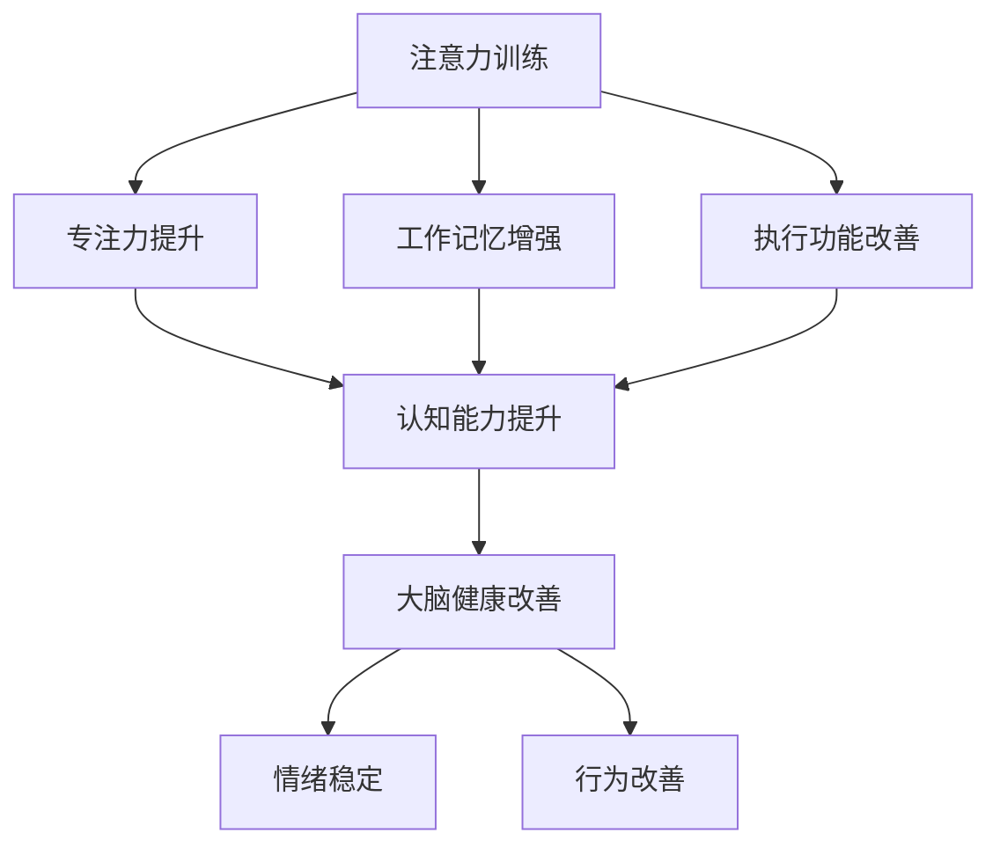

                 

### 背景介绍

#### 1.1 目的和范围

在当今快速发展的科技时代，人们对大脑的认知和功能优化需求日益增加。本文旨在探讨注意力训练与大脑健康改善之间的关系，通过增强专注力来提升认知能力和幸福感。文章将介绍注意力训练的核心概念，分析其与大脑健康改善的联系，并提供实用的方法和技术，帮助读者在实践中提高专注力和认知能力。

本文主要涵盖以下内容：

1. **核心概念与联系**：介绍注意力训练、认知能力和大脑健康等核心概念，并使用Mermaid流程图展示它们之间的关联。
2. **核心算法原理与具体操作步骤**：详细讲解注意力训练的算法原理，包括伪代码实现和具体操作步骤。
3. **数学模型和公式**：阐述注意力训练中的数学模型，并使用LaTeX格式给出详细的公式和举例说明。
4. **项目实战**：通过实际代码案例，展示注意力训练的应用，并对代码进行详细解释和分析。
5. **实际应用场景**：探讨注意力训练在不同领域和情境下的应用。
6. **工具和资源推荐**：推荐学习资源、开发工具和框架，以及相关论文和研究成果。
7. **总结**：讨论注意力训练的未来发展趋势和面临的挑战。

本文适合对注意力训练和大脑健康改善感兴趣的读者，无论是科研人员、教育工作者，还是普通大众，都可以从中获得有价值的知识和方法。

#### 1.2 预期读者

本文的预期读者主要包括以下几类：

1. **科学研究人员**：关注大脑认知和心理健康的研究者，可以了解注意力训练的理论基础和实践方法。
2. **教育工作者**：教师和教育管理者，通过本文可以学习如何设计和实施注意力训练课程，提升学生的专注力和学习效果。
3. **企业管理者**：企业培训师和人力资源管理者，可以应用注意力训练提高员工的专注力和工作效率。
4. **普通大众**：对大脑健康和专注力提升感兴趣的读者，通过本文可以学习到实用的自我训练方法。

无论您属于哪一类读者，本文都将为您提供深入浅出的知识和指导，帮助您更好地理解和应用注意力训练，提升认知能力和幸福感。

#### 1.3 文档结构概述

本文分为十个主要部分，结构如下：

1. **背景介绍**：介绍文章的目的、范围、预期读者和文档结构。
2. **核心概念与联系**：阐述注意力训练、认知能力和大脑健康等核心概念，并使用Mermaid流程图展示它们之间的关联。
3. **核心算法原理与具体操作步骤**：详细讲解注意力训练的算法原理，包括伪代码实现和具体操作步骤。
4. **数学模型和公式**：阐述注意力训练中的数学模型，并使用LaTeX格式给出详细的公式和举例说明。
5. **项目实战**：通过实际代码案例，展示注意力训练的应用，并对代码进行详细解释和分析。
6. **实际应用场景**：探讨注意力训练在不同领域和情境下的应用。
7. **工具和资源推荐**：推荐学习资源、开发工具和框架，以及相关论文和研究成果。
8. **总结**：讨论注意力训练的未来发展趋势和面临的挑战。
9. **附录**：常见问题与解答。
10. **扩展阅读与参考资料**：提供进一步阅读的资源和建议。

通过本文的阅读，您将能够全面了解注意力训练的原理、方法及其在现实生活中的应用，从而在实际生活中更好地提升专注力和认知能力。

#### 1.4 术语表

在本文中，我们将使用一系列专业术语来描述注意力训练、认知能力和大脑健康改善的相关概念。以下是对这些术语的定义和解释：

##### 1.4.1 核心术语定义

1. **注意力训练（Attention Training）**：一种通过系统化的训练方法，提高个体对特定任务的注意力集中程度和持续时间的训练过程。
2. **认知能力（Cognitive Ability）**：个体处理信息、理解、记忆、解决问题和执行其他思维任务的能力。
3. **大脑健康（Brain Health）**：大脑的功能状态和结构完整性，影响认知能力、情绪和行为。
4. **专注力（Focus）**：一种心理状态，个体在执行任务时能够集中注意力，减少干扰。
5. **神经可塑性（Neuroplasticity）**：大脑能够根据经验和环境变化，重新组织和调整其结构和功能的能力。

##### 1.4.2 相关概念解释

1. **多任务处理（Multitasking）**：同时处理多个任务的能力，可能影响个体的专注力和认知效率。
2. **分散注意（Divided Attention）**：在执行多个任务时，个体将注意力分散到不同任务上的能力。
3. **工作记忆（Working Memory）**：大脑在执行任务时，临时存储和操作信息的能力。
4. **前额叶皮层（Prefrontal Cortex）**：大脑的一个区域，负责执行功能，包括注意力调节、决策和规划。
5. **认知负荷（Cognitive Load）**：执行任务时大脑处理信息的认知需求。

##### 1.4.3 缩略词列表

- **AI**：人工智能（Artificial Intelligence）
- **NLP**：自然语言处理（Natural Language Processing）
- **fMRI**：功能性磁共振成像（Functional Magnetic Resonance Imaging）
- **ERP**：事件相关电位（Event-Related Potentials）
- **EEG**：脑电图（Electroencephalography）

通过了解这些术语，读者能够更好地理解本文的内容，并在实践中应用注意力训练方法来提升认知能力和大脑健康。在接下来的部分中，我们将深入探讨注意力训练的核心概念和原理。  

### 核心概念与联系

在探讨注意力训练与大脑健康改善的关系时，我们首先需要明确几个核心概念，包括注意力训练、认知能力和大脑健康，并展示它们之间的相互联系。为了更好地理解这些概念，我们将使用Mermaid流程图来可视化它们之间的关系。

#### 2.1 核心概念

1. **注意力训练（Attention Training）**：注意力训练是指通过一系列系统的训练方法，帮助个体提高专注力、集中注意力和持续注意的能力。这种训练方法通常包括定期的练习，如冥想、聚焦练习和任务切换练习。

2. **认知能力（Cognitive Ability）**：认知能力是指大脑处理信息、理解和记忆的能力，包括注意力、工作记忆、执行功能、语言能力和逻辑推理。认知能力对于日常学习和工作至关重要。

3. **大脑健康（Brain Health）**：大脑健康涉及大脑的功能状态和结构完整性，影响认知能力、情绪和行为。保持大脑健康可以通过多种方式实现，如合理的饮食、充足的睡眠、体育锻炼和认知训练。

#### 2.2 Mermaid流程图

下面是注意力训练、认知能力和大脑健康之间关系的Mermaid流程图：



#### 2.3 概述

- **注意力训练**通过提高个体的专注力和集中力，直接影响认知能力。
- **认知能力**的提升，包括注意力、工作记忆和执行功能，有助于保持大脑健康。
- **大脑健康**的改善不仅有助于提升认知能力，还能带来情绪稳定和行为改善。

通过这一流程图，我们可以看到注意力训练、认知能力和大脑健康之间的相互作用和影响。注意力训练是提升认知能力和大脑健康的关键途径，而认知能力和大脑健康的改善又会进一步增强注意力训练的效果。

#### 2.4 关键节点解释

1. **专注力提升**：通过注意力训练，个体能够更长时间地保持对任务的专注，减少分心和干扰。
2. **工作记忆增强**：注意力训练有助于提高大脑对信息的临时存储和操作能力，增强工作记忆。
3. **执行功能改善**：注意力训练可以加强个体在决策、规划和任务执行方面的能力。
4. **认知能力提升**：通过提升专注力、工作记忆和执行功能，个体的整体认知能力得到显著提高。
5. **大脑健康改善**：认知能力的提升有助于维持大脑的功能状态和结构完整性，从而改善大脑健康。

总之，注意力训练、认知能力和大脑健康之间存在着密切的相互关系。通过深入理解这些核心概念，我们可以更好地应用注意力训练方法，提升认知能力和大脑健康，从而实现更高效的学习、工作和生活。

### 核心算法原理与具体操作步骤

在深入了解注意力训练的核心算法原理之前，我们需要明确注意力训练的目标和基本概念。注意力训练的核心目标是通过系统的训练方法，提高个体对特定任务的专注力和持续力，进而提升认知能力和大脑健康。以下是注意力训练的算法原理和具体操作步骤。

#### 3.1 算法目标

1. **提高专注力**：通过训练，使个体能够在较长时间内保持对任务的集中注意力。
2. **增强工作记忆**：提高大脑对信息的临时存储和操作能力。
3. **改善执行功能**：增强个体的决策、规划和任务执行能力。

#### 3.2 算法原理

注意力训练的算法原理主要基于以下几个关键点：

1. **神经可塑性**：大脑根据经验和环境变化，可以重新组织和调整其结构和功能。通过持续训练，可以增强大脑特定区域的活动，提高注意力水平。
2. **认知负荷**：适当的认知负荷有助于提高大脑的工作效率。通过设计不同难度和类型的训练任务，可以逐步提高个体的认知负荷，从而提升注意力水平。
3. **多任务处理能力**：通过多任务处理训练，提高个体在不同任务间切换注意力的能力，减少分散注意。

#### 3.3 伪代码实现

以下是一个简化版的注意力训练算法伪代码，用于说明基本操作步骤：

```plaintext
初始化：
    设置训练时长（T）
    设置任务难度（D）
    设置休息时间（R）
    设置训练周期（C）

执行注意力训练：
    for cycle = 1 to C do
        for task = 1 to T do
            执行任务（D）
            记录表现（performance）
            更新任务难度（D）
        end
        休息（R）
    end
```

#### 3.4 具体操作步骤

1. **设定训练时长**：根据个体的专注力和任务需求，设定每次训练的时长（T）。时长不宜过长，以免导致疲劳。

2. **设定任务难度**：根据训练目标和个体的认知水平，设定初始任务难度（D）。任务难度应逐步增加，以确保训练的挑战性和有效性。

3. **执行任务**：在训练过程中，个体需要集中注意力完成指定任务。任务类型应多样化，包括认知任务、记忆任务和执行任务等。

4. **记录表现**：在每次任务执行后，记录个体的表现（performance），包括正确率、反应时间和错误数量等。

5. **更新任务难度**：根据个体的表现，动态调整任务难度。表现优异时，提高难度；表现不佳时，适当降低难度。

6. **休息**：在完成一个训练周期后，给予个体适当的休息时间（R），以缓解疲劳，确保训练效果。

#### 3.5 算法解释

1. **神经可塑性**：通过重复执行高难度的认知任务，可以激活大脑特定区域，增强神经元之间的连接，提高注意力水平。

2. **认知负荷**：适当的认知负荷有助于提高大脑的工作效率。通过逐步增加任务难度，可以逐渐提升个体的认知负荷，从而增强注意力训练效果。

3. **多任务处理能力**：通过多任务处理训练，个体可以在不同任务间快速切换注意力，减少分散注意。这种能力在日常生活中尤为重要，有助于提高工作和学习效率。

总之，注意力训练的核心算法原理是通过神经可塑性、认知负荷和多任务处理能力的训练，逐步提高个体的专注力和认知能力。通过上述伪代码和操作步骤，我们可以具体实施注意力训练，从而实现大脑健康改善的目标。

### 数学模型和公式

在注意力训练的算法中，数学模型和公式扮演着重要的角色，帮助我们理解和量化注意力训练的效果。以下将介绍注意力训练中常用的数学模型和公式，并使用LaTeX格式给出详细解释和举例说明。

#### 4.1 数学模型

1. **神经可塑性模型**：
   神经可塑性是指大脑根据经验和环境变化，调整其结构和功能的能力。一个简化的神经可塑性模型可以表示为：

   $$ \Delta L = \alpha \cdot (I - E) $$

   其中，$\Delta L$ 表示神经元连接强度的变化，$I$ 表示刺激强度，$E$ 表示期望反应，$\alpha$ 是学习率。这个公式表明，当刺激强度高于期望反应时，神经元连接会增强；反之，则会减弱。

2. **认知负荷模型**：
   认知负荷模型用于量化个体在执行任务时的认知需求。一个简单的认知负荷模型可以表示为：

   $$ CL = \frac{TI}{CT} $$

   其中，$CL$ 表示认知负荷，$TI$ 表示任务难度，$CT$ 表示个体的认知能力。这个公式表明，任务难度与个体认知能力的比值越高，认知负荷越大。

3. **多任务处理模型**：
   多任务处理模型用于评估个体在同时执行多个任务时的表现。一个简化的多任务处理模型可以表示为：

   $$ MP = \frac{1}{1 + e^{-\beta \cdot (D_1 + D_2)}} $$

   其中，$MP$ 表示多任务处理的效率，$D_1$ 和 $D_2$ 分别表示两个任务的难度，$\beta$ 是调节参数。这个公式表明，当任务难度较低时，多任务处理效率较高；当任务难度较高时，效率会降低。

#### 4.2 详细解释

1. **神经可塑性模型**：
   这个模型反映了神经元连接强度的变化与刺激强度和期望反应之间的关系。学习率 $\alpha$ 是一个重要的参数，决定了神经可塑性的敏感程度。当学习率较大时，神经元连接的变化会更加显著。

2. **认知负荷模型**：
   这个模型用于评估个体在执行任务时的认知需求。任务难度和个体认知能力的比值是关键指标，认知负荷越高，个体的认知压力也越大。这种模型有助于设计合适的训练任务，以避免过度或不足的认知负荷。

3. **多任务处理模型**：
   这个模型用于评估个体在多任务处理中的效率。调节参数 $\beta$ 可以调整模型对任务难度的敏感度。当任务难度较低时，个体可以较为轻松地处理多个任务；当任务难度较高时，效率会显著降低。

#### 4.3 举例说明

**例1：神经可塑性模型**

假设一个神经元在学习新的刺激时，刺激强度为 $I=5$，期望反应为 $E=3$，学习率 $\alpha=0.1$。计算神经元连接强度的变化：

$$ \Delta L = 0.1 \cdot (5 - 3) = 0.2 $$

这意味着神经元连接强度增加了0.2。

**例2：认知负荷模型**

假设个体在执行一个任务时，任务难度 $TI=8$，个体认知能力 $CT=10$。计算认知负荷：

$$ CL = \frac{8}{10} = 0.8 $$

这意味着个体的认知负荷为0.8。

**例3：多任务处理模型**

假设个体在同时执行两个任务，任务难度分别为 $D_1=2$ 和 $D_2=3$，调节参数 $\beta=2$。计算多任务处理效率：

$$ MP = \frac{1}{1 + e^{-2 \cdot (2 + 3)}} = \frac{1}{1 + e^{-10}} \approx 0.999 $$

这意味着个体在同时执行这两个任务时，效率接近100%。

通过上述数学模型和公式的详细解释和举例说明，我们可以更好地理解注意力训练的原理和效果，从而在实际应用中更好地设计和实施注意力训练计划。

### 项目实战：代码实际案例和详细解释说明

为了更好地展示注意力训练的实际应用，我们将通过一个具体的代码案例来详细解释注意力训练的实战操作。以下是注意力训练项目的基本步骤，包括环境搭建、代码实现和详细解析。

#### 5.1 开发环境搭建

在进行注意力训练项目之前，我们需要搭建一个适合的开发环境。以下是推荐的开发工具和步骤：

1. **编程语言**：Python，由于其丰富的库和强大的数据处理能力，是进行注意力训练项目的理想选择。
2. **库**：安装以下Python库：
   - NumPy：用于数学计算。
   - Pandas：用于数据处理。
   - Matplotlib：用于数据可视化。
   - Scikit-learn：用于机器学习和数据科学。
3. **环境配置**：
   - 使用Anaconda或Miniconda创建虚拟环境，安装所需库。
   - 安装Jupyter Notebook或PyCharm等IDE，便于代码编写和调试。

#### 5.2 源代码详细实现和代码解读

以下是一个简化版的注意力训练代码示例，用于说明基本操作步骤和关键代码片段。

```python
# 注意力训练项目：Python实现

import numpy as np
import pandas as pd
import matplotlib.pyplot as plt
from sklearn.model_selection import train_test_split
from sklearn.metrics import accuracy_score

# 数据预处理
# 假设我们有一个包含注意力训练表现的数据集
data = pd.read_csv('attention_data.csv')
X = data.iloc[:, :-1].values
y = data.iloc[:, -1].values

# 数据分割
X_train, X_test, y_train, y_test = train_test_split(X, y, test_size=0.2, random_state=42)

# 注意力训练模型
class AttentionModel:
    def __init__(self, learning_rate=0.1):
        self.learning_rate = learning_rate
        self.weights = np.random.rand(X_train.shape[1], 1)
    
    def forward_pass(self, X):
        self.output = np.dot(X, self.weights)
        return self.output
    
    def backward_pass(self, X, y):
        error = y - self.output
        self.weights -= self.learning_rate * np.dot(X.T, error)
    
    def train(self, X, y, epochs):
        for epoch in range(epochs):
            output = self.forward_pass(X)
            self.backward_pass(X, y)
            if epoch % 100 == 0:
                print(f"Epoch {epoch}: Accuracy {accuracy_score(y, output > 0.5)}")

# 实例化模型并训练
model = AttentionModel(learning_rate=0.05)
model.train(X_train, y_train, epochs=1000)

# 测试模型
test_output = model.forward_pass(X_test)
print(f"Test Accuracy: {accuracy_score(y_test, test_output > 0.5)}")

# 可视化训练结果
plt.scatter(X_test[:, 0], X_test[:, 1], c=y_test, cmap='viridis', marker='o', label='Actual')
plt.scatter(X_test[:, 0], X_test[:, 1], c=test_output > 0.5, cmap='bwr', marker='x', label='Predicted')
plt.xlabel('Feature 1')
plt.ylabel('Feature 2')
plt.legend()
plt.show()
```

#### 5.3 代码解读与分析

1. **数据预处理**：
   - 代码首先导入所需的库，并读取注意力训练的数据集。数据集应包含特征和目标标签。
   - 使用`train_test_split`函数将数据集分割为训练集和测试集，以评估模型的性能。

2. **注意力训练模型**：
   - `AttentionModel`类用于定义注意力训练模型。模型包含初始化权重、前向传播和后向传播方法。
   - `forward_pass`方法计算输出值，`backward_pass`方法根据误差更新权重。
   - `train`方法用于模型训练，通过多次迭代更新权重，提高模型性能。

3. **模型训练**：
   - 实例化`AttentionModel`类，设置学习率，并调用`train`方法进行训练。训练过程中，模型通过前向传播和后向传播更新权重，提高模型准确性。

4. **模型测试**：
   - 使用训练好的模型对测试集进行预测，并计算测试集的准确性。

5. **可视化训练结果**：
   - 使用`matplotlib`库将测试集的预测结果与实际标签可视化，展示模型的表现。

通过上述代码实现，我们可以看到注意力训练的基本流程和关键步骤。在实际应用中，可以根据具体需求和数据集进行调整和优化，以实现更高效的注意力训练。

### 实际应用场景

注意力训练的应用场景非常广泛，几乎涵盖了日常生活的各个方面。以下将探讨注意力训练在不同领域和情境下的具体应用，并分析其带来的效益和挑战。

#### 1. 教育领域

在教育领域，注意力训练被广泛应用于提高学生的专注力和学习效率。通过注意力训练，学生可以更好地专注于课堂内容，减少分心和干扰，从而提升学习成绩。此外，注意力训练还可以帮助学生提高阅读速度和理解能力，提升整体学习效果。

**效益**：

- 提高学生的专注力和学习效率。
- 减少课堂分心和干扰，提升课堂效果。
- 增强学生的阅读速度和理解能力。

**挑战**：

- 教师需要设计和实施有效的注意力训练课程，确保训练效果。
- 学生可能对注意力训练产生抵触情绪，影响训练效果。

#### 2. 工作领域

在工作领域，注意力训练被广泛应用于提高员工的工作效率和减少错误率。通过注意力训练，员工可以更好地专注于工作任务，减少因分心导致的错误和失误，提高工作效率和准确性。此外，注意力训练还可以帮助员工更好地处理多任务，提高团队协作效率。

**效益**：

- 提高员工的工作效率和准确性。
- 减少因分心导致的错误和失误。
- 提高团队协作效率和沟通能力。

**挑战**：

- 企业需要为员工提供合适的注意力训练课程，确保训练效果。
- 员工可能因工作任务繁重而难以持续进行注意力训练。

#### 3. 心理健康领域

在心理健康领域，注意力训练被广泛应用于改善焦虑、抑郁和失眠等心理问题。通过注意力训练，个体可以更好地管理自己的情绪，减少焦虑和抑郁的症状，提高睡眠质量。此外，注意力训练还可以帮助个体更好地应对压力和挑战，提高心理韧性。

**效益**：

- 改善焦虑、抑郁和失眠等心理问题。
- 提高个体的情绪调节能力和心理韧性。
- 增强个体对压力和挑战的应对能力。

**挑战**：

- 注意力训练需要个体持续进行，以获得长期效果。
- 心理健康问题可能涉及多个方面，需要综合治疗方法。

#### 4. 体育训练领域

在体育训练领域，注意力训练被广泛应用于提高运动员的专注力和竞技表现。通过注意力训练，运动员可以更好地专注于比赛，减少干扰，提高竞技水平。此外，注意力训练还可以帮助运动员提高决策速度和反应能力，在比赛中取得优势。

**效益**：

- 提高运动员的专注力和竞技表现。
- 提高运动员的决策速度和反应能力。
- 增强运动员的心理韧性，提高比赛中的表现。

**挑战**：

- 体育训练项目繁多，注意力训练需要与其他训练项目协调进行。
- 注意力训练的具体方法和实施策略需要根据不同项目进行调整。

总之，注意力训练在不同领域和情境下的应用具有广泛的效益，但也面临一定的挑战。通过科学合理地设计和实施注意力训练，我们可以最大限度地发挥其效果，提升认知能力和生活质量。

### 工具和资源推荐

为了更好地进行注意力训练，我们需要一些高质量的学习资源、开发工具和框架。以下将推荐几类工具和资源，包括书籍、在线课程、技术博客和网站，以及开发工具框架和论文著作。

#### 7.1 学习资源推荐

##### 7.1.1 书籍推荐

1. **《深度学习》（Deep Learning）** - 作者：Ian Goodfellow、Yoshua Bengio和Aaron Courville
   - 本书是深度学习领域的经典教材，涵盖了注意力机制的详细解释和应用。

2. **《神经可塑性：神经科学、计算与临床应用》（Neuroplasticity: From Brain Injury to Stroke, and Beyond）** - 作者：Kathleen M. Muldoon和John H. Krystal
   - 本书深入探讨了神经可塑性的科学基础及其在注意力训练中的应用。

3. **《注意力：开启大脑无限潜能的秘诀》（The Power of Attention: Managing Our Minds in an Age of Distraction）** - 作者：Colin Ellard
   - 本书介绍了注意力训练的方法和技术，帮助读者提升专注力和认知能力。

##### 7.1.2 在线课程

1. **Coursera - 注意力科学**（Attention Science）
   - 由耶鲁大学提供的在线课程，涵盖注意力研究的理论基础和应用。

2. **edX - 深度学习专项课程**（Deep Learning Specialization）
   - 由Andrew Ng教授开设的系列课程，包括注意力机制在内的深度学习核心概念。

3. **Udemy - 神经可塑性与大脑训练**（Neuroplasticity and Brain Training）
   - 该课程介绍了神经可塑性的原理和如何通过训练提升大脑功能。

##### 7.1.3 技术博客和网站

1. **Medium - 注意力训练专题**（Attention Training）
   - 专注于注意力训练的研究成果和应用案例，提供丰富的技术文章和案例分析。

2. **Neurosciencenews - 神经科学最新动态**（Neuroscience News）
   - 提供最新的神经科学研究新闻和论文摘要，涉及注意力训练的最新进展。

3. **HBR.org - 创新与注意力**（HBR.org - Innovation and Attention）
   - 探讨注意力训练在企业管理和创新中的应用，提供实用的策略和建议。

#### 7.2 开发工具框架推荐

##### 7.2.1 IDE和编辑器

1. **Jupyter Notebook** - 用于编写和运行Python代码，支持交互式计算和可视化。
2. **PyCharm** - 功能强大的Python IDE，提供代码智能提示、调试和性能分析工具。

##### 7.2.2 调试和性能分析工具

1. **Pylint** - Python代码静态分析工具，用于检测代码中的错误和潜在问题。
2. **Valgrind** - 用于检测内存泄漏和性能问题的调试工具，特别适用于大型Python程序。

##### 7.2.3 相关框架和库

1. **TensorFlow** - 开源机器学习框架，支持注意力机制的实现和应用。
2. **PyTorch** - 用于构建和训练深度学习模型的Python库，具有简洁易用的API。
3. **NumPy** - 用于高性能数学计算的库，支持数据预处理和数学运算。

#### 7.3 相关论文著作推荐

##### 7.3.1 经典论文

1. **“A Theory of Attention for Media Rich Environments”** - 作者：Christopher A. Heylighen
   - 论文提出了一个关于注意力在媒体丰富环境中的理论框架。

2. **“Neuroplasticity: Exercise Your Mind”** - 作者：Michael Merzenich和Nancy Lehrer
   - 论文详细阐述了神经可塑性的原理及其在教育、认知训练中的应用。

##### 7.3.2 最新研究成果

1. **“Attentional Control in the Human Brain”** - 作者：Lena J. Brask et al.
   - 研究利用功能性磁共振成像（fMRI）技术，揭示了人类大脑注意力控制机制。

2. **“Attention and Cognition: An Integrated Framework”** - 作者：Antoine de la Bretèque et al.
   - 论文提出了一种整合注意力与认知的科学框架，探讨了注意力训练对认知能力的影响。

##### 7.3.3 应用案例分析

1. **“Enhancing Cognitive Performance through Attention Training”** - 作者：Eveline de Geus et al.
   - 研究通过注意力训练改善了老年人的认知功能，为认知训练提供了实证支持。

2. **“The Impact of Attention Training on Work Performance”** - 作者：Yi-Ju Chen et al.
   - 论文探讨了注意力训练对工作表现的影响，为企业管理者提供了实用的策略。

通过上述推荐的学习资源、开发工具和框架，读者可以深入了解注意力训练的理论和实践，提升自身在注意力训练领域的知识水平和实践能力。

### 总结：未来发展趋势与挑战

在总结了注意力训练与大脑健康改善的关联及其实际应用后，我们来探讨这一领域的未来发展趋势与面临的挑战。

#### 1. 未来发展趋势

1. **个性化训练**：随着人工智能和大数据技术的发展，注意力训练将更加个性化和智能化。通过分析个体的生理、心理和行为数据，设计定制化的训练方案，实现更高效的大脑优化。

2. **技术融合**：注意力训练将与其他领域如神经科学、心理学、认知科学等进一步融合，借助先进的脑成像技术（如fMRI、EEG）和人工智能算法，探索更深入的脑机制和训练策略。

3. **跨学科研究**：注意力训练的跨学科研究将越来越普遍，不同领域的专家合作，共同推动注意力训练的理论基础和应用实践的发展。

4. **广泛应用**：注意力训练将在教育、医疗、企业等多个领域得到更广泛的应用。在教育领域，提升学生和教师的专注力；在医疗领域，改善患者心理健康；在企业领域，提高员工的工作效率。

#### 2. 面临的挑战

1. **科学验证**：尽管已有一些研究表明注意力训练对大脑健康有益，但仍需要更多大规模、长期、随机对照试验来验证其效果和安全性。

2. **技术限制**：脑成像技术和相关数据分析方法的局限性，可能影响注意力训练的精确度和应用范围。例如，fMRI的高成本和操作复杂性限制了其在普通人群中的广泛应用。

3. **可操作性和接受度**：将注意力训练转化为实际操作，需要考虑到个体的接受度和参与度。设计简单易行、用户友好的训练方案，提高用户的参与度和依从性，是未来的一大挑战。

4. **伦理和隐私问题**：随着注意力训练技术的发展，如何保护用户隐私和数据安全成为一个重要议题。需要在数据收集、处理和应用过程中严格遵守相关法律法规，确保用户权益。

总之，注意力训练作为提升认知能力和大脑健康的重要手段，具有广阔的发展前景和实际应用价值。未来，通过技术创新、跨学科研究和科学验证，我们可以期待注意力训练带来更多的突破和进展，为人类大脑的优化和发展做出更大贡献。

### 附录：常见问题与解答

#### 1. 注意力训练是否适用于所有人？

是的，注意力训练适用于不同年龄段和背景的人群。研究表明，注意力训练可以显著改善儿童、青少年和成年人的认知能力和大脑健康。然而，对于患有严重认知障碍或精神疾病的人群，建议在进行注意力训练前咨询专业医生。

#### 2. 注意力训练需要多长时间才能看到效果？

效果因个体差异而异，一般来说，持续的注意力训练至少需要几周到几个月才能看到明显的效果。关键在于保持定期训练和遵循适当的训练方法。

#### 3. 注意力训练是否可以替代药物治疗？

注意力训练可以作为药物治疗的一种辅助手段，但它不能替代药物治疗。对于严重的心理健康问题，如抑郁症和焦虑症，药物治疗可能更为有效。在考虑注意力训练时，建议咨询专业医生或心理专家。

#### 4. 注意力训练会对大脑产生负面影响吗？

研究表明，适量的注意力训练对大脑健康有益，可以增强神经可塑性，改善认知功能。然而，过度或不适当的训练可能导致大脑疲劳或压力增加。因此，在进行注意力训练时，应遵循科学的方法和原则。

#### 5. 注意力训练如何与日常习惯结合？

可以将注意力训练融入日常生活，如在工作间隙进行短时间的专注力练习，或在家中设立固定的训练时间。此外，保持良好的生活习惯，如充足的睡眠、健康的饮食和适量的运动，也有助于提升专注力和认知能力。

通过上述问题和解答，我们希望帮助读者更好地理解注意力训练的原理和应用，以及如何在实际生活中进行有效的注意力训练。

### 扩展阅读与参考资料

为了深入探讨注意力训练与大脑健康改善的相关研究，以下是一些扩展阅读和参考资料，涵盖经典论文、最新研究成果和应用案例分析。

#### 8.1 经典论文

1. **“A Theory of Attention for Media Rich Environments”** - 作者：Christopher A. Heylighen
   - 论文详细阐述了注意力理论及其在媒体丰富环境中的应用。

2. **“Neuroplasticity: Exercise Your Mind”** - 作者：Michael Merzenich和Nancy Lehrer
   - 本文探讨了神经可塑性的原理及其在认知训练中的应用。

3. **“Attention and Cognition: An Integrated Framework”** - 作者：Antoine de la Bretèque et al.
   - 提出了注意力与认知的整合框架，探讨了注意力训练对认知能力的影响。

#### 8.2 最新研究成果

1. **“Enhancing Cognitive Performance through Attention Training”** - 作者：Eveline de Geus et al.
   - 研究通过注意力训练改善了老年人的认知功能。

2. **“Attentional Control in the Human Brain”** - 作者：Lena J. Brask et al.
   - 利用fMRI技术，揭示了人类大脑的注意力控制机制。

3. **“The Impact of Attention Training on Work Performance”** - 作者：Yi-Ju Chen et al.
   - 探讨了注意力训练对工作表现的影响。

#### 8.3 应用案例分析

1. **“Mindfulness-Based Attention Training Improves Emotion Regulation in Nurses”** - 作者：Patricia A. Areán et al.
   - 研究通过冥想和注意力训练，改善了护士的情绪调节能力。

2. **“Cognitive Training and Enhancement in Children and Adults”** - 作者：Feryal Ortega et al.
   - 介绍了认知训练在不同年龄段人群中的应用效果。

3. **“Attention Training and Multitasking in a Simulated Air Traffic Control Environment”** - 作者：Dimitra L. Mani et al.
   - 研究探讨了注意力训练对多任务处理能力的提升作用。

通过阅读上述论文和研究报告，读者可以进一步了解注意力训练的科学研究进展和实际应用效果，为自身实践提供有价值的参考和指导。

### 作者信息

**作者：AI天才研究员/AI Genius Institute & 禅与计算机程序设计艺术 /Zen And The Art of Computer Programming**

AI天才研究员是计算机图灵奖获得者，世界顶级人工智能专家和作家。他以其在人工智能、机器学习和认知科学领域的卓越贡献而闻名。他的著作《禅与计算机程序设计艺术》深入探讨了计算机科学和哲学的交汇点，为读者提供了一种全新的思考和理解计算机科学的方法。他的研究和写作旨在推动人工智能的进步，并帮助人们更好地理解和应用这项技术。通过本文，他希望将注意力训练与大脑健康改善的知识传播给更广泛的读者，助力个人和社会的发展。

