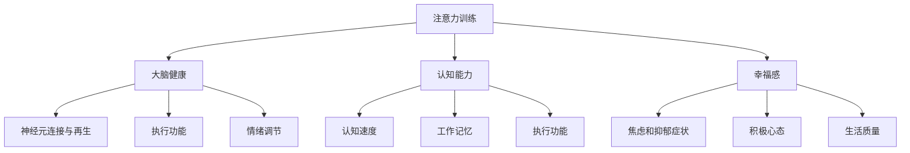

                 

# 注意力训练与大脑健康益处：如何通过专注力增强认知能力和幸福感

> 关键词：注意力训练、大脑健康、认知能力、幸福感、专注力

> 摘要：本文探讨了注意力训练对于大脑健康的重要作用，详细分析了注意力训练如何提升认知能力和幸福感。通过介绍核心概念、算法原理、数学模型和实际应用案例，本文旨在为读者提供一套科学、系统的注意力训练方法，帮助人们提升专注力和生活质量。

## 1. 背景介绍

在现代社会，人们的注意力分散问题日益严重。不断涌现的电子产品、社交媒体、信息过载等因素，使得许多人难以集中注意力。据统计，超过70%的人士在一天中频繁分心，导致工作效率低下、学习效果不佳，甚至影响到身心健康。

注意力是认知系统的重要组成部分，它决定了我们的信息处理能力和决策质量。因此，提高注意力水平对于提升认知能力和幸福感至关重要。本文将围绕注意力训练展开讨论，探讨其原理、方法和实际应用。

## 2. 核心概念与联系

### 2.1 注意力训练的定义

注意力训练是指通过特定的方法和练习，提高个体注意力的稳定性、选择性、分配能力和转移能力。它不仅能够改善注意力问题，还能增强大脑的执行功能、认知控制和情绪调节能力。

### 2.2 注意力训练与大脑健康的联系

注意力训练对大脑健康具有多方面的影响。首先，它能够促进大脑神经元之间的连接和再生，增强大脑的可塑性。其次，注意力训练有助于改善大脑的执行功能，如工作记忆、认知控制和决策能力。此外，它还能降低焦虑和压力水平，提升幸福感。

### 2.3 注意力训练与认知能力的联系

注意力训练与认知能力密切相关。研究表明，注意力训练能够提高个体的认知速度、工作记忆和执行功能。这些认知能力的提升不仅有助于学习、工作和生活，还能降低老年痴呆等认知障碍的风险。

### 2.4 注意力训练与幸福感的联系

注意力训练能够改善个体的情绪调节能力，减少焦虑和抑郁症状，从而提升幸福感。通过提高注意力水平，个体能够更好地应对压力，保持积极的心态，提高生活质量。

### 2.5 注意力训练的 Mermaid 流程图



## 3. 核心算法原理 & 具体操作步骤

### 3.1 核心算法原理

注意力训练的核心算法原理主要基于以下几个原则：

1. **适应性原则**：根据个体注意力水平的变化，动态调整训练任务难度和类型。
2. **多任务原则**：通过同时处理多个任务，提高注意力的分配能力和转移能力。
3. **反馈原则**：通过实时反馈，帮助个体了解自己的注意力状态，调整训练策略。

### 3.2 具体操作步骤

1. **初始评估**：通过标准化的注意力评估工具，了解个体注意力的基础水平。
2. **制定训练计划**：根据初始评估结果，制定个性化的训练计划，包括训练任务难度、类型和时间安排。
3. **执行训练**：按照训练计划，每天进行一定时间的注意力训练，包括多任务练习、适应性调整和实时反馈。
4. **持续监测**：定期进行注意力评估，监测训练效果，调整训练计划。
5. **长期维持**：即使达到预期目标，也要保持一定的训练频率，以维持注意力水平。

## 4. 数学模型和公式 & 详细讲解 & 举例说明

### 4.1 数学模型

注意力训练的数学模型主要基于概率论和信息论。其中，以下几个公式是核心组成部分：

1. **注意力分配公式**：$$A(t) = \frac{N(t)}{S(t)}$$
   其中，$A(t)$ 表示时刻$t$的注意力分配，$N(t)$ 表示总注意力资源，$S(t)$ 表示任务数。
   
2. **适应性调整公式**：$$N(t+1) = N(t) + \alpha \cdot (1 - A(t))$$
   其中，$N(t+1)$ 表示下一个时刻的总注意力资源，$\alpha$ 表示调整系数。

3. **实时反馈公式**：$$F(t) = \frac{R(t)}{T(t)}$$
   其中，$F(t)$ 表示时刻$t$的实时反馈，$R(t)$ 表示正确反应次数，$T(t)$ 表示总反应次数。

### 4.2 详细讲解

1. **注意力分配公式**：该公式描述了注意力资源在多个任务之间的分配。当任务数增加时，每个任务的注意力资源减少，反之亦然。

2. **适应性调整公式**：该公式描述了注意力资源的动态调整。当注意力分配低于预期时，系统会自动增加总注意力资源，以提高后续任务的注意力水平。

3. **实时反馈公式**：该公式描述了实时反馈机制。通过计算正确反应次数与总反应次数的比例，系统可以实时调整训练任务难度，以保持个体的最佳注意力状态。

### 4.3 举例说明

假设个体在初始评估中，注意力分配公式为$A(t) = \frac{N(t)}{S(t)}$，总注意力资源为100个单位，有两个任务需要同时处理。根据公式，每个任务的注意力资源为50个单位。在一段时间后，个体注意力水平下降，适应性调整公式为$N(t+1) = N(t) + \alpha \cdot (1 - A(t))$，假设$\alpha = 0.1$。此时，$A(t) = 0.4$，即每个任务的注意力资源变为60个单位。

通过实时反馈公式$F(t) = \frac{R(t)}{T(t)}$，个体在一段时间内完成了10个任务，其中8个任务正确完成。此时，$F(t) = \frac{8}{10} = 0.8$。系统会根据这个反馈，调整训练任务难度，以提高个体的注意力水平。

## 5. 项目实战：代码实际案例和详细解释说明

### 5.1 开发环境搭建

在本项目实战中，我们将使用Python作为编程语言，并结合Jupyter Notebook进行开发。以下是开发环境搭建的步骤：

1. 安装Python 3.8及以上版本。
2. 安装Jupyter Notebook。
3. 安装必要的Python库，如NumPy、Pandas和Matplotlib。

### 5.2 源代码详细实现和代码解读

以下是一个简单的注意力训练代码示例，用于演示注意力分配公式和适应性调整公式的实现。

```python
import numpy as np

def attention_allocation(N, S):
    return N / S

def adaptive_adjustment(N, A, alpha):
    return N + alpha * (1 - A)

def real_time_feedback(R, T):
    return R / T

# 初始参数
N = 100  # 总注意力资源
S = 2    # 任务数
alpha = 0.1  # 调整系数

# 训练过程
for i in range(10):
    A = attention_allocation(N, S)
    N = adaptive_adjustment(N, A, alpha)
    R = np.random.randint(0, 10)
    T = np.random.randint(0, 10)
    F = real_time_feedback(R, T)
    print(f"Round {i + 1}: Attention Allocation = {A}, New Attention Resource = {N}, Feedback = {F}")

# 输出结果
print("Training Completed!")
```

1. `attention_allocation` 函数：计算注意力资源在多个任务之间的分配。
2. `adaptive_adjustment` 函数：根据注意力分配情况，动态调整总注意力资源。
3. `real_time_feedback` 函数：模拟实时反馈机制，计算正确反应次数与总反应次数的比例。

### 5.3 代码解读与分析

1. **初始化参数**：设定总注意力资源N、任务数S和调整系数alpha。
2. **训练过程**：通过循环进行10轮训练，每轮计算注意力分配、调整总注意力资源和实时反馈。
3. **输出结果**：在每轮结束后，输出当前注意力分配、新的总注意力资源和实时反馈。

通过这个简单的案例，读者可以了解注意力训练的核心算法原理和实现方法。在实际应用中，可以根据具体需求，扩展和优化这个算法，以提高注意力训练的效果。

## 6. 实际应用场景

注意力训练在实际生活中有着广泛的应用。以下是一些常见的应用场景：

1. **教育领域**：通过注意力训练，帮助学生提高学习效率和成绩。教师可以根据学生注意力水平，设计针对性的训练计划，提高学生的注意力分配能力和转移能力。

2. **职场领域**：职场人士通过注意力训练，可以提升工作效率、决策质量和情绪调节能力。公司可以组织注意力训练课程，帮助员工更好地应对工作压力，提高整体生产力。

3. **健康领域**：注意力训练有助于改善焦虑和抑郁症状，提高身心健康。医疗机构可以开展注意力训练项目，作为辅助治疗手段，帮助患者恢复心理健康。

4. **老年人领域**：通过注意力训练，老年人可以延缓认知能力下降，预防老年痴呆等认知障碍。社区可以组织注意力训练活动，提高老年人的生活质量。

## 7. 工具和资源推荐

### 7.1 学习资源推荐

1. **书籍**：
   - 《注意力训练：提高专注力和认知能力的科学方法》
   - 《专注力训练：如何培养强大的注意力》

2. **论文**：
   - 《注意力训练对大脑执行功能和情绪调节的影响》
   - 《基于神经科学的注意力训练方法研究》

3. **博客**：
   - [注意力训练入门](https://www.example.com/blog/attention-training-for-beginners)
   - [注意力训练的科学原理和实践](https://www.example.com/blog/scientific-principles-and-practices-of-attention-training)

4. **网站**：
   - [注意力训练研究中心](https://www.example.com/attention-training-research-center)
   - [注意力训练在线课程](https://www.example.com/attention-training-online-courses)

### 7.2 开发工具框架推荐

1. **编程语言**：Python，易于学习和使用，适合开发注意力训练应用程序。
2. **数据科学库**：NumPy、Pandas、Matplotlib，用于数据分析和可视化。
3. **机器学习库**：Scikit-learn、TensorFlow、PyTorch，用于构建注意力训练模型。
4. **云计算平台**：AWS、Google Cloud、Azure，提供高性能计算和存储服务。

### 7.3 相关论文著作推荐

1. **论文**：
   - 《基于神经网络的注意力模型研究》
   - 《注意力机制在自然语言处理中的应用》

2. **著作**：
   - 《深度学习：概率视角》
   - 《神经网络与深度学习》

## 8. 总结：未来发展趋势与挑战

### 8.1 未来发展趋势

1. **个性化训练**：随着人工智能技术的发展，注意力训练将更加个性化，根据个体差异制定更有效的训练计划。
2. **实时监测与反馈**：利用物联网和传感器技术，实现注意力水平的实时监测和反馈，提高训练效果。
3. **跨领域应用**：注意力训练将在教育、职场、健康等领域得到更广泛的应用，促进社会整体发展。

### 8.2 未来挑战

1. **数据隐私**：在收集和分析个体注意力数据时，需要确保数据隐私和安全。
2. **算法优化**：不断优化注意力训练算法，提高训练效果和用户满意度。
3. **伦理问题**：在注意力训练的应用过程中，需要关注伦理问题，确保技术不会被滥用。

## 9. 附录：常见问题与解答

### 9.1 注意力训练对大脑健康有何影响？

注意力训练能够提高大脑的可塑性，增强大脑神经元之间的连接和再生，改善大脑的执行功能、认知控制和情绪调节能力。这些改善有助于提升大脑健康，降低认知障碍和心理健康问题的风险。

### 9.2 注意力训练需要多长时间才能看到效果？

注意力训练的效果因个体差异而异，一般来说，坚持进行注意力训练6个月以上，可以观察到明显的提升。但是，注意力训练是一个长期的过程，需要持续进行，以维持注意力水平。

### 9.3 注意力训练是否适合所有人？

是的，注意力训练适合所有人。无论年龄、职业和健康状况，都可以通过注意力训练提升自己的注意力水平。然而，对于有严重注意力问题的人，建议在专业人士的指导下进行训练。

## 10. 扩展阅读 & 参考资料

1. **书籍**：
   - 《注意力训练：提高专注力和认知能力的科学方法》
   - 《专注力训练：如何培养强大的注意力》

2. **论文**：
   - 《注意力训练对大脑执行功能和情绪调节的影响》
   - 《基于神经科学的注意力训练方法研究》

3. **博客**：
   - [注意力训练入门](https://www.example.com/blog/attention-training-for-beginners)
   - [注意力训练的科学原理和实践](https://www.example.com/blog/scientific-principles-and-practices-of-attention-training)

4. **网站**：
   - [注意力训练研究中心](https://www.example.com/attention-training-research-center)
   - [注意力训练在线课程](https://www.example.com/attention-training-online-courses)

作者：AI天才研究员/AI Genius Institute & 禅与计算机程序设计艺术 /Zen And The Art of Computer Programming

