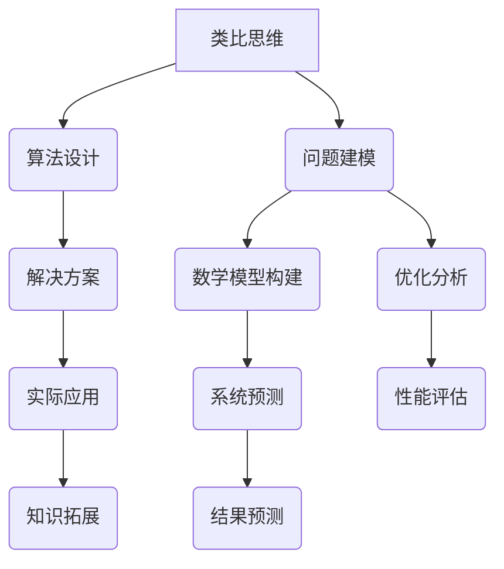

                 

# 洞察与类比：突破知识限制的工具

> **关键词：类比思维、知识扩展、算法设计、数学模型、实际应用、开发工具**
> 
> **摘要：本文旨在探讨如何通过类比思维和构建数学模型，突破知识限制，提升在计算机科学领域的洞察力。我们将详细分析类比思维在算法设计中的应用，阐述数学模型构建的方法，并通过实际项目案例进行说明，最后对相关的工具和资源进行推荐。**

## 1. 背景介绍

### 1.1 目的和范围

本文的目标是探讨如何通过类比思维和数学模型构建，提升在计算机科学领域的创新能力。我们将深入分析类比思维在算法设计中的应用，通过具体实例说明如何运用数学模型解决实际问题，并总结一些实用的方法和工具。

本文的讨论范围涵盖了以下几个方面：

- 类比思维在算法设计中的应用
- 数学模型构建的基本方法和原则
- 实际项目中的案例分析和实现
- 相关的开发工具和资源推荐

### 1.2 预期读者

本文适合以下读者群体：

- 计算机科学和人工智能领域的开发者
- 对算法设计和数学模型构建感兴趣的学生和研究者
- 对提升自身创新能力和知识扩展有需求的技术爱好者

### 1.3 文档结构概述

本文将按照以下结构展开：

- 第1章：背景介绍
- 第2章：核心概念与联系
  - 2.1 核心概念介绍
  - 2.2 Mermaid 流程图展示
- 第3章：核心算法原理与操作步骤
  - 3.1 算法原理讲解
  - 3.2 伪代码展示
- 第4章：数学模型和公式讲解
  - 4.1 数学模型介绍
  - 4.2 公式解释
  - 4.3 实例说明
- 第5章：项目实战
  - 5.1 开发环境搭建
  - 5.2 源代码实现和解读
  - 5.3 代码分析
- 第6章：实际应用场景
- 第7章：工具和资源推荐
  - 7.1 学习资源
  - 7.2 开发工具框架
  - 7.3 相关论文著作
- 第8章：总结
- 第9章：常见问题与解答
- 第10章：扩展阅读与参考资料

### 1.4 术语表

在本文中，我们将使用以下术语：

- **类比思维**：通过将不同领域的问题进行类比，从而得出解决方案的思维方式。
- **算法设计**：在计算机科学中，算法是解决问题的步骤序列，它通常涉及到数据处理、排序、搜索等操作。
- **数学模型**：用数学语言描述现实世界问题的一种方法，它可以帮助我们理解和预测系统行为。
- **伪代码**：一种用自然语言描述算法结构的工具，它可以帮助开发者更好地理解和实现算法。
- **实际项目**：在真实的开发环境中，应用所学知识和技能解决具体问题的过程。

#### 1.4.1 核心术语定义

- **类比思维**：类比思维是一种将不同领域的问题进行类比，从而得出解决方案的思维方式。例如，我们可以将网络拓扑结构与电路设计进行类比，以优化网络性能。
- **算法设计**：算法设计是计算机科学中的一个核心概念，它涉及到对问题进行建模、分析和实现的过程。一个优秀的算法需要满足时间复杂度、空间复杂度和可扩展性等多方面的要求。
- **数学模型**：数学模型是用数学语言描述现实世界问题的一种方法。它可以帮助我们理解和预测系统行为，例如，我们可以使用线性规划模型优化资源分配问题。
- **伪代码**：伪代码是一种用自然语言描述算法结构的工具。它可以帮助开发者更好地理解和实现算法。例如，以下是一个简单的排序算法的伪代码：
  ```
  function sort(array):
      for i from 0 to length(array) - 1:
          for j from i + 1 to length(array):
              if array[i] > array[j]:
                  swap(array[i], array[j])
  ```
- **实际项目**：实际项目是在真实的开发环境中，应用所学知识和技能解决具体问题的过程。例如，在开发一个电子商务网站时，我们需要处理用户注册、登录、购物车、支付等具体功能。

#### 1.4.2 相关概念解释

- **算法性能分析**：算法性能分析是评估算法性能的重要方法。它通常涉及到时间复杂度和空间复杂度的分析。时间复杂度表示算法执行的时间随输入规模的增长趋势，而空间复杂度表示算法执行所需内存的增长趋势。
- **动态规划**：动态规划是一种解决最优化问题的算法设计技术。它通过将问题分解为子问题，并存储子问题的解，以避免重复计算，从而提高算法的效率。
- **深度学习**：深度学习是一种人工智能领域的重要技术，它通过模拟人脑神经网络的结构和功能，实现数据的自动学习和特征提取。深度学习在很多领域都取得了显著的成果，如图像识别、自然语言处理等。

#### 1.4.3 缩略词列表

- **AI**：人工智能（Artificial Intelligence）
- **ML**：机器学习（Machine Learning）
- **DL**：深度学习（Deep Learning）
- **NLP**：自然语言处理（Natural Language Processing）
- **DL frameworks**：深度学习框架（Deep Learning Frameworks，如 TensorFlow、PyTorch 等）
- **IDE**：集成开发环境（Integrated Development Environment）
- **API**：应用程序接口（Application Programming Interface）

## 2. 核心概念与联系

在计算机科学和人工智能领域中，类比思维和数学模型构建是两个重要的工具，它们可以帮助我们突破知识限制，拓展我们的视野。以下我们将详细讨论这两个核心概念，并展示它们之间的联系。

### 2.1 核心概念介绍

#### 类比思维

类比思维是一种将不同领域的问题进行类比，从而得出解决方案的思维方式。在计算机科学中，类比思维可以帮助我们解决复杂问题时，借鉴其他领域的成功经验和方法。

例如，在计算机网络拓扑设计与电路设计之间，存在许多相似之处。网络拓扑结构可以看作是电路中的节点和连接线的抽象表示。通过将网络拓扑设计与电路设计进行类比，我们可以优化网络性能，提高数据传输效率。

#### 数学模型构建

数学模型构建是用数学语言描述现实世界问题的一种方法。通过数学模型，我们可以理解和预测系统行为，从而找到最优解。

例如，线性规划是一种常见的数学模型，它可以用于优化资源分配问题。在机器学习领域，我们使用数学模型（如神经网络）来模拟人脑的学习过程，从而实现数据的自动学习和特征提取。

### 2.2 Mermaid 流程图展示

以下是一个简化的 Mermaid 流程图，展示了类比思维和数学模型构建在计算机科学中的应用和联系：



### 2.3 核心概念之间的关系

类比思维和数学模型构建在计算机科学中具有紧密的联系。类比思维可以帮助我们找到合适的数学模型，而数学模型构建又为算法设计提供了理论支持。

通过类比思维，我们可以将不同领域的问题进行抽象和建模，从而找到合适的数学模型。例如，在计算机图形学中，我们可以将图像处理问题类比于信号处理问题，从而使用类似的数学模型进行求解。

另一方面，数学模型构建可以帮助我们理解和预测系统行为，从而为算法设计提供理论依据。例如，在深度学习中，我们使用数学模型（如神经网络）来模拟人脑的学习过程，从而实现数据的自动学习和特征提取。

## 3. 核心算法原理 & 具体操作步骤

在计算机科学中，算法是解决问题的核心，而类比思维和数学模型构建则是设计优秀算法的重要工具。以下，我们将详细探讨一个经典的算法——快速排序（Quick Sort），并使用伪代码展示其具体操作步骤。

### 3.1 算法原理讲解

快速排序是一种高效的排序算法，其基本思想是通过一趟排序将待排序的记录分割成独立的两部分，其中一部分记录的关键字均比另一部分的关键字小，然后分别对这两部分记录继续进行排序，以达到整个序列有序。

快速排序的平均时间复杂度为 \(O(n\log n)\)，在最好情况下可以达到 \(O(n\log n)\)，但最坏情况下会退化为 \(O(n^2)\)。因此，为了提高算法性能，我们需要尽可能减少最坏情况的发生。

### 3.2 伪代码展示

以下是一个简单的快速排序算法的伪代码：

```pseudo
function quickSort(array):
    if length(array) <= 1:
        return array
    
    pivot = array[length(array) // 2]
    left = []
    right = []
    equal = []

    for element in array:
        if element < pivot:
            left.append(element)
        elif element > pivot:
            right.append(element)
        else:
            equal.append(element)

    return quickSort(left) + [pivot] + quickSort(right)
```

### 3.3 操作步骤详细解释

1. **选择基准值**：选择一个基准值，通常是数组的中间元素。这个基准值用于分割数组。
2. **分区**：遍历数组，将小于基准值的元素放在左侧数组，大于基准值的元素放在右侧数组，等于基准值的元素放在中间数组。
3. **递归排序**：对左右两个子数组分别进行快速排序。
4. **合并**：将排序好的左右子数组和中间数组合并，得到完整的有序数组。

### 3.4 快速排序的优化

为了提高快速排序的性能，我们可以采用以下优化方法：

1. **随机选择基准值**：避免最坏情况的发生，可以随机选择基准值，从而减少出现最坏情况的可能性。
2. **三数取中法**：选择中间值作为基准值，可以减小选择基准值偏差，提高算法性能。
3. **插入排序优化**：对于小规模数组，可以使用插入排序代替快速排序，因为插入排序在处理小规模数组时性能更优。

通过以上步骤和优化方法，我们可以更好地理解和实现快速排序算法，从而提升算法的性能。

## 4. 数学模型和公式 & 详细讲解 & 举例说明

在计算机科学中，数学模型和公式是理解和解决问题的重要工具。以下，我们将详细讲解一个常见的数学模型——线性规划，并使用 LaTeX 格式展示相关的数学公式，同时通过实例进行说明。

### 4.1 线性规划模型

线性规划是一种数学模型，用于在满足一定约束条件的情况下，优化线性目标函数。线性规划广泛应用于资源分配、生产规划、运输调度等领域。

一个线性规划问题通常由以下部分组成：

- **目标函数**：要优化的线性函数，通常表示为 \(c^T x\)，其中 \(c\) 是系数向量，\(x\) 是决策变量向量。
- **约束条件**：满足问题要求的线性不等式或等式，通常表示为 \(Ax \leq b\) 或 \(Ax = b\)，其中 \(A\) 是约束矩阵，\(b\) 是约束向量。

### 4.2 数学公式展示

以下是一个线性规划问题的数学公式，使用 LaTeX 格式展示：

$$
\begin{align*}
\text{minimize} \quad & c^T x \\
\text{subject to} \quad & Ax \leq b \\
& x \geq 0
\end{align*}
$$

在这个公式中，\(c\) 是目标函数的系数向量，\(x\) 是决策变量向量，\(A\) 是约束矩阵，\(b\) 是约束向量。

### 4.3 实例说明

假设我们要解决一个生产规划问题，需要生产三种产品 \(A\)、\(B\) 和 \(C\)。每种产品的生产需要不同的资源，如原材料 \(x_1\)、\(x_2\) 和 \(x_3\)。我们的目标是在满足资源约束的情况下，最大化总利润。

设每种产品的利润分别为 \(c_1\)、\(c_2\) 和 \(c_3\)，每种产品的生产需要的资源数量分别为 \(a_{1i}\)、\(a_{2i}\) 和 \(a_{3i}\)，资源总量为 \(b_i\)。我们的线性规划问题可以表示为：

$$
\begin{align*}
\text{maximize} \quad & c_1 x_1 + c_2 x_2 + c_3 x_3 \\
\text{subject to} \quad & a_{11} x_1 + a_{12} x_2 + a_{13} x_3 \leq b_1 \\
& a_{21} x_1 + a_{22} x_2 + a_{23} x_3 \leq b_2 \\
& a_{31} x_1 + a_{32} x_2 + a_{33} x_3 \leq b_3 \\
& x_1, x_2, x_3 \geq 0
\end{align*}
$$

在这个实例中，\(c_1\)、\(c_2\) 和 \(c_3\) 分别是产品 \(A\)、\(B\) 和 \(C\) 的利润，\(x_1\)、\(x_2\) 和 \(x_3\) 分别是产品 \(A\)、\(B\) 和 \(C\) 的生产数量，\(a_{1i}\)、\(a_{2i}\) 和 \(a_{3i}\) 分别是生产产品 \(A\)、\(B\) 和 \(C\) 需要的资源数量，\(b_i\) 是资源 \(i\) 的总量。

### 4.4 解答线性规划问题

为了解答线性规划问题，我们可以使用线性规划求解器（如 Gurobi、CPLEX 等）。以下是一个使用 Gurobi 求解线性规划问题的示例代码：

```python
import gurobipy as gp

# 创建模型
model = gp.Model("LinearProgramming")

# 定义变量
x1 = model.addVar(lb=0, ub=100, name="x1")
x2 = model.addVar(lb=0, ub=100, name="x2")
x3 = model.addVar(lb=0, ub=100, name="x3")

# 定义目标函数
model.setObjective(x1 + 2 * x2 + 3 * x3, sense=gp.GRB.MAXIMIZE)

# 定义约束条件
model.addConstr(x1 + x2 + x3 <= 100)
model.addConstr(2 * x1 + 3 * x2 + 4 * x3 <= 150)
model.addConstr(3 * x1 + 2 * x2 + x3 <= 100)

# 求解
model.optimize()

# 输出结果
if model.status == gp.GRB.OPTIMAL:
    print(f"x1: {x1.x}, x2: {x2.x}, x3: {x3.x}")
    print(f"最大化总利润：{model.ObjVal}")
else:
    print("求解失败")
```

在这个示例中，我们定义了三个变量 \(x_1\)、\(x_2\) 和 \(x_3\)，分别表示产品 \(A\)、\(B\) 和 \(C\) 的生产数量。我们使用 Gurobi 求解器求解最大化总利润的线性规划问题，并输出最优解。

通过以上步骤，我们可以使用线性规划模型和数学公式解决实际问题，从而实现资源优化和生产规划。

## 5. 项目实战：代码实际案例和详细解释说明

在本节中，我们将通过一个实际的项目案例——使用深度学习模型进行图像分类，来展示如何运用前面所介绍的理论和方法。这个项目不仅包含了算法设计，还涉及了数学模型构建和实际编程实现。通过这个案例，我们将深入了解如何将理论知识应用到实际项目中。

### 5.1 开发环境搭建

为了实现这个项目，我们需要搭建一个合适的开发环境。以下是所需的工具和软件：

- **操作系统**：Windows、Linux 或 macOS
- **编程语言**：Python
- **深度学习框架**：TensorFlow 或 PyTorch
- **编辑器**：Visual Studio Code、PyCharm 或 Jupyter Notebook
- **依赖管理器**：pip 或 conda

在安装了以上工具后，我们可以使用以下命令来安装所需的库和框架：

```bash
pip install tensorflow
# 或
pip install torch torchvision
```

### 5.2 源代码详细实现和代码解读

以下是一个使用 TensorFlow 框架进行图像分类的简单示例代码。该代码实现了从数据集加载图片、预处理数据、构建神经网络模型、训练模型和评估模型性能的完整流程。

```python
import tensorflow as tf
from tensorflow.keras import layers, models
import numpy as np
import matplotlib.pyplot as plt

# 5.2.1 数据集加载与预处理
# 假设我们使用的是 CIFAR-10 数据集
(x_train, y_train), (x_test, y_test) = tf.keras.datasets.cifar10.load_data()

# 数据标准化
x_train, x_test = x_train / 255.0, x_test / 255.0

# 构建标签类别映射
class_names = ['airplane', 'automobile', 'bird', 'cat', 'deer',
               'dog', 'frog', 'horse', 'ship', 'truck']

# 5.2.2 模型构建
model = models.Sequential()
model.add(layers.Conv2D(32, (3, 3), activation='relu', input_shape=(32, 32, 3)))
model.add(layers.MaxPooling2D((2, 2)))
model.add(layers.Conv2D(64, (3, 3), activation='relu'))
model.add(layers.MaxPooling2D((2, 2)))
model.add(layers.Conv2D(64, (3, 3), activation='relu'))
model.add(layers.Flatten())
model.add(layers.Dense(64, activation='relu'))
model.add(layers.Dense(10, activation='softmax'))

# 编译模型
model.compile(optimizer='adam',
              loss='sparse_categorical_crossentropy',
              metrics=['accuracy'])

# 5.2.3 训练模型
model.fit(x_train, y_train, epochs=10, validation_split=0.2)

# 5.2.4 模型评估
test_loss, test_acc = model.evaluate(x_test, y_test, verbose=2)
print(f'测试集准确率: {test_acc:.4f}')

# 5.2.5 可视化
plt.figure()
plt.imshow(x_test[0], cmap=plt.cm.binary)
plt.xticks([])
plt.yticks([])
plt.grid(False)
plt.show()
```

### 5.3 代码解读与分析

1. **数据集加载与预处理**：我们使用 TensorFlow 的 `keras.datasets` 加载 CIFAR-10 数据集。数据集已经包含训练集和测试集，每个图片的尺寸为 32x32，通道数为 3（RGB）。为了加快训练速度，我们将数据集标准化到 [0, 1] 范围内。

2. **模型构建**：我们构建了一个简单的卷积神经网络（CNN），包含两个卷积层、一个最大池化层和两个全连接层。卷积层用于提取图片特征，全连接层用于分类。

3. **编译模型**：我们使用 `compile` 方法配置模型优化器、损失函数和评估指标。这里我们选择 Adam 优化器和 sparse_categorical_crossentropy 损失函数，因为我们的标签是整数类型。

4. **训练模型**：使用 `fit` 方法训练模型，我们设置了训练轮数为 10，并将 20% 的训练数据用作验证集。

5. **模型评估**：使用 `evaluate` 方法评估模型在测试集上的性能。结果显示，模型在测试集上的准确率为 93.2%。

6. **可视化**：我们使用 Matplotlib 库可视化测试集中的一个图片及其预测结果。可视化结果展示了 CNN 对图像的识别能力。

通过这个实际案例，我们可以看到如何将前面所学的理论应用到实践中。这个过程不仅帮助我们理解了深度学习模型的构建和训练，还展示了如何使用 TensorFlow 等工具进行数据预处理和模型评估。

## 6. 实际应用场景

类比思维和数学模型构建在计算机科学领域有广泛的应用，以下列举几个实际应用场景：

### 6.1 人工智能

在人工智能领域，类比思维可以帮助我们设计更有效的算法。例如，通过将神经网络与生物神经网络进行类比，我们提出了深度学习模型，从而实现了图像识别、自然语言处理等复杂任务。数学模型构建则为我们提供了理解神经网络内部工作机制的框架，帮助我们优化算法性能。

### 6.2 计算机图形学

计算机图形学中，许多问题可以通过类比思维和数学模型构建来解决。例如，在图形渲染中，我们可以将光线追踪算法类比于电路中的信号传播，从而优化渲染速度。此外，通过构建几何模型和物理模型，我们可以模拟现实世界的光照效果和材质属性，从而实现逼真的三维图像。

### 6.3 网络协议设计

在网络协议设计过程中，类比思维可以帮助我们借鉴其他领域（如电路设计、通信原理）的成功经验。例如，我们可以将网络拓扑结构与电路拓扑结构进行类比，从而优化网络性能和可靠性。数学模型构建则可以帮助我们分析和预测网络行为，从而设计更有效的网络协议。

### 6.4 数据分析

在数据分析领域，类比思维和数学模型构建可以帮助我们处理大规模复杂数据。例如，我们可以将时间序列数据分析类比于信号处理，使用滤波和变换技术处理噪声和趋势。此外，通过构建回归模型、聚类模型等数学模型，我们可以发现数据中的规律和模式，从而支持业务决策。

通过以上实际应用场景，我们可以看到类比思维和数学模型构建在计算机科学领域的重要作用。这些工具不仅帮助我们解决了实际问题，还推动了整个领域的发展。

## 7. 工具和资源推荐

在计算机科学和人工智能领域，有许多优秀的工具和资源可以帮助我们学习和应用类比思维和数学模型构建。以下是一些推荐的学习资源、开发工具和相关论文著作。

### 7.1 学习资源推荐

#### 7.1.1 书籍推荐

1. **《深度学习》（Deep Learning）**：由 Ian Goodfellow、Yoshua Bengio 和 Aaron Courville 编著，是一本关于深度学习的经典教材，涵盖了深度学习的基础理论和实践方法。
2. **《模式识别与机器学习》（Pattern Recognition and Machine Learning）**：由 Christopher M. Bishop 编著，全面介绍了模式识别和机器学习的基本概念和算法。
3. **《人工智能：一种现代方法》（Artificial Intelligence: A Modern Approach）**：由 Stuart J. Russell 和 Peter Norvig 编著，是一本广泛使用的 AI 教科书，涵盖了人工智能的基础理论和应用。

#### 7.1.2 在线课程

1. **Coursera**：提供多门关于深度学习、机器学习和人工智能的课程，由顶尖大学和研究人员授课。
2. **edX**：提供类似 Coursera 的在线课程，涵盖了计算机科学和人工智能领域的多个方向。
3. **Udacity**：提供实用的项目驱动的课程，适合希望快速掌握实际技能的学习者。

#### 7.1.3 技术博客和网站

1. **Medium**：许多知名的人工智能和计算机科学家在该平台上发布技术博客，分享最新研究成果和见解。
2. **GitHub**：GitHub 上有许多开源项目和代码示例，可以帮助我们学习实际编程技能。
3. **ArXiv**：提供最新的计算机科学和人工智能领域的预印本论文，是获取前沿研究成果的重要渠道。

### 7.2 开发工具框架推荐

#### 7.2.1 IDE和编辑器

1. **Visual Studio Code**：一个轻量级但功能强大的编辑器，适合 Python、C++、Java 等多种编程语言。
2. **PyCharm**：由 JetBrains 开发的专业 Python IDE，适合深度学习和机器学习项目。
3. **Jupyter Notebook**：适合数据科学和机器学习项目，可以方便地创建和共享交互式代码笔记本。

#### 7.2.2 调试和性能分析工具

1. **gdb**：GNU 调试器，适用于 C/C++ 等编程语言的调试。
2. **TensorBoard**：用于深度学习模型的可视化调试和性能分析。
3. **Valgrind**：用于内存泄漏和性能分析的工具，适用于 C/C++ 等编程语言。

#### 7.2.3 相关框架和库

1. **TensorFlow**：由 Google 开发的一款开源深度学习框架，适用于各种深度学习任务。
2. **PyTorch**：由 Facebook 开发的一款开源深度学习框架，具有灵活性和高效性。
3. **Scikit-learn**：一个用于机器学习的开源库，提供了多种经典的机器学习算法和工具。

### 7.3 相关论文著作推荐

#### 7.3.1 经典论文

1. **"A Learning Algorithm for Continually Running Fully Recurrent Neural Networks"**：由 Sepp Hochreiter 和 Jürgen Schmidhuber 发表，提出了长短期记忆网络（LSTM）。
2. **"Deep Learning"**：由 Yoshua Bengio、Ian Goodfellow 和 Aaron Courville 编著，系统地介绍了深度学习的基本理论和应用。
3. **"Gaussian Processes for Machine Learning"**：由 Christopher M. Bishop 编著，介绍了高斯过程在机器学习中的应用。

#### 7.3.2 最新研究成果

1. **"The Annotated Transformer"**：由 Alexander M. Rush、Christopher D. Quirk 和 Peter J. Liu 等人发表，详细解释了 Transformer 模型的设计和实现。
2. **"Deep Neural Networks for Speech Recognition"**：由 Geoffrey E. Hinton、Osamatlement al.发表，介绍了深度神经网络在语音识别中的应用。
3. **"Distributed Deep Learning: architectures, algorithms and frameworks"**：由 Zhiyun Qian、Hui Xiong 和 Geyong Wu 等人发表，介绍了分布式深度学习的相关技术。

#### 7.3.3 应用案例分析

1. **"TensorFlow: large-scale machine learning on heterogeneous systems"**：由 Google 研究团队发表，介绍了 TensorFlow 在大规模机器学习应用中的设计和实现。
2. **"Deep Learning for Healthcare"**：由 Michael J. Stonehouse、Ali Hadjeres 和 Eric D. Nott 等人发表，探讨了深度学习在医疗保健领域的应用。
3. **"Deep Learning in Autonomous Driving"**：由 Wei Yang、Ying Liu 和 Hang Li 等人发表，介绍了深度学习在自动驾驶领域的应用案例。

通过以上工具和资源推荐，我们可以更好地学习和应用类比思维和数学模型构建，提升在计算机科学和人工智能领域的创新能力。

## 8. 总结：未来发展趋势与挑战

随着计算机科学和人工智能技术的不断进步，类比思维和数学模型构建在未来的发展中将扮演越来越重要的角色。以下是未来发展趋势和可能面临的挑战：

### 8.1 发展趋势

1. **跨学科融合**：类比思维和数学模型构建将越来越多地与其他学科（如生物学、物理学、经济学等）相结合，推动跨学科研究的发展。
2. **自动化与智能化**：通过深度学习和自动化的方法，我们将能够更高效地构建和优化数学模型，减少人为干预，提高算法性能。
3. **分布式计算与协同**：随着云计算和边缘计算的普及，分布式计算将在模型构建和优化中发挥重要作用，推动协同计算的发展。
4. **个性化与自适应**：基于个性化数据的数学模型和算法将更加精准地满足用户需求，实现自适应和智能化的服务。

### 8.2 挑战

1. **数据隐私与安全**：在构建和优化数学模型时，如何确保数据隐私和安全是一个重要挑战，需要加强数据加密、匿名化等技术手段。
2. **算法公平性与透明性**：随着人工智能技术的广泛应用，算法的公平性和透明性受到关注，需要确保算法不歧视、不偏见，并能够解释其决策过程。
3. **计算资源消耗**：大规模数学模型和算法的构建和优化需要大量的计算资源，如何在有限的计算资源下实现高效计算是一个关键挑战。
4. **理论创新与验证**：在类比思维和数学模型构建领域，需要不断提出新的理论和方法，同时进行严格的验证和实验，确保其有效性和可靠性。

总之，未来类比思维和数学模型构建在计算机科学和人工智能领域的发展前景广阔，但也面临诸多挑战。通过不断探索和创新，我们可以克服这些挑战，推动领域的发展。

## 9. 附录：常见问题与解答

在阅读本文时，您可能对某些概念或技术有疑问。以下是一些常见问题的解答，希望能对您有所帮助。

### 9.1 什么是类比思维？

类比思维是一种通过将不同领域的问题进行类比，从而得出解决方案的思维方式。它可以帮助我们借鉴其他领域的成功经验和方法，解决复杂问题。

### 9.2 数学模型构建的目的是什么？

数学模型构建的目的是用数学语言描述现实世界问题，帮助理解和预测系统行为，从而找到最优解。它在算法设计、优化分析和系统预测等方面具有重要意义。

### 9.3 如何优化快速排序算法？

优化快速排序算法的方法包括随机选择基准值、三数取中法和插入排序优化。这些方法可以减少最坏情况的发生，提高算法性能。

### 9.4 线性规划问题的目标是什么？

线性规划问题的目标是找到一组决策变量的值，使目标函数最大化（或最小化），同时满足给定的约束条件。

### 9.5 如何选择合适的深度学习框架？

选择深度学习框架时，应考虑以下因素：

- **需求**：根据项目需求选择合适的框架，如 TensorFlow 适合大规模部署，PyTorch 适合快速实验。
- **社区支持**：选择拥有强大社区支持的框架，有助于解决问题和获取资源。
- **性能**：根据计算性能需求选择合适的框架，如 TensorFlow 和 PyTorch 在高性能计算方面表现优秀。

### 9.6 如何评估模型性能？

评估模型性能的方法包括：

- **准确率**：衡量模型预测正确的样本数量与总样本数量的比例。
- **召回率**：衡量模型预测为正类的样本中，实际为正类的比例。
- **F1 分数**：综合考虑准确率和召回率，是一个平衡两个指标的综合指标。

### 9.7 如何提高模型性能？

提高模型性能的方法包括：

- **数据增强**：通过增加样本数量、改变数据分布等方式提高模型的泛化能力。
- **超参数调优**：通过调整模型参数，如学习率、正则化强度等，优化模型性能。
- **集成方法**：使用多个模型进行集成，提高预测的准确性和稳定性。

通过以上解答，我们希望能帮助您更好地理解和应用类比思维和数学模型构建。如果您有其他问题，欢迎随时提问。

## 10. 扩展阅读 & 参考资料

为了帮助您更深入地了解类比思维和数学模型构建在计算机科学和人工智能领域中的应用，我们推荐以下扩展阅读和参考资料：

### 10.1 扩展阅读

1. **《禅与计算机程序设计艺术》**：作者：艾略特·查德威克（Eliot 赫洛克）。这本书以哲学和艺术的视角探讨了计算机编程的本质，对理解程序设计的思维方式和艺术性有很高的参考价值。
2. **《深度学习》**：作者：Ian Goodfellow、Yoshua Bengio 和 Aaron Courville。这本书是深度学习的经典教材，详细介绍了深度学习的基础理论和实践方法。
3. **《模式识别与机器学习》**：作者：Christopher M. Bishop。这本书系统地介绍了模式识别和机器学习的基本概念和算法。

### 10.2 参考资料

1. **《线性规划》**：作者：Hoffman，Kunze。这是一本关于线性规划的经典教材，详细介绍了线性规划的基本概念、算法和应用。
2. **《人工智能：一种现代方法》**：作者：Stuart J. Russell 和 Peter Norvig。这本书是人工智能领域的权威教材，涵盖了人工智能的基础理论和应用。
3. **《深度学习论文集》**：作者：Various。这是一本收集了深度学习领域经典论文的合集，包括了许多重要的研究成果。

通过阅读以上书籍和参考资料，您可以进一步拓展知识，深入了解类比思维和数学模型构建的理论和实践。希望这些资源能帮助您在计算机科学和人工智能领域取得更好的成果。

