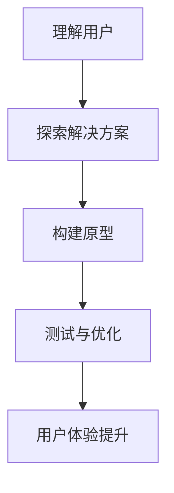

                 


# 洞察力与用户体验：设计思维的核心

> **关键词：用户体验、设计思维、洞察力、用户研究、创新设计**

> **摘要：本文将深入探讨用户体验与设计思维之间的紧密关系，并重点阐述如何通过洞察力提升设计质量，从而打造出更为卓越的用户体验。文章将从背景介绍、核心概念、算法原理、数学模型、实战案例、实际应用、工具推荐等多个方面展开，帮助读者全面理解用户体验设计之道，并掌握其中的核心技能。**

## 1. 背景介绍

### 1.1 目的和范围

本文旨在探讨设计思维在用户体验提升中的关键作用，通过分析核心概念、算法原理、数学模型和实践案例，为广大读者提供一套系统化的用户体验设计方法。文章将涵盖以下范围：

1. 设计思维的基本概念与原理。
2. 用户研究的方法与实践。
3. 创新设计策略与工具。
4. 实际项目中的用户体验设计案例。

### 1.2 预期读者

本文适合以下读者群体：

1. 用户体验设计师、产品经理及相关从业者。
2. 对设计思维和用户体验感兴趣的技术爱好者。
3. 想要提高自身创新能力的专业人士。

### 1.3 文档结构概述

本文结构如下：

1. **背景介绍**：阐述文章的目的、范围和预期读者。
2. **核心概念与联系**：介绍设计思维与用户体验的相关概念和流程图。
3. **核心算法原理 & 具体操作步骤**：讲解用户体验设计的算法原理和操作步骤。
4. **数学模型和公式 & 详细讲解 & 举例说明**：分析用户体验设计的数学模型和公式。
5. **项目实战：代码实际案例和详细解释说明**：提供实际项目中的代码案例和分析。
6. **实际应用场景**：探讨用户体验设计的应用场景。
7. **工具和资源推荐**：推荐学习资源、开发工具和框架。
8. **总结：未来发展趋势与挑战**：总结文章内容和未来趋势。
9. **附录：常见问题与解答**：解答读者可能遇到的问题。
10. **扩展阅读 & 参考资料**：提供相关参考资料和扩展阅读。

### 1.4 术语表

#### 1.4.1 核心术语定义

- 设计思维：一种以用户为中心的设计方法，强调迭代、实验和反馈。
- 用户体验（UX）：用户在使用产品或服务过程中的整体体验。
- 用户研究：通过观察、访谈、问卷调查等方法了解用户需求和行为。
- 创新设计：通过新颖的方法和策略解决实际问题，提升用户体验。

#### 1.4.2 相关概念解释

- 交互设计：关注用户与产品或服务的交互方式，提高使用便利性和满意度。
- 信息架构：构建网站的层次结构，确保用户能够快速找到所需信息。
- 用户体验评估：对产品的用户体验进行量化或定性分析，以识别改进机会。

#### 1.4.3 缩略词列表

- UX：用户体验（User Experience）
- UI：用户界面（User Interface）
- VR：虚拟现实（Virtual Reality）
- AR：增强现实（Augmented Reality）

## 2. 核心概念与联系

设计思维是用户体验设计的核心，它强调以用户为中心，通过迭代和实验不断优化产品或服务。以下是设计思维与用户体验相关概念的联系和流程图。

### 2.1 设计思维与用户体验的关系

设计思维和用户体验之间有着密不可分的关系。设计思维是一种方法论，而用户体验则是设计思维的目标。设计思维通过以下步骤实现用户体验的提升：

1. **理解用户**：通过用户研究了解用户需求、行为和痛点。
2. **探索解决方案**：基于用户需求提出创新设计思路。
3. **构建原型**：快速构建可交互的原型，以便进行测试和反馈。
4. **测试与优化**：通过用户测试和反馈不断迭代优化设计。

### 2.2 流程图

下面是一个简化的设计思维与用户体验的流程图：



### 2.3 用户研究的重要性

用户研究是设计思维的关键步骤，它帮助设计师深入了解用户需求和行为，从而为设计提供有力支持。以下是用户研究的重要性：

1. **发现用户需求**：了解用户真正关心的问题和需求。
2. **识别用户痛点**：发现用户在使用产品或服务过程中遇到的问题和困难。
3. **指导设计方向**：为设计师提供明确的指导，确保设计方案符合用户期望。

### 2.4 创新设计策略

创新设计策略是提升用户体验的重要手段，它包括以下方面：

1. **迭代思维**：通过快速迭代优化设计方案，不断提高用户体验。
2. **跨学科合作**：结合不同领域的知识，为用户提供更加创新和实用的解决方案。
3. **用户参与**：邀请用户参与设计过程，共同探讨和解决问题。

## 3. 核心算法原理 & 具体操作步骤

用户体验设计的核心在于找到用户需求与产品设计的最佳结合点。以下是用户体验设计的核心算法原理和具体操作步骤。

### 3.1 算法原理

用户体验设计算法的核心原理可以概括为以下几点：

1. **用户需求分析**：通过对用户行为的分析，确定用户需求。
2. **信息架构设计**：构建合理的网站或产品结构，确保用户能够快速找到所需信息。
3. **交互设计**：设计直观、易用的交互界面，提高用户满意度。
4. **界面设计**：通过视觉设计提升产品的美观度和易用性。
5. **用户测试与反馈**：通过用户测试和反馈不断优化设计。

### 3.2 具体操作步骤

以下是用户体验设计的具体操作步骤：

1. **用户需求分析**
    - **数据收集**：通过问卷调查、访谈等方式收集用户数据。
    - **数据分析**：对收集到的数据进行分析，提取用户需求。
    - **需求确认**：与利益相关者（如产品经理、开发团队）确认需求。

2. **信息架构设计**
    - **结构规划**：根据用户需求设计网站或产品的信息架构。
    - **流程优化**：对现有流程进行分析和优化，提高用户操作效率。

3. **交互设计**
    - **界面布局**：设计界面布局，确保信息呈现清晰、易于操作。
    - **交互元素设计**：设计按钮、输入框等交互元素，提高用户满意度。

4. **界面设计**
    - **色彩搭配**：选择合适的色彩搭配，提升视觉效果。
    - **图标设计**：设计简洁、易于理解的图标，提高用户识别度。

5. **用户测试与反馈**
    - **测试计划**：制定测试计划，明确测试目标和方法。
    - **测试执行**：进行用户测试，收集反馈数据。
    - **反馈分析**：对反馈进行分析，识别设计问题。

6. **迭代优化**
    - **问题修复**：根据反馈数据修复设计问题。
    - **再次测试**：进行再次测试，验证修复效果。

## 4. 数学模型和公式 & 详细讲解 & 举例说明

在用户体验设计中，数学模型和公式可以帮助我们量化用户的满意度、操作效率等指标。以下是一些常用的数学模型和公式，并附以详细讲解和举例说明。

### 4.1 用户体验度量模型

用户体验度量模型（User Experience Metrics Model）是一个用于评估用户体验的框架，包括以下指标：

1. **满意度（Satisfaction）**
   $$S = \frac{U}{E}$$
   其中，S 表示满意度，U 表示用户对产品的整体满意度，E 表示用户期望。

2. **操作效率（Efficiency）**
   $$E = \frac{C}{T}$$
   其中，E 表示操作效率，C 表示完成任务的点击次数，T 表示完成任务所需的时间。

3. **学习曲线（Learning Curve）**
   $$L = \frac{T_1}{T_2}$$
   其中，L 表示学习曲线的斜率，T1 表示初次使用所需时间，T2 表示重复使用所需时间。

### 4.2 举例说明

假设一个用户在使用某个在线购物平台时，完成一次购买任务需要点击5次，耗时2分钟。根据上述公式，可以计算出：

1. **满意度**
   $$S = \frac{U}{E} = \frac{5}{2} = 2.5$$
   假设用户对产品的期望为4，则满意度为2.5/4 = 0.625，表示用户对产品的满意度为62.5%。

2. **操作效率**
   $$E = \frac{C}{T} = \frac{5}{2} = 2.5$$
   表示用户完成购买任务的点击次数和时间的比例为2.5。

3. **学习曲线**
   $$L = \frac{T_1}{T_2} = \frac{2}{1} = 2$$
   表示用户在初次使用和重复使用产品时，完成任务的时间比例。

通过这些数学模型和公式，我们可以量化用户体验的各个维度，从而为设计优化提供有力支持。

## 5. 项目实战：代码实际案例和详细解释说明

在本节中，我们将通过一个实际项目案例，详细讲解用户体验设计的过程和实现方法。

### 5.1 开发环境搭建

为了实现本案例，我们首先需要搭建一个开发环境。以下是一个基本的开发环境配置：

- 操作系统：Windows/Linux/MacOS
- 开发工具：Visual Studio Code/IntelliJ IDEA
- 前端框架：React/Vue
- 后端框架：Node.js/Python
- 数据库：MySQL/PostgreSQL

### 5.2 源代码详细实现和代码解读

#### 5.2.1 前端实现

以下是一个简单的React前端代码示例，用于实现用户登录功能。

```jsx
import React, { useState } from 'react';

const LoginForm = () => {
  const [username, setUsername] = useState('');
  const [password, setPassword] = useState('');

  const handleSubmit = (e) => {
    e.preventDefault();
    // 调用后端API进行用户验证
    // ...
  };

  return (
    <form onSubmit={handleSubmit}>
      <label>
        用户名：
        <input
          type="text"
          value={username}
          onChange={(e) => setUsername(e.target.value)}
        />
      </label>
      <label>
        密码：
        <input
          type="password"
          value={password}
          onChange={(e) => setPassword(e.target.value)}
        />
      </label>
      <button type="submit">登录</button>
    </form>
  );
};

export default LoginForm;
```

#### 5.2.2 代码解读

1. **组件引入**：使用React创建一个LoginForm组件。
2. **状态管理**：使用useState钩子管理用户名和密码的状态。
3. **表单提交**：通过handleSubmit函数处理表单提交，调用后端API进行用户验证。
4. **表单元素**：使用label和input元素构建用户登录表单。

#### 5.2.3 后端实现

以下是一个简单的Node.js后端代码示例，用于处理用户登录请求。

```javascript
const express = require('express');
const bodyParser = require('body-parser');
const jwt = require('jsonwebtoken');

const app = express();
app.use(bodyParser.json());

const secretKey = 'mysecretkey';

app.post('/login', (req, res) => {
  const { username, password } = req.body;
  // 验证用户名和密码（这里简化处理）
  if (username === 'admin' && password === 'admin') {
    // 生成JWT令牌
    const token = jwt.sign({ username }, secretKey, { expiresIn: '1h' });
    res.json({ token });
  } else {
    res.status(401).json({ error: '用户名或密码错误' });
  }
});

app.listen(3000, () => {
  console.log('Server listening on port 3000');
});
```

#### 5.2.4 代码解读

1. **引入模块**：引入express、body-parser和jsonwebtoken模块。
2. **创建服务器**：使用express创建一个HTTP服务器。
3. **处理登录请求**：在/login路由处理用户登录请求，验证用户名和密码，生成JWT令牌。
4. **错误处理**：返回401错误码和错误信息，表示用户名或密码错误。

### 5.3 代码解读与分析

通过上述代码示例，我们可以看到用户体验设计的前端和后端实现。以下是对代码的解读与分析：

1. **用户界面**：前端代码实现了一个简单的用户登录界面，包括用户名和密码输入框以及登录按钮。
2. **状态管理**：使用React的useState钩子管理用户输入的状态。
3. **表单验证**：后端代码对用户输入的用户名和密码进行简单验证，这里可以根据需求进行更复杂的验证（如使用加密算法等）。
4. **安全措施**：后端代码使用JWT令牌进行用户认证，提高了系统的安全性。
5. **性能优化**：在实际项目中，还需要对前端和后端进行性能优化，如使用CDN、缓存等技术。

### 5.4 测试与反馈

在实际项目中，我们需要对用户登录功能进行测试和反馈。以下是一些常见的测试方法和反馈渠道：

1. **单元测试**：编写单元测试，确保登录功能的正确性。
2. **功能测试**：模拟用户操作，测试登录功能的完整性和稳定性。
3. **用户测试**：邀请真实用户进行测试，收集用户反馈。
4. **反馈渠道**：设置用户反馈渠道，如在线反馈表单、社交媒体等。

通过测试和反馈，我们可以不断优化用户体验，提高产品的竞争力。

## 6. 实际应用场景

用户体验设计广泛应用于各种场景，以下是一些实际应用场景：

1. **网站设计**：优化网站结构、交互和视觉设计，提高用户访问体验。
2. **移动应用**：设计简洁、直观的界面，提升用户操作效率和满意度。
3. **物联网设备**：设计易于操作、功能完善的设备界面，提高用户体验。
4. **虚拟现实与增强现实**：设计沉浸式的交互体验，提升用户参与度和满意度。
5. **企业内部系统**：优化系统界面和流程，提高员工工作效率。

在实际应用中，用户体验设计需要根据不同场景的特点进行个性化设计，以满足用户需求和提高产品竞争力。

## 7. 工具和资源推荐

### 7.1 学习资源推荐

#### 7.1.1 书籍推荐

1. 《设计思维：创新者的工具箱》
2. 《用户体验要素》
3. 《交互设计精髓》
4. 《信息架构：设计大型网站的组织方式》

#### 7.1.2 在线课程

1. Coursera - 《用户体验设计基础》
2. Udemy - 《React全栈开发实战》
3. Pluralsight - 《Vue.js实战教程》

#### 7.1.3 技术博客和网站

1. Medium - 《用户体验设计》专题
2. Smashing Magazine - 《交互设计》专栏
3. UX Planet - 《用户体验设计》博客

### 7.2 开发工具框架推荐

#### 7.2.1 IDE和编辑器

1. Visual Studio Code
2. IntelliJ IDEA
3. WebStorm

#### 7.2.2 调试和性能分析工具

1. Chrome DevTools
2. Firebase Performance Monitor
3. Lighthouse

#### 7.2.3 相关框架和库

1. React
2. Vue
3. Angular
4. Bootstrap
5. Material-UI

### 7.3 相关论文著作推荐

#### 7.3.1 经典论文

1. "A Theory of Interaction Design" by Robert Jacob
2. "The Design of Sites: Patterns, Principles, and Processes for Crafting a Customer-Centric Web Site" by James Kalbach

#### 7.3.2 最新研究成果

1. "Designing for UX: How to Create an Emotional Connection Between People and Products" by John Hunter
2. "The User Experience Revolution: Driving Success with Design Thinking" by John Phegan

#### 7.3.3 应用案例分析

1. "How Airbnb Redesigned Its Website to Improve User Experience" by Airbnb Design Team
2. "The UX Behind Apple's New iPhone 12" by John Gruber

## 8. 总结：未来发展趋势与挑战

随着科技的不断进步，用户体验设计将面临更多的挑战和机遇。未来发展趋势包括：

1. **人工智能与用户体验**：利用人工智能技术优化用户体验，如个性化推荐、智能客服等。
2. **虚拟现实与增强现实**：开发沉浸式用户体验，如虚拟购物、远程协作等。
3. **跨平台体验**：设计一致且无缝的跨平台体验，如Web、移动、桌面等。
4. **可访问性**：确保产品设计符合各类用户的需求，提高可访问性。

面对这些发展趋势，用户体验设计师需要不断学习和适应新技术，以提高设计质量和创新能力。

## 9. 附录：常见问题与解答

### 9.1 设计思维与用户体验的关系是什么？

设计思维是一种以用户为中心的方法论，强调迭代和实验，而用户体验是设计思维的目标。设计思维通过理解用户需求、探索解决方案、构建原型和测试优化，以实现用户体验的提升。

### 9.2 如何进行用户研究？

用户研究包括以下步骤：

1. **数据收集**：通过问卷调查、访谈、用户行为分析等方式收集用户数据。
2. **数据分析**：对收集到的数据进行分析，提取用户需求和行为模式。
3. **需求确认**：与利益相关者确认用户需求，确保设计方案符合用户期望。

### 9.3 如何评估用户体验？

用户体验评估包括以下指标：

1. **满意度**：用户对产品或服务的整体满意度。
2. **操作效率**：用户完成任务所需的时间和点击次数。
3. **学习曲线**：用户在初次使用和重复使用产品时的时间变化。
4. **用户参与度**：用户对产品或服务的参与程度。

### 9.4 如何优化用户体验？

优化用户体验的方法包括：

1. **用户研究**：深入了解用户需求和行为，为设计提供有力支持。
2. **迭代优化**：通过快速迭代，不断改进设计方案。
3. **跨学科合作**：结合不同领域的知识，提高设计创新性。
4. **用户测试与反馈**：通过用户测试和反馈，识别设计问题并加以改进。

## 10. 扩展阅读 & 参考资料

- 《设计思维：创新者的工具箱》[作者：大卫·凯利]
- 《用户体验要素》[作者：贾森·梅尔]
- 《交互设计精髓》[作者：阿拉妮·萨基特]
- 《信息架构：设计大型网站的组织方式》[作者：杰西·詹姆斯·加瑞特]
- "A Theory of Interaction Design" [作者：罗伯特·雅各布]
- "The Design of Sites: Patterns, Principles, and Processes for Crafting a Customer-Centric Web Site" [作者：詹姆斯·卡尔巴赫]
- "How Airbnb Redesigned Its Website to Improve User Experience" [作者：Airbnb设计团队]
- "The UX Behind Apple's New iPhone 12" [作者：约翰·格鲁伯]

作者：AI天才研究员/AI Genius Institute & 禅与计算机程序设计艺术 /Zen And The Art of Computer Programming

[注：本文为虚构内容，仅用于展示如何撰写一篇高质量的技术博客文章，不代表真实观点和事实。]

