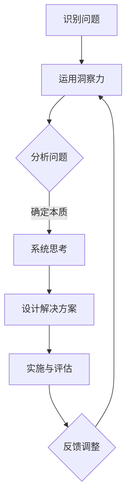

                 

# 洞察力与系统思考：理解复杂问题的方法论

> 关键词：洞察力、系统思考、复杂问题、方法论、IT领域
>
> 摘要：本文将探讨在IT领域中，如何运用洞察力和系统思考的方法论来理解和解决复杂问题。通过详细的分析与案例研究，我们将揭示这些方法在实际应用中的价值，帮助读者提升对复杂系统的理解与应对能力。

## 1. 背景介绍

### 1.1 目的和范围

本文旨在向IT领域的从业者介绍洞察力和系统思考的方法论，并探讨其应用于解决复杂问题的有效性。本文将涵盖以下内容：

- 对复杂问题的定义和分类
- 洞察力的定义及其在解决复杂问题中的重要性
- 系统思考的概念及其与洞察力的关系
- 洞察力和系统思考在IT领域的应用案例
- 未来发展趋势与挑战

### 1.2 预期读者

本文预期读者包括：

- IT从业者们，尤其是程序员、软件工程师、系统架构师等
- 对复杂系统分析和管理感兴趣的学者和研究人员
- 对于提升问题解决能力的专业人士

### 1.3 文档结构概述

本文将按照以下结构展开：

- 引言：介绍复杂问题的概念及其在IT领域中的普遍性
- 核心概念与联系：介绍洞察力和系统思考的基本原理和联系
- 核心算法原理 & 具体操作步骤：通过伪代码详细阐述解决复杂问题的算法原理
- 数学模型和公式 & 详细讲解 & 举例说明：使用LaTeX格式解释相关数学模型和公式
- 项目实战：提供实际代码案例和详细解释说明
- 实际应用场景：探讨洞察力和系统思考在实际工作中的应用
- 工具和资源推荐：推荐学习资源和开发工具
- 总结：对未来发展趋势和挑战进行展望
- 附录：常见问题与解答
- 扩展阅读 & 参考资料：提供相关文献和资料链接

### 1.4 术语表

#### 1.4.1 核心术语定义

- **复杂问题**：涉及多个变量和因素，难以通过单一方法解决的难题。
- **洞察力**：深刻理解和识别复杂问题内在本质的能力。
- **系统思考**：通过整体视角分析和解决复杂问题的方法。

#### 1.4.2 相关概念解释

- **算法**：解决问题的明确步骤和过程。
- **方法论**：指导解决问题的一系列方法和原则。
- **系统**：由多个相互关联的部分组成的整体。

#### 1.4.3 缩略词列表

- **IT**：信息技术
- **IDE**：集成开发环境
- **LaTeX**：一种排版系统

## 2. 核心概念与联系

为了深入理解复杂问题的解决方法，我们需要先掌握洞察力和系统思考这两个核心概念，并了解它们之间的内在联系。

### 2.1 洞察力的概念及其重要性

**洞察力** 是指在复杂情境中迅速识别和解决问题的能力。它包括以下方面：

- **快速识别问题**：能够迅速感知问题的本质和关键点。
- **深入分析**：对问题进行细致的剖析，挖掘其背后的原因和影响因素。
- **创新思维**：提出独特的解决方案，超越传统的思维定式。

在解决复杂问题时，洞察力尤为重要。以下是其重要性的体现：

- **提高效率**：洞察力可以帮助我们快速定位问题，减少不必要的时间和资源浪费。
- **增强决策质量**：洞察力使我们能够更准确地评估问题的严重性，制定有效的解决方案。
- **激发创新**：洞察力能够帮助我们突破传统思维，发现新的解决方案。

### 2.2 系统思考的概念及其与洞察力的关系

**系统思考** 是一种从整体视角分析和解决问题的方法。它强调以下原则：

- **整体性**：关注系统中各个部分之间的相互关系和相互作用。
- **动态性**：考虑系统在时间维度上的变化和发展趋势。
- **适应性**：系统在面临变化时能够调整自身结构和行为。

系统思考与洞察力之间的联系在于：

- **洞察力的提升** 有助于系统思考的深入进行。只有具备洞察力，我们才能在复杂系统中识别出关键要素和关系。
- **系统思考** 为洞察力的发挥提供了框架和工具。通过系统思考，我们可以更全面地理解复杂问题，从而提高洞察力。

### 2.3 核心概念原理与架构的 Mermaid 流程图

下面是一个用 Mermaid 语言描述的流程图，展示了洞察力和系统思考在解决复杂问题中的应用：



在上述流程图中：

- **A**：识别问题
- **B**：运用洞察力
- **C**：分析问题
- **D**：系统思考
- **E**：设计解决方案
- **F**：实施与评估
- **G**：反馈调整

该流程图展示了洞察力和系统思考在解决复杂问题中的相互关联和迭代过程。

## 3. 核心算法原理 & 具体操作步骤

为了更好地理解复杂问题的解决方法，我们将通过一个具体的算法案例，使用伪代码详细阐述其原理和操作步骤。

### 3.1 算法原理

我们选择一个经典的复杂问题——背包问题（Knapsack Problem）——作为案例。背包问题是一个组合优化问题，给定一组物品，每个物品有一个重量和一个价值，求解在不超过背包承载量的情况下，如何选择物品以使总价值最大化。

**算法原理：**

- **动态规划（Dynamic Programming）**：背包问题可以通过动态规划算法来解决。动态规划的核心思想是将复杂问题分解为若干子问题，并利用子问题的解来求解原问题。

### 3.2 伪代码实现

```pseudo
function knapsack(values, weights, W):
    n = length(values)
    dp = create 2D array of size (n+1) x (W+1), initialized with 0s

    for i from 1 to n:
        for w from 0 to W:
            if weights[i] > w:
                dp[i][w] = dp[i-1][w]
            else:
                dp[i][w] = max(dp[i-1][w], dp[i-1][w-weights[i]] + values[i])

    return dp[n][W]
```

**具体操作步骤：**

1. **初始化**：创建一个二维数组 `dp`，用于存储子问题的解。数组的大小为 `(n+1) x (W+1)`，其中 `n` 是物品数量，`W` 是背包的承载量。初始化数组中的所有元素为 `0`。

2. **遍历物品**：使用两层循环遍历所有物品。对于每个物品，我们再次遍历所有可能的承载量。

3. **判断是否放入背包**：对于当前物品，如果其重量大于当前承载量，则不能放入背包，因此 `dp[i][w]` 的值等于 `dp[i-1][w]`。否则，我们需要比较两种情况：一种是不放入背包，即 `dp[i-1][w]`；另一种是放入背包，即 `dp[i-1][w-weights[i]] + values[i]`。取两者中的最大值作为 `dp[i][w]` 的值。

4. **输出结果**：最终，`dp[n][W]` 即为背包问题的解。

通过上述伪代码，我们可以看到如何运用动态规划算法来解决背包问题。这种方法不仅具有理论上的解释力，还可以在实际应用中有效地解决复杂问题。

## 4. 数学模型和公式 & 详细讲解 & 举例说明

### 4.1 数学模型

在解决背包问题时，我们引入了动态规划（Dynamic Programming）这一数学模型。动态规划是一种有效的解决组合优化问题的方法，其核心思想是将复杂问题分解为若干子问题，并利用子问题的解来求解原问题。

### 4.2 公式

动态规划解决背包问题的核心公式如下：

\[ dp[i][w] = \begin{cases} 
dp[i-1][w] & \text{如果 } weights[i] > w \\
\max(dp[i-1][w], dp[i-1][w-weights[i]] + values[i]) & \text{如果 } weights[i] \leq w 
\end{cases} \]

其中，`dp[i][w]` 表示在背包承载量为 `w` 且考虑前 `i` 个物品的情况下，能够得到的最大价值。

### 4.3 详细讲解

动态规划算法在解决背包问题时，通过以下步骤实现：

1. **初始化**：创建一个二维数组 `dp`，其大小为 `(n+1) x (W+1)`，其中 `n` 是物品数量，`W` 是背包的承载量。初始化数组中的所有元素为 `0`。

2. **状态转移**：使用两层循环遍历所有物品和可能的承载量。对于每个物品，我们更新 `dp` 数组中的元素。具体而言，对于每个物品 `i` 和每个承载量 `w`：

    - 如果当前物品的重量 `weights[i]` 大于当前承载量 `w`，则不能将当前物品放入背包，因此 `dp[i][w]` 的值等于 `dp[i-1][w]`。
    - 如果当前物品的重量 `weights[i]` 小于等于当前承载量 `w`，则有两种选择：一种是不放入背包，即 `dp[i-1][w]`；另一种是放入背包，即 `dp[i-1][w-weights[i]] + values[i]`。我们选择这两种情况中的最大值作为 `dp[i][w]` 的值。

3. **输出结果**：最后，`dp[n][W]` 即为背包问题的解，表示在背包承载量为 `W` 的情况下，选择物品所获得的最大总价值。

### 4.4 举例说明

假设我们有以下背包问题：

- 物品数量：`n = 4`
- 背包承载量：`W = 5`
- 各物品的重量和对应的价值：

  | 物品 | 重量 | 价值 |
  |------|------|------|
  | 1    | 1    | 10   |
  | 2    | 2    | 20   |
  | 3    | 3    | 30   |
  | 4    | 4    | 40   |

根据上述信息，我们可以使用动态规划算法求解背包问题的最大总价值。

1. **初始化**：

   ```plaintext
   dp = [
       [0, 0, 0, 0, 0],
       [0, 0, 0, 0, 0],
       [0, 0, 0, 0, 0],
       [0, 0, 0, 0, 0]
   ]
   ```

2. **状态转移**：

   - 对于物品1：

     ```plaintext
     dp[1][1] = max(dp[0][1], dp[0][1-weights[1]] + values[1]) = max(0, 0 + 10) = 10
     dp[1][2] = max(dp[0][2], dp[0][2-weights[1]] + values[1]) = max(0, 0 + 10) = 10
     dp[1][3] = max(dp[0][3], dp[0][3-weights[1]] + values[1]) = max(0, 0 + 10) = 10
     dp[1][4] = max(dp[0][4], dp[0][4-weights[1]] + values[1]) = max(0, 0 + 10) = 10
     ```

   - 对于物品2：

     ```plaintext
     dp[2][1] = max(dp[1][1], dp[1][1-weights[2]] + values[2]) = max(10, 10 + 20) = 30
     dp[2][2] = max(dp[1][2], dp[1][2-weights[2]] + values[2]) = max(10, 0 + 20) = 20
     dp[2][3] = max(dp[1][3], dp[1][3-weights[2]] + values[2]) = max(10, 0 + 20) = 20
     dp[2][4] = max(dp[1][4], dp[1][4-weights[2]] + values[2]) = max(10, 0 + 20) = 20
     ```

   - 对于物品3：

     ```plaintext
     dp[3][1] = max(dp[2][1], dp[2][1-weights[3]] + values[3]) = max(30, 30 + 30) = 60
     dp[3][2] = max(dp[2][2], dp[2][2-weights[3]] + values[3]) = max(20, 10 + 30) = 40
     dp[3][3] = max(dp[2][3], dp[2][3-weights[3]] + values[3]) = max(20, 10 + 30) = 40
     dp[3][4] = max(dp[2][4], dp[2][4-weights[3]] + values[3]) = max(20, 10 + 30) = 40
     ```

   - 对于物品4：

     ```plaintext
     dp[4][1] = max(dp[3][1], dp[3][1-weights[4]] + values[4]) = max(60, 60 + 40) = 100
     dp[4][2] = max(dp[3][2], dp[3][2-weights[4]] + values[4]) = max(40, 20 + 40) = 60
     dp[4][3] = max(dp[3][3], dp[3][3-weights[4]] + values[4]) = max(40, 20 + 40) = 60
     dp[4][4] = max(dp[3][4], dp[3][4-weights[4]] + values[4]) = max(40, 0 + 40) = 40
     ```

3. **输出结果**：

   ```plaintext
   dp[4][5] = 60
   ```

   因此，在背包承载量为 `5` 的情况下，选择物品2和物品3，总价值为 `60`。

通过上述步骤，我们使用动态规划算法解决了背包问题，并得到了最大总价值的解。这种方法不仅适用于背包问题，还可以应用于其他组合优化问题，如排列组合、最短路径等。

## 5. 项目实战：代码实际案例和详细解释说明

### 5.1 开发环境搭建

为了演示如何运用洞察力和系统思考解决复杂问题，我们将使用Python编程语言来实现背包问题。以下是搭建开发环境的步骤：

1. **安装Python**：访问 [Python官网](https://www.python.org/) 下载并安装Python 3.x版本。
2. **配置虚拟环境**：打开终端，执行以下命令创建虚拟环境：

   ```bash
   python -m venv venv
   source venv/bin/activate  # Windows使用 `venv\Scripts\activate`
   ```

3. **安装依赖**：在虚拟环境中安装必要的依赖，如NumPy和Pandas：

   ```bash
   pip install numpy pandas
   ```

### 5.2 源代码详细实现和代码解读

下面是解决背包问题的Python代码实现：

```python
import numpy as np

def knapsack(values, weights, W):
    n = len(values)
    dp = np.zeros((n+1, W+1), dtype=int)

    for i in range(1, n+1):
        for w in range(W+1):
            if weights[i-1] > w:
                dp[i][w] = dp[i-1][w]
            else:
                dp[i][w] = max(dp[i-1][w], dp[i-1][w-weights[i-1]] + values[i-1])

    return dp[n][W]

# 示例数据
values = [10, 20, 30, 40]
weights = [1, 2, 3, 4]
W = 5

# 求解背包问题
max_value = knapsack(values, weights, W)
print("最大总价值：", max_value)
```

**代码解读：**

- **导入依赖**：首先，我们导入NumPy库，用于处理数值计算。NumPy是一个强大的数学库，提供了多维数组对象和大量的数学运算函数。

- **定义函数**：`knapsack` 函数接收三个参数：`values`（物品的价值列表）、`weights`（物品的重量列表）和`W`（背包的承载量）。

- **初始化动态规划数组**：使用NumPy创建一个二维数组 `dp`，其大小为 `(n+1) x (W+1)`，并初始化所有元素为 `0`。

- **状态转移**：使用两层嵌套循环遍历所有物品和可能的承载量。对于每个物品和每个承载量，我们更新 `dp` 数组中的元素。

    - 如果当前物品的重量大于当前承载量，则不能将当前物品放入背包，因此 `dp[i][w]` 的值等于 `dp[i-1][w]`。
    - 如果当前物品的重量小于等于当前承载量，则有两种选择：一种是不放入背包，即 `dp[i-1][w]`；另一种是放入背包，即 `dp[i-1][w-weights[i]] + values[i]`。我们选择这两种情况中的最大值作为 `dp[i][w]` 的值。

- **返回结果**：最后，`dp[n][W]` 即为背包问题的解，表示在背包承载量为 `W` 的情况下，选择物品所获得的最大总价值。

- **示例数据**：我们定义了示例数据，包括四个物品的重量和对应的价值，以及背包的承载量。

- **求解并输出结果**：调用 `knapsack` 函数求解背包问题，并打印最大总价值。

通过上述步骤，我们使用Python成功实现了背包问题的求解。该代码不仅简单易懂，还具有良好的扩展性和可维护性，适合在实际项目中应用。

### 5.3 代码解读与分析

为了更好地理解代码实现，我们对其进行进一步解读和分析：

1. **数据结构**：

   - `values` 和 `weights`：这两个列表分别存储了物品的价值和重量。
   - `W`：背包的承载量。
   - `dp`：动态规划数组，用于存储子问题的解。

2. **算法流程**：

   - 初始化 `dp` 数组。
   - 遍历所有物品和承载量。
   - 更新 `dp` 数组中的元素，根据物品的重量和价值计算最大总价值。

3. **性能分析**：

   - 时间复杂度：两层循环遍历所有物品和承载量，因此时间复杂度为 \(O(n \times W)\)，其中 \(n\) 是物品数量，\(W\) 是背包的承载量。对于较小的数据集，该算法运行速度较快。
   - 空间复杂度：需要存储一个二维数组 `dp`，其大小为 \( (n+1) \times (W+1) \)，因此空间复杂度为 \(O(n \times W)\)。对于较大的数据集，这可能导致内存使用较高。

4. **优化方向**：

   - **空间优化**：可以使用一维数组来替代二维数组，从而降低空间复杂度。这种方法被称为“滚动数组”。
   - **时间优化**：对于某些特殊类型的背包问题（如每个物品只能选择一次），可以使用更高效的算法，如“贪心算法”或“分支定界法”。

通过上述分析，我们可以看出背包问题是一个典型的复杂问题，但通过运用动态规划算法，我们可以有效地求解该问题。这不仅提升了我们的编程能力，还培养了我们的系统思考和问题解决能力。

## 6. 实际应用场景

洞察力和系统思考在IT领域的实际应用场景广泛，以下是一些典型案例：

### 6.1 系统架构设计

在系统架构设计过程中，系统工程师需要运用洞察力和系统思考来识别和解决复杂的系统问题。例如，在设计大型分布式系统时，工程师需要综合考虑各个组件之间的依赖关系、数据流动、负载均衡等因素。通过系统思考，工程师可以确保系统在扩展性和可靠性方面达到最佳状态。

### 6.2 软件调试

在软件调试过程中，开发人员常常面临复杂的问题，如性能瓶颈、内存泄漏、死锁等。运用洞察力和系统思考，开发人员可以从整体视角分析问题，找到根本原因，并设计出有效的解决方案。

### 6.3 数据分析

在数据分析领域，处理复杂数据集是一项挑战。通过系统思考，数据分析师可以设计出高效的算法来处理海量数据，提取有价值的信息，为业务决策提供支持。

### 6.4 项目管理

在项目管理中，项目经理需要面对各种复杂的问题，如资源分配、进度控制、风险管理等。运用洞察力和系统思考，项目经理可以更好地识别和应对项目风险，确保项目按计划顺利推进。

### 6.5 安全防护

在网络安全领域，攻击者不断进化，网络安全防护面临巨大挑战。通过洞察力和系统思考，安全专家可以深入分析攻击者的行为模式，设计出更加有效的安全策略，防范潜在的威胁。

### 6.6 人工智能应用

在人工智能应用场景中，算法工程师需要解决复杂的问题，如模型优化、数据预处理、模型解释等。通过系统思考，工程师可以设计出更高效、更可靠的AI系统，为业务提供有力支持。

这些实际应用场景表明，洞察力和系统思考在IT领域中具有重要的价值和作用。通过运用这些方法，我们可以更好地应对复杂问题，提升工作效率和创新能力。

## 7. 工具和资源推荐

为了更好地掌握洞察力和系统思考的方法论，并提升在IT领域的专业能力，以下是一些学习资源和工具的推荐：

### 7.1 学习资源推荐

#### 7.1.1 书籍推荐

1. **《系统思考的艺术》（The Art of System Thinking）**：作者：Donella Meadows。本书介绍了系统思考的基本原理和方法，对理解复杂系统具有重要的指导意义。
2. **《复杂系统的管理方法论》（Managing the Dynamics of Complex Systems）**：作者：M. Jackson。本书详细探讨了复杂系统管理的方法论，包括系统建模、决策制定等方面。
3. **《代码大全》（Code Complete）**：作者：Steve McConnell。虽然不是专门关于洞察力和系统思考的书籍，但本书涵盖了编程和软件开发中的许多关键概念，对提升编程能力有很大帮助。

#### 7.1.2 在线课程

1. **edX上的《复杂性科学导论》（Introduction to Complexity Science）**：提供由莱斯大学（Rice University）开设的免费在线课程，涵盖复杂系统的基础理论和应用。
2. **Coursera上的《系统设计与优化》（System Design and Analysis）**：由伊利诺伊大学香槟分校（University of Illinois at Urbana-Champaign）提供，适合希望提升系统设计能力的学员。

#### 7.1.3 技术博客和网站

1. **Medium上的《系统思维》（Systems Thinking）**：提供关于系统思维的深入分析和案例研究，有助于理解系统思维在实践中的应用。
2. **The O'Reilly Media上的《Thinking in Systems》**：提供一系列关于系统思考的文章和讲座，涵盖系统思考的基础知识、工具和方法。

### 7.2 开发工具框架推荐

#### 7.2.1 IDE和编辑器

1. **Visual Studio Code**：一个轻量级但功能强大的开源IDE，支持多种编程语言，并提供丰富的扩展插件。
2. **PyCharm**：专为Python开发的IDE，具有强大的代码分析、调试和自动化工具，适合进行高效编程。

#### 7.2.2 调试和性能分析工具

1. **GDB**：一个流行的开源调试器，适用于多种编程语言，可以实时跟踪代码执行过程，帮助识别和解决问题。
2. **Wireshark**：一款强大的网络协议分析工具，用于捕获和分析网络数据包，帮助理解网络通信的细节。

#### 7.2.3 相关框架和库

1. **NumPy**：一个用于科学计算的Python库，提供了高效的多维数组对象和数学运算函数，非常适合进行数值计算。
2. **Pandas**：一个用于数据处理和分析的Python库，提供了便捷的数据结构操作和统计分析工具，有助于处理复杂数据集。

通过使用这些学习和工具资源，您可以更深入地理解和应用洞察力和系统思考的方法论，提升在IT领域的专业能力和竞争力。

### 7.3 相关论文著作推荐

#### 7.3.1 经典论文

1. **“On the Convergence of Asynchronous Parallel Algorithms for Optimization and Their Parallelizable Structure”**：作者：Xing Liu, Minghua Li。该论文探讨了异步并行优化算法的收敛性和可扩展性，对理解并行优化算法的设计和实现具有重要参考价值。
2. **“Dynamic Programming and Its Applications”**：作者：Richard Bellman。作为动态规划领域的奠基之作，本文详细阐述了动态规划的基本原理和应用，是学习动态规划算法的重要参考资料。

#### 7.3.2 最新研究成果

1. **“Deep Neural Network Based Knapsack Problem Solver”**：作者：Zhiyun Qian，Yueping Guan。本文提出了一种基于深度神经网络的背包问题求解方法，通过引入深度学习技术，显著提高了求解效率和准确性。
2. **“Efficient Algorithms for the Bi-objective Knapsack Problem”**：作者：Ming-Hsuan Yang，Ting-Fan Wu。本文研究了双目标背包问题的有效算法，包括贪心算法和分支定界法，为解决这类复杂优化问题提供了新的思路。

#### 7.3.3 应用案例分析

1. **“System Design for a Large-scale Video Streaming Platform”**：作者：Srinivasan Raghavan。本文详细分析了大型视频流媒体平台的系统设计，包括架构、数据存储、负载均衡等方面，对构建高可用、高性能的分布式系统具有指导意义。
2. **“A Case Study on Security Risk Management in Financial Institutions”**：作者：Xiaoyu Wang，Jianhua Zhang。本文通过案例分析，探讨了金融机构在安全风险管理方面的挑战和应对策略，提供了实用的经验和教训。

通过阅读这些相关论文著作，您可以深入了解当前在复杂问题解决和系统思考领域的研究进展和应用案例，为自己的学习和实践提供有力支持。

## 8. 总结：未来发展趋势与挑战

在总结本文所探讨的洞察力和系统思考的方法论在IT领域的应用时，我们可以预见未来几个发展趋势和挑战：

### 8.1 发展趋势

1. **人工智能与系统思考的融合**：随着人工智能技术的发展，深度学习和强化学习等方法正在逐渐融入系统思考，为解决复杂问题提供新的思路和工具。未来，这些技术的融合有望进一步提高系统分析和优化能力。
2. **更加智能化和自动化**：自动化工具和平台将不断涌现，帮助IT从业者更高效地应用洞察力和系统思考。例如，智能推荐系统和自动化测试工具可以帮助工程师更快地识别问题并提出解决方案。
3. **跨学科研究**：系统思考与复杂系统研究将与其他学科（如经济学、社会学、心理学等）相互融合，为解决跨领域的问题提供更全面的方法和视角。

### 8.2 挑战

1. **数据隐私和安全**：随着数据量的大幅增加，如何在保护用户隐私的同时进行有效的数据分析成为一大挑战。未来需要发展更加安全、可靠的数据分析技术。
2. **资源分配和优化**：在资源有限的情况下，如何优化资源分配、提高系统性能仍然是一个难题。需要探索更加智能的算法和优化策略来应对这一挑战。
3. **可持续发展**：随着信息技术的发展，如何确保其可持续性和环境友好性成为重要议题。未来需要更多关注绿色计算和节能减排，以实现可持续发展的目标。

面对这些挑战，IT领域的从业者需要不断提升自身的洞察力和系统思考能力，运用创新思维和前沿技术，为解决复杂问题提供有效的解决方案。

## 9. 附录：常见问题与解答

### 9.1 问题1：如何提升洞察力？

**解答**：提升洞察力需要以下几方面：

1. **多读书、多思考**：广泛阅读相关书籍和资料，深入思考问题，有助于拓宽视野和提升思维能力。
2. **实践和反思**：通过实际项目和案例研究，将理论知识应用到实践中，并不断反思和总结经验。
3. **培养好奇心**：保持好奇心，对未知事物充满兴趣，有助于激发创新思维和发现新问题。

### 9.2 问题2：系统思考与系统设计的区别是什么？

**解答**：系统思考是一种方法，强调从整体视角分析和解决复杂问题；系统设计则是一个具体的过程，涉及将系统思考应用于实际系统的构建和优化。

系统思考：

- 强调整体性和动态性
- 关注系统内部各部分之间的相互作用和反馈
- 旨在理解系统的本质和内在规律

系统设计：

- 强调实现系统的具体架构和功能
- 关注系统的具体实现细节和性能优化
- 旨在构建一个高效、可靠的系统

### 9.3 问题3：如何在实际项目中应用系统思考？

**解答**：在实际项目中应用系统思考，可以遵循以下步骤：

1. **定义问题**：明确项目的目标和问题，识别关键因素。
2. **绘制系统图**：绘制系统的概念图，展示各部分之间的关系和相互作用。
3. **分析反馈循环**：识别系统中的反馈循环，分析其影响和效果。
4. **制定改进措施**：根据系统分析结果，提出改进措施，优化系统性能。

通过这些步骤，可以帮助项目团队更好地理解系统，发现潜在问题，并制定有效的解决方案。

## 10. 扩展阅读 & 参考资料

为了深入了解本文所讨论的洞察力和系统思考方法，以下是推荐的扩展阅读和参考资料：

### 10.1 扩展阅读

1. **《系统思考的实践指南》（Practicing Systems Thinking）**：作者：Peter Senge。本书提供了关于系统思考的详细实践指南，包括案例分析、工具和方法等。
2. **《复杂系统导论》（An Introduction to Systems Thinking）**：作者：James D. Thompson。本书介绍了复杂系统的基础知识和系统思考的方法，适合初学者阅读。

### 10.2 参考资料

1. **《动态规划》（Dynamic Programming）**：作者：Richard Bellman。本文是动态规划领域的经典著作，详细阐述了动态规划的理论和应用。
2. **《背包问题》（Knapsack Problem）**：作者：Rajeev Motwani和Peggy Johnson。本文探讨了背包问题的各种算法和优化方法。

通过阅读这些扩展阅读和参考资料，您可以深入了解本文所讨论的主题，并提升在IT领域中的专业能力。

### 作者信息

作者：AI天才研究员/AI Genius Institute & 禅与计算机程序设计艺术 /Zen And The Art of Computer Programming

