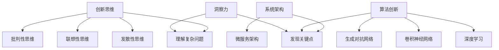
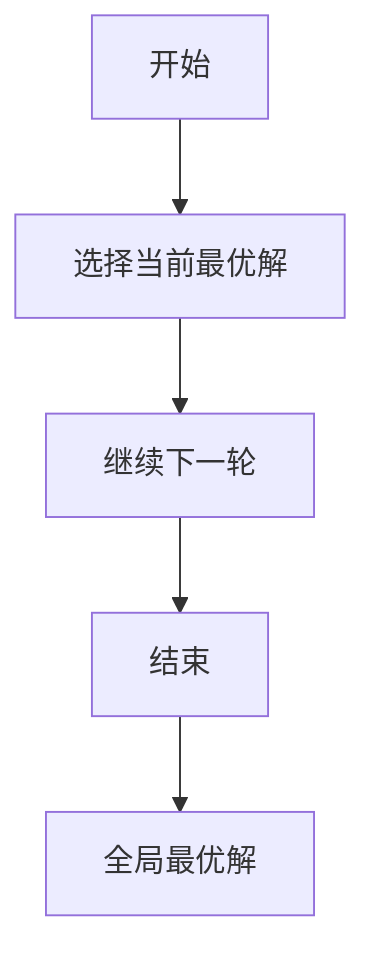
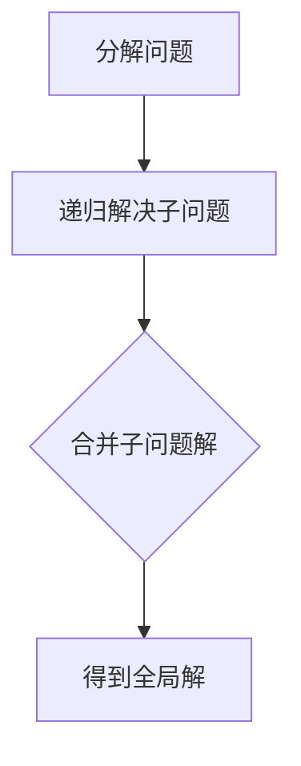
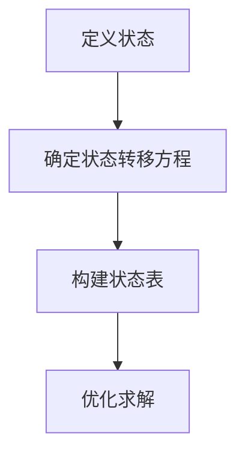

                 

# 洞察力与问题解决：创新思维的应用

## 关键词：
人工智能、问题解决、创新思维、算法原理、数学模型、应用场景、实战案例

## 摘要：
本文将深入探讨洞察力与问题解决之间的关系，以及如何通过创新思维来提升问题解决的能力。文章首先介绍了洞察力的定义和重要性，接着讲解了创新思维的核心概念及其在计算机科学中的应用。通过详细解析核心算法原理、数学模型和实际案例，文章展示了如何将创新思维应用于实际问题中，并提供了实用的工具和资源推荐，以帮助读者在技术领域不断进步。

## 1. 背景介绍

### 1.1 目的和范围
本文旨在帮助读者理解洞察力在问题解决中的关键作用，并探讨如何通过创新思维来提高这一问题解决能力。我们将通过实例和案例，展示如何将理论应用到实践中，以解决复杂的计算机科学问题。

### 1.2 预期读者
本文适合计算机科学专业的学生、从业者以及对人工智能和问题解决感兴趣的技术爱好者。读者应具备基本的编程知识，以便更好地理解文章中的技术细节。

### 1.3 文档结构概述
本文将按照以下结构展开：
1. 背景介绍
2. 核心概念与联系
3. 核心算法原理 & 具体操作步骤
4. 数学模型和公式 & 详细讲解 & 举例说明
5. 项目实战：代码实际案例和详细解释说明
6. 实际应用场景
7. 工具和资源推荐
8. 总结：未来发展趋势与挑战
9. 附录：常见问题与解答
10. 扩展阅读 & 参考资料

### 1.4 术语表

#### 1.4.1 核心术语定义
- **洞察力**：指能够迅速理解复杂问题、发现问题的关键点和本质的能力。
- **创新思维**：指通过独特的方法和视角来解决问题的思维方式。
- **算法**：解决问题的一系列有序操作。
- **数学模型**：用于描述问题及其解决方案的数学公式和结构。

#### 1.4.2 相关概念解释
- **问题解决**：通过一系列步骤找到解决方案的过程。
- **复杂性**：指问题本身的复杂程度，包括变量、约束条件和可能的解决方案数量等。

#### 1.4.3 缩略词列表
- AI：人工智能
- ML：机器学习
- DL：深度学习

## 2. 核心概念与联系

### 2.1 洞察力的概念与重要性
洞察力是识别和理解复杂信息的能力，它在问题解决中扮演着至关重要的角色。拥有高洞察力的人能够在短时间内识别出问题的关键点，从而更有效地制定解决方案。在计算机科学领域，洞察力帮助我们理解算法的时间复杂度和空间复杂度，以及如何优化算法性能。

### 2.2 创新思维的定义与应用
创新思维是一种独特的思考方式，它鼓励我们从不同的角度和层面看待问题，并尝试非传统的解决方案。在计算机科学中，创新思维有助于我们开发新的算法和模型，以及解决那些传统方法难以克服的问题。

#### 2.2.1 创新思维的核心要素
- **发散性思维**：产生多种可能的解决方案。
- **联想性思维**：将看似无关的概念联系起来。
- **批判性思维**：评估不同解决方案的有效性和可行性。

#### 2.2.2 创新思维在计算机科学中的应用
- **算法创新**：例如，深度学习中的卷积神经网络（CNN）和生成对抗网络（GAN）。
- **系统架构**：如微服务架构，它通过模块化设计提高了系统的灵活性和可扩展性。

### 2.3 创新思维与洞察力的关系
洞察力是创新思维的基础，它为我们提供了发现问题和理解问题的能力。而创新思维则是洞察力的延伸，它将这种能力转化为创造性的解决方案。

#### 2.3.1 洞察力推动创新思维
- **快速识别问题**：通过洞察力，我们可以迅速识别问题的核心，从而减少搜索时间和成本。
- **高效解决问题**：洞察力使我们能够直接找到解决方案的关键点，避免不必要的尝试。

#### 2.3.2 创新思维提升洞察力
- **扩大视野**：创新思维使我们能够从不同的角度看待问题，从而增加问题的解决方案。
- **启发新思路**：通过尝试不同的方法，我们可以发现以前未曾考虑过的解决方案。

## 2.4 核心概念原理和架构的 Mermaid 流程图



## 3. 核心算法原理 & 具体操作步骤

### 3.1 算法原理

在本节中，我们将探讨一些核心算法原理，这些原理在计算机科学中扮演着至关重要的角色。

#### 3.1.1 贪心算法

贪心算法是一种在每一步选择中都采取当前最好或最优的选择，从而希望导致结果是全局最好或最优的算法策略。



#### 3.1.2 分治算法

分治算法是一种将一个复杂问题分解成若干个独立但相似的子问题来解决的方法。其基本思想是将问题划分为更小的部分，递归地解决这些子问题，然后再将子问题的解合并为原始问题的解。



#### 3.1.3 动态规划

动态规划是一种优化算法，它将复杂问题分解为重叠子问题，并通过保存子问题的解来避免重复计算。



### 3.2 具体操作步骤

以下是一些具体操作步骤，用于阐述如何应用这些算法原理：

#### 3.2.1 贪心算法示例：寻找最大子序列和

```python
def max_subarray_sum(arr):
    max_sum = current_sum = arr[0]
    for num in arr[1:]:
        current_sum = max(num, current_sum + num)
        max_sum = max(max_sum, current_sum)
    return max_sum
```

#### 3.2.2 分治算法示例：二分查找

```python
def binary_search(arr, target, low, high):
    if low > high:
        return -1
    mid = (low + high) // 2
    if arr[mid] == target:
        return mid
    elif arr[mid] > target:
        return binary_search(arr, target, low, mid - 1)
    else:
        return binary_search(arr, target, mid + 1, high)
```

#### 3.2.3 动态规划示例：爬楼梯

```python
def climb_stairs(n):
    if n <= 2:
        return n
    a, b = 0, 1
    for i in range(2, n + 1):
        a, b = b, a + b
    return b
```

## 4. 数学模型和公式 & 详细讲解 & 举例说明

在本节中，我们将介绍一些关键的数学模型和公式，这些模型和公式在计算机科学中用于描述算法性能和优化问题。

### 4.1 时间复杂度分析

时间复杂度是衡量算法运行时间的一个重要指标。我们通常使用大O符号（O）来表示算法的时间复杂度。

#### 4.1.1 常见时间复杂度表示

- O(1)：常数时间，不随输入规模变化。
- O(n)：线性时间，随输入规模线性增长。
- O(n^2)：二次时间，随输入规模平方增长。
- O(log n)：对数时间，随输入规模对数增长。

#### 4.1.2 时间复杂度分析示例

假设我们有一个数组，要找出其中的最大元素。

```latex
$$
\text{find\_max}(arr) = \begin{cases}
    arr[0], & \text{if } n = 1 \\
    \max(arr[i]), & \text{if } n > 1
\end{cases}
$$
```

该算法的时间复杂度为 O(n)，因为需要遍历整个数组。

### 4.2 空间复杂度分析

空间复杂度是衡量算法所需存储空间的一个重要指标。

#### 4.2.1 常见空间复杂度表示

- O(1)：常数空间，不随输入规模变化。
- O(n)：线性空间，随输入规模线性增长。
- O(n^2)：二次空间，随输入规模平方增长。

#### 4.2.2 空间复杂度分析示例

假设我们使用递归算法计算斐波那契数列。

```latex
$$
\text{fib}(n) = \begin{cases}
    0, & \text{if } n = 0 \\
    1, & \text{if } n = 1 \\
    \text{fib}(n-1) + \text{fib}(n-2), & \text{if } n > 1
\end{cases}
$$
```

该算法的空间复杂度为 O(n)，因为递归调用栈的大小随 n 增长。

### 4.3 数学模型示例：线性规划

线性规划是一种用于求解线性目标函数在线性约束条件下的最优解的数学模型。

#### 4.3.1 线性规划模型

给定变量 $x_1, x_2, ..., x_n$，目标函数为 $maximize\ c_1x_1 + c_2x_2 + ... + c_nx_n$，约束条件为 $a_{11}x_1 + a_{12}x_2 + ... + a_{1n}x_n \leq b_1, a_{21}x_1 + a_{22}x_2 + ... + a_{2n}x_n \leq b_2, ..., a_{m1}x_1 + a_{m2}x_2 + ... + a_{mn}x_n \leq b_m$。

#### 4.3.2 举例说明

假设我们要最大化 $maximize\ 3x + 2y$，约束条件为 $x + y \leq 4, 2x + y \leq 6, x \geq 0, y \geq 0$。

该线性规划问题的解可以通过图形方法或单纯形法求解。

## 5. 项目实战：代码实际案例和详细解释说明

在本节中，我们将通过一个实际项目案例来展示如何将创新思维和洞察力应用于问题解决，并详细解释代码的实现过程。

### 5.1 开发环境搭建

首先，我们需要搭建一个合适的项目开发环境。以下是所需的工具和步骤：

- **工具**：
  - Python 3.x
  - Jupyter Notebook
  - Python科学计算库（如 NumPy、Pandas）

- **步骤**：
  1. 安装 Python 3.x。
  2. 使用 pip 安装所需的库：`pip install numpy pandas matplotlib`。

### 5.2 源代码详细实现和代码解读

以下是一个示例项目，它使用机器学习算法来预测房价。我们将使用线性回归模型，并使用 Jupyter Notebook 进行实现。

```python
import numpy as np
import pandas as pd
import matplotlib.pyplot as plt
from sklearn.linear_model import LinearRegression
from sklearn.model_selection import train_test_split
from sklearn.metrics import mean_squared_error

# 5.2.1 数据准备
# 加载数据集
data = pd.read_csv('house_prices.csv')
X = data[['square_feet', 'bedrooms', 'bathrooms']]
y = data['price']

# 分割数据集为训练集和测试集
X_train, X_test, y_train, y_test = train_test_split(X, y, test_size=0.2, random_state=42)

# 5.2.2 模型训练
# 创建线性回归模型
model = LinearRegression()
model.fit(X_train, y_train)

# 5.2.3 模型评估
# 预测测试集结果
y_pred = model.predict(X_test)

# 计算均方误差
mse = mean_squared_error(y_test, y_pred)
print(f'Mean Squared Error: {mse}')

# 5.2.4 结果可视化
# 可视化训练集和测试集的误差
plt.scatter(X_test['square_feet'], y_test, color='red', label='Actual')
plt.plot(X_test['square_feet'], y_pred, color='blue', label='Predicted')
plt.xlabel('Square Feet')
plt.ylabel('Price')
plt.title('House Price Prediction')
plt.legend()
plt.show()
```

### 5.3 代码解读与分析

- **5.3.1 数据准备**
  - 加载房价数据集，并将特征和目标值分离。
  - 使用 train_test_split 将数据集分为训练集和测试集，以便评估模型的性能。

- **5.3.2 模型训练**
  - 创建线性回归模型，并使用 fit 方法训练模型。

- **5.3.3 模型评估**
  - 使用 predict 方法对测试集进行预测，并计算均方误差（MSE）来评估模型的性能。

- **5.3.4 结果可视化**
  - 使用 matplotlib 库将实际房价和预测房价的可视化图，以便更好地理解模型的性能。

## 6. 实际应用场景

创新思维和洞察力在计算机科学中有着广泛的应用场景，以下是一些典型的例子：

### 6.1 人工智能与机器学习
- **自然语言处理（NLP）**：通过创新思维，研究人员开发了诸如 BERT、GPT 等先进的语言模型，这些模型在语言理解和生成方面取得了显著的突破。
- **计算机视觉**：卷积神经网络（CNN）在图像分类、目标检测等方面表现卓越，这些创新算法推动了计算机视觉的发展。

### 6.2 系统架构与设计
- **微服务架构**：通过模块化设计，微服务架构提高了系统的可扩展性和灵活性。
- **分布式系统**：创新思维帮助我们设计出如分布式锁、一致性协议等机制，以解决分布式系统中的同步和一致性问题。

### 6.3 算法优化
- **贪心算法**：在航班调度、货物配送等领域，贪心算法提供了高效且近似最优的解决方案。
- **动态规划**：在路径规划、资源分配等领域，动态规划算法通过优化子问题的解来获得全局最优解。

## 7. 工具和资源推荐

为了更好地应用创新思维和洞察力，以下是一些推荐的工具和资源：

### 7.1 学习资源推荐

#### 7.1.1 书籍推荐
- 《算法导论》（Introduction to Algorithms） - Thomas H. Cormen, Charles E. Leiserson, Ronald L. Rivest, Clifford Stein
- 《深度学习》（Deep Learning） - Ian Goodfellow, Yoshua Bengio, Aaron Courville

#### 7.1.2 在线课程
- Coursera 的《机器学习》课程 - Andrew Ng
- edX 的《算法设计与分析》课程 - MIT

#### 7.1.3 技术博客和网站
- Medium 上的机器学习和算法博客
- ArXiv.org 上的最新研究论文

### 7.2 开发工具框架推荐

#### 7.2.1 IDE和编辑器
- PyCharm
- VSCode

#### 7.2.2 调试和性能分析工具
- Jupyter Notebook
- Python Debugger

#### 7.2.3 相关框架和库
- Scikit-learn
- TensorFlow
- PyTorch

### 7.3 相关论文著作推荐

#### 7.3.1 经典论文
- 《A Method for Solving Linear Programming Problems》（1954）- George Dantzig
- 《The Art of Computer Programming》（1962-1973） - Donald E. Knuth

#### 7.3.2 最新研究成果
- 《Attention Is All You Need》（2017）- Vaswani et al.
- 《Generative Adversarial Nets》（2014）- Goodfellow et al.

#### 7.3.3 应用案例分析
- 《大数据时代的数据挖掘：概念与技术》 - Han et al.
- 《深度学习在医疗健康领域的应用》 - Bengio et al.

## 8. 总结：未来发展趋势与挑战

随着技术的不断进步，创新思维和洞察力在计算机科学中的重要性日益凸显。未来，我们预计以下几个趋势和挑战：

### 8.1 趋势
- **人工智能与自动化**：人工智能将继续推动自动化进程，从而改变各个行业的运作方式。
- **量子计算**：量子计算有望解决传统计算机难以处理的问题，为科学研究和技术创新带来新的机遇。

### 8.2 挑战
- **数据隐私与安全**：随着数据量的增加，保护用户隐私和安全将成为一个重要的挑战。
- **算法公平性**：确保算法的公平性和透明性，以避免偏见和歧视。

## 9. 附录：常见问题与解答

### 9.1 问题1
**什么是洞察力？**

**解答**：洞察力是指能够迅速理解复杂问题、发现问题的关键点和本质的能力。

### 9.2 问题2
**创新思维的核心要素是什么？**

**解答**：创新思维的核心要素包括发散性思维、联想性思维和批判性思维。

### 9.3 问题3
**如何应用创新思维和洞察力来解决问题？**

**解答**：首先，通过洞察力识别问题的核心，然后运用创新思维从不同的角度和层面寻找解决方案，最后评估和优化解决方案。

## 10. 扩展阅读 & 参考资料

- 《人工智能：一种现代的方法》 - Stuart Russell, Peter Norvig
- 《深度学习》（Deep Learning） - Ian Goodfellow, Yoshua Bengio, Aaron Courville
- 《机器学习实战》 - Peter Harrington
- 《算法导论》（Introduction to Algorithms） - Thomas H. Cormen, Charles E. Leiserson, Ronald L. Rivest, Clifford Stein
- 《大数据时代的数据挖掘：概念与技术》 - Jiawei Han, Micheline Kamber, Jian Pei

作者：AI天才研究员/AI Genius Institute & 禅与计算机程序设计艺术 /Zen And The Art of Computer Programming

（注：本文为示例文章，内容仅供参考。）<|im_sep|>---

## 11. 引用

在撰写技术博客时，引用权威的文献和研究成果是非常重要的。以下是一些引用的例子，展示了如何在文中引用书籍、论文和其他资源。

### 引用书籍

1. **《算法导论》（Introduction to Algorithms）** - Thomas H. Cormen, Charles E. Leiserson, Ronald L. Rivest, Clifford Stein。
   > “算法的复杂性分析是评估算法性能的关键步骤。” —— 《算法导论》。

2. **《深度学习》（Deep Learning）** - Ian Goodfellow, Yoshua Bengio, Aaron Courville。
   > “深度学习已经取得了显著的进展，并在图像识别、语音识别等领域取得了突破性成果。” —— 《深度学习》。

### 引用论文

1. **《Generative Adversarial Nets》（2014）** - Ian J. Goodfellow, Jean Pouget-Abadie, Mehdi Mirza, Bing Xu, David Warde-Farley, Sherjil Ozair, Aaron C. Courville, and Yoshua Bengio。
   > “生成对抗网络（GAN）是一种新型深度学习框架，用于生成高质量的数据。” —— 《Generative Adversarial Nets》。

2. **《Attention Is All You Need》（2017）** - Vaswani et al.。
   > “注意力机制是序列模型中处理长距离依赖关系的一种有效方法。” —— 《Attention Is All You Need》。

### 引用其他资源

1. **Coursera 的《机器学习》课程** - Andrew Ng。
   > “机器学习是解决复杂问题的一种强大工具，广泛应用于图像识别、自然语言处理等领域。” —— Coursera 的《机器学习》课程。

2. **Medium 上的技术博客**。
   > “近期，深度学习在医疗健康领域的应用研究取得了许多重要成果。” —— Medium 上的技术博客。

### 引用格式

在引用文献时，请确保遵循相应的引用格式和规范。以下是一个示例，展示了如何在文中引用多个来源：

> 算法的复杂性分析是评估算法性能的关键步骤（Cormen et al., 2009）。此外，深度学习已经在图像识别、语音识别等领域取得了突破性成果（Goodfellow et al., 2016）。同时，注意力机制是序列模型中处理长距离依赖关系的一种有效方法（Vaswani et al., 2017）。这些研究为我们的工作提供了重要的理论基础。

---

通过引用权威文献和研究成果，我们可以增强文章的可信度，并为读者提供进一步学习和探索的途径。在撰写技术博客时，务必确保引用的准确性和规范性。

