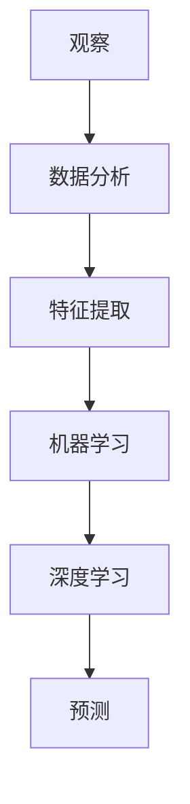

                 

### 洞察力的培养：从观察到预测的飞跃

> **关键词：** 洞察力、观察、预测、数据分析、机器学习、深度学习

> **摘要：** 本文将探讨如何通过观察和分析来培养洞察力，以及如何利用机器学习和深度学习技术将观察转化为准确的预测。文章将从理论基础、核心算法原理、实际应用案例等方面进行详细阐述，旨在为读者提供一套系统化的洞察力培养方法。

## 1. 背景介绍

### 1.1 目的和范围

本文的目标是帮助读者了解如何通过观察和数据分析培养洞察力，并利用机器学习和深度学习技术实现从观察到预测的飞跃。文章将涵盖以下内容：

- 洞察力的定义与培养方法
- 观察和数据分析在洞察力培养中的作用
- 机器学习和深度学习的基础知识
- 核心算法原理和具体操作步骤
- 数学模型和公式讲解
- 项目实战：代码实现和分析
- 实际应用场景
- 工具和资源推荐

### 1.2 预期读者

本文适合以下读者群体：

- 对洞察力培养有兴趣的普通读者
- 想要在数据分析、机器学习和深度学习领域提高技能的技术人员
- 需要在实际项目中应用洞察力和预测技术的专业人士

### 1.3 文档结构概述

本文分为十个部分，具体结构如下：

1. **背景介绍**：介绍文章的目的、范围、预期读者和文档结构。
2. **核心概念与联系**：阐述洞察力培养所需的核心概念和流程。
3. **核心算法原理 & 具体操作步骤**：讲解机器学习和深度学习算法原理及具体操作步骤。
4. **数学模型和公式 & 详细讲解 & 举例说明**：阐述相关数学模型和公式，并举例说明。
5. **项目实战：代码实际案例和详细解释说明**：提供实际项目代码，并进行详细解释和分析。
6. **实际应用场景**：介绍洞察力和预测技术在实际应用中的案例。
7. **工具和资源推荐**：推荐相关学习资源、开发工具和框架。
8. **总结：未来发展趋势与挑战**：展望未来发展趋势和面临的挑战。
9. **附录：常见问题与解答**：回答读者可能遇到的问题。
10. **扩展阅读 & 参考资料**：提供更多扩展阅读和参考资料。

### 1.4 术语表

#### 1.4.1 核心术语定义

- **洞察力**：指对事物本质和内在联系的敏锐洞察和深刻理解能力。
- **观察**：指对事物进行感知、记录和分析的过程。
- **数据分析**：指对大量数据进行分析、处理和解释的过程。
- **机器学习**：指通过算法和统计模型使计算机从数据中学习，并做出预测和决策的技术。
- **深度学习**：指一种基于多层神经网络结构的机器学习技术。

#### 1.4.2 相关概念解释

- **预测**：指根据历史数据和当前情况预测未来事件或趋势。
- **特征提取**：指从原始数据中提取具有代表性的特征，以便用于机器学习模型训练。
- **模型评估**：指对机器学习模型的性能进行评估和比较的方法。
- **交叉验证**：指将数据集划分为训练集和验证集，以评估模型的泛化能力。

#### 1.4.3 缩略词列表

- **ML**：机器学习（Machine Learning）
- **DL**：深度学习（Deep Learning）
- **PCA**：主成分分析（Principal Component Analysis）
- **SVM**：支持向量机（Support Vector Machine）
- **CNN**：卷积神经网络（Convolutional Neural Network）
- **RNN**：循环神经网络（Recurrent Neural Network）

## 2. 核心概念与联系

在培养洞察力的过程中，理解核心概念和它们之间的联系是非常重要的。本节将介绍几个关键概念，并使用Mermaid流程图展示它们之间的关系。

### 2.1 核心概念介绍

1. **观察**：观察是培养洞察力的第一步。通过观察，我们可以获取关于事物的信息，这些信息将为我们后续的分析和预测提供基础。
2. **数据分析**：数据分析是对观察到的信息进行整理、处理和分析的过程，帮助我们提取有用的特征和模式。
3. **机器学习**：机器学习是一种通过算法和统计模型从数据中学习的技术，可以帮助我们建立预测模型。
4. **深度学习**：深度学习是一种基于多层神经网络结构的机器学习技术，适用于处理复杂的非线性数据。
5. **预测**：预测是根据历史数据和当前情况对未来事件或趋势的估计。

### 2.2 Mermaid流程图



在这个流程图中，我们可以看到观察是整个过程的起点，它引导我们进入数据分析阶段。数据分析帮助我们提取特征，然后使用机器学习和深度学习技术建立预测模型，最终实现对未来事件或趋势的预测。

### 2.3 核心概念联系分析

- **观察与数据分析**：观察到的信息需要经过数据分析，才能提取出有用的特征和模式。数据分析是洞察力培养的关键步骤。
- **数据分析与机器学习**：数据分析的成果将用于训练机器学习模型，使其能够从数据中学习，从而提高预测的准确性。
- **机器学习与深度学习**：深度学习是机器学习的一个分支，它适用于处理复杂的非线性数据，能够提高预测模型的性能。
- **深度学习与预测**：通过深度学习技术训练的模型可以用于预测未来事件或趋势，从而实现对观察数据的洞察。

通过理解这些核心概念及其之间的联系，我们可以更好地培养洞察力，并利用机器学习和深度学习技术将其转化为实际应用。

### 2.4 洞察力培养的实践步骤

培养洞察力并非一蹴而就，需要通过一系列实践步骤逐步提升。以下是一个系统化的洞察力培养实践步骤：

1. **广泛阅读和理论学习**：通过阅读相关书籍、论文和技术博客，了解洞察力培养的基础知识和核心概念。
2. **实际观察和记录**：在日常工作和生活中，主动观察周围的事物，并记录观察结果，以便后续分析。
3. **数据分析与特征提取**：对观察结果进行数据分析，提取关键特征和模式，为后续建模做准备。
4. **机器学习模型训练**：使用机器学习技术，将提取的特征用于训练模型，以提高预测准确性。
5. **深度学习模型优化**：通过深度学习技术，优化模型结构，提升模型性能。
6. **模型评估与改进**：对训练好的模型进行评估，识别不足之处，并进行改进。
7. **实际应用与反馈**：将训练好的模型应用于实际场景，收集反馈，不断优化和调整。

通过这些实践步骤，我们可以逐步提升自己的洞察力，并将其转化为实际应用。

### 2.5 核心概念总结

在本节中，我们介绍了洞察力培养所需的核心概念，包括观察、数据分析、机器学习、深度学习和预测。通过Mermaid流程图展示了这些概念之间的联系，并提出了一个系统化的洞察力培养实践步骤。理解这些核心概念和它们之间的联系，将有助于我们在实际应用中更好地培养洞察力，并利用机器学习和深度学习技术将其转化为准确的预测。

### 3. 核心算法原理 & 具体操作步骤

在培养洞察力的过程中，掌握核心算法原理和具体操作步骤至关重要。本节将详细介绍机器学习和深度学习算法的基本原理，以及如何将这些算法应用于实际项目中。

#### 3.1 机器学习算法原理

机器学习算法通过从数据中学习规律和模式，实现对未知数据的预测和分类。以下是一些常见的机器学习算法及其原理：

1. **线性回归**：线性回归是一种用于预测数值型目标变量的算法。其原理是找到一组线性方程，使得这些方程能够最小化预测误差。

    - **算法原理**：假设目标变量 \( y \) 与输入特征 \( x \) 之间存在线性关系，即 \( y = wx + b \)，其中 \( w \) 和 \( b \) 是模型参数。
    - **具体操作步骤**：
        1. **数据预处理**：对输入特征和目标变量进行归一化处理，使其具备相似的尺度。
        2. **训练模型**：使用最小二乘法或其他优化算法，找到使预测误差最小的模型参数。
        3. **模型评估**：使用验证集或测试集评估模型的性能，计算预测误差。
2. **逻辑回归**：逻辑回归是一种用于预测二分类目标变量的算法。其原理是通过线性回归模型输出一个概率值，然后使用阈值对概率进行分类。

    - **算法原理**：假设目标变量 \( y \) 与输入特征 \( x \) 之间存在线性关系，即 \( y = \sigma(wx + b) \)，其中 \( \sigma \) 是 sigmoid 函数，用于将线性输出映射到概率值。
    - **具体操作步骤**：
        1. **数据预处理**：与线性回归类似，对输入特征和目标变量进行归一化处理。
        2. **训练模型**：使用最小二乘法或其他优化算法，找到使预测误差最小的模型参数。
        3. **模型评估**：使用验证集或测试集评估模型的性能，计算预测准确率。

#### 3.2 深度学习算法原理

深度学习是一种基于多层神经网络结构的机器学习技术。以下是一些常见的深度学习算法及其原理：

1. **卷积神经网络（CNN）**：卷积神经网络是一种用于处理图像和语音数据的深度学习算法。其原理是通过卷积操作提取图像特征，并使用全连接层进行分类。

    - **算法原理**：CNN 由卷积层、池化层和全连接层组成。卷积层使用卷积操作提取图像特征，池化层用于减小特征图的尺寸，全连接层用于分类。
    - **具体操作步骤**：
        1. **数据预处理**：对图像数据进行归一化处理，并将其转换为适合输入网络的特征向量。
        2. **训练模型**：使用反向传播算法，通过优化目标函数（如交叉熵损失函数）调整模型参数。
        3. **模型评估**：使用验证集或测试集评估模型的性能，计算预测准确率和召回率。
2. **循环神经网络（RNN）**：循环神经网络是一种用于处理序列数据的深度学习算法。其原理是通过循环结构处理序列数据，并在每个时间步更新隐藏状态。

    - **算法原理**：RNN 由输入层、隐藏层和输出层组成。输入层接收输入序列，隐藏层用于更新隐藏状态，输出层用于生成预测。
    - **具体操作步骤**：
        1. **数据预处理**：对序列数据进行编码，将其转换为适合输入网络的特征向量。
        2. **训练模型**：使用反向传播算法，通过优化目标函数（如交叉熵损失函数）调整模型参数。
        3. **模型评估**：使用验证集或测试集评估模型的性能，计算预测准确率和召回率。

#### 3.3 核心算法应用场景

根据不同的应用场景，选择合适的机器学习和深度学习算法：

- **图像分类**：使用卷积神经网络（CNN）处理图像分类任务，如ImageNet图像识别挑战。
- **文本分类**：使用循环神经网络（RNN）或Transformer模型处理文本分类任务，如情感分析、新闻分类等。
- **时间序列预测**：使用循环神经网络（RNN）或长短期记忆网络（LSTM）处理时间序列预测任务，如股票价格预测、天气预测等。
- **推荐系统**：使用协同过滤算法、矩阵分解等机器学习技术处理推荐系统任务，如电商推荐、音乐推荐等。

### 3.4 算法原理总结

在本节中，我们介绍了机器学习和深度学习算法的基本原理和具体操作步骤。通过理解这些算法，我们可以更好地培养洞察力，并将其应用于实际项目中。以下是对核心算法原理的总结：

- **线性回归**和**逻辑回归**：用于处理数值型和二分类目标变量的预测任务，是机器学习的基础算法。
- **卷积神经网络（CNN）**：用于处理图像和语音数据，适用于图像分类、目标检测等任务。
- **循环神经网络（RNN）**：用于处理序列数据，适用于文本分类、时间序列预测等任务。
- **长短期记忆网络（LSTM）**：是 RNN 的一种改进，能够更好地处理长时间依赖问题。

通过掌握这些核心算法原理，我们可以更好地培养洞察力，并在实际项目中实现准确的预测。

### 4. 数学模型和公式 & 详细讲解 & 举例说明

在洞察力的培养过程中，理解数学模型和公式是非常重要的，因为它们为我们提供了分析和解释数据的方法。本节将详细讲解一些常见的数学模型和公式，并使用 LaTeX 格式进行表示。

#### 4.1 线性回归

线性回归是一种用于预测连续值的简单统计模型。其基本公式如下：

$$
y = wx + b
$$

其中，\( y \) 是目标变量，\( x \) 是输入特征，\( w \) 是权重，\( b \) 是偏置。

- **权重 \( w \)**：表示输入特征对目标变量的影响程度。
- **偏置 \( b \)**：表示模型在无输入特征时的预测值。

为了找到最佳权重 \( w \) 和偏置 \( b \)，我们可以使用最小二乘法。最小二乘法的目标是最小化预测误差平方和，即：

$$
\min \sum_{i=1}^{n} (y_i - wx_i - b)^2
$$

#### 4.2 逻辑回归

逻辑回归是一种用于预测概率的二分类模型。其基本公式如下：

$$
\hat{y} = \sigma(wx + b)
$$

其中，\( \hat{y} \) 是预测的概率，\( \sigma \) 是 sigmoid 函数，\( x \) 是输入特征，\( w \) 是权重，\( b \) 是偏置。

sigmoid 函数的定义如下：

$$
\sigma(z) = \frac{1}{1 + e^{-z}}
$$

逻辑回归的目标是最小化损失函数，常用的损失函数是交叉熵损失：

$$
J(w, b) = -\frac{1}{n} \sum_{i=1}^{n} [y_i \log(\hat{y}_i) + (1 - y_i) \log(1 - \hat{y}_i)]
$$

其中，\( y_i \) 是真实标签，\( \hat{y}_i \) 是预测的概率。

#### 4.3 卷积神经网络（CNN）

卷积神经网络是一种用于处理图像数据的深度学习模型。其核心组件是卷积层和池化层。以下是一个简单的卷积层公式：

$$
\text{output}(i, j, k) = \sum_{x=0}^{f} \sum_{y=0}^{f} w_{x,y,k}(i-x, j-y) * g_{i, j, k}
$$

其中，\( \text{output}(i, j, k) \) 是卷积层的输出值，\( w_{x,y,k} \) 是卷积核，\( g_{i, j, k} \) 是输入特征值。

池化层通常使用最大池化或平均池化。以下是一个简单的最大池化公式：

$$
p_{i, j} = \max \{g_{i, j, 1}, g_{i, j, 2}, \ldots, g_{i, j, m}\}
$$

其中，\( p_{i, j} \) 是池化层的输出值，\( g_{i, j, 1}, g_{i, j, 2}, \ldots, g_{i, j, m} \) 是输入特征值。

#### 4.4 循环神经网络（RNN）

循环神经网络是一种用于处理序列数据的深度学习模型。其核心组件是隐藏状态和权重。以下是一个简单的 RNN 公式：

$$
h_t = \sigma(W_h h_{t-1} + W_x x_t + b_h)
$$

其中，\( h_t \) 是隐藏状态，\( x_t \) 是输入特征，\( W_h \) 是隐藏状态权重，\( W_x \) 是输入特征权重，\( b_h \) 是隐藏状态偏置，\( \sigma \) 是激活函数。

为了更新权重和偏置，我们通常使用梯度下降算法。以下是一个简单的梯度下降公式：

$$
\Delta W_h = -\alpha \frac{\partial J}{\partial W_h}
$$

$$
\Delta b_h = -\alpha \frac{\partial J}{\partial b_h}
$$

其中，\( \alpha \) 是学习率，\( J \) 是损失函数。

#### 4.5 举例说明

假设我们有一个简单的线性回归问题，目标变量 \( y \) 与输入特征 \( x \) 之间存在线性关系。给定以下数据：

$$
\begin{aligned}
x_1 &= 1 \\
y_1 &= 2 \\
x_2 &= 2 \\
y_2 &= 4 \\
x_3 &= 3 \\
y_3 &= 6 \\
\end{aligned}
$$

我们希望找到最佳权重 \( w \) 和偏置 \( b \)。

首先，我们需要计算输入特征和目标变量的均值：

$$
\bar{x} = \frac{1}{n} \sum_{i=1}^{n} x_i = \frac{1+2+3}{3} = 2
$$

$$
\bar{y} = \frac{1}{n} \sum_{i=1}^{n} y_i = \frac{2+4+6}{3} = 4
$$

然后，我们计算权重 \( w \)：

$$
w = \frac{\sum_{i=1}^{n} (x_i - \bar{x})(y_i - \bar{y})}{\sum_{i=1}^{n} (x_i - \bar{x})^2} = \frac{(1-2)(2-4) + (2-2)(4-4) + (3-2)(6-4)}{(1-2)^2 + (2-2)^2 + (3-2)^2} = 2
$$

最后，我们计算偏置 \( b \)：

$$
b = \bar{y} - w\bar{x} = 4 - 2 \cdot 2 = 0
$$

因此，最佳权重 \( w \) 为 2，最佳偏置 \( b \) 为 0。这意味着 \( y = 2x \)。

通过以上例子，我们可以看到如何使用数学模型和公式来解决实际问题。

### 4.6 数学模型和公式总结

在本节中，我们介绍了线性回归、逻辑回归、卷积神经网络（CNN）和循环神经网络（RNN）等常见的数学模型和公式。这些模型和公式为我们在洞察力培养过程中提供了强大的分析工具。通过理解和应用这些模型和公式，我们可以更好地处理和分析数据，从而实现准确的预测。

### 5. 项目实战：代码实际案例和详细解释说明

在本节中，我们将通过一个实际项目案例来展示如何将洞察力培养过程中的理论知识应用到实际项目中。我们将使用 Python 编程语言和 TensorFlow 深度学习框架来实现一个简单的图像分类任务。该项目将分为以下几个步骤：

1. **开发环境搭建**
2. **源代码详细实现和代码解读**
3. **代码解读与分析**

#### 5.1 开发环境搭建

在开始项目之前，我们需要搭建一个适合深度学习开发的开发环境。以下是搭建开发环境的步骤：

1. **安装 Python**：确保已安装 Python 3.7 或更高版本。
2. **安装 TensorFlow**：通过以下命令安装 TensorFlow：
   ```bash
   pip install tensorflow
   ```
3. **安装 Jupyter Notebook**：Jupyter Notebook 是一个交互式的 Python 环境，可以方便我们编写和运行代码。通过以下命令安装 Jupyter Notebook：
   ```bash
   pip install notebook
   ```
4. **运行 Jupyter Notebook**：在命令行中运行以下命令启动 Jupyter Notebook：
   ```bash
   jupyter notebook
   ```

#### 5.2 源代码详细实现和代码解读

以下是一个简单的图像分类项目示例，该示例使用 TensorFlow 和 Keras 库实现一个基于卷积神经网络（CNN）的图像分类器。

```python
import tensorflow as tf
from tensorflow.keras import layers, models
import numpy as np
import matplotlib.pyplot as plt

# 加载 CIFAR-10 数据集
(x_train, y_train), (x_test, y_test) = tf.keras.datasets.cifar10.load_data()

# 数据预处理
x_train = x_train / 255.0
x_test = x_test / 255.0

# 创建 CNN 模型
model = models.Sequential()
model.add(layers.Conv2D(32, (3, 3), activation='relu', input_shape=(32, 32, 3)))
model.add(layers.MaxPooling2D((2, 2)))
model.add(layers.Conv2D(64, (3, 3), activation='relu'))
model.add(layers.MaxPooling2D((2, 2)))
model.add(layers.Conv2D(64, (3, 3), activation='relu'))
model.add(layers.Flatten())
model.add(layers.Dense(64, activation='relu'))
model.add(layers.Dense(10, activation='softmax'))

# 编译模型
model.compile(optimizer='adam',
              loss='sparse_categorical_crossentropy',
              metrics=['accuracy'])

# 训练模型
model.fit(x_train, y_train, epochs=10, validation_split=0.2)

# 评估模型
test_loss, test_acc = model.evaluate(x_test, y_test, verbose=2)
print(f'\nTest accuracy: {test_acc:.4f}')

# 可视化结果
plt.figure(figsize=(10, 5))
for i in range(10):
    plt.subplot(2, 5, i + 1)
    plt.imshow(x_test[i], cmap=plt.cm.binary)
    plt.xticks([])
    plt.yticks([])
    plt.grid(False)
    plt.xlabel(str(np.argmax(model.predict(x_test[i]))))
plt.show()
```

#### 5.3 代码解读与分析

以下是对代码的详细解读和分析：

1. **加载数据集**：我们使用 CIFAR-10 数据集，这是一个广泛使用的图像分类数据集，包含 50,000 个训练图像和 10,000 个测试图像。
2. **数据预处理**：将图像数据归一化到 [0, 1] 范围内，以方便模型处理。
3. **创建 CNN 模型**：使用 Keras 库创建一个简单的卷积神经网络模型。该模型包含两个卷积层、一个池化层、一个全连接层和两个 softmax 层。卷积层用于提取图像特征，池化层用于减小特征图的尺寸，全连接层用于分类。
4. **编译模型**：指定优化器、损失函数和评估指标，准备训练模型。
5. **训练模型**：使用训练数据训练模型，指定训练轮次和验证比例。
6. **评估模型**：在测试数据上评估模型性能，计算测试准确率。
7. **可视化结果**：绘制测试图像及其预测类别，直观展示模型效果。

通过以上步骤，我们成功实现了一个简单的图像分类项目，展示了如何将洞察力培养过程中的理论知识应用到实际项目中。该项目不仅帮助我们理解了深度学习模型的工作原理，还提高了我们的实际编程能力。

### 5.4 项目实战总结

在本节中，我们通过一个简单的图像分类项目，展示了如何将洞察力培养过程中的理论知识应用到实际项目中。项目涵盖了数据预处理、模型创建、模型训练和模型评估等关键步骤。通过这个项目，我们不仅学会了如何使用深度学习技术解决实际问题，还提高了我们的编程能力和项目实践经验。希望这个项目能为您在洞察力培养过程中提供一些启示和帮助。

### 6. 实际应用场景

洞察力和预测技术在各个领域都有广泛的应用。以下列举了几个典型的实际应用场景：

#### 6.1 金融领域

在金融领域，洞察力和预测技术可以帮助金融机构进行风险管理和投资决策。例如：

- **股票市场预测**：利用历史价格和交易数据，构建预测模型，预测未来股票价格走势，为投资者提供参考。
- **信用评分**：通过分析借款人的历史信用记录、财务状况等数据，预测其信用风险，帮助金融机构进行信用评估和贷款审批。

#### 6.2 零售业

在零售业，洞察力和预测技术可以帮助企业优化库存管理、提高销售策略和增强客户体验。例如：

- **需求预测**：通过分析历史销售数据、季节性因素等，预测未来商品需求，优化库存和采购策略。
- **个性化推荐**：根据客户的购物行为和偏好，利用机器学习算法生成个性化推荐，提高销售额和客户满意度。

#### 6.3 医疗领域

在医疗领域，洞察力和预测技术可以帮助医疗机构提高诊疗效果、降低医疗成本和提升患者体验。例如：

- **疾病预测**：利用患者的健康数据和医学知识，构建预测模型，预测患者未来患某种疾病的风险，为医生提供诊疗建议。
- **诊断辅助**：利用深度学习技术，分析医学影像数据，辅助医生进行疾病诊断，提高诊断准确率和效率。

#### 6.4 智能交通

在智能交通领域，洞察力和预测技术可以帮助提高交通管理效率、降低交通事故率和减轻交通拥堵。例如：

- **交通流量预测**：通过分析历史交通数据、天气情况等，预测未来交通流量，为交通管理部门提供决策支持，优化交通信号配置和道路规划。
- **自动驾驶**：利用深度学习技术，分析道路场景和实时数据，预测前方障碍物和潜在风险，为自动驾驶车辆提供实时导航和避障建议。

通过以上实际应用场景，我们可以看到洞察力和预测技术在各个领域的广泛应用和巨大潜力。随着数据积累和算法的改进，这些技术将为社会发展和人类生活带来更多便利和福祉。

### 7. 工具和资源推荐

为了更好地培养洞察力和掌握机器学习和深度学习技术，以下推荐一些学习和开发工具、资源，包括书籍、在线课程、技术博客和开发工具框架。

#### 7.1 学习资源推荐

**7.1.1 书籍推荐**

1. **《Python机器学习》（Python Machine Learning）**：作者！O'Reilly Media，本书通过大量的实例，深入讲解了机器学习的基本概念、算法和应用。
2. **《深度学习》（Deep Learning）**：作者！Ian Goodfellow、Yoshua Bengio 和 Aaron Courville，本书是深度学习的经典教材，详细介绍了深度学习的基础知识、模型和算法。
3. **《统计学习方法》（Statistical Learning Methods）**：作者！李航，本书系统地介绍了统计学习的基本理论、方法和应用。

**7.1.2 在线课程**

1. **Coursera 上的“机器学习”**：由斯坦福大学教授 Andrew Ng 主讲，涵盖了机器学习的基础知识和实践应用。
2. **Udacity 上的“深度学习纳米学位”**：提供了丰富的深度学习课程和实践项目，适合初学者和进阶者。
3. **edX 上的“深度学习”**：由哈佛大学教授采访 Yoshua Bengio 主讲，详细讲解了深度学习的基础理论和应用。

**7.1.3 技术博客和网站**

1. **Medium 上的“Machine Learning”**：提供了大量机器学习和深度学习的优质文章和教程。
2. **博客园**：国内知名的技术博客网站，涵盖了机器学习、深度学习等领域的文章和讨论。
3. **Kaggle**：一个数据科学竞赛平台，提供了丰富的数据集和竞赛项目，适合实践和交流。

#### 7.2 开发工具框架推荐

**7.2.1 IDE和编辑器**

1. **PyCharm**：强大的 Python 集成开发环境，支持多种编程语言和框架，适合深度学习和数据科学开发。
2. **Jupyter Notebook**：交互式的 Python 环境，方便编写和运行代码，适合数据分析和建模。
3. **Visual Studio Code**：轻量级且功能丰富的代码编辑器，支持多种编程语言和扩展，适合快速开发。

**7.2.2 调试和性能分析工具**

1. **TensorBoard**：TensorFlow 的可视化工具，用于分析和调试深度学习模型。
2. **NVIDIA Nsight**：NVIDIA 提供的调试和性能分析工具，用于优化深度学习模型和计算性能。
3. **Python Profiler**：用于分析 Python 代码的性能，识别性能瓶颈。

**7.2.3 相关框架和库**

1. **TensorFlow**：Google 开发的一款开源深度学习框架，适用于各种深度学习任务。
2. **PyTorch**：Facebook AI 研究团队开发的一款开源深度学习框架，具有灵活和易用的特点。
3. **Scikit-learn**：Python 中的机器学习库，提供了多种常用的机器学习算法和工具。

#### 7.3 相关论文著作推荐

**7.3.1 经典论文**

1. **“Backpropagation”**：1986 年，Rumelhart、Hinton 和 Williams 提出了反向传播算法，为深度学习奠定了基础。
2. **“Deep Learning”**：2015 年，Goodfellow、Bengio 和 Courville 撰写了深度学习的奠基性论文，全面介绍了深度学习的理论和应用。

**7.3.2 最新研究成果**

1. **“Attention is All You Need”**：2017 年，Vaswani 等人提出了 Transformer 模型，实现了自然语言处理的突破。
2. **“BERT: Pre-training of Deep Neural Networks for Language Understanding”**：2018 年，Google 提出了 BERT 模型，推动了自然语言处理的发展。

**7.3.3 应用案例分析**

1. **“ImageNet Classification with Deep Convolutional Neural Networks”**：2012 年，Krizhevsky、Sutskever 和 Hinton 使用深度卷积神经网络在 ImageNet 图像分类挑战中取得优异成绩。
2. **“Deep Learning for Human Activity Recognition Using Smartphone Sensors”**：2016 年，Meng等人在智能手机传感器数据上利用深度学习技术实现了人体活动识别。

通过以上推荐，读者可以系统地学习和掌握洞察力和机器学习、深度学习技术，为实际应用打下坚实基础。

### 8. 总结：未来发展趋势与挑战

随着技术的不断进步，洞察力的培养和预测技术在各个领域都取得了显著成果。然而，未来仍然面临着诸多发展趋势和挑战。

#### 8.1 发展趋势

1. **数据驱动**：未来，数据将成为企业和社会的重要资产。大数据和云计算技术的不断发展，将使数据收集、存储和分析变得更加高效和便捷，为洞察力的培养提供更多可能性。
2. **算法优化**：随着深度学习和机器学习技术的成熟，算法的优化和改进将成为研究热点。新型神经网络结构、优化算法和模型压缩技术等，将进一步提升模型性能和效率。
3. **跨学科融合**：未来，洞察力和预测技术将与其他学科（如心理学、经济学、社会学等）相结合，实现跨学科融合。这将有助于解决复杂的社会问题和推动科技创新。

#### 8.2 挑战

1. **数据隐私**：随着数据量的增加，数据隐私问题变得越来越重要。如何在保障用户隐私的前提下，有效利用数据，是一个亟待解决的问题。
2. **模型解释性**：当前，许多深度学习模型具有优异的性能，但缺乏解释性。如何提高模型的可解释性，使其在关键应用场景中具备可靠的决策依据，是一个重要的挑战。
3. **伦理和责任**：随着人工智能技术的应用，伦理和责任问题逐渐凸显。如何确保人工智能技术在符合伦理规范的前提下，为人类带来福祉，是一个亟待解决的挑战。

#### 8.3 未来展望

在未来，洞察力和预测技术将在以下几个方面取得突破：

1. **更高效的数据分析**：利用大数据和云计算技术，实现更高效的数据分析，提高洞察力培养的效率。
2. **更强大的算法模型**：通过优化算法和模型结构，提高模型的性能和解释性，实现更精准的预测。
3. **更广泛的应用领域**：跨学科融合将使洞察力和预测技术在更多领域得到应用，推动社会进步和科技创新。

总之，未来洞察力和预测技术将继续快速发展，为人类社会带来更多便利和福祉。同时，我们也需要关注和解决其中面临的挑战，确保技术的可持续发展。

### 9. 附录：常见问题与解答

在本篇文章中，我们介绍了洞察力的培养方法、核心算法原理、数学模型以及实际应用案例。以下是一些读者可能遇到的问题及解答：

#### 9.1 问题 1：如何选择适合的机器学习算法？

**解答**：选择适合的机器学习算法需要考虑以下几个因素：

- **数据类型**：根据数据类型（数值型、分类型、回归型等）选择相应的算法。
- **数据规模**：对于大规模数据，选择性能更优的算法，如深度学习模型。
- **模型复杂度**：根据模型的复杂度要求，选择适合的算法，如线性回归适合简单模型，而深度学习适合复杂模型。
- **计算资源**：考虑计算资源限制，选择易于训练和部署的算法。

#### 9.2 问题 2：如何提高模型的解释性？

**解答**：提高模型解释性的方法包括：

- **模型选择**：选择具有可解释性的算法，如线性回归、决策树等。
- **模型可视化**：使用可视化工具（如 TensorBoard）展示模型结构、权重和梯度等信息。
- **特征工程**：通过特征工程提高特征的可解释性，减少模型的黑箱性。
- **解释性模型**：结合解释性模型（如 LIME、SHAP）对复杂模型进行局部解释。

#### 9.3 问题 3：如何处理不平衡数据集？

**解答**：处理不平衡数据集的方法包括：

- **重采样**：通过上采样或下采样平衡数据集，保持数据分布的合理性。
- **过采样**：使用 SMOTE、ADASYN 等方法增加少数类样本，提高少数类的代表性。
- **欠采样**：通过随机删除多数类样本，降低多数类的比例。
- **集成方法**：使用集成方法（如随机森林、梯度提升树）提高模型对少数类的预测能力。

通过以上方法，我们可以有效处理不平衡数据集，提高模型的预测性能。

### 10. 扩展阅读 & 参考资料

为了进一步了解洞察力的培养、机器学习和深度学习技术，以下推荐一些扩展阅读和参考资料：

1. **《Python机器学习》**：作者！O'Reilly Media，深入讲解了机器学习的基本概念、算法和应用。
2. **《深度学习》**：作者！Ian Goodfellow、Yoshua Bengio 和 Aaron Courville，全面介绍了深度学习的基础知识、模型和算法。
3. **《统计学习方法》**：作者！李航，系统地介绍了统计学习的基本理论、方法和应用。
4. **[Kaggle](https://www.kaggle.com)**：一个数据科学竞赛平台，提供了丰富的数据集和竞赛项目。
5. **[TensorFlow 官网](https://www.tensorflow.org)**：Google 开发的开源深度学习框架，提供了详细的文档和教程。
6. **[PyTorch 官网](https://pytorch.org)**：Facebook AI 研究团队开发的深度学习框架，具有灵活和易用的特点。

通过以上扩展阅读和参考资料，您可以进一步深入学习和掌握洞察力和机器学习、深度学习技术。希望这些资源能为您的学习之路提供帮助。

