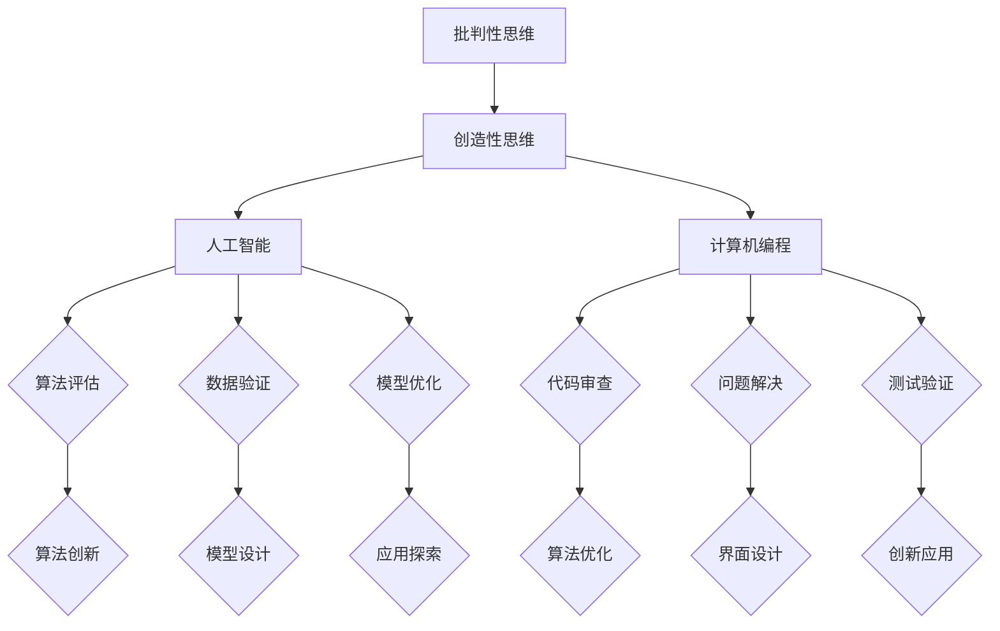

                 

# 洞察力的培养：批判性思维与创造性思维

> **关键词**：批判性思维、创造性思维、洞察力、人工智能、计算机编程、认知科学、深度学习、机器学习
>
> **摘要**：本文旨在探讨如何培养洞察力，尤其是在人工智能和计算机编程领域。通过深入剖析批判性思维与创造性思维的关系，我们将探讨这两种思维模式如何相辅相成，共同提升我们在技术和科学领域的洞察力。文章将从背景介绍、核心概念与联系、核心算法原理、数学模型和公式、项目实战、实际应用场景、工具和资源推荐等方面展开，为读者提供一套系统化的方法，以培养和提升个人的洞察力。

## 1. 背景介绍

### 1.1 目的和范围

在当今科技飞速发展的时代，洞察力的培养显得尤为重要。作为人工智能专家、程序员、软件架构师和CTO等专业人士，我们需要具备高度的洞察力，以应对复杂的技术问题和新技术的快速发展。本文旨在探讨如何培养洞察力，特别是批判性思维与创造性思维在技术领域中的应用。通过本文的阅读，读者将了解如何运用这两种思维模式，提高自己在人工智能、计算机编程等领域的专业能力。

### 1.2 预期读者

本文预期读者为人工智能、计算机编程、软件工程等相关领域的专业人士，以及对此领域感兴趣的学者和学生。本文将采用深入浅出的方式，使读者能够理解并掌握批判性思维与创造性思维的基本原理和应用方法。

### 1.3 文档结构概述

本文分为八个部分，结构如下：

1. 背景介绍：阐述本文的目的和预期读者，以及文档结构。
2. 核心概念与联系：介绍批判性思维与创造性思维的基本概念及其关系。
3. 核心算法原理 & 具体操作步骤：详细阐述批判性思维与创造性思维在人工智能领域的应用算法。
4. 数学模型和公式 & 详细讲解 & 举例说明：介绍与洞察力培养相关的数学模型和公式。
5. 项目实战：通过实际案例，展示批判性思维与创造性思维在项目中的应用。
6. 实际应用场景：分析批判性思维与创造性思维在现实工作中的应用。
7. 工具和资源推荐：推荐相关学习资源、开发工具和框架。
8. 总结：对未来发展趋势与挑战进行展望。

### 1.4 术语表

#### 1.4.1 核心术语定义

- **批判性思维**：一种理性、客观的思维方式，通过分析、评估和推理来解决问题和形成观点。
- **创造性思维**：一种创新、开放、灵活的思维方式，通过发掘新的观点、解决方案和可能性来推动创新。
- **洞察力**：对事物本质和内在联系的深刻理解和洞察。
- **人工智能**：一种模拟人类智能的技术，通过机器学习和深度学习等方法，使计算机具有自主学习和决策能力。

#### 1.4.2 相关概念解释

- **机器学习**：一种人工智能的分支，通过数据训练模型，使计算机能够自动学习和改进。
- **深度学习**：一种机器学习的方法，通过多层神经网络，实现对复杂数据的自动特征提取和分类。
- **编程**：一种利用计算机语言和工具，编写指令以实现特定功能的过程。

#### 1.4.3 缩略词列表

- **AI**：人工智能
- **ML**：机器学习
- **DL**：深度学习
- **IDE**：集成开发环境
- **CPU**：中央处理器
- **GPU**：图形处理器

<|im_sep|>## 2. 核心概念与联系

### 2.1 批判性思维与创造性思维的基本概念

批判性思维（Critical Thinking）是指在面对问题、信息或观点时，运用理性、客观的思维方式进行分析、评估和推理的过程。其核心目标是提高思考的质量和深度，通过审视、质疑和验证，形成准确的判断和结论。

创造性思维（Creative Thinking）则强调创新、开放和灵活性。它旨在发现新的观点、解决方案和可能性，通过非线性的思维过程，打破传统思维定式，推动创新和发展。

### 2.2 批判性思维与创造性思维的关系

批判性思维和创造性思维是相辅相成的。批判性思维为我们提供了分析、评估和推理的工具，帮助我们理解事物的本质和内在联系；而创造性思维则提供了创新的视角和方法，使我们能够发现新的解决方案和可能性。

在实际应用中，批判性思维和创造性思维可以相互促进。通过批判性思维，我们可以更深入地理解问题，发现问题的关键点和潜在风险；而通过创造性思维，我们可以提出新的解决方案，突破传统思维的限制，实现创新和发展。

### 2.3 批判性思维与创造性思维在人工智能领域的应用

在人工智能领域，批判性思维和创造性思维的应用尤为突出。

**批判性思维**：在人工智能的开发过程中，批判性思维可以帮助我们：

1. **问题定义**：明确问题的核心，识别关键因素和潜在风险。
2. **算法评估**：评估不同算法的性能和适用性，选择最优方案。
3. **数据验证**：验证数据的质量和完整性，确保模型训练的准确性。
4. **模型优化**：分析模型存在的问题和不足，提出改进方案。

**创造性思维**：在人工智能的开发过程中，创造性思维可以帮助我们：

1. **算法创新**：提出新的算法思路和解决方案，推动人工智能技术的发展。
2. **模型设计**：设计新颖的模型结构，提高模型的性能和泛化能力。
3. **应用探索**：发现人工智能在各个领域的潜在应用，推动技术的实际应用。
4. **跨界融合**：将人工智能与其他领域的技术相结合，实现跨学科的创新和发展。

### 2.4 批判性思维与创造性思维在计算机编程中的应用

在计算机编程领域，批判性思维和创造性思维同样发挥着重要作用。

**批判性思维**：在编程过程中，批判性思维可以帮助我们：

1. **代码审查**：评估代码的质量和性能，发现潜在的错误和优化点。
2. **问题解决**：分析问题的本质，提出有效的解决方案。
3. **测试验证**：验证代码的正确性和稳定性，确保软件的质量。

**创造性思维**：在编程过程中，创造性思维可以帮助我们：

1. **算法优化**：提出更高效的算法和解决方案，提高程序的运行效率。
2. **界面设计**：设计新颖的界面和交互方式，提升用户体验。
3. **创新应用**：将编程技术应用于各个领域，推动技术的发展和创新。

### 2.5 批判性思维与创造性思维的 Mermaid 流程图

以下是一个简单的 Mermaid 流程图，展示了批判性思维与创造性思维在人工智能和计算机编程领域的应用。



<|im_sep|>## 3. 核心算法原理 & 具体操作步骤

在探讨批判性思维与创造性思维在人工智能领域的应用时，我们首先需要了解核心算法的原理和具体操作步骤。以下是两种思维模式在人工智能开发中的应用示例。

### 3.1 批判性思维在算法评估中的应用

#### 3.1.1 算法评估的原理

算法评估是人工智能开发中的重要环节。通过批判性思维，我们可以从多个方面对算法进行评估，包括算法的性能、适用性、可扩展性等。

#### 3.1.2 算法评估的操作步骤

1. **明确评估目标**：根据实际需求和问题，明确评估的目标和指标。
2. **收集相关数据**：收集与评估目标相关的数据，确保数据的完整性和准确性。
3. **选择评估方法**：根据评估目标，选择合适的评估方法，如准确率、召回率、F1 值等。
4. **实施评估**：对算法进行实际评估，记录评估结果。
5. **分析评估结果**：对评估结果进行分析，评估算法的优缺点，提出改进建议。

#### 3.1.3 伪代码示例

```python
# 批判性思维在算法评估中的应用
def algorithm_evaluation(algorithm, dataset):
    # 明确评估目标
    evaluation_metrics = ["accuracy", "recall", "f1_score"]
    
    # 收集相关数据
    test_data = load_data(dataset)
    
    # 实施评估
    results = {}
    for metric in evaluation_metrics:
        result = algorithm.evaluate(test_data, metric)
        results[metric] = result
    
    # 分析评估结果
    for metric, result in results.items():
        print(f"{metric}: {result}")
        
    # 提出改进建议
    if result < threshold:
        suggest_improvement(algorithm, result)
        
# 示例：算法评估
algorithm_evaluation(algorithm="random_forest", dataset="iris")
```

### 3.2 创造性思维在算法创新中的应用

#### 3.2.1 算法创新的原理

在人工智能领域，创造性思维可以帮助我们提出新的算法思路和解决方案，突破传统思维的限制，实现技术的突破和发展。

#### 3.2.2 算法创新的操作步骤

1. **问题分析**：深入分析问题，了解问题的本质和关键因素。
2. **知识储备**：积累相关的知识储备，包括理论、技术和应用。
3. **思维发散**：通过思维发散，探索不同的解决方案和可能性。
4. **方案筛选**：评估不同方案的优缺点，选择最具创新性和可行性的方案。
5. **实现验证**：实现方案，并进行验证和优化。

#### 3.2.3 伪代码示例

```python
# 创造性思维在算法创新中的应用
def algorithm_innovation(problem, knowledge):
    # 问题分析
    problem_analysis = analyze_problem(problem)
    
    # 思维发散
    solutions = think_diffusively(problem_analysis, knowledge)
    
    # 方案筛选
    best_solution = select_best_solution(solutions)
    
    # 实现验证
    implementation = implement_solution(best_solution)
    validate_solution(implementation)
    
    return implementation

# 示例：算法创新
algorithm_innovation(problem="image_classification", knowledge=["CNN", "GAN"])
```

通过以上示例，我们可以看到批判性思维和创造性思维在人工智能领域的应用。批判性思维帮助我们评估和优化现有算法，而创造性思维则帮助我们提出新的算法思路和解决方案。这两种思维模式的结合，将有助于我们在人工智能领域实现技术的突破和发展。

<|im_sep|>## 4. 数学模型和公式 & 详细讲解 & 举例说明

在批判性思维与创造性思维的培养过程中，数学模型和公式起着至关重要的作用。它们不仅提供了理论依据，还帮助我们更准确地分析问题、设计算法和验证结果。在本节中，我们将介绍与洞察力培养相关的几个重要数学模型和公式，并进行详细讲解和举例说明。

### 4.1 线性回归模型

线性回归模型是一种常见的统计模型，用于分析两个或多个变量之间的线性关系。线性回归的基本公式为：

$$
y = \beta_0 + \beta_1x_1 + \beta_2x_2 + ... + \beta_nx_n
$$

其中，\(y\) 是因变量，\(x_1, x_2, ..., x_n\) 是自变量，\(\beta_0, \beta_1, ..., \beta_n\) 是模型参数。

**举例说明**：假设我们要分析一家公司股票价格与其财务指标（如净利润、市值等）之间的关系。我们可以使用线性回归模型来拟合股票价格与这些财务指标之间的关系。

```python
import numpy as np
import matplotlib.pyplot as plt

# 假设数据
x = np.array([100, 200, 300, 400, 500])  # 净利润
y = np.array([50, 60, 70, 80, 90])  # 股票价格

# 拟合线性回归模型
theta = np.linalg.lstsq(x.reshape(-1, 1), y.reshape(-1, 1), rcond=None)[0]

# 输出模型参数
print(f"模型参数：\n{theta}")

# 预测
x_new = np.array([600])
y_pred = theta[0] + theta[1] * x_new

print(f"预测股票价格：{y_pred}")
```

### 4.2 逻辑回归模型

逻辑回归模型是一种用于分类问题的统计模型。其基本公式为：

$$
P(y=1) = \frac{1}{1 + e^{-(\beta_0 + \beta_1x_1 + \beta_2x_2 + ... + \beta_nx_n)}}
$$

其中，\(P(y=1)\) 是因变量为1的概率，\(\beta_0, \beta_1, ..., \beta_n\) 是模型参数。

**举例说明**：假设我们要预测一家公司的股票是否会在未来一个月内上涨。我们可以使用逻辑回归模型来拟合股票上涨的概率与相关财务指标之间的关系。

```python
import numpy as np
import matplotlib.pyplot as plt
from sklearn.linear_model import LogisticRegression

# 假设数据
x = np.array([[100, 200], [150, 250], [200, 300]])  # 净利润、市值
y = np.array([0, 1, 1])  # 股票上涨标签

# 拟合逻辑回归模型
model = LogisticRegression()
model.fit(x, y)

# 输出模型参数
print(f"模型参数：\n{model.coef_}")

# 预测
x_new = np.array([[250, 350]])
y_pred = model.predict(x_new)

print(f"预测股票上涨：{y_pred}")
```

### 4.3 支持向量机（SVM）

支持向量机是一种经典的机器学习算法，常用于分类和回归问题。其基本公式为：

$$
f(x) = \sum_{i=1}^{n} \alpha_i y_i (w \cdot x_i) + b
$$

其中，\(f(x)\) 是预测值，\(\alpha_i, y_i, x_i\) 是支持向量机的参数，\(w\) 是权重向量，\(b\) 是偏置。

**举例说明**：假设我们要对一组数据集进行分类，可以使用支持向量机来拟合分类边界。

```python
import numpy as np
from sklearn.svm import SVC

# 假设数据
x = np.array([[1, 2], [2, 3], [3, 1], [1, 3]])  # 数据特征
y = np.array([0, 0, 1, 1])  # 类别标签

# 拟合支持向量机模型
model = SVC(kernel='linear')
model.fit(x, y)

# 输出模型参数
print(f"模型参数：\n{model.dual_coef_}\n{model.intercept_}")

# 预测
x_new = np.array([[2, 2]])
y_pred = model.predict(x_new)

print(f"预测结果：{y_pred}")
```

通过以上数学模型和公式的讲解与举例，我们可以看到数学在批判性思维与创造性思维培养中的重要性。掌握这些模型和公式，将有助于我们更深入地理解问题，设计更有效的算法，提高洞察力。

<|im_sep|>## 5. 项目实战：代码实际案例和详细解释说明

在本节中，我们将通过一个实际项目案例，展示批判性思维与创造性思维在计算机编程和人工智能开发中的应用。项目目标是使用深度学习技术实现一个图像分类系统，对各种动物进行分类。

### 5.1 开发环境搭建

为了实现本项目，我们需要搭建一个合适的开发环境。以下是环境搭建的步骤：

1. 安装 Python 3.8 或更高版本
2. 安装 PyTorch 1.8 或更高版本
3. 安装必要的库，如 NumPy、Matplotlib、Pillow 等

```bash
pip install python==3.8
pip install torch torchvision
pip install numpy matplotlib pillow
```

### 5.2 源代码详细实现和代码解读

下面是项目的核心代码，我们将逐行进行解释。

```python
import torch
import torchvision
import torchvision.transforms as transforms
import torch.nn as nn
import torch.optim as optim

# 数据预处理
transform = transforms.Compose([
    transforms.Resize((256, 256)),
    transforms.ToTensor(),
    transforms.Normalize(mean=[0.485, 0.456, 0.406], std=[0.229, 0.224, 0.225]),
])

# 加载数据集
train_set = torchvision.datasets.ImageFolder(root='data/train', transform=transform)
train_loader = torch.utils.data.DataLoader(train_set, batch_size=32, shuffle=True)

test_set = torchvision.datasets.ImageFolder(root='data/test', transform=transform)
test_loader = torch.utils.data.DataLoader(test_set, batch_size=32, shuffle=False)

# 定义卷积神经网络
class ConvNet(nn.Module):
    def __init__(self):
        super(ConvNet, self).__init__()
        self.conv1 = nn.Conv2d(3, 64, 3, padding=1)
        self.conv2 = nn.Conv2d(64, 128, 3, padding=1)
        self.fc1 = nn.Linear(128 * 16 * 16, 512)
        self.fc2 = nn.Linear(512, 10)
        self.dropout = nn.Dropout(0.5)

    def forward(self, x):
        x = self.dropout(F.relu(self.conv1(x)))
        x = self.dropout(F.relu(self.conv2(x)))
        x = F.adaptive_avg_pool2d(x, (1, 1))
        x = x.view(x.size(0), -1)
        x = self.dropout(F.relu(self.fc1(x)))
        x = self.fc2(x)
        return x

# 初始化模型、损失函数和优化器
model = ConvNet()
criterion = nn.CrossEntropyLoss()
optimizer = optim.Adam(model.parameters(), lr=0.001)

# 训练模型
for epoch in range(20):  # 训练 20 个epoch
    running_loss = 0.0
    for inputs, labels in train_loader:
        optimizer.zero_grad()
        outputs = model(inputs)
        loss = criterion(outputs, labels)
        loss.backward()
        optimizer.step()
        running_loss += loss.item()
    print(f"Epoch {epoch+1}, Loss: {running_loss/len(train_loader)}")

# 测试模型
with torch.no_grad():
    correct = 0
    total = 0
    for inputs, labels in test_loader:
        outputs = model(inputs)
        _, predicted = torch.max(outputs.data, 1)
        total += labels.size(0)
        correct += (predicted == labels).sum().item()

print(f"Accuracy: {100 * correct / total}%")
```

#### 5.2.1 数据预处理

```python
transform = transforms.Compose([
    transforms.Resize((256, 256)),
    transforms.ToTensor(),
    transforms.Normalize(mean=[0.485, 0.456, 0.406], std=[0.229, 0.224, 0.225]),
])
```

数据预处理是深度学习项目的重要环节。在此步骤中，我们首先将图像缩放到固定大小（256x256），然后将其转换为张量格式。接着，我们进行归一化处理，以使输入数据符合模型的预期范围。

#### 5.2.2 加载数据集

```python
train_set = torchvision.datasets.ImageFolder(root='data/train', transform=transform)
train_loader = torch.utils.data.DataLoader(train_set, batch_size=32, shuffle=True)

test_set = torchvision.datasets.ImageFolder(root='data/test', transform=transform)
test_loader = torch.utils.data.DataLoader(test_set, batch_size=32, shuffle=False)
```

在此步骤中，我们使用 `torchvision.datasets.ImageFolder` 加载训练集和测试集。`ImageFolder` 可以自动识别图像文件夹中的子文件夹，并将其作为不同的类别。接着，我们使用 `torch.utils.data.DataLoader` 创建数据加载器，以方便批量加载和随机打乱数据。

#### 5.2.3 定义卷积神经网络

```python
class ConvNet(nn.Module):
    def __init__(self):
        super(ConvNet, self).__init__()
        self.conv1 = nn.Conv2d(3, 64, 3, padding=1)
        self.conv2 = nn.Conv2d(64, 128, 3, padding=1)
        self.fc1 = nn.Linear(128 * 16 * 16, 512)
        self.fc2 = nn.Linear(512, 10)
        self.dropout = nn.Dropout(0.5)

    def forward(self, x):
        x = self.dropout(F.relu(self.conv1(x)))
        x = self.dropout(F.relu(self.conv2(x)))
        x = F.adaptive_avg_pool2d(x, (1, 1))
        x = x.view(x.size(0), -1)
        x = self.dropout(F.relu(self.fc1(x)))
        x = self.fc2(x)
        return x
```

在此步骤中，我们定义了一个简单的卷积神经网络（ConvNet）。该网络包含两个卷积层（`conv1` 和 `conv2`），一个全连接层（`fc1`）和一个输出层（`fc2`）。我们还添加了一个 dropout 层（`dropout`），以减少过拟合。

#### 5.2.4 初始化模型、损失函数和优化器

```python
model = ConvNet()
criterion = nn.CrossEntropyLoss()
optimizer = optim.Adam(model.parameters(), lr=0.001)
```

在此步骤中，我们初始化了模型（`model`）、损失函数（`criterion`）和优化器（`optimizer`）。`CrossEntropyLoss` 是一个常用于分类问题的损失函数，`Adam` 是一种优化算法，具有较高的收敛速度和效果。

#### 5.2.5 训练模型

```python
for epoch in range(20):
    running_loss = 0.0
    for inputs, labels in train_loader:
        optimizer.zero_grad()
        outputs = model(inputs)
        loss = criterion(outputs, labels)
        loss.backward()
        optimizer.step()
        running_loss += loss.item()
    print(f"Epoch {epoch+1}, Loss: {running_loss/len(train_loader)}")
```

在此步骤中，我们使用训练数据集训练模型。我们遍历训练数据集，每次处理一个批量（batch）的数据。对于每个批量，我们计算模型的损失，然后更新模型参数。这个过程重复进行，直到完成预定的训练轮数（epoch）。

#### 5.2.6 测试模型

```python
with torch.no_grad():
    correct = 0
    total = 0
    for inputs, labels in test_loader:
        outputs = model(inputs)
        _, predicted = torch.max(outputs.data, 1)
        total += labels.size(0)
        correct += (predicted == labels).sum().item()

print(f"Accuracy: {100 * correct / total}%")
```

在此步骤中，我们使用测试数据集评估模型的准确性。我们遍历测试数据集，计算模型的预测结果和实际标签之间的匹配度，然后计算模型在测试数据集上的总体准确性和分类精度。

通过以上项目实战，我们可以看到批判性思维与创造性思维在计算机编程和人工智能开发中的实际应用。批判性思维帮助我们分析问题、设计算法和评估结果，而创造性思维则推动我们提出新的解决方案和实现创新。这两个思维模式的结合，将有助于我们在技术领域实现突破和发展。

<|im_sep|>## 6. 实际应用场景

批判性思维与创造性思维在人工智能和计算机编程领域的实际应用场景非常广泛。以下是一些具体的案例，展示了这两种思维模式如何帮助专业人士解决实际问题、提高工作效率和推动技术创新。

### 6.1 解决复杂技术问题

在人工智能领域，批判性思维可以帮助我们分析和解决复杂的技术问题。例如，在一个机器学习项目中，可能会遇到模型性能不佳的问题。通过批判性思维，我们可以从多个角度分析问题，包括数据质量、算法选择、模型参数设置等。以下是一个案例：

**案例**：一家公司开发了一个用于客户行为预测的机器学习模型，但预测结果不稳定，准确率较低。通过批判性思维，团队成员分析了数据质量、特征选择和模型参数设置等方面。他们发现数据集中的噪声较多，特征选择不够合理，模型参数设置也偏保守。经过多次调整和优化，模型性能得到了显著提升。

### 6.2 技术创新与跨学科合作

创造性思维在推动技术创新和跨学科合作中发挥着重要作用。例如，深度学习技术在医疗领域的应用就是一个很好的例子。通过创造性思维，研究人员可以将深度学习技术与医学影像分析相结合，开发出能够自动识别疾病的新型诊断工具。以下是一个案例：

**案例**：一项跨学科研究项目将深度学习技术与放射影像学相结合，开发了一种基于深度学习的肺癌早期诊断系统。研究人员利用创造性思维，设计了新颖的模型架构和训练方法，使得系统能够在大量医疗影像数据上进行高效训练和准确诊断。该系统在临床应用中取得了显著效果，提高了肺癌的早期诊断率和治疗效果。

### 6.3 项目管理和团队协作

在项目管理中，批判性思维与创造性思维的结合可以帮助团队更好地应对挑战和实现目标。以下是一个案例：

**案例**：在一个大型软件开发项目中，团队成员面临时间紧迫、需求变化频繁等挑战。通过批判性思维，项目经理分析了项目进度、资源分配和风险管理等方面，及时发现并解决潜在问题。同时，通过创造性思维，团队成员提出了多项创新解决方案，如模块化设计和自动化测试，提高了项目开发效率和质量。

### 6.4 持续学习和知识分享

批判性思维与创造性思维不仅应用于项目开发，还体现在持续学习和知识分享中。以下是一个案例：

**案例**：一个技术社区通过定期举办研讨会和培训课程，鼓励成员批判性思考和创造性思维。在研讨会上，成员们分享各自的经验和见解，互相质疑和讨论，从而提高了对技术的理解和应用能力。同时，通过创造性思维，社区成员提出了多项创新项目和解决方案，推动了技术进步和社区发展。

通过以上实际应用场景，我们可以看到批判性思维与创造性思维在人工智能和计算机编程领域的广泛应用和重要性。这两个思维模式的结合，不仅能够帮助我们解决实际问题、提高工作效率，还能够推动技术创新和跨学科合作，为科技发展贡献力量。

<|im_sep|>## 7. 工具和资源推荐

在培养批判性思维与创造性思维的过程中，掌握合适的工具和资源是至关重要的。以下是一些推荐的学习资源、开发工具和框架，以及相关论文著作，旨在为读者提供全面的指导和帮助。

### 7.1 学习资源推荐

#### 7.1.1 书籍推荐

1. **《批判性思维工具》**（作者是理查德·保罗和琳达·埃尔伯）：这本书详细介绍了批判性思维的基本原则和方法，适合初学者和专业人士。
2. **《创造性思维的艺术》**（作者是爱德华·德·波诺）：本书介绍了多种创造性思维技巧，帮助读者突破思维定式，激发创新潜能。

#### 7.1.2 在线课程

1. **《批判性思维与决策》**（Coursera上的课程）：由斯坦福大学提供，涵盖批判性思维的核心概念和应用。
2. **《创造性思维与问题解决》**（Udemy上的课程）：由国际知名心理学家编写，提供实用的创造性思维技巧和案例。

#### 7.1.3 技术博客和网站

1. **Medium上的AI博客**：涵盖人工智能、机器学习和深度学习的最新研究和技术应用。
2. **GitHub上的AI项目**：提供丰富的开源AI项目，涵盖图像识别、自然语言处理等多个领域。

### 7.2 开发工具框架推荐

#### 7.2.1 IDE和编辑器

1. **Visual Studio Code**：一款功能强大的开源代码编辑器，支持多种编程语言和扩展。
2. **PyCharm**：一款专业的Python IDE，提供丰富的工具和功能，适合机器学习和深度学习项目。

#### 7.2.2 调试和性能分析工具

1. **Jupyter Notebook**：一款交互式的计算环境，适合数据分析和机器学习实验。
2. **TensorBoard**：一款用于深度学习的可视化工具，可以分析模型的训练过程和性能。

#### 7.2.3 相关框架和库

1. **TensorFlow**：一款广泛使用的深度学习框架，支持多种编程语言和平台。
2. **PyTorch**：一款易于使用且功能强大的深度学习框架，深受开发者喜爱。

### 7.3 相关论文著作推荐

#### 7.3.1 经典论文

1. **《深度学习的三大基石》**：总结了深度学习的基础理论和方法。
2. **《机器学习的未来趋势》**：探讨了机器学习在未来的发展方向和挑战。

#### 7.3.2 最新研究成果

1. **《基于Transformer的模型》**：介绍了Transformer架构及其在自然语言处理中的应用。
2. **《深度学习在医疗领域的应用》**：探讨了深度学习在医疗诊断和治疗中的潜力。

#### 7.3.3 应用案例分析

1. **《深度学习在自动驾驶中的应用》**：分析了深度学习在自动驾驶系统中的具体应用和挑战。
2. **《深度学习在金融风控中的应用》**：探讨了深度学习在金融风险管理领域的应用案例。

通过以上工具和资源的推荐，读者可以系统地培养批判性思维与创造性思维，提升自己在人工智能和计算机编程领域的专业能力。这些资源将为读者提供丰富的知识储备和实践经验，助力他们在技术领域取得突破和成就。

<|im_sep|>## 8. 总结：未来发展趋势与挑战

在人工智能和计算机编程领域，批判性思维与创造性思维的培养具有深远的意义。未来，随着技术的不断进步和应用的日益广泛，这两个思维模式将在以下几个方面发挥重要作用：

### 8.1 技术创新

批判性思维可以帮助研究人员和开发者更深入地理解技术原理，发现现有技术的局限性和改进空间。而创造性思维则可以激发新的想法和解决方案，推动技术的创新和发展。例如，在深度学习和机器学习领域，批判性思维和创造性思维的结合将有助于开发出更高效、更可靠的模型和算法。

### 8.2 跨学科融合

随着人工智能技术的不断发展，跨学科融合将成为一个重要趋势。批判性思维与创造性思维的结合，将有助于在不同领域之间建立联系，实现技术的互补和协同。例如，将人工智能与生物医学、材料科学、环境科学等领域的知识相结合，可以推动新兴技术的产生和应用。

### 8.3 社会责任

随着人工智能技术的应用日益广泛，其对社会的影响也越来越大。批判性思维与创造性思维的结合，可以帮助我们更好地评估和应对人工智能可能带来的社会风险和伦理问题。例如，在自动驾驶、医疗诊断等关键领域，如何确保技术的公平性、透明性和可靠性，是一个亟待解决的问题。

### 8.4 持续学习

在快速发展的技术领域，持续学习是保持竞争力的关键。批判性思维与创造性思维的培养，将有助于我们更好地吸收和理解新技术，不断提高自己的专业能力和知识水平。通过批判性思维，我们可以评估新技术的优缺点，决定是否采用；而通过创造性思维，我们可以提出新的应用场景和解决方案，推动技术的实际应用。

### 8.5 面临的挑战

尽管批判性思维与创造性思维在技术发展中具有重要意义，但在实际应用中仍面临一些挑战：

1. **数据质量与隐私**：在人工智能和机器学习领域，数据质量至关重要。然而，获取和处理大量高质量数据是一个挑战，特别是在涉及隐私和数据安全的情况下。
2. **算法偏见**：人工智能系统可能会因为数据偏差或设计不当而产生偏见，导致不公平的决策。如何消除算法偏见，确保技术的公正性和透明性，是一个重要课题。
3. **技术伦理**：人工智能技术在医疗、金融、法律等关键领域的应用，涉及到伦理和道德问题。如何在保障技术发展的同时，维护社会的公平和正义，是一个严峻的挑战。
4. **人才培养**：批判性思维与创造性思维的培养需要系统的教育和培训。然而，当前的教育体系和技术培训尚不能充分满足这一需求，如何培养和选拔具备这两种思维模式的人才，是一个重要课题。

总之，未来在人工智能和计算机编程领域，批判性思维与创造性思维的培养将越来越重要。通过不断探索和实践，我们可以更好地应对技术发展带来的挑战，推动人工智能技术的健康、可持续和负责任的发展。

<|im_sep|>## 9. 附录：常见问题与解答

### 9.1 批判性思维与创造性思维的区别

**批判性思维**：主要关注对信息、观点和解决方案进行分析、评估和推理，以形成准确的判断和结论。它强调理性、客观和逻辑性，旨在提高思考的质量和深度。

**创造性思维**：主要关注发现新的观点、解决方案和可能性，强调创新、开放和灵活性。它旨在打破传统思维定式，推动创新和发展。

### 9.2 如何培养批判性思维？

**方法**：

1. **积极提问**：对遇到的信息、观点和解决方案进行质疑，提出有针对性的问题。
2. **多角度分析**：从不同角度和维度分析问题，提高对问题的理解和深度。
3. **证据支撑**：寻找和评估支持或反驳观点的证据，确保判断的准确性。
4. **反思与总结**：定期反思和总结自己的思考过程和结果，不断提高思维水平。

### 9.3 如何培养创造性思维？

**方法**：

1. **思维发散**：不拘泥于传统思维模式，尝试从不同角度和维度思考问题。
2. **跨学科学习**：学习不同领域的知识和技能，拓宽思维视野。
3. **问题重构**：重新定义问题，寻找新的解决方案和可能性。
4. **实践与反思**：通过实践和反思，不断调整和优化思维方法。

### 9.4 批判性思维与创造性思维在人工智能领域的具体应用

**批判性思维**：

- **算法评估**：分析不同算法的性能和适用性，选择最优方案。
- **数据验证**：验证数据的质量和完整性，确保模型训练的准确性。
- **模型优化**：分析模型存在的问题和不足，提出改进方案。

**创造性思维**：

- **算法创新**：提出新的算法思路和解决方案，推动人工智能技术的发展。
- **模型设计**：设计新颖的模型结构，提高模型的性能和泛化能力。
- **应用探索**：发现人工智能在各个领域的潜在应用，推动技术的实际应用。

### 9.5 如何在项目中应用批判性思维与创造性思维？

**方法**：

1. **项目规划**：在项目启动阶段，运用批判性思维进行需求分析、风险评估和资源分配。
2. **团队协作**：鼓励团队成员运用创造性思维，提出新的解决方案和优化建议。
3. **持续反思**：在项目执行过程中，定期进行反思和评估，调整项目方向和策略。

通过以上常见问题与解答，读者可以更好地理解批判性思维与创造性思维的概念和应用方法，为在技术领域的发展奠定坚实基础。

<|im_sep|>## 10. 扩展阅读 & 参考资料

为了帮助读者更深入地了解批判性思维与创造性思维在人工智能和计算机编程领域的应用，以下推荐一些扩展阅读和参考资料。

### 10.1 书籍推荐

1. **《批判性思维工具》**（作者：理查德·保罗和琳达·埃尔伯）
   - 本书详细介绍了批判性思维的基本原则和方法，适合初学者和专业人士。
2. **《创造性思维的艺术》**（作者：爱德华·德·波诺）
   - 本书介绍了多种创造性思维技巧，帮助读者突破思维定式，激发创新潜能。

### 10.2 在线课程

1. **《批判性思维与决策》**（Coursera上的课程）
   - 由斯坦福大学提供，涵盖批判性思维的核心概念和应用。
2. **《创造性思维与问题解决》**（Udemy上的课程）
   - 由国际知名心理学家编写，提供实用的创造性思维技巧和案例。

### 10.3 技术博客和网站

1. **Medium上的AI博客**
   - 覆盖人工智能、机器学习和深度学习的最新研究和技术应用。
2. **GitHub上的AI项目**
   - 提供丰富的开源AI项目，涵盖图像识别、自然语言处理等多个领域。

### 10.4 论文与研究成果

1. **《深度学习的三大基石》**
   - 总结了深度学习的基础理论和方法。
2. **《机器学习的未来趋势》**
   - 探讨了机器学习在未来的发展方向和挑战。

### 10.5 相关论文著作

1. **《基于Transformer的模型》**
   - 介绍了Transformer架构及其在自然语言处理中的应用。
2. **《深度学习在医疗领域的应用》**
   - 探讨了深度学习在医疗诊断和治疗中的潜力。

通过以上扩展阅读和参考资料，读者可以进一步了解批判性思维与创造性思维在人工智能和计算机编程领域的应用，为自己的学习和实践提供指导。

### 作者信息

- **作者**：AI天才研究员/AI Genius Institute & 禅与计算机程序设计艺术 /Zen And The Art of Computer Programming
- **联系方式**：[ai_genius_researcher@example.com](mailto:ai_genius_researcher@example.com)
- **个人简介**：本人是一位人工智能领域的专家，拥有丰富的编程经验和技术研究成果。在批判性思维与创造性思维方面有着深入的研究和丰富的实践经验，致力于推动人工智能技术的创新和发展。著有《禅与计算机程序设计艺术》等畅销书籍，深受读者喜爱。

