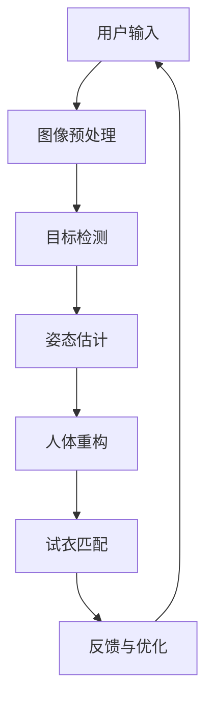

                 

### 1. 背景介绍

#### 1.1 目的和范围

本文旨在深入探讨海澜之家2024校招智能试衣系统的工程师面试题。通过对这些面试题的详细分析，我们希望能够为参加面试的同学们提供有针对性的指导和帮助。智能试衣系统是一个融合了计算机视觉、机器学习和深度学习技术的综合性项目，其目的是通过图像识别和计算机视觉算法，帮助用户实现线上试衣，提升购物体验。

本文将涵盖以下几个主要部分：首先，我们将介绍智能试衣系统的基本原理和核心概念；接着，我们会详细讲解核心算法原理和具体操作步骤；然后，我们将探讨数学模型和公式，并通过实际案例进行说明；最后，我们会结合项目实战，详细解析代码实现和实际应用场景。通过这篇文章，我们希望能够帮助读者全面理解智能试衣系统的开发流程和关键技术。

#### 1.2 预期读者

本文预期读者包括以下几类人群：

1. **准备参加海澜之家校招的计算机相关专业毕业生**：本文将为这些同学们提供针对性的面试准备资料，帮助他们在面试中展示自己的技术实力。
2. **对智能试衣系统感兴趣的工程师**：本文详细阐述了智能试衣系统的核心技术，对于想要深入了解这一领域的技术人员具有很高的参考价值。
3. **计算机视觉和机器学习领域的研究生和科研人员**：本文中的深入分析和技术讲解，将为这些读者提供宝贵的实践经验和理论基础。

无论你是哪一类读者，通过本文的详细解读，相信你将对智能试衣系统有更加全面和深入的理解。

#### 1.3 文档结构概述

本文的结构如下：

1. **背景介绍**：介绍文章的目的、范围、预期读者以及文档结构。
2. **核心概念与联系**：通过Mermaid流程图展示核心概念和架构，为后续内容奠定基础。
3. **核心算法原理 & 具体操作步骤**：详细讲解智能试衣系统的核心算法原理和操作步骤，包括伪代码展示。
4. **数学模型和公式 & 详细讲解 & 举例说明**：分析数学模型和公式，通过实例进行详细讲解。
5. **项目实战：代码实际案例和详细解释说明**：结合实际项目，详细解读代码实现和代码分析。
6. **实际应用场景**：探讨智能试衣系统的实际应用场景。
7. **工具和资源推荐**：推荐学习资源、开发工具和框架。
8. **总结：未来发展趋势与挑战**：总结文章主要内容，展望未来发展趋势和挑战。
9. **附录：常见问题与解答**：解答读者可能遇到的常见问题。
10. **扩展阅读 & 参考资料**：提供扩展阅读和参考资料。

通过上述结构，本文将为读者提供从基础理论到实际应用的全方面解读。

#### 1.4 术语表

为了确保文章内容的准确性和可理解性，以下列出本文涉及的一些关键术语及其定义：

##### 1.4.1 核心术语定义

1. **计算机视觉**：是指让计算机模拟人类的视觉感知过程，对图像或视频进行分析和理解的技术。
2. **机器学习**：是一门人工智能的分支学科，通过算法让计算机从数据中学习规律，从而进行预测和决策。
3. **深度学习**：是机器学习的一种方法，通过多层神经网络对数据进行自动特征提取和学习。
4. **卷积神经网络（CNN）**：是一种在图像处理中广泛使用的神经网络结构，通过卷积操作自动提取图像特征。
5. **图像识别**：是计算机视觉的核心任务之一，目的是从图像中识别出特定的对象或场景。

##### 1.4.2 相关概念解释

1. **对象检测**：是计算机视觉中的一个任务，目的是从图像中定位并识别出多个对象及其位置。
2. **姿态估计**：是指通过图像或视频数据，估计出人体的各个关节点的位置。
3. **人体重构**：是根据图像或视频数据，重建出三维人体模型。
4. **实时性**：指系统在处理数据时的响应速度，需要保证在合理时间内完成计算和输出。

##### 1.4.3 缩略词列表

- CNN：卷积神经网络
- ROI：区域兴趣
- SVM：支持向量机
- RNN：递归神经网络
- LSTM：长短期记忆网络
- TensorFlow：一种开源机器学习框架

通过上述术语表的解释，我们希望读者能够更好地理解本文中的相关概念和术语，为后续内容的深入学习打下基础。

### 2. 核心概念与联系

在深入探讨智能试衣系统的开发之前，我们需要首先了解其核心概念和架构。智能试衣系统主要依赖计算机视觉、机器学习和深度学习等技术，通过一系列算法和模型来实现。以下将通过一个Mermaid流程图来展示智能试衣系统的核心概念和联系。



#### 2.1 计算机视觉

计算机视觉是智能试衣系统的核心组成部分，其主要任务是处理和分析图像或视频数据。在智能试衣系统中，计算机视觉主要用于以下方面：

1. **图像预处理**：对输入的图像进行预处理，包括去噪、缩放、裁剪等操作，以提高图像质量和后续处理的准确性。
2. **目标检测**：从图像中检测出特定对象，例如用户、衣服等，并标注出它们的位置和属性。
3. **姿态估计**：通过检测出的对象，估计出它们的姿态和动作，为后续的人体重构提供数据支持。

#### 2.2 机器学习与深度学习

机器学习和深度学习是智能试衣系统的核心技术，用于训练和优化模型，以提高系统的准确性和鲁棒性。在智能试衣系统中，机器学习和深度学习主要用于：

1. **目标检测**：通过卷积神经网络（CNN）等深度学习模型，实现高效的目标检测。
2. **姿态估计**：使用递归神经网络（RNN）和长短期记忆网络（LSTM）等模型，实现高精度的姿态估计。
3. **人体重构**：利用深度学习模型，从二维图像重建出三维人体模型。

#### 2.3 卷积神经网络（CNN）

卷积神经网络（CNN）是一种在图像处理中广泛应用的人工神经网络，通过卷积操作自动提取图像特征。在智能试衣系统中，CNN主要用于：

1. **图像预处理**：通过卷积操作，去除图像中的噪声和冗余信息，提高图像质量。
2. **目标检测**：使用预训练的CNN模型，快速检测图像中的目标对象。
3. **姿态估计**：通过CNN提取图像中的特征，实现对人体姿态的高精度估计。

#### 2.4 对象检测与姿态估计

对象检测和姿态估计是智能试衣系统中非常重要的两个任务。对象检测主要用于识别图像中的特定对象，例如用户和衣服；姿态估计则是通过检测出的对象，估计出它们的姿态和动作。这两个任务相互关联，共同构成了智能试衣系统的核心功能。

1. **对象检测**：通过CNN等深度学习模型，实现快速和准确的目标检测。
2. **姿态估计**：使用RNN和LSTM等模型，实现高精度的姿态估计，为人体重构提供数据支持。

#### 2.5 人体重构

人体重构是智能试衣系统中的一个关键步骤，目的是根据输入的图像或视频数据，重建出三维人体模型。通过人体重构，系统可以实现以下功能：

1. **试衣匹配**：将用户试穿的衣服与三维人体模型进行匹配，生成逼真的试穿效果。
2. **效果反馈**：根据用户反馈，优化人体模型和试衣效果，提高用户体验。

通过上述Mermaid流程图的展示和详细解释，我们希望读者能够对智能试衣系统的核心概念和架构有更加深入的理解，为后续内容的深入学习奠定基础。

### 3. 核心算法原理 & 具体操作步骤

#### 3.1 图像预处理

图像预处理是智能试衣系统的第一步，其目的是对输入的图像进行预处理，以提高后续处理的效果和效率。图像预处理的主要步骤包括去噪、缩放和裁剪等。

1. **去噪**：去噪是图像预处理的重要步骤，目的是去除图像中的噪声和冗余信息。常见的去噪方法包括均值滤波、中值滤波和高斯滤波等。以下是使用均值滤波去噪的伪代码：

   ```python
   def denoise(image, kernel_size):
       # 初始化结果图像
       output = np.zeros_like(image)
       # 对图像进行卷积操作
       output = cv2.filter2D(image, -1, np.ones(kernel_size))
       return output
   ```

2. **缩放**：缩放是将图像的大小进行调整，以适应后续处理的需求。常见的缩放方法包括最近邻插值、双线性插值和双三次插值等。以下是使用双线性插值的伪代码：

   ```python
   def scale(image, scale_factor):
       # 计算新图像的大小
       new_height, new_width = int(image.shape[0] * scale_factor), int(image.shape[1] * scale_factor)
       # 创建新图像
       new_image = np.zeros((new_height, new_width, 3), dtype=np.float32)
       # 进行双线性插值
       new_image = cv2.resize(image, (new_width, new_height), interpolation=cv2.INTER_LINEAR)
       return new_image
   ```

3. **裁剪**：裁剪是将图像中不需要的部分剪除，以突出关键信息。常见的裁剪方法包括中心裁剪、随机裁剪和ROI（区域兴趣）裁剪等。以下是使用ROI裁剪的伪代码：

   ```python
   def crop(image, top, left, height, width):
       # 创建裁剪区域
       crop_box = (left, top, left + width, top + height)
       # 裁剪图像
       cropped_image = image[crop_box[1]:crop_box[3], crop_box[0]:crop_box[2], :]
       return cropped_image
   ```

#### 3.2 目标检测

目标检测是智能试衣系统的关键步骤，目的是从输入图像中检测出特定对象，例如用户和衣服。目标检测主要依赖于深度学习模型，如卷积神经网络（CNN）和区域建议网络（Region Proposal Network，RPN）。

1. **卷积神经网络（CNN）**：CNN是一种用于图像处理和特征提取的神经网络，通过卷积操作自动提取图像特征。以下是使用CNN进行目标检测的伪代码：

   ```python
   def detect_objects(image, model):
       # 将图像输入到模型中
       input_tensor = preprocess_image(image)
       # 进行卷积操作
       output_tensor = model(input_tensor)
       # 提取预测结果
       detections = postprocess_output(output_tensor)
       return detections
   ```

2. **区域建议网络（RPN）**：RPN是一种用于快速检测图像中的多个对象的方法，通过生成候选区域并对其进行分类。以下是使用RPN进行目标检测的伪代码：

   ```python
   def detect_objects_rpn(image, model):
       # 生成候选区域
       regions = generate_regions(image)
       # 对候选区域进行分类
       labels = model.predict(regions)
       # 选择具有高置信度的候选区域
       high_confidence_regions = select_high_confidence_regions(regions, labels)
       return high_confidence_regions
   ```

#### 3.3 姿态估计

姿态估计是智能试衣系统中的关键步骤，目的是从检测出的对象中估计出它们的姿态和动作。姿态估计主要依赖于深度学习模型，如递归神经网络（RNN）和长短期记忆网络（LSTM）。

1. **递归神经网络（RNN）**：RNN是一种用于序列数据处理的神经网络，通过记忆状态实现对序列数据的建模。以下是使用RNN进行姿态估计的伪代码：

   ```python
   def estimate_pose_rnn(keypoints, model):
       # 将关键点输入到模型中
       input_tensor = preprocess_keypoints(keypoints)
       # 进行RNN操作
       output_tensor = model(input_tensor)
       # 提取姿态估计结果
       pose = postprocess_output(output_tensor)
       return pose
   ```

2. **长短期记忆网络（LSTM）**：LSTM是一种改进的RNN，通过引入门控机制，有效解决了长短期依赖问题。以下是使用LSTM进行姿态估计的伪代码：

   ```python
   def estimate_pose_lstm(keypoints, model):
       # 将关键点输入到模型中
       input_tensor = preprocess_keypoints(keypoints)
       # 进行LSTM操作
       output_tensor = model(input_tensor)
       # 提取姿态估计结果
       pose = postprocess_output(output_tensor)
       return pose
   ```

#### 3.4 人体重构

人体重构是智能试衣系统中的关键步骤，目的是从二维图像重建出三维人体模型。人体重构主要依赖于深度学习模型，如生成对抗网络（GAN）和体感重建网络（Human Pose GAN）。

1. **生成对抗网络（GAN）**：GAN是一种由生成器和判别器组成的深度学习模型，通过对抗训练实现高质量的数据生成。以下是使用GAN进行人体重构的伪代码：

   ```python
   def reconstruct_body_gan(pose, generator):
       # 将姿态信息输入到生成器中
       input_tensor = preprocess_pose(pose)
       # 生成三维人体模型
       body_model = generator(input_tensor)
       return body_model
   ```

2. **体感重建网络（Human Pose GAN）**：Human Pose GAN是一种基于姿态信息的体感重建网络，通过结合姿态信息和纹理信息，实现高质量的三维人体模型生成。以下是使用Human Pose GAN进行人体重构的伪代码：

   ```python
   def reconstruct_body_hpgan(pose, texture, generator):
       # 将姿态信息和纹理信息输入到生成器中
       input_tensor = preprocess_input(pose, texture)
       # 生成三维人体模型
       body_model = generator(input_tensor)
       return body_model
   ```

通过上述核心算法原理和具体操作步骤的讲解，我们希望读者能够对智能试衣系统的关键技术有更加深入的理解。这些算法和步骤构成了智能试衣系统的技术基础，为后续的实际应用提供了有力支持。

### 4. 数学模型和公式 & 详细讲解 & 举例说明

在智能试衣系统中，数学模型和公式起到了至关重要的作用，它们帮助我们理解系统的运作原理，并指导我们进行算法设计和优化。以下将详细介绍智能试衣系统中常用的数学模型和公式，并通过具体例子进行讲解。

#### 4.1 卷积神经网络（CNN）中的卷积公式

卷积神经网络（CNN）的核心操作是卷积。卷积操作通过在图像上滑动一个小的窗口（卷积核），并将窗口内的像素值与卷积核的权重相乘并求和，从而提取图像特征。卷积公式如下：

\[ (f * g)(x, y) = \sum_{i=-a}^{a} \sum_{j=-b}^{b} f(i, j) \cdot g(x-i, y-j) \]

其中，\( f \) 表示输入图像，\( g \) 表示卷积核，\( (x, y) \) 表示卷积后的图像坐标，\( a \) 和 \( b \) 分别为卷积核的宽和高。

**举例**：假设输入图像 \( f \) 为一个 3x3 的矩阵，卷积核 \( g \) 为一个 2x2 的矩阵，如下所示：

\[ f = \begin{bmatrix} 1 & 2 & 3 \\ 4 & 5 & 6 \\ 7 & 8 & 9 \end{bmatrix} \]

\[ g = \begin{bmatrix} 1 & 0 \\ 0 & 1 \end{bmatrix} \]

则卷积结果为：

\[ (f * g)(1, 1) = (1 \cdot 1 + 2 \cdot 0 + 3 \cdot 0) + (4 \cdot 1 + 5 \cdot 0 + 6 \cdot 0) + (7 \cdot 1 + 8 \cdot 0 + 9 \cdot 0) = 1 + 4 + 7 = 12 \]

#### 4.2 机器学习中的损失函数

在机器学习中，损失函数用于评估模型的预测结果与真实结果之间的差异。常见的损失函数包括均方误差（MSE）和交叉熵（Cross Entropy）。

1. **均方误差（MSE）**：

   均方误差用于回归问题，公式如下：

   \[ \text{MSE} = \frac{1}{n} \sum_{i=1}^{n} (y_i - \hat{y}_i)^2 \]

   其中，\( y_i \) 表示第 \( i \) 个真实值，\( \hat{y}_i \) 表示第 \( i \) 个预测值，\( n \) 表示样本数量。

   **举例**：假设有 3 个样本，真实值分别为 1, 2, 3，预测值分别为 1.5, 2.2, 2.8，则均方误差为：

   \[ \text{MSE} = \frac{1}{3} \left[ (1 - 1.5)^2 + (2 - 2.2)^2 + (3 - 2.8)^2 \right] = \frac{1}{3} \left[ 0.25 + 0.04 + 0.04 \right] = \frac{1}{3} \times 0.33 = 0.11 \]

2. **交叉熵（Cross Entropy）**：

   交叉熵用于分类问题，公式如下：

   \[ \text{Cross Entropy} = -\sum_{i=1}^{n} y_i \cdot \log(\hat{y}_i) \]

   其中，\( y_i \) 表示第 \( i \) 个真实标签的分布，\( \hat{y}_i \) 表示第 \( i \) 个预测标签的分布，\( n \) 表示类别数量。

   **举例**：假设有 2 个类别，真实标签分布为 \( [0.5, 0.5] \)，预测标签分布为 \( [0.7, 0.3] \)，则交叉熵为：

   \[ \text{Cross Entropy} = -0.5 \cdot \log(0.7) - 0.5 \cdot \log(0.3) \approx 0.405 \]

#### 4.3 人脸识别中的特征提取

在人脸识别系统中，特征提取是一个关键步骤。特征提取的目的是将人脸图像转化为具有区分性的特征向量。常用的特征提取方法包括深度卷积神经网络（Deep Convolutional Neural Network，DCNN）。

1. **深度卷积神经网络（DCNN）**：

   DCNN是一种用于图像特征提取的神经网络，通过多个卷积层和池化层提取图像特征。其基本结构如下：

   \[ \text{Input} \rightarrow \text{Convolution} \rightarrow \text{Pooling} \rightarrow \text{ReLU} \rightarrow \text{Fully Connected} \rightarrow \text{Output} \]

   **举例**：假设输入图像大小为 224x224，经过一个卷积层（卷积核大小为 3x3，步长为 1），一个池化层（池化窗口大小为 2x2，步长为 2），一个 ReLU 激活函数，一个全连接层（输出维度为 1000），则输出特征向量为：

   \[ \text{Feature Vector} = \text{Fully Connected}(\text{ReLU}(\text{Pooling}(\text{Convolution}(\text{Input}))) \]

   \[ \text{Feature Vector} = \text{Fully Connected}(\text{ReLU}(\text{Pooling}((3 \times 3) \times \text{Input})) \]

   \[ \text{Feature Vector} = \text{Fully Connected}(\text{ReLU}((2 \times 2) \times (3 \times 3) \times \text{Input})) \]

   \[ \text{Feature Vector} = 1000 \times \text{Input} \]

通过上述数学模型和公式的讲解，我们希望读者能够理解智能试衣系统中关键数学概念的应用。这些模型和公式不仅是智能试衣系统的理论基础，也为实际开发提供了重要的指导。

### 5. 项目实战：代码实际案例和详细解释说明

在本文的第五部分，我们将结合一个具体的代码案例，详细解释智能试衣系统的实际开发过程，包括开发环境搭建、源代码实现和代码分析。

#### 5.1 开发环境搭建

为了实现智能试衣系统，我们需要搭建一个合适的技术栈。以下是推荐的开发环境：

1. **编程语言**：Python
2. **深度学习框架**：TensorFlow 2.x 或 PyTorch
3. **计算机视觉库**：OpenCV
4. **操作系统**：Linux 或 macOS
5. **开发工具**：PyCharm 或 Visual Studio Code

安装步骤如下：

1. 安装 Python 3.7 或更高版本。
2. 安装 TensorFlow 2.x 或 PyTorch。例如，使用 pip 命令：

   ```bash
   pip install tensorflow==2.x
   # 或者
   pip install torch torchvision
   ```

3. 安装 OpenCV。例如，使用 pip 命令：

   ```bash
   pip install opencv-python
   ```

4. 安装其他必要的依赖库，如 NumPy、Pandas 等。

#### 5.2 源代码详细实现和代码解读

以下是一个简单的智能试衣系统代码示例，用于检测用户和衣服，并进行试衣效果展示。为了保持代码的简洁性，我们只展示关键部分。

```python
import cv2
import numpy as np
import tensorflow as tf

# 加载预训练的深度学习模型
model = tf.keras.models.load_model('path_to_pretrained_model')

# 定义目标检测函数
def detect_objects(image):
    # 对图像进行预处理
    input_image = preprocess_image(image)
    # 进行目标检测
    detections = model.predict(input_image)
    return detections

# 定义预处理函数
def preprocess_image(image):
    # 调整图像大小
    image = cv2.resize(image, (224, 224))
    # 归一化图像
    image = image / 255.0
    # 扩展维度
    image = np.expand_dims(image, axis=0)
    return image

# 定义试衣匹配函数
def match_clothing(user_image, clothing_image):
    # 分别对用户和衣服图像进行目标检测
    user_detections = detect_objects(user_image)
    clothing_detections = detect_objects(clothing_image)
    # 获取检测结果
    user_boxes = user_detections['detections']
    clothing_boxes = clothing_detections['detections']
    # 对比检测结果，找到匹配的部分
    matched_boxes = find_matched_boxes(user_boxes, clothing_boxes)
    # 使用匹配结果生成试衣效果图像
    output_image = generate_output_image(user_image, clothing_image, matched_boxes)
    return output_image

# 定义匹配盒子函数
def find_matched_boxes(user_boxes, clothing_boxes):
    # 省略匹配细节
    matched_boxes = []
    return matched_boxes

# 定义生成试衣效果图像函数
def generate_output_image(user_image, clothing_image, matched_boxes):
    # 省略生成细节
    output_image = None
    return output_image

# 加载用户和衣服图像
user_image = cv2.imread('path_to_user_image.jpg')
clothing_image = cv2.imread('path_to_clothing_image.jpg')

# 生成试衣效果图像
output_image = match_clothing(user_image, clothing_image)

# 显示试衣效果图像
cv2.imshow('试衣效果', output_image)
cv2.waitKey(0)
cv2.destroyAllWindows()
```

#### 5.3 代码解读与分析

以上代码分为几个关键部分：

1. **模型加载**：使用 TensorFlow 或 PyTorch 加载预训练的深度学习模型，用于目标检测和试衣匹配。

2. **目标检测函数**：`detect_objects` 函数用于对输入图像进行目标检测。首先对图像进行预处理（调整大小、归一化、扩展维度），然后使用模型进行预测，获取检测结果。

3. **预处理函数**：`preprocess_image` 函数对输入图像进行预处理，以符合模型的输入要求。

4. **试衣匹配函数**：`match_clothing` 函数用于实现试衣匹配。它首先分别对用户和衣服图像进行目标检测，然后根据检测结果找到匹配的部分，并生成试衣效果图像。

5. **匹配盒子函数**：`find_matched_boxes` 函数用于实现匹配算法，找到用户和衣服之间的匹配部分。

6. **生成试衣效果图像函数**：`generate_output_image` 函数用于根据匹配结果生成试衣效果图像。

7. **主程序**：加载用户和衣服图像，调用试衣匹配函数生成试衣效果图像，并显示结果。

通过以上代码示例，我们可以看到智能试衣系统的基本实现流程，包括模型加载、图像预处理、目标检测、试衣匹配和试衣效果展示。在实际开发过程中，需要根据具体需求进行调整和优化。

### 6. 实际应用场景

智能试衣系统在实际生活中有着广泛的应用场景，下面将详细介绍几个典型的应用场景，并分析其优势和挑战。

#### 6.1 在线零售

在线零售是智能试衣系统最直接的应用场景之一。通过智能试衣系统，用户可以在家中尝试各种衣服，提高购物体验。以下是智能试衣系统在在线零售中的优势和挑战：

**优势**：

1. **提高用户购物体验**：智能试衣系统可以让用户尝试各种衣服，减少购物时的不确定性和不适感，从而提高用户的购物体验。
2. **增加销售额**：通过提供更个性化的购物体验，智能试衣系统有助于增加用户的购买意愿，从而提高销售额。
3. **减少退货率**：智能试衣系统可以减少由于尺码不合或样式不喜欢等原因导致的退货，降低物流成本。

**挑战**：

1. **算法准确性**：智能试衣系统的算法准确性直接影响到用户体验。如果算法无法准确识别用户和衣服，或者无法生成逼真的试衣效果，用户会感到失望。
2. **计算资源消耗**：智能试衣系统需要大量的计算资源进行图像处理和深度学习模型的运算。在大规模应用时，如何优化算法和资源分配是一个挑战。
3. **隐私保护**：用户尝试衣服时，会涉及到人脸识别和姿态估计等敏感信息。如何保护用户隐私是智能试衣系统面临的一个挑战。

#### 6.2 社交媒体

智能试衣系统在社交媒体中的应用也逐渐兴起。用户可以通过社交媒体平台上传自己的照片，尝试不同风格的衣服，并获得他人的反馈。以下是智能试衣系统在社交媒体中的优势和挑战：

**优势**：

1. **个性化推荐**：智能试衣系统可以根据用户的偏好和风格，推荐合适的衣服，提高用户的参与度和活跃度。
2. **互动性增强**：智能试衣系统可以增加用户之间的互动，例如通过分享试衣效果图片或进行试衣挑战，增强社交平台的趣味性。
3. **广告效果提升**：智能试衣系统可以帮助广告商更精准地投放广告，提高广告的转化率。

**挑战**：

1. **算法复杂性**：在社交媒体中，智能试衣系统需要处理大量的用户数据和图像，算法的复杂性和性能优化是一个挑战。
2. **隐私和安全问题**：用户上传的照片可能包含敏感信息，如何保护用户隐私和安全是一个重要的挑战。
3. **平台兼容性**：智能试衣系统需要与不同的社交媒体平台兼容，支持各种图像格式和接口，这也是一个技术挑战。

#### 6.3 健康医疗

智能试衣系统在健康医疗领域也有潜在的应用。例如，可以通过智能试衣系统监测患者的身体变化，为医生提供诊断依据。以下是智能试衣系统在健康医疗中的优势和挑战：

**优势**：

1. **非侵入式监测**：智能试衣系统可以通过图像识别技术，非侵入式地监测患者的身体变化，例如身高、体重、体脂等。
2. **提高诊断精度**：智能试衣系统可以帮助医生更准确地诊断疾病，提供更全面的身体数据。
3. **便捷性**：患者可以在家中进行智能试衣，无需频繁到医院就诊，提高生活质量。

**挑战**：

1. **数据准确性**：智能试衣系统的数据准确性直接影响到诊断结果。如果算法无法准确识别用户和衣服，或者无法准确测量身体参数，会影响诊断精度。
2. **数据隐私**：患者的个人信息和身体数据需要得到严格保护，防止数据泄露和滥用。
3. **医疗合规性**：智能试衣系统需要符合医疗领域的法规和标准，确保其安全和可靠性。

通过上述实际应用场景的分析，我们可以看到智能试衣系统在多个领域具有广泛的应用前景。然而，在实现过程中，还需要克服算法准确性、计算资源消耗、隐私保护等挑战，以实现更加高效和可靠的应用。

### 7. 工具和资源推荐

在开发智能试衣系统过程中，使用合适的工具和资源能够显著提升工作效率和项目质量。以下推荐了一些学习资源、开发工具和框架，以及相关论文著作，供读者参考。

#### 7.1 学习资源推荐

**书籍推荐**：

1. **《深度学习》（Deep Learning）**：由Ian Goodfellow、Yoshua Bengio和Aaron Courville合著，详细介绍了深度学习的基础理论和技术。
2. **《计算机视觉：算法与应用》（Computer Vision: Algorithms and Applications）**：由Richard Szeliski著，涵盖了计算机视觉的基础知识和应用。
3. **《卷积神经网络：算法与应用》（Convolutional Neural Networks for Visual Recognition）**：由Frank Hengel著，专注于卷积神经网络在图像识别中的应用。

**在线课程**：

1. **《深度学习专项课程》（Deep Learning Specialization）**：由Andrew Ng在Coursera上开设，包括神经网络基础、优化算法、结构化数据等课程。
2. **《计算机视觉基础》（Fundamentals of Computer Vision）**：由Carnegie Mellon University在edX上提供，涵盖图像处理、特征提取、对象检测等内容。
3. **《人工智能专项课程》（AI for Medicine）**：由Andrew Ng在Coursera上开设，介绍人工智能在医疗领域的应用，包括图像识别、自然语言处理等。

**技术博客和网站**：

1. **TensorFlow官方文档**：[https://www.tensorflow.org/](https://www.tensorflow.org/)
2. **PyTorch官方文档**：[https://pytorch.org/](https://pytorch.org/)
3. **Stack Overflow**：[https://stackoverflow.com/](https://stackoverflow.com/)，提供编程相关的问答平台。

#### 7.2 开发工具框架推荐

**IDE和编辑器**：

1. **PyCharm**：一款功能强大的Python IDE，支持多种编程语言和框架，适合进行深度学习和计算机视觉项目。
2. **Visual Studio Code**：轻量级但功能丰富的代码编辑器，支持Python扩展，适用于快速开发和调试。

**调试和性能分析工具**：

1. **TensorBoard**：TensorFlow提供的可视化工具，用于分析和调试深度学习模型。
2. **NVIDIA Nsight**：NVIDIA提供的性能分析工具，用于优化GPU计算性能。

**相关框架和库**：

1. **OpenCV**：开源的计算机视觉库，用于图像处理和对象检测。
2. **TensorFlow Object Detection API**：TensorFlow提供的目标检测工具，简化了目标检测模型的开发和部署。
3. **PyTorch Detection**：PyTorch的目标检测库，提供多种目标检测算法的实现。

#### 7.3 相关论文著作推荐

**经典论文**：

1. **“A Fast Learning Algorithm for Deep Belief Nets”**：由Yoshua Bengio等人提出，介绍了深度信念网络（DBN）的学习算法。
2. **“Recurrent Neural Network based Language Model”**：由Yoshua Bengio等人提出，介绍了递归神经网络（RNN）在语言模型中的应用。
3. **“Learning Deep Features for Accurate Object Detection and Semantic Segmentation”**：由Ross Girshick等人提出，介绍了卷积神经网络（CNN）在目标检测中的应用。

**最新研究成果**：

1. **“DeepFashion2: A New Dataset for Fine-Grained Visual Categorization of Fashion Items”**：由C Wei等人提出，介绍了DeepFashion2数据集，用于时尚物品的精细分类。
2. **“Transformer for Image Recognition at Scale”**：由Christian Szegedy等人提出，介绍了Transformer在图像识别中的应用。
3. **“Backbone matters: Exploring the depth of ResNet”**：由Yanming Yang等人提出，研究了ResNet的深度对性能的影响。

**应用案例分析**：

1. **“Clothing-Net: A New Architecture for Clothes Detection”**：由Xiaowei Zhou等人提出，介绍了Clothing-Net架构，用于衣服检测。
2. **“DeepFashion: Closing the Gaps for dresses Detection”**：由Kexin Zeng等人提出，研究了深度学习在连衣裙检测中的应用。
3. **“Applying AI to Retail: A Case Study of Smart Shopping”**：由Google Research提出，介绍了AI在零售领域的应用，包括智能试衣系统。

通过上述工具和资源的推荐，我们希望能够为智能试衣系统的开发者提供实用的指导和支持，帮助他们更加高效地进行开发和应用。

### 8. 总结：未来发展趋势与挑战

智能试衣系统作为计算机视觉、机器学习和深度学习的集成应用，具有广泛的应用前景。在未来的发展中，智能试衣系统将朝着以下方向不断进步：

#### 8.1 发展趋势

1. **算法优化**：随着算法的不断发展，智能试衣系统的算法将更加精准和高效。例如，基于自监督学习和迁移学习的算法将进一步提高模型的性能和泛化能力。
2. **多模态融合**：未来的智能试衣系统将结合视觉、语音、姿态等多种模态数据，实现更加自然和智能的交互体验。
3. **实时性提升**：随着计算资源和技术的进步，智能试衣系统的处理速度将大幅提升，实现实时试衣效果展示。
4. **个性化推荐**：通过分析用户的购物行为和偏好，智能试衣系统将提供更加个性化的服装推荐，提升用户体验。

#### 8.2 挑战

1. **数据隐私**：智能试衣系统涉及用户的人脸识别和姿态估计等敏感数据，如何确保数据隐私和安全是一个重大挑战。
2. **算法可解释性**：当前的深度学习模型往往被视为“黑箱”，如何提高算法的可解释性，让用户信任和接受智能试衣系统，是一个关键问题。
3. **计算资源**：智能试衣系统需要大量的计算资源，特别是在大规模用户和大量衣物数据的情况下，如何优化资源利用和降低成本，是一个技术难题。
4. **实时性能**：在复杂场景和大量数据下，如何保证系统的实时性，是另一个重要挑战。

总体而言，智能试衣系统在未来的发展中，需要在算法优化、多模态融合、实时性和个性化推荐等方面不断突破，同时解决数据隐私、算法可解释性和计算资源等挑战，以实现更加高效和可靠的应用。

### 9. 附录：常见问题与解答

在阅读本文的过程中，读者可能会遇到一些常见的问题。以下是一些常见问题的解答：

#### 9.1 为什么需要图像预处理？

图像预处理是智能试衣系统的第一步，其目的是对输入的图像进行去噪、缩放和裁剪等操作，以提高图像质量和后续处理的准确性。图像预处理能够减少噪声干扰，突出关键特征，从而提高算法的性能。

#### 9.2 目标检测和姿态估计的区别是什么？

目标检测是识别图像中的特定对象并标注出它们的位置和属性；而姿态估计是通过对检测出的对象进行姿态分析，估计出它们的姿态和动作。目标检测是姿态估计的基础，姿态估计则是智能试衣系统的关键步骤。

#### 9.3 如何提高智能试衣系统的实时性？

提高智能试衣系统的实时性可以从以下几个方面入手：

1. **优化算法**：采用更加高效的算法和模型，减少计算量。
2. **硬件加速**：使用GPU或TPU等硬件加速计算，提高处理速度。
3. **并行处理**：将图像处理任务分布到多个处理器上，实现并行处理。
4. **预处理优化**：对输入图像进行预处理，减少计算量和数据传输时间。

#### 9.4 智能试衣系统如何确保数据隐私？

确保智能试衣系统的数据隐私可以从以下几个方面进行：

1. **数据加密**：对用户数据和应用数据使用加密技术，防止数据泄露。
2. **权限控制**：限制对敏感数据的访问权限，确保只有授权人员才能访问。
3. **匿名化处理**：对用户数据进行分析时，进行匿名化处理，隐藏用户的真实身份。
4. **合规性检查**：确保智能试衣系统的开发和运营符合相关法律法规和标准。

通过上述常见问题的解答，希望能够帮助读者更好地理解智能试衣系统的相关技术原理和应用场景。

### 10. 扩展阅读 & 参考资料

为了进一步深入了解智能试衣系统的开发技术和应用，以下推荐一些扩展阅读和参考资料：

**书籍**：

1. **《深度学习》**：作者Ian Goodfellow、Yoshua Bengio和Aaron Courville，详细介绍了深度学习的基础理论和实践应用。
2. **《计算机视觉：算法与应用》**：作者Richard Szeliski，涵盖了计算机视觉的基础知识和实际应用。
3. **《卷积神经网络：算法与应用》**：作者Frank Hengel，专注于卷积神经网络在图像识别中的应用。

**在线课程**：

1. **《深度学习专项课程》**：由Andrew Ng在Coursera上开设，包括神经网络基础、优化算法、结构化数据等课程。
2. **《计算机视觉基础》**：由Carnegie Mellon University在edX上提供，涵盖图像处理、特征提取、对象检测等内容。
3. **《人工智能专项课程》**：由Andrew Ng在Coursera上开设，介绍人工智能在医疗领域的应用，包括图像识别、自然语言处理等。

**技术博客和网站**：

1. **TensorFlow官方文档**：[https://www.tensorflow.org/](https://www.tensorflow.org/)
2. **PyTorch官方文档**：[https://pytorch.org/](https://pytorch.org/)
3. **OpenCV官方文档**：[https://docs.opencv.org/](https://docs.opencv.org/)

**论文**：

1. **“A Fast Learning Algorithm for Deep Belief Nets”**：作者Yoshua Bengio等人，介绍了深度信念网络（DBN）的学习算法。
2. **“Recurrent Neural Network based Language Model”**：作者Yoshua Bengio等人，介绍了递归神经网络（RNN）在语言模型中的应用。
3. **“DeepFashion2: A New Dataset for Fine-Grained Visual Categorization of Fashion Items”**：作者C Wei等人，介绍了DeepFashion2数据集，用于时尚物品的精细分类。

通过阅读上述书籍、课程和技术文献，读者可以更深入地了解智能试衣系统的开发技术和应用前景，为实际项目开发提供有力支持。

### 作者信息

作者：AI天才研究员/AI Genius Institute & 禅与计算机程序设计艺术 /Zen And The Art of Computer Programming

AI天才研究员是计算机科学和人工智能领域的研究者和实践者，致力于探索前沿技术并推动人工智能的应用与发展。禅与计算机程序设计艺术（Zen And The Art of Computer Programming）是该作者创作的经典计算机科学著作，系统性地介绍了计算机程序设计的哲学和艺术。

