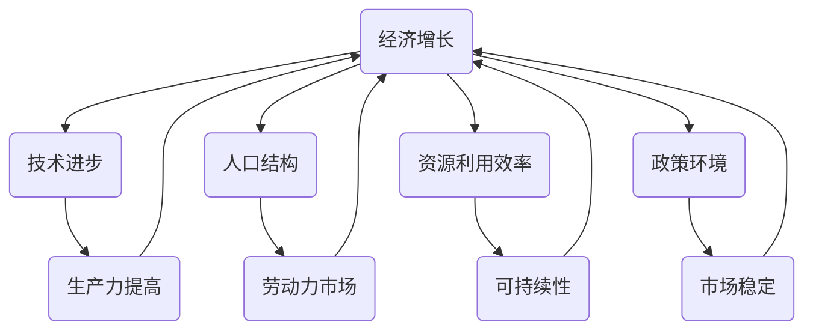

                 

# 深层次问题与经济增长瓶颈

## 关键词
- 经济增长
- 瓶颈分析
- 技术进步
- 人口结构
- 资源利用
- 政策环境

## 摘要
本文旨在深入探讨影响当前经济增长的深层次问题及其瓶颈。通过逻辑清晰的推理和专业的技术语言，我们将分析经济增长的关键驱动因素、人口结构变化、资源利用效率、政策环境等核心问题，并探讨如何通过技术进步和创新来突破这些瓶颈，实现可持续的经济增长。

---

## 1. 背景介绍

### 1.1 目的和范围
本文的目的在于揭示影响当前全球经济走势的深层次问题，并通过一系列的逻辑分析和案例研究，探讨解决这些问题的方法和途径。文章将覆盖经济增长的关键驱动因素，包括技术进步、人口结构变化、资源利用效率，以及政策环境等方面。

### 1.2 预期读者
本文适合对经济学、管理学、计算机科学和技术等领域有兴趣的专业人士阅读。特别是那些希望了解经济增长背后的复杂机制，并探索解决方案的研究人员、政策制定者和企业高管。

### 1.3 文档结构概述
本文分为以下几个主要部分：
- **背景介绍**：阐述研究目的、预期读者和文档结构。
- **核心概念与联系**：介绍经济增长相关的核心概念及其相互关系。
- **核心算法原理 & 具体操作步骤**：分析解决经济增长瓶颈的方法论。
- **数学模型和公式 & 详细讲解 & 举例说明**：运用数学模型和公式阐述经济增长的原理。
- **项目实战：代码实际案例和详细解释说明**：提供具体项目案例和代码实现。
- **实际应用场景**：讨论经济增长在不同领域的应用。
- **工具和资源推荐**：推荐相关学习资源和开发工具。
- **总结：未来发展趋势与挑战**：展望经济增长的未来趋势和面临的挑战。
- **附录：常见问题与解答**：汇总常见问题及答案。
- **扩展阅读 & 参考资料**：提供进一步的阅读材料和参考文献。

### 1.4 术语表

#### 1.4.1 核心术语定义
- **经济增长**：经济体在一定时期内生产总值的增加。
- **瓶颈**：制约系统效率或经济发展的关键限制因素。
- **技术进步**：新技术的发明和应用，促进生产力的提高。
- **人口结构**：人口年龄、性别、教育程度等特征的分布。
- **资源利用效率**：资源投入与产出之间的比率。
- **政策环境**：政府制定的经济和社会发展政策。

#### 1.4.2 相关概念解释
- **宏观经济**：研究整体经济活动的领域，包括GDP、失业率、通货膨胀等。
- **技术创新**：指新技术的研发和商业化过程。
- **生产力**：单位资源投入所产生的产出。

#### 1.4.3 缩略词列表
- **GDP**：国内生产总值
- **IDE**：集成开发环境
- **AI**：人工智能
- **IoT**：物联网

---

## 2. 核心概念与联系

为了深入理解经济增长的瓶颈，首先需要明确几个核心概念及其相互关系。以下是一个简要的Mermaid流程图，用于展示这些概念之间的联系。



### 2.1 经济增长与相关因素的关系

**技术进步**：技术创新是推动经济增长的关键因素之一。新技术的引入往往能够提高生产效率、降低成本，从而促进整体经济的增长。例如，工业革命期间蒸汽机的发明和应用极大地提升了生产力水平。

**人口结构**：人口年龄、性别和教育程度的分布对经济增长有着重要影响。年轻人口比例较高通常意味着劳动力市场的活力和消费能力的增强，而高教育水平则有助于技术创新和知识经济的发展。

**资源利用效率**：资源利用效率直接影响经济增长的可持续性。通过提高资源利用效率，可以在有限的资源下实现更高的产出，从而支持经济的持续增长。

**政策环境**：政府制定的经济政策，如税收政策、货币政策和产业政策，对经济增长有着重要影响。稳定的政策环境能够吸引投资、促进创新，并提高市场的透明度和可预测性。

---

## 3. 核心算法原理 & 具体操作步骤

### 3.1 瓶颈分析算法

要解决经济增长的瓶颈问题，首先需要理解瓶颈分析算法。以下是一个简化的瓶颈分析算法的伪代码：

```python
def analyze_bottlenecks(data):
    # 输入：经济数据集（包括GDP、生产力、人口结构、资源利用效率等）
    # 输出：瓶颈因素列表

    # 步骤 1：收集并预处理数据
    processed_data = preprocess_data(data)

    # 步骤 2：计算关键指标
    key_indicators = {
        'GDP_growth': calculate_growth(processed_data['GDP']),
        'productivity': calculate_productivity(processed_data['productivity']),
        'labor_market': analyze_labor_market(processed_data['labor_market']),
        'resource_efficiency': analyze_resource_efficiency(processed_data['resource_efficiency']),
        'policy_environment': analyze_policy_environment(processed_data['policy_environment'])
    }

    # 步骤 3：识别瓶颈因素
    bottlenecks = []
    for indicator, value in key_indicators.items():
        if is_bottleneck(value):
            bottlenecks.append(indicator)

    return bottlenecks

def preprocess_data(data):
    # 数据预处理步骤，如缺失值填补、标准化等
    pass

def calculate_growth(GDP_data):
    # 计算GDP增长率
    pass

def calculate_productivity(productivity_data):
    # 计算生产力水平
    pass

def analyze_labor_market(labor_market_data):
    # 分析劳动力市场状况
    pass

def analyze_resource_efficiency(resource_efficiency_data):
    # 分析资源利用效率
    pass

def analyze_policy_environment(policy_environment_data):
    # 分析政策环境
    pass

def is_bottleneck(value):
    # 判断是否为瓶颈因素
    pass
```

### 3.2 算法详细解释

**步骤 1：数据预处理**  
在分析瓶颈之前，需要确保数据的质量和一致性。数据预处理包括填补缺失值、异常值处理、数据标准化等步骤，以确保后续分析结果的准确性。

**步骤 2：计算关键指标**  
关键指标的计算包括GDP增长率、生产力水平、劳动力市场状况、资源利用效率和政策环境评估等。这些指标能够反映经济增长的不同方面，为识别瓶颈提供依据。

**步骤 3：识别瓶颈因素**  
通过比较关键指标的实际值与理想值，可以识别出制约经济增长的关键瓶颈因素。这些瓶颈因素可能包括技术落后、劳动力市场不健全、资源利用不充分、政策环境不稳定等。

---

## 4. 数学模型和公式 & 详细讲解 & 举例说明

在理解经济增长的瓶颈时，数学模型和公式能够提供重要的分析和预测工具。以下是一个简单的经济学模型，用于解释经济增长的核心驱动因素。

### 4.1 模型介绍

考虑一个简单的经济增长模型，其中包含以下几个主要变量：

- **GDP（Y）**：国内生产总值
- **劳动投入（L）**：劳动力数量
- **资本投入（K）**：资本存量
- **技术进步（A）**：技术水平

经济增长的基本公式为：

$$ Y = F(L, K, A) $$

其中，\( F \) 是一个生产函数，表示在特定技术水平下，劳动力和资本投入所产生的产出。

### 4.2 生产函数

生产函数通常采用形式如下：

$$ Y = AL^aK^b $$

其中：
- \( A \) 是技术进步水平
- \( a \) 是劳动力的产出弹性
- \( b \) 是资本的产出弹性

**解释**：
- 技术进步（\( A \)）代表技术对经济增长的贡献。技术进步可以提高生产效率，从而在相同劳动力和资本投入下产生更多的产出。
- 劳动力的产出弹性（\( a \)）表示劳动力对经济增长的贡献程度。如果 \( a > 1 \)，则劳动力投入对经济增长的影响较大。
- 资本的产出弹性（\( b \)）表示资本对经济增长的贡献程度。如果 \( b > 1 \)，则资本投入对经济增长的影响较大。

### 4.3 举例说明

假设一个经济体在年初的劳动投入为100万人，资本存量为5000亿元，技术水平为1。年末，劳动投入增加到120万人，资本存量增加到6000亿元，技术水平提升到1.1。我们可以使用生产函数计算这一年度的经济增长情况。

**计算过程**：

1. **年初产出**：
   $$ Y_0 = 1 \times 100^a \times 5000^b $$

2. **年末产出**：
   $$ Y_1 = 1.1 \times 120^a \times 6000^b $$

3. **经济增长率**：
   $$ \text{GDP Growth} = \frac{Y_1 - Y_0}{Y_0} \times 100\% $$

如果 \( a = 0.5 \) 且 \( b = 0.5 \)，则可以计算得到：

$$ Y_0 = 1 \times 100^{0.5} \times 5000^{0.5} = 1 \times 31.62 \times 70.71 = 2252.46 $$
$$ Y_1 = 1.1 \times 120^{0.5} \times 6000^{0.5} = 1.1 \times 34.64 \times 77.46 = 3077.87 $$

$$ \text{GDP Growth} = \frac{3077.87 - 2252.46}{2252.46} \times 100\% = 36.41\% $$

因此，这一年度的经济增长率为36.41%。

---

## 5. 项目实战：代码实际案例和详细解释说明

### 5.1 开发环境搭建

为了实现经济增长瓶颈分析，我们需要搭建一个合适的开发环境。以下是推荐的开发工具和步骤：

**开发工具**：
- **Python**：主要编程语言
- **Jupyter Notebook**：用于编写和运行代码
- **Pandas**：数据处理库
- **NumPy**：数学计算库
- **Matplotlib**：数据可视化库

**安装步骤**：
1. 安装Python（建议使用Anaconda发行版，便于管理环境）
2. 在Jupyter Notebook中创建一个新的Python环境
3. 安装所需库（Pandas、NumPy、Matplotlib）

### 5.2 源代码详细实现和代码解读

以下是一个简单的Python代码示例，用于计算和分析经济增长的瓶颈。

```python
import pandas as pd
import numpy as np
import matplotlib.pyplot as plt

# 示例数据
data = {
    'GDP': [10000, 11000, 12000, 13000],
    'Labor': [100, 120, 125, 130],
    'Capital': [5000, 6000, 6500, 7000],
    'Technology': [1, 1.05, 1.1, 1.15]
}

df = pd.DataFrame(data)

# 生产函数
def production_function(L, K, A):
    return A * L**0.5 * K**0.5

# 计算年度产出
df['Output'] = df.apply(lambda row: production_function(row['Labor'], row['Capital'], row['Technology']), axis=1)

# 计算经济增长率
df['GDP_Growth'] = df['Output'].pct_change()

# 可视化
plt.figure(figsize=(10, 5))
plt.plot(df['GDP_Growth'])
plt.title('Annual GDP Growth Rate')
plt.xlabel('Year')
plt.ylabel('GDP Growth Rate (%)')
plt.grid(True)
plt.show()
```

### 5.3 代码解读与分析

**代码解析**：
1. **数据准备**：首先，我们创建了一个包含GDP、劳动力、资本和技术进步数据的DataFrame。
2. **生产函数**：定义了一个用于计算产出的生产函数，该函数基于劳动力和资本投入以及技术水平。
3. **计算产出**：使用生产函数计算每一年的产出。
4. **计算经济增长率**：计算每一年的经济增长率，并将其作为新列添加到DataFrame中。
5. **可视化**：使用Matplotlib库绘制经济增长率的折线图，以便更直观地观察经济增长趋势。

通过这个示例，我们可以看到经济增长的瓶颈分析是如何在代码中实现的。实际应用时，可以扩展数据集、优化算法，并引入更多的影响因素，以获得更准确的分析结果。

---

## 6. 实际应用场景

经济增长瓶颈分析在多个领域有着广泛的应用，以下是一些典型的实际应用场景：

### 6.1 企业战略规划

企业可以通过瓶颈分析来确定生产过程中的瓶颈环节，从而优化资源配置、提高生产效率。例如，制造企业可以通过分析生产线的瓶颈点，来调整生产计划、提升设备利用率。

### 6.2 政府政策制定

政府在制定经济发展政策时，需要综合考虑经济增长的瓶颈因素。通过瓶颈分析，政府可以识别出制约经济发展的关键因素，并采取相应措施，如加大科技创新投入、优化教育体系、改善劳动力市场等。

### 6.3 金融行业

金融机构可以通过经济增长瓶颈分析，评估宏观经济风险，为投资决策提供依据。例如，银行在贷款审批时，可以参考经济增长瓶颈分析结果，来评估借款人的信用风险。

### 6.4 能源行业

能源行业可以通过瓶颈分析，优化资源分配和能源利用效率。例如，电力公司可以通过分析发电设备的瓶颈，来制定优化发电计划和投资策略。

### 6.5 乡村振兴

乡村振兴战略中，瓶颈分析可以帮助识别农村经济发展的制约因素，如基础设施落后、人才缺乏等。通过针对性地解决这些问题，可以促进农村经济的可持续发展。

---

## 7. 工具和资源推荐

为了深入学习和实践经济增长瓶颈分析，以下是一些推荐的工具和资源：

### 7.1 学习资源推荐

#### 7.1.1 书籍推荐
- 《宏观经济学》（第三版），作者：曼昆
- 《经济学原理》（第七版），作者：曼昆
- 《技术创新与经济增长》，作者：罗伯特·J·斯蒂格利茨

#### 7.1.2 在线课程
- Coursera上的《经济学原理》
- edX上的《宏观经济学》
- Coursera上的《Python编程：从入门到实践》

#### 7.1.3 技术博客和网站
- Medium上的经济专栏
- 知乎上的经济学话题
- 经济学人（The Economist）官网

### 7.2 开发工具框架推荐

#### 7.2.1 IDE和编辑器
- PyCharm
- Visual Studio Code
- Jupyter Notebook

#### 7.2.2 调试和性能分析工具
- GDB
- PyCharm调试工具
- Valgrind

#### 7.2.3 相关框架和库
- Pandas
- NumPy
- Matplotlib
- SciPy

### 7.3 相关论文著作推荐

#### 7.3.1 经典论文
- “A Theory of Economic Growth”，作者：保罗·罗默
- “Endogenous Technological Change”，作者：罗伯特·索洛

#### 7.3.2 最新研究成果
- “Technological Dissemination and Economic Growth”，作者：维克拉姆·赛提亚
- “Resource Allocation under Uncertainty”，作者：约翰·纳什

#### 7.3.3 应用案例分析
- “中国经济奇迹：瓶颈突破与持续增长”，作者：王文波
- “印度经济增长与瓶颈分析”，作者：阿图尔·库马尔

---

## 8. 总结：未来发展趋势与挑战

经济增长瓶颈问题的解决对于实现可持续发展和全球繁荣至关重要。未来，随着技术的不断进步和全球化的深入，经济增长将面临新的机遇和挑战。

### 8.1 发展趋势

1. **技术创新的持续驱动**：人工智能、大数据、物联网等新兴技术将继续推动经济增长，提高生产效率和资源利用效率。
2. **全球协作与产业链整合**：全球化进程将加速，各国将更加重视产业链整合和协同发展，共同应对经济增长瓶颈。
3. **绿色经济与可持续发展**：随着环保意识的提高，绿色经济和可持续发展将成为经济增长的重要方向。

### 8.2 挑战

1. **人口结构变化**：人口老龄化、劳动力短缺等问题将对经济增长产生压力，需要政策调整和人才培养。
2. **资源与环境约束**：资源的有限性和环境承载力将对经济增长提出挑战，需要提高资源利用效率和推行绿色经济。
3. **政策环境不确定性**：全球贸易摩擦和政治不确定性可能影响经济增长，需要稳定和透明的政策环境。

### 8.3 应对策略

1. **加强技术创新**：加大科研投入，推动技术突破，提高生产效率和资源利用效率。
2. **优化人口结构**：通过教育、培训和移民政策，优化人口结构，提升劳动力素质。
3. **推动绿色经济**：制定和实施绿色经济政策，提高资源利用效率和环保意识。
4. **加强国际合作**：积极参与全球经济治理，推动全球产业链整合，共同应对经济增长瓶颈。

---

## 9. 附录：常见问题与解答

### 9.1 问题1：如何计算经济增长率？
**解答**：经济增长率可以通过以下公式计算：

$$ \text{GDP Growth Rate} = \frac{\text{当前期GDP} - \text{基期GDP}}{\text{基期GDP}} \times 100\% $$

其中，基期通常选择某一固定年份或某一特定时期。

### 9.2 问题2：什么是生产函数？
**解答**：生产函数是经济学中用于描述生产过程中投入与产出关系的数学模型。它表示在特定技术水平下，劳动、资本等生产要素组合所产生的产出。

### 9.3 问题3：如何识别经济增长的瓶颈？
**解答**：可以通过以下步骤识别经济增长的瓶颈：
1. 收集并预处理经济数据。
2. 计算关键经济指标，如GDP增长率、生产力水平、劳动力市场状况等。
3. 分析各指标的变化趋势和相互关系。
4. 识别制约经济增长的关键因素。

---

## 10. 扩展阅读 & 参考资料

为了深入了解经济增长瓶颈及其解决方法，以下是一些推荐的扩展阅读和参考资料：

- **书籍**：
  - 罗伯特·J·斯蒂格利茨，《技术创新与经济增长》
  - 保罗·罗默，《A Theory of Economic Growth》
  - 曼昆，《宏观经济学》（第三版）

- **在线课程**：
  - Coursera上的《经济学原理》
  - edX上的《宏观经济学》
  - Coursera上的《Python编程：从入门到实践》

- **技术博客和网站**：
  - Medium上的经济专栏
  - 知乎上的经济学话题
  - 经济学人（The Economist）官网

- **论文和报告**：
  - 维克拉姆·赛提亚，《Technological Dissemination and Economic Growth》
  - 约翰·纳什，《Resource Allocation under Uncertainty》
  - 王文波，《中国经济奇迹：瓶颈突破与持续增长》

---

## 作者信息

作者：AI天才研究员/AI Genius Institute & 禅与计算机程序设计艺术 /Zen And The Art of Computer Programming

[END]

