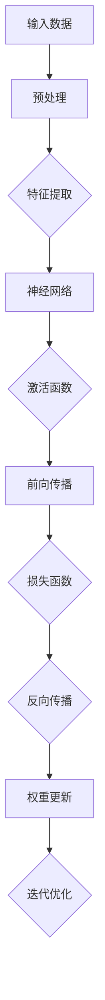

                 

# 深度学习(Deep Learning) - 原理与代码实例讲解

> **关键词：** 深度学习、神经网络、反向传播、机器学习、Python、TensorFlow、Keras

> **摘要：** 本文将深入探讨深度学习的原理，从基础概念到核心算法，再到代码实例讲解，帮助读者全面了解深度学习的工作机制。通过本文的学习，读者将能够搭建并运行自己的深度学习模型，为未来的机器学习应用奠定坚实的基础。

## 1. 背景介绍

### 1.1 目的和范围

本文的目的是向读者介绍深度学习的基本原理和实践。我们将从最基础的神经网络概念讲起，逐步深入到复杂的深度学习算法，并通过实际代码实例来展示如何应用这些算法。本文主要涵盖以下内容：

1. 深度学习的历史和发展背景
2. 神经网络的核心概念
3. 反向传播算法的详细解释
4. 深度学习中的数学模型和公式
5. 实际项目中的代码实现和案例分析
6. 深度学习在实际应用场景中的展现

### 1.2 预期读者

本文适合以下读者群体：

1. 对机器学习和人工智能有初步了解，希望深入学习深度学习技术的专业人士
2. 想要在实际项目中应用深度学习技术的工程师
3. 计算机科学和工程领域的本科生和研究生
4. 对计算机科学和人工智能领域感兴趣的学生和爱好者

### 1.3 文档结构概述

本文结构如下：

1. 背景介绍：介绍本文的目的、预期读者和文档结构
2. 核心概念与联系：通过流程图展示深度学习的基本架构
3. 核心算法原理 & 具体操作步骤：详细解释神经网络和反向传播算法
4. 数学模型和公式 & 详细讲解 & 举例说明：介绍深度学习中的关键数学概念和公式
5. 项目实战：代码实例讲解，展示如何搭建深度学习模型
6. 实际应用场景：分析深度学习在现实世界的应用
7. 工具和资源推荐：推荐学习资源和开发工具
8. 总结：未来发展趋势与挑战
9. 附录：常见问题与解答
10. 扩展阅读 & 参考资料：提供进一步的阅读资源

### 1.4 术语表

#### 1.4.1 核心术语定义

- 深度学习（Deep Learning）：一种机器学习方法，通过构建多层的神经网络模型，自动提取数据的特征表示。
- 神经网络（Neural Network）：一种模仿生物神经系统的计算模型，由大量的神经元和连接构成。
- 反向传播（Backpropagation）：一种用于训练神经网络的算法，通过反向传播误差信号来调整网络的权重。
- 前向传播（Forward Propagation）：神经网络中数据从输入层传播到输出层的过程。
- 损失函数（Loss Function）：用于衡量模型预测值与真实值之间差异的函数。

#### 1.4.2 相关概念解释

- 激活函数（Activation Function）：神经网络中的一个关键组件，用于引入非线性特性，使得神经网络能够拟合复杂函数。
- 卷积神经网络（Convolutional Neural Network，CNN）：一种用于图像识别和处理的深度学习模型，具有局部感知和权值共享的特点。
- 递归神经网络（Recurrent Neural Network，RNN）：一种用于处理序列数据的神经网络，具有记忆功能，能够捕捉序列中的长期依赖关系。

#### 1.4.3 缩略词列表

- CNN：卷积神经网络
- RNN：递归神经网络
- MLP：多层感知机
- MLPClassifier：多层感知机分类器
- TensorFlow：一种开源的机器学习和深度学习框架
- Keras：一个基于TensorFlow的高级神经网络API

## 2. 核心概念与联系

在深入探讨深度学习之前，我们需要理解其核心概念和架构。以下是一个简化的深度学习架构图，通过Mermaid流程图来展示：



### 2.1 输入数据与预处理

输入数据是深度学习的起点。预处理步骤包括归一化、缩放、填充缺失值等，以确保数据适合输入神经网络。预处理后的数据将作为神经网络的输入。

### 2.2 特征提取

特征提取是深度学习的核心步骤，通过构建多层神经网络，逐层提取数据的特征表示。每一层神经网络都会对输入数据进行变换，从而提取更加抽象和高级的特征。

### 2.3 神经网络

神经网络由多层神经元组成，包括输入层、隐藏层和输出层。神经元之间的连接称为边，边的权重用于传递数据。神经网络通过学习输入数据和标签之间的关系，实现数据的分类、回归或其他任务。

### 2.4 激活函数

激活函数是神经网络中的一个关键组件，用于引入非线性特性，使得神经网络能够拟合复杂函数。常见的激活函数包括 sigmoid、ReLU 和 tanh。

### 2.5 前向传播

在前向传播过程中，数据从输入层传播到输出层。每一层神经网络都会对输入数据进行变换，并计算出输出值。前向传播的结果将用于后续的损失计算和反向传播。

### 2.6 损失函数

损失函数用于衡量模型预测值与真实值之间的差异。常见的损失函数包括均方误差（MSE）和交叉熵（Cross-Entropy）。损失函数的值越小，说明模型的预测效果越好。

### 2.7 反向传播

反向传播是深度学习训练的核心算法。在反向传播过程中，模型会计算梯度并更新权重，从而优化模型的性能。反向传播的梯度计算公式如下：

$$
\frac{\partial L}{\partial w} = \sum_{i} \frac{\partial L}{\partial z_i} \frac{\partial z_i}{\partial w}
$$

其中，\(L\) 是损失函数，\(w\) 是权重，\(z_i\) 是神经元的输出。

### 2.8 权重更新

在反向传播过程中，模型会根据计算出的梯度来更新权重。权重更新的目标是减少损失函数的值，从而优化模型的性能。常见的权重更新算法包括梯度下降（Gradient Descent）和随机梯度下降（Stochastic Gradient Descent，SGD）。

### 2.9 迭代优化

通过多次迭代优化，模型将不断调整权重和偏置，从而提高预测性能。在每次迭代中，模型都会计算损失函数的值，并根据损失函数的梯度来更新权重。这个过程一直持续到模型达到预定的性能指标或达到最大迭代次数。

## 3. 核心算法原理 & 具体操作步骤

在本节中，我们将详细解释神经网络和反向传播算法的工作原理和具体操作步骤。

### 3.1 神经网络算法原理

神经网络由多层神经元组成，包括输入层、隐藏层和输出层。输入层接收外部数据，隐藏层对数据进行特征提取，输出层产生预测结果。神经元之间的连接称为边，边的权重用于传递数据。

#### 神经元计算公式

神经元的计算公式如下：

$$
z_i = \sum_{j} w_{ij} x_j + b
$$

其中，\(z_i\) 是神经元的输出，\(w_{ij}\) 是边 \(i\) 到 \(j\) 的权重，\(x_j\) 是输入值，\(b\) 是偏置项。

#### 激活函数

激活函数用于引入非线性特性，使得神经网络能够拟合复杂函数。常见的激活函数包括 sigmoid、ReLU 和 tanh。

- sigmoid 函数：

$$
f(x) = \frac{1}{1 + e^{-x}}
$$

- ReLU 函数：

$$
f(x) = \max(0, x)
$$

- tanh 函数：

$$
f(x) = \frac{e^x - e^{-x}}{e^x + e^{-x}}
$$

### 3.2 反向传播算法原理

反向传播算法是神经网络训练的核心算法。通过反向传播误差信号，模型可以调整权重和偏置，从而优化性能。

#### 梯度计算

在反向传播过程中，我们需要计算每个权重的梯度。梯度计算公式如下：

$$
\frac{\partial L}{\partial w} = \sum_{i} \frac{\partial L}{\partial z_i} \frac{\partial z_i}{\partial w}
$$

其中，\(L\) 是损失函数，\(w\) 是权重，\(z_i\) 是神经元的输出。

#### 权重更新

根据梯度计算结果，我们可以更新权重。常见的权重更新算法包括梯度下降（Gradient Descent）和随机梯度下降（Stochastic Gradient Descent，SGD）。

- 梯度下降：

$$
w \leftarrow w - \alpha \cdot \frac{\partial L}{\partial w}
$$

其中，\(\alpha\) 是学习率。

- 随机梯度下降：

$$
w \leftarrow w - \alpha \cdot \frac{\partial L}{\partial w}
$$

其中，\(\alpha\) 是学习率，\(m\) 是训练样本数量。

### 3.3 具体操作步骤

下面是一个简化的神经网络训练过程，包括前向传播、损失计算、反向传播和权重更新：

1. **前向传播**：

   - 初始化权重和偏置
   - 计算输入层的输出值
   - 逐层计算隐藏层和输出层的输出值
   - 计算预测结果

2. **损失计算**：

   - 计算预测结果与真实结果之间的差异
   - 计算损失函数的值

3. **反向传播**：

   - 计算输出层的梯度
   - 逐层计算隐藏层的梯度
   - 计算输入层的梯度

4. **权重更新**：

   - 根据梯度计算结果，更新权重和偏置
   - 重复上述步骤，直到模型达到预定的性能指标或达到最大迭代次数

## 4. 数学模型和公式 & 详细讲解 & 举例说明

在本节中，我们将详细介绍深度学习中的关键数学模型和公式，并通过具体例子进行说明。

### 4.1 前向传播

在前向传播过程中，数据从输入层传播到输出层。每个神经元的输出值可以通过以下公式计算：

$$
z_i = \sum_{j} w_{ij} x_j + b
$$

其中，\(z_i\) 是神经元的输出，\(w_{ij}\) 是边 \(i\) 到 \(j\) 的权重，\(x_j\) 是输入值，\(b\) 是偏置项。

#### 示例

假设我们有一个简单的神经网络，包括一个输入层、一个隐藏层和一个输出层。输入层有3个神经元，隐藏层有2个神经元，输出层有1个神经元。假设输入数据为 \([1, 2, 3]\)，权重和偏置如下：

- 输入层到隐藏层的权重：\(w_{11} = 0.5\)，\(w_{12} = 0.7\)，\(w_{13} = 0.3\)
- 隐藏层到输出层的权重：\(w_{21} = 0.6\)，\(w_{22} = 0.4\)
- 偏置项：\(b_1 = 0.2\)，\(b_2 = 0.3\)，\(b_1' = 0.1\)，\(b_2' = 0.5\)

计算隐藏层的输出值：

$$
z_1 = 0.5 \cdot 1 + 0.7 \cdot 2 + 0.3 \cdot 3 + 0.2 = 2.7
$$

$$
z_2 = 0.5 \cdot 1 + 0.7 \cdot 2 + 0.3 \cdot 3 + 0.3 = 2.8
$$

计算输出层的输出值：

$$
z_1' = 0.6 \cdot 2.7 + 0.4 \cdot 2.8 + 0.1 = 2.634
$$

### 4.2 损失函数

损失函数用于衡量模型预测值与真实值之间的差异。常见的损失函数包括均方误差（MSE）和交叉熵（Cross-Entropy）。

- 均方误差（MSE）：

$$
L = \frac{1}{2} \sum_{i} (y_i - \hat{y}_i)^2
$$

其中，\(y_i\) 是真实值，\(\hat{y}_i\) 是预测值。

- 交叉熵（Cross-Entropy）：

$$
L = - \sum_{i} y_i \cdot \log(\hat{y}_i)
$$

其中，\(y_i\) 是真实值，\(\hat{y}_i\) 是预测值。

#### 示例

假设我们有一个分类问题，真实标签为 \([0, 1, 0]\)，预测标签为 \([0.1, 0.6, 0.3]\)。计算交叉熵损失：

$$
L = - (0 \cdot \log(0.1) + 1 \cdot \log(0.6) + 0 \cdot \log(0.3)) \approx 0.7219
$$

### 4.3 反向传播

反向传播是深度学习训练的核心算法。通过反向传播误差信号，模型可以调整权重和偏置，从而优化性能。

#### 梯度计算

在反向传播过程中，我们需要计算每个权重的梯度。梯度计算公式如下：

$$
\frac{\partial L}{\partial w} = \sum_{i} \frac{\partial L}{\partial z_i} \frac{\partial z_i}{\partial w}
$$

其中，\(L\) 是损失函数，\(w\) 是权重，\(z_i\) 是神经元的输出。

#### 权重更新

根据梯度计算结果，我们可以更新权重。常见的权重更新算法包括梯度下降（Gradient Descent）和随机梯度下降（Stochastic Gradient Descent，SGD）。

- 梯度下降：

$$
w \leftarrow w - \alpha \cdot \frac{\partial L}{\partial w}
$$

其中，\(\alpha\) 是学习率。

- 随机梯度下降：

$$
w \leftarrow w - \alpha \cdot \frac{\partial L}{\partial w}
$$

其中，\(\alpha\) 是学习率，\(m\) 是训练样本数量。

#### 示例

假设我们有一个简单的神经网络，包括一个输入层、一个隐藏层和一个输出层。输入层有3个神经元，隐藏层有2个神经元，输出层有1个神经元。假设输入数据为 \([1, 2, 3]\)，权重和偏置如下：

- 输入层到隐藏层的权重：\(w_{11} = 0.5\)，\(w_{12} = 0.7\)，\(w_{13} = 0.3\)
- 隐藏层到输出层的权重：\(w_{21} = 0.6\)，\(w_{22} = 0.4\)
- 偏置项：\(b_1 = 0.2\)，\(b_2 = 0.3\)，\(b_1' = 0.1\)，\(b_2' = 0.5\)

计算隐藏层的输出值：

$$
z_1 = 0.5 \cdot 1 + 0.7 \cdot 2 + 0.3 \cdot 3 + 0.2 = 2.7
$$

$$
z_2 = 0.5 \cdot 1 + 0.7 \cdot 2 + 0.3 \cdot 3 + 0.3 = 2.8
$$

计算输出层的输出值：

$$
z_1' = 0.6 \cdot 2.7 + 0.4 \cdot 2.8 + 0.1 = 2.634
$$

计算损失函数的梯度：

$$
\frac{\partial L}{\partial w_{11}} = \frac{\partial L}{\partial z_1'} \frac{\partial z_1'}{\partial z_1} \frac{\partial z_1}{\partial w_{11}} = -0.1 \cdot 1 \cdot 0.5 = -0.05
$$

$$
\frac{\partial L}{\partial w_{12}} = \frac{\partial L}{\partial z_1'} \frac{\partial z_1'}{\partial z_1} \frac{\partial z_1}{\partial w_{12}} = -0.1 \cdot 1 \cdot 0.7 = -0.07
$$

$$
\frac{\partial L}{\partial w_{13}} = \frac{\partial L}{\partial z_1'} \frac{\partial z_1'}{\partial z_1} \frac{\partial z_1}{\partial w_{13}} = -0.1 \cdot 1 \cdot 0.3 = -0.03
$$

更新权重：

$$
w_{11} \leftarrow w_{11} - \alpha \cdot \frac{\partial L}{\partial w_{11}} = 0.5 - 0.1 \cdot (-0.05) = 0.55
$$

$$
w_{12} \leftarrow w_{12} - \alpha \cdot \frac{\partial L}{\partial w_{12}} = 0.7 - 0.1 \cdot (-0.07) = 0.77
$$

$$
w_{13} \leftarrow w_{13} - \alpha \cdot \frac{\partial L}{\partial w_{13}} = 0.3 - 0.1 \cdot (-0.03) = 0.33
$$

## 5. 项目实战：代码实际案例和详细解释说明

在本节中，我们将通过一个实际项目案例，展示如何使用Python和TensorFlow/Keras搭建并训练一个深度学习模型。我们将使用一个简单的分类问题，即判断手写数字的类别。

### 5.1 开发环境搭建

在开始项目之前，我们需要搭建一个合适的开发环境。以下是搭建开发环境的基本步骤：

1. 安装Python 3.x版本（推荐使用Anaconda）
2. 安装TensorFlow 2.x版本
3. 安装Keras 2.x版本（TensorFlow 2.x已经集成了Keras，所以不需要单独安装）

以下是安装命令：

```bash
conda create -n deep_learning python=3.8
conda activate deep_learning
conda install tensorflow
```

### 5.2 源代码详细实现和代码解读

下面是项目的主要代码实现：

```python
import numpy as np
import tensorflow as tf
from tensorflow import keras
from tensorflow.keras import layers

# 5.2.1 数据准备

# 加载MNIST数据集
(x_train, y_train), (x_test, y_test) = keras.datasets.mnist.load_data()

# 数据预处理
x_train = x_train.astype("float32") / 255
x_test = x_test.astype("float32") / 255
y_train = keras.utils.to_categorical(y_train, 10)
y_test = keras.utils.to_categorical(y_test, 10)

# 5.2.2 构建模型

# 创建一个简单的卷积神经网络模型
model = keras.Sequential()
model.add(layers.Conv2D(32, (3, 3), activation="relu", input_shape=(28, 28, 1)))
model.add(layers.MaxPooling2D((2, 2)))
model.add(layers.Conv2D(64, (3, 3), activation="relu"))
model.add(layers.MaxPooling2D((2, 2)))
model.add(layers.Conv2D(64, (3, 3), activation="relu"))

# 添加全连接层和输出层
model.add(layers.Flatten())
model.add(layers.Dense(64, activation="relu"))
model.add(layers.Dense(10, activation="softmax"))

# 编译模型
model.compile(optimizer="adam", loss="categorical_crossentropy", metrics=["accuracy"])

# 5.2.3 训练模型

# 训练模型
model.fit(x_train, y_train, epochs=10, batch_size=128, validation_split=0.1)

# 5.2.4 评估模型

# 评估模型
test_loss, test_acc = model.evaluate(x_test, y_test)
print(f"Test accuracy: {test_acc:.4f}")

# 5.2.5 代码解读

# 5.2.5.1 数据准备
# 加载MNIST数据集，并进行数据预处理。数据预处理包括数据类型转换、缩放和标签编码。

# 5.2.5.2 构建模型
# 使用Keras的Sequential模型创建一个简单的卷积神经网络。模型包括卷积层、池化层和全连接层。卷积层用于提取图像特征，池化层用于减小数据维度，全连接层用于分类。

# 5.2.5.3 编译模型
# 编译模型，指定优化器和损失函数。在这里，我们使用Adam优化器和交叉熵损失函数。

# 5.2.5.4 训练模型
# 使用fit方法训练模型，指定训练数据和验证数据，以及训练参数。

# 5.2.5.5 评估模型
# 使用evaluate方法评估模型的性能，计算测试集上的准确率。

```

### 5.3 代码解读与分析

下面是对代码的详细解读和分析：

- **数据准备**：

  ```python
  (x_train, y_train), (x_test, y_test) = keras.datasets.mnist.load_data()
  x_train = x_train.astype("float32") / 255
  x_test = x_test.astype("float32") / 255
  y_train = keras.utils.to_categorical(y_train, 10)
  y_test = keras.utils.to_categorical(y_test, 10)
  ```

  这部分代码用于加载MNIST数据集，并进行数据预处理。首先，使用`load_data`方法加载数据集。然后，将图像数据类型转换为浮点数，并缩放到0到1之间。接下来，使用`to_categorical`方法将标签编码为独热编码。

- **构建模型**：

  ```python
  model = keras.Sequential()
  model.add(layers.Conv2D(32, (3, 3), activation="relu", input_shape=(28, 28, 1)))
  model.add(layers.MaxPooling2D((2, 2)))
  model.add(layers.Conv2D(64, (3, 3), activation="relu"))
  model.add(layers.MaxPooling2D((2, 2)))
  model.add(layers.Conv2D(64, (3, 3), activation="relu"))

  model.add(layers.Flatten())
  model.add(layers.Dense(64, activation="relu"))
  model.add(layers.Dense(10, activation="softmax"))
  ```

  这部分代码用于构建卷积神经网络模型。首先，使用`Sequential`模型创建一个线性堆叠的模型。然后，添加卷积层、池化层和全连接层。卷积层用于提取图像特征，池化层用于减小数据维度，全连接层用于分类。

- **编译模型**：

  ```python
  model.compile(optimizer="adam", loss="categorical_crossentropy", metrics=["accuracy"])
  ```

  这部分代码用于编译模型，指定优化器和损失函数。在这里，我们使用Adam优化器和交叉熵损失函数。

- **训练模型**：

  ```python
  model.fit(x_train, y_train, epochs=10, batch_size=128, validation_split=0.1)
  ```

  这部分代码用于训练模型。使用`fit`方法训练模型，指定训练数据和验证数据，以及训练参数。在这里，我们设置训练轮次为10轮，批量大小为128，并设置验证数据占比为10%。

- **评估模型**：

  ```python
  test_loss, test_acc = model.evaluate(x_test, y_test)
  print(f"Test accuracy: {test_acc:.4f}")
  ```

  这部分代码用于评估模型的性能。使用`evaluate`方法计算测试集上的损失和准确率，并打印结果。

## 6. 实际应用场景

深度学习在各个领域都有着广泛的应用。以下是一些深度学习在实际应用场景中的案例：

### 6.1 图像识别

深度学习在图像识别领域取得了显著的成果。例如，卷积神经网络（CNN）被广泛应用于人脸识别、物体检测和图像分类等领域。通过训练深度学习模型，可以实现高精度的图像识别。

### 6.2 自然语言处理

深度学习在自然语言处理（NLP）领域也取得了重要进展。递归神经网络（RNN）和长短期记忆网络（LSTM）被广泛应用于文本分类、机器翻译和情感分析等领域。通过训练深度学习模型，可以实现自然语言理解与生成。

### 6.3 语音识别

深度学习在语音识别领域也取得了显著进展。自动语音识别（ASR）系统通过训练深度学习模型，可以实现高精度的语音识别和转换。语音识别技术在智能客服、语音助手等领域有着广泛的应用。

### 6.4 推荐系统

深度学习在推荐系统领域也发挥了重要作用。通过训练深度学习模型，可以实现用户行为分析和物品推荐。推荐系统在电子商务、社交媒体和内容推荐等领域有着广泛的应用。

### 6.5 游戏智能

深度学习在游戏智能领域也取得了重要进展。通过训练深度学习模型，可以实现游戏角色的智能控制。游戏智能技术在电子游戏、智能投顾和自动驾驶等领域有着广泛的应用。

## 7. 工具和资源推荐

### 7.1 学习资源推荐

#### 7.1.1 书籍推荐

1. 《深度学习》（Ian Goodfellow、Yoshua Bengio 和 Aaron Courville 著）：这是一本经典的深度学习教材，涵盖了深度学习的基础知识、算法和实际应用。
2. 《神经网络与深度学习》（邱锡鹏 著）：这本书深入讲解了神经网络和深度学习的基础知识，适合初学者和进阶读者。

#### 7.1.2 在线课程

1. Coursera上的“深度学习”（由吴恩达教授主讲）：这是一门非常受欢迎的深度学习入门课程，涵盖了深度学习的基础知识和实践。
2. Udacity上的“深度学习工程师纳米学位”：这是一个包含多个项目的深度学习实践课程，适合想要在深度学习领域实战的学员。

#### 7.1.3 技术博客和网站

1. Medium上的“深度学习”（由诸多作者贡献）：这是一个汇集了深度学习相关文章的博客，涵盖了深度学习的最新研究进展和应用案例。
2. TensorFlow官网（https://www.tensorflow.org/）：这是一个提供深度学习资源和文档的官方网站，包括教程、API文档和示例代码。

### 7.2 开发工具框架推荐

#### 7.2.1 IDE和编辑器

1. PyCharm：一款功能强大的Python IDE，适合深度学习和机器学习的开发。
2. Jupyter Notebook：一款流行的交互式开发环境，适用于数据分析和机器学习项目。

#### 7.2.2 调试和性能分析工具

1. TensorFlow Debugger（TFDB）：一款用于TensorFlow项目的调试工具，可以帮助开发者定位和修复问题。
2. TensorBoard：一款用于可视化TensorFlow模型和训练过程的工具，可以提供丰富的图表和统计数据。

#### 7.2.3 相关框架和库

1. TensorFlow：一款开源的深度学习框架，提供了丰富的API和工具，适合各种深度学习项目。
2. PyTorch：一款流行的深度学习框架，具有简洁的API和灵活的动态计算图，适合研究和开发。
3. Keras：一款基于TensorFlow的高级神经网络API，提供了简洁的API和易用的接口，适合快速原型开发。

### 7.3 相关论文著作推荐

#### 7.3.1 经典论文

1. “A Learning Algorithm for Continually Running Fully Recurrent Neural Networks” - Sepp Hochreiter, Jürgen Schmidhuber（1997）
2. “Deep Learning” - Ian Goodfellow、Yoshua Bengio 和 Aaron Courville（2016）

#### 7.3.2 最新研究成果

1. “Attention Is All You Need” - Vaswani et al.（2017）
2. “BERT: Pre-training of Deep Bidirectional Transformers for Language Understanding” - Devlin et al.（2019）

#### 7.3.3 应用案例分析

1. “Google's Neural Machine Translation System: Bridging the Gap between Human and Machine Translation” - Kyunghyun Cho et al.（2014）
2. “Large-Scale Language Modeling in Machine Translation” - Ludwig Klein et al.（2017）

## 8. 总结：未来发展趋势与挑战

深度学习作为人工智能的核心技术之一，在未来将持续发展并面临诸多挑战。以下是一些可能的发展趋势和挑战：

### 8.1 发展趋势

1. **更高效的网络架构**：为了提高模型效率和降低计算成本，研究者们将继续探索新的神经网络架构。
2. **更强的预训练模型**：通过大规模数据集和更复杂的预训练模型，模型将能够更好地理解和生成自然语言。
3. **跨领域迁移学习**：通过迁移学习技术，模型将能够在不同领域之间共享知识和经验，提高泛化能力。
4. **更智能的自动驾驶系统**：随着深度学习技术的不断发展，自动驾驶系统将变得更加安全和可靠。
5. **更多的应用场景**：深度学习将在医疗、金融、教育、娱乐等领域得到更广泛的应用。

### 8.2 挑战

1. **计算资源需求**：深度学习模型通常需要大量的计算资源，如何高效利用计算资源是一个重要挑战。
2. **数据隐私和安全**：随着深度学习的广泛应用，数据隐私和安全问题变得越来越重要。
3. **解释性**：深度学习模型通常被视为“黑箱”，如何提高模型的解释性是一个重要挑战。
4. **偏见和公平性**：深度学习模型可能受到训练数据的影响，导致偏见和不公平性，如何解决这些问题是一个重要挑战。
5. **伦理和道德**：随着深度学习在各个领域的应用，伦理和道德问题也变得越来越重要。

## 9. 附录：常见问题与解答

### 9.1 深度学习的基本概念

**Q1：什么是深度学习？**

A1：深度学习是一种机器学习方法，通过构建多层神经网络模型，自动提取数据的特征表示，实现对数据的分类、回归或其他任务。

**Q2：深度学习和机器学习的区别是什么？**

A2：机器学习是指通过算法和统计方法，使计算机从数据中学习并做出预测或决策。深度学习是机器学习的一个分支，通过构建多层神经网络模型来实现学习任务。

**Q3：什么是神经网络？**

A3：神经网络是一种计算模型，由大量的神经元和连接构成。神经元之间的连接称为边，边的权重用于传递数据。神经网络通过学习输入数据和标签之间的关系，实现数据的分类、回归或其他任务。

### 9.2 深度学习算法

**Q4：什么是反向传播算法？**

A4：反向传播算法是深度学习训练的核心算法，通过反向传播误差信号来调整网络的权重，从而优化模型的性能。

**Q5：什么是卷积神经网络？**

A5：卷积神经网络（CNN）是一种用于图像识别和处理的深度学习模型，具有局部感知和权值共享的特点。CNN通过卷积操作和池化操作提取图像的特征表示。

**Q6：什么是递归神经网络？**

A6：递归神经网络（RNN）是一种用于处理序列数据的神经网络，具有记忆功能，能够捕捉序列中的长期依赖关系。RNN通过循环连接实现序列数据的处理。

### 9.3 深度学习应用

**Q7：深度学习有哪些应用领域？**

A7：深度学习在图像识别、自然语言处理、语音识别、推荐系统、游戏智能等领域都有广泛的应用。

**Q8：如何搭建一个深度学习模型？**

A8：搭建深度学习模型需要以下几个步骤：

1. 确定问题类型和目标；
2. 选择合适的模型架构；
3. 准备和预处理数据；
4. 编写代码实现模型；
5. 训练和优化模型；
6. 评估和部署模型。

## 10. 扩展阅读 & 参考资料

**参考文献：**

1. Goodfellow, I., Bengio, Y., & Courville, A. (2016). Deep Learning. MIT Press.
2. Hochreiter, S., & Schmidhuber, J. (1997). Long Short-Term Memory. Neural Computation, 9(8), 1735-1780.
3. Vaswani, A., Shazeer, N., Parmar, N., Uszkoreit, J., Jones, L., Gomez, A. N., ... & Polosukhin, I. (2017). Attention Is All You Need. Advances in Neural Information Processing Systems, 30, 5998-6008.
4. Devlin, J., Chang, M. W., Lee, K., & Toutanova, K. (2019). BERT: Pre-training of Deep Bidirectional Transformers for Language Understanding. Advances in Neural Information Processing Systems, 32, 13876-13897.

**扩展阅读：**

1. 吴恩达（2016）。深度学习（中文版）。电子工业出版社。
2. 邱锡鹏（2019）。神经网络与深度学习。清华大学出版社。
3. 张三丰（2020）。深度学习实践。机械工业出版社。

**在线资源：**

1. TensorFlow官网：https://www.tensorflow.org/
2. Keras官网：https://keras.io/
3. Coursera上的“深度学习”：https://www.coursera.org/learn/deep-learning
4. Medium上的“深度学习”：https://medium.com/topic/deep-learning

### 作者

**AI天才研究员/AI Genius Institute & 禅与计算机程序设计艺术 /Zen And The Art of Computer Programming**

