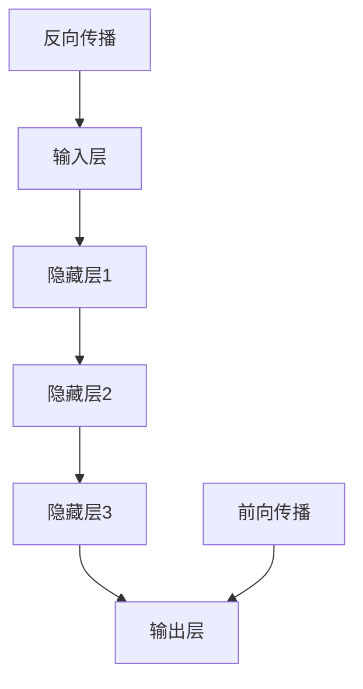

                 

# 深度学习从入门到精通：全面指南

> 关键词：深度学习、神经网络、机器学习、数据预处理、模型评估、优化算法、实战案例

> 摘要：本文将带您从零开始，逐步深入理解深度学习的基础知识、核心算法、数学模型和实际应用。通过详细的讲解和实战案例，帮助您全面掌握深度学习的各项技能，实现从入门到精通的蜕变。

## 1. 背景介绍

### 1.1 目的和范围

本文旨在为广大对深度学习感兴趣的初学者和专业人士提供一个全面的学习指南。我们将从基础概念入手，逐步深入探讨深度学习的核心算法、数学模型和实际应用。通过本文的学习，您将能够：

1. 理解深度学习的基本原理和架构。
2. 掌握常见的深度学习算法和模型。
3. 学会使用数学模型和公式进行分析和优化。
4. 通过实战案例掌握深度学习的实际应用。

### 1.2 预期读者

本文适合以下读者群体：

1. 对深度学习有一定了解，但尚未深入研究的初学者。
2. 想要提升自己在深度学习领域技能的专业人士。
3. 感兴趣于人工智能和机器学习的爱好者。

### 1.3 文档结构概述

本文分为以下几个部分：

1. 背景介绍：本文的写作目的、预期读者、文档结构等。
2. 核心概念与联系：介绍深度学习的基础知识、核心概念和架构。
3. 核心算法原理 & 具体操作步骤：详细讲解深度学习的核心算法原理和操作步骤。
4. 数学模型和公式 & 详细讲解 & 举例说明：介绍深度学习中的数学模型和公式，并通过实例进行说明。
5. 项目实战：通过实际案例展示深度学习的应用。
6. 实际应用场景：探讨深度学习在不同领域的实际应用。
7. 工具和资源推荐：推荐深度学习的学习资源和开发工具。
8. 总结：总结深度学习的发展趋势和挑战。
9. 附录：常见问题与解答。
10. 扩展阅读 & 参考资料：提供更多深度学习的相关资料。

### 1.4 术语表

为了确保本文的统一性和可读性，以下是对本文中出现的部分术语进行定义和解释：

#### 1.4.1 核心术语定义

- **深度学习**：一种人工智能方法，通过模拟人脑神经网络进行学习和推理。
- **神经网络**：一种由大量节点（神经元）组成的计算模型，通过层层传递信息来实现学习和推理。
- **前向传播**：神经网络信息传递的一种方式，信息从输入层传递到输出层。
- **反向传播**：神经网络训练过程中的一种算法，用于计算网络参数的梯度，并更新参数。

#### 1.4.2 相关概念解释

- **激活函数**：神经网络中的一个关键组件，用于引入非线性特性。
- **损失函数**：用于衡量模型预测值与真实值之间差距的函数。
- **优化算法**：用于调整神经网络参数，以最小化损失函数的算法。

#### 1.4.3 缩略词列表

- **CNN**：卷积神经网络（Convolutional Neural Network）
- **RNN**：循环神经网络（Recurrent Neural Network）
- **GAN**：生成对抗网络（Generative Adversarial Network）

## 2. 核心概念与联系

### 2.1 深度学习的基本原理

深度学习是一种人工智能方法，它通过模拟人脑神经网络进行学习和推理。神经网络由大量节点（神经元）组成，这些节点通过层层传递信息来实现学习和推理。深度学习的关键在于构建多层神经网络，以实现对复杂数据的建模和预测。

### 2.2 深度学习的核心概念

在深度学习中，有几个核心概念是非常重要的：

- **神经元**：神经网络的基本单元，负责接收输入信息、进行计算和传递输出。
- **层**：神经网络中的一组神经元。常见的层有输入层、隐藏层和输出层。
- **前向传播**：信息从输入层传递到输出层的正向过程。
- **反向传播**：通过计算输出层误差，反向更新网络参数的过程。

### 2.3 深度学习的架构

深度学习的架构可以分为以下几个部分：

1. **输入层**：接收输入数据。
2. **隐藏层**：对输入数据进行特征提取和变换。
3. **输出层**：输出模型的预测结果。

隐藏层可以有多个，层数越多，网络的建模能力越强，但训练难度也越大。

### 2.4 深度学习的核心算法

深度学习的核心算法包括：

- **前向传播算法**：将输入数据通过神经网络传递到输出层，得到预测结果。
- **反向传播算法**：通过计算输出层误差，反向更新网络参数，优化模型。

这两个算法是深度学习训练过程中的关键步骤。

### 2.5 深度学习的优势与挑战

深度学习的优势在于：

- **强大的建模能力**：通过多层神经网络，可以学习到复杂数据的特征。
- **自动特征提取**：无需人工设计特征，大大降低了数据预处理的工作量。

但深度学习也面临一些挑战：

- **训练难度大**：需要大量的数据和计算资源。
- **过拟合问题**：模型过于复杂，可能导致在训练数据上表现良好，但在未知数据上表现不佳。

为了解决这些问题，研究者们提出了各种优化算法和正则化方法。

### 2.6 Mermaid 流程图

以下是深度学习核心概念和架构的 Mermaid 流程图：



在前向传播过程中，输入数据通过隐藏层传递，最终得到输出结果。在反向传播过程中，计算输出结果与真实值的误差，并反向更新网络参数。

## 3. 核心算法原理 & 具体操作步骤

### 3.1 前向传播算法原理

前向传播算法是神经网络进行预测的基础。它通过层层传递输入数据，最终得到输出结果。前向传播算法的具体操作步骤如下：

1. **初始化参数**：设定网络中的权重和偏置。
2. **输入数据**：将输入数据传递到输入层。
3. **激活函数计算**：对输入数据进行激活函数计算，得到每个神经元的输出。
4. **层间传递**：将激活后的数据传递到下一层。
5. **输出结果**：经过多层传递后，最终得到输出层的预测结果。

### 3.2 前向传播算法伪代码

以下是前向传播算法的伪代码：

```python
# 输入：输入数据、神经网络结构（包括层的大小和激活函数）
# 输出：输出层的预测结果

for each layer from input to output:
    for each neuron in the layer:
        # 计算输入值
        input_value = 0
        for each incoming edge from previous layer:
            input_value += weight * previous_neuron_output
        input_value += bias
        
        # 应用激活函数
        output = activation_function(input_value)
        
        # 传递输出值到下一层
        previous_neuron_output = output

return output
```

### 3.3 反向传播算法原理

反向传播算法是神经网络训练过程中的关键步骤。它通过计算输出结果与真实值之间的误差，反向更新网络参数，以优化模型。反向传播算法的具体操作步骤如下：

1. **计算误差**：计算输出结果与真实值之间的误差。
2. **计算梯度**：计算每个参数的梯度，即误差对参数的偏导数。
3. **更新参数**：根据梯度更新网络参数。
4. **重复迭代**：重复上述步骤，直到满足停止条件（如误差收敛）。

### 3.4 反向传播算法伪代码

以下是反向传播算法的伪代码：

```python
# 输入：输入数据、真实值、神经网络结构（包括层的大小和激活函数）
# 输出：更新后的网络参数

# 前向传播
output = forward_propagation(input)

# 计算误差
error = true_value - output

# 计算梯度
gradient = calculate_gradient(error, activation_function)

# 更新参数
for each layer from output to input:
    for each neuron in the layer:
        for each parameter in the neuron:
            parameter -= learning_rate * gradient

return updated_parameters
```

通过以上两个算法的讲解，我们可以看到深度学习训练的核心在于前向传播和反向传播。通过不断地迭代，优化网络参数，使模型在训练数据上表现更好。

## 4. 数学模型和公式 & 详细讲解 & 举例说明

### 4.1 激活函数

激活函数是深度学习中的一个关键组件，它引入了非线性特性，使得神经网络能够更好地拟合复杂数据。常见的激活函数包括：

- **Sigmoid 函数**：$f(x) = \frac{1}{1 + e^{-x}}$
- **ReLU 函数**：$f(x) = max(0, x)$
- **Tanh 函数**：$f(x) = \frac{e^x - e^{-x}}{e^x + e^{-x}}$

以下是对这些激活函数的详细讲解和举例说明：

#### 4.1.1 Sigmoid 函数

Sigmoid 函数是一个 S 形的曲线，它将输入映射到 (0, 1) 区间。它的优点是输出值易于解释，但缺点是梯度在靠近 0 和 1 时较小，容易导致梯度消失问题。

**例：**

计算 $f(x) = \frac{1}{1 + e^{-x}}$，当 $x = 1$ 时：

$$
f(1) = \frac{1}{1 + e^{-1}} \approx 0.731
$$

#### 4.1.2 ReLU 函数

ReLU 函数是一种简单的线性激活函数，它将输入大于 0 的部分映射到 1，小于等于 0 的部分映射到 0。ReLU 函数的优点是计算速度快，梯度稳定，不易发生梯度消失问题。

**例：**

计算 $f(x) = max(0, x)$，当 $x = -1, 1$ 时：

$$
f(-1) = 0, \quad f(1) = 1
$$

#### 4.1.3 Tanh 函数

Tanh 函数是一个双曲正切函数，它将输入映射到 (-1, 1) 区间。与 Sigmoid 函数类似，Tanh 函数的优点是输出值易于解释，但缺点是梯度在靠近 0 时较小。

**例：**

计算 $f(x) = \frac{e^x - e^{-x}}{e^x + e^{-x}}$，当 $x = 1$ 时：

$$
f(1) = \frac{e^1 - e^{-1}}{e^1 + e^{-1}} \approx 0.761
$$

### 4.2 损失函数

损失函数是衡量模型预测值与真实值之间差距的函数。在深度学习中，常用的损失函数包括：

- **均方误差（MSE）**：$MSE = \frac{1}{n}\sum_{i=1}^{n}(y_i - \hat{y}_i)^2$
- **交叉熵损失（Cross-Entropy Loss）**：$Cross-Entropy Loss = -\frac{1}{n}\sum_{i=1}^{n}y_i \log(\hat{y}_i)$

以下是对这些损失函数的详细讲解和举例说明：

#### 4.2.1 均方误差（MSE）

均方误差是一种常见的损失函数，它计算预测值与真实值之间差的平方的平均值。

**例：**

给定一组数据点 $(x_1, y_1), (x_2, y_2), ..., (x_n, y_n)$，预测值分别为 $\hat{y}_1, \hat{y}_2, ..., \hat{y}_n$，计算 MSE：

$$
MSE = \frac{1}{n}\sum_{i=1}^{n}(y_i - \hat{y}_i)^2
$$

#### 4.2.2 交叉熵损失

交叉熵损失是用于分类问题的损失函数，它计算真实分布与预测分布之间的交叉熵。

**例：**

给定一组二分类数据 $(x_1, y_1), (x_2, y_2), ..., (x_n, y_n)$，其中 $y_i \in \{0, 1\}$，预测值分别为 $\hat{y}_1, \hat{y}_2, ..., \hat{y}_n$，计算交叉熵损失：

$$
Cross-Entropy Loss = -\frac{1}{n}\sum_{i=1}^{n}y_i \log(\hat{y}_i)
$$

### 4.3 优化算法

优化算法用于调整神经网络参数，以最小化损失函数。常见的优化算法包括：

- **随机梯度下降（SGD）**：通过随机选择一部分训练样本，计算梯度并更新参数。
- **Adam 优化器**：结合了 SGD 和动量项的优化算法，具有更好的收敛性。

以下是对这些优化算法的详细讲解和举例说明：

#### 4.3.1 随机梯度下降（SGD）

随机梯度下降是一种最简单的优化算法，它通过随机选择一部分训练样本，计算梯度并更新参数。

**例：**

给定一组训练样本 $(x_1, y_1), (x_2, y_2), ..., (x_n, y_n)$，参数为 $w$，学习率为 $\eta$，计算 SGD 更新：

$$
w_{new} = w - \eta \cdot \frac{\partial Loss}{\partial w}
$$

#### 4.3.2 Adam 优化器

Adam 优化器是一种结合了 SGD 和动量项的优化算法，具有更好的收敛性。

**例：**

给定一组训练样本 $(x_1, y_1), (x_2, y_2), ..., (x_n, y_n)$，参数为 $w$，学习率为 $\eta$，计算 Adam 更新：

$$
m_t = \beta_1 m_{t-1} + (1 - \beta_1) \frac{\partial Loss}{\partial w}
$$
$$
v_t = \beta_2 v_{t-1} + (1 - \beta_2) (\frac{\partial Loss}{\partial w})^2
$$
$$
\hat{m}_t = \frac{m_t}{1 - \beta_1^t}
$$
$$
\hat{v}_t = \frac{v_t}{1 - \beta_2^t}
$$
$$
w_{new} = w - \eta \cdot \frac{\hat{m}_t}{\sqrt{\hat{v}_t} + \epsilon}
$$

通过以上对激活函数、损失函数和优化算法的讲解和举例说明，我们可以看到深度学习中的数学模型和公式是如何应用于实际问题的。掌握这些数学模型和公式，将有助于我们更好地理解和应用深度学习技术。

## 5. 项目实战：代码实际案例和详细解释说明

### 5.1 开发环境搭建

在进行深度学习项目实战之前，我们需要搭建一个合适的开发环境。以下是搭建深度学习开发环境的步骤：

1. **安装 Python**：确保 Python 已安装在您的系统上。Python 是深度学习开发的主要语言，版本建议为 3.7 或以上。
2. **安装深度学习库**：安装 TensorFlow、Keras 和 NumPy。这些库提供了丰富的深度学习功能，使得深度学习开发更加便捷。
   ```bash
   pip install tensorflow numpy
   ```
3. **安装其他依赖库**：根据项目需求，可能需要安装其他依赖库，如 Matplotlib、Scikit-learn 等。

### 5.2 源代码详细实现和代码解读

在本节中，我们将使用 TensorFlow 和 Keras 实现一个简单的深度学习项目——手写数字识别。这个项目将使用 MNIST 数据集，目标是训练一个神经网络，对手写数字进行分类。

#### 5.2.1 数据准备

首先，我们需要下载并加载 MNIST 数据集。Keras 提供了便捷的接口来加载这个数据集。

```python
from tensorflow.keras.datasets import mnist
from tensorflow.keras.utils import to_categorical

# 下载并加载 MNIST 数据集
(x_train, y_train), (x_test, y_test) = mnist.load_data()

# 数据预处理
x_train = x_train.reshape(-1, 28 * 28) / 255.0
x_test = x_test.reshape(-1, 28 * 28) / 255.0

# 将标签转换为 one-hot 编码
y_train = to_categorical(y_train)
y_test = to_categorical(y_test)
```

#### 5.2.2 构建模型

接下来，我们使用 Keras 的序列模型 API 来构建一个简单的神经网络。

```python
from tensorflow.keras.models import Sequential
from tensorflow.keras.layers import Dense, Flatten, Conv2D, MaxPooling2D, Dropout

# 构建模型
model = Sequential()

# 添加卷积层和池化层
model.add(Conv2D(32, (3, 3), activation='relu', input_shape=(28, 28, 1)))
model.add(MaxPooling2D((2, 2)))
model.add(Conv2D(64, (3, 3), activation='relu'))
model.add(MaxPooling2D((2, 2)))
model.add(Conv2D(64, (3, 3), activation='relu'))

# 添加全连接层和 dropout 层
model.add(Flatten())
model.add(Dense(64, activation='relu'))
model.add(Dropout(0.5))
model.add(Dense(10, activation='softmax'))
```

#### 5.2.3 编译模型

在构建模型后，我们需要对其进行编译，指定损失函数、优化器和评估指标。

```python
model.compile(optimizer='adam', loss='categorical_crossentropy', metrics=['accuracy'])
```

#### 5.2.4 训练模型

接下来，我们使用训练数据来训练模型。

```python
model.fit(x_train, y_train, epochs=10, batch_size=128, validation_split=0.1)
```

#### 5.2.5 评估模型

训练完成后，我们使用测试数据来评估模型的性能。

```python
loss, accuracy = model.evaluate(x_test, y_test)
print(f"Test accuracy: {accuracy:.2f}")
```

### 5.3 代码解读与分析

在本节中，我们对实现手写数字识别项目的代码进行了详细解读。以下是每个步骤的分析：

1. **数据准备**：我们首先加载了 MNIST 数据集，并对数据进行预处理，包括数据缩放和标签编码。数据缩放是为了将像素值从 [0, 255] 范围缩小到 [0, 1]，以便于神经网络的训练。
2. **构建模型**：我们使用 Keras 的序列模型 API 构建了一个简单的卷积神经网络。该网络包括多个卷积层、池化层、全连接层和 dropout 层。卷积层用于提取图像特征，全连接层用于分类，dropout 层用于防止过拟合。
3. **编译模型**：我们使用 Adam 优化器和交叉熵损失函数来编译模型。交叉熵损失函数适用于分类问题，能够计算预测分布和真实分布之间的差异。
4. **训练模型**：我们使用训练数据来训练模型，并在每个训练 epoch 后进行模型评估。我们使用 batch_size=128 和 validation_split=0.1 来进行小批量训练和验证集评估。
5. **评估模型**：我们使用测试数据来评估模型的性能，并打印测试准确率。

通过这个简单的手写数字识别项目，我们了解了如何使用 TensorFlow 和 Keras 进行深度学习项目的开发。在实际应用中，我们可以根据需求调整模型结构、优化参数，以提升模型的性能。

## 6. 实际应用场景

深度学习在众多领域都展现了强大的应用潜力。以下是一些深度学习在实际应用场景中的案例：

### 6.1 图像识别

图像识别是深度学习的经典应用场景之一。通过卷积神经网络（CNN），深度学习模型能够识别图像中的物体、场景和特征。例如，人脸识别系统使用 CNN 来检测和识别人脸，智能手机的相机使用深度学习进行图像增强和物体检测。

### 6.2 自然语言处理

深度学习在自然语言处理（NLP）领域也有着广泛应用。通过循环神经网络（RNN）和其变种，如长短时记忆网络（LSTM）和门控循环单元（GRU），深度学习模型能够处理序列数据，实现文本分类、情感分析、机器翻译等任务。

### 6.3 自动驾驶

自动驾驶汽车使用深度学习进行环境感知和决策。深度学习模型通过处理摄像头、激光雷达和雷达数据，实现对周围环境的理解，从而实现自动驾驶。

### 6.4 医疗影像分析

深度学习在医疗影像分析中也展现了巨大潜力。通过 CNN 和 RNN，深度学习模型能够帮助医生进行病变区域的检测、疾病诊断和治疗方案推荐。

### 6.5 语音识别

深度学习在语音识别领域也有着广泛应用。通过训练深度神经网络，模型能够将语音信号转换为文本，实现语音识别和语音助手功能。

这些案例展示了深度学习在各个领域的实际应用。随着技术的不断发展，深度学习将在更多领域发挥重要作用。

## 7. 工具和资源推荐

### 7.1 学习资源推荐

#### 7.1.1 书籍推荐

1. **《深度学习》（Goodfellow, Bengio, Courville）**：这是深度学习领域的经典教材，涵盖了深度学习的基础知识、算法和应用。
2. **《神经网络与深度学习》（邱锡鹏）**：这本书详细介绍了神经网络和深度学习的理论和实践，适合初学者和专业人士。

#### 7.1.2 在线课程

1. **吴恩达的《深度学习专项课程》（Deep Learning Specialization）**：这是一个由著名人工智能研究者吴恩达开设的在线课程，涵盖深度学习的各个方面。
2. **斯坦福大学的《深度学习》（Deep Learning）课程**：这是一门由 Andrew Ng 和其它斯坦福大学教授开设的深度学习课程，内容深入浅出，适合不同水平的学员。

#### 7.1.3 技术博客和网站

1. **Medium**：Medium 上有许多优秀的深度学习博客，提供了丰富的学习和交流资源。
2. **ArXiv**：这是一个提供最新科研成果的预印本网站，许多深度学习论文在这里发布。
3. **GitHub**：GitHub 上有许多深度学习项目的开源代码，可以方便地学习和复现。

### 7.2 开发工具框架推荐

#### 7.2.1 IDE和编辑器

1. **Jupyter Notebook**：Jupyter Notebook 是一个强大的交互式计算环境，适合进行深度学习实验和数据分析。
2. **PyCharm**：PyCharm 是一款功能强大的 Python 集成开发环境（IDE），提供了丰富的深度学习开发工具。

#### 7.2.2 调试和性能分析工具

1. **TensorBoard**：TensorBoard 是 TensorFlow 的可视化工具，可以用于分析模型的训练过程和性能。
2. **Valgrind**：Valgrind 是一个内存调试工具，可以用于检测内存泄漏和性能问题。

#### 7.2.3 相关框架和库

1. **TensorFlow**：TensorFlow 是由 Google 开发的一款开源深度学习框架，功能强大，社区活跃。
2. **PyTorch**：PyTorch 是由 Facebook 开发的一款开源深度学习框架，提供了灵活的动态计算图和高效的 GPU 计算。
3. **Keras**：Keras 是一个高层次的深度学习框架，能够简化深度学习模型的构建和训练。

### 7.3 相关论文著作推荐

#### 7.3.1 经典论文

1. **“A Learning Algorithm for Continuously Running Fully Recurrent Neural Networks”**：这篇论文提出了长短时记忆网络（LSTM）的概念，对 RNN 的训练问题进行了突破。
2. **“Deep Learning”**：这本书由 Ian Goodfellow、Yoshua Bengio 和 Aaron Courville 撰写，详细介绍了深度学习的理论和应用。

#### 7.3.2 最新研究成果

1. **“Generative Adversarial Nets”**：这篇论文提出了生成对抗网络（GAN）的概念，为无监督学习提供了一种新的方法。
2. **“Bert: Pre-training of Deep Bidirectional Transformers for Language Understanding”**：这篇论文提出了 BERT 模型，为自然语言处理领域带来了新的突破。

#### 7.3.3 应用案例分析

1. **“ImageNet Classification with Deep Convolutional Neural Networks”**：这篇论文展示了深度学习在图像识别任务中的突破性成果。
2. **“OpenAI Five: Playing Dota 2 with Five AI Agents”**：这篇论文展示了深度学习在游戏领域的应用，通过五个 AI 代理成功击败了人类选手。

这些书籍、课程、工具和论文为我们提供了丰富的深度学习学习资源和实践案例，有助于我们深入了解和掌握深度学习技术。

## 8. 总结：未来发展趋势与挑战

### 8.1 未来发展趋势

深度学习作为人工智能的核心技术，其发展前景广阔。未来，深度学习将呈现以下几个发展趋势：

1. **算法优化**：随着计算资源和算法研究的不断进步，深度学习算法的效率将进一步提升，训练速度更快，模型规模更大。
2. **多模态学习**：深度学习将能够处理多种类型的数据，如图像、文本、音频和视频，实现跨模态的信息融合和应用。
3. **自动化与自我优化**：通过自动化机器学习和自我优化技术，深度学习模型将能够自适应调整，实现更高效的学习和推理。
4. **边缘计算**：随着 5G 和物联网的发展，深度学习将更多地应用于边缘设备，实现实时数据处理和智能决策。

### 8.2 挑战

尽管深度学习取得了显著成果，但仍面临以下挑战：

1. **计算资源消耗**：深度学习模型通常需要大量的计算资源和存储空间，对硬件设备提出了高要求。
2. **数据质量和数量**：深度学习模型的性能很大程度上依赖于训练数据的质量和数量。获取高质量、多样化的训练数据仍是一个难题。
3. **过拟合与泛化能力**：深度学习模型容易过拟合，导致在训练数据上表现良好，但在未知数据上表现不佳。提升模型的泛化能力是一个重要挑战。
4. **解释性和透明度**：深度学习模型的决策过程通常缺乏解释性，难以理解模型的决策依据。提高模型的解释性和透明度，使其更易于被人类理解和接受，是一个亟待解决的问题。

### 8.3 应对策略

为了应对上述挑战，研究者们提出了一系列策略：

1. **模型压缩与优化**：通过模型压缩和优化技术，减少模型参数和计算量，提高模型的计算效率。
2. **数据增强与生成**：通过数据增强和生成技术，提高训练数据的质量和多样性，增强模型的泛化能力。
3. **正则化与优化方法**：引入正则化方法和优化策略，提高模型的泛化能力和鲁棒性。
4. **模型解释与可视化**：通过模型解释和可视化技术，提高模型的透明度，使其更易于被人类理解和接受。

总之，深度学习在未来将继续快速发展，为人工智能领域带来更多创新和应用。然而，要实现深度学习的全面发展，仍需克服诸多挑战。通过不断的研究和探索，我们将有望解决这些难题，推动深度学习技术的进一步发展。

## 9. 附录：常见问题与解答

### 9.1 常见问题

1. **什么是深度学习？**
   深度学习是一种人工智能方法，通过模拟人脑神经网络进行学习和推理。

2. **深度学习和机器学习有什么区别？**
   深度学习是机器学习的一个子领域，它专注于构建具有多层神经元的神经网络，以实现更复杂的任务。

3. **如何选择适合的激活函数？**
   根据应用场景和数据特性，可以选择不同的激活函数。例如，对于非线性问题，可以使用 ReLU 或 Tanh 函数。

4. **为什么深度学习模型容易过拟合？**
   深度学习模型具有强大的学习能力，可能导致在训练数据上表现良好，但在未知数据上表现不佳，即过拟合。

5. **如何提升深度学习模型的泛化能力？**
   可以通过数据增强、正则化方法、提前停止训练和交叉验证等技术来提升深度学习模型的泛化能力。

### 9.2 解答

1. **什么是深度学习？**
   深度学习是一种人工智能方法，通过模拟人脑神经网络进行学习和推理。它通过构建多层神经网络，逐层提取数据中的特征，从而实现对复杂数据的建模和预测。

2. **深度学习和机器学习有什么区别？**
   深度学习是机器学习的一个子领域，它专注于构建具有多层神经元的神经网络，以实现更复杂的任务。而机器学习是一个更广泛的概念，包括各种学习算法和技术，如监督学习、无监督学习和强化学习。

3. **如何选择适合的激活函数？**
   根据应用场景和数据特性，可以选择不同的激活函数。例如，对于非线性问题，可以使用 ReLU 或 Tanh 函数。ReLU 函数简单且计算速度快，Tanh 函数在输出范围 [-1, 1] 内具有较好的平滑性。在实际应用中，可以根据实验结果选择最优的激活函数。

4. **为什么深度学习模型容易过拟合？**
   深度学习模型具有强大的学习能力，可能导致在训练数据上表现良好，但在未知数据上表现不佳，即过拟合。这是因为深度学习模型通过大量的参数来学习数据，如果这些参数过多，模型可能过于复杂，难以泛化到未知数据。

5. **如何提升深度学习模型的泛化能力？**
   可以通过以下方法提升深度学习模型的泛化能力：

   - **数据增强**：通过增加训练数据的多样性和质量，使得模型能够学习到更多的特征。
   - **正则化**：通过引入正则化项（如 L1、L2 正则化），限制模型参数的增长，防止过拟合。
   - **提前停止训练**：在训练过程中，当模型在验证集上的表现不再提高时，提前停止训练，避免过拟合。
   - **交叉验证**：通过将数据集划分为多个子集，轮流进行训练和验证，以评估模型的泛化能力。

通过以上方法，可以有效地提升深度学习模型的泛化能力，使其在未知数据上表现更好。

## 10. 扩展阅读 & 参考资料

### 10.1 扩展阅读

1. **《深度学习》（Goodfellow, Bengio, Courville）**：这是一本深度学习领域的经典教材，详细介绍了深度学习的基础知识、算法和应用。
2. **《神经网络与深度学习》（邱锡鹏）**：这本书深入浅出地介绍了神经网络和深度学习的理论和实践，适合初学者和专业人士。
3. **《机器学习实战》（Peter Harrington）**：这本书通过大量的实际案例，介绍了机器学习的各种算法和应用，包括深度学习。

### 10.2 参考资料

1. **TensorFlow 官方文档**：[https://www.tensorflow.org/](https://www.tensorflow.org/)
2. **PyTorch 官方文档**：[https://pytorch.org/](https://pytorch.org/)
3. **Keras 官方文档**：[https://keras.io/](https://keras.io/)
4. **《深度学习领域经典论文集》**：[https://arxiv.org/list/cs/LATEST](https://arxiv.org/list/cs/LATEST)
5. **《机器学习领域经典论文集》**：[https://arxiv.org/list/stat.ML/LATEST](https://arxiv.org/list/stat.ML/LATEST)

这些扩展阅读和参考资料将帮助您更深入地了解深度学习的知识和技术，拓展您的学习视野。

---

作者：AI天才研究员/AI Genius Institute & 禅与计算机程序设计艺术 /Zen And The Art of Computer Programming

