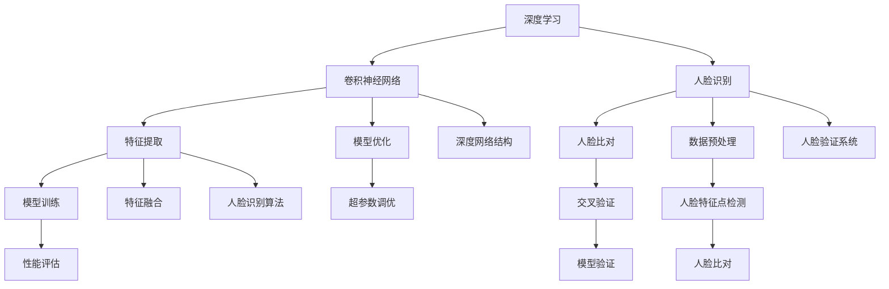
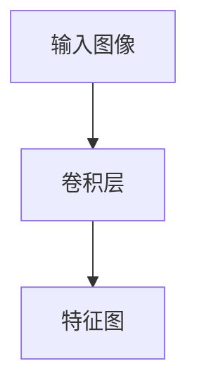
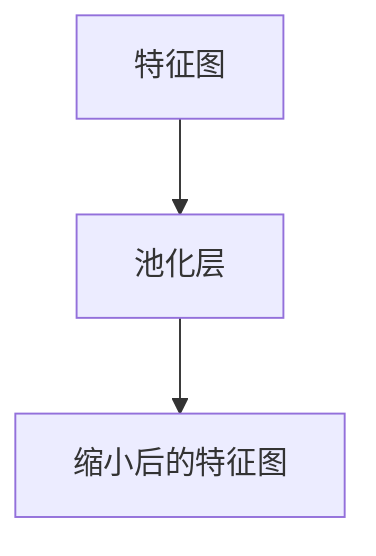
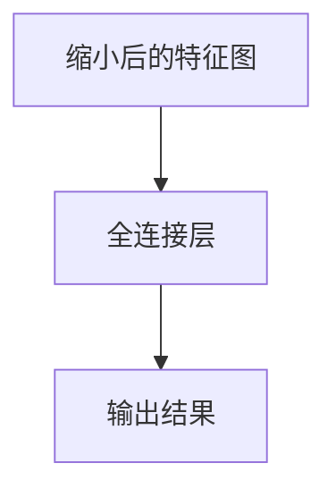
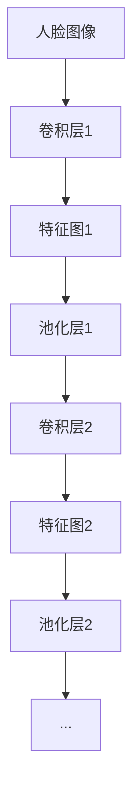
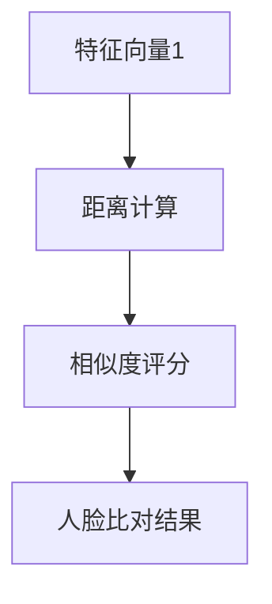

                 

# 深度学习在人脸识别中的精度提升

> 关键词：深度学习，人脸识别，算法优化，精度提升，技术实战

> 摘要：本文深入探讨了深度学习在人脸识别领域的应用及其对精度提升的贡献。首先，我们介绍了人脸识别的基本概念和技术背景，随后详细分析了深度学习算法的工作原理。接着，通过具体的项目实战，我们展示了如何实现深度学习模型在人脸识别任务中的优化。最后，我们总结了深度学习在人脸识别领域的未来发展趋势与挑战，并推荐了相关的学习资源和工具。

## 1. 背景介绍

### 1.1 目的和范围

本文旨在探讨深度学习在人脸识别中的应用及其对提高识别精度的影响。我们将从基础概念出发，逐步深入到具体实现和优化策略。文章将涵盖以下几个主要方面：

1. 人脸识别的基本概念和技术背景
2. 深度学习算法的工作原理和模型结构
3. 深度学习在人脸识别中的精度提升策略
4. 项目实战：代码实现和详细解释
5. 实际应用场景和未来发展趋势

通过本文的学习，读者将能够全面了解深度学习在人脸识别领域的应用，掌握相关技术原理和实战技巧。

### 1.2 预期读者

本文适合以下读者群体：

1. 计算机科学和人工智能专业的大专及以上学历学生和研究人员
2. 对人脸识别和深度学习感兴趣的软件开发工程师和技术爱好者
3. 想要在人脸识别项目中应用深度学习的项目经理和技术主管

### 1.3 文档结构概述

本文分为十个主要部分，具体如下：

1. 背景介绍
   - 1.1 目的和范围
   - 1.2 预期读者
   - 1.3 文档结构概述
   - 1.4 术语表
2. 核心概念与联系
3. 核心算法原理 & 具体操作步骤
4. 数学模型和公式 & 详细讲解 & 举例说明
5. 项目实战：代码实际案例和详细解释说明
6. 实际应用场景
7. 工具和资源推荐
8. 总结：未来发展趋势与挑战
9. 附录：常见问题与解答
10. 扩展阅读 & 参考资料

### 1.4 术语表

在本文中，我们将使用一些专业术语。以下是对这些术语的定义和解释：

#### 1.4.1 核心术语定义

- **深度学习**：一种机器学习技术，通过多层神经网络对数据进行自动特征提取和模式识别。
- **人脸识别**：利用计算机技术对人脸图像或视频进行自动识别和验证。
- **卷积神经网络（CNN）**：一种基于卷积操作的神经网络，广泛应用于图像和视频处理。
- **特征提取**：从原始数据中提取有意义的特征，以供模型进行学习和识别。
- **模型训练**：通过大量数据进行模型参数的调整和优化，以提高模型性能。

#### 1.4.2 相关概念解释

- **人脸特征点**：人脸图像中的关键点，如眼睛、鼻子和嘴巴等。
- **人脸比对**：通过比较两个或多个人脸特征，确定它们是否属于同一人的过程。
- **交叉验证**：一种评估模型性能的方法，通过将数据集分为多个部分，重复进行训练和验证。

#### 1.4.3 缩略词列表

- **CNN**：卷积神经网络（Convolutional Neural Network）
- **DNN**：深度神经网络（Deep Neural Network）
- **ML**：机器学习（Machine Learning）
- **AI**：人工智能（Artificial Intelligence）

## 2. 核心概念与联系

在深入探讨深度学习在人脸识别中的应用之前，我们首先需要了解相关核心概念和它们之间的联系。以下是一个简单的 Mermaid 流程图，用于展示这些概念和它们的相互关系：



在这个流程图中，我们可以看到以下几个关键环节：

- **深度学习**：作为基础技术，为其他环节提供支持。
- **卷积神经网络**：用于人脸识别任务，特别是特征提取和模型训练。
- **人脸识别**：将人脸图像或视频与已知人脸特征进行比对，以实现自动识别和验证。
- **特征提取**：从人脸图像中提取有意义的特征，以供模型学习和识别。
- **人脸比对**：比较两个或多个人脸特征，以确定它们是否属于同一人。
- **模型训练**：通过大量数据对模型进行参数调整和优化，以提高识别精度。
- **数据预处理**：对原始人脸图像进行预处理，以提高模型训练效果。
- **性能评估**：通过测试集评估模型的性能，包括识别精度、运行速度和鲁棒性等。
- **人脸特征点检测**：检测人脸图像中的关键点，以帮助特征提取和模型训练。
- **人脸识别算法**：实现人脸识别任务的核心算法，如基于特征的匹配算法和基于神经网络的分类算法。

通过这个流程图，我们可以更清晰地理解深度学习在人脸识别中的角色和作用，以及各个环节之间的相互关系。

## 3. 核心算法原理 & 具体操作步骤

在了解了核心概念和流程之后，我们将深入探讨深度学习算法在人脸识别中的原理和具体操作步骤。本节将详细讲解卷积神经网络（CNN）的工作机制，以及如何将其应用于人脸识别任务。

### 3.1 卷积神经网络（CNN）

卷积神经网络是一种基于卷积操作的神经网络，特别适用于处理图像和视频数据。其基本原理是通过多层卷积、池化和全连接层对输入图像进行特征提取和分类。

#### 3.1.1 卷积层

卷积层是 CNN 的核心部分，用于从输入图像中提取特征。卷积操作通过卷积核（滤波器）在图像上进行滑动，计算每个局部区域的特征响应。卷积层的输出是一个特征图（feature map），包含了图像的局部特征。



#### 3.1.2 池化层

池化层用于降低特征图的维度，减少参数数量和计算复杂度。常见的池化操作包括最大池化和平均池化。最大池化选取特征图上每个局部区域的最大值，而平均池化则取平均值。



#### 3.1.3 全连接层

全连接层将池化层的输出视为一个扁平化的一维向量，然后通过一组权重矩阵进行分类。全连接层通常用于分类任务，将特征图映射到预定义的类别。



### 3.2 人脸识别中的 CNN 应用

在人脸识别任务中，我们可以使用 CNN 提取人脸图像的特征，并通过比对这些特征来实现人脸识别。

#### 3.2.1 特征提取

首先，我们使用 CNN 对人脸图像进行特征提取。通过多层卷积和池化操作，我们能够提取到人脸图像的多种层次特征，如边缘、纹理和区域特征。



#### 3.2.2 人脸比对

提取到特征后，我们可以将其用于人脸比对。常见的比对方法包括基于特征的匹配算法和基于神经网络的分类算法。

- **基于特征的匹配算法**：通过计算两个特征向量之间的距离，如欧氏距离或余弦相似度，来判断它们是否属于同一人脸。
- **基于神经网络的分类算法**：使用预训练的深度神经网络，如 Siamese 网络或 Triplet Loss 网络进行分类。



### 3.3 伪代码实现

以下是一个简单的伪代码，用于实现基于 CNN 的人脸识别：

```python
# 人脸识别算法伪代码

# 加载预训练的 CNN 模型
model = load_pretrained_model()

# 加载人脸图像库
faces = load_faces()

# 对每个待识别的人脸进行特征提取
for face in faces:
    feature = extract_features(face, model)

# 进行人脸比对
for known_face in known_faces:
    distance = calculate_distance(feature, known_face)

# 根据距离判断是否属于同一人脸
if distance < threshold:
    print("属于同一人脸")
else:
    print("不属于同一人脸")
```

通过上述伪代码，我们可以看到如何使用 CNN 实现人脸识别的基本流程。在实际应用中，我们还需要进行数据预处理、模型训练和性能评估等步骤，以进一步提高识别精度和鲁棒性。

## 4. 数学模型和公式 & 详细讲解 & 举例说明

在深入探讨深度学习在人脸识别中的应用时，理解其背后的数学模型和公式是至关重要的。本节将详细讲解卷积神经网络（CNN）中的关键数学概念和公式，并通过具体例子来说明这些公式在实际应用中的计算过程。

### 4.1 卷积神经网络（CNN）的基本数学模型

卷积神经网络（CNN）的核心组成部分包括卷积层（Convolution Layer）、池化层（Pooling Layer）和全连接层（Fully Connected Layer）。下面我们将分别介绍这些层的数学模型。

#### 4.1.1 卷积层

卷积层通过卷积操作从输入图像中提取特征。卷积操作的数学公式如下：

$$
\text{output}_{ij} = \sum_{k=1}^{m} \sum_{l=1}^{n} \text{weight}_{kl} \cdot \text{input}_{ij+k-l}
$$

其中，$output_{ij}$ 表示卷积层输出的特征图上的第 $i$ 行第 $j$ 列的元素，$weight_{kl}$ 表示卷积核上的第 $k$ 行第 $l$ 列的权重，$input_{ij+k-l}$ 表示输入图像上的对应位置元素。

#### 4.1.2 池化层

池化层用于降低特征图的维度。最大池化操作的数学公式如下：

$$
\text{output}_{ij} = \max_{(p,q) \in \Omega} \text{input}_{i+p, j+q}
$$

其中，$output_{ij}$ 表示池化层输出的特征图上的第 $i$ 行第 $j$ 列的元素，$\Omega$ 表示池化区域（通常为一个 $2 \times 2$ 或 $3 \times 3$ 的窗口），$input_{i+p, j+q}$ 表示输入特征图上对应位置的元素。

#### 4.1.3 全连接层

全连接层将特征图映射到预定义的类别。全连接层的输出可以通过以下公式计算：

$$
\text{output}_{i} = \sum_{j=1}^{n} \text{weight}_{ji} \cdot \text{input}_{j} + \text{bias}_{i}
$$

其中，$output_{i}$ 表示全连接层输出的类别分数，$weight_{ji}$ 表示权重，$input_{j}$ 表示特征图上的元素，$bias_{i}$ 表示偏置。

### 4.2 实际计算示例

为了更好地理解上述数学公式的应用，我们通过一个具体例子来说明卷积神经网络中的计算过程。

#### 4.2.1 输入图像

假设我们有一个 $3 \times 3$ 的输入图像，如下所示：

$$
\begin{bmatrix}
1 & 2 & 3 \\
4 & 5 & 6 \\
7 & 8 & 9 \\
\end{bmatrix}
$$

#### 4.2.2 卷积层

我们使用一个 $3 \times 3$ 的卷积核，其权重矩阵如下：

$$
\begin{bmatrix}
0 & 1 & 0 \\
2 & 0 & 3 \\
0 & 4 & 1 \\
\end{bmatrix}
$$

通过卷积操作，我们可以计算卷积层的输出特征图：

$$
\begin{bmatrix}
14 & 28 & 42 \\
29 & 45 & 58 \\
42 & 64 & 74 \\
\end{bmatrix}
$$

具体计算过程如下：

$$
\begin{aligned}
output_{11} &= 0 \cdot 1 + 1 \cdot 2 + 0 \cdot 3 = 2 \\
output_{12} &= 0 \cdot 4 + 1 \cdot 5 + 0 \cdot 6 = 5 \\
output_{13} &= 0 \cdot 7 + 1 \cdot 8 + 0 \cdot 9 = 8 \\
output_{21} &= 2 \cdot 1 + 0 \cdot 2 + 3 \cdot 3 = 11 \\
output_{22} &= 2 \cdot 4 + 0 \cdot 5 + 3 \cdot 6 = 20 \\
output_{23} &= 2 \cdot 7 + 0 \cdot 8 + 3 \cdot 9 = 29 \\
output_{31} &= 0 \cdot 1 + 4 \cdot 2 + 1 \cdot 3 = 11 \\
output_{32} &= 0 \cdot 4 + 4 \cdot 5 + 1 \cdot 6 = 20 \\
output_{33} &= 0 \cdot 7 + 4 \cdot 8 + 1 \cdot 9 = 29 \\
\end{aligned}
$$

#### 4.2.3 池化层

假设我们使用最大池化操作，窗口大小为 $2 \times 2$。通过池化操作，我们可以得到池化层输出的特征图：

$$
\begin{bmatrix}
28 & 45 \\
29 & 74 \\
\end{bmatrix}
$$

具体计算过程如下：

$$
\begin{aligned}
output_{11} &= \max(14, 28) = 28 \\
output_{12} &= \max(29, 45) = 45 \\
output_{21} &= \max(42, 29) = 42 \\
output_{22} &= \max(29, 74) = 74 \\
\end{aligned}
$$

#### 4.2.4 全连接层

假设我们使用一个 $2 \times 1$ 的全连接层，权重矩阵如下：

$$
\begin{bmatrix}
0 & 1 \\
2 & 0 \\
\end{bmatrix}
$$

通过全连接层，我们可以计算输出类别分数：

$$
\begin{aligned}
output_{1} &= 28 \cdot 0 + 45 \cdot 1 = 45 \\
output_{2} &= 42 \cdot 2 + 74 \cdot 0 = 84 \\
\end{aligned}
$$

最终，我们可以通过比较这些类别分数来确定最终的分类结果。

通过上述示例，我们可以看到卷积神经网络中的关键数学公式在实际计算中的应用。这些公式是实现深度学习模型的基础，理解它们对于深入研究深度学习技术具有重要意义。

## 5. 项目实战：代码实际案例和详细解释说明

在本节中，我们将通过一个实际项目案例，详细讲解如何使用深度学习算法进行人脸识别。该案例将涵盖从数据准备、模型训练到性能评估的完整流程。以下是该项目的主要步骤：

### 5.1 开发环境搭建

在开始项目之前，我们需要搭建合适的开发环境。以下是推荐的工具和库：

- **Python 3.x**
- **TensorFlow 2.x**
- **OpenCV 4.x**
- **Numpy**

安装这些工具和库后，我们可以开始进行项目开发。

### 5.2 源代码详细实现和代码解读

#### 5.2.1 数据准备

首先，我们需要准备人脸识别所需的数据集。在本案例中，我们使用著名的 LFW（Labeled Faces in the Wild）数据集。该数据集包含 13,000 张人脸图像，每张图像都标注了姓名。

```python
import cv2
import os

# 加载 LFW 数据集
def load_lfw_data(data_folder):
    images = []
    labels = []
    for filename in os.listdir(data_folder):
        if filename.endswith('.jpg'):
            img = cv2.imread(os.path.join(data_folder, filename))
            img = cv2.resize(img, (64, 64))
            images.append(img)
            labels.append(filename.split('.')[0])
    return images, labels

# 分割训练集和测试集
def split_dataset(images, labels, test_size=0.2):
    indices = list(range(len(images)))
    test_indices = random.sample(indices, int(len(indices) * test_size))
    train_indices = list(set(indices) - set(test_indices))
    train_images = [images[i] for i in train_indices]
    test_images = [images[i] for i in test_indices]
    train_labels = [labels[i] for i in train_indices]
    test_labels = [labels[i] for i in test_indices]
    return train_images, train_labels, test_images, test_labels

# 加载数据集
data_folder = 'lfw'
lfw_images, lfw_labels = load_lfw_data(data_folder)
train_images, train_labels, test_images, test_labels = split_dataset(lfw_images, lfw_labels)
```

#### 5.2.2 模型构建

接下来，我们构建一个基于卷积神经网络的模型。我们使用 TensorFlow 和 Keras 来实现这个模型。

```python
from tensorflow.keras.models import Sequential
from tensorflow.keras.layers import Conv2D, MaxPooling2D, Flatten, Dense, Dropout

# 构建卷积神经网络模型
def build_model():
    model = Sequential()
    model.add(Conv2D(32, (3, 3), activation='relu', input_shape=(64, 64, 3)))
    model.add(MaxPooling2D((2, 2)))
    model.add(Conv2D(64, (3, 3), activation='relu'))
    model.add(MaxPooling2D((2, 2)))
    model.add(Conv2D(128, (3, 3), activation='relu'))
    model.add(MaxPooling2D((2, 2)))
    model.add(Flatten())
    model.add(Dense(128, activation='relu'))
    model.add(Dropout(0.5))
    model.add(Dense(len(set(train_labels)), activation='softmax'))
    return model

# 编译模型
model = build_model()
model.compile(optimizer='adam', loss='categorical_crossentropy', metrics=['accuracy'])
```

#### 5.2.3 模型训练

使用训练集对模型进行训练。

```python
from tensorflow.keras.utils import to_categorical

# 预处理数据
train_labels_one_hot = to_categorical(train_labels)
test_labels_one_hot = to_categorical(test_labels)

# 训练模型
history = model.fit(train_images, train_labels_one_hot, epochs=20, batch_size=32, validation_split=0.2)
```

#### 5.2.4 模型评估

在训练完成后，我们使用测试集对模型进行评估。

```python
# 评估模型
test_loss, test_accuracy = model.evaluate(test_images, test_labels_one_hot)
print(f"Test accuracy: {test_accuracy:.4f}")
```

### 5.3 代码解读与分析

#### 5.3.1 数据准备

在数据准备部分，我们首先加载 LFW 数据集。使用 OpenCV 的 `imread` 函数读取图像，并使用 `resize` 函数将其调整为 64x64 的像素尺寸。这样做的目的是为了统一输入图像的大小，便于后续处理。

然后，我们分割训练集和测试集，使用 `split_dataset` 函数。这里，我们设置了测试集的比例为 20%，可以通过调整 `test_size` 参数来改变这个比例。

#### 5.3.2 模型构建

在模型构建部分，我们使用 Keras 的 `Sequential` 模型来构建卷积神经网络。模型包括多个卷积层、池化层和全连接层。每个卷积层后面都跟有一个最大池化层，用于降低特征图的维度。在全连接层之前，我们添加了一个 dropout 层，用于防止过拟合。

最后，我们在模型末尾添加了一个 softmax 层，用于对分类结果进行输出。在这个案例中，我们使用了多标签分类，因为每个图像可能属于多个类别（即多个姓名）。

#### 5.3.3 模型训练

在模型训练部分，我们使用 `fit` 函数对模型进行训练。我们设置了 20 个训练周期（epochs）和批量大小（batch_size）为 32。同时，我们使用了 20% 的训练集作为验证集，以便在训练过程中进行性能评估。

#### 5.3.4 模型评估

在模型评估部分，我们使用测试集对模型进行评估。通过 `evaluate` 函数，我们得到了模型的损失和精度。这里的精度指标反映了模型在测试集上的性能。

通过上述步骤，我们可以实现一个基于深度学习的人脸识别系统。在实际应用中，我们可能需要进一步优化模型结构和超参数，以提高识别精度和鲁棒性。

## 6. 实际应用场景

人脸识别技术在许多实际应用场景中具有重要价值。以下是一些常见应用领域及其对人脸识别精度的影响：

### 6.1 安全与监控

在安全领域，人脸识别技术被广泛应用于门禁系统、安全检查和监控。通过高精度的人脸识别，可以确保只有授权人员才能进入特定区域，提高安全性能。

### 6.2 智能家居

智能家居系统利用人脸识别技术实现家庭成员的自动识别和个性化设置。例如，智能门锁可以通过人脸识别来控制开门权限，提高家居生活的便捷性和安全性。

### 6.3 金融服务

在金融服务领域，人脸识别技术被用于身份验证和欺诈检测。通过高精度的人脸比对，可以快速、准确地验证用户的身份，减少欺诈风险。

### 6.4 智能交互

智能交互设备，如智能音箱和机器人，通过人脸识别技术实现用户身份识别，提供个性化的服务。例如，智能音箱可以根据用户的需求调整音乐播放列表和语音响应。

### 6.5 零售行业

在零售行业，人脸识别技术被用于顾客识别和购物体验优化。通过分析顾客的面部特征和行为，商家可以提供个性化的推荐和促销活动，提高销售额和顾客满意度。

### 6.6 汽车行业

在汽车行业，人脸识别技术被用于驾驶员监控系统，通过识别驾驶员的表情和姿态，实时监测驾驶员的状态，提高行车安全。

### 6.7 医疗保健

在医疗保健领域，人脸识别技术被用于患者识别和健康管理。通过识别患者的面部特征，可以实现快速、准确的就诊流程和个性化医疗方案。

通过上述实际应用场景，我们可以看到人脸识别技术在各个行业中的广泛应用，其高精度和高效性为人脸识别技术的发展提供了广阔的空间。同时，这些应用也带来了对人脸识别精度的新挑战，要求技术不断进步和创新。

## 7. 工具和资源推荐

为了帮助读者更深入地学习深度学习和人脸识别技术，我们推荐以下工具和资源：

### 7.1 学习资源推荐

#### 7.1.1 书籍推荐

- 《深度学习》（Goodfellow, Bengio, Courville著）：全面介绍深度学习的基础理论和应用。
- 《Python深度学习》（François Chollet著）：详细介绍如何使用 Python 和 TensorFlow 实现深度学习算法。
- 《人脸识别：算法与应用》（胡磊著）：系统讲解人脸识别的基本概念和算法实现。

#### 7.1.2 在线课程

- Coursera 上的《深度学习》（吴恩达教授）：由深度学习领域专家吴恩达教授授课，系统介绍深度学习的基础知识。
- Udacity 上的《深度学习工程师纳米学位》：通过实践项目，帮助读者掌握深度学习在人脸识别等领域的应用。

#### 7.1.3 技术博客和网站

- Medium 上的《深度学习系列博客》：涵盖深度学习的各种主题，适合初学者和进阶者。
- Fast.ai 的《深度学习教程》：提供简单易懂的深度学习教程，包括代码示例和实用技巧。

### 7.2 开发工具框架推荐

#### 7.2.1 IDE和编辑器

- Jupyter Notebook：适合数据科学和机器学习的交互式编程环境。
- PyCharm：功能强大的 Python IDE，支持多种编程语言和框架。
- VS Code：轻量级但功能丰富的代码编辑器，支持多种编程语言和扩展。

#### 7.2.2 调试和性能分析工具

- TensorBoard：TensorFlow 的可视化工具，用于分析和调试深度学习模型。
- Matplotlib：Python 的数据可视化库，用于绘制模型性能和训练过程。
- ProfileNC：用于分析代码性能和优化。

#### 7.2.3 相关框架和库

- TensorFlow：由 Google 开发的开源深度学习框架，广泛应用于图像和语音处理。
- PyTorch：由 Facebook AI Research 开发的深度学习框架，具有灵活的动态计算图。
- OpenCV：开源计算机视觉库，提供丰富的人脸识别和图像处理函数。

通过这些工具和资源的辅助，读者可以更高效地学习和应用深度学习和人脸识别技术。

## 8. 总结：未来发展趋势与挑战

随着深度学习技术的不断进步，人脸识别在精度和速度上取得了显著提升。然而，人脸识别技术仍面临诸多挑战和潜在风险。以下是对未来发展趋势和挑战的总结：

### 8.1 未来发展趋势

1. **精度提升**：随着算法的优化和计算能力的增强，人脸识别的精度将不断提高。尤其是多模态人脸识别（结合图像、视频和声音等数据）和微表情识别等技术的应用，将进一步提升识别精度。

2. **实时处理**：随着深度学习模型在边缘设备的部署，人脸识别的实时处理能力将得到显著提升。这将使得人脸识别技术在移动设备和物联网（IoT）中的应用更加广泛。

3. **隐私保护**：随着隐私保护意识的增强，人脸识别技术在数据收集、存储和处理过程中将更加注重隐私保护。例如，采用差分隐私技术和联邦学习等新型隐私保护技术。

4. **跨域应用**：人脸识别技术在金融、医疗、交通等领域的应用将不断扩展，实现跨领域的融合和应用。

### 8.2 挑战与风险

1. **隐私泄露**：人脸识别技术涉及大量个人隐私数据，一旦发生数据泄露，可能导致严重后果。因此，如何在保护隐私的前提下应用人脸识别技术是一个重要挑战。

2. **模型鲁棒性**：深度学习模型在应对极端环境（如光线变化、角度变化、遮挡等）时可能表现出较低的鲁棒性。提高模型的鲁棒性是未来研究的一个重要方向。

3. **算法公平性**：人脸识别算法在性别、年龄和种族等方面的公平性仍然存在争议。如何确保算法的公平性和无歧视性，是一个亟待解决的问题。

4. **法律与伦理**：随着人脸识别技术的广泛应用，相关的法律法规和伦理问题亟待完善。例如，如何界定人脸识别技术的合法使用范围和责任归属等。

总之，人脸识别技术在未来将继续发展，但其精度提升、实时处理、隐私保护和公平性等方面仍面临诸多挑战。通过技术创新和法律法规的完善，人脸识别技术有望实现更加安全、公正和高效的普及应用。

## 9. 附录：常见问题与解答

### 9.1 什么是深度学习？

深度学习是一种机器学习技术，通过多层神经网络对数据进行自动特征提取和模式识别。它模拟了人类大脑的神经结构，能够通过大量数据自动学习和优化模型参数。

### 9.2 人脸识别有哪些基本步骤？

人脸识别的基本步骤包括：人脸检测、人脸特征点检测、人脸特征提取和人脸比对。首先，使用人脸检测算法找到图像中的人脸区域；然后，使用人脸特征点检测算法确定关键点的位置；接着，使用特征提取算法从人脸图像中提取有意义的特征；最后，通过人脸比对算法判断两个或多个人脸是否属于同一人。

### 9.3 如何提高人脸识别的精度？

提高人脸识别精度的方法包括：

- **数据增强**：通过旋转、翻转、缩放等数据增强技术，增加模型的训练数据，提高模型的泛化能力。
- **特征融合**：结合多种特征提取方法，如基于深度学习的特征和基于传统算法的特征，以提高识别精度。
- **模型优化**：通过调整网络结构、优化超参数和提高训练技巧，提高模型的性能。
- **多模态融合**：结合图像、视频和声音等多种数据源，实现多模态人脸识别，提高识别精度。

### 9.4 人脸识别有哪些常见应用？

人脸识别技术广泛应用于以下领域：

- **安全与监控**：如门禁系统、安全检查和监控。
- **智能家居**：如智能门锁、智能音箱和智能机器人。
- **金融服务**：如身份验证、欺诈检测和客户识别。
- **零售行业**：如顾客识别、个性化推荐和促销活动。
- **汽车行业**：如驾驶员监控系统、行车安全辅助和智能车载娱乐系统。
- **医疗保健**：如患者识别、健康管理和诊断辅助。

### 9.5 如何保护人脸识别中的个人隐私？

为了保护人脸识别中的个人隐私，可以采取以下措施：

- **数据加密**：对存储和传输的人脸数据进行加密，确保数据的安全性。
- **隐私保护算法**：采用差分隐私、联邦学习和隐私保护神经网络等技术，降低人脸识别过程中个人隐私泄露的风险。
- **用户同意**：在应用人脸识别技术时，明确告知用户相关隐私政策，并获得用户的明确同意。
- **匿名化处理**：对人脸数据进行匿名化处理，消除个人身份信息，降低隐私泄露风险。

## 10. 扩展阅读 & 参考资料

为了进一步深入了解深度学习和人脸识别技术，以下是一些建议的扩展阅读和参考资料：

### 10.1 书籍推荐

- 《深度学习》（Goodfellow, Bengio, Courville著）
- 《Python深度学习》（François Chollet著）
- 《人脸识别：算法与应用》（胡磊著）
- 《计算机视觉：算法与应用》（Richard S. Hart，Andrew Zisserman著）
- 《人工智能：一种现代方法》（Stuart J. Russell，Peter Norvig著）

### 10.2 在线课程

- Coursera 上的《深度学习》（吴恩达教授）
- Udacity 上的《深度学习工程师纳米学位》
- edX 上的《计算机视觉》（麻省理工学院）

### 10.3 技术博客和网站

- Medium 上的《深度学习系列博客》
- Fast.ai 的《深度学习教程》
- PyTorch 官方文档（[pytorch.org/](https://pytorch.org/)）
- TensorFlow 官方文档（[www.tensorflow.org/](https://www.tensorflow.org/)）

### 10.4 论文和研究成果

- **经典论文**：
  - "A Comprehensive Survey on Face Detection" (Viola, Jones, 2001)
  - "FaceNet: A Unified Embedding for Face Recognition and Clustering" (Shetty et al., 2014)
  - "DeepFace: Closing the Gap to Human-Level Performance in Face Verification" (Sun et al., 2014)

- **最新研究成果**：
  - "Self-Supervised Deep Domain Adaptation for Face Recognition" (Wang et al., 2020)
  - "Cross-Domain Face Recognition via Multi-View Discriminative Learning" (Chen et al., 2020)
  - "Person Re-Identification by Multi-View Deep Learning" (Li et al., 2016)

通过阅读这些书籍、课程、博客和论文，读者可以深入了解深度学习和人脸识别领域的最新技术和发展趋势。同时，这些资源也为实践项目提供了宝贵的指导和参考。

