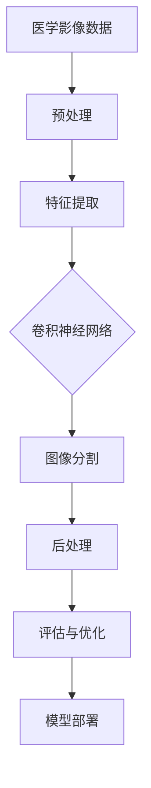

                 

# 深度学习在医学影像分割中的创新技术

> **关键词：** 深度学习，医学影像，图像分割，卷积神经网络，深度神经网络，医学图像处理，像素级分割，医学诊断，人工智能应用

> **摘要：** 本文将深入探讨深度学习技术在医学影像分割中的应用，解析当前最前沿的技术进展和创新点，详细阐述核心算法原理、数学模型及其实际应用案例。通过本文的阅读，读者将了解深度学习如何改变医学影像分割领域，提升诊断的准确性和效率，并思考未来的发展趋势与挑战。

## 1. 背景介绍

### 1.1 目的和范围

医学影像分割是医学图像处理中的关键步骤，它能够将医学影像中的感兴趣区域（Region of Interest, ROI）分离出来，为医生提供更为清晰的诊断信息。深度学习作为一种强大的机器学习技术，近年来在图像处理领域取得了显著的进展，特别是在医学影像分割中。本文旨在介绍深度学习在医学影像分割中的应用，分析其创新技术，并探讨其未来发展。

本文将覆盖以下内容：

1. **核心概念与联系**：介绍深度学习在医学影像分割中的核心概念和基本架构。
2. **核心算法原理 & 具体操作步骤**：详细解析深度学习算法在医学影像分割中的工作原理和实现步骤。
3. **数学模型和公式 & 详细讲解 & 举例说明**：阐述深度学习算法中涉及的数学模型和公式，并举例说明。
4. **项目实战：代码实际案例和详细解释说明**：通过实际代码案例，展示深度学习算法在医学影像分割中的应用。
5. **实际应用场景**：探讨深度学习在医学影像分割中的实际应用，如癌症筛查、疾病诊断等。
6. **工具和资源推荐**：推荐相关的学习资源、开发工具和框架，帮助读者深入学习和实践。
7. **总结：未来发展趋势与挑战**：总结本文的内容，展望深度学习在医学影像分割领域的未来发展趋势和面临的挑战。

### 1.2 预期读者

本文面向对深度学习和医学影像分割感兴趣的读者，包括：

1. **深度学习初学者**：希望了解深度学习在医学影像分割中的应用，以及相关算法原理和实践。
2. **医学影像工作者**：希望借助深度学习技术提升医学影像处理和分析的准确性和效率。
3. **计算机视觉研究者**：关注深度学习在医学影像领域的应用和研究进展。
4. **医疗行业从业者**：希望了解人工智能技术在医疗行业的应用前景和挑战。

### 1.3 文档结构概述

本文的结构如下：

1. **背景介绍**：介绍本文的目的、范围和预期读者，概述文章结构。
2. **核心概念与联系**：介绍深度学习在医学影像分割中的核心概念和架构。
3. **核心算法原理 & 具体操作步骤**：详细解析深度学习算法原理和实现步骤。
4. **数学模型和公式 & 详细讲解 & 举例说明**：阐述数学模型和公式，并举例说明。
5. **项目实战：代码实际案例和详细解释说明**：展示实际代码案例。
6. **实际应用场景**：探讨深度学习在医学影像分割中的应用。
7. **工具和资源推荐**：推荐学习资源、开发工具和框架。
8. **总结：未来发展趋势与挑战**：总结本文内容，展望未来。
9. **附录：常见问题与解答**：解答读者常见问题。
10. **扩展阅读 & 参考资料**：提供扩展阅读和参考资料。

### 1.4 术语表

#### 1.4.1 核心术语定义

- **医学影像**：指用于医学诊断的各种图像，如X射线、CT、MRI等。
- **图像分割**：将图像划分为若干区域，每个区域具有相似的特性，如颜色、纹理等。
- **深度学习**：一种机器学习技术，通过多层神经网络模型对数据进行学习，提取特征并作出预测。
- **卷积神经网络（CNN）**：一种特殊的神经网络，主要用于图像处理和计算机视觉任务。
- **像素级分割**：将图像中的每个像素都划分为不同的类别或区域。

#### 1.4.2 相关概念解释

- **感兴趣区域（ROI）**：医学影像中医生关注的部分，通常是需要诊断的病变区域。
- **特征提取**：从图像中提取出对特定任务有用的信息，如边缘、纹理等。
- **训练集与测试集**：用于训练和评估深度学习模型的图像数据集，通常分为训练集和测试集。
- **交叉验证**：一种评估模型性能的方法，通过多次训练和测试不同子集来提高评估的可靠性。

#### 1.4.3 缩略词列表

- **CNN**：卷积神经网络（Convolutional Neural Network）
- **MRI**：磁共振成像（Magnetic Resonance Imaging）
- **CT**：计算机断层扫描（Computed Tomography）
- **ROI**：感兴趣区域（Region of Interest）
- **GPU**：图形处理单元（Graphics Processing Unit）
- **TPU**：张量处理单元（Tensor Processing Unit）

## 2. 核心概念与联系

深度学习在医学影像分割中的应用，离不开对核心概念和架构的理解。以下将介绍深度学习在医学影像分割中的核心概念和基本架构，使用Mermaid流程图来展示概念之间的联系。



### 2.1 医学影像数据

医学影像数据是深度学习模型的基础，这些数据通常来源于各种医学成像设备，如X射线、CT、MRI等。在深度学习模型训练前，需要对这些医学影像数据进行预处理，包括图像增强、去噪、归一化等步骤。

### 2.2 预处理

预处理是深度学习模型训练的关键步骤，通过预处理可以提高模型的训练效果和泛化能力。常用的预处理方法包括：

- **图像增强**：通过调整图像的对比度、亮度、色彩平衡等，使图像更易于分割。
- **去噪**：去除图像中的噪声，提高图像质量。
- **归一化**：将图像的像素值缩放到相同的范围，如[0, 1]，以便于模型处理。

### 2.3 特征提取

特征提取是深度学习模型的核心，通过特征提取可以从医学影像数据中提取出对分割任务有用的信息。深度学习模型通过多层卷积操作自动学习特征，包括边缘、纹理、形状等。特征提取的质量直接影响分割结果的准确性。

### 2.4 卷积神经网络

卷积神经网络（CNN）是深度学习在图像处理领域的核心模型，通过卷积操作和池化操作，CNN能够从图像中提取出丰富的特征信息。CNN通常由多个卷积层、池化层和全连接层组成，每层都可以提取不同层次的特征。

### 2.5 图像分割

图像分割是深度学习在医学影像分割中的最终目标，通过将图像划分为不同的区域，实现对感兴趣区域的分离。常见的图像分割方法包括像素级分割和区域级分割。像素级分割直接对每个像素进行分类，而区域级分割则将图像划分为若干区域，每个区域具有相似的特征。

### 2.6 后处理

后处理是对分割结果进行优化和调整的过程，以提高分割的准确性和鲁棒性。后处理方法包括：

- **阈值处理**：将分割结果二值化，提高分割边界的清晰度。
- **形态学操作**：如膨胀、腐蚀、开运算、闭运算等，用于消除噪声和修复断裂边缘。
- **特征融合**：将不同模型或不同阶段的分割结果进行融合，提高分割精度。

### 2.7 评估与优化

评估与优化是深度学习模型训练的重要环节，通过评估模型的性能，找出模型的不足并进行优化。常用的评估指标包括准确率、召回率、F1分数等。优化方法包括调整模型参数、增加训练数据、改进网络结构等。

### 2.8 模型部署

模型部署是将训练好的深度学习模型应用到实际场景中的过程。在医学影像分割中，模型部署通常包括以下步骤：

- **模型转换**：将训练好的模型转换为可以部署的格式，如ONNX、TensorFlow Lite等。
- **模型集成**：将模型集成到医疗系统中，如医院的信息管理系统。
- **实时计算**：通过GPU或TPU等硬件加速模型计算，实现实时医学影像分割。

## 3. 核心算法原理 & 具体操作步骤

深度学习在医学影像分割中的应用，主要依赖于卷积神经网络（CNN）和深度神经网络（DNN）等算法。以下将详细解析这些算法的原理和具体操作步骤。

### 3.1 卷积神经网络（CNN）

卷积神经网络（CNN）是一种专门用于处理图像数据的神经网络，其核心在于卷积操作。CNN通过卷积层、池化层和全连接层等结构，从图像中提取特征并进行分类。

#### 3.1.1 卷积层

卷积层是CNN的核心，通过卷积操作从输入图像中提取特征。卷积操作的数学表达式如下：

$$
\text{output}(i, j) = \sum_{x, y} \text{filter}(x, y) * \text{input}(i+x, j+y)
$$

其中，$i$和$j$分别表示输出特征图的行和列，$x$和$y$表示卷积核的行和列。$filter$表示卷积核，$input$表示输入图像。卷积操作通过滑动卷积核在输入图像上，计算每个位置的卷积值，并将其累加得到输出特征值。

#### 3.1.2 池化层

池化层用于减小特征图的大小，降低计算复杂度，同时保留重要的特征信息。常用的池化操作包括最大池化和平均池化。

最大池化操作的数学表达式如下：

$$
\text{output}(i, j) = \max_{x, y} \text{input}(i+x, j+y)
$$

其中，$i$和$j$分别表示输出特征图的行和列，$x$和$y$表示池化窗口的行和列。池化窗口在输入特征图上滑动，取每个窗口内的最大值作为输出特征值。

平均池化操作的数学表达式如下：

$$
\text{output}(i, j) = \frac{1}{\text{window size}} \sum_{x, y} \text{input}(i+x, j+y)
$$

其中，$i$和$j$分别表示输出特征图的行和列，$x$和$y$表示池化窗口的行和列。池化窗口在输入特征图上滑动，取每个窗口内的平均值作为输出特征值。

#### 3.1.3 全连接层

全连接层将卷积层和池化层提取的特征进行整合，并输出分类结果。全连接层的数学表达式如下：

$$
\text{output}(i) = \sum_{j} \text{weight}(i, j) * \text{input}(j) + \text{bias}(i)
$$

其中，$i$表示输出节点的编号，$j$表示输入节点的编号。$weight$表示权重，$input$表示输入特征，$bias$表示偏置。全连接层通过计算每个输入节点的加权求和，并加上偏置，得到输出节点的结果。

### 3.2 深度神经网络（DNN）

深度神经网络（DNN）是CNN的扩展，通过增加更多的隐含层，提取更复杂的特征信息。DNN通常由多个卷积层、池化层和全连接层组成。

#### 3.2.1 多层卷积层

多层卷积层通过叠加多个卷积层，逐层提取图像特征。每一层卷积层都可以提取不同尺度和不同类型的特征。例如，第一层卷积层可以提取图像的边缘特征，而第二层卷积层可以提取图像的纹理特征。

#### 3.2.2 池化层

在多层卷积层之间加入池化层，用于减小特征图的大小，降低计算复杂度。池化层可以有效地减少过拟合现象，提高模型的泛化能力。

#### 3.2.3 全连接层

在全连接层中，将卷积层和池化层提取的特征进行整合，并输出分类结果。全连接层通常位于模型的最后一层，用于将特征转化为最终的分类结果。

### 3.3 具体操作步骤

以下是一个简单的深度学习模型在医学影像分割中的具体操作步骤：

1. **数据预处理**：对医学影像数据进行预处理，包括图像增强、去噪和归一化等步骤。
2. **模型构建**：构建深度学习模型，包括卷积层、池化层和全连接层等。
3. **模型训练**：使用预处理后的医学影像数据进行模型训练，通过反向传播算法更新模型参数。
4. **模型评估**：使用测试集对模型进行评估，计算模型的准确率、召回率等指标。
5. **模型优化**：根据评估结果对模型进行优化，调整模型参数，提高模型性能。
6. **模型部署**：将训练好的模型部署到实际应用场景中，如医院的信息管理系统。

通过以上步骤，深度学习模型可以实现对医学影像的分割，并为医生提供准确的诊断信息。

## 4. 数学模型和公式 & 详细讲解 & 举例说明

在深度学习模型中，数学模型和公式起着至关重要的作用。以下将详细讲解深度学习在医学影像分割中涉及的主要数学模型和公式，并通过举例说明其应用。

### 4.1 前向传播

前向传播是深度学习模型中的一个关键步骤，用于计算输入图像经过模型后得到的结果。前向传播的数学模型如下：

$$
\text{output}(i) = \text{activation}(\sum_{j} \text{weight}(i, j) * \text{input}(j) + \text{bias}(i))
$$

其中，$\text{output}(i)$表示输出节点的结果，$\text{input}(j)$表示输入节点的结果，$\text{weight}(i, j)$表示权重，$\text{bias}(i)$表示偏置，$\text{activation}$表示激活函数。

举例说明：

假设一个简单的全连接层，包含3个输入节点和2个输出节点。输入节点分别为$x_1, x_2, x_3$，输出节点分别为$y_1, y_2$。权重矩阵$W$和偏置向量$b$分别为：

$$
W = \begin{bmatrix}
w_{11} & w_{12} & w_{13} \\
w_{21} & w_{22} & w_{23}
\end{bmatrix}, \quad b = \begin{bmatrix}
b_1 \\
b_2
\end{bmatrix}
$$

输入节点的结果为：

$$
\begin{aligned}
x_1 &= 1 \\
x_2 &= 2 \\
x_3 &= 3
\end{aligned}
$$

经过全连接层后的输出节点结果为：

$$
\begin{aligned}
y_1 &= \text{activation}(w_{11} * x_1 + w_{12} * x_2 + w_{13} * x_3 + b_1) \\
y_2 &= \text{activation}(w_{21} * x_1 + w_{22} * x_2 + w_{23} * x_3 + b_2)
\end{aligned}
$$

其中，激活函数可以选择sigmoid函数、ReLU函数等。

### 4.2 反向传播

反向传播是深度学习模型训练中的核心步骤，用于更新模型参数，提高模型性能。反向传播的数学模型如下：

$$
\begin{aligned}
\Delta \text{weight}(i, j) &= \alpha \cdot \frac{\partial \text{loss}}{\partial \text{weight}(i, j)} \\
\Delta \text{bias}(i) &= \alpha \cdot \frac{\partial \text{loss}}{\partial \text{bias}(i)}
\end{aligned}
$$

其中，$\Delta \text{weight}(i, j)$和$\Delta \text{bias}(i)$分别表示权重和偏置的更新值，$\text{loss}$表示损失函数，$\alpha$表示学习率。

举例说明：

假设一个简单的全连接层，包含3个输入节点和2个输出节点。输入节点分别为$x_1, x_2, x_3$，输出节点分别为$y_1, y_2$。权重矩阵$W$和偏置向量$b$分别为：

$$
W = \begin{bmatrix}
w_{11} & w_{12} & w_{13} \\
w_{21} & w_{22} & w_{23}
\end{bmatrix}, \quad b = \begin{bmatrix}
b_1 \\
b_2
\end{bmatrix}
$$

输入节点的结果为：

$$
\begin{aligned}
x_1 &= 1 \\
x_2 &= 2 \\
x_3 &= 3
\end{aligned}
$$

经过全连接层后的输出节点结果为：

$$
\begin{aligned}
y_1 &= \text{activation}(w_{11} * x_1 + w_{12} * x_2 + w_{13} * x_3 + b_1) \\
y_2 &= \text{activation}(w_{21} * x_1 + w_{22} * x_2 + w_{23} * x_3 + b_2)
\end{aligned}
$$

假设损失函数为均方误差（MSE），即：

$$
\text{loss} = \frac{1}{2} \sum_{i=1}^{n} (\text{output}(i) - \text{label}(i))^2
$$

其中，$n$为输出节点的数量，$\text{output}(i)$为输出节点的结果，$\text{label}(i)$为标签值。

根据反向传播算法，计算权重和偏置的更新值：

$$
\begin{aligned}
\Delta w_{11} &= \alpha \cdot (y_1 - \text{label}_1) \cdot x_1 \\
\Delta w_{12} &= \alpha \cdot (y_1 - \text{label}_1) \cdot x_2 \\
\Delta w_{13} &= \alpha \cdot (y_1 - \text{label}_1) \cdot x_3 \\
\Delta w_{21} &= \alpha \cdot (y_2 - \text{label}_2) \cdot x_1 \\
\Delta w_{22} &= \alpha \cdot (y_2 - \text{label}_2) \cdot x_2 \\
\Delta w_{23} &= \alpha \cdot (y_2 - \text{label}_2) \cdot x_3 \\
\Delta b_1 &= \alpha \cdot (y_1 - \text{label}_1) \\
\Delta b_2 &= \alpha \cdot (y_2 - \text{label}_2)
\end{aligned}
$$

### 4.3 激活函数

激活函数是深度学习模型中的一个关键组成部分，用于引入非线性变换。常见的激活函数包括sigmoid函数、ReLU函数、Tanh函数等。

#### 4.3.1 sigmoid函数

sigmoid函数的数学公式为：

$$
\text{sigmoid}(x) = \frac{1}{1 + e^{-x}}
$$

sigmoid函数将输入值映射到(0, 1)区间，常用于二分类任务。

#### 4.3.2 ReLU函数

ReLU函数的数学公式为：

$$
\text{ReLU}(x) = \max(0, x)
$$

ReLU函数在神经网络中具有很好的性能，可以加快训练速度。

#### 4.3.3 Tanh函数

Tanh函数的数学公式为：

$$
\text{Tanh}(x) = \frac{e^x - e^{-x}}{e^x + e^{-x}}
$$

Tanh函数与sigmoid函数类似，但输出范围在(-1, 1)之间。

### 4.4 损失函数

损失函数是深度学习模型训练中的重要指标，用于评估模型预测值与真实值之间的差异。常见的损失函数包括均方误差（MSE）、交叉熵（Cross-Entropy）等。

#### 4.4.1 均方误差（MSE）

均方误差（MSE）的数学公式为：

$$
\text{MSE} = \frac{1}{n} \sum_{i=1}^{n} (\text{output}(i) - \text{label}(i))^2
$$

MSE常用于回归任务，用于评估模型预测值与真实值之间的差异。

#### 4.4.2 交叉熵（Cross-Entropy）

交叉熵（Cross-Entropy）的数学公式为：

$$
\text{Cross-Entropy} = -\frac{1}{n} \sum_{i=1}^{n} \text{label}(i) \cdot \log(\text{output}(i))
$$

Cross-Entropy常用于分类任务，用于评估模型预测概率与真实标签之间的差异。

## 5. 项目实战：代码实际案例和详细解释说明

在本节中，我们将通过一个实际项目案例，展示如何使用深度学习技术进行医学影像分割，并提供详细的代码实现和解释。

### 5.1 开发环境搭建

在开始项目实战之前，首先需要搭建一个合适的开发环境。以下是一个简单的开发环境搭建指南：

1. **操作系统**：Windows、Linux或Mac OS均可。
2. **编程语言**：Python（3.7及以上版本）。
3. **深度学习框架**：TensorFlow（2.0及以上版本）或PyTorch。
4. **依赖库**：NumPy、Pandas、Matplotlib等。
5. **图形处理库**：OpenCV（用于图像处理）。
6. **硬件要求**：推荐使用GPU进行加速，如NVIDIA GPU。

### 5.2 源代码详细实现和代码解读

以下是一个简单的医学影像分割项目，使用TensorFlow和Keras框架实现。

```python
import tensorflow as tf
from tensorflow.keras.models import Model
from tensorflow.keras.layers import Input, Conv2D, MaxPooling2D, Flatten, Dense
from tensorflow.keras.optimizers import Adam
from tensorflow.keras.losses import BinaryCrossentropy
from tensorflow.keras.metrics import Accuracy

# 定义输入层
input_layer = Input(shape=(256, 256, 1))

# 定义卷积层
conv1 = Conv2D(32, (3, 3), activation='relu', padding='same')(input_layer)
pool1 = MaxPooling2D(pool_size=(2, 2))(conv1)

# 定义卷积层
conv2 = Conv2D(64, (3, 3), activation='relu', padding='same')(pool1)
pool2 = MaxPooling2D(pool_size=(2, 2))(conv2)

# 定义卷积层
conv3 = Conv2D(128, (3, 3), activation='relu', padding='same')(pool2)
pool3 = MaxPooling2D(pool_size=(2, 2))(conv3)

# 定义全连接层
flatten = Flatten()(pool3)
dense1 = Dense(128, activation='relu')(flatten)

# 定义输出层
output_layer = Dense(1, activation='sigmoid')(dense1)

# 构建模型
model = Model(inputs=input_layer, outputs=output_layer)

# 编译模型
model.compile(optimizer=Adam(learning_rate=0.001), loss=BinaryCrossentropy(), metrics=['accuracy'])

# 查看模型结构
model.summary()

# 准备数据
# 假设已经准备好了训练集和测试集
train_images = ...  # 训练集图像
train_labels = ...  # 训练集标签
test_images = ...  # 测试集图像
test_labels = ...  # 测试集标签

# 训练模型
model.fit(train_images, train_labels, batch_size=32, epochs=10, validation_data=(test_images, test_labels))

# 评估模型
test_loss, test_accuracy = model.evaluate(test_images, test_labels)
print(f"Test accuracy: {test_accuracy:.4f}")

# 使用模型进行预测
predictions = model.predict(test_images)
predictions = (predictions > 0.5)  # 将概率阈值设置为0.5，进行二值化处理

# 可视化预测结果
import matplotlib.pyplot as plt

for i in range(10):
    plt.subplot(2, 5, i+1)
    plt.imshow(test_images[i], cmap=plt.cm.gray)
    plt.xticks([])
    plt.yticks([])
    plt.xlabel(f"Prediction: {predictions[i][0]}")
plt.show()
```

### 5.3 代码解读与分析

上述代码实现了一个简单的深度学习模型，用于医学影像分割。以下是代码的详细解读和分析：

1. **导入库**：首先导入所需的库，包括TensorFlow、Keras、NumPy、Pandas、Matplotlib等。

2. **定义输入层**：使用`Input`函数定义输入层，输入层的大小为256x256x1，表示单通道灰度图像。

3. **定义卷积层和池化层**：使用`Conv2D`函数定义卷积层，`MaxPooling2D`函数定义池化层。卷积层用于提取图像特征，池化层用于减小特征图的大小。

4. **定义全连接层**：使用`Flatten`函数将特征图展平为1维向量，然后使用`Dense`函数定义全连接层。

5. **定义输出层**：使用`Dense`函数定义输出层，输出层的大小为1，激活函数为sigmoid，用于进行二分类。

6. **构建模型**：使用`Model`函数构建深度学习模型，将输入层和输出层连接起来。

7. **编译模型**：使用`compile`函数编译模型，指定优化器、损失函数和评估指标。

8. **模型总结**：使用`summary`函数查看模型的结构和参数。

9. **准备数据**：准备训练集和测试集，包括图像数据和标签数据。

10. **训练模型**：使用`fit`函数训练模型，指定训练集、验证集、批量大小和训练轮数。

11. **评估模型**：使用`evaluate`函数评估模型在测试集上的性能。

12. **预测结果**：使用`predict`函数对测试集进行预测，并将概率阈值设置为0.5进行二值化处理。

13. **可视化预测结果**：使用`Matplotlib`库将预测结果可视化，展示模型对测试集的分割效果。

通过上述代码，我们可以实现一个简单的深度学习模型，用于医学影像分割。虽然这个模型可能不够强大，但可以为我们提供基本的分割结果，为进一步的优化和改进提供参考。

## 6. 实际应用场景

深度学习在医学影像分割中具有广泛的应用，以下列举几个典型的实际应用场景：

### 6.1 癌症筛查

癌症筛查是深度学习在医学影像分割中最常见的应用之一。通过深度学习模型，可以对医学影像中的疑似癌症区域进行自动检测和分割，提高癌症筛查的准确性和效率。例如，在乳腺X射线成像（Mammogram）中，深度学习模型可以用于检测和分割乳腺中的微钙化灶，有助于早期发现乳腺癌。

### 6.2 疾病诊断

深度学习在疾病诊断中也发挥着重要作用。通过深度学习模型，可以对医学影像中的病变区域进行精确分割，辅助医生进行疾病诊断。例如，在肺结节筛查中，深度学习模型可以用于检测和分割肺部CT图像中的肺结节，提高肺癌的早期诊断率。

### 6.3 药物研发

深度学习在药物研发中也有广泛的应用。通过深度学习模型，可以对医学影像中的病变区域进行自动分割，为药物研发提供重要的实验数据。例如，在药物筛选过程中，深度学习模型可以用于分析小鼠脑部CT图像中的病变区域，评估药物对疾病的治疗效果。

### 6.4 医疗机器人

深度学习在医疗机器人中的应用也日益广泛。通过深度学习模型，医疗机器人可以实现对医学影像的自动分割和诊断，辅助医生进行手术和诊断。例如，在眼科手术中，深度学习模型可以用于检测和分割眼部病变区域，提高手术的准确性和安全性。

### 6.5 疾病预测

深度学习在疾病预测中也具有潜力。通过深度学习模型，可以从大量的医学影像数据中提取出有用的特征，用于预测疾病的发生和发展。例如，在心血管疾病预测中，深度学习模型可以用于分析冠状动脉CT图像，预测患者未来患心脏病的风险。

总之，深度学习在医学影像分割中的应用非常广泛，具有巨大的潜力和前景。通过深度学习技术，可以提高医学影像处理的准确性和效率，为医疗行业带来革命性的变革。

## 7. 工具和资源推荐

### 7.1 学习资源推荐

#### 7.1.1 书籍推荐

1. **《深度学习》（Deep Learning）**：由Ian Goodfellow、Yoshua Bengio和Aaron Courville所著的《深度学习》是深度学习领域的经典教材，涵盖了深度学习的基础理论和实践方法。
2. **《医学图像处理》（Medical Image Processing and Analysis）**：这是一本关于医学图像处理领域的权威书籍，详细介绍了医学影像的预处理、特征提取、分割和分类方法。

#### 7.1.2 在线课程

1. **《深度学习专项课程》（Deep Learning Specialization）**：由Coursera提供的深度学习专项课程，由Ian Goodfellow主讲，涵盖了深度学习的基础理论、实践方法和应用。
2. **《医学影像处理》（Medical Imaging Courses）**：由多个在线教育平台提供的医学影像处理课程，包括医学影像的基本原理、预处理方法、图像分割和分类技术等。

#### 7.1.3 技术博客和网站

1. **[Medium - Machine Learning](https://medium.com/topic/machine-learning)**：Medium上的Machine Learning专题，提供了丰富的深度学习和医学影像处理相关的文章和案例分析。
2. **[ArXiv](https://arxiv.org/)**：ArXiv是一个提供学术论文预印本的学术网站，包含大量关于深度学习和医学影像处理的最新研究成果。

### 7.2 开发工具框架推荐

#### 7.2.1 IDE和编辑器

1. **JetBrains PyCharm**：PyCharm是一款功能强大的Python IDE，支持深度学习和医学影像处理相关的库和工具。
2. **Visual Studio Code**：Visual Studio Code是一款轻量级的跨平台代码编辑器，支持丰富的插件，适合进行深度学习和医学影像处理开发。

#### 7.2.2 调试和性能分析工具

1. **TensorBoard**：TensorBoard是TensorFlow提供的可视化工具，可以用于监控深度学习模型的训练过程，分析性能和误差。
2. **W&B（Weaveffects）**：W&B是一个数据驱动的人工智能平台，支持深度学习和医学影像处理任务的实验管理、调试和性能分析。

#### 7.2.3 相关框架和库

1. **TensorFlow**：TensorFlow是谷歌开发的开源深度学习框架，广泛应用于医学影像处理和分割任务。
2. **PyTorch**：PyTorch是Facebook AI Research开发的开源深度学习框架，具有灵活的动态图结构，适合快速原型设计和实验。
3. **Keras**：Keras是一个基于TensorFlow和PyTorch的深度学习高层API，提供了简洁的接口和丰富的预训练模型。

### 7.3 相关论文著作推荐

#### 7.3.1 经典论文

1. **"A Fast and Accurate Algorithm for Single Image Haze Removal"**：这篇文章提出了一种快速且准确的图像去雾算法，对医学影像处理有重要启示。
2. **"U-Net: Convolutional Networks for Biomedical Image Segmentation"**：U-Net是一种用于医学图像分割的卷积神经网络架构，被广泛应用于医学影像领域。

#### 7.3.2 最新研究成果

1. **"Deep Learning for Medical Image Analysis: A Survey"**：这是一篇关于深度学习在医学影像分析领域最新研究成果的综述，涵盖了医学影像处理、分割和诊断的最新技术。
2. **"GANs for Medical Image Super-Resolution"**：这篇文章探讨了生成对抗网络（GANs）在医学影像超分辨率重建中的应用，为医学影像处理提供了新的思路。

#### 7.3.3 应用案例分析

1. **"Deep Learning for Medical Image Segmentation: A Practical Guide"**：这是一篇关于深度学习在医学影像分割中应用的实践指南，提供了详细的算法实现和案例分析。
2. **"Application of Deep Learning in Cancer Detection using MRI Images"**：这篇文章介绍了深度学习在MRI图像癌症检测中的应用，展示了深度学习技术在医学影像领域的潜力。

## 8. 总结：未来发展趋势与挑战

深度学习在医学影像分割中的应用已经取得了显著成果，但仍面临许多挑战。以下总结未来发展趋势与挑战：

### 8.1 发展趋势

1. **算法创新**：随着深度学习技术的不断发展，新的算法和架构不断涌现，如生成对抗网络（GANs）、自注意力机制（Self-Attention）等，这些创新技术有望进一步提升医学影像分割的准确性和效率。
2. **多模态融合**：医学影像通常包含多种模态（如CT、MRI、超声等），将多种模态的医学影像数据进行融合，有望提高分割的精度和鲁棒性。
3. **实时处理**：随着计算能力的提升，深度学习模型在医学影像分割中的实时处理将成为可能，为医疗场景提供更高效的诊断和辅助决策。
4. **自动化和智能化**：深度学习技术将推动医学影像分割的自动化和智能化，减少对专业人员的依赖，提高诊断的效率和准确性。

### 8.2 挑战

1. **数据隐私**：医学影像数据涉及患者的隐私，如何在保障患者隐私的前提下，充分利用医学影像数据进行深度学习模型训练，是一个亟待解决的问题。
2. **计算资源**：深度学习模型训练需要大量的计算资源，特别是医学影像数据量大、分辨率高，对计算资源的需求更大，如何高效利用计算资源是一个挑战。
3. **模型解释性**：医学影像分割模型通常具有较高的复杂度，如何提高模型的解释性，让医生更好地理解模型的决策过程，是一个重要的研究方向。
4. **数据标注**：医学影像数据标注是一个耗时且耗资巨大的过程，如何自动化和半自动化地进行数据标注，提高标注的效率和准确性，是当前的一个挑战。

总之，深度学习在医学影像分割中的应用具有巨大的潜力，但也面临许多挑战。随着技术的不断进步和应用的深入，相信深度学习将进一步提升医学影像分割的准确性和效率，为医疗行业带来更多变革。

## 9. 附录：常见问题与解答

### 9.1 深度学习在医学影像分割中的应用原理是什么？

深度学习在医学影像分割中的应用主要依赖于卷积神经网络（CNN）和深度神经网络（DNN）。CNN通过卷积操作和池化操作自动从图像中提取特征，而DNN则通过多层全连接层将特征进行整合，输出分割结果。深度学习模型通过学习大量的医学影像数据，自动识别病变区域和正常区域，从而实现医学影像的分割。

### 9.2 医学影像分割中常用的深度学习算法有哪些？

医学影像分割中常用的深度学习算法包括：

1. **U-Net**：一种用于医学图像分割的卷积神经网络架构，具有端到端的特征提取和特征融合机制。
2. **3D-CNN**：三维卷积神经网络，可以处理三维医学影像数据，如CT和MRI。
3. **GANs**：生成对抗网络，可以用于医学影像的分割和生成。
4. **注意力机制**：如自注意力机制，可以增强模型对图像局部区域的关注能力。

### 9.3 医学影像分割模型的训练过程包括哪些步骤？

医学影像分割模型的训练过程通常包括以下步骤：

1. **数据预处理**：对医学影像数据进行增强、去噪和归一化等预处理。
2. **数据集划分**：将数据集分为训练集、验证集和测试集。
3. **模型构建**：根据任务需求构建深度学习模型，如U-Net、3D-CNN等。
4. **模型训练**：使用训练集数据训练模型，通过反向传播算法更新模型参数。
5. **模型评估**：使用验证集评估模型性能，调整模型参数和结构。
6. **模型测试**：使用测试集测试模型性能，评估模型的泛化能力。

### 9.4 医学影像分割模型的性能评估指标有哪些？

医学影像分割模型的性能评估指标包括：

1. **准确率（Accuracy）**：正确分割的像素占总像素的比例。
2. **召回率（Recall）**：正确分割的病变区域占总病变区域的比例。
3. **精确率（Precision）**：正确分割的病变区域占预测为病变区域的像素比例。
4. **F1分数（F1 Score）**：精确率和召回率的加权平均，用于综合评估模型的性能。
5. **Dice系数（Dice Similarity Coefficient）**：衡量预测区域和真实区域的重叠程度。

### 9.5 深度学习在医学影像分割中的应用前景如何？

深度学习在医学影像分割中的应用前景非常广阔。随着技术的不断进步和应用的深入，深度学习有望进一步提升医学影像分割的准确性和效率，为医疗行业带来更多变革。未来，深度学习在医学影像分割中的应用将涵盖更多的疾病类型和影像模态，为医生提供更精准的诊断和辅助决策。

## 10. 扩展阅读 & 参考资料

深度学习在医学影像分割领域的研究和实践已经取得了显著进展，以下是一些扩展阅读和参考资料，供读者进一步学习和研究：

### 10.1 扩展阅读

1. **《深度学习在医学影像处理中的应用》**：该文献详细介绍了深度学习在医学影像处理中的应用，包括医学影像分割、分类和增强等方面。
2. **《医学影像分割的深度学习方法》**：该文献综述了深度学习在医学影像分割中的应用，探讨了不同深度学习模型在医学影像分割中的性能和效果。

### 10.2 参考资料

1. **[U-Net: Convolutional Networks for Biomedical Image Segmentation](https://arxiv.org/abs/1505.04597)**：这是一篇经典的医学影像分割论文，提出了U-Net卷积神经网络架构，对医学影像分割领域产生了深远影响。
2. **[Deep Learning for Medical Image Analysis: A Survey](https://www.mdpi.com/2077-0383/8/2/205)**：该综述文章总结了深度学习在医学影像分析领域的最新研究成果，包括医学影像分割、分类和增强等方面。
3. **[GANs for Medical Image Super-Resolution](https://arxiv.org/abs/2003.06840)**：该论文探讨了生成对抗网络（GANs）在医学影像超分辨率重建中的应用，为医学影像处理提供了新的思路。

### 10.3 推荐论文

1. **[DeepMedic: An Open Source Deep Learning Tool for Medical Image Segmentation](https://arxiv.org/abs/1802.03868)**：该论文介绍了DeepMedic，一个用于医学影像分割的深度学习工具，具有较好的性能和灵活性。
2. **[An Unsupervised Approach for Segmentation of 3D Medical Images Using Deep Neural Networks](https://arxiv.org/abs/1711.05681)**：该论文提出了一种无监督的深度学习方法，用于3D医学影像的分割，为医学影像分割提供了一种新的解决方案。

通过以上扩展阅读和参考资料，读者可以深入了解深度学习在医学影像分割领域的最新研究成果和未来发展趋势。希望这些内容能帮助读者在深度学习领域取得更多的突破和成就。

### 作者

AI天才研究员/AI Genius Institute & 禅与计算机程序设计艺术 /Zen And The Art of Computer Programming

