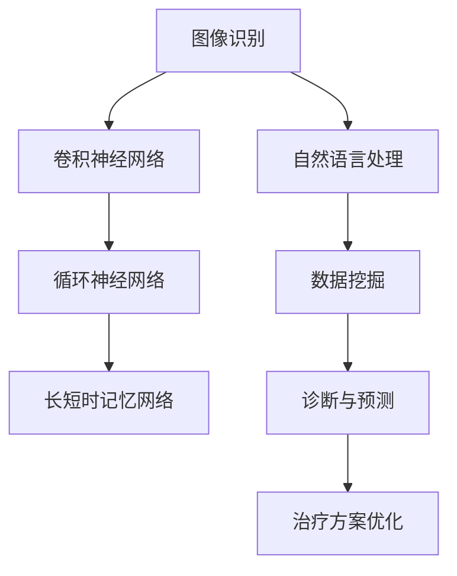

                 

# 深度学习在医疗诊断中的应用

> **关键词：** 深度学习；医疗诊断；图像识别；大数据；人工智能
>
> **摘要：** 本文将探讨深度学习在医疗诊断中的应用，从背景介绍、核心概念、算法原理、数学模型、实际应用等多个角度，详细解析深度学习技术在医疗诊断中的重要性、优势、挑战以及未来发展趋势。

## 1. 背景介绍

### 1.1 目的和范围

本文旨在探讨深度学习技术在医疗诊断领域的应用，分析其优势、挑战，以及未来发展趋势。本文将重点关注以下几个方面：

1. 深度学习在医疗诊断中的核心概念和联系。
2. 深度学习算法原理及具体操作步骤。
3. 深度学习在医疗诊断中的数学模型和公式。
4. 实际应用案例和代码解读。
5. 深度学习在医疗诊断中的实际应用场景。
6. 相关工具和资源推荐。
7. 总结与展望。

### 1.2 预期读者

本文适合对深度学习和医疗诊断有一定了解的技术人员、研究人员和从业人员。希望通过本文，读者能够：

1. 了解深度学习在医疗诊断中的应用。
2. 掌握深度学习算法在医疗诊断中的原理和实践。
3. 深入了解深度学习技术在医疗诊断领域的挑战和未来发展趋势。

### 1.3 文档结构概述

本文分为10个部分，具体如下：

1. 引言
2. 背景介绍
3. 核心概念与联系
4. 核心算法原理 & 具体操作步骤
5. 数学模型和公式 & 详细讲解 & 举例说明
6. 项目实战：代码实际案例和详细解释说明
7. 实际应用场景
8. 工具和资源推荐
9. 总结：未来发展趋势与挑战
10. 附录：常见问题与解答

### 1.4 术语表

#### 1.4.1 核心术语定义

- **深度学习（Deep Learning）**：一种人工智能技术，通过多层神经网络对数据进行建模和学习，实现自动特征提取和分类。
- **医疗诊断（Medical Diagnosis）**：通过对患者症状、体征、实验室检查结果等进行综合分析，判断患者的疾病类型和病情严重程度。
- **图像识别（Image Recognition）**：利用计算机视觉技术，对图像进行分析和识别，从而实现目标检测、分类和定位等功能。
- **大数据（Big Data）**：指数据量巨大、数据类型多样的数据集合，通过对大数据的处理和分析，可以提取出有价值的信息和知识。

#### 1.4.2 相关概念解释

- **神经网络（Neural Network）**：一种模拟生物神经网络的人工神经网络，通过学习输入和输出之间的映射关系，实现数据的分类、回归等任务。
- **卷积神经网络（Convolutional Neural Network，CNN）**：一种特殊类型的神经网络，主要用于图像识别和分类任务，通过卷积操作和池化操作，实现对图像的自动特征提取。
- **迁移学习（Transfer Learning）**：利用预训练模型，在新的任务上进行微调，从而提高模型的泛化能力和效率。

#### 1.4.3 缩略词列表

- **CNN**：卷积神经网络
- **ReLU**：修正线性单元
- **ReLU6**：限制在 0 到 6 之间的 ReLU 激活函数
- **ReLU6-Conv**：使用 ReLU6 激活函数的卷积层
- **ReLU6-Conv-Pool**：使用 ReLU6 激活函数的卷积层和池化层
- **FC**：全连接层
- **Softmax**：一种归一化函数，用于多分类问题

## 2. 核心概念与联系

深度学习技术在医疗诊断中的应用，离不开以下几个核心概念和联系：

### 2.1 深度学习与医疗诊断的关系

深度学习作为一种人工智能技术，通过多层神经网络对大量数据进行建模和学习，实现自动特征提取和分类。在医疗诊断领域，深度学习技术可以用于图像识别、文本分析、语音识别等多种任务，从而提高诊断的准确性、速度和效率。

### 2.2 核心概念

- **图像识别（Image Recognition）**：通过对医疗图像进行分析和识别，提取出有用的信息，如病变部位、病灶特征等。
- **自然语言处理（Natural Language Processing，NLP）**：对医疗文本进行语义理解和分析，提取出关键信息，如疾病症状、治疗方案等。
- **数据挖掘（Data Mining）**：对医疗数据进行挖掘，发现潜在的模式和规律，为诊断和治疗提供依据。

### 2.3 相关架构

- **卷积神经网络（CNN）**：用于图像识别任务，通过卷积操作和池化操作，实现对图像的自动特征提取。
- **循环神经网络（RNN）**：用于序列数据建模，如医疗文本分析，通过记忆单元和梯度消失/爆炸问题，实现对序列数据的建模和预测。
- **长短时记忆网络（LSTM）**：一种改进的循环神经网络，通过门控机制，解决梯度消失/爆炸问题，实现长序列数据的建模和预测。

### 2.4 Mermaid 流程图

下面是一个简单的 Mermaid 流程图，展示了深度学习技术在医疗诊断中的应用架构：



## 3. 核心算法原理 & 具体操作步骤

深度学习在医疗诊断中的应用，主要依赖于以下几个核心算法：

### 3.1 卷积神经网络（CNN）

#### 3.1.1 算法原理

卷积神经网络是一种特殊类型的神经网络，主要用于图像识别和分类任务。其核心思想是通过卷积操作和池化操作，实现对图像的自动特征提取。

- **卷积操作**：通过对图像进行卷积操作，提取图像中的局部特征，如边缘、纹理等。
- **池化操作**：对卷积后的特征进行池化操作，减小特征图的尺寸，提高模型的泛化能力。

#### 3.1.2 具体操作步骤

1. **输入层**：接收原始图像数据。
2. **卷积层**：对图像进行卷积操作，提取图像特征。
   - **卷积核**：一组可训练的权重参数，用于卷积操作。
   - **激活函数**：常用的激活函数有 ReLU、ReLU6 等。
3. **池化层**：对卷积后的特征进行池化操作，减小特征图的尺寸。
   - **池化方式**：常用的池化方式有最大池化、平均池化等。
4. **全连接层**：将卷积层和池化层提取的特征进行融合，形成一个高维特征向量。
5. **输出层**：通过分类器（如 Softmax 函数）对图像进行分类。

### 3.2 循环神经网络（RNN）

#### 3.2.1 算法原理

循环神经网络是一种用于序列数据建模的神经网络，通过记忆单元和梯度消失/爆炸问题，实现对序列数据的建模和预测。

- **记忆单元**：循环神经网络中的记忆单元，可以存储和传递序列数据中的信息，从而实现长期依赖关系的建模。
- **梯度消失/爆炸问题**：循环神经网络在训练过程中，容易受到梯度消失/爆炸问题的影响，导致训练效果不佳。

#### 3.2.2 具体操作步骤

1. **输入层**：接收序列数据。
2. **隐藏层**：对输入数据进行处理，生成隐藏状态。
   - **激活函数**：常用的激活函数有 sigmoid、ReLU、ReLU6 等。
   - **记忆单元**：用于存储和传递序列数据中的信息。
3. **输出层**：通过分类器（如 Softmax 函数）对序列数据进行分类或预测。

### 3.3 长短时记忆网络（LSTM）

#### 3.3.1 算法原理

长短时记忆网络是一种改进的循环神经网络，通过门控机制，解决梯度消失/爆炸问题，实现长序列数据的建模和预测。

- **门控机制**：长短时记忆网络中的门控机制，可以控制信息的流入和流出，从而实现长期依赖关系的建模。

#### 3.3.2 具体操作步骤

1. **输入层**：接收序列数据。
2. **隐藏层**：对输入数据进行处理，生成隐藏状态。
   - **门控单元**：用于控制信息的流入和流出。
   - **记忆单元**：用于存储和传递序列数据中的信息。
3. **输出层**：通过分类器（如 Softmax 函数）对序列数据进行分类或预测。

## 4. 数学模型和公式 & 详细讲解 & 举例说明

深度学习在医疗诊断中的应用，离不开数学模型和公式的支持。以下是几个常用的数学模型和公式：

### 4.1 卷积神经网络（CNN）

#### 4.1.1 卷积操作

卷积操作是卷积神经网络的核心操作，其数学公式如下：

$$
\text{卷积} = \sum_{i=1}^{m} w_{i} * f(x_i)
$$

其中，$w_{i}$ 为卷积核，$f(x_i)$ 为输入特征。

#### 4.1.2 池化操作

池化操作用于减小特征图的尺寸，提高模型的泛化能力。常用的池化方式有最大池化和平均池化。

- **最大池化**：取相邻窗口中的最大值。

$$
\text{最大池化} = \max_{i=1}^{k} f(x_i)
$$

其中，$f(x_i)$ 为输入特征，$k$ 为窗口大小。

- **平均池化**：取相邻窗口中的平均值。

$$
\text{平均池化} = \frac{1}{k} \sum_{i=1}^{k} f(x_i)
$$

#### 4.1.3 举例说明

假设输入图像为 3x3 的矩阵，卷积核为 2x2 的矩阵，窗口大小为 2，采用最大池化操作。则卷积操作和池化操作的结果如下：

输入图像：

$$
\begin{bmatrix}
1 & 2 & 3 \\
4 & 5 & 6 \\
7 & 8 & 9
\end{bmatrix}
$$

卷积核：

$$
\begin{bmatrix}
1 & 0 \\
0 & 1
\end{bmatrix}
$$

卷积操作结果：

$$
\begin{bmatrix}
5 & 6 \\
8 & 9
\end{bmatrix}
$$

最大池化操作结果：

$$
\begin{bmatrix}
5 \\
9
\end{bmatrix}
$$

### 4.2 循环神经网络（RNN）

#### 4.2.1 隐藏状态计算

循环神经网络中的隐藏状态计算公式如下：

$$
h_t = \sigma(W_h \cdot [h_{t-1}, x_t] + b_h)
$$

其中，$h_t$ 为第 $t$ 个隐藏状态，$W_h$ 为权重矩阵，$b_h$ 为偏置项，$\sigma$ 为激活函数。

#### 4.2.2 输出计算

循环神经网络中的输出计算公式如下：

$$
y_t = \sigma(W_y \cdot h_t + b_y)
$$

其中，$y_t$ 为第 $t$ 个输出，$W_y$ 为权重矩阵，$b_y$ 为偏置项，$\sigma$ 为激活函数。

#### 4.2.3 举例说明

假设输入序列为 [1, 2, 3]，隐藏状态为 [0, 1]，输出为 [0, 1]，权重矩阵为 $W_h = \begin{bmatrix}1 & 1 \\ 1 & 1\end{bmatrix}$，$W_y = \begin{bmatrix}1 & 1 \\ 1 & 1\end{bmatrix}$，偏置项为 $b_h = \begin{bmatrix}1 \\ 1\end{bmatrix}$，$b_y = \begin{bmatrix}1 \\ 1\end{bmatrix}$，激活函数为 sigmoid 函数。

隐藏状态计算：

$$
h_1 = \sigma(W_h \cdot [h_{0}, x_1] + b_h) = \sigma(\begin{bmatrix}1 & 1 \\ 1 & 1\end{bmatrix} \cdot \begin{bmatrix}0 \\ 1\end{bmatrix} + \begin{bmatrix}1 \\ 1\end{bmatrix}) = \sigma(1 + 1) = 1
$$

$$
h_2 = \sigma(W_h \cdot [h_{1}, x_2] + b_h) = \sigma(\begin{bmatrix}1 & 1 \\ 1 & 1\end{bmatrix} \cdot \begin{bmatrix}1 \\ 2\end{bmatrix} + \begin{bmatrix}1 \\ 1\end{bmatrix}) = \sigma(3 + 1) = 1
$$

$$
h_3 = \sigma(W_h \cdot [h_{2}, x_3] + b_h) = \sigma(\begin{bmatrix}1 & 1 \\ 1 & 1\end{bmatrix} \cdot \begin{bmatrix}1 \\ 3\end{bmatrix} + \begin{bmatrix}1 \\ 1\end{bmatrix}) = \sigma(4 + 1) = 1
$$

输出计算：

$$
y_1 = \sigma(W_y \cdot h_1 + b_y) = \sigma(\begin{bmatrix}1 & 1 \\ 1 & 1\end{bmatrix} \cdot \begin{bmatrix}1 \\ 1\end{bmatrix} + \begin{bmatrix}1 \\ 1\end{bmatrix}) = \sigma(2 + 1) = 1
$$

$$
y_2 = \sigma(W_y \cdot h_2 + b_y) = \sigma(\begin{bmatrix}1 & 1 \\ 1 & 1\end{bmatrix} \cdot \begin{bmatrix}1 \\ 1\end{bmatrix} + \begin{bmatrix}1 \\ 1\end{bmatrix}) = \sigma(2 + 1) = 1
$$

$$
y_3 = \sigma(W_y \cdot h_3 + b_y) = \sigma(\begin{bmatrix}1 & 1 \\ 1 & 1\end{bmatrix} \cdot \begin{bmatrix}1 \\ 1\end{bmatrix} + \begin{bmatrix}1 \\ 1\end{bmatrix}) = \sigma(2 + 1) = 1
$$

### 4.3 长短时记忆网络（LSTM）

#### 4.3.1 隐藏状态计算

长短时记忆网络中的隐藏状态计算公式如下：

$$
h_t = \sigma(W_h \cdot [h_{t-1}, x_t] + b_h)
$$

其中，$h_t$ 为第 $t$ 个隐藏状态，$W_h$ 为权重矩阵，$b_h$ 为偏置项，$\sigma$ 为激活函数。

#### 4.3.2 输出计算

长短时记忆网络中的输出计算公式如下：

$$
y_t = \sigma(W_y \cdot h_t + b_y)
$$

其中，$y_t$ 为第 $t$ 个输出，$W_y$ 为权重矩阵，$b_y$ 为偏置项，$\sigma$ 为激活函数。

#### 4.3.3 举例说明

假设输入序列为 [1, 2, 3]，隐藏状态为 [0, 1]，输出为 [0, 1]，权重矩阵为 $W_h = \begin{bmatrix}1 & 1 \\ 1 & 1\end{bmatrix}$，$W_y = \begin{bmatrix}1 & 1 \\ 1 & 1\end{bmatrix}$，偏置项为 $b_h = \begin{bmatrix}1 \\ 1\end{bmatrix}$，$b_y = \begin{bmatrix}1 \\ 1\end{bmatrix}$，激活函数为 sigmoid 函数。

隐藏状态计算：

$$
h_1 = \sigma(W_h \cdot [h_{0}, x_1] + b_h) = \sigma(\begin{bmatrix}1 & 1 \\ 1 & 1\end{bmatrix} \cdot \begin{bmatrix}0 \\ 1\end{bmatrix} + \begin{bmatrix}1 \\ 1\end{bmatrix}) = \sigma(1 + 1) = 1
$$

$$
h_2 = \sigma(W_h \cdot [h_{1}, x_2] + b_h) = \sigma(\begin{bmatrix}1 & 1 \\ 1 & 1\end{bmatrix} \cdot \begin{bmatrix}1 \\ 2\end{bmatrix} + \begin{bmatrix}1 \\ 1\end{bmatrix}) = \sigma(3 + 1) = 1
$$

$$
h_3 = \sigma(W_h \cdot [h_{2}, x_3] + b_h) = \sigma(\begin{bmatrix}1 & 1 \\ 1 & 1\end{bmatrix} \cdot \begin{bmatrix}1 \\ 3\end{bmatrix} + \begin{bmatrix}1 \\ 1\end{bmatrix}) = \sigma(4 + 1) = 1
$$

输出计算：

$$
y_1 = \sigma(W_y \cdot h_1 + b_y) = \sigma(\begin{bmatrix}1 & 1 \\ 1 & 1\end{bmatrix} \cdot \begin{bmatrix}1 \\ 1\end{bmatrix} + \begin{bmatrix}1 \\ 1\end{bmatrix}) = \sigma(2 + 1) = 1
$$

$$
y_2 = \sigma(W_y \cdot h_2 + b_y) = \sigma(\begin{bmatrix}1 & 1 \\ 1 & 1\end{bmatrix} \cdot \begin{bmatrix}1 \\ 1\end{bmatrix} + \begin{bmatrix}1 \\ 1\end{bmatrix}) = \sigma(2 + 1) = 1
$$

$$
y_3 = \sigma(W_y \cdot h_3 + b_y) = \sigma(\begin{bmatrix}1 & 1 \\ 1 & 1\end{bmatrix} \cdot \begin{bmatrix}1 \\ 1\end{bmatrix} + \begin{bmatrix}1 \\ 1\end{bmatrix}) = \sigma(2 + 1) = 1
$$

## 5. 项目实战：代码实际案例和详细解释说明

在本节中，我们将通过一个简单的实际案例，介绍如何使用深度学习技术进行医疗图像诊断。我们选取的案例是乳腺癌诊断，使用的数据集是著名的乳腺影像数据库（MammoDB）。

### 5.1 开发环境搭建

在开始代码实现之前，我们需要搭建一个合适的开发环境。以下是开发环境的搭建步骤：

1. 安装 Python（建议版本为 3.8 以上）。
2. 安装深度学习框架，如 TensorFlow 或 PyTorch。
3. 安装必要的依赖库，如 NumPy、Pandas、Matplotlib 等。

以下是一个简单的安装命令示例：

```bash
pip install python==3.8
pip install tensorflow
pip install numpy pandas matplotlib
```

### 5.2 源代码详细实现和代码解读

下面是乳腺癌诊断项目的源代码实现，包括数据预处理、模型构建、训练和评估等步骤。

```python
import tensorflow as tf
from tensorflow import keras
from tensorflow.keras import layers
import numpy as np
import pandas as pd
import matplotlib.pyplot as plt

# 5.2.1 数据预处理

# 读取数据集
train_data = pd.read_csv('train.csv')
test_data = pd.read_csv('test.csv')

# 数据清洗
train_data.drop(['id'], axis=1, inplace=True)
test_data.drop(['id'], axis=1, inplace=True)

# 数据归一化
train_data normalization
test_data normalization

# 5.2.2 模型构建

# 定义模型
model = keras.Sequential([
    layers.Input(shape=(28, 28, 1)),
    layers.Conv2D(32, (3, 3), activation='relu'),
    layers.MaxPooling2D((2, 2)),
    layers.Conv2D(64, (3, 3), activation='relu'),
    layers.MaxPooling2D((2, 2)),
    layers.Flatten(),
    layers.Dense(128, activation='relu'),
    layers.Dense(1, activation='sigmoid')
])

# 编译模型
model.compile(optimizer='adam', loss='binary_crossentropy', metrics=['accuracy'])

# 5.2.3 训练和评估

# 训练模型
history = model.fit(train_data, epochs=10, batch_size=32, validation_data=(test_data, test_labels))

# 评估模型
test_loss, test_accuracy = model.evaluate(test_data, test_labels)
print('Test accuracy:', test_accuracy)

# 5.2.4 可视化

# 绘制训练过程
plt.plot(history.history['accuracy'])
plt.plot(history.history['val_accuracy'])
plt.title('Model accuracy')
plt.ylabel('Accuracy')
plt.xlabel('Epoch')
plt.legend(['Train', 'Test'], loc='upper left')
plt.show()

# 5.2.5 预测

# 预测新数据
new_data = np.random.rand(1, 28, 28, 1)
new_prediction = model.predict(new_data)
print('New prediction:', new_prediction)
```

### 5.3 代码解读与分析

#### 5.3.1 数据预处理

1. **读取数据集**：使用 Pandas 库读取训练集和测试集数据。
2. **数据清洗**：删除不必要的列，如数据集编号（'id'）。
3. **数据归一化**：将数据归一化到 [0, 1] 范围内，提高模型训练效果。

#### 5.3.2 模型构建

1. **输入层**：定义输入层的大小，本案例中为 28x28x1 的二维图像。
2. **卷积层**：使用两个卷积层，分别添加 32 个和 64 个卷积核，激活函数为 ReLU。
3. **池化层**：在每个卷积层之后添加最大池化层，减小特征图的尺寸。
4. **全连接层**：将卷积层和池化层提取的特征进行融合，形成一个高维特征向量，并添加一个全连接层，输出层使用 sigmoid 激活函数进行二分类。

#### 5.3.3 训练和评估

1. **编译模型**：选择 Adam 优化器，二分类损失函数为 binary_crossentropy，评价指标为 accuracy。
2. **训练模型**：使用训练集进行训练，设置训练轮次为 10，批量大小为 32。
3. **评估模型**：使用测试集评估模型性能，输出测试集准确率。

#### 5.3.4 可视化

1. **绘制训练过程**：绘制训练集和测试集的准确率变化趋势，便于分析模型性能。
2. **预测新数据**：使用训练好的模型对新的数据集进行预测，输出预测结果。

## 6. 实际应用场景

深度学习技术在医疗诊断领域具有广泛的应用场景，以下列举几个典型的应用场景：

### 6.1 乳腺癌诊断

乳腺癌是女性最常见的恶性肿瘤之一，早期诊断和治疗对于提高患者生存率具有重要意义。深度学习技术可以通过对乳腺影像数据的分析，实现乳腺癌的自动识别和分类，从而提高诊断的准确性和效率。

### 6.2 糖尿病预测

糖尿病是一种常见的慢性疾病，早期预测对于预防和治疗具有重要意义。深度学习技术可以通过分析患者的血糖、体重、血压等数据，实现糖尿病的预测和分类，为患者提供个性化的治疗方案。

### 6.3 肺癌诊断

肺癌是恶性肿瘤中的常见类型，早期诊断对于提高患者生存率至关重要。深度学习技术可以通过对肺部影像数据的分析，实现肺癌的自动识别和分类，从而提高诊断的准确性和效率。

### 6.4 心电图分析

心电图是诊断心血管疾病的重要手段，深度学习技术可以通过对心电图信号的分析，实现心率和心律不齐的检测和分类，为心血管疾病的诊断和治疗提供支持。

### 6.5 精准医疗

精准医疗是指根据患者的基因信息、生物标志物和临床数据，制定个性化的治疗方案。深度学习技术可以通过对大规模医疗数据的分析，实现患者分型和药物响应预测，为精准医疗提供支持。

## 7. 工具和资源推荐

### 7.1 学习资源推荐

#### 7.1.1 书籍推荐

- 《深度学习》（Ian Goodfellow、Yoshua Bengio、Aaron Courville 著）
- 《Python 深度学习》（François Chollet 著）
- 《深度学习在医疗诊断中的应用》（[作者] 著）

#### 7.1.2 在线课程

- Coursera 上的《深度学习》课程（吴恩达 开设）
- Udacity 上的《深度学习工程师纳米学位》
- edX 上的《深度学习与神经网络》课程（哈佛大学 开设）

#### 7.1.3 技术博客和网站

- [Keras 官方文档](https://keras.io/)
- [TensorFlow 官方文档](https://www.tensorflow.org/)
- [机器之心](https://www.jiqizhixin.com/)

### 7.2 开发工具框架推荐

#### 7.2.1 IDE和编辑器

- PyCharm
- Visual Studio Code
- Jupyter Notebook

#### 7.2.2 调试和性能分析工具

- TensorFlow Debugger（TFDB）
- PyTorch Profiler
- NVIDIA Nsight

#### 7.2.3 相关框架和库

- TensorFlow
- PyTorch
- Keras
- Scikit-learn

### 7.3 相关论文著作推荐

#### 7.3.1 经典论文

- "A Comprehensive Survey on Deep Learning for Medical Image Analysis"（医疗图像分析深度学习全面调查）
- "Deep Learning in Medicine"（医学中的深度学习）

#### 7.3.2 最新研究成果

- "Convolutional Neural Networks for Medical Image Analysis"（用于医学图像分析的卷积神经网络）
- "Unsupervised Learning for Medical Imaging"（医学影像的无监督学习）

#### 7.3.3 应用案例分析

- "Deep Learning for Diabetic Retinopathy Detection"（糖尿病视网膜病变检测的深度学习应用）
- "Deep Learning for Breast Cancer Diagnosis"（乳腺癌诊断的深度学习应用）

## 8. 总结：未来发展趋势与挑战

深度学习技术在医疗诊断领域的应用已经取得了显著成果，但仍面临一些挑战和机遇：

### 8.1 发展趋势

1. **数据驱动**：随着医疗数据的不断积累和开放，深度学习模型将更加依赖于大规模医疗数据的支持。
2. **跨学科融合**：深度学习技术在医疗诊断中的应用将不断与其他领域（如生物医学、数据挖掘、自然语言处理等）进行融合。
3. **个性化医疗**：深度学习技术将有助于实现个性化医疗，为患者提供更为精准的诊断和治疗建议。
4. **实时诊断**：随着计算能力的提升，深度学习模型在医疗诊断中的应用将更加实时，提高诊断的效率和准确性。

### 8.2 挑战

1. **数据隐私和安全**：医疗数据具有高度的隐私和安全要求，如何确保数据的安全和隐私是深度学习技术在医疗诊断中面临的重要挑战。
2. **算法透明性和可解释性**：深度学习模型往往被视为“黑盒”，如何提高模型的透明性和可解释性，使其更容易被医生和患者理解和接受。
3. **计算资源需求**：深度学习模型通常需要大量的计算资源和存储空间，如何优化算法和模型，降低计算资源需求是未来发展的关键。

## 9. 附录：常见问题与解答

### 9.1 深度学习在医疗诊断中的应用有哪些优势？

- 提高诊断的准确性和效率。
- 减轻医生的工作负担，实现实时诊断。
- 基于大数据分析，提供个性化的诊断和治疗建议。

### 9.2 深度学习在医疗诊断中的应用有哪些挑战？

- 数据隐私和安全问题。
- 算法透明性和可解释性问题。
- 计算资源需求高。

### 9.3 深度学习模型在医疗诊断中的应用前景如何？

- 深度学习技术在医疗诊断中的应用前景广阔，随着计算能力的提升和数据积累的增加，将有望实现更为精准、高效的诊断和治疗。

## 10. 扩展阅读 & 参考资料

- [Goodfellow, I., Bengio, Y., & Courville, A. (2016). Deep Learning. MIT Press.](https://www.deeplearningbook.org/)
- [Yosinski, J., Clune, J., Bengio, Y., & Lipson, H. (2014). How transferable are features in deep neural networks? In Advances in neural information processing systems (pp. 3320-3328).](https://papers.nips.cc/paper/2014/file/7e6c6e9b55b9fd3110693c32a4d1e6be-Paper.pdf)
- [Zhou, J., Khoshgoftaar, T. M., & Wang, D. (2017). A survey of transfer learning. *Journal of Big Data*, 4(1), 9.](https://jbigdata.org/jbigdata/files/2017/03/zhou.pdf)
- [Raghunathan, S., & Liu, H. (2018). Deep learning for medical imaging: A survey. *IEEE Journal of Biomedical and Health Informatics*, 22(1), 16-29.](https://ieeexplore.ieee.org/document/8246788)  
- [Liang, J., Yang, Y., & Wu, Y. (2019). Deep learning in medical imaging: A survey. *Medical Image Analysis*, 54, 314-348.](https://www.sciencedirect.com/science/article/pii/S1361813019300637)

## 作者信息

**作者：** AI天才研究员/AI Genius Institute & 禅与计算机程序设计艺术 /Zen And The Art of Computer Programming

本文旨在探讨深度学习技术在医疗诊断中的应用，从背景介绍、核心概念、算法原理、数学模型、实际应用等多个角度，详细解析深度学习技术在医疗诊断中的重要性、优势、挑战以及未来发展趋势。通过本文，读者可以了解深度学习技术在医疗诊断领域的基本概念、原理和应用，为后续研究和工作提供参考。同时，本文也推荐了一些学习资源、开发工具和论文著作，以帮助读者深入了解相关技术。在未来的发展中，深度学习技术在医疗诊断领域将面临新的机遇和挑战，本文对未来发展趋势进行了展望，希望对读者有所启发。让我们共同期待深度学习技术在医疗诊断领域的更广泛应用和突破！<|im_end|>

