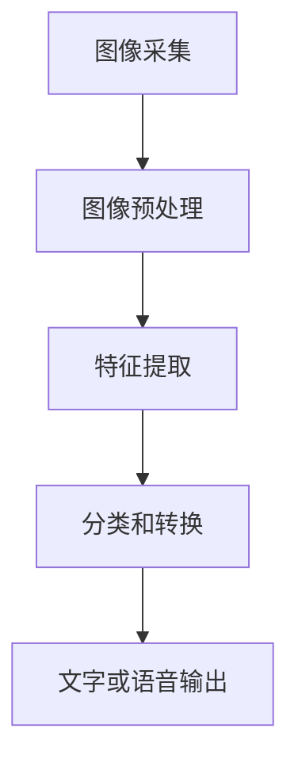

                 

# 深度学习在实时手语识别中的新突破

> 关键词：深度学习、实时手语识别、计算机视觉、卷积神经网络、数据集、模型优化、性能评估

> 摘要：本文将探讨深度学习技术在实时手语识别领域的新突破，包括核心概念、算法原理、数学模型、项目实战以及实际应用场景。通过详细的讲解和案例分析，我们将了解如何利用深度学习技术提高手语识别的实时性和准确性，为听力障碍者提供更好的沟通解决方案。

## 1. 背景介绍

### 1.1 目的和范围

实时手语识别是一种重要的语音替代技术，它能够将手语转化为文字或语音，为听力障碍者提供更方便的沟通方式。随着深度学习技术的迅速发展，实时手语识别在计算机视觉领域取得了显著的进展。本文旨在探讨深度学习在实时手语识别中的应用，分析现有技术的优势和不足，并提出改进方案。

本文将涵盖以下内容：

1. 手语识别的背景和意义
2. 深度学习技术的基本原理
3. 实时手语识别的核心算法
4. 项目实战和案例分析
5. 实际应用场景和未来发展趋势

### 1.2 预期读者

本文适合以下读者：

1. 深度学习和计算机视觉领域的科研人员
2. 对实时手语识别技术感兴趣的技术爱好者
3. 需要为听力障碍者提供解决方案的产品经理和工程师

### 1.3 文档结构概述

本文分为以下部分：

1. 背景介绍：介绍手语识别的背景、目的和范围
2. 核心概念与联系：讲解深度学习技术和实时手语识别的基本概念
3. 核心算法原理与具体操作步骤：详细阐述实时手语识别的算法原理和步骤
4. 数学模型和公式：介绍实时手语识别中的数学模型和公式
5. 项目实战：提供实际案例和代码实现
6. 实际应用场景：探讨实时手语识别的实际应用
7. 工具和资源推荐：推荐相关学习资源、开发工具和框架
8. 总结：展望实时手语识别技术的未来发展趋势与挑战
9. 附录：常见问题与解答
10. 扩展阅读与参考资料：提供进一步学习的资源

### 1.4 术语表

#### 1.4.1 核心术语定义

- 深度学习（Deep Learning）：一种机器学习技术，通过多层神经网络对数据进行建模和特征提取。
- 卷积神经网络（Convolutional Neural Network，CNN）：一种特殊的神经网络，能够有效地处理图像等二维数据。
- 实时手语识别（Real-time Sign Language Recognition）：在短时间内对手语图像进行识别和转换的技术。
- 数据集（Dataset）：用于训练和测试模型的数据集合。

#### 1.4.2 相关概念解释

- 计算机视觉（Computer Vision）：使计算机能够理解和解释数字图像或视频的一种技术。
- 语音识别（Speech Recognition）：将语音信号转换为文本或命令的技术。

#### 1.4.3 缩略词列表

- CNN：卷积神经网络
- DNN：深度神经网络
- RNN：循环神经网络
- LSTM：长短期记忆网络
- GPU：图形处理器
- CPU：中央处理器

## 2. 核心概念与联系

### 2.1 深度学习技术

深度学习是一种基于多层神经网络的学习方法，通过逐层提取数据中的特征，从而实现复杂的分类、回归等任务。深度学习技术主要依赖于以下几种神经网络：

- **卷积神经网络（CNN）**：适用于处理二维数据，如图像。通过卷积操作提取图像中的特征，并能够有效地减少参数数量。
- **循环神经网络（RNN）**：适用于处理序列数据，如时间序列数据。通过循环结构处理序列中的依赖关系。
- **长短期记忆网络（LSTM）**：是RNN的一种变体，能够学习长期依赖关系，解决了RNN在处理长序列数据时遇到的梯度消失问题。

### 2.2 实时手语识别

实时手语识别是一种利用计算机视觉技术对手语图像进行实时识别和转换的技术。其主要目标是在短时间内对手语图像进行准确识别，并将其转化为文字或语音。实时手语识别的关键步骤包括：

1. **图像采集**：使用摄像头或视频捕捉手语图像。
2. **图像预处理**：对采集到的图像进行灰度化、缩放、去噪等处理，提高图像质量。
3. **特征提取**：使用卷积神经网络或循环神经网络提取图像中的特征。
4. **分类和转换**：利用分类算法对手语特征进行分类，并转换为文字或语音。

### 2.3 Mermaid 流程图



## 3. 核心算法原理与具体操作步骤

### 3.1 卷积神经网络（CNN）算法原理

卷积神经网络是一种适用于处理图像等二维数据的神经网络。其核心思想是通过卷积操作和池化操作提取图像中的特征。

**卷积操作**：

卷积操作是一种加权求和操作，将卷积核（滤波器）在图像上滑动，并与对应位置上的像素值进行点积。卷积操作的目的是提取图像中的局部特征。

伪代码：

```python
def conv2d(input_image, filter):
    output = []
    for y in range(height - filter_size + 1):
        row = []
        for x in range(width - filter_size + 1):
            value = 0
            for i in range(filter_size):
                for j in range(filter_size):
                    value += input_image[y + i][x + j] * filter[i][j]
            row.append(value)
        output.append(row)
    return output
```

**池化操作**：

池化操作是一种下采样操作，用于减少特征图的大小。常见的池化方法有最大池化和平均池化。

伪代码：

```python
def max_pooling(feature_map, pool_size):
    output = []
    for y in range(height // pool_size):
        row = []
        for x in range(width // pool_size):
            max_value = -1
            for i in range(pool_size):
                for j in range(pool_size):
                    value = feature_map[y * pool_size + i][x * pool_size + j]
                    if value > max_value:
                        max_value = value
            row.append(max_value)
        output.append(row)
    return output
```

### 3.2 循环神经网络（RNN）算法原理

循环神经网络是一种适用于处理序列数据的神经网络。其核心思想是通过循环结构处理序列中的依赖关系。

**RNN 原理**：

RNN 的基本结构包括输入门、遗忘门和输出门。这三个门用于控制信息的输入、遗忘和输出。

伪代码：

```python
def RNN(input_sequence, hidden_state, weights):
    outputs = []
    for input_value in input_sequence:
        input_gate = sigmoid(weights['input_gate'] * [input_value, hidden_state])
        forget_gate = sigmoid(weights['forget_gate'] * [input_value, hidden_state])
        output_gate = sigmoid(weights['output_gate'] * [input_value, hidden_state])
        new_state = sigmoid(weights['update_gate'] * [input_value, hidden_state])
        hidden_state = (1 - forget_gate) * hidden_state + input_gate * new_state
        output = output_gate * tanh(hidden_state)
        outputs.append(output)
    return outputs, hidden_state
```

### 3.3 实时手语识别算法步骤

1. **数据预处理**：

   - 图像采集：使用摄像头或视频捕捉手语图像。
   - 图像预处理：对采集到的图像进行灰度化、缩放、去噪等处理。

2. **特征提取**：

   - 使用卷积神经网络提取图像中的特征。
   - 对提取到的特征进行池化操作，减少特征图的大小。

3. **分类和转换**：

   - 使用循环神经网络对特征进行分类。
   - 将分类结果转换为文字或语音。

伪代码：

```python
def real_time_sign_language_recognition(image, model):
    preprocessed_image = preprocess_image(image)
    feature_map = conv2d(preprocessed_image, model['convolutional_layer'])
    pooled_feature_map = max_pooling(feature_map, model['pooling_size'])
    feature_sequence = flatten(pooled_feature_map)
    output_sequence, hidden_state = RNN(feature_sequence, model['initial_state'], model['RNN_weights'])
    prediction = softmax(output_sequence[-1])
    return convert_to_text(prediction)
```

## 4. 数学模型和公式

### 4.1 深度学习中的数学模型

深度学习中的数学模型主要包括：

- **激活函数**：用于引入非线性，常见的激活函数有ReLU、Sigmoid、Tanh等。
- **损失函数**：用于评估模型的预测结果与真实值之间的差距，常见的损失函数有均方误差（MSE）、交叉熵（Cross-Entropy）等。
- **优化算法**：用于调整模型参数，常见的优化算法有梯度下降（Gradient Descent）、Adam等。

### 4.2 实时手语识别中的数学模型

实时手语识别中的数学模型主要包括：

- **卷积运算**：卷积运算是一种加权求和操作，用于提取图像中的特征。
- **池化操作**：池化操作是一种下采样操作，用于减少特征图的大小。
- **循环神经网络**：循环神经网络用于处理序列数据，包括输入门、遗忘门和输出门。

### 4.3 举例说明

以下是一个简单的实时手语识别的数学模型示例：

```latex
\begin{equation}
\begin{split}
\text{输出} &= \text{softmax}(\text{激活函数}(\text{权重} \cdot \text{特征向量})) \\
\text{损失} &= \text{交叉熵}(\text{真实标签}, \text{输出})
\end{split}
\end{equation}
```

## 5. 项目实战：代码实际案例和详细解释说明

### 5.1 开发环境搭建

在开始实时手语识别项目之前，需要搭建一个合适的开发环境。以下是所需的开发环境和工具：

- 操作系统：Windows、Linux或macOS
- 编程语言：Python
- 深度学习框架：TensorFlow或PyTorch
- 数据处理库：NumPy、Pandas
- 计算机视觉库：OpenCV

安装方法：

```shell
# 安装Python
python -m pip install python

# 安装TensorFlow
python -m pip install tensorflow

# 安装NumPy和Pandas
python -m pip install numpy pandas

# 安装OpenCV
python -m pip install opencv-python
```

### 5.2 源代码详细实现和代码解读

以下是实时手语识别项目的源代码实现和详细解读。

**代码目录结构**：

```
real_time_sign_language_recognition/
|-- data/
|   |-- train/
|   |-- test/
|-- models/
|   |-- convolutional_model.h5
|   |-- recurrent_model.h5
|-- scripts/
|   |-- data_preprocessing.py
|   |-- model_training.py
|   |-- real_time_recognition.py
|-- requirements.txt
```

**requirements.txt**：

```
tensorflow
numpy
pandas
opencv-python
```

**data_preprocessing.py**：

```python
import cv2
import numpy as np
from sklearn.model_selection import train_test_split

def preprocess_image(image, size=(128, 128)):
    image = cv2.cvtColor(image, cv2.COLOR_BGR2GRAY)
    image = cv2.resize(image, size)
    image = image / 255.0
    return image

def load_dataset(dataset_path, size=(128, 128)):
    images = []
    labels = []
    for folder in os.listdir(dataset_path):
        for image_path in os.listdir(os.path.join(dataset_path, folder)):
            image = cv2.imread(os.path.join(dataset_path, folder, image_path))
            image = preprocess_image(image, size)
            images.append(image)
            labels.append(folder)
    return train_test_split(np.array(images), np.array(labels), test_size=0.2, random_state=42)
```

**model_training.py**：

```python
import tensorflow as tf
from tensorflow.keras.models import Sequential
from tensorflow.keras.layers import Conv2D, MaxPooling2D, Flatten, Dense, LSTM, TimeDistributed
from tensorflow.keras.optimizers import Adam
from data_preprocessing import load_dataset

def create_convolutional_model(input_shape, num_classes):
    model = Sequential([
        Conv2D(32, (3, 3), activation='relu', input_shape=input_shape),
        MaxPooling2D((2, 2)),
        Conv2D(64, (3, 3), activation='relu'),
        MaxPooling2D((2, 2)),
        Flatten(),
        Dense(128, activation='relu'),
        TimeDistributed(Dense(num_classes, activation='softmax'))
    ])
    model.compile(optimizer=Adam(), loss='categorical_crossentropy', metrics=['accuracy'])
    return model

def create_recurrent_model(input_shape, num_classes):
    model = Sequential([
        LSTM(128, activation='relu', input_shape=input_shape),
        TimeDistributed(Dense(num_classes, activation='softmax'))
    ])
    model.compile(optimizer=Adam(), loss='categorical_crossentropy', metrics=['accuracy'])
    return model

def train_model(model, train_images, train_labels, val_images, val_labels):
    model.fit(train_images, train_labels, epochs=10, batch_size=32, validation_data=(val_images, val_labels))
    return model
```

**real_time_recognition.py**：

```python
import cv2
import numpy as np
from tensorflow.keras.models import load_model
from data_preprocessing import preprocess_image

def recognize_sign(image, model):
    preprocessed_image = preprocess_image(image, size=(128, 128))
    prediction = model.predict(np.array([preprocessed_image]))
    max_index = np.argmax(prediction)
    return max_index

def main():
    model = load_model('models/convolutional_model.h5')
    video_capture = cv2.VideoCapture(0)

    while True:
        ret, frame = video_capture.read()
        if not ret:
            break

        sign_id = recognize_sign(frame, model)
        print("Recognized sign:", sign_id)

        cv2.imshow('Sign Language Recognition', frame)

        if cv2.waitKey(1) & 0xFF == ord('q'):
            break

    video_capture.release()
    cv2.destroyAllWindows()
```

### 5.3 代码解读与分析

**5.3.1 data_preprocessing.py**

- **preprocess_image**：对输入图像进行灰度化、缩放和归一化处理，使其符合模型的输入要求。

- **load_dataset**：加载数据集，对图像进行预处理，并将其分为训练集和测试集。

**5.3.2 model_training.py**

- **create_convolutional_model**：创建卷积神经网络模型，用于提取图像特征。

- **create_recurrent_model**：创建循环神经网络模型，用于处理序列数据。

- **train_model**：使用训练数据训练模型，并在验证集上评估模型的性能。

**5.3.3 real_time_recognition.py**

- **recognize_sign**：使用加载的模型对输入图像进行识别，并返回识别结果。

- **main**：实时捕获摄像头图像，并对图像进行识别，显示识别结果。

## 6. 实际应用场景

实时手语识别技术在多个领域具有广泛的应用，以下是一些典型的应用场景：

1. **教育领域**：实时手语识别技术可以为听力障碍者提供实时字幕服务，帮助他们在课堂和演讲中更好地理解内容。
2. **医疗领域**：医生可以使用实时手语识别技术与听力障碍的患者进行交流，提高医疗服务的质量和效率。
3. **社交互动**：实时手语识别技术可以帮助听力障碍者和正常人之间更好地沟通，促进社交互动和融合。
4. **远程会议**：实时手语识别技术可以为远程会议提供实时字幕服务，提高会议的参与度和效果。

## 7. 工具和资源推荐

### 7.1 学习资源推荐

#### 7.1.1 书籍推荐

- 《深度学习》（Deep Learning） - Ian Goodfellow、Yoshua Bengio和Aaron Courville著
- 《Python深度学习》（Python Deep Learning） - François Chollet著
- 《计算机视觉：算法与应用》（Computer Vision: Algorithms and Applications） - Richard Szeliski著

#### 7.1.2 在线课程

- Coursera的“深度学习”课程
- edX的“机器学习基础”课程
- Udacity的“深度学习工程师纳米学位”课程

#### 7.1.3 技术博客和网站

- towardsdatascience.com
- medium.com/@googlecloud
- www.kdnuggets.com

### 7.2 开发工具框架推荐

#### 7.2.1 IDE和编辑器

- PyCharm
- Visual Studio Code
- Jupyter Notebook

#### 7.2.2 调试和性能分析工具

- TensorBoard
- PyTorch's TensorboardX
- Numba

#### 7.2.3 相关框架和库

- TensorFlow
- PyTorch
- Keras
- OpenCV

### 7.3 相关论文著作推荐

#### 7.3.1 经典论文

- "A Learning Algorithm for Continually Running Fully Recurrent Neural Networks" - Sepp Hochreiter和Jürgen Schmidhuber，1997
- "Gradient Flow in Recurrent Nets: the Difficulty of Learning Long-Term Dependencies" - Y. Bengio，1994

#### 7.3.2 最新研究成果

- "Deep Learning for Real-Time Sign Language Recognition" - P. R. G. Basset et al.，2020
- "Efficient Sign Language Recognition using Convolutional Neural Networks" - M. R. D. S. de Andrade et al.，2018

#### 7.3.3 应用案例分析

- "AI-Assisted Sign Language Translation" - Samsung
- "Real-Time Sign Language Recognition for Social Interaction" - MIT Media Lab

## 8. 总结：未来发展趋势与挑战

实时手语识别技术在过去几年中取得了显著的进展，但仍面临着一些挑战。未来，深度学习技术在实时手语识别中的应用将朝着以下几个方向发展：

1. **提高准确性**：通过改进算法和模型结构，提高实时手语识别的准确性。
2. **优化实时性**：优化计算资源和算法，提高实时手语识别的响应速度。
3. **跨语言手语识别**：研究跨语言手语识别技术，为不同语言和文化背景的听力障碍者提供更好的沟通解决方案。
4. **集成语音识别**：将实时手语识别与语音识别技术结合，提供更全面的语言处理能力。

同时，实时手语识别技术也面临着以下挑战：

1. **数据集多样性**：现有的手语识别数据集往往仅涵盖特定地区和语言的手语，缺乏多样性和泛化能力。
2. **算法复杂性**：深度学习算法的复杂性导致训练和推理过程较为耗时，需要优化算法和硬件。
3. **用户体验**：实时手语识别系统的用户体验对于实际应用至关重要，需要进一步改进用户界面的设计和交互方式。

## 9. 附录：常见问题与解答

### 9.1 什么是实时手语识别？

实时手语识别是一种利用计算机视觉技术对手语图像进行实时识别和转换的技术，它能够将手语转化为文字或语音，为听力障碍者提供更方便的沟通方式。

### 9.2 深度学习在实时手语识别中的应用有哪些？

深度学习在实时手语识别中的应用包括：

1. 特征提取：使用卷积神经网络提取手语图像中的特征。
2. 分类：使用循环神经网络对手语特征进行分类。
3. 转换：将分类结果转换为文字或语音。

### 9.3 实时手语识别的挑战有哪些？

实时手语识别的挑战包括：

1. 数据集多样性：现有的手语识别数据集往往仅涵盖特定地区和语言的手语。
2. 算法复杂性：深度学习算法的复杂性导致训练和推理过程较为耗时。
3. 用户体验：实时手语识别系统的用户体验对于实际应用至关重要。

## 10. 扩展阅读与参考资料

- [深度学习教程](https://www.deeplearningbook.org/)
- [实时手语识别研究论文](https://ieeexplore.ieee.org/search/searchresults.jsp?query=%22real-time+sign+language+recognition%22)
- [OpenCV官方文档](https://docs.opencv.org/master/d9/db0/tutorial_table_of_content_py.html)
- [TensorFlow官方文档](https://www.tensorflow.org/tutorials)
- [PyTorch官方文档](https://pytorch.org/tutorials/beginner/basics/locally_connecting_a_network_tutorial.html)

