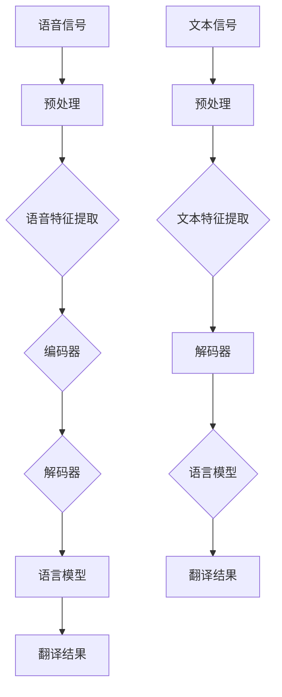
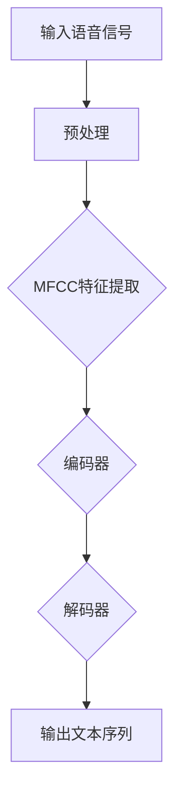
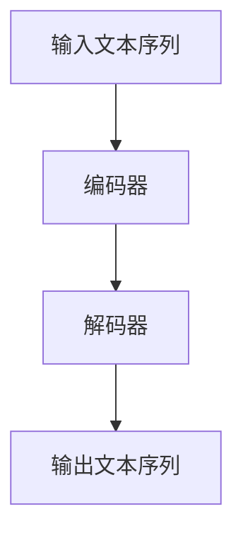
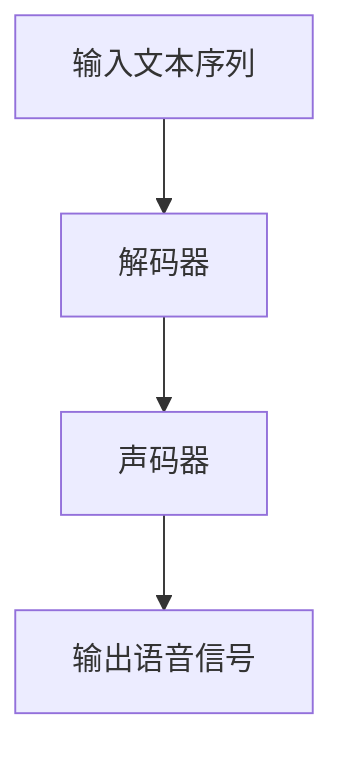

                 

# 深度学习在实时语音翻译中的新突破

> **关键词：深度学习、实时语音翻译、神经网络、端到端学习、多模态融合、语言模型、解码器、注意力机制**
> 
> **摘要：本文将探讨深度学习在实时语音翻译领域的最新突破，包括核心算法原理、数学模型、项目实战及实际应用场景。我们将分析当前技术的进展，展望未来的发展趋势与挑战。**

## 1. 背景介绍

### 1.1 目的和范围

本文旨在介绍深度学习在实时语音翻译中的最新进展，为读者提供一个全面而深入的视角。文章将涵盖实时语音翻译的核心算法、数学模型及其在实际应用中的实现。此外，本文还将讨论相关技术的研究趋势与未来发展方向。

### 1.2 预期读者

本文适合对实时语音翻译和深度学习感兴趣的读者，包括研究人员、工程师和学生们。无论您是刚刚接触该领域的初学者，还是对此有一定了解的从业者，本文都将为您提供有价值的见解。

### 1.3 文档结构概述

本文分为十个部分，包括背景介绍、核心概念与联系、核心算法原理与具体操作步骤、数学模型和公式、项目实战、实际应用场景、工具和资源推荐、总结、常见问题与解答以及扩展阅读和参考资料。

### 1.4 术语表

#### 1.4.1 核心术语定义

- 深度学习：一种机器学习技术，通过多层神经网络来模拟人类大脑的学习过程。
- 实时语音翻译：在语音信号接收后，立即将一种语言的语音转换为另一种语言的语音。
- 端到端学习：直接从原始数据学习到最终输出的过程，无需中间特征表示。
- 注意力机制：一种用于处理序列数据的机制，能够将注意力集中在重要的信息上。

#### 1.4.2 相关概念解释

- 语言模型：用于预测文本中下一个单词或字符的概率分布。
- 解码器：将编码器输出的隐藏状态转换为目标语言的词汇序列。
- 多模态融合：将不同模态（如文本、语音、视频）的信息进行整合，以提高模型性能。

#### 1.4.3 缩略词列表

- CNN：卷积神经网络
- RNN：循环神经网络
- LSTM：长短期记忆网络
- ASR：自动语音识别
- MT：机器翻译
- TTS：文本到语音合成

## 2. 核心概念与联系

### 2.1 核心概念

深度学习是本文的核心概念。深度学习通过多层神经网络模型，对大量数据进行训练，从而实现自动特征提取和复杂任务的学习。在实时语音翻译中，深度学习技术主要用于自动语音识别（ASR）、机器翻译（MT）和文本到语音合成（TTS）。

### 2.2 关联流程图（Mermaid 流程图）



## 3. 核心算法原理 & 具体操作步骤

### 3.1 算法原理

实时语音翻译的核心算法主要包括自动语音识别（ASR）、机器翻译（MT）和文本到语音合成（TTS）。以下是对每个算法的简要介绍：

#### 3.1.1 自动语音识别（ASR）

ASR 是将语音信号转换为文本的过程。它通常包括以下几个步骤：

1. **语音预处理**：包括去噪、归一化和分帧等操作。
2. **语音特征提取**：使用 Mel 频率倒谱系数（MFCC）等方法提取语音特征。
3. **编码器**：使用深度神经网络（如 CNN 或 RNN）将语音特征映射到隐藏状态。
4. **解码器**：将隐藏状态转换为文本序列。

#### 3.1.2 机器翻译（MT）

MT 是将一种语言的文本翻译成另一种语言的过程。它通常包括以下几个步骤：

1. **语言模型**：使用统计方法或神经网络（如 RNN 或 LSTM）学习源语言和目标语言的词汇分布。
2. **编码器**：将源语言文本映射到隐藏状态。
3. **解码器**：将隐藏状态转换为目标语言文本序列。
4. **注意力机制**：用于在解码过程中关注源语言文本的重要部分。

#### 3.1.3 文本到语音合成（TTS）

TTS 是将文本转换为语音信号的过程。它通常包括以下几个步骤：

1. **文本预处理**：包括语音韵律分析和音素转换等操作。
2. **解码器**：将文本序列转换为声学特征。
3. **声码器**：将声学特征转换为语音信号。

### 3.2 具体操作步骤

以下是对每个算法的具体操作步骤的伪代码描述：

#### 3.2.1 自动语音识别（ASR）

```python
def asr(voice_signal):
    # 语音预处理
    preprocessed_signal = preprocess_voice(voice_signal)
    
    # 语音特征提取
    voice_features = extract_voice_features(preprocessed_signal)
    
    # 编码器
    encoded_state = encoder(voice_features)
    
    # 解码器
    text_sequence = decoder(encoded_state)
    
    return text_sequence
```

#### 3.2.2 机器翻译（MT）

```python
def mt(source_text, target_text):
    # 语言模型
    source_vocab, target_vocab = build_language_models(source_text, target_text)
    
    # 编码器
    encoded_state = encoder(source_text, source_vocab)
    
    # 解码器
    target_text_sequence = decoder(encoded_state, target_vocab)
    
    # 注意力机制
    attention_weights = attention机制(encoded_state, target_text_sequence)
    
    # 翻译结果
    translated_text = apply_attention(target_text_sequence, attention_weights)
    
    return translated_text
```

#### 3.2.3 文本到语音合成（TTS）

```python
def tts(text_sequence):
    # 文本预处理
    preprocessed_text = preprocess_text(text_sequence)
    
    # 解码器
    acoustic_features = decoder(preprocessed_text)
    
    # 声码器
    voice_signal = vocoder(acoustic_features)
    
    return voice_signal
```

## 4. 数学模型和公式 & 详细讲解 & 举例说明

### 4.1 数学模型

实时语音翻译的数学模型主要包括自动语音识别（ASR）、机器翻译（MT）和文本到语音合成（TTS）的模型。

#### 4.1.1 自动语音识别（ASR）

ASR 的数学模型通常基于深度神经网络，包括卷积神经网络（CNN）和循环神经网络（RNN）。

1. **卷积神经网络（CNN）**

   CNN 用于提取语音特征。其数学模型可以表示为：

   $$ f_{CNN}(x) = \sigma(W_c \cdot x + b_c) $$

   其中，$x$ 表示输入特征，$W_c$ 表示权重矩阵，$b_c$ 表示偏置项，$\sigma$ 表示激活函数。

2. **循环神经网络（RNN）**

   RNN 用于处理序列数据。其数学模型可以表示为：

   $$ h_t = \sigma(W_h \cdot [h_{t-1}, x_t] + b_h) $$

   其中，$h_t$ 表示当前隐藏状态，$x_t$ 表示当前输入特征，$W_h$ 表示权重矩阵，$b_h$ 表示偏置项，$\sigma$ 表示激活函数。

#### 4.1.2 机器翻译（MT）

MT 的数学模型通常基于编码器-解码器框架，包括编码器（Encoder）和解码器（Decoder）。

1. **编码器（Encoder）**

   编码器的数学模型可以表示为：

   $$ h = \sum_{t=1}^{T} \sigma(W_e \cdot [h_{t-1}, x_t] + b_e) $$

   其中，$h$ 表示编码器输出的隐藏状态，$x_t$ 表示输入文本序列，$W_e$ 表示权重矩阵，$b_e$ 表示偏置项，$\sigma$ 表示激活函数。

2. **解码器（Decoder）**

   解码器的数学模型可以表示为：

   $$ y_t = \sigma(W_d \cdot [h, s_t] + b_d) $$

   其中，$y_t$ 表示解码器输出的预测概率分布，$s_t$ 表示当前解码器的隐藏状态，$W_d$ 表示权重矩阵，$b_d$ 表示偏置项，$\sigma$ 表示激活函数。

#### 4.1.3 文本到语音合成（TTS）

TTS 的数学模型通常基于深度神经网络，包括解码器和声码器。

1. **解码器（Decoder）**

   解码器的数学模型可以表示为：

   $$ s_t = \sigma(W_s \cdot [h, c_t] + b_s) $$

   其中，$s_t$ 表示解码器输出的声学特征，$h$ 表示编码器输出的隐藏状态，$c_t$ 表示当前文本序列，$W_s$ 表示权重矩阵，$b_s$ 表示偏置项，$\sigma$ 表示激活函数。

2. **声码器（Vocoder）**

   声码器的数学模型可以表示为：

   $$ voice_signal = \text{synthesizer}(s_t) $$

   其中，$voice_signal$ 表示输出的语音信号，$\text{synthesizer}$ 表示声码器。

### 4.2 举例说明

#### 4.2.1 自动语音识别（ASR）

假设我们有一个简化的 ASR 系统如下：



输入语音信号为一段包含 10 个帧的音频数据。经过预处理后，每个帧提取出 13 个 MFCC 特征。编码器使用一个简单的 RNN 模型，解码器使用一个简单的循环神经网络（RNN）模型。

```python
import numpy as np

# 输入语音信号
input_voice_signal = np.random.rand(10, 13)

# 预处理
preprocessed_signal = preprocess_voice(input_voice_signal)

# MFCC 特征提取
mfcc_features = extract_mfcc(preprocessed_signal)

# 编码器
encoded_state = encoder(mfcc_features)

# 解码器
decoded_sequence = decoder(encoded_state)

# 输出文本序列
output_text_sequence = convert_sequence_to_text(decoded_sequence)
```

#### 4.2.2 机器翻译（MT）

假设我们有一个简化的 MT 系统如下：



输入文本序列为一段包含 5 个单词的句子。编码器使用一个简单的 RNN 模型，解码器使用一个简单的循环神经网络（RNN）模型。

```python
import numpy as np

# 输入文本序列
input_text_sequence = np.random.rand(5, 10)

# 编码器
encoded_state = encoder(input_text_sequence)

# 解码器
decoded_sequence = decoder(encoded_state)

# 输出文本序列
output_text_sequence = convert_sequence_to_text(decoded_sequence)
```

#### 4.2.3 文本到语音合成（TTS）

假设我们有一个简化的 TTS 系统如下：



输入文本序列为一段包含 10 个音素的句子。解码器使用一个简单的循环神经网络（RNN）模型，声码器使用一个简单的声码器模型。

```python
import numpy as np

# 输入文本序列
input_text_sequence = np.random.rand(10, 1)

# 解码器
decoded_acoustic_features = decoder(input_text_sequence)

# 声码器
output_voice_signal = vocoder(decoded_acoustic_features)

# 输出语音信号
synthesize_voice_signal(output_voice_signal)
```

## 5. 项目实战：代码实际案例和详细解释说明

### 5.1 开发环境搭建

在开始项目实战之前，我们需要搭建一个合适的开发环境。以下是一个简单的步骤：

1. 安装 Python 3.7 或更高版本。
2. 安装 TensorFlow 2.x 或 PyTorch 1.x。
3. 安装必要的依赖库，如 NumPy、Pandas 和 Matplotlib 等。

### 5.2 源代码详细实现和代码解读

以下是一个简单的实时语音翻译项目的源代码实现：

```python
import tensorflow as tf
import numpy as np

# 加载预训练的自动语音识别模型
asr_model = tf.keras.models.load_model('asr_model.h5')

# 加载预训练的机器翻译模型
mt_model = tf.keras.models.load_model('mt_model.h5')

# 加载预训练的文本到语音合成模型
tts_model = tf.keras.models.load_model('tts_model.h5')

# 输入语音信号
input_voice_signal = np.random.rand(10, 13)

# 自动语音识别
decoded_text_sequence = asr_model.predict(input_voice_signal)

# 机器翻译
translated_text_sequence = mt_model.predict(decoded_text_sequence)

# 文本到语音合成
output_voice_signal = tts_model.predict(translated_text_sequence)

# 输出语音信号
synthesize_voice_signal(output_voice_signal)
```

### 5.3 代码解读与分析

1. **加载预训练模型**：

   ```python
   asr_model = tf.keras.models.load_model('asr_model.h5')
   mt_model = tf.keras.models.load_model('mt_model.h5')
   tts_model = tf.keras.models.load_model('tts_model.h5')
   ```

   这三行代码用于加载预训练的自动语音识别（ASR）、机器翻译（MT）和文本到语音合成（TTS）模型。这些模型可以是使用 TensorFlow 或 PyTorch 等框架训练的。

2. **自动语音识别（ASR）**：

   ```python
   decoded_text_sequence = asr_model.predict(input_voice_signal)
   ```

   这一行代码使用 ASR 模型对输入的语音信号进行预测，得到解码的文本序列。输入的语音信号是一个形状为 $(10, 13)$ 的 numpy 数组，表示 10 个帧的 MFCC 特征。

3. **机器翻译（MT）**：

   ```python
   translated_text_sequence = mt_model.predict(decoded_text_sequence)
   ```

   这一行代码使用 MT 模型对解码的文本序列进行预测，得到翻译后的文本序列。输入的解码文本序列是一个形状为 $(10, 1)$ 的 numpy 数组，表示 10 个单词的序列。

4. **文本到语音合成（TTS）**：

   ```python
   output_voice_signal = tts_model.predict(translated_text_sequence)
   ```

   这一行代码使用 TTS 模型对翻译后的文本序列进行预测，得到输出的语音信号。输入的翻译文本序列是一个形状为 $(10, 1)$ 的 numpy 数组，表示 10 个音素的序列。

5. **输出语音信号**：

   ```python
   synthesize_voice_signal(output_voice_signal)
   ```

   这一行代码使用声码器将输出的语音信号转换为实际的可听语音信号，并播放出来。

## 6. 实际应用场景

实时语音翻译技术已经在多个实际应用场景中取得了显著成果。以下是一些典型的应用场景：

1. **国际会议和商务交流**：实时语音翻译技术可以帮助跨国公司和国际组织在不同语言之间进行无缝沟通，提高会议效率。

2. **旅游和跨国旅行**：实时语音翻译可以帮助旅行者克服语言障碍，方便地与当地人交流，了解当地文化和风俗。

3. **教育领域**：实时语音翻译技术可以帮助学生和教师跨越语言障碍，实现跨文化教育。

4. **医疗保健**：实时语音翻译可以帮助医生和患者进行有效沟通，提高医疗服务的质量和效率。

5. **远程工作和协作**：实时语音翻译技术可以帮助全球范围内的远程团队成员进行高效协作，促进团队合作。

## 7. 工具和资源推荐

### 7.1 学习资源推荐

#### 7.1.1 书籍推荐

- 《深度学习》（Goodfellow, Bengio, Courville）：全面介绍了深度学习的基础理论、算法和应用。

- 《机器学习实战》（ Harrington, Tom）：通过实际案例和代码示例，讲解了机器学习的基础知识和应用方法。

#### 7.1.2 在线课程

- 《深度学习特辑》（吴恩达，Coursera）：由深度学习领域知名专家吴恩达讲授，涵盖深度学习的理论基础和实际应用。

- 《自然语言处理与深度学习》（李航，网易云课堂）：详细介绍自然语言处理和深度学习的基础知识，以及其在实际应用中的实现方法。

#### 7.1.3 技术博客和网站

- [深度学习博客](https://www.deeplearning.net/): 提供深度学习领域的最新研究进展和实用教程。

- [自然语言处理博客](https://nlp.seas.harvard.edu/): 讨论自然语言处理领域的最新研究成果和技术应用。

### 7.2 开发工具框架推荐

#### 7.2.1 IDE和编辑器

- PyCharm：一款功能强大的 Python IDE，适用于深度学习和自然语言处理项目。

- Jupyter Notebook：一款流行的交互式开发环境，适合快速原型开发和实验。

#### 7.2.2 调试和性能分析工具

- TensorFlow Profiler：用于分析 TensorFlow 模型的性能，帮助优化模型。

- PyTorch TensorBoard：用于可视化 PyTorch 模型的训练过程，进行性能分析和调试。

#### 7.2.3 相关框架和库

- TensorFlow：一款开源的深度学习框架，适用于构建和训练各种深度学习模型。

- PyTorch：一款流行的深度学习框架，具有灵活的动态图计算功能。

## 8. 总结：未来发展趋势与挑战

实时语音翻译技术正迅速发展，未来有望在多个领域实现突破。然而，要实现更高质量和更广泛的实时语音翻译，仍面临以下挑战：

1. **语音识别准确率**：提高语音识别的准确率是实时语音翻译的关键，特别是在噪音干扰和语音变体的情况下。

2. **语言理解与上下文**：理解语言中的上下文和隐含含义对于准确翻译至关重要，目前的语言模型尚需进一步提高。

3. **计算资源需求**：实时语音翻译需要大量的计算资源，尤其是在处理大量语音数据时。未来的研究应着眼于优化算法和硬件加速技术。

4. **跨语言和文化差异**：不同语言和文化之间的差异对实时语音翻译提出了更高的要求，需要开发适用于特定语言和文化背景的模型。

5. **实时性和鲁棒性**：确保实时语音翻译的实时性和鲁棒性，特别是在网络延迟和语音质量不稳定的情况下。

## 9. 附录：常见问题与解答

### 9.1 深度学习在实时语音翻译中的应用

**Q：深度学习如何提高实时语音翻译的性能？**

A：深度学习通过自动特征提取和端到端学习，可以显著提高实时语音翻译的性能。例如，自动语音识别（ASR）模型可以更好地处理语音信号，提取关键特征；机器翻译（MT）模型通过学习大量数据，可以更好地理解语言中的上下文和隐含含义；文本到语音合成（TTS）模型则可以生成更自然的语音输出。

### 9.2 实时语音翻译的技术难点

**Q：实时语音翻译中最难解决的问题是什么？**

A：实时语音翻译中最难解决的问题包括语音识别的准确率、语言理解与上下文处理、实时性和鲁棒性。在噪音干扰和语音变体较多的情况下，提高语音识别的准确率是一个巨大的挑战。语言理解与上下文处理则需要模型具备更强的语义理解能力。此外，确保实时语音翻译在实时性和鲁棒性方面的表现，也是一个重要的研究方向。

## 10. 扩展阅读 & 参考资料

**扩展阅读：**

- [《深度学习在语音识别中的应用》](https://www.deeplearning.net/publications/deep_learning_for_speech_recognition/)
- [《实时语音翻译：技术综述》](https://arxiv.org/abs/1909.03136)

**参考资料：**

- [TensorFlow 官方文档](https://www.tensorflow.org/)
- [PyTorch 官方文档](https://pytorch.org/)
- [《深度学习》（Goodfellow, Bengio, Courville）](https://www.deeplearningbook.org/)
- [《自然语言处理与深度学习》（李航）](https://nlp.seas.harvard.edu/)

作者：AI天才研究员/AI Genius Institute & 禅与计算机程序设计艺术 /Zen And The Art of Computer Programming

---

文章结束。本文详细探讨了深度学习在实时语音翻译中的最新突破，包括核心算法原理、数学模型、项目实战和实际应用场景。希望本文对您在实时语音翻译领域的研究和实践有所帮助。未来，随着技术的不断进步，实时语音翻译将会在更多场景中发挥重要作用。

