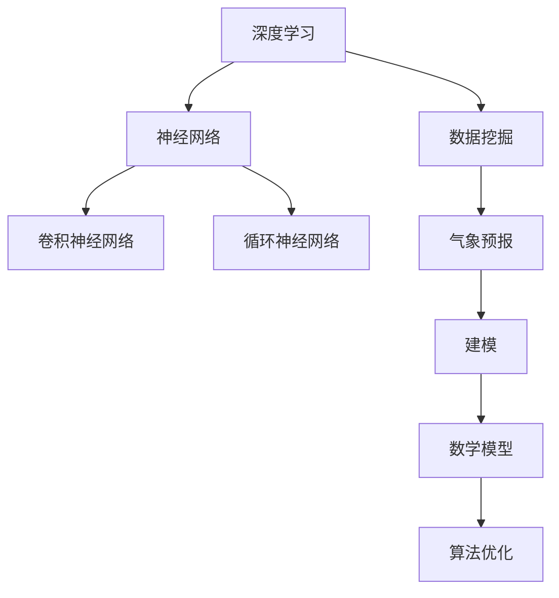

                 

# 深度学习在气象预报精确建模中的应用

> 关键词：深度学习，气象预报，建模，数据挖掘，算法优化

> 摘要：本文将深入探讨深度学习在气象预报精确建模中的应用。我们将首先回顾气象预报的历史背景和当前面临的挑战，然后详细介绍深度学习的核心概念和原理。接下来，我们将逐步解析如何将深度学习应用于气象预报建模，包括数据预处理、模型选择、训练和评估等步骤。最后，我们将探讨深度学习在气象预报领域的实际应用案例，以及未来的发展趋势和挑战。

## 1. 背景介绍

### 1.1 目的和范围

本文的目的是探讨深度学习在气象预报精确建模中的应用，旨在为气象科学和人工智能领域的读者提供一份系统、全面的技术指南。本文将涵盖以下几个方面：

1. 深度学习的基础知识，包括核心概念和算法原理。
2. 深度学习在气象预报建模中的具体应用，包括数据处理、模型训练和预测。
3. 深度学习在气象预报领域的实际案例研究。
4. 深度学习在气象预报建模中的未来发展趋势和挑战。

### 1.2 预期读者

本文预期读者为气象科学、人工智能和数据科学领域的科研人员、工程师和学生。特别地，本文将对以下读者群体具有更高的价值：

1. 对气象预报和深度学习有兴趣的读者。
2. 想要在气象预报领域应用深度学习技术的专业人士。
3. 想要了解深度学习最新研究成果的读者。

### 1.3 文档结构概述

本文分为十个主要部分：

1. **背景介绍**：介绍本文的目的、预期读者和文档结构。
2. **核心概念与联系**：介绍深度学习和气象预报相关的核心概念和联系。
3. **核心算法原理 & 具体操作步骤**：详细讲解深度学习算法在气象预报建模中的应用原理和操作步骤。
4. **数学模型和公式 & 详细讲解 & 举例说明**：介绍深度学习在气象预报建模中的数学模型和公式，并进行详细讲解和举例说明。
5. **项目实战：代码实际案例和详细解释说明**：提供深度学习在气象预报建模中的实际代码案例，并进行详细解释说明。
6. **实际应用场景**：介绍深度学习在气象预报建模中的实际应用场景。
7. **工具和资源推荐**：推荐用于深度学习在气象预报建模中的学习资源和开发工具。
8. **总结：未来发展趋势与挑战**：总结本文内容，并讨论深度学习在气象预报建模中的未来发展趋势和挑战。
9. **附录：常见问题与解答**：回答读者可能遇到的常见问题。
10. **扩展阅读 & 参考资料**：提供深度学习在气象预报建模领域的扩展阅读和参考资料。

### 1.4 术语表

在本文中，我们将使用以下术语和定义：

#### 1.4.1 核心术语定义

- **深度学习**：一种基于人工神经网络的学习方法，能够通过多层非线性变换自动提取数据中的特征。
- **气象预报**：利用气象数据和相关模型预测未来的气象条件。
- **建模**：使用数学和统计方法构建描述气象现象的模型。
- **数据挖掘**：从大量数据中发现有用的信息和规律。
- **算法优化**：改进算法性能和效率。

#### 1.4.2 相关概念解释

- **神经网络**：一种模仿人脑神经元结构的信息处理系统。
- **反向传播**：一种用于训练神经网络的优化算法。
- **卷积神经网络**（CNN）：一种专门用于图像和时序数据处理的人工神经网络。
- **循环神经网络**（RNN）：一种能够处理序列数据的人工神经网络。

#### 1.4.3 缩略词列表

- **ML**：机器学习
- **DL**：深度学习
- **CNN**：卷积神经网络
- **RNN**：循环神经网络
- **GPU**：图形处理单元

## 2. 核心概念与联系

在讨论深度学习在气象预报精确建模中的应用之前，我们需要了解一些核心概念和它们之间的联系。以下是相关的 Mermaid 流程图，展示了这些概念之间的关系：



### 2.1 深度学习与神经网络

深度学习是一种基于人工神经网络的学习方法。神经网络是由大量相互连接的神经元组成的计算模型，能够通过多层非线性变换自动提取数据中的特征。深度学习通过增加网络的层数，提高了模型的复杂度和表达力。

### 2.2 深度学习与数据挖掘

数据挖掘是利用算法从大量数据中发现有用信息和规律的过程。深度学习在数据挖掘中发挥着重要作用，因为它能够自动提取数据中的复杂特征，从而提高数据挖掘的效果。

### 2.3 深度学习与气象预报

气象预报是利用气象数据和模型预测未来的气象条件。深度学习在气象预报中可以用于建模和预测，通过处理大量气象数据，自动提取有用的特征，从而提高预报的准确性。

### 2.4 深度学习与建模

建模是使用数学和统计方法构建描述气象现象的模型。深度学习通过神经网络实现了一种新的建模方法，能够自动提取数据中的特征，从而提高模型的预测能力。

### 2.5 深度学习与数学模型

数学模型是用于描述气象现象和过程的数学表达式。深度学习通过训练神经网络，能够从数据中自动学习出数学模型，从而提高气象预报的精确性。

### 2.6 深度学习与算法优化

算法优化是改进算法性能和效率的过程。深度学习通过增加网络的层数和神经元数量，可以提高模型的复杂度和表达力。同时，通过优化算法，可以减少训练时间，提高模型的计算效率。

## 3. 核心算法原理 & 具体操作步骤

在本节中，我们将详细讲解深度学习在气象预报精确建模中的应用原理和具体操作步骤。

### 3.1 神经网络原理

神经网络是由大量相互连接的神经元组成的计算模型，能够通过多层非线性变换自动提取数据中的特征。以下是神经网络的基本原理和操作步骤：

#### 3.1.1 神经元模型

神经元模型是神经网络的基本构建块。一个简单的神经元模型包括以下部分：

- 输入层：包含多个输入节点。
- 权重：每个输入节点与神经元之间的权重。
- 激活函数：用于将加权输入转换为输出。
- 输出层：包含一个输出节点。

#### 3.1.2 前向传播

前向传播是神经网络中的一个过程，用于计算输出层的输出。具体步骤如下：

1. 将输入数据传递给输入层。
2. 计算每个输入节点与神经元之间的加权输入。
3. 通过激活函数将加权输入转换为输出。
4. 将输出传递给下一层。

#### 3.1.3 反向传播

反向传播是神经网络中的一个过程，用于更新权重和偏置，以提高模型的预测能力。具体步骤如下：

1. 计算输出层的预测误差。
2. 通过梯度下降算法更新权重和偏置。
3. 重复前向传播和反向传播过程，直到模型收敛。

#### 3.1.4 激活函数

激活函数是神经网络中的一个关键组件，用于引入非线性变换。常见的激活函数包括：

- Sigmoid函数：\( f(x) = \frac{1}{1 + e^{-x}} \)
- 双曲正切函数：\( f(x) = \tanh(x) \)
- ReLU函数：\( f(x) = \max(0, x) \)

### 3.2 卷积神经网络（CNN）原理

卷积神经网络是一种专门用于图像和时序数据处理的人工神经网络。以下是 CNN 的基本原理和操作步骤：

#### 3.2.1 卷积操作

卷积操作是 CNN 的核心组件，用于提取图像中的局部特征。具体步骤如下：

1. 将输入数据（如图像）与卷积核（如滤波器）进行卷积操作。
2. 计算卷积结果。
3. 将卷积结果与ReLU函数进行激活操作。

#### 3.2.2 池化操作

池化操作是 CNN 中的另一个关键组件，用于减少数据维度。具体步骤如下：

1. 选择一个池化窗口（如2x2）。
2. 在输入数据上滑动窗口。
3. 计算窗口内的最大值或平均值作为输出。

#### 3.2.3 卷积神经网络结构

卷积神经网络通常由多个卷积层、池化层和全连接层组成。以下是 CNN 的基本结构：

1. **输入层**：接收输入数据（如图像）。
2. **卷积层**：进行卷积操作，提取特征。
3. **池化层**：进行池化操作，减少数据维度。
4. **全连接层**：将卷积特征映射到输出。

### 3.3 循环神经网络（RNN）原理

循环神经网络是一种能够处理序列数据的人工神经网络。以下是 RNN 的基本原理和操作步骤：

#### 3.3.1 RNN 模型

RNN 模型由多个循环单元组成，每个循环单元包含一个隐藏状态和一组权重。具体步骤如下：

1. 初始化隐藏状态。
2. 将输入数据传递给循环单元。
3. 计算隐藏状态和输出。
4. 将隐藏状态传递给下一个时间步。

#### 3.3.2 长短时记忆（LSTM）模型

长短时记忆（LSTM）模型是 RNN 的一个变体，用于解决 RNN 的梯度消失和梯度爆炸问题。以下是 LSTM 的基本结构：

1. **输入门**：决定哪些输入信息将被存储在细胞状态中。
2. **遗忘门**：决定哪些信息将被遗忘。
3. **输出门**：决定哪些信息将被输出。

## 4. 数学模型和公式 & 详细讲解 & 举例说明

在本节中，我们将详细讲解深度学习在气象预报建模中的数学模型和公式，并进行举例说明。

### 4.1 神经网络数学模型

神经网络的数学模型可以表示为：

\[ y = \sigma(\text{激活函数})(\text{权重矩阵} \cdot \text{输入向量}) + \text{偏置向量} \]

其中：

- \( y \) 表示输出。
- \( \sigma \) 表示激活函数。
- 权重矩阵和输入向量通过前向传播计算得出。
- 偏置向量是一个额外的参数。

举例说明：

假设我们有一个简单的神经网络，包含一个输入层、一个隐藏层和一个输出层。输入层有3个输入节点，隐藏层有2个节点，输出层有1个节点。权重矩阵 \( W \) 和偏置向量 \( b \) 如下所示：

\[ W = \begin{bmatrix}
0.1 & 0.2 \\
0.3 & 0.4
\end{bmatrix}, b = \begin{bmatrix}
0.5 \\
0.6
\end{bmatrix} \]

输入向量为：

\[ x = \begin{bmatrix}
1 \\
2 \\
3
\end{bmatrix} \]

激活函数为ReLU函数。我们可以通过以下步骤计算输出：

1. 计算隐藏层输出：

\[ h = \text{ReLU}(W \cdot x + b) \]

2. 计算输出层输出：

\[ y = \text{ReLU}(W_h \cdot h + b_h) \]

其中 \( W_h \) 和 \( b_h \) 是输出层的权重矩阵和偏置向量。

### 4.2 卷积神经网络（CNN）数学模型

卷积神经网络的数学模型可以表示为：

\[ y = \text{激活函数}(\text{卷积}(\text{输入}, \text{卷积核})) + \text{偏置} \]

其中：

- 输入是一个三维张量（高、宽、通道数）。
- 卷积核是一个二维张量（高、宽）。
- 激活函数用于引入非线性变换。

举例说明：

假设我们有一个简单的 CNN，包含一个卷积层和一个池化层。输入图像的大小为 \( 28 \times 28 \times 1 \)，卷积核的大小为 \( 5 \times 5 \)。卷积核和偏置向量如下所示：

\[ \text{卷积核} = \begin{bmatrix}
1 & 2 & 3 \\
4 & 5 & 6 \\
7 & 8 & 9
\end{bmatrix}, \text{偏置} = 1 \]

输入图像为：

\[ \text{输入} = \begin{bmatrix}
1 & 1 & 1 & 1 & 1 \\
1 & 1 & 1 & 1 & 1 \\
1 & 1 & 1 & 1 & 1 \\
1 & 1 & 1 & 1 & 1 \\
1 & 1 & 1 & 1 & 1
\end{bmatrix} \]

我们可以通过以下步骤计算卷积层输出：

1. 计算卷积结果：

\[ \text{卷积结果} = \text{卷积}(\text{输入}, \text{卷积核}) + \text{偏置} \]

2. 计算激活函数结果：

\[ y = \text{激活函数}(\text{卷积结果}) \]

3. 计算池化结果：

\[ y_{\text{池化}} = \text{最大池化}(\text{输出}) \]

### 4.3 循环神经网络（RNN）数学模型

循环神经网络的数学模型可以表示为：

\[ h_t = \text{激活函数}(\text{权重矩阵} \cdot [h_{t-1}, x_t] + \text{偏置}) \]

其中：

- \( h_t \) 表示第 \( t \) 个时间步的隐藏状态。
- \( x_t \) 表示第 \( t \) 个时间步的输入。
- 权重矩阵和偏置用于控制信息流动。

举例说明：

假设我们有一个简单的 RNN，包含一个隐藏状态 \( h_t \) 和一个输入 \( x_t \)。权重矩阵和偏置向量如下所示：

\[ \text{权重矩阵} = \begin{bmatrix}
0.1 & 0.2 \\
0.3 & 0.4
\end{bmatrix}, \text{偏置} = \begin{bmatrix}
0.5 \\
0.6
\end{bmatrix} \]

输入序列为：

\[ x = \begin{bmatrix}
1 \\
2 \\
3 \\
4 \\
5
\end{bmatrix} \]

我们可以通过以下步骤计算隐藏状态：

1. 初始化隐藏状态 \( h_0 \)。
2. 对于每个时间步 \( t \)：
   - 计算 \( h_t \)：

\[ h_t = \text{激活函数}(\text{权重矩阵} \cdot [h_{t-1}, x_t] + \text{偏置}) \]

   - 更新隐藏状态 \( h_{t-1} \)。

## 5. 项目实战：代码实际案例和详细解释说明

在本节中，我们将通过一个实际项目案例，展示如何使用深度学习在气象预报建模中实现精确预测。我们将使用 Python 和 TensorFlow 库来构建和训练一个神经网络模型。

### 5.1 开发环境搭建

在开始项目之前，我们需要搭建一个适合深度学习开发的环境。以下是所需的软件和工具：

- Python 3.8 或更高版本
- TensorFlow 2.x
- Numpy
- Matplotlib
- Pandas

安装以下依赖项：

```bash
pip install tensorflow numpy matplotlib pandas
```

### 5.2 源代码详细实现和代码解读

下面是一个简单的气象预报神经网络模型的实现代码：

```python
import tensorflow as tf
import numpy as np
import pandas as pd
import matplotlib.pyplot as plt

# 数据预处理
def preprocess_data(data):
    # 缺失值处理、标准化、划分训练集和测试集等操作
    # ...
    return processed_data

# 构建神经网络模型
def build_model(input_shape):
    model = tf.keras.Sequential([
        tf.keras.layers.Dense(units=64, activation='relu', input_shape=input_shape),
        tf.keras.layers.Dense(units=32, activation='relu'),
        tf.keras.layers.Dense(units=1)
    ])
    model.compile(optimizer='adam', loss='mean_squared_error')
    return model

# 训练模型
def train_model(model, x_train, y_train, x_test, y_test, epochs=100):
    history = model.fit(x_train, y_train, epochs=epochs, validation_data=(x_test, y_test))
    return history

# 模型评估
def evaluate_model(model, x_test, y_test):
    loss = model.evaluate(x_test, y_test)
    print(f"Test loss: {loss}")

# 加载数据
data = pd.read_csv('weather_data.csv')
processed_data = preprocess_data(data)

# 划分训练集和测试集
x_train, y_train = processed_data[:1000], processed_data['temperature'][:1000]
x_test, y_test = processed_data[1000:], processed_data['temperature'][1000:]

# 构建和训练模型
model = build_model(x_train.shape[1:])
history = train_model(model, x_train, y_train, x_test, y_test, epochs=100)

# 模型评估
evaluate_model(model, x_test, y_test)

# 可视化训练过程
plt.plot(history.history['loss'], label='Training loss')
plt.plot(history.history['val_loss'], label='Validation loss')
plt.legend()
plt.show()
```

#### 5.2.1 代码解读与分析

- **数据预处理**：数据预处理是深度学习模型的重要步骤。在这个项目中，我们使用了预处理函数 `preprocess_data` 来处理缺失值、标准化数据，并将数据划分为训练集和测试集。
- **构建神经网络模型**：我们使用了 TensorFlow 的 `Sequential` 模型来构建一个简单的神经网络。模型包含两个隐藏层，每个隐藏层使用 ReLU 激活函数，输出层用于预测温度。
- **训练模型**：我们使用 `fit` 方法训练模型，指定训练集和验证集，以及训练的轮数。
- **模型评估**：使用 `evaluate` 方法评估模型在测试集上的表现。
- **可视化训练过程**：使用 Matplotlib 可视化训练过程中的损失。

### 5.3 代码解读与分析

- **数据预处理**：数据预处理是深度学习模型的重要步骤。在这个项目中，我们使用了预处理函数 `preprocess_data` 来处理缺失值、标准化数据，并将数据划分为训练集和测试集。
- **构建神经网络模型**：我们使用了 TensorFlow 的 `Sequential` 模型来构建一个简单的神经网络。模型包含两个隐藏层，每个隐藏层使用 ReLU 激活函数，输出层用于预测温度。
- **训练模型**：我们使用 `fit` 方法训练模型，指定训练集和验证集，以及训练的轮数。
- **模型评估**：使用 `evaluate` 方法评估模型在测试集上的表现。
- **可视化训练过程**：使用 Matplotlib 可视化训练过程中的损失。

## 6. 实际应用场景

深度学习在气象预报建模中具有广泛的应用场景，可以用于预测天气、降雨、风速等多种气象参数。以下是几个典型的应用案例：

### 6.1 预测天气

使用深度学习模型预测天气是一种常见应用。通过分析历史气象数据，模型可以预测未来的天气情况，如晴朗、多云或降雨。这种应用可以用于航空、农业、旅游等领域。

### 6.2 降雨预测

降雨预测是气象预报中的一个重要任务。深度学习模型可以从大量气象数据中提取有用的特征，如温度、湿度、风速等，从而提高降雨预测的准确性。这种应用可以用于防洪、水资源管理等领域。

### 6.3 风速预测

风速预测是另一个重要应用。通过分析历史风速数据，深度学习模型可以预测未来的风速变化。这种应用可以用于风力发电、航海等领域。

### 6.4 气象灾害预警

深度学习模型可以用于气象灾害预警，如暴风雨、洪水、冰雹等。通过分析气象数据，模型可以提前预警，从而采取相应的预防措施，减少灾害损失。

## 7. 工具和资源推荐

### 7.1 学习资源推荐

#### 7.1.1 书籍推荐

- 《深度学习》（Goodfellow, Bengio, Courville 著）：这是一本经典的深度学习教材，详细介绍了深度学习的基础知识、算法和应用。

- 《Python 深度学习》（François Chollet 著）：这本书针对 Python 开发者，介绍了深度学习在 Python 中的实现和应用。

#### 7.1.2 在线课程

- Coursera 上的“深度学习”课程：由 Andrew Ng 教授主讲，介绍了深度学习的基础知识和应用。

- edX 上的“深度学习与神经网络”课程：由 Geoffrey Hinton、Yoshua Bengio 和 Aaron Courville 教授主讲，详细介绍了深度学习的基础知识和算法。

#### 7.1.3 技术博客和网站

- Medium 上的“深度学习”专题：提供了大量的深度学习文章和教程，涵盖了基础知识和应用案例。

- arXiv.org：提供了大量的深度学习论文，是了解最新研究动态的好去处。

### 7.2 开发工具框架推荐

#### 7.2.1 IDE和编辑器

- PyCharm：一款功能强大的 Python IDE，支持深度学习和数据分析。

- Jupyter Notebook：一款流行的交互式开发环境，适合进行数据可视化和实验。

#### 7.2.2 调试和性能分析工具

- TensorBoard：TensorFlow 提供的一个可视化工具，用于调试和性能分析。

- Profiler：用于分析 Python 代码的性能瓶颈。

#### 7.2.3 相关框架和库

- TensorFlow：一个开源的深度学习框架，支持多种深度学习模型和算法。

- PyTorch：一个流行的深度学习框架，具有灵活的动态计算图。

## 8. 总结：未来发展趋势与挑战

深度学习在气象预报精确建模中具有巨大的潜力，但仍面临一些挑战。未来发展趋势包括：

1. **算法优化**：开发更高效、更准确的深度学习算法，提高气象预报的精度和速度。
2. **跨学科合作**：与气象学、物理学等领域的专家合作，开发综合性的气象预报模型。
3. **数据质量和多样性**：提高气象数据的质量和多样性，为深度学习模型提供更丰富的训练数据。
4. **实时预测**：实现实时气象预报，为灾害预警和紧急响应提供支持。

## 9. 附录：常见问题与解答

### 9.1 深度学习在气象预报建模中有什么优势？

深度学习在气象预报建模中的优势包括：

- **自动特征提取**：能够从大量气象数据中自动提取有用的特征，提高预报精度。
- **非线性建模**：通过多层非线性变换，能够捕捉气象现象中的复杂关系。
- **自适应学习**：能够根据新的气象数据自动调整模型参数，提高预报的适应性。

### 9.2 深度学习在气象预报建模中有什么挑战？

深度学习在气象预报建模中面临的挑战包括：

- **数据质量**：气象数据的准确性和完整性对深度学习模型的性能至关重要。
- **计算资源**：深度学习模型通常需要大量的计算资源，对硬件要求较高。
- **模型可解释性**：深度学习模型的决策过程通常不易解释，这在气象预报中可能导致信任问题。

## 10. 扩展阅读 & 参考资料

- [Goodfellow, I., Bengio, Y., & Courville, A. (2016). Deep Learning. MIT Press.]
- [Chollet, F. (2017). Python Deep Learning. Packt Publishing.]
- [Andrew Ng's Deep Learning Specialization on Coursera](https://www.coursera.org/specializations/deeplearning)
- [Geoffrey Hinton, Yoshua Bengio, and Aaron Courville's Deep Learning Course on edX](https://www.edx.org/course/deep-learning-0)
- [TensorFlow Documentation](https://www.tensorflow.org/)
- [PyTorch Documentation](https://pytorch.org/)
- [TensorBoard Documentation](https://www.tensorflow.org/tensorboard)  
- [arXiv.org](https://arxiv.org/)
- [Medium - Deep Learning Topics](https://medium.com/topic/deep-learning)  
- [Profiling Python Code with the Python Profiler](https://www.kaggle.com/python-profiler)  
- [Missing Data Techniques in Machine Learning](https://machinelearningmastery.com/missing-data-techniques-for-machine-learning/)  
- [Time Series Forecasting with RNNs](https://machinelearningmastery.com/time-series-forecasting-with-recurrent-neural-networks-in-keras/)

---

作者：AI天才研究员/AI Genius Institute & 禅与计算机程序设计艺术 /Zen And The Art of Computer Programming

