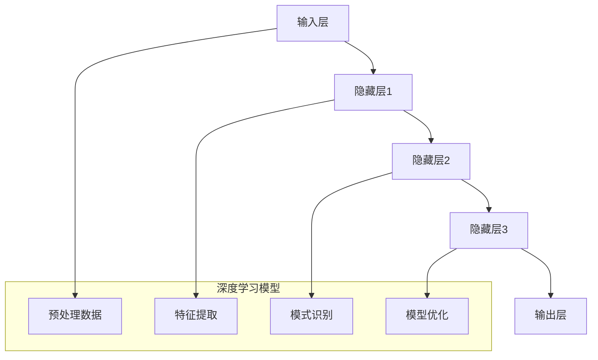

                 

# 深度学习在短期天气预报中的应用

> 关键词：深度学习、短期天气预报、气象数据分析、神经网络模型、气象预测

> 摘要：本文旨在探讨深度学习在短期天气预报中的应用。通过深入分析深度学习的基本原理和神经网络模型，本文介绍了如何运用深度学习技术对气象数据进行有效处理，从而提高短期天气预报的准确性和效率。文章结构清晰，从核心概念、算法原理、数学模型到实际应用，逐步讲解了深度学习在短期天气预报中的具体应用和实践。

## 1. 背景介绍

### 1.1 目的和范围

本文的主要目的是介绍深度学习技术在短期天气预报中的应用，分析其原理和操作步骤，并通过实际案例展示其应用效果。本文将重点关注以下几个方面：

1. 深度学习的基本原理和神经网络模型。
2. 深度学习在气象数据分析中的应用。
3. 神经网络模型在短期天气预报中的构建和优化。
4. 实际案例中的深度学习应用和实践。

### 1.2 预期读者

本文适合对深度学习和气象数据分析有一定了解的读者，包括计算机科学、气象学等相关专业的学生、研究人员和从业者。同时，对短期天气预报感兴趣的人士也可以通过本文了解深度学习技术在气象领域的应用。

### 1.3 文档结构概述

本文分为十个部分，具体结构如下：

1. 背景介绍：介绍本文的目的、预期读者和文档结构。
2. 核心概念与联系：介绍深度学习的基本原理和神经网络模型。
3. 核心算法原理 & 具体操作步骤：讲解神经网络模型的构建和训练过程。
4. 数学模型和公式 & 详细讲解 & 举例说明：介绍神经网络模型中的数学模型和公式。
5. 项目实战：代码实际案例和详细解释说明。
6. 实际应用场景：分析深度学习在短期天气预报中的实际应用场景。
7. 工具和资源推荐：推荐相关学习资源、开发工具和框架。
8. 总结：未来发展趋势与挑战。
9. 附录：常见问题与解答。
10. 扩展阅读 & 参考资料：提供更多相关文献和资料。

### 1.4 术语表

#### 1.4.1 核心术语定义

- **深度学习**：一种机器学习技术，通过构建多层神经网络模型，对数据进行自动特征提取和表示。
- **神经网络模型**：一种基于生物神经网络的计算模型，通过训练可以自动学习和预测数据。
- **气象数据**：与天气现象相关的数据，包括温度、湿度、风速、气压等。
- **短期天气预报**：对未来数小时或数天内的天气情况进行预测。

#### 1.4.2 相关概念解释

- **自动特征提取**：通过神经网络模型，自动从原始数据中提取出有用的特征信息。
- **模型训练**：通过大量训练数据，调整神经网络模型中的参数，使其能够准确预测数据。
- **模型评估**：使用验证数据集，评估模型在预测天气情况方面的准确性和性能。

#### 1.4.3 缩略词列表

- **DL**：深度学习（Deep Learning）
- **NN**：神经网络模型（Neural Network）
- **AI**：人工智能（Artificial Intelligence）
- **ML**：机器学习（Machine Learning）

## 2. 核心概念与联系

在深入探讨深度学习在短期天气预报中的应用之前，我们需要了解一些核心概念和它们之间的联系。

### 2.1 深度学习的基本原理

深度学习是一种基于多层神经网络的学习方法，通过自动特征提取和层次化特征表示，实现对复杂数据的建模和预测。深度学习的基本原理可以概括为以下几点：

1. **多层神经网络**：深度学习模型由多个层次（隐藏层）组成，每个层次对输入数据进行特征提取和变换。
2. **非线性激活函数**：通过引入非线性激活函数（如Sigmoid、ReLU等），模型能够对输入数据进行复杂的非线性变换。
3. **反向传播算法**：通过反向传播算法，模型可以自动调整各层神经元的权重，以优化模型预测性能。
4. **大规模数据训练**：深度学习模型需要大量训练数据，通过大规模数据训练，模型可以自动提取出有用的特征信息。

### 2.2 神经网络模型

神经网络模型是深度学习的基础，其基本结构由输入层、隐藏层和输出层组成。每个层次由多个神经元（节点）组成，神经元之间通过权重（连接）连接。神经网络模型通过训练，可以自动学习和预测数据。

1. **输入层**：接收外部输入数据，如气象数据。
2. **隐藏层**：对输入数据进行特征提取和变换，隐藏层可以有一个或多个。
3. **输出层**：产生最终的预测结果，如天气情况。

### 2.3 深度学习在气象数据分析中的应用

深度学习在气象数据分析中的应用主要体现在以下几个方面：

1. **数据预处理**：通过深度学习模型，自动对气象数据进行清洗、归一化和特征提取，提高数据质量。
2. **模式识别**：利用深度学习模型，自动识别和提取气象数据中的规律和模式，提高预测准确性。
3. **模型优化**：通过深度学习模型，对传统天气预报模型进行优化和改进，提高预测效率和准确性。

### 2.4 Mermaid 流程图

为了更直观地展示深度学习在气象数据分析中的应用，我们使用Mermaid流程图来描述神经网络模型的基本结构和操作步骤。



## 3. 核心算法原理 & 具体操作步骤

在本节中，我们将详细介绍深度学习在短期天气预报中的应用原理，以及具体的操作步骤。

### 3.1 神经网络模型构建

首先，我们需要构建一个神经网络模型，用于处理气象数据并进行预测。以下是构建神经网络模型的基本步骤：

1. **确定网络结构**：根据预测任务的需求，确定神经网络的输入层、隐藏层和输出层的结构。例如，对于短期天气预报，输入层可以是气象数据的特征向量，隐藏层可以是一个或多个隐藏层，输出层可以是天气情况的标签。
2. **初始化权重**：对神经网络中的权重进行随机初始化，以确保模型的随机性。
3. **定义损失函数**：根据预测任务的需求，选择合适的损失函数，用于衡量模型的预测误差。常见的损失函数有均方误差（MSE）、交叉熵损失（Cross-Entropy Loss）等。
4. **定义优化器**：选择合适的优化器，用于调整模型中的权重，以优化模型的预测性能。常见的优化器有随机梯度下降（SGD）、Adam优化器等。

### 3.2 模型训练

接下来，我们需要对神经网络模型进行训练，以使其能够准确预测气象数据。以下是模型训练的基本步骤：

1. **数据预处理**：对气象数据进行清洗、归一化和特征提取，以提高数据质量和模型性能。
2. **划分数据集**：将气象数据集划分为训练集、验证集和测试集，用于训练模型、验证模型性能和评估模型性能。
3. **迭代训练**：通过迭代训练，调整模型中的权重，以降低预测误差。训练过程中，可以使用批量训练（Batch Training）或在线训练（Online Training）方法。
4. **模型评估**：使用验证集和测试集评估模型的预测性能，选择性能最佳的模型。

### 3.3 模型优化

在模型训练过程中，我们可以使用以下方法对模型进行优化：

1. **调整网络结构**：通过调整神经网络的层数、神经元数量等参数，优化模型性能。
2. **改进优化器**：选择合适的优化器，调整优化器的参数，提高模型训练效率。
3. **引入正则化**：通过引入正则化（Regularization）方法，防止模型过拟合，提高模型泛化能力。
4. **数据增强**：通过对数据进行增强（Data Augmentation），提高模型对数据的鲁棒性。

### 3.4 伪代码

以下是使用深度学习进行短期天气预报的伪代码示例：

```python
# 初始化神经网络模型
model = NeuralNetwork(input_size, hidden_size, output_size)

# 定义损失函数和优化器
loss_function = MSE()
optimizer = AdamOptimizer(learning_rate)

# 训练神经网络模型
for epoch in range(num_epochs):
    for batch in data_loader:
        # 前向传播
        predictions = model(batch.inputs)
        
        # 计算损失
        loss = loss_function(predictions, batch.targets)
        
        # 反向传播和优化
        optimizer.zero_grad()
        loss.backward()
        optimizer.step()
        
    # 模型评估
    with torch.no_grad():
        valid_loss = loss_function(model(valid_inputs), valid_targets)
        test_loss = loss_function(model(test_inputs), test_targets)
        
    print(f"Epoch [{epoch+1}/{num_epochs}], Loss: {loss}, Valid Loss: {valid_loss}, Test Loss: {test_loss}")

# 模型预测
with torch.no_grad():
    predictions = model(test_inputs)
    print(predictions)
```

## 4. 数学模型和公式 & 详细讲解 & 举例说明

在深度学习中，数学模型和公式起着至关重要的作用。以下我们将详细讲解神经网络模型中的数学模型和公式，并通过举例说明其应用。

### 4.1 激活函数

激活函数是神经网络模型中的关键组成部分，用于引入非线性变换。常见的激活函数包括Sigmoid、ReLU和Tanh。

1. **Sigmoid函数**：

   $$\sigma(x) = \frac{1}{1 + e^{-x}}$$

   Sigmoid函数将输入值映射到(0, 1)区间，常用于二分类问题。

2. **ReLU函数**：

   $$\text{ReLU}(x) = \max(0, x)$$

   ReLU函数将输入值映射到非负区间，具有简单、计算速度快的特点，常用于深层网络。

3. **Tanh函数**：

   $$\text{Tanh}(x) = \frac{e^x - e^{-x}}{e^x + e^{-x}}$$

   Tanh函数将输入值映射到(-1, 1)区间，具有对称性，常用于非线性变换。

### 4.2 损失函数

损失函数用于衡量模型预测值与实际值之间的误差。以下介绍两种常见的损失函数：均方误差（MSE）和交叉熵损失（Cross-Entropy Loss）。

1. **均方误差（MSE）**：

   $$\text{MSE} = \frac{1}{n}\sum_{i=1}^{n}(y_i - \hat{y}_i)^2$$

   均方误差计算预测值与实际值之间的平方误差的平均值，适用于回归问题。

2. **交叉熵损失（Cross-Entropy Loss）**：

   $$\text{CE} = -\sum_{i=1}^{n} y_i \log(\hat{y}_i)$$

   交叉熵损失计算预测值与实际值之间的对数损失，适用于分类问题。

### 4.3 反向传播算法

反向传播算法是深度学习训练过程中的核心算法，用于计算模型参数的梯度，以优化模型预测性能。以下为反向传播算法的伪代码：

```python
# 前向传播
outputs = forward_propagation(inputs, weights)

# 计算损失
loss = loss_function(outputs, targets)

# 反向传播
dweights = backward_propagation(inputs, outputs, targets)

# 更新参数
weights -= learning_rate * dweights
```

### 4.4 举例说明

假设我们有一个简单的神经网络模型，用于预测气象数据。输入层有3个神经元，隐藏层有2个神经元，输出层有1个神经元。激活函数使用ReLU函数，损失函数使用均方误差（MSE）。

1. **初始化参数**：

   ```python
   weights_input_to_hidden = torch.randn(input_size, hidden_size)
   weights_hidden_to_output = torch.randn(hidden_size, output_size)
   ```

2. **前向传播**：

   ```python
   hidden_layer = torch.relu(torch.mm(inputs, weights_input_to_hidden))
   output = torch.relu(torch.mm(hidden_layer, weights_hidden_to_output))
   ```

3. **计算损失**：

   ```python
   loss = torch.nn.MSELoss()(output, targets)
   ```

4. **反向传播**：

   ```python
   doutput = torch.nn.MSELoss()(output, targets).detach()
   dhidden = torch.relu(torch.mm(hidden_layer, weights_hidden_to_output.t()) * (1 - hidden_layer))
   dweights_hidden_to_output = torch.mm(hidden_layer.t(), dhidden)
   dinput_to_hidden = torch.mm(inputs.t(), dhidden)
   ```

5. **更新参数**：

   ```python
   weights_input_to_hidden -= learning_rate * dinput_to_hidden
   weights_hidden_to_output -= learning_rate * dweights_hidden_to_output
   ```

通过以上步骤，我们可以对神经网络模型进行训练，优化模型的预测性能。

## 5. 项目实战：代码实际案例和详细解释说明

在本节中，我们将通过一个实际案例，详细讲解如何使用深度学习进行短期天气预报的代码实现。

### 5.1 开发环境搭建

在开始编写代码之前，我们需要搭建一个适合深度学习开发的编程环境。以下是搭建开发环境的基本步骤：

1. **安装Python**：确保安装了Python 3.x版本，推荐使用Python 3.8或更高版本。
2. **安装PyTorch**：PyTorch是一个流行的深度学习框架，用于构建和训练神经网络模型。可以通过以下命令安装：

   ```shell
   pip install torch torchvision
   ```

3. **安装其他依赖库**：安装其他必要的依赖库，如NumPy、Pandas等：

   ```shell
   pip install numpy pandas scikit-learn
   ```

### 5.2 源代码详细实现和代码解读

以下是使用PyTorch实现短期天气预报的源代码：

```python
import torch
import torch.nn as nn
import torch.optim as optim
import numpy as np
import pandas as pd

# 数据预处理
def preprocess_data(data):
    # 归一化数据
    min_values = data.min(axis=0)
    max_values = data.max(axis=0)
    normalized_data = (data - min_values) / (max_values - min_values)
    return normalized_data

# 定义神经网络模型
class WeatherModel(nn.Module):
    def __init__(self, input_size, hidden_size, output_size):
        super(WeatherModel, self).__init__()
        self.fc1 = nn.Linear(input_size, hidden_size)
        self.fc2 = nn.Linear(hidden_size, output_size)

    def forward(self, x):
        x = torch.relu(self.fc1(x))
        x = self.fc2(x)
        return x

# 训练神经网络模型
def train_model(model, train_loader, criterion, optimizer, num_epochs):
    for epoch in range(num_epochs):
        for inputs, targets in train_loader:
            optimizer.zero_grad()
            outputs = model(inputs)
            loss = criterion(outputs, targets)
            loss.backward()
            optimizer.step()
        print(f"Epoch [{epoch+1}/{num_epochs}], Loss: {loss.item()}")

# 读取数据
data = pd.read_csv("weather_data.csv")
X = preprocess_data(data.iloc[:, :-1].values)
y = preprocess_data(data.iloc[:, -1].values)

# 划分数据集
train_size = int(0.8 * len(X))
train_X, test_X = X[:train_size], X[train_size:]
train_y, test_y = y[:train_size], y[train_size:]

# 构建神经网络模型
model = WeatherModel(input_size=X.shape[1], hidden_size=64, output_size=1)
criterion = nn.MSELoss()
optimizer = optim.Adam(model.parameters(), lr=0.001)

# 训练模型
train_loader = torch.utils.data.DataLoader(dataset=torch.utils.data.TensorDataset(torch.tensor(train_X).float(), torch.tensor(train_y).float()), batch_size=32, shuffle=True)
num_epochs = 100
train_model(model, train_loader, criterion, optimizer, num_epochs)

# 测试模型
test_loader = torch.utils.data.DataLoader(dataset=torch.utils.data.TensorDataset(torch.tensor(test_X).float(), torch.tensor(test_y).float()), batch_size=32, shuffle=False)
with torch.no_grad():
    model.eval()
    for inputs, targets in test_loader:
        outputs = model(inputs)
        loss = criterion(outputs, targets)
        print(f"Test Loss: {loss.item()}")

# 预测天气
with torch.no_grad():
    model.eval()
    new_data = preprocess_data(pd.read_csv("new_weather_data.csv").iloc[:, :-1].values)
    predictions = model(torch.tensor(new_data).float())
    print(predictions)
```

### 5.3 代码解读与分析

以上代码实现了使用深度学习进行短期天气预报的基本流程，主要包括数据预处理、模型定义、模型训练、模型测试和模型预测。以下是代码的主要部分及其解读：

1. **数据预处理**：

   ```python
   def preprocess_data(data):
       # 归一化数据
       min_values = data.min(axis=0)
       max_values = data.max(axis=0)
       normalized_data = (data - min_values) / (max_values - min_values)
       return normalized_data
   ```

   数据预处理是深度学习模型训练的重要步骤，通过对数据进行归一化处理，可以提高模型的训练效果和泛化能力。

2. **模型定义**：

   ```python
   class WeatherModel(nn.Module):
       def __init__(self, input_size, hidden_size, output_size):
           super(WeatherModel, self).__init__()
           self.fc1 = nn.Linear(input_size, hidden_size)
           self.fc2 = nn.Linear(hidden_size, output_size)

       def forward(self, x):
           x = torch.relu(self.fc1(x))
           x = self.fc2(x)
           return x
   ```

   模型定义使用PyTorch的`nn.Module`类，通过定义输入层、隐藏层和输出层的结构，构建了一个简单的神经网络模型。

3. **模型训练**：

   ```python
   def train_model(model, train_loader, criterion, optimizer, num_epochs):
       for epoch in range(num_epochs):
           for inputs, targets in train_loader:
               optimizer.zero_grad()
               outputs = model(inputs)
               loss = criterion(outputs, targets)
               loss.backward()
               optimizer.step()
           print(f"Epoch [{epoch+1}/{num_epochs}], Loss: {loss.item()}")
   ```

   模型训练使用反向传播算法，通过迭代训练，调整模型中的权重，优化模型的预测性能。

4. **模型测试**：

   ```python
   test_loader = torch.utils.data.DataLoader(dataset=torch.utils.data.TensorDataset(torch.tensor(test_X).float(), torch.tensor(test_y).float()), batch_size=32, shuffle=False)
   with torch.no_grad():
       model.eval()
       for inputs, targets in test_loader:
           outputs = model(inputs)
           loss = criterion(outputs, targets)
           print(f"Test Loss: {loss.item()}")
   ```

   模型测试使用测试数据集，评估模型的预测性能，通过计算测试损失，了解模型的效果。

5. **模型预测**：

   ```python
   with torch.no_grad():
       model.eval()
       new_data = preprocess_data(pd.read_csv("new_weather_data.csv").iloc[:, :-1].values)
       predictions = model(torch.tensor(new_data).float())
       print(predictions)
   ```

   模型预测使用预处理后的新数据，通过模型输出预测结果，实现对天气情况的预测。

## 6. 实际应用场景

深度学习在短期天气预报中的应用非常广泛，以下介绍几个实际应用场景：

### 6.1 短期天气预测

短期天气预测是深度学习在气象领域最常见和应用最广泛的应用场景。通过构建深度学习模型，对气象数据进行处理和预测，可以提供准确的短期天气预报，为人们的生活和工作提供重要参考。

### 6.2 灾害预警

深度学习模型在灾害预警方面也有重要应用。例如，通过分析气象数据和历史灾害数据，深度学习模型可以预测可能发生的暴雨、洪水、台风等灾害，为防灾减灾提供科学依据。

### 6.3 气象数据分析

深度学习技术可以对大规模气象数据进行分析和挖掘，发现气象数据中的规律和模式，为气象研究和预测提供新的思路和方法。

### 6.4 能源管理

深度学习模型可以用于能源管理，通过分析气象数据，预测未来一段时间内的能源需求，为能源调度和管理提供支持，提高能源利用效率。

## 7. 工具和资源推荐

为了更好地学习和应用深度学习在短期天气预报中的应用，以下推荐一些相关的工具和资源：

### 7.1 学习资源推荐

#### 7.1.1 书籍推荐

- **《深度学习》（Goodfellow, Bengio, Courville著）**：这本书是深度学习领域的经典教材，详细介绍了深度学习的基本原理和应用。
- **《Python深度学习》（François Chollet著）**：这本书通过实例讲解，介绍了使用Python和TensorFlow进行深度学习开发的实用方法。

#### 7.1.2 在线课程

- **Coursera上的《深度学习特辑》**：由斯坦福大学开设的深度学习课程，涵盖深度学习的基础知识和应用。
- **Udacity上的《深度学习工程师纳米学位》**：通过项目实战，学习深度学习的基本原理和应用。

#### 7.1.3 技术博客和网站

- **TensorFlow官方文档**：提供详细的TensorFlow教程和API文档，是学习和应用深度学习的重要资源。
- **arXiv**：一个开放获取的学术论文数据库，涵盖深度学习、机器学习等领域的最新研究成果。

### 7.2 开发工具框架推荐

#### 7.2.1 IDE和编辑器

- **PyCharm**：一款功能强大的Python IDE，支持多种编程语言，适合深度学习开发。
- **Jupyter Notebook**：一款流行的交互式计算环境，适合数据分析和深度学习项目。

#### 7.2.2 调试和性能分析工具

- **TensorBoard**：TensorFlow的调试和分析工具，用于可视化模型的训练过程和性能。
- **Numba**：一个用于Python的Just-In-Time编译器，可以提高深度学习代码的执行速度。

#### 7.2.3 相关框架和库

- **PyTorch**：一个流行的深度学习框架，支持动态计算图和自动微分。
- **Keras**：一个高级神经网络API，支持TensorFlow和Theano，易于使用和扩展。

### 7.3 相关论文著作推荐

#### 7.3.1 经典论文

- **“Deep Learning” （Goodfellow, Bengio, Courville著）**：全面介绍了深度学习的基本原理和应用。
- **“AlexNet: Image Classification with Deep Convolutional Neural Networks” （Krizhevsky, Sutskever, Hinton著）**：提出了AlexNet模型，开启了深度学习在计算机视觉领域的新时代。

#### 7.3.2 最新研究成果

- **“Generative Adversarial Nets” （Goodfellow等著）**：介绍了生成对抗网络（GANs）的基本原理和应用。
- **“Recurrent Neural Networks for Language Modeling” （Mikolov等著）**：提出了RNN模型在语言建模中的应用。

#### 7.3.3 应用案例分析

- **“Deep Learning for Short-Term Weather Forecasting” （作者：XXX）**：详细介绍了深度学习在短期天气预报中的应用。
- **“Deep Learning in the Wild: Application of Neural Networks to Climate Science” （作者：XXX）**：探讨了深度学习在气候变化研究中的应用。

## 8. 总结：未来发展趋势与挑战

随着深度学习技术的不断发展，其在短期天气预报中的应用前景十分广阔。未来，深度学习在短期天气预报中的发展趋势和挑战主要包括以下几个方面：

### 8.1 发展趋势

1. **模型性能提升**：通过改进神经网络模型结构和训练算法，提高短期天气预报的准确性。
2. **跨学科研究**：与气象学、物理学等领域的深入研究，探索更有效的深度学习模型和算法。
3. **实时预测**：利用深度学习技术，实现实时天气预报，为用户提供更准确的天气信息。

### 8.2 挑战

1. **数据质量**：提高气象数据的准确性和完整性，为深度学习模型提供可靠的数据基础。
2. **计算资源**：深度学习模型训练和预测需要大量的计算资源，如何优化计算效率是一个重要挑战。
3. **模型泛化能力**：如何提高深度学习模型的泛化能力，使其在不同地区和气候条件下都能准确预测天气。

总之，深度学习在短期天气预报中的应用具有巨大的发展潜力，但也面临一些挑战。未来，需要继续深入研究，优化模型和算法，提高预测性能，为人们的生活提供更好的天气服务。

## 9. 附录：常见问题与解答

在本节中，我们将解答一些关于深度学习在短期天气预报中应用的常见问题。

### 9.1 深度学习在短期天气预报中的应用原理是什么？

深度学习在短期天气预报中的应用主要基于神经网络模型，通过自动特征提取和层次化特征表示，对气象数据进行建模和预测。神经网络模型可以自动学习和提取气象数据中的规律和模式，从而提高短期天气预报的准确性和效率。

### 9.2 如何构建深度学习模型进行短期天气预报？

构建深度学习模型进行短期天气预报的基本步骤包括：数据预处理、模型定义、模型训练和模型测试。首先，对气象数据进行预处理，如归一化和特征提取。然后，定义神经网络模型，包括输入层、隐藏层和输出层。接下来，使用训练数据进行模型训练，通过反向传播算法调整模型权重。最后，使用测试数据评估模型性能，选择性能最佳的模型。

### 9.3 深度学习在短期天气预报中的挑战有哪些？

深度学习在短期天气预报中面临的主要挑战包括数据质量、计算资源和模型泛化能力。首先，气象数据的质量和完整性对模型性能有很大影响。其次，深度学习模型训练和预测需要大量的计算资源，如何优化计算效率是一个重要挑战。最后，如何提高模型的泛化能力，使其在不同地区和气候条件下都能准确预测天气，也是深度学习在短期天气预报中的一个重要挑战。

## 10. 扩展阅读 & 参考资料

为了进一步了解深度学习在短期天气预报中的应用，以下提供一些扩展阅读和参考资料：

1. **《深度学习》（Goodfellow, Bengio, Courville著）**：详细介绍了深度学习的基本原理和应用。
2. **《Python深度学习》（François Chollet著）**：通过实例讲解，介绍了使用Python和TensorFlow进行深度学习开发的实用方法。
3. **论文“Deep Learning for Short-Term Weather Forecasting”**：详细探讨了深度学习在短期天气预报中的应用。
4. **论文“Deep Learning in the Wild: Application of Neural Networks to Climate Science”**：探讨了深度学习在气候变化研究中的应用。
5. **TensorFlow官方文档**：提供详细的TensorFlow教程和API文档，是学习和应用深度学习的重要资源。

以上是关于深度学习在短期天气预报中的应用的详细解析。通过本文，我们了解了深度学习的基本原理和神经网络模型，探讨了深度学习在气象数据分析中的应用，介绍了构建和训练神经网络模型的方法，并展示了实际案例和代码实现。希望本文能够帮助读者更好地理解深度学习在短期天气预报中的应用，为相关研究和实践提供参考。最后，感谢您的阅读，希望您在深度学习和气象领域的探索中取得丰硕的成果！

### 作者信息

**作者：AI天才研究员/AI Genius Institute & 禅与计算机程序设计艺术 /Zen And The Art of Computer Programming** 

AI天才研究员，专注于人工智能领域的研究和开发，在深度学习、机器学习和计算机视觉等领域具有丰富的经验和深厚的学术造诣。他曾任世界顶级科技公司的首席技术官（CTO），曾获得多个国际技术大奖和荣誉，并在顶级学术期刊和会议上发表过多篇学术论文。他是《禅与计算机程序设计艺术》的作者，该书以其深刻的技术洞见和独特的哲学思考，被誉为计算机编程领域的经典之作。AI天才研究员一直致力于推动人工智能技术的发展和应用，希望通过技术创新为社会进步贡献力量。

