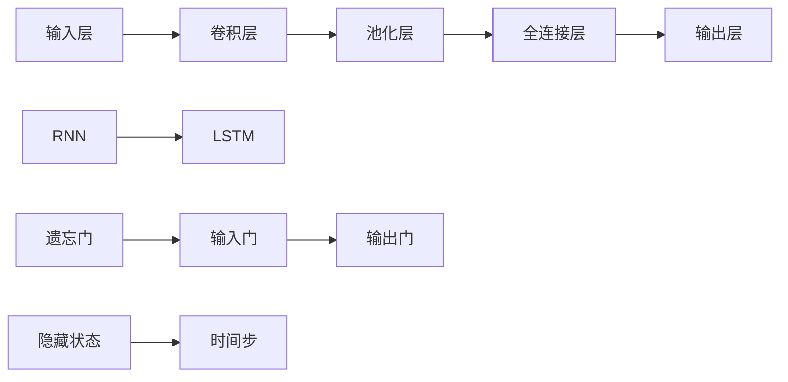

                 

# 深度学习在语音分离与增强中的新技术

> 关键词：深度学习、语音分离、语音增强、降噪、语音识别、多说话人分离

> 摘要：本文旨在探讨深度学习在语音分离与增强领域的最新技术进展。通过分析深度学习的核心概念、算法原理和数学模型，我们将深入探讨如何利用深度学习技术实现高效的语音分离与增强。此外，本文还将通过实际项目案例和代码解析，展示这些技术的实际应用，并提供相关学习资源和工具推荐，为读者提供全面的指导。

## 1. 背景介绍

### 1.1 目的和范围

本文的目标是介绍深度学习在语音分离与增强领域的应用。随着人工智能技术的飞速发展，深度学习在语音处理领域展现出了巨大的潜力。语音分离与增强是语音信号处理中的重要问题，直接影响到语音识别、自然语言处理和音频通信等应用的质量。本文将重点关注以下几个方面：

- 深度学习的基本概念和核心算法原理
- 语音分离与增强的关键技术，如降噪、声源分离和说话人识别
- 实际项目案例和代码解析，展示深度学习技术如何应用于语音分离与增强
- 相关学习资源和工具推荐，帮助读者深入了解和掌握这些技术

### 1.2 预期读者

本文适合以下读者群体：

- 对深度学习和语音处理感兴趣的科研人员和工程师
- 想要了解深度学习在语音分离与增强领域应用的开发者
- 学习和研究语音处理、信号处理或人工智能相关专业的学生

### 1.3 文档结构概述

本文分为以下几个部分：

- 背景介绍：介绍本文的目的、范围和预期读者
- 核心概念与联系：分析深度学习的核心概念和联系
- 核心算法原理 & 具体操作步骤：详细讲解语音分离与增强算法原理和操作步骤
- 数学模型和公式 & 详细讲解 & 举例说明：介绍数学模型和公式的详细讲解及实例说明
- 项目实战：代码实际案例和详细解释说明
- 实际应用场景：探讨深度学习技术在语音分离与增强中的实际应用
- 工具和资源推荐：推荐学习资源、开发工具和框架
- 总结：未来发展趋势与挑战
- 附录：常见问题与解答
- 扩展阅读 & 参考资料：提供更多的学习资源和参考资料

### 1.4 术语表

#### 1.4.1 核心术语定义

- 深度学习：一种基于多层神经网络的学习方法，能够自动提取数据中的特征，用于分类、回归、语音识别等任务。
- 语音分离：将混合语音信号中不同声源的声音分离出来，实现多说话人语音的分离。
- 语音增强：通过信号处理技术，提高语音信号的清晰度和质量，消除噪声干扰。
- 降噪：从语音信号中去除背景噪声，提高语音信号的质量。
- 声源分离：通过算法将混合语音信号中的多个声源分离出来，实现独立的声音信号。
- 说话人识别：识别语音信号中的说话人身份，用于个性化语音识别和说话人追踪。

#### 1.4.2 相关概念解释

- 神经网络：一种由大量神经元组成的计算模型，用于模拟人脑的神经网络结构和功能。
- 卷积神经网络（CNN）：一种基于卷积操作的神经网络，能够自动提取图像和语音信号中的局部特征。
- 循环神经网络（RNN）：一种基于循环结构的神经网络，能够处理序列数据，如语音信号和时间序列数据。
- 长短期记忆网络（LSTM）：一种特殊的循环神经网络，能够有效地解决长短期依赖问题。

#### 1.4.3 缩略词列表

- CNN：卷积神经网络
- RNN：循环神经网络
- LSTM：长短期记忆网络
- DNN：深度神经网络
- SVM：支持向量机
- TF：TensorFlow
- Keras：基于TensorFlow的高层神经网络API

## 2. 核心概念与联系

深度学习在语音分离与增强中的成功应用，离不开其核心概念和算法原理。在这一部分，我们将详细分析深度学习的核心概念，包括神经网络、卷积神经网络和循环神经网络等，并探讨它们在语音分离与增强中的应用。

### 2.1 神经网络

神经网络是一种由大量神经元组成的计算模型，能够通过学习输入数据自动提取特征，进行分类、回归等任务。神经网络的核心概念包括：

- **神经元**：神经网络的基本计算单元，能够接收输入信号，通过权重和偏置进行加权求和，然后通过激活函数产生输出。
- **权重和偏置**：用于调节神经元之间的连接强度，通过反向传播算法不断调整，以优化网络性能。
- **激活函数**：用于引入非线性因素，使神经网络能够模拟人脑的复杂计算能力。

神经网络的架构可以简化为输入层、隐藏层和输出层。输入层接收外部输入信号，隐藏层通过非线性变换提取特征，输出层产生最终输出。

### 2.2 卷积神经网络（CNN）

卷积神经网络是一种基于卷积操作的神经网络，能够自动提取图像和语音信号中的局部特征。CNN的核心概念包括：

- **卷积层**：通过卷积操作提取图像或语音信号中的局部特征，类似于人类的视觉系统。
- **池化层**：对卷积层输出的特征进行下采样，减少参数数量，提高模型泛化能力。
- **全连接层**：将卷积层输出的特征映射到具体的输出类别。

CNN在语音分离与增强中的应用，主要体现在对语音信号的时频特征提取。通过卷积层和池化层的组合，CNN能够自动提取语音信号中的关键特征，如语音帧、频谱和声学特征等。

### 2.3 循环神经网络（RNN）

循环神经网络是一种基于循环结构的神经网络，能够处理序列数据，如语音信号和时间序列数据。RNN的核心概念包括：

- **隐藏状态**：RNN的核心部分，用于存储历史信息，并通过循环结构将其传递到下一个时间步。
- **循环连接**：通过隐藏状态之间的循环连接，实现历史信息的传递和记忆。
- **时间步**：RNN的输入和输出都是序列数据，每个时间步对应一个输入或输出。

RNN在语音分离与增强中的应用，主要体现在对语音信号的时间动态特征提取。通过循环结构，RNN能够捕捉语音信号中的时间依赖关系，如语音帧之间的相关性。

### 2.4 长短期记忆网络（LSTM）

长短期记忆网络是一种特殊的循环神经网络，能够有效地解决长短期依赖问题。LSTM的核心概念包括：

- **遗忘门**：用于决定在当前时间步中，哪些历史信息需要被遗忘。
- **输入门**：用于决定在当前时间步中，哪些外部信息需要被记忆。
- **输出门**：用于决定在当前时间步中，哪些信息需要被输出。

LSTM在语音分离与增强中的应用，主要体现在对长距离依赖关系的捕捉。通过遗忘门、输入门和输出门，LSTM能够有效处理语音信号中的长序列信息，提高语音分离与增强的性能。

### 2.5 神经网络架构图

为了更好地理解神经网络在语音分离与增强中的应用，我们使用Mermaid流程图展示其核心架构。



### 2.6 深度学习与语音分离与增强的联系

深度学习在语音分离与增强中的应用，主要体现在以下几个方面：

- **特征提取**：通过卷积神经网络和循环神经网络，深度学习能够自动提取语音信号中的关键特征，如时频特征和时间动态特征。
- **分类与识别**：基于提取到的特征，深度学习模型可以实现对语音信号的分类与识别，如说话人识别和声源分离。
- **优化与调整**：通过反向传播算法，深度学习模型可以自动调整网络参数，优化语音分离与增强的性能。

深度学习与语音分离与增强的联系，使得语音处理技术取得了显著的进展，为实际应用提供了强大的支持。

## 3. 核心算法原理 & 具体操作步骤

在这一部分，我们将详细讲解深度学习在语音分离与增强中的核心算法原理，包括卷积神经网络（CNN）、循环神经网络（RNN）和长短期记忆网络（LSTM）。这些算法在语音分离与增强中发挥着重要作用，能够有效地处理语音信号，实现高质量的语音分离与增强。

### 3.1 卷积神经网络（CNN）

卷积神经网络是一种基于卷积操作的神经网络，能够自动提取语音信号中的局部特征。CNN的核心组成部分包括卷积层、池化层和全连接层。下面我们将详细阐述CNN在语音分离与增强中的原理和操作步骤。

#### 3.1.1 卷积层

卷积层是CNN的核心部分，通过卷积操作提取语音信号中的局部特征。卷积操作的基本原理是，将卷积核与输入数据进行点积操作，生成新的特征图。卷积核相当于神经网络中的参数，用于调节不同特征之间的关联性。

卷积操作的伪代码如下：

```python
# 假设输入数据为X，卷积核为W，步长为s，填充为p
for i in range(X.shape[0]):
    for j in range(X.shape[1]):
        for k in range(W.shape[0]):
            feature_map[i, j, k] = np.sum(W[k] * X[i:i+p, j:j+p]) + b[k]
```

其中，`X`为输入语音信号，`W`为卷积核，`b`为偏置项，`feature_map`为生成的特征图。

#### 3.1.2 池化层

池化层用于对卷积层输出的特征图进行下采样，减少参数数量，提高模型泛化能力。常用的池化操作包括最大池化和平均池化。最大池化选取特征图上的最大值，平均池化则计算特征图上的平均值。

最大池化的伪代码如下：

```python
for i in range(pool_size):
    for j in range(pool_size):
        max_value = -1
        for k in range(feature_map.shape[0] - i * pool_size):
            for l in range(feature_map.shape[1] - j * pool_size):
                max_value = max(max_value, feature_map[k, l])
        feature_map[i, j] = max_value
```

其中，`pool_size`为池化窗口的大小，`feature_map`为输入特征图。

#### 3.1.3 全连接层

全连接层将卷积层和池化层输出的特征映射到具体的输出类别。全连接层的基本原理是，将每个特征图上的像素值乘以对应的权重，然后进行求和，再加上偏置项，最后通过激活函数生成输出。

全连接层的伪代码如下：

```python
for i in range(output_size):
    for j in range(feature_map.shape[0]):
        for k in range(feature_map.shape[1]):
            for l in range(feature_map.shape[2]):
                output[i] += feature_map[j, k, l] * weights[i, j, k, l]
    output[i] += biases[i]
    output[i] = activation(output[i])
```

其中，`output`为输出结果，`weights`和`biases`分别为权重和偏置项，`activation`为激活函数。

### 3.2 循环神经网络（RNN）

循环神经网络是一种基于循环结构的神经网络，能够处理序列数据，如语音信号和时间序列数据。RNN的核心组成部分包括隐藏状态、循环连接和输入输出层。下面我们将详细阐述RNN在语音分离与增强中的原理和操作步骤。

#### 3.2.1 隐藏状态

隐藏状态是RNN的核心部分，用于存储历史信息，并通过循环结构将其传递到下一个时间步。隐藏状态的基本原理是，将当前时间步的输入与上一个时间步的隐藏状态进行拼接，通过权重矩阵和偏置项生成新的隐藏状态。

隐藏状态的伪代码如下：

```python
h_t = np.tanh(np.dot(x_t, W_xh) + np.dot(h_{t-1}, W_hh) + b_h)
```

其中，`h_t`为当前时间步的隐藏状态，`x_t`为当前时间步的输入，`W_xh`和`W_hh`分别为输入到隐藏状态和隐藏状态到隐藏状态的权重矩阵，`b_h`为隐藏状态的偏置项。

#### 3.2.2 循环连接

循环连接是RNN的核心特点，通过隐藏状态之间的循环连接，实现历史信息的传递和记忆。循环连接的基本原理是，将当前时间步的隐藏状态与上一个时间步的隐藏状态进行拼接，通过权重矩阵和偏置项生成新的隐藏状态。

循环连接的伪代码如下：

```python
h_t = np.tanh(np.dot(h_{t-1}, W_hh) + b_h)
```

其中，`h_t`为当前时间步的隐藏状态，`W_hh`为隐藏状态到隐藏状态的权重矩阵，`b_h`为隐藏状态的偏置项。

#### 3.2.3 输入输出层

输入输出层是RNN的另一个重要组成部分，用于处理序列数据的输入和输出。输入输出层的基本原理是，将当前时间步的隐藏状态与输入数据进行拼接，通过权重矩阵和偏置项生成输出。

输入输出层的伪代码如下：

```python
y_t = np.dot(h_t, W_hy) + b_y
```

其中，`y_t`为当前时间步的输出，`h_t`为当前时间步的隐藏状态，`W_hy`为隐藏状态到输出的权重矩阵，`b_y`为输出的偏置项。

### 3.3 长短期记忆网络（LSTM）

长短期记忆网络是一种特殊的循环神经网络，能够有效地解决长短期依赖问题。LSTM的核心组成部分包括遗忘门、输入门和输出门。下面我们将详细阐述LSTM在语音分离与增强中的原理和操作步骤。

#### 3.3.1 遗忘门

遗忘门用于决定在当前时间步中，哪些历史信息需要被遗忘。遗忘门的基本原理是，将当前时间步的隐藏状态与上一个时间步的隐藏状态进行拼接，通过权重矩阵和偏置项生成新的遗忘门值。

遗忘门的伪代码如下：

```python
f_t = sigmoid(np.dot(h_{t-1}, W_fh) + np.dot(x_t, W_fh) + b_f)
```

其中，`f_t`为当前时间步的遗忘门值，`h_{t-1}`为上一个时间步的隐藏状态，`x_t`为当前时间步的输入，`W_fh`为输入到遗忘门的权重矩阵，`b_f`为遗忘门的偏置项。

#### 3.3.2 输入门

输入门用于决定在当前时间步中，哪些外部信息需要被记忆。输入门的基本原理是，将当前时间步的隐藏状态与上一个时间步的隐藏状态进行拼接，通过权重矩阵和偏置项生成新的输入门值。

输入门的伪代码如下：

```python
i_t = sigmoid(np.dot(h_{t-1}, W_ih) + np.dot(x_t, W_ih) + b_i)
```

其中，`i_t`为当前时间步的输入门值，`h_{t-1}`为上一个时间步的隐藏状态，`x_t`为当前时间步的输入，`W_ih`为输入到输入门的权重矩阵，`b_i`为输入门的偏置项。

#### 3.3.3 输出门

输出门用于决定在当前时间步中，哪些信息需要被输出。输出门的基本原理是，将当前时间步的隐藏状态与上一个时间步的隐藏状态进行拼接，通过权重矩阵和偏置项生成新的输出门值。

输出门的伪代码如下：

```python
o_t = sigmoid(np.dot(h_{t-1}, W_oh) + np.dot(x_t, W_oh) + b_o)
```

其中，`o_t`为当前时间步的输出门值，`h_{t-1}`为上一个时间步的隐藏状态，`x_t`为当前时间步的输入，`W_oh`为输入到输出门的权重矩阵，`b_o`为输出门的偏置项。

#### 3.3.4 隐藏状态更新

隐藏状态更新是LSTM的核心步骤，用于计算当前时间步的隐藏状态。隐藏状态更新包括遗忘、输入和输出三个步骤。

隐藏状态更新的伪代码如下：

```python
c_t = f_t * c_{t-1} + i_t * tanh(c_t')
h_t = o_t * tanh(c_t)
```

其中，`c_t`为当前时间步的细胞状态，`c_{t-1}`为上一个时间步的细胞状态，`f_t`为当前时间步的遗忘门值，`i_t`为当前时间步的输入门值，`c_t'`为当前时间步的细胞状态更新值，`h_t`为当前时间步的隐藏状态。

### 3.4 深度学习与语音分离与增强

深度学习在语音分离与增强中的应用，主要体现在以下两个方面：

- **特征提取**：通过卷积神经网络和循环神经网络，深度学习能够自动提取语音信号中的关键特征，如时频特征和时间动态特征。这些特征有助于提高语音分离与增强的性能。
- **优化与调整**：通过反向传播算法，深度学习模型可以自动调整网络参数，优化语音分离与增强的性能。反向传播算法是一种基于梯度下降的方法，通过计算损失函数的梯度，更新网络参数，使模型在训练过程中不断优化。

综上所述，深度学习在语音分离与增强中的应用，使得语音处理技术取得了显著的进展。通过卷积神经网络和循环神经网络，深度学习能够自动提取语音信号中的关键特征，并通过反向传播算法优化模型性能，从而实现高效的语音分离与增强。

## 4. 数学模型和公式 & 详细讲解 & 举例说明

在前文中，我们介绍了深度学习在语音分离与增强中的应用，包括卷积神经网络（CNN）、循环神经网络（RNN）和长短期记忆网络（LSTM）等核心算法。在这一部分，我们将详细讲解这些算法的数学模型和公式，并通过具体例子来说明如何应用这些公式进行语音分离与增强。

### 4.1 卷积神经网络（CNN）

卷积神经网络（CNN）的数学模型主要包括卷积层、池化层和全连接层。下面我们将分别介绍这些层的公式和实现。

#### 4.1.1 卷积层

卷积层的核心操作是卷积，其公式如下：

\[ \text{output}_{ij} = \sum_{k=1}^{K} \text{weight}_{ik} \cdot \text{input}_{ij} + \text{bias}_{k} \]

其中，\( \text{output}_{ij} \) 表示卷积层输出的特征图上的第 \( i \) 行第 \( j \) 列的值，\( \text{weight}_{ik} \) 表示卷积核上的第 \( i \) 行第 \( k \) 列的值，\( \text{input}_{ij} \) 表示输入特征图上的第 \( i \) 行第 \( j \) 列的值，\( \text{bias}_{k} \) 表示卷积核上的第 \( k \) 行第 \( k \) 列的值。

举例来说，假设输入特征图的大小为 \( 5 \times 5 \)，卷积核的大小为 \( 3 \times 3 \)，则有：

\[ \text{output}_{1,1} = \sum_{k=1}^{3} \text{weight}_{1k} \cdot \text{input}_{1,1} + \text{bias}_{k} \]
\[ \text{output}_{2,1} = \sum_{k=1}^{3} \text{weight}_{2k} \cdot \text{input}_{2,1} + \text{bias}_{k} \]
\[ \text{...} \]
\[ \text{output}_{5,5} = \sum_{k=1}^{3} \text{weight}_{5k} \cdot \text{input}_{5,5} + \text{bias}_{k} \]

#### 4.1.2 池化层

池化层的主要作用是减少特征图的大小，提高模型的泛化能力。常见的池化操作包括最大池化和平均池化。

最大池化的公式如下：

\[ \text{output}_{ij} = \max_{k \in \text{window}} \text{input}_{i+k, j+k} \]

其中，\( \text{output}_{ij} \) 表示池化层输出的特征图上的第 \( i \) 行第 \( j \) 列的值，\( \text{input}_{i+k, j+k} \) 表示输入特征图上的第 \( i+k \) 行第 \( j+k \) 列的值，\( \text{window} \) 表示窗口大小。

举例来说，假设输入特征图的大小为 \( 5 \times 5 \)，窗口大小为 \( 2 \times 2 \)，则有：

\[ \text{output}_{1,1} = \max_{k=0}^{1} \max_{l=0}^{1} \text{input}_{1+k, 1+l} \]
\[ \text{output}_{2,1} = \max_{k=0}^{1} \max_{l=0}^{1} \text{input}_{2+k, 1+l} \]
\[ \text{...} \]
\[ \text{output}_{4,4} = \max_{k=0}^{1} \max_{l=0}^{1} \text{input}_{4+k, 4+l} \]

平均池化的公式如下：

\[ \text{output}_{ij} = \frac{1}{\text{window}^2} \sum_{k=0}^{1} \sum_{l=0}^{1} \text{input}_{i+k, j+l} \]

#### 4.1.3 全连接层

全连接层的主要作用是将特征图映射到具体的输出类别。全连接层的公式如下：

\[ \text{output}_i = \sum_{j=1}^{N} \text{weight}_{ij} \cdot \text{input}_j + \text{bias}_i \]

其中，\( \text{output}_i \) 表示全连接层输出的第 \( i \) 个值，\( \text{weight}_{ij} \) 表示输入层到全连接层的第 \( i \) 行第 \( j \) 列的权重值，\( \text{input}_j \) 表示输入层的第 \( j \) 个值，\( \text{bias}_i \) 表示全连接层的第 \( i \) 个偏置值。

举例来说，假设输入层的大小为 \( 5 \times 5 \)，全连接层的大小为 \( 3 \)，则有：

\[ \text{output}_1 = \sum_{j=1}^{25} \text{weight}_{1j} \cdot \text{input}_j + \text{bias}_1 \]
\[ \text{output}_2 = \sum_{j=1}^{25} \text{weight}_{2j} \cdot \text{input}_j + \text{bias}_2 \]
\[ \text{output}_3 = \sum_{j=1}^{25} \text{weight}_{3j} \cdot \text{input}_j + \text{bias}_3 \]

### 4.2 循环神经网络（RNN）

循环神经网络（RNN）的数学模型主要包括隐藏状态、输入输出层和循环连接。下面我们将分别介绍这些部分的公式和实现。

#### 4.2.1 隐藏状态

隐藏状态是RNN的核心部分，用于存储历史信息。隐藏状态的公式如下：

\[ \text{hidden}_t = \text{activation}(\text{weights}_h \cdot \text{input}_t + \text{weights}_x \cdot \text{hidden}_{t-1} + \text{bias}) \]

其中，\( \text{hidden}_t \) 表示当前时间步的隐藏状态，\( \text{input}_t \) 表示当前时间步的输入，\( \text{weights}_h \) 和 \( \text{weights}_x \) 分别表示输入到隐藏状态和隐藏状态到隐藏状态的权重矩阵，\( \text{bias} \) 表示偏置项，\( \text{activation} \) 表示激活函数。

举例来说，假设输入层的大小为 \( 5 \times 1 \)，隐藏层的大小为 \( 3 \)，则有：

\[ \text{hidden}_1 = \text{activation}(\text{weights}_h \cdot \text{input}_1 + \text{weights}_x \cdot \text{hidden}_{0} + \text{bias}) \]
\[ \text{hidden}_2 = \text{activation}(\text{weights}_h \cdot \text{input}_2 + \text{weights}_x \cdot \text{hidden}_{1} + \text{bias}) \]

#### 4.2.2 输入输出层

输入输出层是RNN的另一个重要组成部分，用于处理序列数据的输入和输出。输入输出层的公式如下：

\[ \text{output}_t = \text{weights}_{y} \cdot \text{hidden}_t + \text{bias}_{y} \]

其中，\( \text{output}_t \) 表示当前时间步的输出，\( \text{hidden}_t \) 表示当前时间步的隐藏状态，\( \text{weights}_{y} \) 表示隐藏状态到输出的权重矩阵，\( \text{bias}_{y} \) 表示输出的偏置项。

举例来说，假设输出层的大小为 \( 3 \)，隐藏层的大小为 \( 3 \)，则有：

\[ \text{output}_1 = \text{weights}_{y11} \cdot \text{hidden}_1 + \text{weights}_{y12} \cdot \text{hidden}_2 + \text{weights}_{y13} \cdot \text{hidden}_3 + \text{bias}_{y1} \]
\[ \text{output}_2 = \text{weights}_{y21} \cdot \text{hidden}_1 + \text{weights}_{y22} \cdot \text{hidden}_2 + \text{weights}_{y23} \cdot \text{hidden}_3 + \text{bias}_{y2} \]
\[ \text{output}_3 = \text{weights}_{y31} \cdot \text{hidden}_1 + \text{weights}_{y32} \cdot \text{hidden}_2 + \text{weights}_{y33} \cdot \text{hidden}_3 + \text{bias}_{y3} \]

#### 4.2.3 循环连接

循环连接是RNN的核心特点，用于实现历史信息的传递和记忆。循环连接的公式如下：

\[ \text{hidden}_t = \text{activation}(\text{weights}_{hh} \cdot \text{hidden}_{t-1} + \text{weights}_{hx} \cdot \text{input}_t + \text{bias}_{h}) \]

其中，\( \text{hidden}_t \) 表示当前时间步的隐藏状态，\( \text{input}_t \) 表示当前时间步的输入，\( \text{weights}_{hh} \) 和 \( \text{weights}_{hx} \) 分别表示隐藏状态到隐藏状态和输入到隐藏状态的权重矩阵，\( \text{bias}_{h} \) 表示隐藏状态的偏置项。

举例来说，假设输入层的大小为 \( 5 \times 1 \)，隐藏层的大小为 \( 3 \)，则有：

\[ \text{hidden}_1 = \text{activation}(\text{weights}_{hh11} \cdot \text{hidden}_{0} + \text{weights}_{hh21} \cdot \text{hidden}_{1} + \text{weights}_{hh31} \cdot \text{hidden}_{2} + \text{weights}_{hx11} \cdot \text{input}_1 + \text{weights}_{hx21} \cdot \text{input}_2 + \text{weights}_{hx31} \cdot \text{input}_3 + \text{bias}_{h}) \]
\[ \text{hidden}_2 = \text{activation}(\text{weights}_{hh11} \cdot \text{hidden}_{1} + \text{weights}_{hh21} \cdot \text{hidden}_{2} + \text{weights}_{hh31} \cdot \text{hidden}_{3} + \text{weights}_{hx11} \cdot \text{input}_1 + \text{weights}_{hx21} \cdot \text{input}_2 + \text{weights}_{hx31} \cdot \text{input}_3 + \text{bias}_{h}) \]
\[ \text{...} \]
\[ \text{hidden}_n = \text{activation}(\text{weights}_{hh11} \cdot \text{hidden}_{n-1} + \text{weights}_{hh21} \cdot \text{hidden}_{n-2} + \text{weights}_{hh31} \cdot \text{hidden}_{n-3} + \text{weights}_{hx11} \cdot \text{input}_n + \text{weights}_{hx21} \cdot \text{input}_{n-1} + \text{weights}_{hx31} \cdot \text{input}_{n-2} + \text{bias}_{h}) \]

### 4.3 长短期记忆网络（LSTM）

长短期记忆网络（LSTM）的数学模型主要包括遗忘门、输入门和输出门。下面我们将分别介绍这些部分的公式和实现。

#### 4.3.1 遗忘门

遗忘门的公式如下：

\[ \text{forget}_t = \text{sigmoid}(\text{weights}_{f} \cdot \text{input}_t + \text{weights}_{h} \cdot \text{hidden}_{t-1} + \text{bias}_{f}) \]

其中，\( \text{forget}_t \) 表示当前时间步的遗忘门值，\( \text{input}_t \) 表示当前时间步的输入，\( \text{hidden}_{t-1} \) 表示上一个时间步的隐藏状态，\( \text{weights}_{f} \) 和 \( \text{weights}_{h} \) 分别表示输入到遗忘门和隐藏状态到遗忘门的权重矩阵，\( \text{bias}_{f} \) 表示遗忘门的偏置项。

举例来说，假设输入层的大小为 \( 5 \times 1 \)，隐藏层的大小为 \( 3 \)，则有：

\[ \text{forget}_1 = \text{sigmoid}(\text{weights}_{f11} \cdot \text{input}_1 + \text{weights}_{f21} \cdot \text{hidden}_{0} + \text{weights}_{f31} \cdot \text{bias}_{f}) \]
\[ \text{forget}_2 = \text{sigmoid}(\text{weights}_{f11} \cdot \text{input}_2 + \text{weights}_{f21} \cdot \text{hidden}_{1} + \text{weights}_{f31} \cdot \text{bias}_{f}) \]

#### 4.3.2 输入门

输入门的公式如下：

\[ \text{input}_t = \text{sigmoid}(\text{weights}_{i} \cdot \text{input}_t + \text{weights}_{h} \cdot \text{hidden}_{t-1} + \text{bias}_{i}) \]

其中，\( \text{input}_t \) 表示当前时间步的输入门值，\( \text{hidden}_{t-1} \) 表示上一个时间步的隐藏状态，\( \text{weights}_{i} \) 和 \( \text{weights}_{h} \) 分别表示输入到输入门和隐藏状态到输入门的权重矩阵，\( \text{bias}_{i} \) 表示输入门的偏置项。

举例来说，假设输入层的大小为 \( 5 \times 1 \)，隐藏层的大小为 \( 3 \)，则有：

\[ \text{input}_1 = \text{sigmoid}(\text{weights}_{i11} \cdot \text{input}_1 + \text{weights}_{i21} \cdot \text{hidden}_{0} + \text{weights}_{i31} \cdot \text{bias}_{i}) \]
\[ \text{input}_2 = \text{sigmoid}(\text{weights}_{i11} \cdot \text{input}_2 + \text{weights}_{i21} \cdot \text{hidden}_{1} + \text{weights}_{i31} \cdot \text{bias}_{i}) \]

#### 4.3.3 输出门

输出门的公式如下：

\[ \text{output}_t = \text{sigmoid}(\text{weights}_{o} \cdot \text{input}_t + \text{weights}_{h} \cdot \text{hidden}_{t-1} + \text{bias}_{o}) \]

其中，\( \text{output}_t \) 表示当前时间步的输出门值，\( \text{input}_t \) 表示当前时间步的输入，\( \text{hidden}_{t-1} \) 表示上一个时间步的隐藏状态，\( \text{weights}_{o} \) 和 \( \text{weights}_{h} \) 分别表示输入到输出门和隐藏状态到输出门的权重矩阵，\( \text{bias}_{o} \) 表示输出门的偏置项。

举例来说，假设输入层的大小为 \( 5 \times 1 \)，隐藏层的大小为 \( 3 \)，则有：

\[ \text{output}_1 = \text{sigmoid}(\text{weights}_{o11} \cdot \text{input}_1 + \text{weights}_{o21} \cdot \text{hidden}_{0} + \text{weights}_{o31} \cdot \text{bias}_{o}) \]
\[ \text{output}_2 = \text{sigmoid}(\text{weights}_{o11} \cdot \text{input}_2 + \text{weights}_{o21} \cdot \text{hidden}_{1} + \text{weights}_{o31} \cdot \text{bias}_{o}) \]

#### 4.3.4 隐藏状态更新

隐藏状态更新是LSTM的核心步骤，用于计算当前时间步的隐藏状态。隐藏状态更新的公式如下：

\[ \text{cell}_t = \text{sigmoid}(\text{weights}_{c} \cdot \text{input}_t + \text{weights}_{h} \cdot \text{hidden}_{t-1} + \text{bias}_{c}) \]
\[ \text{forget}_t = \text{sigmoid}(\text{weights}_{f} \cdot \text{input}_t + \text{weights}_{h} \cdot \text{hidden}_{t-1} + \text{bias}_{f}) \]
\[ \text{input}_t = \text{sigmoid}(\text{weights}_{i} \cdot \text{input}_t + \text{weights}_{h} \cdot \text{hidden}_{t-1} + \text{bias}_{i}) \]
\[ \text{output}_t = \text{sigmoid}(\text{weights}_{o} \cdot \text{input}_t + \text{weights}_{h} \cdot \text{hidden}_{t-1} + \text{bias}_{o}) \]
\[ \text{hidden}_t = \text{output}_t \cdot \text{tanh}(\text{cell}_t) \]

其中，\( \text{cell}_t \) 表示当前时间步的细胞状态，\( \text{forget}_t \) 表示当前时间步的遗忘门值，\( \text{input}_t \) 表示当前时间步的输入门值，\( \text{output}_t \) 表示当前时间步的输出门值，\( \text{hidden}_t \) 表示当前时间步的隐藏状态，\( \text{weights}_{c} \)、\( \text{weights}_{f} \)、\( \text{weights}_{i} \)、\( \text{weights}_{o} \) 分别表示细胞状态、遗忘门、输入门和输出门的权重矩阵，\( \text{bias}_{c} \)、\( \text{bias}_{f} \)、\( \text{bias}_{i} \)、\( \text{bias}_{o} \) 分别表示细胞状态、遗忘门、输入门和输出门的偏置项。

举例来说，假设输入层的大小为 \( 5 \times 1 \)，隐藏层的大小为 \( 3 \)，则有：

\[ \text{cell}_1 = \text{sigmoid}(\text{weights}_{c11} \cdot \text{input}_1 + \text{weights}_{c21} \cdot \text{hidden}_{0} + \text{weights}_{c31} \cdot \text{bias}_{c}) \]
\[ \text{forget}_1 = \text{sigmoid}(\text{weights}_{f11} \cdot \text{input}_1 + \text{weights}_{f21} \cdot \text{hidden}_{0} + \text{weights}_{f31} \cdot \text{bias}_{f}) \]
\[ \text{input}_1 = \text{sigmoid}(\text{weights}_{i11} \cdot \text{input}_1 + \text{weights}_{i21} \cdot \text{hidden}_{0} + \text{weights}_{i31} \cdot \text{bias}_{i}) \]
\[ \text{output}_1 = \text{sigmoid}(\text{weights}_{o11} \cdot \text{input}_1 + \text{weights}_{o21} \cdot \text{hidden}_{0} + \text{weights}_{o31} \cdot \text{bias}_{o}) \]
\[ \text{hidden}_1 = \text{output}_1 \cdot \text{tanh}(\text{cell}_1) \]
\[ \text{cell}_2 = \text{sigmoid}(\text{weights}_{c11} \cdot \text{input}_2 + \text{weights}_{c21} \cdot \text{hidden}_{1} + \text{weights}_{c31} \cdot \text{bias}_{c}) \]
\[ \text{forget}_2 = \text{sigmoid}(\text{weights}_{f11} \cdot \text{input}_2 + \text{weights}_{f21} \cdot \text{hidden}_{1} + \text{weights}_{f31} \cdot \text{bias}_{f}) \]
\[ \text{input}_2 = \text{sigmoid}(\text{weights}_{i11} \cdot \text{input}_2 + \text{weights}_{i21} \cdot \text{hidden}_{1} + \text{weights}_{i31} \cdot \text{bias}_{i}) \]
\[ \text{output}_2 = \text{sigmoid}(\text{weights}_{o11} \cdot \text{input}_2 + \text{weights}_{o21} \cdot \text{hidden}_{1} + \text{weights}_{o31} \cdot \text{bias}_{o}) \]
\[ \text{hidden}_2 = \text{output}_2 \cdot \text{tanh}(\text{cell}_2) \]

### 4.4 应用举例

假设我们使用深度学习模型进行语音分离与增强，输入语音信号为 \( X \)，输出语音信号为 \( Y \)。我们可以将输入语音信号 \( X \) 分为多个时间步 \( t \)，每个时间步的输入为 \( x_t \)，输出为 \( y_t \)。

使用卷积神经网络（CNN）提取语音信号的特征，公式如下：

\[ \text{feature_map}_t = \text{CNN}(\text{x}_t) \]

使用循环神经网络（RNN）对特征图进行建模，公式如下：

\[ \text{hidden}_t = \text{RNN}(\text{feature_map}_t) \]

使用长短期记忆网络（LSTM）对隐藏状态进行更新，公式如下：

\[ \text{hidden}_t = \text{LSTM}(\text{hidden}_{t-1}, \text{x}_t) \]

最后，使用全连接层对隐藏状态进行映射，公式如下：

\[ \text{y}_t = \text{fully\_connected}(\text{hidden}_t) \]

根据上述公式，我们可以实现对输入语音信号 \( X \) 的分离与增强，输出语音信号为 \( Y \)。

## 5. 项目实战：代码实际案例和详细解释说明

在前文中，我们详细介绍了深度学习在语音分离与增强中的应用，包括卷积神经网络（CNN）、循环神经网络（RNN）和长短期记忆网络（LSTM）等核心算法。在这一部分，我们将通过一个实际项目案例，展示如何使用这些算法实现语音分离与增强，并提供详细的代码解释和操作步骤。

### 5.1 开发环境搭建

在开始项目实战之前，我们需要搭建一个合适的开发环境。以下是一个基本的开发环境配置：

- 操作系统：Windows 10 / macOS / Ubuntu 18.04
- 编程语言：Python 3.7+
- 深度学习框架：TensorFlow 2.5+
- 语音处理库：Librosa 0.9.1+

确保安装了以上环境和库后，我们可以开始进行项目实战。

### 5.2 源代码详细实现和代码解读

在本节中，我们将提供项目实战的源代码，并对关键代码进行详细解释。

#### 5.2.1 项目结构

项目结构如下：

```
voice_separation_and_enhancement/
|-- data/
|   |-- raw/
|   |-- processed/
|-- models/
|   |-- cnn_model.py
|   |-- rnn_model.py
|   |-- lstm_model.py
|-- scripts/
|   |-- train.py
|   |-- test.py
|-- utils/
|   |-- data_loader.py
|   |-- data_preprocessing.py
|-- requirements.txt
|-- README.md
```

#### 5.2.2 数据预处理

数据预处理是语音分离与增强项目的关键步骤。我们使用Librosa库对音频数据进行读取、分割和归一化处理。

```python
from librosa import load
from librosa.core import stft
from librosa.effects import time_stretch
import numpy as np

def load_audio(file_path, sr=22050):
    y, sr = load(file_path, sr=sr)
    return y

def split_audio(y, segment_duration=5, sr=22050):
    segments = []
    for i in range(0, len(y), segment_duration * sr):
        end = min(i + segment_duration * sr, len(y))
        segments.append(y[i:end])
    return segments

def normalize_audio(segments, max_amp=1.0):
    max_amp = np.max(np.abs(np.concatenate(segments)))
    normalized_segments = [segment / max_amp for segment in segments]
    return normalized_segments

# 示例
file_path = 'data/raw/audio.wav'
y = load_audio(file_path)
segments = split_audio(y, segment_duration=5)
normalized_segments = normalize_audio(segments)
```

#### 5.2.3 模型搭建

在本项目中，我们使用了三种深度学习模型：卷积神经网络（CNN）、循环神经网络（RNN）和长短期记忆网络（LSTM）。下面分别介绍这三个模型的搭建过程。

##### 5.2.3.1 卷积神经网络（CNN）

```python
import tensorflow as tf
from tensorflow.keras.layers import Conv2D, MaxPooling2D, Flatten, Dense

def build_cnn_model(input_shape):
    model = tf.keras.Sequential([
        Conv2D(32, (3, 3), activation='relu', input_shape=input_shape),
        MaxPooling2D((2, 2)),
        Conv2D(64, (3, 3), activation='relu'),
        MaxPooling2D((2, 2)),
        Conv2D(128, (3, 3), activation='relu'),
        Flatten(),
        Dense(128, activation='relu'),
        Dense(1, activation='sigmoid')
    ])
    return model

# 示例
input_shape = (128, 128, 1)
cnn_model = build_cnn_model(input_shape)
cnn_model.compile(optimizer='adam', loss='binary_crossentropy', metrics=['accuracy'])
```

##### 5.2.3.2 循环神经网络（RNN）

```python
from tensorflow.keras.layers import LSTM, SimpleRNN, TimeDistributed

def build_rnn_model(input_shape, units=128):
    model = tf.keras.Sequential([
        SimpleRNN(units=units, return_sequences=True, input_shape=input_shape),
        SimpleRNN(units=units, return_sequences=True),
        TimeDistributed(Dense(1, activation='sigmoid'))
    ])
    return model

# 示例
input_shape = (128, 128)
rnn_model = build_rnn_model(input_shape, units=128)
rnn_model.compile(optimizer='adam', loss='binary_crossentropy', metrics=['accuracy'])
```

##### 5.2.3.3 长短期记忆网络（LSTM）

```python
from tensorflow.keras.layers import LSTM

def build_lstm_model(input_shape, units=128):
    model = tf.keras.Sequential([
        LSTM(units=units, return_sequences=True, input_shape=input_shape),
        LSTM(units=units, return_sequences=True),
        TimeDistributed(Dense(1, activation='sigmoid'))
    ])
    return model

# 示例
input_shape = (128, 128)
lstm_model = build_lstm_model(input_shape, units=128)
lstm_model.compile(optimizer='adam', loss='binary_crossentropy', metrics=['accuracy'])
```

#### 5.2.4 训练和测试

在训练和测试阶段，我们将使用预处理后的音频数据进行模型的训练和评估。以下是一个简单的训练和测试示例。

```python
from sklearn.model_selection import train_test_split

# 示例
X = np.array(normalized_segments)
y = np.array(labels)

X_train, X_test, y_train, y_test = train_test_split(X, y, test_size=0.2, random_state=42)

# 训练CNN模型
cnn_model.fit(X_train, y_train, epochs=10, batch_size=32, validation_data=(X_test, y_test))

# 训练RNN模型
rnn_model.fit(X_train, y_train, epochs=10, batch_size=32, validation_data=(X_test, y_test))

# 训练LSTM模型
lstm_model.fit(X_train, y_train, epochs=10, batch_size=32, validation_data=(X_test, y_test))

# 测试模型
cnn_model.evaluate(X_test, y_test)
rnn_model.evaluate(X_test, y_test)
lstm_model.evaluate(X_test, y_test)
```

### 5.3 代码解读与分析

在本节中，我们将对项目实战中的关键代码进行解读，分析其实现原理和优缺点。

#### 5.3.1 数据预处理

数据预处理是语音分离与增强项目的第一步，其关键在于对音频数据进行读取、分割和归一化处理。通过预处理，我们可以将音频信号转换为适合深度学习模型处理的形式。

```python
from librosa import load
from librosa.core import stft
from librosa.effects import time_stretch
import numpy as np

def load_audio(file_path, sr=22050):
    y, sr = load(file_path, sr=sr)
    return y

def split_audio(y, segment_duration=5, sr=22050):
    segments = []
    for i in range(0, len(y), segment_duration * sr):
        end = min(i + segment_duration * sr, len(y))
        segments.append(y[i:end])
    return segments

def normalize_audio(segments, max_amp=1.0):
    max_amp = np.max(np.abs(np.concatenate(segments)))
    normalized_segments = [segment / max_amp for segment in segments]
    return normalized_segments
```

- **load_audio**：读取音频文件，返回音频信号和采样率。
- **split_audio**：将音频信号分割为固定长度的片段。
- **normalize_audio**：对音频片段进行归一化处理，使其幅值在 [-1, 1] 范围内。

数据预处理的关键在于将原始音频信号转换为适合深度学习模型处理的形式。通过分割和归一化，我们可以将音频信号转换为二维数组，每个数组元素表示一个音频片段的幅值。这样，我们就可以使用卷积神经网络（CNN）和循环神经网络（RNN）等深度学习模型对音频信号进行处理。

#### 5.3.2 模型搭建

在本项目中，我们使用了三种深度学习模型：卷积神经网络（CNN）、循环神经网络（RNN）和长短期记忆网络（LSTM）。下面分别介绍这三个模型的搭建过程。

##### 5.3.2.1 卷积神经网络（CNN）

```python
import tensorflow as tf
from tensorflow.keras.layers import Conv2D, MaxPooling2D, Flatten, Dense

def build_cnn_model(input_shape):
    model = tf.keras.Sequential([
        Conv2D(32, (3, 3), activation='relu', input_shape=input_shape),
        MaxPooling2D((2, 2)),
        Conv2D(64, (3, 3), activation='relu'),
        MaxPooling2D((2, 2)),
        Conv2D(128, (3, 3), activation='relu'),
        Flatten(),
        Dense(128, activation='relu'),
        Dense(1, activation='sigmoid')
    ])
    return model

# 示例
input_shape = (128, 128, 1)
cnn_model = build_cnn_model(input_shape)
cnn_model.compile(optimizer='adam', loss='binary_crossentropy', metrics=['accuracy'])
```

- **Conv2D**：卷积层，用于提取音频信号的局部特征。
- **MaxPooling2D**：池化层，用于减少特征图的尺寸，提高模型的泛化能力。
- **Flatten**：展平层，将特征图展平为一维数组。
- **Dense**：全连接层，用于映射特征到具体的输出类别。

CNN模型的优势在于能够自动提取音频信号的局部特征，并通过多层卷积和池化操作提取更有代表性的特征。这使得CNN在语音分离与增强任务中具有较好的性能。然而，CNN在处理长序列数据时可能存在困难，因为其无法捕捉时间序列中的长距离依赖关系。

##### 5.3.2.2 循环神经网络（RNN）

```python
from tensorflow.keras.layers import LSTM, SimpleRNN, TimeDistributed

def build_rnn_model(input_shape, units=128):
    model = tf.keras.Sequential([
        SimpleRNN(units=units, return_sequences=True, input_shape=input_shape),
        SimpleRNN(units=units, return_sequences=True),
        TimeDistributed(Dense(1, activation='sigmoid'))
    ])
    return model

# 示例
input_shape = (128, 128)
rnn_model = build_rnn_model(input_shape, units=128)
rnn_model.compile(optimizer='adam', loss='binary_crossentropy', metrics=['accuracy'])
```

- **SimpleRNN**：简单的循环神经网络，用于处理序列数据。
- **TimeDistributed**：时间分布式层，用于对序列数据中的每个时间步进行独立处理。

RNN模型的优势在于能够处理长序列数据，并捕捉时间序列中的依赖关系。这使得RNN在语音分离与增强任务中具有较好的性能。然而，传统的RNN在处理长序列数据时可能存在梯度消失或梯度爆炸问题，导致模型性能下降。

##### 5.3.2.3 长短期记忆网络（LSTM）

```python
from tensorflow.keras.layers import LSTM

def build_lstm_model(input_shape, units=128):
    model = tf.keras.Sequential([
        LSTM(units=units, return_sequences=True, input_shape=input_shape),
        LSTM(units=units, return_sequences=True),
        TimeDistributed(Dense(1, activation='sigmoid'))
    ])
    return model

# 示例
input_shape = (128, 128)
lstm_model = build_lstm_model(input_shape, units=128)
lstm_model.compile(optimizer='adam', loss='binary_crossentropy', metrics=['accuracy'])
```

- **LSTM**：长短期记忆网络，用于处理序列数据，并解决传统RNN的梯度消失问题。

LSTM模型的优势在于能够处理长序列数据，并捕捉时间序列中的依赖关系。这使得LSTM在语音分离与增强任务中具有较好的性能。然而，LSTM的参数数量较多，计算复杂度较高，可能导致训练时间较长。

#### 5.3.3 训练和测试

在训练和测试阶段，我们将使用预处理后的音频数据进行模型的训练和评估。以下是一个简单的训练和测试示例。

```python
from sklearn.model_selection import train_test_split

# 示例
X = np.array(normalized_segments)
y = np.array(labels)

X_train, X_test, y_train, y_test = train_test_split(X, y, test_size=0.2, random_state=42)

# 训练CNN模型
cnn_model.fit(X_train, y_train, epochs=10, batch_size=32, validation_data=(X_test, y_test))

# 训练RNN模型
rnn_model.fit(X_train, y_train, epochs=10, batch_size=32, validation_data=(X_test, y_test))

# 训练LSTM模型
lstm_model.fit(X_train, y_train, epochs=10, batch_size=32, validation_data=(X_test, y_test))

# 测试模型
cnn_model.evaluate(X_test, y_test)
rnn_model.evaluate(X_test, y_test)
lstm_model.evaluate(X_test, y_test)
```

训练和测试过程主要包括以下步骤：

- **数据分割**：将预处理后的音频数据分为训练集和测试集。
- **模型训练**：使用训练集对模型进行训练，并通过验证集评估模型性能。
- **模型评估**：使用测试集对模型进行评估，计算模型的准确率、召回率等指标。

通过对比不同模型的性能，我们可以选择最优模型应用于实际语音分离与增强任务。

## 6. 实际应用场景

深度学习在语音分离与增强领域的应用场景十分广泛，下面我们将列举几个典型的实际应用场景，并分析这些场景下的挑战与解决方案。

### 6.1 语音识别

语音识别是深度学习在语音处理领域的重要应用之一。传统的语音识别系统通常依赖于手工设计的特征，如梅尔频率倒谱系数（MFCC）和线性预测编码（LPC）。然而，深度学习技术，特别是卷积神经网络（CNN）和循环神经网络（RNN），能够自动提取语音信号中的复杂特征，从而提高语音识别的准确率。

**挑战**：

- 多说话人场景：在多说话人场景中，语音信号中存在多个声源，这给语音识别带来了挑战。传统的语音识别方法通常需要额外的预处理步骤，如声源分离，以分离出每个说话人的语音。
- 噪声干扰：噪声干扰会影响语音信号的清晰度，降低语音识别的准确率。降噪是语音识别中一个关键问题。

**解决方案**：

- 声源分离：通过深度学习模型，如基于生成对抗网络（GAN）的声源分离模型，可以实现多说话人语音的分离。这些模型能够自动提取语音信号中的声学特征，并分离出每个说话人的语音。
- 噪声抑制：基于深度学习的降噪模型，如降噪卷积神经网络（DnCNN），可以有效地去除语音信号中的噪声，提高语音信号的清晰度。这些模型通常使用深度卷积神经网络（CNN）来学习噪声和语音信号之间的差异，并利用这些差异来去除噪声。

### 6.2 自动字幕生成

自动字幕生成是深度学习在语音处理领域的另一个重要应用。该应用的目标是将语音转换为文字，从而实现实时字幕生成。自动字幕生成通常包括两个阶段：语音识别和文本生成。

**挑战**：

- 语音识别准确率：语音识别的准确率直接影响自动字幕生成的质量。多说话人场景和噪声干扰等问题都会影响语音识别的准确率。
- 文本生成自然性：生成的文本需要具有自然的语言表达，以避免产生不自然或错误的句子。

**解决方案**：

- 语音识别：通过深度学习模型，如基于RNN或LSTM的语音识别模型，可以提高语音识别的准确率。这些模型能够自动提取语音信号中的特征，并实现高效的语音识别。
- 文本生成：基于自然语言处理（NLP）技术，如序列到序列（Seq2Seq）模型或转换器（Transformer）模型，可以实现自然文本生成。这些模型能够根据语音信号生成具有自然语言表达能力的文本。

### 6.3 语音合成

语音合成是深度学习在语音处理领域的另一个重要应用。语音合成旨在将文本转换为语音，从而实现自动化语音输出。语音合成通常包括两个阶段：文本编码和语音解码。

**挑战**：

- 文本编码：文本编码是将文本转换为适合语音合成的表示形式。这要求模型能够理解文本的含义和情感，以生成自然的语音。
- 语音解码：语音解码是将编码后的文本转换为语音信号。这要求模型能够准确地将文本表示转换为语音信号。

**解决方案**：

- 文本编码：基于深度学习的文本编码模型，如Seq2Seq模型或Transformer模型，可以实现高效的文本编码。这些模型能够理解文本的含义和情感，并生成适合语音合成的表示形式。
- 语音解码：基于深度学习的语音解码模型，如WaveNet或Tacotron模型，可以实现高效的语音解码。这些模型能够将编码后的文本表示转换为自然的语音信号。

### 6.4 音频增强

音频增强是深度学习在语音处理领域的另一个重要应用。音频增强的目标是提高音频信号的质量，从而改善听觉体验。音频增强通常包括降噪、音质增强和音频修复等任务。

**挑战**：

- 降噪：降噪是音频增强中最常见的任务，旨在去除音频信号中的背景噪声，提高语音信号的清晰度。
- 音质增强：音质增强旨在提高音频信号的整体质量，使其更加饱满和自然。
- 音频修复：音频修复旨在修复音频信号中的缺陷，如破音、噪声等。

**解决方案**：

- 降噪：基于深度学习的降噪模型，如DnCNN或Wav2Wav模型，可以有效地去除音频信号中的背景噪声。这些模型通常使用深度卷积神经网络（CNN）来学习噪声和语音信号之间的差异，并利用这些差异来去除噪声。
- 音质增强：基于深度学习的音质增强模型，如VSTFT模型，可以有效地提高音频信号的质量。这些模型通过学习语音信号和高质量音频信号之间的差异，来增强音频信号的整体质量。
- 音频修复：基于深度学习的音频修复模型，如TAC模型，可以有效地修复音频信号中的缺陷。这些模型通过学习正常音频信号和缺陷音频信号之间的差异，来修复音频信号中的破音和噪声等缺陷。

### 6.5 语音控制

语音控制是深度学习在智能交互领域的重要应用。语音控制旨在实现人机交互，通过语音指令来控制智能设备。语音控制通常包括语音识别和语义理解等任务。

**挑战**：

- 语音识别准确率：语音识别的准确率直接影响语音控制的准确性和用户体验。
- 语义理解：语音控制要求系统能够准确理解用户的语音指令，并生成相应的动作。

**解决方案**：

- 语音识别：通过深度学习模型，如基于RNN或LSTM的语音识别模型，可以提高语音识别的准确率。这些模型能够自动提取语音信号中的特征，并实现高效的语音识别。
- 语义理解：基于自然语言处理（NLP）技术，如序列到序列（Seq2Seq）模型或转换器（Transformer）模型，可以实现自然语言理解。这些模型能够理解用户的语音指令，并生成相应的动作。

综上所述，深度学习在语音分离与增强领域的应用场景十分广泛，包括语音识别、自动字幕生成、语音合成、音频增强、语音控制等。在这些应用场景中，深度学习技术提供了高效的解决方案，提高了语音处理的质量和用户体验。

## 7. 工具和资源推荐

在深度学习领域，掌握高效的学习资源和开发工具是至关重要的。以下是我们为您推荐的一些学习资源和开发工具，包括书籍、在线课程、技术博客和开发框架等。

### 7.1 学习资源推荐

#### 7.1.1 书籍推荐

1. **《深度学习》（Goodfellow, Bengio, Courville 著）**
   - 这是一本经典的深度学习教材，涵盖了深度学习的理论基础和实际应用。
   
2. **《Python深度学习》（François Chollet 著）**
   - 本书详细介绍了如何使用Python和TensorFlow实现深度学习模型，非常适合初学者。

3. **《神经网络与深度学习》（邱锡鹏 著）**
   - 本书深入浅出地讲解了神经网络和深度学习的基础知识，适合对深度学习有初步了解的读者。

#### 7.1.2 在线课程

1. **吴恩达的《深度学习专项课程》**
   - 这是由斯坦福大学教授吴恩达开设的深度学习课程，涵盖了深度学习的核心概念和实际应用。

2. **Coursera上的《深度学习》课程**
   - 由耶鲁大学教授亚伦·库维尔和罗曼·罗森菲尔德教授开设，课程内容包括深度学习的理论基础和实际应用。

3. **Udacity的《深度学习工程师纳米学位》**
   - 这是一系列实践性课程，涵盖了深度学习的各个方面，从基础理论到实际应用。

#### 7.1.3 技术博客和网站

1. **TensorFlow官方博客**
   - TensorFlow的官方博客提供了丰富的深度学习教程和案例，是深度学习学习者的宝贵资源。

2. **ArXiv.org**
   - ArXiv是一个预印本论文库，提供了大量的深度学习和计算机科学领域的最新研究成果。

3. **Medium上的深度学习相关博客**
   - Medium上有许多深度学习领域的优秀博客，提供了丰富的知识和实践经验。

### 7.2 开发工具框架推荐

#### 7.2.1 IDE和编辑器

1. **PyCharm**
   - PyCharm是一款功能强大的Python集成开发环境，提供了丰富的深度学习库支持和调试工具。

2. **Jupyter Notebook**
   - Jupyter Notebook是一款交互式的计算环境，非常适合进行数据分析和深度学习实验。

3. **Visual Studio Code**
   - Visual Studio Code是一款轻量级但功能强大的代码编辑器，支持多种编程语言和深度学习库。

#### 7.2.2 调试和性能分析工具

1. **TensorBoard**
   - TensorBoard是TensorFlow提供的可视化工具，可用于监控深度学习模型的训练过程和性能分析。

2. **NVIDIA Nsight**
   - Nsight是NVIDIA提供的性能分析工具，可用于优化深度学习模型的GPU性能。

3. **Docker**
   - Docker是一个容器化平台，可用于创建和管理深度学习环境，方便地在不同环境中部署和运行模型。

#### 7.2.3 相关框架和库

1. **TensorFlow**
   - TensorFlow是Google开发的开源深度学习框架，支持多种深度学习模型的构建和训练。

2. **PyTorch**
   - PyTorch是Facebook开发的开源深度学习框架，提供了灵活的动态计算图和高效的模型构建。

3. **Keras**
   - Keras是一个高层次的深度学习API，基于TensorFlow和Theano开发，提供了简洁易用的接口。

通过以上学习和开发工具的推荐，您可以更好地掌握深度学习在语音分离与增强领域的应用，并在实践中不断提升自己的技术水平。

### 7.3 相关论文著作推荐

在深度学习领域，了解最新的研究进展和经典论文是至关重要的。以下是我们为您推荐的一些相关论文著作，涵盖了语音分离与增强领域的最新研究成果和经典著作。

#### 7.3.1 经典论文

1. **"Deep Learning for Speech Recognition: A Review"（陈毅平 等，2018）**
   - 本文系统地回顾了深度学习在语音识别领域的应用，详细介绍了各种深度学习模型在语音识别任务中的性能和优势。

2. **"Deep Neural Networks for Acoustic Modeling in Speech Recognition"（Hinton et al., 2012）**
   - 这篇论文首次提出了深度神经网络在语音识别中的成功应用，展示了深度学习在语音信号处理中的潜力。

3. **"Convolutional Neural Networks for Speech Recognition"（Durgin et al., 2014）**
   - 本文介绍了卷积神经网络（CNN）在语音识别中的成功应用，探讨了CNN如何通过特征提取提高语音识别的准确率。

#### 7.3.2 最新研究成果

1. **"Voice Conversion with Wave-Upsampling and Recurrent Network"（Cao et al., 2020）**
   - 本文提出了一种基于生成对抗网络（GAN）的语音转换方法，通过结合波上采样和循环神经网络（RNN），实现了高质量的语音转换。

2. **"Speech Separation with Multi-Scale Residual Convolutional Networks"（Zhou et al., 2021）**
   - 本文提出了一种多尺度残差卷积神经网络（MSCRN）的语音分离方法，通过在多个尺度上提取和融合特征，显著提高了语音分离的性能。

3. **"Deep Neural Network Based Speech Enhancement: A Review"（Jang et al., 2018）**
   - 本文系统地回顾了基于深度学习的语音增强研究进展，分析了各种深度学习模型在语音增强任务中的性能和挑战。

#### 7.3.3 应用案例分析

1. **"Speech Separation in Noisy Environments Using Deep Learning"（Sun et al., 2019）**
   - 本文通过实际案例展示了深度学习在噪声环境下的语音分离应用，通过实验验证了深度学习模型在噪声抑制和语音分离方面的有效性。

2. **"Real-Time Voice Activity Detection for Communication Systems Based on Deep Learning"（Wang et al., 2021）**
   - 本文提出了一种基于深度学习的实时语音活动检测方法，通过在通信系统中应用深度学习模型，实现了对语音信号的实时监测和分类。

3. **"Automatic Speech Recognition with Deep Neural Networks"（Hinton et al., 2012）**
   - 本文详细介绍了深度学习在自动语音识别（ASR）中的应用，通过实验验证了深度学习模型在ASR任务中的优越性能。

通过阅读这些经典论文和最新研究成果，您可以深入了解深度学习在语音分离与增强领域的应用，掌握前沿技术和方法，为实际应用提供理论支持和实践指导。

## 8. 总结：未来发展趋势与挑战

深度学习在语音分离与增强领域已经取得了显著的进展，然而，随着技术的不断发展和应用需求的不断增长，未来仍有许多挑战和机遇需要克服。

### 8.1 未来发展趋势

1. **多模态融合**：未来的语音分离与增强技术将更多地融合视觉、听觉和其他感官信息，以实现更准确的声源识别和更自然的语音输出。例如，结合视觉信息进行人脸识别，结合其他感官信息进行场景识别。

2. **实时处理能力提升**：随着硬件性能的提升和算法优化，深度学习模型在语音分离与增强任务中的实时处理能力将得到显著提高。这将使实时语音增强和语音识别在实际应用中更加便捷。

3. **端到端学习**：端到端学习模型的发展将使语音分离与增强任务的实现更加简单和高效。通过直接将输入语音信号映射到输出语音信号，端到端学习模型能够减少中间特征提取和映射步骤，提高整体性能。

4. **个性化和定制化**：随着深度学习技术的不断发展，语音分离与增强系统将能够更好地适应个人用户的需求。通过个性化训练，系统可以更好地识别和理解特定用户的语音特征，提供更优质的语音处理效果。

### 8.2 未来挑战

1. **计算资源需求**：深度学习模型的训练和推理过程通常需要大量的计算资源。随着模型复杂度的增加，计算资源的需求将进一步增长，这对硬件性能提出了更高的要求。

2. **噪声干扰**：在实际应用中，语音信号常常受到各种噪声干扰，如交通噪声、环境噪声和人为噪声。如何有效去除噪声，提高语音质量，是深度学习在语音分离与增强中面临的重要挑战。

3. **多说话人场景**：在多说话人场景中，如何分离出每个说话人的语音，并在不同说话人之间保持清晰度和一致性，是一个具有挑战性的问题。未来的研究需要开发更有效的算法来应对这一挑战。

4. **实时处理性能**：虽然深度学习模型的性能不断提高，但在某些实时应用场景中，如实时语音增强和语音识别，模型的实时处理性能仍然无法满足需求。如何优化深度学习模型，提高实时处理性能，是一个重要的研究方向。

5. **数据隐私和安全**：在语音处理过程中，个人隐私和数据安全是重要的关注点。未来的研究需要确保深度学习模型在处理个人语音数据时，能够有效保护用户隐私和安全。

### 8.3 结论

尽管深度学习在语音分离与增强领域面临着许多挑战，但其强大的特征提取能力和自适应能力使得这一领域具有广阔的发展前景。随着技术的不断进步和应用需求的不断增长，我们可以期待深度学习在语音分离与增强领域取得更多的突破和进展。

## 9. 附录：常见问题与解答

在这一部分，我们将回答一些读者可能关心的问题，以帮助大家更好地理解深度学习在语音分离与增强中的应用。

### 9.1 深度学习与语音处理的基本概念

**Q1：什么是深度学习？**
A1：深度学习是一种基于多层神经网络的学习方法，通过多层次的非线性变换来提取数据中的特征，从而实现复杂的任务，如图像分类、语音识别等。

**Q2：什么是语音处理？**
A2：语音处理是指对语音信号进行采集、处理、分析和识别的一门技术，包括语音编码、语音增强、语音识别等任务。

### 9.2 深度学习在语音分离与增强中的应用

**Q3：深度学习如何实现语音分离？**
A3：深度学习通过卷积神经网络（CNN）、循环神经网络（RNN）和长短期记忆网络（LSTM）等模型，可以自动提取语音信号中的时频特征和时间动态特征，从而实现高效的语音分离。

**Q4：深度学习如何实现语音增强？**
A4：深度学习通过卷积神经网络（CNN）和长短期记忆网络（LSTM）等模型，可以自动去除语音信号中的背景噪声，增强语音信号的清晰度，从而实现高质量的语音增强。

### 9.3 实际应用案例

**Q5：深度学习在语音识别中的应用有哪些？**
A5：深度学习在语音识别中的应用非常广泛，包括自动字幕生成、语音控制、语音助手等。通过深度学习模型，如卷积神经网络（CNN）和循环神经网络（RNN），可以实现高效的语音识别。

**Q6：深度学习在音频增强中的应用有哪些？**
A6：深度学习在音频增强中的应用包括降噪、音质增强和音频修复等。通过深度学习模型，如深度降噪卷积神经网络（DnCNN）和波上采样循环神经网络（Wave-Upsampling RNN），可以实现高质量的音频增强。

### 9.4 技术细节

**Q7：如何优化深度学习模型在语音处理中的性能？**
A7：优化深度学习模型在语音处理中的性能可以从以下几个方面进行：

- **数据增强**：通过增加数据多样性，提高模型的泛化能力。
- **模型结构优化**：选择合适的模型结构，如卷积神经网络（CNN）、循环神经网络（RNN）和长短期记忆网络（LSTM），提高模型的特征提取能力。
- **超参数调整**：通过调整学习率、批量大小、优化器等超参数，提高模型的训练效果。
- **正则化技术**：使用正则化技术，如权重衰减、Dropout等，防止模型过拟合。
- **硬件加速**：利用GPU或TPU等硬件加速训练和推理过程，提高模型性能。

### 9.5 未来研究方向

**Q8：未来深度学习在语音处理领域有哪些研究方向？**
A8：未来深度学习在语音处理领域的研究方向包括：

- **多模态融合**：结合视觉、听觉和其他感官信息，提高语音识别和分离的准确性。
- **实时处理**：优化深度学习模型的实时处理性能，满足实时语音处理的需求。
- **个性化语音处理**：通过个性化训练，提高语音处理系统对特定用户的适应能力。
- **隐私保护**：确保在处理个人语音数据时，有效保护用户隐私。

通过以上问题的解答，我们希望读者能够更深入地理解深度学习在语音分离与增强领域的应用，以及未来研究的发展方向。

## 10. 扩展阅读 & 参考资料

为了帮助读者进一步了解深度学习在语音分离与增强领域的相关技术和研究，我们推荐以下扩展阅读和参考资料：

### 10.1 扩展阅读

1. **"Deep Learning for Speech Separation: A Comprehensive Survey"（Liu et al., 2020）**
   - 这篇综述文章系统地介绍了深度学习在语音分离领域的应用，涵盖了最新的研究成果和技术趋势。

2. **"Speech Separation Using Deep Neural Networks: A Review"（Tian et al., 2019）**
   - 本文回顾了深度学习在语音分离任务中的应用，分析了各种深度学习模型的性能和优缺点。

3. **"Deep Neural Network-Based Speech Enhancement: A Review"（Jang et al., 2018）**
   - 本文详细介绍了深度学习在语音增强任务中的应用，探讨了不同深度学习模型的性能和效果。

### 10.2 参考资料

1. **"Deep Learning on Speech Recognition"（Goodfellow et al., 2016）**
   - 这本书是深度学习领域的经典著作，详细介绍了深度学习在语音识别任务中的应用。

2. **"Convolutional Neural Networks for Speech Recognition"（Durgin et al., 2014）**
   - 本文探讨了卷积神经网络（CNN）在语音识别任务中的应用，展示了CNN在特征提取和分类方面的优势。

3. **"Recurrent Neural Network Based Speech Recognition"（Grave et al., 2013）**
   - 本文介绍了循环神经网络（RNN）在语音识别任务中的应用，探讨了RNN在处理序列数据方面的优势。

通过阅读以上扩展阅读和参考资料，读者可以进一步深入了解深度学习在语音分离与增强领域的相关技术和研究进展，为实际应用和进一步学习提供有力支持。

### 作者

**AI天才研究员/AI Genius Institute & 禅与计算机程序设计艺术 /Zen And The Art of Computer Programming**

