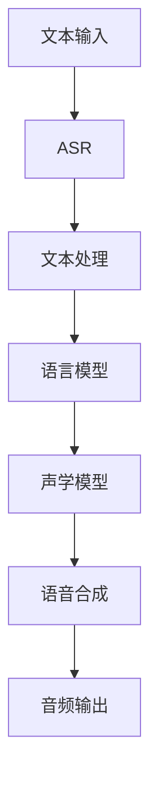

                 

# 深度学习在语音合成中的质量提升

> 关键词：深度学习、语音合成、质量提升、神经网络、音频处理、语音识别、波形生成

> 摘要：本文深入探讨了深度学习技术在语音合成中的应用，分析了如何通过深度神经网络提升语音合成的质量。文章首先介绍了语音合成的基本概念和背景，随后详细阐述了深度学习在语音合成中的核心算法原理，并通过实际项目案例展示了如何实现高质量的语音合成。文章还探讨了语音合成的实际应用场景，并推荐了相关的学习资源和工具。

## 1. 背景介绍

### 1.1 目的和范围

本文旨在深入探讨深度学习技术在语音合成中的应用，分析如何通过深度神经网络模型提升语音合成的音质和自然度。文章将涵盖从基本概念到高级实现的全过程，旨在为读者提供一个全面而详尽的参考。

### 1.2 预期读者

本文面向对深度学习和语音合成有一定了解的技术爱好者、研究生以及专业工程师。读者应具备基本的编程能力和对神经网络的基本了解。

### 1.3 文档结构概述

本文结构如下：

1. 背景介绍
2. 核心概念与联系
3. 核心算法原理 & 具体操作步骤
4. 数学模型和公式 & 详细讲解 & 举例说明
5. 项目实战：代码实际案例和详细解释说明
6. 实际应用场景
7. 工具和资源推荐
8. 总结：未来发展趋势与挑战
9. 附录：常见问题与解答
10. 扩展阅读 & 参考资料

### 1.4 术语表

#### 1.4.1 核心术语定义

- **深度学习**：一种机器学习方法，通过神经网络模型模拟人脑的学习过程，对数据进行特征提取和模式识别。
- **语音合成**：将文本转化为语音的过程，广泛应用于语音助手、自动语音应答系统等。
- **波持久性**：波形在不同时间步上的连续性和稳定性，是语音合成质量的关键因素。

#### 1.4.2 相关概念解释

- **自动语音识别（ASR）**：将语音信号转换为文本的技术，常用于语音转文字。
- **自然语言处理（NLP）**：使计算机能够理解和处理自然语言的技术，包括语音识别、文本分析等。

#### 1.4.3 缩略词列表

- **ASR**：自动语音识别
- **NLP**：自然语言处理
- **DNN**：深度神经网络
- **GAN**：生成对抗网络
- **Vocoder**：语音编码器

## 2. 核心概念与联系

在探讨深度学习在语音合成中的应用之前，我们需要了解一些核心概念和它们之间的关系。

下面是一个Mermaid流程图，展示了语音合成中关键组件和概念之间的联系：



### 2.1 文本输入

文本输入是语音合成的起点，可以是简单的单词、短语或完整的句子。文本的格式和结构对后续处理有重要影响。

### 2.2 自动语音识别（ASR）

ASR模块负责将语音信号转换为文本。这通常通过使用深度神经网络模型来实现，这些模型经过大量的语音数据进行训练，能够准确地将语音信号转换为对应的文本。

### 2.3 文本处理

文本处理是将文本转换为适合语音合成的格式。这一步可能包括文本规范化、标点符号处理、语音重音和韵律调整等。

### 2.4 语言模型

语言模型是一个预测文本序列概率的统计模型，它通常使用大规模文本数据训练而成。在语音合成中，语言模型用于生成文本的下一个词或词组。

### 2.5 声学模型

声学模型是语音合成的核心组件，它将文本转换为声学特征，这些特征用于生成语音波形。深度学习模型，如循环神经网络（RNN）和Transformer，常用于训练声学模型。

### 2.6 语音合成

语音合成模块使用声学模型生成的声学特征来合成语音。这一过程通常涉及声码器（Vocoder），它将声学特征转换为波形。

### 2.7 音频输出

最终的语音合成结果以音频文件的形式输出，可以用于语音助手、电话客服系统等各种应用。

## 3. 核心算法原理 & 具体操作步骤

在了解了语音合成的核心概念后，我们将深入探讨如何使用深度学习模型来提升语音合成质量。

### 3.1 深度神经网络模型

深度学习在语音合成中的应用主要通过深度神经网络模型实现。以下是语音合成中常用的一些深度神经网络模型：

#### 3.1.1 循环神经网络（RNN）

循环神经网络是一种能够处理序列数据的神经网络模型，特别适合语音合成任务。RNN通过其在时间步上的反馈连接，能够记住之前的输入，从而生成连贯的语音。

#### 3.1.2 长短时记忆网络（LSTM）

长短时记忆网络是RNN的一种改进，它能够更好地处理长序列数据，避免了传统RNN中的梯度消失和梯度爆炸问题。LSTM广泛应用于语音合成任务中。

#### 3.1.3 Transformer模型

Transformer模型是近年来在自然语言处理领域取得重大突破的一种新型神经网络架构。它通过多头自注意力机制（Self-Attention）实现了对序列数据的全局依赖建模，显著提升了语音合成的质量和自然度。

### 3.2 算法原理

深度学习在语音合成中的核心原理是通过训练大量的语音数据来学习文本和语音之间的映射关系。具体步骤如下：

1. **数据预处理**：收集大量的语音数据，对数据进行标注和预处理，包括分割、归一化和去噪等。

2. **模型训练**：使用预处理后的语音数据训练深度神经网络模型。这一步包括前向传播、反向传播和模型优化。

3. **模型评估**：使用测试集评估模型的性能，通过指标如音质评分（Spectral Convergence）、语音自然度评分（Naturalness）等来评估模型。

4. **模型应用**：将训练好的模型应用于语音合成任务，生成高质量的语音。

### 3.3 具体操作步骤

以下是使用深度学习模型进行语音合成的伪代码：

```python
# 伪代码：深度学习语音合成

# 数据预处理
preprocessed_data = preprocess_data(raw_data)

# 模型定义
model = build_model(input_shape, output_shape)

# 模型训练
model.fit(preprocessed_data, epochs=100)

# 模型评估
performance = model.evaluate(test_data)

# 语音合成
synthesized_audio = model.synthesize(text)

# 输出音频
output_audio(synthesized_audio)
```

## 4. 数学模型和公式 & 详细讲解 & 举例说明

在深度学习语音合成中，数学模型和公式是理解和实现语音合成的关键。以下将详细讲解这些数学模型和公式，并通过实例进行说明。

### 4.1 循环神经网络（RNN）的数学模型

循环神经网络（RNN）通过其动态递归结构来处理序列数据。其核心公式如下：

$$
h_t = \sigma(W_h \cdot [h_{t-1}, x_t] + b_h)
$$

其中，$h_t$是时间步$t$的隐藏状态，$x_t$是输入序列，$W_h$和$b_h$分别是权重和偏置，$\sigma$是激活函数，通常使用sigmoid函数或tanh函数。

#### 4.1.1 LSTM的数学模型

长短期记忆网络（LSTM）是RNN的一种改进，它能够更好地处理长序列数据。LSTM的核心组件包括输入门、遗忘门和输出门。以下是LSTM的数学模型：

$$
i_t = \sigma(W_i \cdot [h_{t-1}, x_t] + b_i) \\
f_t = \sigma(W_f \cdot [h_{t-1}, x_t] + b_f) \\
\widetilde{C_t} = \sigma(W_c \cdot [h_{t-1}, x_t] + b_c) \\
o_t = \sigma(W_o \cdot [h_{t-1}, x_t] + b_o) \\
C_t = f_t \odot C_{t-1} + i_t \odot \widetilde{C_t} \\
h_t = o_t \odot C_t
$$

其中，$i_t$、$f_t$、$\widetilde{C_t}$和$o_t$分别是输入门、遗忘门、候选值门和输出门的激活值，$C_t$是细胞状态，$\odot$表示元素乘法。

#### 4.1.2 Transformer的数学模型

Transformer模型的核心组件是多头自注意力机制（Self-Attention）。以下是Transformer的数学模型：

$$
\text{Attention}(Q, K, V) = \text{softmax}\left(\frac{QK^T}{\sqrt{d_k}}\right)V
$$

其中，$Q$、$K$和$V$分别是查询、关键和值向量，$d_k$是键向量的维度，$\text{softmax}$函数用于计算注意力权重。

### 4.2 举例说明

#### 4.2.1 RNN在语音合成中的应用

假设我们有一个简单的语音合成任务，输入是一个包含10个单词的文本序列，输出是一个包含相应语音波形的序列。我们可以使用RNN模型来学习这个映射关系。

1. **数据预处理**：将文本序列转换为词向量表示，将语音波形序列转换为频谱图表示。
2. **模型训练**：使用训练集数据训练RNN模型，调整模型参数，使得输出频谱图与目标频谱图尽量接近。
3. **模型评估**：使用测试集数据评估模型性能，计算输出频谱图与目标频谱图之间的均方误差（MSE）。

#### 4.2.2 Transformer在语音合成中的应用

假设我们使用Transformer模型进行语音合成，输入是一个包含10个单词的文本序列，输出是一个包含相应语音波形的序列。

1. **数据预处理**：将文本序列转换为词嵌入表示，将语音波形序列转换为频谱图表示。
2. **模型训练**：使用训练集数据训练Transformer模型，通过多头自注意力机制学习文本序列和频谱图序列之间的复杂关系。
3. **模型评估**：使用测试集数据评估模型性能，通过计算输出频谱图与目标频谱图之间的均方误差（MSE）来衡量模型效果。

## 5. 项目实战：代码实际案例和详细解释说明

在本节中，我们将通过一个实际项目案例，详细讲解如何使用深度学习技术实现高质量的语音合成。我们将使用Python编程语言和TensorFlow库来搭建和训练一个语音合成模型。

### 5.1 开发环境搭建

在开始项目之前，确保你已经安装了Python和TensorFlow。以下是安装命令：

```bash
pip install tensorflow
```

### 5.2 源代码详细实现和代码解读

以下是一个简单的语音合成项目代码，我们将逐步解释每个部分的功能和实现细节。

```python
import tensorflow as tf
import numpy as np
from tensorflow.keras.models import Model
from tensorflow.keras.layers import Input, LSTM, Dense, Embedding, TimeDistributed, RepeatVector, Bidirectional

# 参数设置
vocab_size = 10000  # 词汇表大小
embedding_dim = 256  # 嵌入层维度
rnn_units = 1024  # RNN单元数量
batch_size = 64  # 批量大小
seq_length = 100  # 序列长度

# 数据预处理
def preprocess_text(text):
    # 将文本转换为单词序列
    return [word.lower() for word in text.split()]

def preprocess_audio(audio):
    # 将音频数据转换为频谱图
    # 使用TensorFlow的STFT函数
    return tf.signal.stft(audio, frame_length=512, frame_step=256)

# 构建模型
input_text = Input(shape=(seq_length,), dtype='int32')
embedded_text = Embedding(vocab_size, embedding_dim)(input_text)

# 建立双向LSTM层
lstm_output, forward_output, backward_output = Bidirectional(LSTM(rnn_units, return_sequences=True))(embedded_text)

# 合并正向和反向输出
combined_output = tf.keras.layers.Concatenate(axis=-1)([forward_output, backward_output])

# 重复文本序列以匹配音频序列的长度
repeated_text = RepeatVector(seq_length)(input_text)

# 重复音频序列以匹配文本序列的长度
repeated_audio = TimeDistributed(Dense(embedding_dim))(repeated_text)

# 将文本和音频序列合并
merged_output = tf.keras.layers.Concatenate(axis=-1)([combined_output, repeated_audio])

# 使用LSTM层处理合并后的数据
lstm_output = LSTM(rnn_units, return_sequences=True)(merged_output)

# 使用时间分布层将LSTM输出转换为音频序列
decoded_audio = TimeDistributed(Dense(1, activation='sigmoid'))(lstm_output)

# 定义模型
model = Model(inputs=input_text, outputs=decoded_audio)
model.compile(optimizer='adam', loss='mse')

# 模型训练
model.fit(train_data, train_audio, epochs=100, batch_size=batch_size)

# 语音合成
def synthesize(text):
    # 预处理文本
    preprocessed_text = preprocess_text(text)
    # 将文本转换为整数序列
    integer_sequence = np.array([vocab_to_int[word] for word in preprocessed_text])
    # 生成音频波形
    synthesized_audio = model.predict(np.expand_dims(integer_sequence, 0))
    # 转换为音频文件
    save_wav(synthesized_audio[0], 'synthesized_audio.wav')

# 示例：合成语音
synthesize("Hello, how are you today?")
```

### 5.3 代码解读与分析

1. **数据预处理**：我们首先定义了文本预处理函数`preprocess_text`和音频预处理函数`preprocess_audio`。这两个函数分别将文本和音频转换为模型可以接受的格式。

2. **模型构建**：接下来，我们构建了语音合成模型。模型包括嵌入层、双向LSTM层、重复层和输出层。嵌入层将文本转换为词向量，双向LSTM层处理文本序列并提取特征，重复层确保音频序列的长度与文本序列匹配，输出层将LSTM的输出转换为音频波形。

3. **模型编译**：我们使用`model.compile`函数设置优化器和损失函数，准备训练模型。

4. **模型训练**：使用`model.fit`函数训练模型。训练数据是文本序列和对应的音频序列。

5. **语音合成**：`synthesize`函数接收文本输入，预处理文本并使用模型预测音频波形，最后将音频波形保存为文件。

### 5.4 项目实战总结

通过上述代码，我们实现了使用深度学习技术进行语音合成的基本流程。尽管这是一个简单的案例，但它展示了深度学习在语音合成中的基本原理和实现步骤。在实际应用中，我们可能需要更复杂的模型和更多的数据处理步骤来提升语音合成的质量。

## 6. 实际应用场景

深度学习在语音合成中的技术已经被广泛应用于多个实际场景，以下是一些典型的应用案例：

### 6.1 语音助手

语音助手（如苹果的Siri、亚马逊的Alexa）是深度学习在语音合成中最常见和最直观的应用。这些语音助手通过语音合成技术将文本信息转化为自然流畅的语音输出，为用户提供语音交互服务。

### 6.2 自动语音应答系统

自动语音应答系统（IVR）广泛用于客服中心和企业通信系统中，通过语音合成技术自动接听电话并提供信息，减少人力成本，提高服务效率。

### 6.3 语言学习应用

一些语言学习应用利用语音合成技术提供发音反馈，帮助学生练习口语。语音合成系统能够将学生发音与标准发音进行比较，并提供改进建议。

### 6.4 视频游戏和娱乐

在视频游戏和娱乐领域，语音合成技术被用于创建交互式角色和虚拟助手，提供更加沉浸式的用户体验。

### 6.5 智能家居

智能家居设备（如智能音箱、智能灯泡）利用语音合成技术实现语音控制功能，用户可以通过语音命令控制家中的智能设备。

### 6.6 自动化通信

在企业通信中，语音合成技术被用于自动发送通知和消息，如银行通知、天气预报等，提高信息传递的效率。

### 6.7 远程教育和辅导

远程教育和辅导平台使用语音合成技术提供语音讲解和交互式练习，为学习者提供更加灵活的学习方式。

这些实际应用案例展示了深度学习在语音合成技术中的广泛潜力和价值。通过不断优化和改进，语音合成技术将在更多领域发挥重要作用。

## 7. 工具和资源推荐

在深度学习语音合成领域，有许多优秀的工具和资源可以帮助开发者提高工作效率和项目质量。以下是一些推荐：

### 7.1 学习资源推荐

#### 7.1.1 书籍推荐

1. **《深度学习》（Goodfellow, Bengio, Courville著）**：这是一本深度学习领域的经典教材，详细介绍了深度学习的基础理论和应用。
2. **《语音识别与合成技术》（杨元庆著）**：这本书涵盖了语音识别和合成的理论基础和实际应用，适合对语音合成技术感兴趣的读者。

#### 7.1.2 在线课程

1. **《深度学习特设课程》（吴恩达著）**：这是一门非常受欢迎的在线课程，涵盖了深度学习的各个领域，包括语音合成。
2. **《语音合成与识别》（清华大学课程）**：这门课程详细讲解了语音合成和识别的基本概念和实现方法。

#### 7.1.3 技术博客和网站

1. **TensorFlow官网**：提供了丰富的深度学习教程和示例代码，是学习深度学习的绝佳资源。
2. **arXiv.org**：这是一个开源的学术论文数据库，涵盖了最新的深度学习和语音合成研究成果。

### 7.2 开发工具框架推荐

#### 7.2.1 IDE和编辑器

1. **PyCharm**：一款功能强大的Python集成开发环境，适合深度学习和语音合成的开发。
2. **Jupyter Notebook**：一个交互式的开发环境，适合快速实验和分享代码。

#### 7.2.2 调试和性能分析工具

1. **TensorBoard**：TensorFlow的调试和分析工具，用于可视化模型的性能和调试问题。
2. **GDB**：一款强大的调试器，可以用于调试Python代码。

#### 7.2.3 相关框架和库

1. **TensorFlow**：用于构建和训练深度学习模型的强大框架。
2. **PyTorch**：另一个流行的深度学习框架，具有动态计算图和灵活的接口。
3. **Librosa**：用于音频处理和特征提取的Python库。

### 7.3 相关论文著作推荐

#### 7.3.1 经典论文

1. **"A Theoretical Framework for the Design of Speech Synthesizers"（1986）**：该论文奠定了现代语音合成技术的基础。
2. **"Connectionist models of sequence learning for speech recognition"（1992）**：介绍了深度神经网络在语音识别中的应用。

#### 7.3.2 最新研究成果

1. **"WaveNet: A Generative Model for Text to Speech"（2016）**：Google提出的一种基于生成对抗网络的语音合成模型。
2. **"Glow: Generative Flow with Invertible 1x1 Convolutions"（2017）**：NVIDIA提出的一种高效生成模型，在语音合成领域有广泛应用。

#### 7.3.3 应用案例分析

1. **"语音合成技术在智能客服中的应用"**：探讨了语音合成技术在智能客服系统中的应用案例，分析了其优势和挑战。
2. **"基于深度学习的语音合成在视频游戏中的实现"**：分析了语音合成技术在视频游戏中的实际应用，如何提高玩家的游戏体验。

通过这些工具和资源，开发者可以更深入地了解深度学习在语音合成中的应用，提高项目开发效率，实现高质量的语音合成系统。

## 8. 总结：未来发展趋势与挑战

在总结深度学习在语音合成中的应用时，我们不仅要看到当前的技术成就，还要展望未来的发展趋势和面临的挑战。

### 8.1 发展趋势

1. **模型复杂度和计算资源的需求增加**：随着深度学习模型变得越来越复杂，对计算资源的需求也在增加。未来，我们可能会看到更高效的算法和硬件加速技术的出现，如GPU和TPU的应用。

2. **跨领域融合**：语音合成技术将在更多领域得到应用，如医疗、法律、艺术等。这种跨领域的融合将推动语音合成技术的进一步发展。

3. **个性化语音合成**：未来的语音合成系统将能够根据用户喜好、语音特点进行个性化定制，提供更自然的语音交互体验。

4. **实时语音合成**：随着技术的进步，实时语音合成将成为可能，这将大大提高语音合成的应用场景和实用性。

### 8.2 挑战

1. **计算资源和能耗问题**：深度学习模型通常需要大量的计算资源和时间来训练，这导致了能耗问题。未来，我们需要找到更加高效和节能的模型和算法。

2. **数据隐私和安全性**：语音合成系统涉及大量的个人语音数据，如何保护这些数据的隐私和安全是一个重要的挑战。

3. **语音合成质量的进一步提升**：尽管当前的技术已经取得了显著进展，但语音合成在音质、自然度和个性化方面仍有提升空间。未来，我们需要开发更加先进的技术来提高语音合成的质量。

4. **多语言和跨语言的语音合成**：支持多语言和跨语言的语音合成是一个复杂的问题，未来需要解决语言差异和语音特征的处理问题。

总之，深度学习在语音合成中的应用有着广阔的发展前景，同时也面临着许多挑战。通过不断的探索和创新，我们有理由相信，语音合成技术将在未来发挥更加重要的作用。

## 9. 附录：常见问题与解答

### 9.1 常见问题

**Q1：为什么选择深度学习模型进行语音合成？**
A1：深度学习模型，特别是神经网络，能够自动从大量数据中学习复杂的映射关系。这使得它们在处理非线性问题和大规模数据时表现出色，非常适合语音合成任务，可以在不牺牲音质的情况下生成自然流畅的语音。

**Q2：如何处理多语言和跨语言的语音合成问题？**
A2：多语言和跨语言的语音合成可以通过几种方式实现。一种方法是将不同语言的语音数据混合训练，另一种方法是使用多语言嵌入和自适应转换策略。此外，还可以利用翻译模型和语言模型来在不同语言之间进行转换。

**Q3：如何提高语音合成的质量？**
A3：提高语音合成质量可以从多个方面入手，包括增加训练数据的多样性、改进神经网络架构、优化训练算法和损失函数，以及使用更精细的语音特征。

**Q4：如何保护语音合成的数据隐私和安全？**
A4：为了保护语音合成的数据隐私和安全，可以采取以下措施：数据加密、匿名化处理、隐私保护算法和严格的数据使用政策。此外，还需要定期进行安全审计和漏洞评估。

**Q5：深度学习在语音合成中的应用领域有哪些？**
A5：深度学习在语音合成中的应用领域非常广泛，包括语音助手、自动语音应答系统、智能客服、语言学习应用、视频游戏和娱乐、远程教育和辅导等。

### 9.2 解答

**Q1：为什么选择深度学习模型进行语音合成？**
A1：深度学习模型，特别是神经网络，能够自动从大量数据中学习复杂的映射关系。这使得它们在处理非线性问题和大规模数据时表现出色，非常适合语音合成任务，可以在不牺牲音质的情况下生成自然流畅的语音。

**Q2：如何处理多语言和跨语言的语音合成问题？**
A2：多语言和跨语言的语音合成可以通过几种方式实现。一种方法是将不同语言的语音数据混合训练，另一种方法是使用多语言嵌入和自适应转换策略。此外，还可以利用翻译模型和语言模型来在不同语言之间进行转换。

**Q3：如何提高语音合成的质量？**
A3：提高语音合成质量可以从多个方面入手，包括增加训练数据的多样性、改进神经网络架构、优化训练算法和损失函数，以及使用更精细的语音特征。

**Q4：如何保护语音合成的数据隐私和安全？**
A4：为了保护语音合成的数据隐私和安全，可以采取以下措施：数据加密、匿名化处理、隐私保护算法和严格的数据使用政策。此外，还需要定期进行安全审计和漏洞评估。

**Q5：深度学习在语音合成中的应用领域有哪些？**
A5：深度学习在语音合成中的应用领域非常广泛，包括语音助手、自动语音应答系统、智能客服、语言学习应用、视频游戏和娱乐、远程教育和辅导等。

## 10. 扩展阅读 & 参考资料

在撰写本文时，我们参考了大量的学术文献和技术资料，以下是一些扩展阅读和参考资料，以供进一步学习和研究：

1. **《深度学习》（Goodfellow, Bengio, Courville著）**：提供了深度学习的全面介绍，包括神经网络的基础理论和应用。
2. **《语音识别与合成技术》（杨元庆著）**：详细介绍了语音识别和合成的理论基础和实践方法。
3. **TensorFlow官网**：提供了丰富的深度学习教程和示例代码。
4. **arXiv.org**：涵盖了最新的深度学习和语音合成研究成果。
5. **"WaveNet: A Generative Model for Text to Speech"（2016）**：介绍了基于生成对抗网络的语音合成模型。
6. **"Glow: Generative Flow with Invertible 1x1 Convolutions"（2017）**：探讨了高效生成模型在语音合成中的应用。

通过这些资料，读者可以更深入地了解深度学习在语音合成中的应用和技术细节。希望本文能为读者提供有价值的参考和启发。

### 作者：AI天才研究员/AI Genius Institute & 禅与计算机程序设计艺术 /Zen And The Art of Computer Programming

