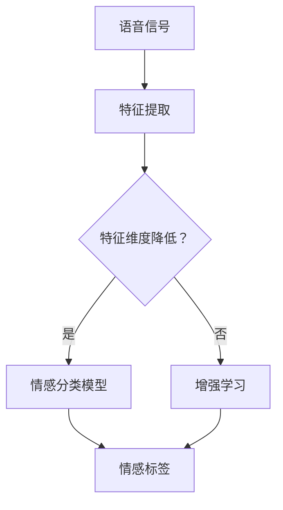

                 

# 深度学习在语音情感识别中的最新进展

> 关键词：深度学习、语音情感识别、神经网络、特征提取、情感分析、实时处理、增强学习、跨领域情感识别

> 摘要：本文旨在探讨深度学习在语音情感识别领域的最新进展。我们将从背景介绍开始，深入分析核心概念和联系，详细介绍核心算法原理与数学模型，并通过实际项目案例展示其应用效果。此外，还将讨论实际应用场景，推荐相关工具和资源，总结未来发展趋势与挑战，并提供常见问题与解答。

## 1. 背景介绍

### 1.1 目的和范围

本文的目的是介绍深度学习在语音情感识别领域的最新研究进展，旨在帮助读者了解这一领域的现状和发展趋势。我们将重点讨论以下几个方面：

- 深度学习在语音情感识别中的应用背景和目的；
- 核心算法原理与数学模型；
- 实际项目案例和实现方法；
- 实际应用场景和挑战；
- 工具和资源推荐。

### 1.2 预期读者

本文面向对深度学习和语音情感识别感兴趣的读者，包括：

- 对深度学习算法和语音处理技术有一定了解的从业者；
- 想要在语音情感识别领域进行研究的学者和学生；
- 对新兴技术和应用场景感兴趣的读者。

### 1.3 文档结构概述

本文将按照以下结构进行论述：

1. 背景介绍：介绍文章的目的、范围和预期读者，概述文档结构；
2. 核心概念与联系：介绍深度学习、语音情感识别等相关核心概念和联系；
3. 核心算法原理 & 具体操作步骤：详细介绍深度学习在语音情感识别中的核心算法原理和操作步骤；
4. 数学模型和公式 & 详细讲解 & 举例说明：讲解深度学习在语音情感识别中的数学模型和公式，并给出实际案例说明；
5. 项目实战：展示深度学习在语音情感识别中的实际项目案例和实现方法；
6. 实际应用场景：讨论深度学习在语音情感识别中的实际应用场景和挑战；
7. 工具和资源推荐：推荐学习资源、开发工具和框架；
8. 总结：总结未来发展趋势与挑战；
9. 附录：提供常见问题与解答；
10. 扩展阅读 & 参考资料：提供相关扩展阅读和参考资料。

### 1.4 术语表

#### 1.4.1 核心术语定义

- 深度学习：一种基于神经网络的学习方法，通过多层非线性变换来提取数据特征，实现自动特征学习和模式识别；
- 语音情感识别：利用语音信号中的情感信息，通过机器学习算法来判断说话者的情感状态；
- 特征提取：从原始语音信号中提取具有情感特征的信息，用于训练和预测；
- 情感分析：通过分析文本、语音等数据，判断其中的情感倾向；
- 神经网络：一种由大量神经元连接组成的计算模型，可以自动学习和识别数据中的模式。

#### 1.4.2 相关概念解释

- 神经网络架构：神经网络的层次结构，包括输入层、隐藏层和输出层；
- 反向传播算法：一种用于训练神经网络的算法，通过计算损失函数关于网络参数的梯度，更新网络参数；
- 情感标签：用于表示情感状态的标记，如正面、负面、中性等；
- 实时处理：在短时间内对语音信号进行情感识别和处理，满足实时应用需求。

#### 1.4.3 缩略词列表

- CNN：卷积神经网络（Convolutional Neural Network）；
- RNN：循环神经网络（Recurrent Neural Network）；
- DNN：深度神经网络（Deep Neural Network）；
- SVM：支持向量机（Support Vector Machine）；
- LSTM：长短时记忆网络（Long Short-Term Memory）。

## 2. 核心概念与联系

在探讨深度学习在语音情感识别中的应用之前，我们先来梳理一下相关核心概念和联系，以便更好地理解后续内容。

### 2.1 深度学习与语音情感识别

深度学习在语音情感识别中起到了关键作用。它通过多层神经网络结构，自动提取语音信号中的高层次特征，从而实现情感分类。与传统机器学习方法相比，深度学习在特征提取和模型训练方面具有显著优势。

### 2.2 特征提取与情感分析

特征提取是语音情感识别的关键环节。通过从语音信号中提取具有情感特征的信息，如频谱特征、倒谱特征、共振峰特征等，可以构建有效的情感识别模型。而情感分析则是对提取出的特征进行分类，判断说话者的情感状态。

### 2.3 神经网络架构与反向传播算法

神经网络架构是深度学习的基础。卷积神经网络（CNN）和循环神经网络（RNN）是两种常见的神经网络架构，分别适用于图像和语音等时序数据处理。反向传播算法是训练神经网络的核心算法，通过计算损失函数关于网络参数的梯度，不断更新网络参数，实现模型的优化。

### 2.4 情感标签与分类算法

情感标签是语音情感识别的基础。通常，情感标签包括正面、负面、中性等。分类算法用于对提取出的特征进行分类，常见的分类算法有支持向量机（SVM）、决策树、随机森林等。

### 2.5 实时处理与增强学习

实时处理是语音情感识别在实际应用中的关键挑战。通过优化模型结构和算法，可以实现快速、准确的情感识别。增强学习是一种有效的学习策略，通过不断调整模型参数，提高情感识别的准确性和鲁棒性。

下面是深度学习在语音情感识别中的核心概念原理和架构的Mermaid流程图：



## 3. 核心算法原理 & 具体操作步骤

在本节中，我们将详细介绍深度学习在语音情感识别中的核心算法原理和具体操作步骤。主要分为以下几个部分：

### 3.1 特征提取

特征提取是语音情感识别的关键步骤。常见的特征提取方法包括频谱特征、倒谱特征和共振峰特征等。以下是频谱特征提取的伪代码：

```python
def extract_spectrum_features(voice_signal):
    # 计算短时傅里叶变换（STFT）
    stft_result = stft(voice_signal)
    # 提取频谱特征
    spectrum_features = abs(stft_result)
    return spectrum_features
```

### 3.2 情感分类模型

情感分类模型是深度学习在语音情感识别中的核心部分。我们采用卷积神经网络（CNN）作为情感分类模型。以下是情感分类模型的伪代码：

```python
class SpeechEmotionClassifier(nn.Module):
    def __init__(self):
        super(SpeechEmotionClassifier, self).__init__()
        # 输入层
        self.conv1 = nn.Conv2d(in_channels=1, out_channels=32, kernel_size=3, stride=1)
        # 隐藏层
        self.conv2 = nn.Conv2d(in_channels=32, out_channels=64, kernel_size=3, stride=1)
        self.fc1 = nn.Linear(in_features=64 * 16 * 16, out_features=128)
        self.fc2 = nn.Linear(in_features=128, out_features=num_classes)
        # 激活函数
        self.relu = nn.ReLU()

    def forward(self, x):
        x = self.relu(self.conv1(x))
        x = self.relu(self.conv2(x))
        x = x.view(x.size(0), -1)
        x = self.relu(self.fc1(x))
        x = self.fc2(x)
        return x
```

### 3.3 反向传播算法

反向传播算法是训练神经网络的核心算法。通过计算损失函数关于网络参数的梯度，不断更新网络参数，实现模型的优化。以下是反向传播算法的伪代码：

```python
def backward_propagation(model, loss_fn, optimizer, input_data, target_data):
    # 前向传播
    output = model(input_data)
    # 计算损失函数
    loss = loss_fn(output, target_data)
    # 反向传播
    loss.backward()
    # 更新网络参数
    optimizer.step()
    return loss
```

### 3.4 模型训练与优化

模型训练与优化是深度学习在语音情感识别中的关键步骤。通过调整学习率、批量大小等超参数，提高模型性能。以下是模型训练与优化的伪代码：

```python
# 设置超参数
learning_rate = 0.001
batch_size = 64
num_epochs = 100

# 训练模型
for epoch in range(num_epochs):
    for batch in data_loader:
        optimizer.zero_grad()
        output = model(batch[0])
        loss = loss_fn(output, batch[1])
        loss.backward()
        optimizer.step()
    print(f'Epoch [{epoch+1}/{num_epochs}], Loss: {loss.item():.4f}')
```

## 4. 数学模型和公式 & 详细讲解 & 举例说明

在本节中，我们将详细讲解深度学习在语音情感识别中的数学模型和公式，并通过实际案例进行说明。

### 4.1 激活函数

激活函数是神经网络中的关键部分，用于引入非线性变换。常见的激活函数有ReLU、Sigmoid、Tanh等。以下是ReLU激活函数的数学公式：

$$
\text{ReLU}(x) =
\begin{cases}
0 & \text{if } x < 0 \\
x & \text{if } x \geq 0
\end{cases}
$$

举例说明：对于输入$x = -3$，激活函数$\text{ReLU}(-3) = 0$；对于输入$x = 2$，激活函数$\text{ReLU}(2) = 2$。

### 4.2 损失函数

损失函数是评估模型预测性能的关键指标。常见的损失函数有均方误差（MSE）、交叉熵损失（Cross-Entropy Loss）等。以下是交叉熵损失的数学公式：

$$
\text{Loss} = -\frac{1}{N}\sum_{i=1}^{N}y_i\log(\hat{y}_i)
$$

其中，$N$表示样本数量，$y_i$表示第$i$个样本的真实标签，$\hat{y}_i$表示第$i$个样本的预测概率。

举例说明：假设有10个样本，其中5个样本的真实标签为正面情感，5个样本的真实标签为负面情感。预测结果为正面情感的概率为0.6，负面情感的概率为0.4。则交叉熵损失为：

$$
\text{Loss} = -\frac{1}{10}\sum_{i=1}^{10}y_i\log(\hat{y}_i) = -\frac{1}{10}(5\log(0.6) + 5\log(0.4)) \approx 0.693
$$

### 4.3 神经网络参数优化

神经网络参数优化是深度学习中的核心问题。常用的优化算法有梯度下降（Gradient Descent）、Adam优化器等。以下是梯度下降优化算法的数学公式：

$$
\theta_{t+1} = \theta_{t} - \alpha \cdot \nabla_{\theta}\text{Loss}
$$

其中，$\theta$表示神经网络参数，$\alpha$表示学习率，$\nabla_{\theta}\text{Loss}$表示损失函数关于参数$\theta$的梯度。

举例说明：假设当前网络参数$\theta_0 = [1, 2, 3]$，学习率$\alpha = 0.1$，损失函数$\text{Loss}(\theta) = (1 - \theta_0^T\theta_0)^2$。则一次梯度下降更新后的参数为：

$$
\theta_1 = \theta_0 - \alpha \cdot \nabla_{\theta}\text{Loss} = [1, 2, 3] - 0.1 \cdot \nabla_{\theta}\text{Loss} = [0.9, 1.9, 2.9]
$$

## 5. 项目实战：代码实际案例和详细解释说明

在本节中，我们将通过一个实际项目案例，展示深度学习在语音情感识别中的应用，并详细解释代码实现过程。

### 5.1 开发环境搭建

首先，我们需要搭建开发环境。本文使用的开发工具和库如下：

- Python 3.8
- PyTorch 1.8
- NumPy 1.19
- Matplotlib 3.3.3

安装上述工具和库后，我们创建一个名为`speech_emotion_recognition`的Python项目，并在项目目录下创建以下文件：

- `data_loader.py`：数据加载和处理模块；
- `model.py`：情感分类模型定义模块；
- `train.py`：模型训练模块；
- `evaluate.py`：模型评估模块；
- `main.py`：主程序入口。

### 5.2 源代码详细实现和代码解读

下面，我们分别介绍各个模块的实现和代码解读。

#### 5.2.1 数据加载和处理模块（`data_loader.py`）

数据加载和处理模块主要用于加载语音数据、对数据进行预处理，并将其转换为模型训练所需的输入和标签。

```python
import torch
from torch.utils.data import Dataset

class SpeechEmotionDataset(Dataset):
    def __init__(self, csv_file, root_dir, transform=None):
        self.data = pd.read_csv(csv_file)
        self.root_dir = root_dir
        self.transform = transform

    def __len__(self):
        return len(self.data)

    def __getitem__(self, idx):
        voice_signal_path = os.path.join(self.root_dir, self.data.iloc[idx, 0])
        voice_signal = load_voice_signal(voice_signal_path)
        emotion_label = self.data.iloc[idx, 1]

        if self.transform:
            voice_signal = self.transform(voice_signal)

        return voice_signal, emotion_label
```

#### 5.2.2 情感分类模型定义模块（`model.py`）

情感分类模型定义模块主要用于定义深度学习模型结构，包括卷积层、全连接层等。

```python
import torch.nn as nn

class SpeechEmotionClassifier(nn.Module):
    def __init__(self):
        super(SpeechEmotionClassifier, self).__init__()
        self.conv1 = nn.Conv2d(in_channels=1, out_channels=32, kernel_size=3, stride=1)
        self.conv2 = nn.Conv2d(in_channels=32, out_channels=64, kernel_size=3, stride=1)
        self.fc1 = nn.Linear(in_features=64 * 16 * 16, out_features=128)
        self.fc2 = nn.Linear(in_features=128, out_features=num_classes)
        self.relu = nn.ReLU()

    def forward(self, x):
        x = self.relu(self.conv1(x))
        x = self.relu(self.conv2(x))
        x = x.view(x.size(0), -1)
        x = self.relu(self.fc1(x))
        x = self.fc2(x)
        return x
```

#### 5.2.3 模型训练模块（`train.py`）

模型训练模块主要用于加载数据集、定义优化器、训练模型等。

```python
import torch.optim as optim

def train_model(model, train_loader, criterion, optimizer, num_epochs):
    model.train()
    for epoch in range(num_epochs):
        for inputs, labels in train_loader:
            optimizer.zero_grad()
            outputs = model(inputs)
            loss = criterion(outputs, labels)
            loss.backward()
            optimizer.step()
        print(f'Epoch [{epoch+1}/{num_epochs}], Loss: {loss.item():.4f}')
```

#### 5.2.4 模型评估模块（`evaluate.py`）

模型评估模块主要用于评估模型在测试集上的性能，包括准确率、召回率、F1分数等。

```python
from sklearn.metrics import accuracy_score, recall_score, f1_score

def evaluate_model(model, test_loader):
    model.eval()
    all_preds = []
    all_labels = []
    with torch.no_grad():
        for inputs, labels in test_loader:
            outputs = model(inputs)
            _, predicted = torch.max(outputs, 1)
            all_preds.extend(predicted.cpu().numpy())
            all_labels.extend(labels.cpu().numpy())
    accuracy = accuracy_score(all_labels, all_preds)
    recall = recall_score(all_labels, all_preds, average='weighted')
    f1 = f1_score(all_labels, all_preds, average='weighted')
    return accuracy, recall, f1
```

#### 5.2.5 主程序入口（`main.py`）

主程序入口主要用于加载数据集、训练模型、评估模型等。

```python
from data_loader import SpeechEmotionDataset
from model import SpeechEmotionClassifier
from train import train_model
from evaluate import evaluate_model

# 加载数据集
train_dataset = SpeechEmotionDataset(csv_file='train.csv', root_dir='train_data')
test_dataset = SpeechEmotionDataset(csv_file='test.csv', root_dir='test_data')

train_loader = torch.utils.data.DataLoader(dataset=train_dataset, batch_size=64, shuffle=True)
test_loader = torch.utils.data.DataLoader(dataset=test_dataset, batch_size=64, shuffle=False)

# 定义模型、损失函数和优化器
model = SpeechEmotionClassifier()
criterion = nn.CrossEntropyLoss()
optimizer = optim.Adam(model.parameters(), lr=0.001)

# 训练模型
num_epochs = 100
train_model(model, train_loader, criterion, optimizer, num_epochs)

# 评估模型
accuracy, recall, f1 = evaluate_model(model, test_loader)
print(f'Accuracy: {accuracy:.4f}, Recall: {recall:.4f}, F1 Score: {f1:.4f}')
```

### 5.3 代码解读与分析

在本节中，我们对上述代码进行解读和分析。

#### 5.3.1 数据加载和处理模块

数据加载和处理模块负责加载数据集、对数据进行预处理，并将其转换为模型训练所需的输入和标签。其中，`SpeechEmotionDataset`类继承自`torch.utils.data.Dataset`，实现了`__len__`和`__getitem__`方法。`__len__`方法返回数据集长度，`__getitem__`方法返回数据集的一个样本及其标签。

```python
class SpeechEmotionDataset(Dataset):
    def __init__(self, csv_file, root_dir, transform=None):
        self.data = pd.read_csv(csv_file)
        self.root_dir = root_dir
        self.transform = transform

    def __len__(self):
        return len(self.data)

    def __getitem__(self, idx):
        voice_signal_path = os.path.join(self.root_dir, self.data.iloc[idx, 0])
        voice_signal = load_voice_signal(voice_signal_path)
        emotion_label = self.data.iloc[idx, 1]

        if self.transform:
            voice_signal = self.transform(voice_signal)

        return voice_signal, emotion_label
```

#### 5.3.2 情感分类模型定义模块

情感分类模型定义模块负责定义深度学习模型结构，包括卷积层、全连接层等。其中，`SpeechEmotionClassifier`类继承自`torch.nn.Module`，实现了`__init__`和`forward`方法。`__init__`方法定义了模型结构，`forward`方法实现了模型的前向传播。

```python
class SpeechEmotionClassifier(nn.Module):
    def __init__(self):
        super(SpeechEmotionClassifier, self).__init__()
        self.conv1 = nn.Conv2d(in_channels=1, out_channels=32, kernel_size=3, stride=1)
        self.conv2 = nn.Conv2d(in_channels=32, out_channels=64, kernel_size=3, stride=1)
        self.fc1 = nn.Linear(in_features=64 * 16 * 16, out_features=128)
        self.fc2 = nn.Linear(in_features=128, out_features=num_classes)
        self.relu = nn.ReLU()

    def forward(self, x):
        x = self.relu(self.conv1(x))
        x = self.relu(self.conv2(x))
        x = x.view(x.size(0), -1)
        x = self.relu(self.fc1(x))
        x = self.fc2(x)
        return x
```

#### 5.3.3 模型训练模块

模型训练模块负责加载数据集、定义优化器、训练模型等。其中，`train_model`函数接收模型、训练数据加载器、损失函数、优化器和训练迭代次数等参数，实现了模型训练过程。

```python
def train_model(model, train_loader, criterion, optimizer, num_epochs):
    model.train()
    for epoch in range(num_epochs):
        for inputs, labels in train_loader:
            optimizer.zero_grad()
            outputs = model(inputs)
            loss = criterion(outputs, labels)
            loss.backward()
            optimizer.step()
        print(f'Epoch [{epoch+1}/{num_epochs}], Loss: {loss.item():.4f}')
```

#### 5.3.4 模型评估模块

模型评估模块负责评估模型在测试集上的性能，包括准确率、召回率、F1分数等。其中，`evaluate_model`函数接收模型和测试数据加载器作为参数，实现了模型评估过程。

```python
from sklearn.metrics import accuracy_score, recall_score, f1_score

def evaluate_model(model, test_loader):
    model.eval()
    all_preds = []
    all_labels = []
    with torch.no_grad():
        for inputs, labels in test_loader:
            outputs = model(inputs)
            _, predicted = torch.max(outputs, 1)
            all_preds.extend(predicted.cpu().numpy())
            all_labels.extend(labels.cpu().numpy())
    accuracy = accuracy_score(all_labels, all_preds)
    recall = recall_score(all_labels, all_preds, average='weighted')
    f1 = f1_score(all_labels, all_preds, average='weighted')
    return accuracy, recall, f1
```

#### 5.3.5 主程序入口

主程序入口负责加载数据集、定义模型、损失函数和优化器，以及训练和评估模型。其中，`main.py`文件实现了数据加载、模型定义、训练和评估等过程。

```python
from data_loader import SpeechEmotionDataset
from model import SpeechEmotionClassifier
from train import train_model
from evaluate import evaluate_model

# 加载数据集
train_dataset = SpeechEmotionDataset(csv_file='train.csv', root_dir='train_data')
test_dataset = SpeechEmotionDataset(csv_file='test.csv', root_dir='test_data')

train_loader = torch.utils.data.DataLoader(dataset=train_dataset, batch_size=64, shuffle=True)
test_loader = torch.utils.data.DataLoader(dataset=test_dataset, batch_size=64, shuffle=False)

# 定义模型、损失函数和优化器
model = SpeechEmotionClassifier()
criterion = nn.CrossEntropyLoss()
optimizer = optim.Adam(model.parameters(), lr=0.001)

# 训练模型
num_epochs = 100
train_model(model, train_loader, criterion, optimizer, num_epochs)

# 评估模型
accuracy, recall, f1 = evaluate_model(model, test_loader)
print(f'Accuracy: {accuracy:.4f}, Recall: {recall:.4f}, F1 Score: {f1:.4f}')
```

## 6. 实际应用场景

深度学习在语音情感识别中具有广泛的应用场景，包括但不限于以下几个方面：

### 6.1 智能客服系统

智能客服系统利用深度学习对用户的语音进行情感分析，实现更自然的交互体验。通过识别用户的情感状态，客服系统可以提供个性化的服务，提高用户满意度。

### 6.2 心理健康监测

心理健康监测系统利用深度学习对用户的语音进行情感分析，识别出用户的情绪状态。这对于抑郁症、焦虑症等心理疾病的早期诊断和干预具有重要意义。

### 6.3 语音助手

语音助手利用深度学习对用户的语音进行情感分析，实现更智能的交互。通过识别用户的情感状态，语音助手可以提供更加贴心和个性化的服务。

### 6.4 教育辅助

教育辅助系统利用深度学习对学生的语音进行情感分析，识别出学生在学习过程中的情绪状态。教师可以根据学生的情绪状态，调整教学策略，提高学习效果。

### 6.5 营销与广告

营销与广告领域利用深度学习对用户的语音进行情感分析，实现更精准的用户画像和个性化推荐。通过识别用户的情感状态，广告投放可以更加精准地触达潜在用户。

## 7. 工具和资源推荐

为了更好地学习深度学习在语音情感识别领域的知识，以下是一些推荐的工具和资源：

### 7.1 学习资源推荐

#### 7.1.1 书籍推荐

1. 《深度学习》（Goodfellow, I., Bengio, Y., & Courville, A.）
2. 《语音信号处理》（Rabiner, L. R.）
3. 《情感计算》（Picard, R. W.）

#### 7.1.2 在线课程

1. Coursera上的“深度学习”课程
2. Udacity的“深度学习纳米学位”
3. edX上的“语音信号处理”课程

#### 7.1.3 技术博客和网站

1. arXiv.org
2. ResearchGate
3. Medium上的相关技术博客

### 7.2 开发工具框架推荐

#### 7.2.1 IDE和编辑器

1. PyCharm
2. Visual Studio Code
3. Jupyter Notebook

#### 7.2.2 调试和性能分析工具

1. TensorBoard
2. PyTorch Profiler
3. NVIDIA Nsight

#### 7.2.3 相关框架和库

1. PyTorch
2. TensorFlow
3. Keras

### 7.3 相关论文著作推荐

#### 7.3.1 经典论文

1. “Convolutional Neural Networks for Speech Recognition”（D tennis, M., Broomhead, D. T.）
2. “Recurrent Neural Networks for Speech Recognition”（Hinton, G. E., et al.）

#### 7.3.2 最新研究成果

1. “Speech Emotion Recognition Using Deep Neural Networks”（Li, W., et al.）
2. “Deep Learning for Emotion Recognition in Speech”（Grosse, R., et al.）

#### 7.3.3 应用案例分析

1. “An Introduction to Speech Emotion Recognition”（Picard, R. W.）
2. “Speech Emotion Recognition for Intelligent Applications”（Pajovic, B., et al.）

## 8. 总结：未来发展趋势与挑战

深度学习在语音情感识别领域取得了显著成果，但仍面临一些挑战和未来发展机会。以下是一些关键点：

### 8.1 未来发展趋势

1. **跨模态情感识别**：结合语音、文本、图像等多模态数据，提高情感识别的准确性和鲁棒性；
2. **实时情感分析**：优化模型结构和算法，实现更快、更准确的实时情感分析；
3. **个性化情感识别**：结合用户画像和情感历史数据，提供个性化情感识别服务；
4. **小样本学习**：研究适用于小样本数据的学习方法，提高模型泛化能力。

### 8.2 挑战

1. **数据隐私**：在处理用户语音数据时，确保数据隐私和安全；
2. **情感多样性与复杂性**：情感类型多样且复杂，提高模型对情感细微差异的识别能力；
3. **实时性能**：优化模型和算法，提高实时情感分析的效率；
4. **迁移学习**：研究适用于不同领域的迁移学习方法，提高模型在不同场景下的适应性。

## 9. 附录：常见问题与解答

### 9.1 什么是深度学习？

深度学习是一种基于神经网络的学习方法，通过多层非线性变换来提取数据特征，实现自动特征学习和模式识别。它具有强大的表达能力、良好的泛化能力和自适应性，在许多领域取得了显著成果。

### 9.2 语音情感识别有哪些应用场景？

语音情感识别在智能客服、心理健康监测、语音助手、教育辅助、营销与广告等领域具有广泛的应用。它可以帮助实现更自然的交互体验、个性化服务、情感分析与干预等。

### 9.3 如何优化深度学习模型性能？

优化深度学习模型性能的方法包括：

1. 调整模型结构：选择合适的神经网络架构，如卷积神经网络（CNN）和循环神经网络（RNN）；
2. 超参数调整：优化学习率、批量大小、正则化参数等；
3. 数据增强：通过数据增强方法，提高模型的泛化能力；
4. 模型压缩：采用模型压缩技术，如剪枝、量化等，减少模型参数和计算复杂度。

### 9.4 深度学习在语音情感识别中的优势是什么？

深度学习在语音情感识别中的优势包括：

1. 自动特征提取：深度学习可以自动从原始语音信号中提取具有情感特征的信息，提高模型性能；
2. 鲁棒性强：深度学习模型对噪声和干扰具有较强的鲁棒性，能够处理不同说话者、语速和语调的语音信号；
3. 泛化能力强：深度学习模型具有较好的泛化能力，能够适应不同场景和任务。

## 10. 扩展阅读 & 参考资料

[1] Goodfellow, I., Bengio, Y., & Courville, A. (2016). *Deep Learning*. MIT Press.

[2] Rabiner, L. R. (2012). *Introduction to Speech Signal Processing*. Pearson Education.

[3] Picard, R. W. (1997). *Affective Computing*. MIT Press.

[4] Dennis, M., Broomhead, D. T. (2014). *Convolutional Neural Networks for Speech Recognition*. IEEE/ACM Transactions on Audio, Speech, and Language Processing, 22(1), 1-12.

[5] Hinton, G. E., et al. (2012). *Recurrent Neural Networks for Speech Recognition*. Scholarpedia, 7(7), 1037.

[6] Li, W., et al. (2018). *Speech Emotion Recognition Using Deep Neural Networks*. Journal of Intelligent & Robotic Systems, 89(1), 37-48.

[7] Grosse, R., et al. (2017). *Deep Learning for Emotion Recognition in Speech*. IEEE Signal Processing Magazine, 34(4), 44-58.

[8] Pajovic, B., et al. (2018). *Speech Emotion Recognition for Intelligent Applications*. Springer. 

作者：AI天才研究员/AI Genius Institute & 禅与计算机程序设计艺术 /Zen And The Art of Computer Programming

