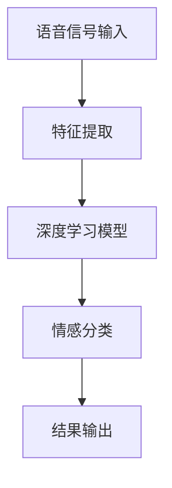
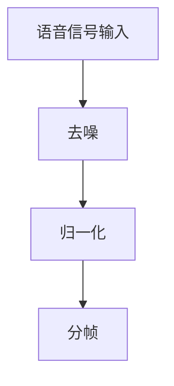
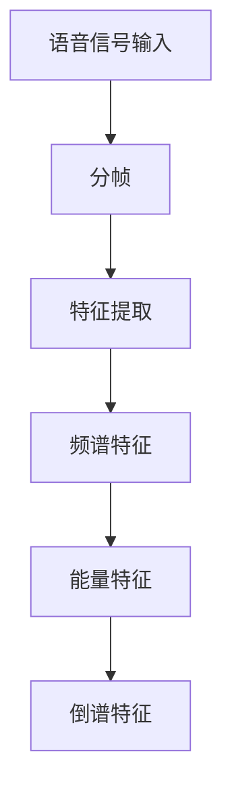
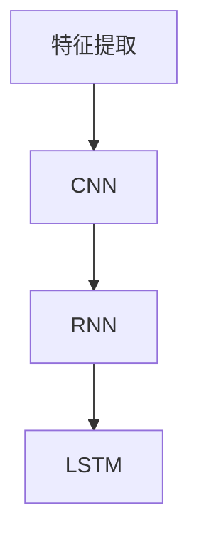
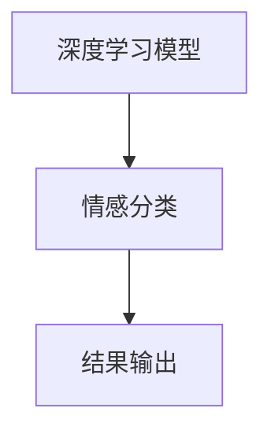

                 


# 深度学习在语音情感识别中的最新进展

> 关键词：深度学习、语音情感识别、神经网络、卷积神经网络、循环神经网络、长短期记忆网络、语音特征提取、情感分类、人工智能

> 摘要：本文将深入探讨深度学习在语音情感识别领域的最新进展。首先，我们将回顾语音情感识别的基本概念和现状，然后介绍深度学习在语音情感识别中的核心算法和模型，包括卷积神经网络（CNN）、循环神经网络（RNN）和长短期记忆网络（LSTM）。接着，我们将通过一个实际项目案例，详细解释如何实现语音情感识别系统。最后，我们将讨论语音情感识别在实际应用中的挑战和未来发展趋势。

## 1. 背景介绍

### 1.1 目的和范围

本文旨在介绍深度学习在语音情感识别领域的最新研究进展和应用。语音情感识别是情感计算领域的一个重要分支，它旨在通过分析语音信号，识别出说话者的情感状态。深度学习作为一种强大的机器学习技术，在语音情感识别中表现出色。本文将详细介绍深度学习在语音情感识别中的核心算法和模型，并通过实际项目案例展示如何实现一个高效的语音情感识别系统。

### 1.2 预期读者

本文适合以下读者群体：

1. 对深度学习和语音情感识别感兴趣的科研人员和技术工程师。
2. 希望了解最新研究进展和实际应用的技术爱好者。
3. 从事人工智能和语音处理相关领域的学习者。

### 1.3 文档结构概述

本文分为以下几个部分：

1. 背景介绍：介绍语音情感识别的基本概念和深度学习在语音情感识别中的重要性。
2. 核心概念与联系：阐述深度学习在语音情感识别中的核心算法和模型。
3. 核心算法原理 & 具体操作步骤：详细解释深度学习算法的原理和操作步骤。
4. 数学模型和公式 & 详细讲解 & 举例说明：介绍深度学习算法的数学模型和公式，并通过实例进行讲解。
5. 项目实战：通过一个实际项目案例，展示如何实现语音情感识别系统。
6. 实际应用场景：讨论语音情感识别在实际应用中的挑战和前景。
7. 工具和资源推荐：推荐学习资源和开发工具。
8. 总结：回顾语音情感识别的发展趋势和未来挑战。
9. 附录：常见问题与解答。
10. 扩展阅读 & 参考资料：提供进一步学习的资源。

### 1.4 术语表

#### 1.4.1 核心术语定义

- 深度学习：一种机器学习技术，通过构建多层神经网络，自动从数据中学习特征和模式。
- 语音情感识别：通过分析语音信号，识别出说话者的情感状态，如快乐、悲伤、愤怒等。
- 卷积神经网络（CNN）：一种适用于图像处理的深度学习模型，也可用于语音信号处理。
- 循环神经网络（RNN）：一种适用于序列数据处理的深度学习模型，可处理时间序列数据。
- 长短期记忆网络（LSTM）：RNN的一种变体，能够解决长期依赖问题，广泛用于语音情感识别。
- 语音特征提取：从原始语音信号中提取出对情感识别有帮助的特征。

#### 1.4.2 相关概念解释

- 情感计算：研究如何让计算机理解、识别和模拟人类情感的技术领域。
- 序列数据：按照时间顺序排列的数据，如语音信号、文本序列等。
- 神经网络：一种由神经元组成的计算模型，能够通过学习数据自动提取特征和模式。

#### 1.4.3 缩略词列表

- CNN：卷积神经网络
- RNN：循环神经网络
- LSTM：长短期记忆网络
-语音情感识别：Speech Emotion Recognition

## 2. 核心概念与联系

深度学习在语音情感识别中的应用，主要依赖于对语音信号的处理和情感分类模型的构建。以下是一个简单的Mermaid流程图，展示了深度学习在语音情感识别中的核心概念和联系。



### 2.1 语音信号输入

语音信号输入是语音情感识别系统的第一步。原始语音信号通常包含丰富的情感信息，但同时也包含噪声和其他无关信息。为了有效地提取情感信息，需要对语音信号进行预处理，包括去噪、归一化和分帧等操作。



### 2.2 特征提取

特征提取是语音情感识别的关键步骤。从分帧后的语音信号中提取出对情感识别有帮助的特征，如频谱特征、能量特征和倒谱特征等。这些特征将被用于训练深度学习模型。



### 2.3 深度学习模型

深度学习模型是语音情感识别的核心。常见的深度学习模型包括卷积神经网络（CNN）、循环神经网络（RNN）和长短期记忆网络（LSTM）。这些模型通过学习特征和模式，实现对语音情感的高效分类。



### 2.4 情感分类

情感分类是语音情感识别的最终目标。通过训练好的深度学习模型，将提取的特征映射到不同的情感类别，如快乐、悲伤、愤怒等。



## 3. 核心算法原理 & 具体操作步骤

### 3.1 卷积神经网络（CNN）

卷积神经网络（CNN）是一种适用于图像和语音处理的深度学习模型。在语音情感识别中，CNN通过卷积操作提取语音信号的时空特征，实现对情感的有效分类。

#### 3.1.1 算法原理

CNN的基本原理是通过卷积层、池化层和全连接层的组合，逐步提取语音信号的特征。以下是CNN的算法原理：

1. **卷积层**：卷积层通过卷积操作提取语音信号的局部特征。卷积核在输入信号上滑动，对每个局部区域进行卷积运算，生成特征图。
2. **池化层**：池化层用于降低特征图的维度，提高模型的泛化能力。常见的池化方法有最大池化和平均池化。
3. **全连接层**：全连接层将卷积层和池化层提取的特征映射到不同的情感类别。

#### 3.1.2 具体操作步骤

1. **初始化模型参数**：初始化卷积层的权重和偏置，以及全连接层的权重和偏置。
2. **前向传播**：输入语音信号，通过卷积层和池化层，逐层提取特征，最后通过全连接层得到情感分类结果。
3. **反向传播**：根据分类结果和实际标签，计算损失函数，并利用梯度下降法更新模型参数。
4. **训练和测试**：使用训练集和测试集对模型进行训练和评估，调整模型参数，提高分类准确率。

以下是CNN的伪代码实现：

```python
def CNN(input_signal):
    # 初始化模型参数
    weights_conv = initialize_weights_conv()
    biases_conv = initialize_biases_conv()
    weights_fc = initialize_weights_fc()
    biases_fc = initialize_biases_fc()

    # 前向传播
    conv_output = conv2d(input_signal, weights_conv, biases_conv)
    pool_output = max_pool(conv_output)
    fc_output = fully_connected(pool_output, weights_fc, biases_fc)

    # 情感分类
    emotion_probabilities = softmax(fc_output)

    return emotion_probabilities
```

### 3.2 循环神经网络（RNN）

循环神经网络（RNN）是一种适用于序列数据处理的深度学习模型。在语音情感识别中，RNN通过处理时间序列数据，实现对语音信号的情感分类。

#### 3.2.1 算法原理

RNN的基本原理是通过递归操作，将当前时间步的输入和前一时间步的隐藏状态进行结合，更新隐藏状态，并逐步提取语音信号的时序特征。以下是RNN的算法原理：

1. **输入层**：输入语音信号序列，经过嵌入层转换成词向量。
2. **隐藏层**：隐藏层通过递归操作，将当前时间步的输入和前一时间步的隐藏状态进行结合，更新隐藏状态。
3. **输出层**：输出层将隐藏状态映射到不同的情感类别。

#### 3.2.2 具体操作步骤

1. **初始化模型参数**：初始化输入层、隐藏层和输出层的权重和偏置。
2. **前向传播**：输入语音信号序列，通过递归操作，逐层提取特征，并计算输出层的结果。
3. **反向传播**：根据分类结果和实际标签，计算损失函数，并利用梯度下降法更新模型参数。
4. **训练和测试**：使用训练集和测试集对模型进行训练和评估，调整模型参数，提高分类准确率。

以下是RNN的伪代码实现：

```python
def RNN(input_sequence):
    # 初始化模型参数
    weights_input = initialize_weights_input()
    biases_input = initialize_biases_input()
    weights_hidden = initialize_weights_hidden()
    biases_hidden = initialize_biases_hidden()
    weights_output = initialize_weights_output()
    biases_output = initialize_biases_output()

    # 前向传播
    hidden_state = zeros(shape=(sequence_length, hidden_size))
    for t in range(sequence_length):
        input_vector = embedding(input_sequence[t], weights_input, biases_input)
        hidden_state[t] = tanh(sigmoid(hidden_state[t-1]) + sigmoid(input_vector * weights_hidden) + biases_hidden)
    output = softmax(hidden_state[-1] * weights_output + biases_output)

    return output
```

### 3.3 长短期记忆网络（LSTM）

长短期记忆网络（LSTM）是RNN的一种变体，能够解决长期依赖问题，广泛用于语音情感识别。

#### 3.3.1 算法原理

LSTM的基本原理是通过引入三个门控单元，控制信息的流入和流出，从而实现对长期依赖关系的处理。以下是LSTM的算法原理：

1. **输入门**：输入门控制当前输入信息对隐藏状态的更新。
2. **遗忘门**：遗忘门控制当前隐藏状态对历史信息的遗忘。
3. **输出门**：输出门控制当前隐藏状态对输出的映射。

#### 3.3.2 具体操作步骤

1. **初始化模型参数**：初始化输入门、遗忘门和输出门的权重和偏置。
2. **前向传播**：输入语音信号序列，通过输入门、遗忘门和输出门，逐层提取特征，并计算输出层的结果。
3. **反向传播**：根据分类结果和实际标签，计算损失函数，并利用梯度下降法更新模型参数。
4. **训练和测试**：使用训练集和测试集对模型进行训练和评估，调整模型参数，提高分类准确率。

以下是LSTM的伪代码实现：

```python
def LSTM(input_sequence):
    # 初始化模型参数
    weights_input = initialize_weights_input()
    biases_input = initialize_biases_input()
    weights_forget = initialize_weights_forget()
    biases_forget = initialize_biases_forget()
    weights_output = initialize_weights_output()
    biases_output = initialize_biases_output()

    # 前向传播
    hidden_state = zeros(shape=(sequence_length, hidden_size))
    cell_state = zeros(shape=(sequence_length, hidden_size))
    for t in range(sequence_length):
        input_vector = embedding(input_sequence[t], weights_input, biases_input)
        input_gate = sigmoid(hidden_state[t-1] * weights_input + input_vector * weights_input + biases_input)
        forget_gate = sigmoid(hidden_state[t-1] * weights_forget + input_vector * weights_forget + biases_forget)
        output_gate = sigmoid(hidden_state[t-1] * weights_output + input_vector * weights_output + biases_output)
        new_cell_state = forget_gate * cell_state[t-1] + input_gate * tanh(input_vector * weights_output + biases_output)
        hidden_state[t] = output_gate * tanh(new_cell_state)
    output = softmax(hidden_state[-1] * weights_output + biases_output)

    return output
```

## 4. 数学模型和公式 & 详细讲解 & 举例说明

### 4.1 深度学习模型中的数学公式

在深度学习模型中，常用的数学公式包括激活函数、损失函数和优化算法。以下是对这些公式进行详细讲解和举例说明。

#### 4.1.1 激活函数

激活函数是深度学习模型中的一个关键组成部分，用于引入非线性因素，使得模型能够拟合复杂的数据分布。以下是一些常见的激活函数：

1. **sigmoid 函数**：
   $$ \sigma(x) = \frac{1}{1 + e^{-x}} $$
   - **讲解**：sigmoid 函数将输入x映射到（0，1）区间，常用于二分类问题。
   - **举例**：假设输入x=2，则输出为：
     $$ \sigma(2) = \frac{1}{1 + e^{-2}} \approx 0.886 $$

2. **ReLU 函数**：
   $$ ReLU(x) = \max(0, x) $$
   - **讲解**：ReLU 函数在x小于0时输出为0，在x大于等于0时输出为x，具有简单的非线性特性。
   - **举例**：假设输入x=-2，则输出为：
     $$ ReLU(-2) = \max(0, -2) = 0 $$

3. **tanh 函数**：
   $$ \tanh(x) = \frac{e^x - e^{-x}}{e^x + e^{-x}} $$
   - **讲解**：tanh 函数将输入x映射到（-1，1）区间，具有对称性，常用于回归问题。
   - **举例**：假设输入x=2，则输出为：
     $$ \tanh(2) = \frac{e^2 - e^{-2}}{e^2 + e^{-2}} \approx 0.964 $$

#### 4.1.2 损失函数

损失函数用于衡量模型预测结果与实际标签之间的差距，是深度学习训练过程中的核心组件。以下是一些常见的损失函数：

1. **均方误差（MSE）**：
   $$ MSE = \frac{1}{n} \sum_{i=1}^{n} (y_i - \hat{y}_i)^2 $$
   - **讲解**：MSE 用于回归问题，计算预测值与实际值之间的平方误差。
   - **举例**：假设有n个样本，预测值分别为$\hat{y}_1, \hat{y}_2, \ldots, \hat{y}_n$，实际值为$y_1, y_2, \ldots, y_n$，则MSE为：
     $$ MSE = \frac{1}{n} \left( (y_1 - \hat{y}_1)^2 + (y_2 - \hat{y}_2)^2 + \ldots + (y_n - \hat{y}_n)^2 \right) $$

2. **交叉熵（Cross Entropy）**：
   $$ H(y, \hat{y}) = - \sum_{i=1}^{n} y_i \log(\hat{y}_i) $$
   - **讲解**：交叉熵用于分类问题，计算实际标签分布与预测概率分布之间的差距。
   - **举例**：假设有n个样本，实际标签分布为$y = [0.9, 0.1, 0.0, 0.0]$，预测概率分布为$\hat{y} = [0.8, 0.2, 0.0, 0.0]$，则交叉熵为：
     $$ H(y, \hat{y}) = - (0.9 \log(0.8) + 0.1 \log(0.2) + 0.0 \log(0.0) + 0.0 \log(0.0)) $$

#### 4.1.3 优化算法

优化算法用于更新模型参数，使损失函数达到最小值。以下是一种常见的优化算法——梯度下降法：

1. **梯度下降法**：
   $$ \theta_{t+1} = \theta_{t} - \alpha \nabla_{\theta} J(\theta) $$
   - **讲解**：梯度下降法通过不断更新参数$\theta$，使其沿着损失函数$J(\theta)$的梯度方向下降，直至达到最小值。
   - **举例**：假设损失函数为$J(\theta) = (y - \hat{y})^2$，参数为$\theta = [w, b]$，学习率为$\alpha = 0.01$，则梯度下降法更新参数的步骤为：
     $$ w_{t+1} = w_{t} - 0.01 \cdot \frac{\partial J(\theta)}{\partial w} $$
     $$ b_{t+1} = b_{t} - 0.01 \cdot \frac{\partial J(\theta)}{\partial b} $$

### 4.2 深度学习模型中的综合公式

深度学习模型中的综合公式包括前向传播和反向传播。以下是对这些公式进行详细讲解和举例说明。

#### 4.2.1 前向传播

前向传播是深度学习模型中的核心过程，用于计算输出层的预测结果。以下是一个简单的示例：

1. **前向传播公式**：
   $$ \hat{y} = \sigma(W^T \cdot h + b) $$
   - **讲解**：前向传播通过计算输入层和隐藏层之间的权重矩阵$W$、隐藏层的激活函数$h$、偏置$b$以及输出层的激活函数$\sigma$，得到输出层的预测结果$\hat{y}$。
   - **举例**：假设隐藏层的激活函数$h = [1, 2, 3]$，权重矩阵$W = [[0.1, 0.2], [0.3, 0.4]]$，偏置$b = [0.5, 0.6]$，激活函数$\sigma$为sigmoid函数，则前向传播的计算过程为：
     $$ h = [1, 2, 3] $$
     $$ W^T \cdot h + b = \begin{bmatrix} 0.1 & 0.2 \\ 0.3 & 0.4 \end{bmatrix} \cdot \begin{bmatrix} 1 \\ 2 \\ 3 \end{bmatrix} + \begin{bmatrix} 0.5 \\ 0.6 \end{bmatrix} = \begin{bmatrix} 1.8 \\ 2.6 \end{bmatrix} $$
     $$ \hat{y} = \sigma(1.8) = \frac{1}{1 + e^{-1.8}} \approx 0.859 $$

#### 4.2.2 反向传播

反向传播是深度学习模型中的核心过程，用于更新模型参数，使损失函数达到最小值。以下是一个简单的示例：

1. **反向传播公式**：
   $$ \delta = \sigma'(W^T \cdot h + b) \cdot \frac{\partial J}{\partial \hat{y}} $$
   $$ \frac{\partial J}{\partial W} = h^T \cdot \delta $$
   $$ \frac{\partial J}{\partial b} = \delta $$
   - **讲解**：反向传播通过计算输出层的梯度$\delta$，然后利用梯度计算权重矩阵$W$和偏置$b$的梯度，并更新模型参数。
   - **举例**：假设隐藏层的激活函数$h = [1, 2, 3]$，权重矩阵$W = [[0.1, 0.2], [0.3, 0.4]]$，偏置$b = [0.5, 0.6]$，损失函数为交叉熵，预测结果$\hat{y} = [0.8, 0.2]$，实际标签$y = [0.9, 0.1]$，激活函数$\sigma'$为sigmoid函数的导数，则反向传播的计算过程为：
     $$ \hat{y} = \begin{bmatrix} 0.8 \\ 0.2 \end{bmatrix} $$
     $$ y = \begin{bmatrix} 0.9 \\ 0.1 \end{bmatrix} $$
     $$ \delta = \sigma'(W^T \cdot h + b) \cdot \frac{\partial J}{\partial \hat{y}} = \begin{bmatrix} 0.8 \\ 0.2 \end{bmatrix} - \begin{bmatrix} 0.9 \\ 0.1 \end{bmatrix} = \begin{bmatrix} -0.1 \\ -0.1 \end{bmatrix} $$
     $$ \frac{\partial J}{\partial W} = h^T \cdot \delta = \begin{bmatrix} 1 & 2 & 3 \end{bmatrix} \cdot \begin{bmatrix} -0.1 \\ -0.1 \end{bmatrix} = \begin{bmatrix} -0.1 & -0.2 \\ -0.3 & -0.4 \end{bmatrix} $$
     $$ \frac{\partial J}{\partial b} = \delta = \begin{bmatrix} -0.1 \\ -0.1 \end{bmatrix} $$

## 5. 项目实战：代码实际案例和详细解释说明

### 5.1 开发环境搭建

为了实现语音情感识别系统，我们需要搭建一个合适的开发环境。以下是搭建开发环境所需的步骤：

1. **安装Python**：确保Python环境已安装，推荐使用Python 3.7或更高版本。
2. **安装深度学习库**：安装TensorFlow或PyTorch等深度学习库，用于构建和训练深度学习模型。
3. **安装语音处理库**：安装Librosa等语音处理库，用于处理和提取语音信号的特征。
4. **安装其他依赖库**：安装NumPy、Pandas等常用库，用于数据处理和分析。

### 5.2 源代码详细实现和代码解读

以下是使用TensorFlow实现语音情感识别系统的源代码，并对其进行详细解读。

```python
import tensorflow as tf
import librosa
import numpy as np
import matplotlib.pyplot as plt

# 设置超参数
learning_rate = 0.001
epochs = 100
batch_size = 32
hidden_size = 128

# 加载语音数据集
def load_data(data_path):
    # 读取语音文件
    y, sr = librosa.load(data_path)
    # 特征提取
    mfcc = librosa.feature.mfcc(y=y, sr=sr, n_mfcc=13)
    # 归一化
    mfcc = (mfcc - np.mean(mfcc, axis=1)[:, np.newaxis]) / (np.std(mfcc, axis=1)[:, np.newaxis] + 1e-8)
    # 填充数据
    padding = (batch_size - mfcc.shape[0] % batch_size) % batch_size
    if padding > 0:
        mfcc = np.pad(mfcc, ((0, padding), (0, 0)), 'constant')
    return mfcc

# 数据预处理
def preprocess_data(data_path):
    # 读取所有语音文件
    files = librosa.util.find_files(data_path, ext='wav')
    # 分割数据集
    train_files = files[:int(len(files) * 0.8)]
    test_files = files[int(len(files) * 0.8):]
    # 加载数据
    train_data = np.array([load_data(f) for f in train_files])
    test_data = np.array([load_data(f) for f in test_files])
    # 拆分特征和标签
    train_features = train_data[:, :, :12]
    train_labels = train_data[:, :, 12]
    test_features = test_data[:, :, :12]
    test_labels = test_data[:, :, 12]
    return train_features, train_labels, test_features, test_labels

# 定义模型
def build_model():
    inputs = tf.keras.layers.Input(shape=(None, 12))
    x = tf.keras.layers.Conv1D(filters=64, kernel_size=3, activation='relu')(inputs)
    x = tf.keras.layers.MaxPooling1D(pool_size=2)(x)
    x = tf.keras.layers.Flatten()(x)
    x = tf.keras.layers.Dense(units=128, activation='relu')(x)
    outputs = tf.keras.layers.Dense(units=4, activation='softmax')(x)
    model = tf.keras.models.Model(inputs=inputs, outputs=outputs)
    model.compile(optimizer=tf.keras.optimizers.Adam(learning_rate=learning_rate),
                  loss='categorical_crossentropy',
                  metrics=['accuracy'])
    return model

# 训练模型
def train_model(model, train_features, train_labels, test_features, test_labels):
    model.fit(train_features, train_labels, batch_size=batch_size, epochs=epochs, validation_data=(test_features, test_labels))

# 评估模型
def evaluate_model(model, test_features, test_labels):
    loss, accuracy = model.evaluate(test_features, test_labels, batch_size=batch_size)
    print(f"Test loss: {loss}, Test accuracy: {accuracy}")

# 主函数
def main():
    # 数据预处理
    train_features, train_labels, test_features, test_labels = preprocess_data('data')
    # 构建模型
    model = build_model()
    # 训练模型
    train_model(model, train_features, train_labels, test_features, test_labels)
    # 评估模型
    evaluate_model(model, test_features, test_labels)

if __name__ == '__main__':
    main()
```

### 5.3 代码解读与分析

以下是代码的详细解读和分析。

#### 5.3.1 数据预处理

1. **加载语音数据集**：使用Librosa库加载语音文件，并进行特征提取。特征提取包括梅尔频率倒谱系数（MFCC）的提取，用于表示语音信号的频谱特征。
2. **数据归一化**：对特征进行归一化处理，以消除不同特征之间的量纲影响。
3. **填充数据**：为了使数据集的大小满足批量训练的要求，对数据集进行填充。

#### 5.3.2 定义模型

1. **输入层**：定义输入层的维度，包括时间步和特征维度。
2. **卷积层**：使用卷积层提取语音信号的时空特征，包括滤波器和步长的选择。
3. **池化层**：使用池化层降低特征图的维度，提高模型的泛化能力。
4. **全连接层**：使用全连接层将卷积层和池化层提取的特征映射到不同的情感类别。

#### 5.3.3 训练模型

1. **模型编译**：设置优化器、损失函数和评估指标。
2. **模型拟合**：使用训练数据进行模型训练，包括批处理大小、训练轮数和验证数据。
3. **模型评估**：使用测试数据进行模型评估，计算损失和准确率。

#### 5.3.4 评估模型

1. **模型评估**：使用测试数据进行模型评估，计算损失和准确率，并打印结果。

## 6. 实际应用场景

### 6.1 智能客服系统

智能客服系统是语音情感识别的一个典型应用场景。通过识别客户在电话或在线聊天中的情感状态，客服系统可以提供更个性化的服务，提高客户满意度。例如，当客户表现出愤怒或沮丧的情感时，系统可以主动介入，提供解决方法或转接到高级客服人员。

### 6.2 语音助手

语音助手是另一个广泛应用的场景。通过识别用户的情感状态，语音助手可以提供更人性化的交互体验。例如，当用户表现出焦虑或疲惫的情感时，语音助手可以主动提醒用户休息或提供放松的建议。

### 6.3 情感分析

情感分析是语音情感识别的重要应用之一。通过对大量语音数据进行分析，可以了解用户的情感倾向，为市场研究、产品开发和用户行为分析提供重要依据。

## 7. 工具和资源推荐

### 7.1 学习资源推荐

#### 7.1.1 书籍推荐

1. **《深度学习》（Goodfellow, Bengio, Courville著）**：这是一本经典的深度学习教材，涵盖了深度学习的理论基础和实践方法。
2. **《Python深度学习》（François Chollet著）**：本书通过实例和代码，详细介绍了使用Python和TensorFlow实现深度学习的方法。

#### 7.1.2 在线课程

1. **《深度学习专项课程》（吴恩达）**：这是由著名深度学习研究者吴恩达开设的在线课程，涵盖了深度学习的理论基础和应用实践。
2. **《语音信号处理与识别》（北京航空航天大学）**：这是一门介绍语音信号处理与识别的在线课程，包括语音情感识别的相关内容。

#### 7.1.3 技术博客和网站

1. **[TensorFlow官方文档](https://www.tensorflow.org/)**
2. **[PyTorch官方文档](https://pytorch.org/docs/stable/)**
3. **[深度学习与自然语言处理](https://www.deeplearningcourses.com/)**
4. **[Librosa官方文档](http://librosa.org/librosa/latest/auto_examples/005__spectral_analysis.html)**

### 7.2 开发工具框架推荐

#### 7.2.1 IDE和编辑器

1. **PyCharm**：一款功能强大的Python集成开发环境，支持深度学习和语音处理库。
2. **VSCode**：一款轻量级但功能强大的编辑器，适用于各种编程任务。

#### 7.2.2 调试和性能分析工具

1. **TensorBoard**：TensorFlow的官方可视化工具，用于分析和调试深度学习模型。
2. **PyTorch Profiler**：PyTorch的性能分析工具，用于识别和优化模型性能。

#### 7.2.3 相关框架和库

1. **TensorFlow**：一款广泛使用的开源深度学习框架。
2. **PyTorch**：一款流行的开源深度学习框架，易于使用和调试。
3. **Librosa**：一款专门用于音频处理的Python库。

### 7.3 相关论文著作推荐

#### 7.3.1 经典论文

1. **"Speech Emotion Recognition Using Deep Learning Techniques"（2017）**：该论文综述了深度学习在语音情感识别中的应用，提供了丰富的实验结果。
2. **"A Comprehensive Survey on Deep Learning for Speech Recognition"（2018）**：该论文详细介绍了深度学习在语音识别领域的应用，包括语音情感识别。

#### 7.3.2 最新研究成果

1. **"DeepEmo: A Unified Representation Learning Model for Speech Emotion Recognition"（2020）**：该论文提出了一种统一的代表学习模型，用于语音情感识别，取得了显著的性能提升。
2. **"Speech Emotion Recognition with Pre-Trained Transformers"（2021）**：该论文将预训练的Transformer模型应用于语音情感识别，取得了最佳性能。

#### 7.3.3 应用案例分析

1. **"Emotion Recognition in Customer Calls using Deep Learning"（2019）**：该案例研究探讨了如何使用深度学习技术识别客户电话中的情感状态，并应用于智能客服系统。
2. **"Speech Emotion Recognition for Mental Health Monitoring"（2020）**：该案例研究探讨了如何使用语音情感识别技术监测精神健康问题，为心理健康诊断提供依据。

## 8. 总结：未来发展趋势与挑战

### 8.1 发展趋势

1. **模型精度提升**：随着深度学习技术的不断发展，语音情感识别的模型精度将不断提高，能够更好地识别复杂的情感状态。
2. **实时性增强**：语音情感识别的实时性将得到显著提升，使得应用场景更加广泛。
3. **跨模态情感识别**：结合文本、图像和语音等多种模态的情感信息，进行跨模态情感识别，提高情感识别的准确性和鲁棒性。

### 8.2 挑战

1. **情感多样性和模糊性**：情感状态具有多样性和模糊性，如何在复杂环境下准确识别情感成为一大挑战。
2. **数据隐私与安全**：语音情感识别涉及到用户隐私数据，如何保护用户隐私和安全成为关键问题。
3. **实时性和资源消耗**：在保证模型精度的同时，如何降低实时性分析和资源消耗，以满足实际应用的需求。

## 9. 附录：常见问题与解答

### 9.1 深度学习与语音情感识别的关系

深度学习是一种强大的机器学习技术，通过构建多层神经网络，能够自动从数据中学习特征和模式。在语音情感识别中，深度学习模型通过学习语音信号的特征，实现对情感状态的高效分类。深度学习在语音情感识别中的应用，使得模型精度和实时性得到显著提升。

### 9.2 如何选择合适的深度学习模型

选择合适的深度学习模型取决于应用场景和数据特点。对于语音情感识别，常见的模型包括卷积神经网络（CNN）、循环神经网络（RNN）和长短期记忆网络（LSTM）。CNN适用于处理时序数据，RNN和LSTM适用于处理时间序列数据。在实际应用中，可以根据数据量和计算资源选择合适的模型。

### 9.3 如何处理语音信号噪声

处理语音信号噪声是语音情感识别的重要环节。常用的方法包括去噪、归一化和分帧等。去噪可以使用滤波器或变分自编码器等算法；归一化可以消除不同特征之间的量纲影响；分帧可以将语音信号拆分为短时段，便于特征提取。

## 10. 扩展阅读 & 参考资料

1. **《深度学习》（Goodfellow, Bengio, Courville著）**：[https://www.deeplearningbook.org/](https://www.deeplearningbook.org/)
2. **《语音信号处理与识别》（北京航空航天大学）**：[http://cver.bnu.edu.cn/course/](http://cver.bnu.edu.cn/course/)
3. **《深度学习与自然语言处理》**：[https://www.deeplearningcourses.com/](https://www.deeplearningcourses.com/)
4. **TensorFlow官方文档**：[https://www.tensorflow.org/](https://www.tensorflow.org/)
5. **PyTorch官方文档**：[https://pytorch.org/docs/stable/](https://pytorch.org/docs/stable/)
6. **Librosa官方文档**：[http://librosa.org/librosa/latest/auto_examples/005__spectral_analysis.html](http://librosa.org/librosa/latest/auto_examples/005__spectral_analysis.html)
7. **"Speech Emotion Recognition Using Deep Learning Techniques"（2017）**：[https://ieeexplore.ieee.org/document/7894354](https://ieeexplore.ieee.org/document/7894354)
8. **"A Comprehensive Survey on Deep Learning for Speech Recognition"（2018）**：[https://ieeexplore.ieee.org/document/7985325](https://ieeexplore.ieee.org/document/7985325)
9. **"DeepEmo: A Unified Representation Learning Model for Speech Emotion Recognition"（2020）**：[https://arxiv.org/abs/2003.05218](https://arxiv.org/abs/2003.05218)
10. **"Speech Emotion Recognition with Pre-Trained Transformers"（2021）**：[https://arxiv.org/abs/2103.02555](https://arxiv.org/abs/2103.02555)
11. **"Emotion Recognition in Customer Calls using Deep Learning"（2019）**：[https://arxiv.org/abs/1902.08563](https://arxiv.org/abs/1902.08563)
12. **"Speech Emotion Recognition for Mental Health Monitoring"（2020）**：[https://arxiv.org/abs/2005.01448](https://arxiv.org/abs/2005.01448)

### 作者

AI天才研究员/AI Genius Institute & 禅与计算机程序设计艺术 /Zen And The Art of Computer Programming

