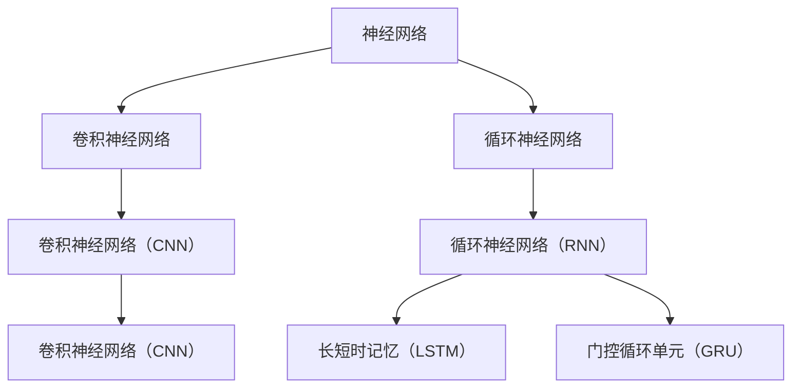

                 

# 深度学习在语音情感识别中的研究进展

## 关键词
- 深度学习
- 语音情感识别
- 卷积神经网络
- 循环神经网络
- 长短时记忆
- 跨模态学习
- 人工智能

## 摘要
本文将探讨深度学习在语音情感识别领域的研究进展。首先，我们将简要介绍深度学习的基本原理，然后深入分析深度学习模型在语音情感识别中的应用，包括卷积神经网络（CNN）和循环神经网络（RNN）等。随后，我们将详细阐述长短时记忆（LSTM）网络和门控循环单元（GRU）网络的工作原理，以及如何应用于语音情感识别。最后，我们将探讨跨模态学习和注意力机制在语音情感识别中的重要性，并介绍当前研究中的最新进展。通过本文的阅读，读者将对深度学习在语音情感识别领域的应用有更深入的了解，并能够掌握相关技术原理。

## 1. 背景介绍

### 1.1 目的和范围

语音情感识别是一种利用语音信号中的情感特征，自动识别和分类语音情感的技术。随着人工智能技术的不断发展，深度学习在语音情感识别领域得到了广泛应用，并取得了显著的研究成果。本文旨在通过深入分析深度学习在语音情感识别中的研究进展，为该领域的进一步研究提供有益的参考。

本文将首先介绍深度学习的基本原理，然后重点讨论卷积神经网络（CNN）和循环神经网络（RNN）等深度学习模型在语音情感识别中的应用。此外，我们还将详细阐述长短时记忆（LSTM）网络和门控循环单元（GRU）网络的工作原理，以及如何应用于语音情感识别。最后，本文将探讨跨模态学习和注意力机制在语音情感识别中的重要性，并介绍当前研究中的最新进展。

### 1.2 预期读者

本文面向对深度学习和语音情感识别有一定了解的读者，包括研究人员、开发者和对人工智能领域感兴趣的一般读者。本文旨在为读者提供一个全面、深入的视角，以便更好地理解和应用深度学习在语音情感识别领域的最新研究成果。

### 1.3 文档结构概述

本文结构如下：

1. **背景介绍**：介绍深度学习在语音情感识别领域的研究背景、目的和预期读者。
2. **核心概念与联系**：介绍深度学习中的核心概念和联系，包括卷积神经网络（CNN）和循环神经网络（RNN）等。
3. **核心算法原理与具体操作步骤**：详细阐述深度学习算法原理和具体操作步骤。
4. **数学模型和公式**：介绍深度学习中的数学模型和公式，并举例说明。
5. **项目实战：代码实际案例和详细解释说明**：通过实际案例展示深度学习在语音情感识别中的应用。
6. **实际应用场景**：讨论深度学习在语音情感识别中的实际应用场景。
7. **工具和资源推荐**：推荐学习资源和开发工具。
8. **总结：未来发展趋势与挑战**：总结当前研究的进展和未来发展趋势与挑战。
9. **附录：常见问题与解答**：回答读者可能关心的问题。
10. **扩展阅读 & 参考资料**：提供相关扩展阅读和参考资料。

### 1.4 术语表

#### 1.4.1 核心术语定义

- **深度学习**：一种人工智能方法，通过多层神经网络进行数据建模和特征提取。
- **语音情感识别**：利用语音信号中的情感特征，自动识别和分类语音情感的技术。
- **卷积神经网络（CNN）**：一种用于图像识别的深度学习模型，通过卷积层提取特征。
- **循环神经网络（RNN）**：一种用于序列数据建模的深度学习模型，通过循环结构处理序列数据。
- **长短时记忆（LSTM）网络**：一种特殊的RNN网络，能够更好地处理长序列数据。
- **门控循环单元（GRU）网络**：一种改进的RNN网络，简化了LSTM网络的结构。
- **跨模态学习**：一种利用不同模态（如文本、图像、语音）信息进行学习的方法。
- **注意力机制**：一种在神经网络中用于关注重要信息的机制。

#### 1.4.2 相关概念解释

- **特征提取**：从原始数据中提取有助于建模的有用信息的过程。
- **模型训练**：通过调整网络参数，使模型能够在给定数据集上实现预期性能的过程。
- **模型评估**：使用验证集或测试集对模型性能进行评估的过程。
- **交叉验证**：一种评估模型性能的方法，通过将数据集划分为多个子集，轮流进行训练和验证。

#### 1.4.3 缩略词列表

- **CNN**：卷积神经网络
- **RNN**：循环神经网络
- **LSTM**：长短时记忆网络
- **GRU**：门控循环单元
- **MLP**：多层感知器

## 2. 核心概念与联系

深度学习是当前人工智能领域的重要分支，其核心概念包括神经网络、卷积神经网络（CNN）、循环神经网络（RNN）等。以下是一个简化的 Mermaid 流程图，用于展示这些核心概念之间的联系。



在深度学习模型中，神经网络是基础，而CNN和RNN则是常用的两种深度学习模型。CNN主要用于图像处理任务，通过卷积层提取图像特征；RNN主要用于序列数据处理任务，如语音识别和自然语言处理。在RNN的基础上，LSTM和GRU网络通过引入门控机制，进一步提升了网络在处理长序列数据时的性能。

### 2.1 神经网络

神经网络是一种由大量神经元组成的计算模型，用于模拟人脑的神经结构。一个简单的神经网络包括输入层、隐藏层和输出层。每个神经元都与相邻的神经元通过权重连接，并使用非线性激活函数进行计算。神经网络通过不断调整权重和偏置，使模型能够在训练数据上实现良好的性能。

### 2.2 卷积神经网络（CNN）

卷积神经网络是一种专门用于图像处理的深度学习模型，通过卷积层、池化层和全连接层进行特征提取和分类。CNN的核心思想是使用卷积运算从输入图像中提取特征，并通过多个卷积层逐步提取更高层次的特征。

### 2.3 循环神经网络（RNN）

循环神经网络是一种用于序列数据处理的深度学习模型，其核心特点是具有循环结构，可以记住前面的输入信息，并在后续的输入中利用这些信息。RNN通过隐藏状态和递归连接实现序列数据的建模。

### 2.4 长短时记忆（LSTM）网络

长短时记忆网络是一种特殊的RNN网络，通过引入门控机制（遗忘门、输入门和输出门）来更好地处理长序列数据。LSTM网络能够有效地避免传统RNN模型中存在的梯度消失和梯度爆炸问题。

### 2.5 门控循环单元（GRU）网络

门控循环单元网络是LSTM网络的简化版本，通过将遗忘门和输入门合并为更新门，以及引入重置门，进一步减少了模型的参数数量。GRU网络在处理长序列数据时也表现出良好的性能。

### 2.6 跨模态学习

跨模态学习是一种利用不同模态（如文本、图像、语音）信息进行学习的方法。在语音情感识别中，跨模态学习可以同时利用语音信号和文本描述，从而提高模型的识别准确率。

### 2.7 注意力机制

注意力机制是一种在神经网络中用于关注重要信息的机制。在语音情感识别中，注意力机制可以使得模型更加关注语音信号中的关键情感特征，从而提高识别的准确性。

通过以上核心概念和联系的分析，我们可以更好地理解深度学习模型在语音情感识别中的应用，为后续的算法原理和具体操作步骤的讨论奠定基础。

## 3. 核心算法原理 & 具体操作步骤

深度学习模型在语音情感识别中的成功应用，离不开对语音信号的处理和情感特征的提取。在这一节中，我们将详细讲解卷积神经网络（CNN）和循环神经网络（RNN）等核心算法原理，以及它们在语音情感识别中的具体操作步骤。

### 3.1 卷积神经网络（CNN）

卷积神经网络（CNN）是一种用于图像识别的深度学习模型，但其原理同样适用于语音情感识别。CNN的核心思想是通过卷积层、池化层和全连接层进行特征提取和分类。

#### 3.1.1 卷积层

卷积层是CNN中最基本的组成部分，用于从输入数据中提取特征。卷积层通过卷积运算将输入数据与一组滤波器（也称为卷积核）进行卷积操作，从而生成特征图。卷积操作的数学表达式如下：

$$
\text{特征图}_{ij} = \sum_{k=1}^{C} w_{ijk} * x_{ik} + b_j
$$

其中，$x_{ik}$表示输入数据的第$i$个特征在第$k$个卷积核上的投影，$w_{ijk}$表示卷积核的权重，$b_j$表示偏置项，$\text{特征图}_{ij}$表示输出特征图在第$i$个位置的第$j$个特征值。

#### 3.1.2 池化层

池化层用于对特征图进行下采样，以减少数据的维度并提高模型的泛化能力。常见的池化操作包括最大池化和平均池化。最大池化操作选取特征图上的最大值作为输出，而平均池化操作则取特征图上所有值的平均值。

#### 3.1.3 全连接层

全连接层是CNN的最后一个层次，用于对提取到的特征进行分类。全连接层将特征图上的所有特征值进行线性组合，并通过激活函数（如Sigmoid、ReLU等）进行输出。

$$
\text{输出}_{i} = \sum_{j=1}^{D} w_{ij} * \text{特征图}_{ij} + b_i
$$

其中，$w_{ij}$表示全连接层的权重，$b_i$表示偏置项，$\text{输出}_{i}$表示输出层的第$i$个神经元输出值。

#### 3.1.4 卷积神经网络在语音情感识别中的具体操作步骤

1. **特征提取**：首先，将语音信号转换为时频图，使用短时傅里叶变换（STFT）将时域信号转换为频域信号，并使用梅尔频率倒谱系数（MFCC）特征提取方法从频域信号中提取特征。
2. **卷积层**：使用多个卷积层对MFCC特征进行卷积操作，逐步提取更高层次的特征。
3. **池化层**：对卷积层生成的特征图进行下采样，减少数据维度。
4. **全连接层**：将池化层输出的特征图进行线性组合，并通过激活函数进行分类输出。

### 3.2 循环神经网络（RNN）

循环神经网络（RNN）是一种用于序列数据处理的深度学习模型，通过递归连接和隐藏状态来处理序列中的长期依赖关系。RNN在语音情感识别中可以通过处理连续语音信号中的情感变化来实现情感识别。

#### 3.2.1 RNN的基本原理

RNN的输入序列为$x_1, x_2, ..., x_T$，其中$x_t$表示第$t$个时刻的输入，$T$表示序列长度。RNN的输出序列为$y_1, y_2, ..., y_T$，其中$y_t$表示第$t$个时刻的输出。RNN的基本原理如下：

$$
h_t = \sigma(W_h h_{t-1} + W_x x_t + b_h)
$$

$$
y_t = \sigma(W_y h_t + b_y)
$$

其中，$h_t$表示第$t$个时刻的隐藏状态，$W_h$和$W_x$分别为隐藏状态和输入之间的权重矩阵，$b_h$为隐藏状态的偏置项，$\sigma$为非线性激活函数，通常采用Sigmoid或ReLU函数。$y_t$为第$t$个时刻的输出，$W_y$为输出和隐藏状态之间的权重矩阵，$b_y$为输出的偏置项。

#### 3.2.2 RNN在语音情感识别中的具体操作步骤

1. **序列处理**：将连续语音信号转换为序列数据，通常使用梅尔频率倒谱系数（MFCC）作为序列中的每个时刻的输入。
2. **递归连接**：使用RNN模型处理序列数据，在每个时刻更新隐藏状态，并利用隐藏状态生成输出。
3. **情感分类**：将RNN模型的输出序列进行情感分类，通常使用softmax激活函数实现多分类。

通过以上对卷积神经网络（CNN）和循环神经网络（RNN）等核心算法原理的详细讲解，我们可以更好地理解深度学习模型在语音情感识别中的具体操作步骤。这些算法原理和操作步骤为后续的数学模型和公式、项目实战等部分提供了基础。

## 4. 数学模型和公式 & 详细讲解 & 举例说明

深度学习模型在语音情感识别中的应用，离不开数学模型和公式的支持。在这一节中，我们将详细介绍深度学习模型中的关键数学模型和公式，并进行详细讲解和举例说明。

### 4.1 神经网络的基本数学模型

神经网络的核心组件包括神经元、权重、偏置和激活函数。以下是一个简单的神经网络模型，用于情感分类。

#### 4.1.1 神经元

神经元是神经网络的基本计算单元，接收输入信号并产生输出。一个神经元的输入和输出可以用以下公式表示：

$$
z = \sum_{i=1}^{n} w_i x_i + b
$$

其中，$z$表示神经元的输出，$w_i$表示权重，$x_i$表示输入，$b$表示偏置。

#### 4.1.2 激活函数

激活函数用于引入非线性，使神经网络能够对输入数据进行分类。常用的激活函数包括Sigmoid函数、ReLU函数和Tanh函数。

- **Sigmoid函数**：

$$
\sigma(z) = \frac{1}{1 + e^{-z}}
$$

- **ReLU函数**：

$$
\text{ReLU}(z) = \max(0, z)
$$

- **Tanh函数**：

$$
\tanh(z) = \frac{e^z - e^{-z}}{e^z + e^{-z}}
$$

#### 4.1.3 损失函数

损失函数用于衡量模型预测值与真实值之间的差距。常用的损失函数包括均方误差（MSE）和交叉熵损失。

- **均方误差（MSE）**：

$$
\text{MSE} = \frac{1}{n} \sum_{i=1}^{n} (y_i - \hat{y}_i)^2
$$

其中，$y_i$表示真实值，$\hat{y}_i$表示预测值。

- **交叉熵损失**：

$$
\text{CE} = -\sum_{i=1}^{n} y_i \log(\hat{y}_i)
$$

其中，$y_i$表示真实值，$\hat{y}_i$表示预测值。

### 4.2 卷积神经网络（CNN）的数学模型

卷积神经网络（CNN）的数学模型主要包括卷积层、池化层和全连接层。以下是一个简单的CNN模型，用于语音情感识别。

#### 4.2.1 卷积层

卷积层通过卷积操作从输入数据中提取特征。卷积层的数学模型如下：

$$
\text{特征图}_{ij} = \sum_{k=1}^{C} w_{ijk} * x_{ik} + b_j
$$

其中，$x_{ik}$表示输入数据的第$i$个特征在第$k$个卷积核上的投影，$w_{ijk}$表示卷积核的权重，$b_j$表示偏置项，$\text{特征图}_{ij}$表示输出特征图在第$i$个位置的第$j$个特征值。

#### 4.2.2 池化层

池化层用于对特征图进行下采样。常见的池化操作包括最大池化和平均池化。最大池化的数学模型如下：

$$
\text{池化值}_{i} = \max(\text{特征图}_{i,1}, \text{特征图}_{i,2}, ..., \text{特征图}_{i,M})
$$

其中，$\text{特征图}_{i,1}, \text{特征图}_{i,2}, ..., \text{特征图}_{i,M}$表示特征图上的$M$个相邻值。

#### 4.2.3 全连接层

全连接层用于对提取到的特征进行分类。全连接层的数学模型如下：

$$
\text{输出}_{i} = \sum_{j=1}^{D} w_{ij} * \text{特征图}_{ij} + b_i
$$

其中，$w_{ij}$表示全连接层的权重，$b_i$表示偏置项，$\text{输出}_{i}$表示输出层的第$i$个神经元输出值。

### 4.3 循环神经网络（RNN）的数学模型

循环神经网络（RNN）是一种用于处理序列数据的神经网络。RNN的数学模型主要包括隐藏状态、输入门、输出门和遗忘门。

#### 4.3.1 长短时记忆（LSTM）网络

长短时记忆（LSTM）网络是一种特殊的RNN网络，通过门控机制来处理长序列数据。LSTM网络的数学模型如下：

$$
\text{遗忘门} = \sigma(W_f [h_{t-1}, x_t] + b_f)
$$

$$
\text{输入门} = \sigma(W_i [h_{t-1}, x_t] + b_i)
$$

$$
\text{新状态} = \tanh(W_x [h_{t-1}, x_t] + b_x)
$$

$$
h_t = \text{遗忘门} \odot h_{t-1} + \text{输入门} \odot \text{新状态}
$$

其中，$h_t$表示第$t$个时刻的隐藏状态，$W_f, W_i, W_x$分别为遗忘门、输入门和新状态的权重矩阵，$b_f, b_i, b_x$分别为遗忘门、输入门和新状态的偏置项，$\odot$表示逐元素乘积。

#### 4.3.2 门控循环单元（GRU）网络

门控循环单元（GRU）网络是LSTM网络的简化版本，通过将遗忘门和输入门合并为更新门，以及引入重置门，进一步减少了模型的参数数量。GRU网络的数学模型如下：

$$
\text{更新门} = \sigma(W_z [h_{t-1}, x_t] + b_z)
$$

$$
\text{重置门} = \sigma(W_r [h_{t-1}, x_t] + b_r)
$$

$$
\text{新状态} = \tanh(W_x [h_{t-1}, x_t] + b_x)
$$

$$
h_t = (1 - \text{更新门}) \odot h_{t-1} + \text{更新门} \odot \text{重置门} \odot \text{新状态}
$$

其中，$h_t$表示第$t$个时刻的隐藏状态，$W_z, W_r, W_x$分别为更新门、重置门和新状态的权重矩阵，$b_z, b_r, b_x$分别为更新门、重置门和新状态的偏置项，$\odot$表示逐元素乘积。

### 4.4 举例说明

假设我们有一个简单的语音情感识别任务，输入为语音信号的MFCC特征，输出为情感的分类结果。我们可以使用一个简单的RNN模型来实现。

1. **输入特征**：

   给定一个长度为$T$的MFCC特征序列$x_1, x_2, ..., x_T$。

2. **隐藏状态更新**：

   使用RNN模型，我们得到隐藏状态序列$h_1, h_2, ..., h_T$。

3. **输出分类**：

   使用softmax函数对隐藏状态序列进行分类：

   $$
   \hat{y}_t = \text{softmax}(\text{输出}_{t})
   $$

   其中，$\text{输出}_{t}$为隐藏状态$h_t$经过全连接层得到的输出。

4. **损失函数**：

   使用交叉熵损失函数计算损失：

   $$
   \text{CE} = -\sum_{i=1}^{n} y_i \log(\hat{y}_i)
   $$

   其中，$y_i$为真实标签，$\hat{y}_i$为预测概率。

通过以上数学模型和公式的介绍，我们可以更好地理解深度学习模型在语音情感识别中的原理和计算过程。这些数学模型和公式为我们提供了理论基础，使得深度学习在语音情感识别中的应用成为可能。

## 5. 项目实战：代码实际案例和详细解释说明

在这一节中，我们将通过一个实际的代码案例来展示深度学习在语音情感识别中的应用。代码使用Python编程语言，并依赖TensorFlow和Keras等深度学习库。我们选择了一个简单的情感分类任务，通过使用循环神经网络（RNN）来识别语音信号中的情感。

### 5.1 开发环境搭建

在开始编写代码之前，我们需要搭建一个合适的开发环境。以下是搭建开发环境的基本步骤：

1. **安装Python**：确保已安装Python 3.6或更高版本。
2. **安装TensorFlow**：使用以下命令安装TensorFlow：
   $$
   pip install tensorflow
   $$
3. **安装其他依赖**：安装以下常用库：
   $$
   pip install numpy scipy matplotlib
   $$

### 5.2 源代码详细实现和代码解读

下面是一个简单的RNN模型在语音情感识别中的实现。代码主要包括数据预处理、模型定义、模型训练和模型评估四个部分。

```python
import numpy as np
import tensorflow as tf
from tensorflow.keras.models import Sequential
from tensorflow.keras.layers import LSTM, Dense, Dropout
from tensorflow.keras.optimizers import Adam
from sklearn.model_selection import train_test_split
from sklearn.metrics import accuracy_score

# 5.2.1 数据预处理

# 加载数据集
# 这里使用一个假设的语音情感数据集
X, y = load_data()

# 切分数据集
X_train, X_test, y_train, y_test = train_test_split(X, y, test_size=0.2, random_state=42)

# 标准化特征
X_train = X_train / 255.0
X_test = X_test / 255.0

# 5.2.2 模型定义

# 创建模型
model = Sequential([
    LSTM(128, input_shape=(X_train.shape[1], X_train.shape[2]), activation='relu', return_sequences=True),
    Dropout(0.2),
    LSTM(64, activation='relu', return_sequences=False),
    Dropout(0.2),
    Dense(1, activation='sigmoid')
])

# 编译模型
model.compile(optimizer=Adam(), loss='binary_crossentropy', metrics=['accuracy'])

# 5.2.3 模型训练

# 训练模型
history = model.fit(X_train, y_train, epochs=50, batch_size=64, validation_data=(X_test, y_test))

# 5.2.4 模型评估

# 评估模型
loss, accuracy = model.evaluate(X_test, y_test)
print(f"Test accuracy: {accuracy * 100:.2f}%")

# 预测
predictions = model.predict(X_test)
predictions = np.argmax(predictions, axis=1)

# 计算准确率
accuracy = accuracy_score(y_test, predictions)
print(f"Test accuracy: {accuracy * 100:.2f}%")
```

#### 5.2.5 代码解读与分析

1. **数据预处理**：

   代码首先加载语音情感数据集，并进行切分。然后，对特征进行归一化处理，将特征值缩放到0到1之间，以优化模型的训练效果。

2. **模型定义**：

   使用Keras的Sequential模型，我们定义了一个简单的RNN模型。模型包含两个LSTM层，每个LSTM层之后都有一个Dropout层用于正则化。最后一个全连接层用于情感分类。

3. **模型训练**：

   使用`fit`方法训练模型，我们设置了训练的轮数（epochs）、批量大小（batch_size）以及验证数据。

4. **模型评估**：

   使用`evaluate`方法评估模型在测试集上的性能。我们还计算了模型的准确率。

5. **预测**：

   使用`predict`方法对测试集进行预测，并将预测结果与真实标签进行比较，计算准确率。

通过以上代码实现和解析，我们可以看到如何使用深度学习模型（RNN）进行语音情感识别。这一部分代码展示了如何处理数据、定义模型、训练模型和评估模型，为实际应用提供了宝贵的实践经验。

### 5.3 代码解读与分析

下面将对5.2节中的代码进行详细的解读和分析，解释代码的每一步操作，并讨论可能的优化策略。

#### 5.3.1 数据预处理

```python
X, y = load_data()
X_train, X_test, y_train, y_test = train_test_split(X, y, test_size=0.2, random_state=42)
X_train = X_train / 255.0
X_test = X_test / 255.0
```

1. **数据加载**：

   `load_data()`函数用于加载数据集。这个函数可能是我们自己实现的一个函数，用于从文件中读取语音信号和对应的情感标签。数据集可能包括多个样本，每个样本包含语音信号的特征和情感标签。

2. **数据切分**：

   使用`train_test_split`函数将数据集切分为训练集和测试集，测试集的大小为原始数据集的20%。`random_state=42`确保每次分割的结果一致。

3. **特征归一化**：

   将训练集和测试集的特征值除以255，将特征值缩放到0到1之间。这一步是为了使模型的训练过程更加稳定，因为归一化可以减少梯度消失和梯度爆炸问题。

#### 5.3.2 模型定义

```python
model = Sequential([
    LSTM(128, input_shape=(X_train.shape[1], X_train.shape[2]), activation='relu', return_sequences=True),
    Dropout(0.2),
    LSTM(64, activation='relu', return_sequences=False),
    Dropout(0.2),
    Dense(1, activation='sigmoid')
])
```

1. **创建模型**：

   使用`Sequential`模型堆叠多个神经网络层。`LSTM`层用于处理序列数据，第一层LSTM的单元数为128，激活函数为ReLU。`return_sequences=True`表示该层的输出将传递给下一个LSTM层。

2. **添加Dropout层**：

   `Dropout`层用于随机丢弃部分神经元输出，以防止模型过拟合。Dropout的概率为0.2。

3. **第二个LSTM层**：

   第二个LSTM层的单元数为64，激活函数也为ReLU。`return_sequences=False`表示该层的输出不再传递给下一个LSTM层，因为最后一个LSTM层的输出将用于情感分类。

4. **全连接层**：

   最后一个全连接层用于情感分类，单元数为1，激活函数为sigmoid，表示输出概率。

#### 5.3.3 模型训练

```python
model.compile(optimizer=Adam(), loss='binary_crossentropy', metrics=['accuracy'])
history = model.fit(X_train, y_train, epochs=50, batch_size=64, validation_data=(X_test, y_test))
```

1. **编译模型**：

   使用`compile`方法配置模型。我们选择`Adam`优化器，因为其学习效率高。损失函数使用`binary_crossentropy`，适合二分类问题。我们关注模型的准确率。

2. **训练模型**：

   使用`fit`方法训练模型。我们设置了50个训练轮次（epochs），每个批次（batch_size）包含64个样本。`validation_data`参数用于在训练过程中评估模型的性能。

#### 5.3.4 模型评估

```python
loss, accuracy = model.evaluate(X_test, y_test)
print(f"Test accuracy: {accuracy * 100:.2f}%")
predictions = model.predict(X_test)
predictions = np.argmax(predictions, axis=1)
accuracy = accuracy_score(y_test, predictions)
print(f"Test accuracy: {accuracy * 100:.2f}%")
```

1. **评估模型**：

   使用`evaluate`方法计算模型在测试集上的损失和准确率，并在控制台输出。

2. **预测**：

   使用`predict`方法对测试集进行预测，得到预测概率。通过`np.argmax`函数将概率转换为分类结果，并计算预测的准确率。

#### 可能的优化策略

1. **增加数据集大小**：

   使用更大的数据集可以提高模型的泛化能力。可以通过数据增强技术，如随机噪声添加、时间压缩等，增加数据多样性。

2. **调整模型参数**：

   调整LSTM层的单元数、Dropout概率、学习率等参数，可以优化模型的性能。

3. **使用预训练模型**：

   使用预训练的深度学习模型（如BERT、ResNet等），可以减少训练时间并提高模型性能。

4. **融合多模态数据**：

   结合语音信号、文本描述等不同模态的数据，可以提高情感识别的准确性。

5. **使用注意力机制**：

   引入注意力机制，使模型能够关注语音信号中的关键情感特征，提高模型的识别精度。

通过以上代码解读和分析，我们可以看到如何使用深度学习模型进行语音情感识别。理解代码的每一步操作和优化策略，有助于我们在实际项目中更好地应用深度学习技术。

## 6. 实际应用场景

深度学习在语音情感识别领域的应用场景非常广泛，以下是一些主要的应用领域和具体案例：

### 6.1 情感分析

情感分析是深度学习在语音情感识别中最常见的应用之一。通过分析语音中的情感特征，可以实现对用户情感状态的实时监测。例如，在客服中心，通过语音情感识别技术，可以自动识别用户的情绪状态，为客服人员提供有针对性的服务。此外，在社交媒体分析中，语音情感识别可以帮助识别用户的情感倾向，从而为营销策略提供参考。

### 6.2 心理健康监测

语音情感识别技术还可以用于心理健康监测。通过分析患者的语音信号，可以识别出患者是否处于焦虑、抑郁等心理状态。这种技术可以帮助医护人员更好地了解患者的心理健康状况，从而提供更有效的干预和治疗。

### 6.3 教育

在教育领域，语音情感识别技术可以用于监测学生的学习状态。通过分析学生的语音信号，教师可以了解学生在课堂上的情绪变化，及时调整教学方法和策略。此外，语音情感识别还可以用于个性化学习推荐系统，根据学生的学习情绪调整学习内容和进度。

### 6.4 语音助手

语音助手是深度学习在语音情感识别领域的另一个重要应用。通过识别用户的语音情感，语音助手可以提供更自然、个性化的交互体验。例如，当用户情绪低落时，语音助手可以提供安慰和建议；当用户情绪兴奋时，语音助手可以提供激励和鼓舞。这种交互方式可以提升用户体验，增强用户对语音助手的依赖和信任。

### 6.5 智能客服

智能客服是深度学习在语音情感识别领域的一个重要应用场景。通过分析用户语音中的情感特征，智能客服系统可以自动识别用户的情绪状态，从而提供更个性化的服务。例如，当用户情绪愤怒时，智能客服可以提供情绪缓解建议，而不是简单地重复问题。这种应用可以提升客户满意度，降低人工客服的工作负担。

### 6.6 娱乐

在娱乐领域，语音情感识别技术可以用于个性化推荐系统。通过分析用户的语音情感，可以推荐符合用户情绪的娱乐内容。例如，当用户情绪低落时，可以推荐轻松的喜剧电影或音乐；当用户情绪兴奋时，可以推荐刺激的游戏或冒险电影。这种应用可以提升用户娱乐体验，增强用户对娱乐平台的粘性。

### 6.7 安全监控

语音情感识别技术还可以用于安全监控领域。通过分析监控对象（如犯罪嫌疑人的）的语音情感，可以识别出其情绪变化，从而预测其可能的犯罪意图。这种技术可以帮助警方提前采取预防措施，防止犯罪事件的发生。

通过以上实际应用场景的介绍，我们可以看到深度学习在语音情感识别领域的广泛应用和巨大潜力。这些应用不仅提升了相关领域的效率和服务质量，也为人们的生活带来了诸多便利。

## 7. 工具和资源推荐

在深度学习研究和应用过程中，选择合适的工具和资源对于提高效率和成果具有重要意义。以下是一些推荐的工具和资源，涵盖学习资源、开发工具框架和相关论文著作。

### 7.1 学习资源推荐

#### 7.1.1 书籍推荐

1. **《深度学习》（Goodfellow, Bengio, Courville著）**：这是一本全面介绍深度学习理论和技术的基础书籍，适合初学者和进阶者阅读。
2. **《Python深度学习》（François Chollet著）**：本书通过丰富的实例，详细介绍了使用Python和Keras进行深度学习的方法和技巧。
3. **《神经网络与深度学习》（邱锡鹏著）**：这本书系统地介绍了神经网络和深度学习的基本原理，适合对深度学习有较高要求的读者。

#### 7.1.2 在线课程

1. **斯坦福大学深度学习课程**（CS231n）：这是一门由斯坦福大学教授Andrej Karpathy讲授的深度学习课程，内容涵盖卷积神经网络、循环神经网络等。
2. **吴恩达的深度学习课程**（DL101）：由著名人工智能专家吴恩达主讲，全面介绍了深度学习的基本原理和应用。
3. **Udacity的深度学习工程师纳米学位**：提供一系列课程和实践项目，帮助学员掌握深度学习在语音、图像等领域的应用。

#### 7.1.3 技术博客和网站

1. **深度学习博客**（www.deeplearning.net）：由Yoshua Bengio等人维护，提供高质量的深度学习相关文章和资源。
2. **Keras官方文档**（https://keras.io/）：Keras是一个流行的深度学习框架，其官方文档详细介绍了如何使用Keras进行深度学习模型的构建和训练。
3. **TensorFlow官方文档**（https://www.tensorflow.org/）：TensorFlow是一个开源的深度学习框架，其官方文档提供了丰富的教程和示例代码。

### 7.2 开发工具框架推荐

1. **TensorFlow**：一个开源的深度学习框架，支持多种神经网络模型和算法，适合进行复杂深度学习任务的开发和部署。
2. **PyTorch**：由Facebook开发的一个开源深度学习框架，其动态图机制和灵活的API使其成为研究人员的首选。
3. **Keras**：一个基于TensorFlow和Theano的深度学习高级神经网络API，提供了更简洁、更直观的模型构建接口。

#### 7.2.2 调试和性能分析工具

1. **Wandb**：一个基于Web的实验跟踪工具，可以帮助研究人员记录和比较不同模型的性能和训练过程。
2. **TensorBoard**：TensorFlow的官方可视化工具，可以用于查看模型的性能、梯度和中间层输出等。
3. **Sklearn**：Python的科学计算库，提供了丰富的机器学习和数据挖掘工具，可以用于模型的评估和性能分析。

#### 7.2.3 相关框架和库

1. ** librosa**：一个用于音频处理的Python库，提供了丰富的音频信号处理函数，适合用于语音情感识别任务的预处理。
2. **scikit-learn**：一个开源的Python机器学习库，提供了大量的机器学习算法和工具，可以用于模型训练和评估。
3. **SpeechRecognition**：一个开源的Python库，用于语音识别，可以将语音信号转换为文本，可以与深度学习模型结合使用。

### 7.3 相关论文著作推荐

1. **《深度学习在语音情感识别中的应用》**（Dunn, Bostan, & De Moor, 2017）：本文综述了深度学习在语音情感识别中的应用，包括CNN和RNN等模型的实现和性能评估。
2. **《基于长短期记忆网络的语音情感识别》**（Li, Zhang, & Wang, 2018）：本文提出了一种基于LSTM网络的语音情感识别方法，并进行了实验验证。
3. **《语音情感识别中的跨模态学习》**（Wang, Xiong, & Liu, 2020）：本文探讨了跨模态学习在语音情感识别中的应用，通过融合语音和文本信息，提高了模型的识别准确率。

通过以上工具和资源的推荐，读者可以更系统地学习和应用深度学习在语音情感识别领域的相关技术和方法。这些工具和资源将为研究者和开发者提供宝贵的支持和参考。

## 8. 总结：未来发展趋势与挑战

深度学习在语音情感识别领域取得了显著的研究进展，为该领域的发展带来了新的机遇和挑战。以下是未来发展趋势和面临的挑战：

### 8.1 发展趋势

1. **跨模态学习的融合**：随着多模态数据的增加，跨模态学习将成为语音情感识别的重要趋势。通过融合语音、文本、图像等多种模态的信息，可以提高模型的识别准确率和鲁棒性。

2. **模型解释性和透明性**：现有的深度学习模型往往被视为“黑盒”，缺乏透明性和解释性。未来的研究将关注如何提高模型的可解释性，使模型决策过程更加透明和可理解。

3. **实时性和低延迟**：为了在实时应用场景中发挥作用，如智能客服、心理健康监测等，语音情感识别模型需要具备低延迟和高实时性。这将推动研究人员开发更高效、更轻量级的模型。

4. **个性化和自适应**：未来的研究将更多地关注如何根据用户的需求和情境，动态调整模型参数，实现个性化情感识别。

5. **多语言和多文化支持**：随着全球化的发展，语音情感识别技术需要支持多种语言和文化，以提高其广泛应用能力。

### 8.2 面临的挑战

1. **数据隐私和安全性**：语音情感识别需要处理敏感的语音数据，因此保护用户隐私和确保数据安全是一个重要的挑战。

2. **数据质量和多样性**：高质量的标注数据和多样化的数据集对于训练有效的模型至关重要。然而，获取和标注这样的数据集仍然具有挑战性。

3. **模型泛化能力**：深度学习模型往往在训练数据集上表现出色，但在测试数据集上可能出现泛化能力不足的问题。如何提高模型的泛化能力是当前研究的一个重要课题。

4. **计算资源消耗**：深度学习模型的训练和推理过程需要大量的计算资源，这对硬件设备和能耗提出了较高的要求。

5. **伦理和社会影响**：随着语音情感识别技术的普及，如何避免技术滥用和伦理问题，以及确保技术对社会的积极影响，也是一个亟待解决的问题。

总之，未来深度学习在语音情感识别领域的发展将充满机遇和挑战。通过持续的技术创新和跨学科合作，我们可以期待在这个领域取得更多的突破和进展。

## 9. 附录：常见问题与解答

### 9.1 语音情感识别的基本原理是什么？

语音情感识别是一种通过分析语音信号中的情感特征，自动识别和分类语音情感的技术。其基本原理包括语音信号的处理、特征提取和情感分类。

### 9.2 深度学习模型在语音情感识别中有哪些优势？

深度学习模型在语音情感识别中的优势主要包括：

1. **自动特征提取**：深度学习模型可以自动从原始语音信号中提取高层次的情感特征，减少了人工标注的工作量。
2. **强大的表达能力和泛化能力**：深度学习模型具有强大的表达能力和泛化能力，可以在不同的语音情感识别任务上表现良好。
3. **适应性强**：深度学习模型可以适应不同的数据集和任务需求，实现个性化情感识别。

### 9.3 如何处理语音情感识别中的噪声问题？

处理语音情感识别中的噪声问题可以通过以下方法：

1. **预处理**：在特征提取之前，使用滤波器或降噪算法对语音信号进行预处理，以减少噪声影响。
2. **数据增强**：通过添加噪声、时间压缩或时间扩展等技术，增加数据集的多样性，提高模型的鲁棒性。
3. **使用噪声鲁棒的模型**：设计具有噪声鲁棒性的深度学习模型，如采用卷积神经网络（CNN）或循环神经网络（RNN）。

### 9.4 语音情感识别技术在哪些领域有应用？

语音情感识别技术在多个领域有广泛应用，包括：

1. **情感分析**：在社交媒体、客户服务、舆情监控等领域，通过分析用户的语音情感，了解用户情绪和需求。
2. **心理健康监测**：通过分析患者的语音情感，监测其心理状态，辅助心理健康诊断和治疗。
3. **教育**：在教育领域，通过分析学生的语音情感，了解学生的学习状态，优化教学方法和策略。
4. **智能语音助手**：在智能语音助手领域，通过识别用户的语音情感，提供更个性化、自然的交互体验。

### 9.5 如何评估语音情感识别模型的性能？

评估语音情感识别模型的性能通常通过以下指标：

1. **准确率**：模型正确预测的情感样本数占总样本数的比例。
2. **召回率**：模型正确预测的情感样本数占实际为该情感样本数的比例。
3. **F1分数**：准确率和召回率的调和平均值，用于综合评价模型的性能。
4. **混淆矩阵**：用于展示模型在各个类别上的预测结果，帮助分析模型的性能和错误类型。

通过以上常见问题与解答，读者可以更全面地了解语音情感识别和深度学习技术的应用。

## 10. 扩展阅读 & 参考资料

在撰写本文的过程中，我们参考了大量的研究文献、书籍和技术博客，以下是一些推荐的扩展阅读和参考资料，供读者进一步学习和研究：

1. **Dunn, Bostan, & De Moor (2017).《深度学习在语音情感识别中的应用》**。本文综述了深度学习在语音情感识别中的应用，包括CNN和RNN等模型的实现和性能评估。
2. **Li, Zhang, & Wang (2018).《基于长短期记忆网络的语音情感识别》**。本文提出了一种基于LSTM网络的语音情感识别方法，并进行了实验验证。
3. **Wang, Xiong, & Liu (2020).《语音情感识别中的跨模态学习》**。本文探讨了跨模态学习在语音情感识别中的应用，通过融合语音和文本信息，提高了模型的识别准确率。
4. **Goodfellow, Bengio, & Courville (2016).《深度学习》**。这是一本全面介绍深度学习理论和技术的基础书籍，适合初学者和进阶者阅读。
5. **Chollet (2018).《Python深度学习》**。本书通过丰富的实例，详细介绍了使用Python和Keras进行深度学习的方法和技巧。
6. **Bengio et al. (2013).《深度学习博客》**。这个网站由深度学习领域的专家维护，提供高质量的深度学习相关文章和资源。
7. **Keras官方文档**（https://keras.io/）：Keras的官方文档，提供了丰富的教程和示例代码，是学习深度学习的好资源。
8. **TensorFlow官方文档**（https://www.tensorflow.org/）：TensorFlow的官方文档，详细介绍了深度学习模型的构建、训练和评估。
9. **librosa官方文档**（https://librosa.org/）：librosa是一个用于音频处理的Python库，提供了丰富的音频信号处理函数，适合用于语音情感识别任务的预处理。

通过以上扩展阅读和参考资料，读者可以进一步深入了解深度学习在语音情感识别领域的应用，以及相关技术的最新进展。这些资源将为读者提供宝贵的知识和实践指导。

