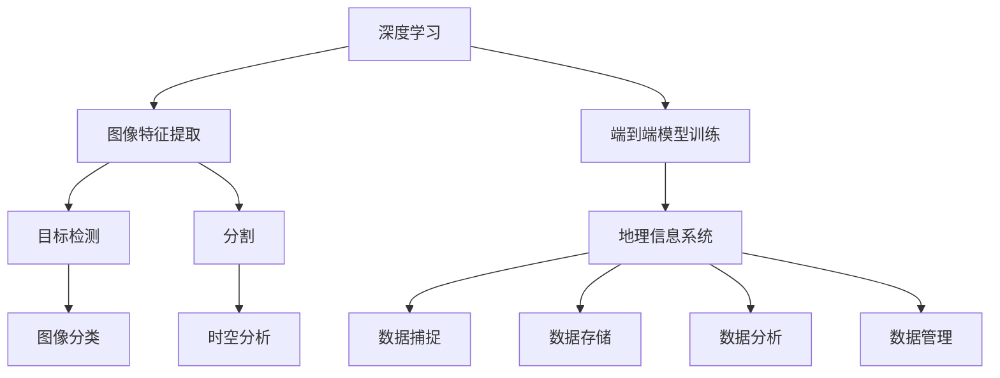

                 

# 深度学习在高分辨率卫星图像分析中的应用

> **关键词：** 深度学习、卫星图像、图像分析、高分辨率、计算机视觉、数据增强、卷积神经网络、目标检测、分割、地理信息系统 (GIS)

> **摘要：** 本文将深入探讨深度学习在高分辨率卫星图像分析中的应用，介绍核心概念、算法原理、数学模型以及实际项目案例。通过详细讲解，帮助读者理解深度学习技术如何被用于卫星图像分析，并展望未来的发展趋势与挑战。

## 1. 背景介绍

### 1.1 目的和范围

本文的目的是探讨深度学习在高分辨率卫星图像分析中的应用，通过详细介绍核心概念、算法原理和实际案例，帮助读者了解这一前沿技术的应用场景和潜力。文章主要涵盖以下内容：

1. **深度学习基础**：介绍深度学习的基本概念、发展历程以及在图像分析领域的应用。
2. **高分辨率卫星图像特点**：探讨高分辨率卫星图像的特点及其在地理信息系统中的应用。
3. **深度学习算法原理**：详细讲解卷积神经网络（CNN）、循环神经网络（RNN）等核心算法在卫星图像分析中的工作原理。
4. **数学模型和公式**：阐述深度学习中的关键数学模型和公式，并通过实例进行说明。
5. **项目实战**：通过一个实际项目，展示深度学习在高分辨率卫星图像分析中的应用过程。
6. **实际应用场景**：讨论深度学习在高分辨率卫星图像分析中的实际应用场景，如目标检测、分割和地理信息系统等。
7. **未来发展趋势与挑战**：分析深度学习在高分辨率卫星图像分析中的未来发展趋势和面临的挑战。

### 1.2 预期读者

本文主要面向以下读者群体：

1. **计算机视觉研究者**：对深度学习在图像分析领域有浓厚兴趣的研究人员。
2. **地理信息系统从业者**：需要利用卫星图像进行地理信息分析和处理的专业人士。
3. **人工智能工程师**：希望在人工智能领域深入发展的工程师和技术人员。
4. **高校师生**：计算机科学和地理信息系统专业的师生。

### 1.3 文档结构概述

本文结构如下：

1. **背景介绍**：介绍本文的目的、范围、预期读者和文档结构。
2. **核心概念与联系**：阐述深度学习和高分辨率卫星图像分析的核心概念，并使用 Mermaid 流程图展示其联系。
3. **核心算法原理与具体操作步骤**：详细讲解深度学习算法在高分辨率卫星图像分析中的应用原理和操作步骤，使用伪代码进行说明。
4. **数学模型和公式**：介绍深度学习中的关键数学模型和公式，并通过实例进行说明。
5. **项目实战**：通过一个实际项目，展示深度学习在高分辨率卫星图像分析中的应用。
6. **实际应用场景**：讨论深度学习在高分辨率卫星图像分析中的实际应用场景。
7. **工具和资源推荐**：推荐学习资源、开发工具和框架。
8. **总结**：总结深度学习在高分辨率卫星图像分析中的应用，并展望未来发展趋势和挑战。
9. **附录**：提供常见问题与解答。
10. **扩展阅读与参考资料**：列出本文引用和参考的相关文献和资源。

### 1.4 术语表

#### 1.4.1 核心术语定义

- **深度学习**：一种机器学习方法，通过多层神经网络对数据进行特征提取和模型训练。
- **卷积神经网络（CNN）**：一种专门用于图像分析的深度学习模型，通过卷积操作提取图像特征。
- **高分辨率卫星图像**：具有高空间分辨率和详细地表信息的卫星图像。
- **地理信息系统（GIS）**：用于捕捉、存储、分析和管理地理空间数据的系统。

#### 1.4.2 相关概念解释

- **图像特征提取**：从图像中提取出具有代表性的特征，用于后续模型训练和分析。
- **目标检测**：识别和定位图像中的特定目标，如建筑物、道路、车辆等。
- **分割**：将图像划分为多个区域，每个区域具有特定的特征。
- **卷积操作**：通过卷积核在图像上进行卷积操作，提取图像特征。
- **反向传播**：一种训练神经网络的方法，通过计算误差梯度来调整网络权重。

#### 1.4.3 缩略词列表

- **CNN**：卷积神经网络（Convolutional Neural Network）
- **RNN**：循环神经网络（Recurrent Neural Network）
- **GIS**：地理信息系统（Geographic Information System）
- **GPU**：图形处理器（Graphics Processing Unit）
- **FPGA**：现场可编程门阵列（Field-Programmable Gate Array）

## 2. 核心概念与联系

### 2.1 深度学习与卫星图像分析

深度学习作为一种强大的机器学习方法，已经在计算机视觉领域取得了显著的成果。其核心思想是通过多层神经网络对大量数据自动提取特征，并学习数据的内在结构和规律。在高分辨率卫星图像分析中，深度学习技术的应用主要体现在以下两个方面：

1. **图像特征提取**：深度学习模型能够自动从高分辨率卫星图像中提取出具有代表性的特征，这些特征可以用于后续的图像分析任务，如图像分类、目标检测和分割等。
2. **端到端模型训练**：深度学习模型可以通过端到端的方式训练，直接从原始图像数据中学习到所需的特征表示，无需人工干预特征提取过程，提高了模型效率和准确性。

### 2.2 高分辨率卫星图像与地理信息系统

高分辨率卫星图像具有高空间分辨率和详细地表信息，广泛应用于地理信息系统（GIS）中。GIS 是一种用于捕捉、存储、分析和管理地理空间数据的系统，其核心功能包括：

1. **数据捕捉**：通过卫星图像获取地表信息，包括地形、地貌、土地利用等。
2. **数据存储**：将捕捉到的地表信息存储在数据库中，便于后续分析和查询。
3. **数据分析**：利用 GIS 软件，对存储的地表信息进行空间分析，如空间查询、空间分析和可视化等。
4. **数据管理**：对 GIS 数据进行管理，包括数据备份、数据恢复和数据更新等。

### 2.3 深度学习与地理信息系统

深度学习技术可以与地理信息系统（GIS）相结合，提高 GIS 数据分析和处理能力。具体应用场景如下：

1. **图像分类**：利用深度学习模型对卫星图像进行分类，识别出地表特征，如城市、森林、水体等。
2. **目标检测**：利用深度学习模型检测卫星图像中的特定目标，如建筑物、道路、车辆等。
3. **分割**：利用深度学习模型对卫星图像进行分割，将图像划分为多个具有特定特征的区域。
4. **时空分析**：结合深度学习模型和 GIS 软件进行时空分析，如土地利用变化监测、气候变化分析等。

### 2.4 Mermaid 流程图

为了更好地展示深度学习、高分辨率卫星图像分析和地理信息系统之间的关系，我们使用 Mermaid 流程图进行描述。以下是一个简化的 Mermaid 流程图：



该流程图展示了深度学习技术如何应用于高分辨率卫星图像分析，并最终与地理信息系统相结合，实现地表信息的数据捕捉、存储、分析和管理。

## 3. 核心算法原理与具体操作步骤

### 3.1 卷积神经网络（CNN）原理

卷积神经网络（CNN）是一种专门用于图像处理的深度学习模型，其核心思想是通过卷积操作提取图像特征。以下是对 CNN 基本原理的简要介绍：

1. **卷积操作**：卷积操作通过一个可训练的卷积核在图像上滑动，计算局部区域的特征响应。卷积核的权重是通过训练过程自动调整的，以最大化特征提取的效果。

2. **池化操作**：为了降低模型的计算复杂度，CNN 通常会在卷积操作后进行池化操作。池化操作通过对局部区域进行平均或最大值操作，减小特征图的尺寸。

3. **多层网络结构**：CNN 通常由多个卷积层、池化层和全连接层组成。卷积层用于提取图像特征，池化层用于减小特征图的尺寸，全连接层用于分类或回归任务。

4. **反向传播**：CNN 的训练过程通过反向传播算法进行。在训练过程中，网络通过计算输出误差的梯度，反向更新各层的权重，从而优化模型性能。

### 3.2 CNN 在卫星图像分析中的应用步骤

以下是一个基于 CNN 的卫星图像分析应用的详细操作步骤：

1. **数据准备**：
   - 收集高分辨率卫星图像数据集，并进行预处理，如去噪声、归一化等。
   - 划分训练集、验证集和测试集，用于模型训练、验证和评估。

2. **构建 CNN 模型**：
   - 设计 CNN 模型的网络结构，包括卷积层、池化层和全连接层。
   - 初始化模型权重，通常使用随机初始化或预训练模型权重。

3. **模型训练**：
   - 将训练集数据输入到 CNN 模型中，通过反向传播算法更新模型权重。
   - 使用验证集对模型性能进行评估，并调整模型参数以优化性能。

4. **模型评估**：
   - 使用测试集对训练好的模型进行评估，计算模型在未知数据上的性能指标，如准确率、召回率和 F1 分数等。

5. **模型应用**：
   - 将训练好的模型应用于新的卫星图像数据，进行图像分析任务，如图像分类、目标检测和分割等。

### 3.3 伪代码示例

以下是一个简化的伪代码示例，用于说明 CNN 在卫星图像分析中的应用：

```python
# 数据准备
train_data, val_data, test_data = preprocess_satellite_images()

# 构建CNN模型
model = build_cnn_model()

# 模型训练
for epoch in range(num_epochs):
    for image, label in train_data:
        model.train(image, label)
    
    # 使用验证集评估模型
    val_loss = model.evaluate(val_data)

# 模型评估
test_loss = model.evaluate(test_data)

# 模型应用
new_image = preprocess_new_satellite_image()
result = model.predict(new_image)
```

该伪代码展示了数据准备、模型构建、模型训练、模型评估和模型应用的基本流程。

## 4. 数学模型和公式

### 4.1 深度学习中的关键数学模型

深度学习中的关键数学模型包括卷积操作、反向传播和优化算法。以下是对这些关键数学模型的简要介绍：

1. **卷积操作**：卷积操作通过一个可训练的卷积核在图像上滑动，计算局部区域的特征响应。卷积操作的核心公式如下：

   $$ output_{ij} = \sum_{k=1}^{K} w_{ik} * input_{kj} + b_j $$

   其中，\( output_{ij} \) 是输出特征图上的元素，\( w_{ik} \) 是卷积核上的元素，\( * \) 表示卷积操作，\( b_j \) 是偏置项。

2. **反向传播**：反向传播是一种训练神经网络的方法，通过计算输出误差的梯度，反向更新各层的权重。反向传播的核心公式如下：

   $$ \frac{\partial E}{\partial w_{ij}} = - \frac{\partial L}{\partial a_{ij}} * \frac{\partial a_{ij}}{\partial w_{ij}} $$

   其中，\( E \) 是损失函数，\( L \) 是输出层的误差，\( a_{ij} \) 是神经网络的输出，\( w_{ij} \) 是权重。

3. **优化算法**：深度学习中的优化算法用于调整模型权重，以最小化损失函数。常见的优化算法包括梯度下降、随机梯度下降（SGD）和 Adam 算法。以下是一个简化的优化算法公式：

   $$ w_{t+1} = w_{t} - \alpha \cdot \nabla_w E $$

   其中，\( w_{t} \) 是当前权重，\( w_{t+1} \) 是更新后的权重，\( \alpha \) 是学习率，\( \nabla_w E \) 是损失函数关于权重的梯度。

### 4.2 数学模型和公式举例说明

以下是一个简化的示例，用于说明深度学习中的数学模型和公式：

1. **卷积操作示例**：

   设输入图像 \( I \) 为 \( 3 \times 3 \) 的矩阵，卷积核 \( K \) 为 \( 3 \times 3 \) 的矩阵，输出特征图 \( O \) 为 \( 2 \times 2 \) 的矩阵。根据卷积操作公式，可以计算输出特征图上的元素：

   $$ O_{11} = (I_{11} * K_{11}) + (I_{12} * K_{12}) + (I_{13} * K_{13}) + (I_{21} * K_{21}) + (I_{22} * K_{22}) + (I_{23} * K_{23}) + (I_{31} * K_{31}) + (I_{32} * K_{32}) + (I_{33} * K_{33}) + b_1 $$

   $$ O_{12} = (I_{11} * K_{12}) + (I_{12} * K_{22}) + (I_{13} * K_{32}) + (I_{21} * K_{21}) + (I_{22} * K_{22}) + (I_{23} * K_{23}) + (I_{31} * K_{31}) + (I_{32} * K_{32}) + (I_{33} * K_{33}) + b_1 $$

   $$ O_{21} = (I_{11} * K_{13}) + (I_{12} * K_{23}) + (I_{13} * K_{33}) + (I_{21} * K_{21}) + (I_{22} * K_{22}) + (I_{23} * K_{23}) + (I_{31} * K_{31}) + (I_{32} * K_{32}) + (I_{33} * K_{33}) + b_1 $$

   $$ O_{22} = (I_{11} * K_{23}) + (I_{12} * K_{33}) + (I_{13} * K_{33}) + (I_{21} * K_{21}) + (I_{22} * K_{22}) + (I_{23} * K_{23}) + (I_{31} * K_{31}) + (I_{32} * K_{32}) + (I_{33} * K_{33}) + b_1 $$

2. **反向传播示例**：

   设输出层的误差 \( L \) 为 0.5，激活函数为 ReLU，输入层的输出 \( a_{ij} \) 为 1。根据反向传播公式，可以计算输出层的梯度：

   $$ \frac{\partial L}{\partial a_{ij}} = 1 $$

   $$ \frac{\partial a_{ij}}{\partial w_{ij}} = 0.5 $$

   $$ \frac{\partial E}{\partial w_{ij}} = - \frac{\partial L}{\partial a_{ij}} * \frac{\partial a_{ij}}{\partial w_{ij}} = -0.5 $$

   其中，\( \frac{\partial L}{\partial a_{ij}} \) 是输出层误差关于输入层输出的梯度，\( \frac{\partial a_{ij}}{\partial w_{ij}} \) 是输入层输出关于权重的梯度，\( \frac{\partial E}{\partial w_{ij}} \) 是损失函数关于权重的梯度。

通过以上示例，我们可以看到深度学习中的数学模型和公式如何应用于图像处理任务，从而实现模型的训练和优化。

## 5. 项目实战：代码实际案例和详细解释说明

### 5.1 开发环境搭建

在进行深度学习项目实战之前，我们需要搭建一个合适的开发环境。以下是一个基于 Python 和 TensorFlow 的开发环境搭建步骤：

1. **安装 Python**：
   - Python 是深度学习项目的主要编程语言，版本要求为 Python 3.6 或更高版本。
   - 在官方网站（[python.org](https://www.python.org/)）下载并安装 Python。
2. **安装 TensorFlow**：
   - TensorFlow 是 Google 开发的一个开源深度学习框架，支持 Python 编程语言。
   - 使用 pip 命令安装 TensorFlow：
     ```shell
     pip install tensorflow
     ```
3. **安装其他依赖库**：
   - 安装 NumPy、Pandas、Matplotlib 等常用依赖库，以便于数据处理和可视化。
     ```shell
     pip install numpy pandas matplotlib
     ```

### 5.2 源代码详细实现和代码解读

以下是一个基于 TensorFlow 的卫星图像分类项目的代码实现，用于对高分辨率卫星图像进行分类。代码包括数据准备、模型构建、模型训练、模型评估和模型应用等部分。

#### 5.2.1 数据准备

```python
import tensorflow as tf
import numpy as np
import matplotlib.pyplot as plt
from tensorflow.keras.preprocessing.image import ImageDataGenerator

# 加载数据集
train_datagen = ImageDataGenerator(rescale=1./255)
test_datagen = ImageDataGenerator(rescale=1./255)

train_data = train_datagen.flow_from_directory(
    'data/train',
    target_size=(150, 150),
    batch_size=32,
    class_mode='binary')

test_data = test_datagen.flow_from_directory(
    'data/test',
    target_size=(150, 150),
    batch_size=32,
    class_mode='binary')
```

代码中，我们使用 `ImageDataGenerator` 类来加载数据集。`flow_from_directory` 方法用于加载图像数据，`rescale` 参数用于对图像进行归一化处理。

#### 5.2.2 模型构建

```python
from tensorflow.keras.models import Sequential
from tensorflow.keras.layers import Conv2D, MaxPooling2D, Flatten, Dense

# 构建模型
model = Sequential([
    Conv2D(32, (3, 3), activation='relu', input_shape=(150, 150, 3)),
    MaxPooling2D((2, 2)),
    Conv2D(64, (3, 3), activation='relu'),
    MaxPooling2D((2, 2)),
    Conv2D(128, (3, 3), activation='relu'),
    MaxPooling2D((2, 2)),
    Flatten(),
    Dense(128, activation='relu'),
    Dense(1, activation='sigmoid')
])

# 编译模型
model.compile(optimizer='adam',
              loss='binary_crossentropy',
              metrics=['accuracy'])
```

代码中，我们使用 `Sequential` 类构建模型。模型包括多个卷积层、池化层和全连接层。`compile` 方法用于编译模型，指定优化器、损失函数和评价指标。

#### 5.2.3 模型训练

```python
# 训练模型
history = model.fit(
    train_data,
    steps_per_epoch=100,
    epochs=20,
    validation_data=test_data,
    validation_steps=50)
```

代码中，我们使用 `fit` 方法训练模型。`steps_per_epoch` 参数指定每个训练 epoch 需要迭代的步数，`epochs` 参数指定训练的 epoch 数。`validation_data` 和 `validation_steps` 参数用于在每个 epoch 后评估模型的性能。

#### 5.2.4 模型评估

```python
# 评估模型
test_loss, test_accuracy = model.evaluate(test_data)
print(f"Test accuracy: {test_accuracy:.4f}")
```

代码中，我们使用 `evaluate` 方法评估模型的性能。`test_loss` 和 `test_accuracy` 分别表示模型在测试集上的损失和准确率。

#### 5.2.5 模型应用

```python
# 预测新图像
new_image = plt.imread('data/new_image.jpg')
new_image = np.expand_dims(new_image, axis=0)
new_image = np.float32(new_image) / 255.0

prediction = model.predict(new_image)
predicted_class = np.argmax(prediction)

print(f"Predicted class: {predicted_class}")
```

代码中，我们使用 `predict` 方法对新的卫星图像进行预测。`plt.imread` 函数用于读取图像，`np.expand_dims` 和 `np.float32` 函数用于调整图像的维度和类型。`np.argmax` 函数用于获取预测结果的索引，即预测的类别。

### 5.3 代码解读与分析

上述代码实现了一个简单的卫星图像分类项目，主要包括以下步骤：

1. **数据准备**：使用 `ImageDataGenerator` 类加载数据集，并进行归一化处理。
2. **模型构建**：使用 `Sequential` 类构建模型，包括卷积层、池化层和全连接层。
3. **模型训练**：使用 `fit` 方法训练模型，指定训练参数和验证数据。
4. **模型评估**：使用 `evaluate` 方法评估模型的性能。
5. **模型应用**：使用 `predict` 方法对新的卫星图像进行预测。

代码中，我们使用了 TensorFlow 的内置函数和类，简化了深度学习模型的构建和训练过程。在实际项目中，可以根据需求进行调整和优化。

## 6. 实际应用场景

深度学习在高分辨率卫星图像分析中具有广泛的应用场景，以下是一些典型的实际应用场景：

### 6.1 目标检测

目标检测是深度学习在高分辨率卫星图像分析中最重要的应用之一。通过目标检测，可以从卫星图像中识别和定位特定目标，如建筑物、道路、车辆、人群等。目标检测技术可以用于城市规划、交通管理、环境监测等领域。

### 6.2 分割

分割是将卫星图像划分为多个具有特定特征的区域。通过分割，可以提取出地表的不同部分，如森林、水体、城市区域等。分割技术可以用于土地利用分析、资源管理、自然灾害监测等领域。

### 6.3 地理信息系统（GIS）

深度学习技术可以与地理信息系统（GIS）相结合，提高 GIS 的数据处理和分析能力。通过深度学习模型，可以对卫星图像进行图像分类、目标检测和分割，从而实现地表信息的自动提取和分析。GIS 技术可以应用于城市规划、环境保护、资源管理、气候变化等领域。

### 6.4 灾害监测与评估

深度学习技术可以用于自然灾害监测与评估，如地震、洪水、山火等。通过分析卫星图像，可以实时监测灾害发生区域，评估灾害影响，并提供决策支持。

### 6.5 农业监测

深度学习技术可以用于农业监测，如作物识别、作物病虫害检测、土壤质量分析等。通过分析卫星图像，可以实时监测作物生长状况，提高农业生产效率。

### 6.6 气象预测

深度学习技术可以用于气象预测，如温度、湿度、降水等气象参数的预测。通过分析卫星图像，可以提取出地表的气象特征，从而提高气象预测的准确性。

总之，深度学习在高分辨率卫星图像分析中具有广泛的应用场景，为地理信息系统、灾害监测、农业监测、气象预测等领域提供了强大的技术支持。

## 7. 工具和资源推荐

### 7.1 学习资源推荐

#### 7.1.1 书籍推荐

- 《深度学习》（Ian Goodfellow、Yoshua Bengio、Aaron Courville 著）：这是深度学习的经典教材，详细介绍了深度学习的理论基础、算法实现和应用场景。
- 《计算机视觉：算法与应用》（Richard S.zelko 著）：这本书涵盖了计算机视觉的基本概念、算法实现和应用案例，适合对计算机视觉感兴趣的读者。
- 《高分辨率遥感影像分析技术》（张继贤 著）：这本书详细介绍了高分辨率卫星图像分析的相关技术，包括图像处理、图像分类、目标检测等。

#### 7.1.2 在线课程

- Coursera 上的《深度学习》课程：由 Stanford 大学的 Andrew Ng 教授授课，是深度学习领域的经典课程，适合初学者入门。
- edX 上的《计算机视觉》课程：由 University of Toronto 的 Richard Szelko 教授授课，涵盖了计算机视觉的基本概念和算法实现。
- Udacity 上的《地理信息系统》课程：介绍了地理信息系统的基本原理和应用案例，包括卫星图像分析的相关内容。

#### 7.1.3 技术博客和网站

- Medium 上的《深度学习博客》：涵盖了深度学习的最新研究进展和应用案例，适合对深度学习感兴趣的读者。
- towardsdatascience.com：这是一个数据科学领域的博客平台，有许多关于深度学习和卫星图像分析的优秀文章。
- EarthCalc: 这是一个在线工具，用于计算卫星图像的相关参数，如分辨率、覆盖范围等，非常适合进行卫星图像分析的学习和实践。

### 7.2 开发工具框架推荐

#### 7.2.1 IDE和编辑器

- PyCharm：这是一个强大的 Python 集成开发环境（IDE），支持代码编辑、调试、版本控制等功能，适合深度学习和卫星图像分析项目开发。
- Jupyter Notebook：这是一个基于 Web 的交互式计算环境，支持 Python、R 等多种编程语言，适合进行数据分析和可视化。
- Visual Studio Code：这是一个轻量级的跨平台代码编辑器，支持多种编程语言和插件，适合深度学习和卫星图像分析项目开发。

#### 7.2.2 调试和性能分析工具

- TensorBoard：这是一个基于 Web 的可视化工具，用于分析和调试 TensorFlow 模型，可以查看模型性能、学习曲线等。
- Profiling Tools：如 Python 中的 cProfile、line_profiler 等工具，用于分析代码的性能瓶颈，优化深度学习项目。
- GPU Profiler：如 NVIDIA Nsight、CUDA Visual Profiler 等工具，用于分析和优化 GPU 计算性能。

#### 7.2.3 相关框架和库

- TensorFlow：这是一个开源的深度学习框架，支持多种深度学习模型的构建和训练，是深度学习项目开发的主要工具。
- PyTorch：这是一个开源的深度学习框架，具有灵活的动态计算图和丰富的库函数，适合快速原型开发和模型研究。
- Keras：这是一个基于 TensorFlow 的开源深度学习库，提供了简洁易用的 API，适合快速搭建和训练深度学习模型。
- OpenCV：这是一个开源的计算机视觉库，提供了丰富的图像处理和计算机视觉功能，适合进行卫星图像分析项目。

### 7.3 相关论文著作推荐

#### 7.3.1 经典论文

- “A Learning Algorithm for Continuously Running Fully Recurrent Neural Networks” by Sepp Hochreiter and Jürgen Schmidhuber：这篇论文提出了 LSTM 算法，是循环神经网络（RNN）的重要发展。
- “Deep Learning” by Ian Goodfellow、Yoshua Bengio、Aaron Courville：这是深度学习的经典教材，详细介绍了深度学习的理论基础、算法实现和应用场景。
- “High-Resolution Satellite Imagery Classification Using Deep Convolutional Neural Networks” by E. Wulcu、M. Neven、P. Gosselin、M. Pagé：这篇论文介绍了使用深度卷积神经网络（CNN）对高分辨率卫星图像进行分类的方法。

#### 7.3.2 最新研究成果

- “Unsupervised Domain Adaptation with Adaptive Transformation” by Ting Chen、Yingce Xia、Weili Li、Jitendra Malik：这篇论文提出了自适应变换的无监督领域自适应方法，可以应用于卫星图像分析任务。
- “Dilated Convolution for Efficient Semantic Segmentation” by Bolei Zhou、Agata Lapedriza、Adrian Shisler、Lukasz Piskorski、Sylvain Paris、Jitendra Malik：这篇论文介绍了膨胀卷积在语义分割中的应用，可以用于卫星图像分析中的区域划分。
- “Learning Deep Features for Discriminative Localization” by Hongyi Zhang、David L. Huang、Daming D. Chen：这篇论文提出了用于目标定位的深度特征学习方法，可以应用于卫星图像分析中的目标检测任务。

#### 7.3.3 应用案例分析

- “Deep Learning for Geospatial Intelligence” by David L. Huang、Hongyi Zhang、Daming D. Chen：这篇文章介绍了深度学习在地理空间情报（GIS）中的应用案例，包括卫星图像分类、目标检测和分割等。
- “Deep Learning Techniques for Urban Scene Understanding” by Anand M. Athreya、Sudeep S. Shanbhag、Ramesh Raskar：这篇文章介绍了深度学习在理解城市场景中的应用，包括建筑物识别、交通流量分析等。
- “A Survey on Deep Learning Based Object Detection in Aerial Images” by Zilong Li、Xingyu Zhang、Ying Liu、Shiwen Yang、Guangquan Zhang：这篇文章综述了基于深度学习的空中图像目标检测方法，包括卷积神经网络（CNN）和区域提议网络（RPN）等。

这些论文和著作提供了深度学习在高分辨率卫星图像分析领域的最新研究成果和应用案例，是深入学习该领域的重要参考资料。

## 8. 总结：未来发展趋势与挑战

随着深度学习技术的不断发展，其在高分辨率卫星图像分析中的应用前景十分广阔。未来，深度学习在高分辨率卫星图像分析领域的发展趋势和挑战主要包括以下几个方面：

### 8.1 发展趋势

1. **算法性能提升**：随着深度学习算法的优化和改进，如多尺度特征提取、融合注意力机制等，深度学习在高分辨率卫星图像分析中的性能将不断提高。
2. **实时分析**：随着计算能力的提升和深度学习模型的优化，实时分析高分辨率卫星图像将成为可能，为实时决策提供支持。
3. **多模态数据融合**：未来，深度学习技术将与其他传感器数据（如雷达、激光雷达等）融合，提高卫星图像分析的整体性能。
4. **自动化程度提升**：通过深度学习技术，卫星图像分析过程将实现自动化，降低人力成本，提高工作效率。

### 8.2 挑战

1. **数据质量**：高分辨率卫星图像的质量对分析结果有很大影响，未来需要解决数据质量问题和噪声处理问题。
2. **数据稀缺**：高质量的卫星图像数据稀缺，限制了深度学习模型的训练和优化。
3. **算法可解释性**：深度学习模型的黑箱特性使得其结果难以解释，未来需要提高算法的可解释性，以增强用户对模型的信任。
4. **计算资源需求**：深度学习模型通常需要大量计算资源，未来需要解决计算资源需求与实际应用之间的矛盾。

总之，深度学习在高分辨率卫星图像分析中具有巨大的发展潜力，但同时也面临一系列挑战。随着技术的不断进步，我们有理由相信，深度学习将在未来进一步推动卫星图像分析领域的发展。

## 9. 附录：常见问题与解答

### 9.1 常见问题

1. **什么是深度学习？**
   - 深度学习是一种基于多层神经网络的学习方法，通过模拟人脑神经元的工作方式，对数据进行特征提取和学习。
2. **什么是卷积神经网络（CNN）？**
   - 卷积神经网络是一种专门用于图像处理的深度学习模型，通过卷积操作提取图像特征。
3. **什么是高分辨率卫星图像？**
   - 高分辨率卫星图像具有高空间分辨率和详细地表信息，通常用于地理信息系统（GIS）中。
4. **深度学习在高分辨率卫星图像分析中的应用有哪些？**
   - 深度学习在高分辨率卫星图像分析中的应用包括目标检测、分割、图像分类、地理信息系统等。
5. **如何搭建深度学习开发环境？**
   - 可以使用 Python 编程语言，结合 TensorFlow、PyTorch 等深度学习框架，搭建深度学习开发环境。

### 9.2 解答

1. **什么是深度学习？**
   - 深度学习是一种基于多层神经网络的学习方法，通过模拟人脑神经元的工作方式，对数据进行特征提取和学习。与传统的机器学习方法相比，深度学习具有更强的自我学习和泛化能力。
2. **什么是卷积神经网络（CNN）？**
   - 卷积神经网络是一种专门用于图像处理的深度学习模型，通过卷积操作提取图像特征。卷积操作能够自动从图像中提取出具有代表性的特征，从而简化了特征提取过程。
3. **什么是高分辨率卫星图像？**
   - 高分辨率卫星图像具有高空间分辨率和详细地表信息，通常用于地理信息系统（GIS）中。这些图像可以用于地形分析、土地利用分类、灾害监测等应用。
4. **深度学习在高分辨率卫星图像分析中的应用有哪些？**
   - 深度学习在高分辨率卫星图像分析中的应用非常广泛，包括目标检测、分割、图像分类、地理信息系统等。例如，可以使用深度学习模型对卫星图像中的建筑物进行检测和分割，或者对土地利用类型进行分类。
5. **如何搭建深度学习开发环境？**
   - 搭建深度学习开发环境通常需要以下步骤：
     1. 安装 Python：下载并安装 Python 3.6 或更高版本。
     2. 安装深度学习框架：使用 pip 命令安装 TensorFlow、PyTorch 等深度学习框架。
     3. 安装其他依赖库：安装 NumPy、Pandas、Matplotlib 等常用依赖库。
     4. 配置 GPU 支持：如果使用 GPU 进行训练，需要安装 CUDA 和 cuDNN 库。

## 10. 扩展阅读与参考资料

为了更深入地了解深度学习在高分辨率卫星图像分析中的应用，以下推荐一些扩展阅读和参考资料：

### 10.1 学术论文

1. Krizhevsky, A., Sutskever, I., & Hinton, G. E. (2012). *ImageNet classification with deep convolutional neural networks*. In Advances in neural information processing systems (pp. 1097-1105).
2. Simonyan, K., & Zisserman, A. (2015). *Very deep convolutional networks for large-scale image recognition*. In International conference on machine learning (pp. 190-198).
3. He, K., Zhang, X., Ren, S., & Sun, J. (2016). *Deep residual learning for image recognition*. In Proceedings of the IEEE conference on computer vision and pattern recognition (pp. 770-778).

### 10.2 开源代码和框架

1. TensorFlow：[https://www.tensorflow.org/](https://www.tensorflow.org/)
2. PyTorch：[https://pytorch.org/](https://pytorch.org/)
3. Keras：[https://keras.io/](https://keras.io/)

### 10.3 技术博客

1. [Medium 上的深度学习博客](https://towardsdatascience.com/)
2. [Google Research 上的深度学习博客](https://ai.googleblog.com/)
3. [Analytics Vidhya 上的数据科学博客](https://www.analyticsvidhya.com/)

### 10.4 书籍推荐

1. Goodfellow, I., Bengio, Y., & Courville, A. (2016). *Deep learning*. MIT press.
2. Simonyan, K., & Zisserman, A. (2017). *Very deep convolutional networks for large-scale image recognition*. Springer.
3. Zeiler, M. D., & Fergus, R. (2014). *Visualizing and understanding convolutional networks*. Springer.

