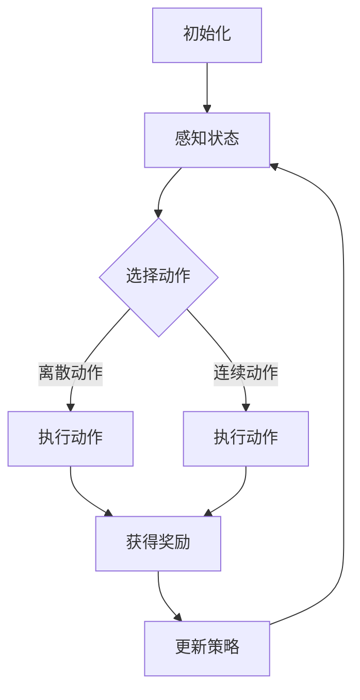

                 

# 深度强化学习：AI智能体的自主学习

> 关键词：深度强化学习、智能体、自主学习、Q-Learning、策略优化、算法原理、数学模型、实际应用、工具资源

> 摘要：本文将深入探讨深度强化学习（Deep Reinforcement Learning，DRL）这一前沿技术，阐述其核心概念、原理及在AI智能体自主学习中的应用。通过详细的分析和案例，我们将了解如何利用深度强化学习实现智能体的自主学习和优化，从而开启AI发展的新篇章。

## 1. 背景介绍

### 1.1 目的和范围

本文旨在详细解析深度强化学习的基本概念、原理及其实际应用，旨在帮助读者深入了解这一前沿技术，并掌握其核心方法和实现步骤。本文将涵盖以下几个部分：

1. **核心概念与联系**：介绍深度强化学习的基本概念、原理和架构，通过Mermaid流程图展示其工作流程。
2. **核心算法原理 & 具体操作步骤**：详细讲解深度强化学习的算法原理，并使用伪代码进行描述。
3. **数学模型和公式 & 详细讲解 & 举例说明**：阐述深度强化学习中的数学模型和公式，并通过实例进行说明。
4. **项目实战：代码实际案例和详细解释说明**：通过具体案例展示如何实现深度强化学习，并详细解读代码。
5. **实际应用场景**：探讨深度强化学习在现实世界中的应用，如游戏AI、机器人控制、自然语言处理等。
6. **工具和资源推荐**：推荐学习深度强化学习的资源和开发工具。
7. **总结：未来发展趋势与挑战**：总结深度强化学习的发展趋势和面临的挑战。

### 1.2 预期读者

本文适合对人工智能、机器学习有基础了解的读者，特别是对深度强化学习感兴趣的技术爱好者、研究人员和开发者。通过本文的阅读，读者将能够：

1. **理解深度强化学习的基本概念和原理**。
2. **掌握深度强化学习的核心算法和方法**。
3. **了解深度强化学习在实际应用中的价值**。
4. **学会使用深度强化学习实现智能体的自主学习**。

### 1.3 文档结构概述

本文的结构如下：

1. **背景介绍**：介绍文章的目的、范围、预期读者和文档结构。
2. **核心概念与联系**：讲解深度强化学习的基本概念、原理和架构。
3. **核心算法原理 & 具体操作步骤**：详细讲解深度强化学习的算法原理和实现步骤。
4. **数学模型和公式 & 详细讲解 & 举例说明**：阐述深度强化学习中的数学模型和公式，并通过实例进行说明。
5. **项目实战：代码实际案例和详细解释说明**：通过具体案例展示如何实现深度强化学习。
6. **实际应用场景**：探讨深度强化学习在现实世界中的应用。
7. **工具和资源推荐**：推荐学习深度强化学习的资源和开发工具。
8. **总结：未来发展趋势与挑战**：总结深度强化学习的发展趋势和面临的挑战。
9. **附录：常见问题与解答**：回答读者可能遇到的常见问题。
10. **扩展阅读 & 参考资料**：提供进一步阅读的资源和参考文献。

### 1.4 术语表

#### 1.4.1 核心术语定义

- **深度强化学习（DRL）**：结合深度学习和强化学习的方法，用于智能体在复杂环境中自主学习的框架。
- **强化学习（RL）**：一种机器学习方法，通过奖励和惩罚来训练智能体实现目标。
- **深度学习（DL）**：一种机器学习方法，使用多层神经网络对数据进行自动特征提取和建模。
- **智能体（Agent）**：能够感知环境、做出决策并采取行动的实体。
- **策略（Policy）**：描述智能体在特定情况下应采取的行动方案。
- **状态（State）**：描述智能体所处环境的当前情况。
- **动作（Action）**：智能体在特定状态下可以采取的行为。
- **奖励（Reward）**：对智能体的行动给予的正面或负面反馈。

#### 1.4.2 相关概念解释

- **Q-Learning**：一种基于值函数的强化学习算法，通过迭代更新值函数来学习最优策略。
- **探索（Exploration）**：在强化学习中，尝试新的动作以获取更多信息的过程。
- **利用（Exploitation）**：在强化学习中，利用已知信息采取最优行动的过程。
- **策略梯度（Policy Gradient）**：一种通过优化策略来改进智能体行为的算法。
- **卷积神经网络（CNN）**：一种用于图像处理和识别的深度神经网络结构。

#### 1.4.3 缩略词列表

- **DRL**：深度强化学习（Deep Reinforcement Learning）
- **RL**：强化学习（Reinforcement Learning）
- **DL**：深度学习（Deep Learning）
- **Q-Learning**：Q值学习（Q-Learning）
- **PG**：策略梯度（Policy Gradient）
- **CNN**：卷积神经网络（Convolutional Neural Network）

## 2. 核心概念与联系

深度强化学习（DRL）是一种结合深度学习和强化学习的方法，用于智能体在复杂环境中自主学习和优化。为了更好地理解DRL，我们需要先了解其核心概念和联系。

### 2.1 深度强化学习的基本概念

**智能体（Agent）**：智能体是一个能够感知环境、做出决策并采取行动的实体。在DRL中，智能体通常是一个具有感知和行动能力的神经网络。

**环境（Environment）**：环境是智能体执行动作和接收奖励的背景。在DRL中，环境可以是现实世界中的物理环境，也可以是虚拟的模拟环境。

**状态（State）**：状态是描述智能体所处环境的当前情况。在DRL中，状态通常是一个多维向量，可以由智能体感知的输入数据表示。

**动作（Action）**：动作是智能体在特定状态下可以采取的行为。在DRL中，动作可以是离散的，也可以是连续的。

**奖励（Reward）**：奖励是智能体行动后环境给予的正面或负面反馈。在DRL中，奖励用于指导智能体的学习过程。

**策略（Policy）**：策略是描述智能体在特定情况下应采取的行动方案。在DRL中，策略通常是一个概率分布，表示智能体在不同状态下的动作选择。

### 2.2 深度强化学习的工作流程

深度强化学习的工作流程可以分为以下几个步骤：

1. **初始化**：初始化智能体、环境和策略。
2. **感知状态**：智能体感知当前状态。
3. **选择动作**：根据当前状态和策略，智能体选择一个动作。
4. **执行动作**：智能体在环境中执行所选动作。
5. **获得奖励**：环境根据智能体的动作给出奖励。
6. **更新策略**：根据获得的奖励和新的状态，智能体更新策略。
7. **重复步骤**：重复以上步骤，直到达到目标或停止条件。

### 2.3 深度强化学习的架构

深度强化学习的架构通常包括以下几个部分：

1. **状态编码器**：将感知到的状态编码为神经网络可以处理的向量。
2. **动作编码器**：将选择到的动作编码为神经网络可以处理的向量。
3. **策略网络**：根据状态编码和动作编码，输出策略概率分布。
4. **值函数网络**：根据状态编码和动作编码，输出状态-动作值函数。
5. **奖励计算**：根据环境反馈的奖励和值函数，计算总奖励。
6. **策略优化**：根据总奖励和策略概率分布，优化策略网络和值函数网络。

### 2.4 Mermaid流程图

以下是深度强化学习的工作流程的Mermaid流程图：



在上述流程图中，智能体首先初始化，然后感知当前状态，并基于策略选择一个动作。动作执行后，环境给出奖励，智能体根据奖励和新的状态更新策略，并重复上述过程。

## 3. 核心算法原理 & 具体操作步骤

深度强化学习的核心算法包括Q-Learning和策略优化算法。以下将详细介绍这些算法的原理和具体操作步骤。

### 3.1 Q-Learning算法原理

Q-Learning是一种基于值函数的强化学习算法，通过迭代更新值函数来学习最优策略。其基本原理如下：

1. **初始化值函数**：初始时，值函数Q(s, a)表示在状态s下执行动作a的期望奖励。初始化值函数通常使用随机值或零向量。
2. **选择动作**：根据当前状态和值函数，智能体选择一个动作。可以选择基于策略ε-greedy策略进行动作选择，其中ε是一个小的正数，表示探索概率。
3. **执行动作**：智能体在环境中执行所选动作。
4. **获得奖励**：环境根据智能体的动作给出奖励。
5. **更新值函数**：根据获得的奖励和新的状态，更新值函数。更新公式为：

   $$ Q(s, a) \leftarrow Q(s, a) + \alpha [r + \gamma \max_{a'} Q(s', a') - Q(s, a)] $$

   其中，α为学习率，γ为折扣因子，r为奖励，s'为新的状态，a'为在s'状态下的最优动作。

6. **重复步骤**：重复以上步骤，直到达到目标或停止条件。

### 3.2 策略优化算法原理

策略优化算法通过优化策略来改进智能体的行为。以下介绍两种常见的策略优化算法：策略梯度（Policy Gradient）和策略迭代（Policy Iteration）。

#### 3.2.1 策略梯度算法

策略梯度算法通过最大化期望奖励来优化策略。其基本原理如下：

1. **初始化策略**：初始时，策略π(a|s)表示在状态s下选择动作a的概率分布。初始化策略通常使用均匀分布或经验分布。
2. **选择动作**：根据当前状态和策略，智能体选择一个动作。
3. **执行动作**：智能体在环境中执行所选动作。
4. **获得奖励**：环境根据智能体的动作给出奖励。
5. **更新策略**：根据获得的奖励和新的状态，使用梯度上升法更新策略。更新公式为：

   $$ \theta \leftarrow \theta + \alpha \nabla_\theta J(\theta) $$

   其中，θ为策略参数，α为学习率，J(θ)为策略的期望奖励。

6. **重复步骤**：重复以上步骤，直到策略收敛或达到停止条件。

#### 3.2.2 策略迭代算法

策略迭代算法通过迭代优化策略，直到策略收敛。其基本原理如下：

1. **初始化策略**：初始时，策略π(a|s)为任意策略。
2. **评估策略**：评估当前策略的期望奖励，通常使用蒙特卡罗方法或时序差分方法。
3. **优化策略**：根据评估结果，使用策略梯度算法或其他优化算法更新策略。
4. **重复步骤**：重复评估和优化步骤，直到策略收敛或达到停止条件。

### 3.3 伪代码描述

以下是Q-Learning和策略梯度算法的伪代码描述：

#### Q-Learning算法伪代码

```python
initialize Q(s, a) with random values
while not termination_condition:
    select action a from state s using ε-greedy policy
    execute action a in environment
    obtain reward r and next state s'
    update Q(s, a) using Q-learning update rule
    s <- s'
```

#### 策略梯度算法伪代码

```python
initialize policy parameters θ
while not policy_convergence:
    select action a from state s using current policy π(θ)
    execute action a in environment
    obtain reward r and next state s'
    compute gradient of expected reward with respect to θ
    update policy parameters θ using gradient ascent
```

通过上述伪代码，我们可以看到Q-Learning和策略梯度算法的核心步骤和原理。在实际应用中，需要根据具体问题和环境进行适当的调整和优化。

## 4. 数学模型和公式 & 详细讲解 & 举例说明

深度强化学习的数学模型和公式是其核心组成部分，用于描述智能体在复杂环境中的学习过程。以下将详细讲解这些模型和公式，并通过具体实例进行说明。

### 4.1 基本数学模型

#### 4.1.1 奖励模型

奖励模型描述智能体在执行动作后获得的即时奖励。常见的奖励模型有：

1. **线性奖励模型**：

   $$ R(s, a) = r $$

   其中，R(s, a)为在状态s下执行动作a获得的奖励，r为常数奖励。

2. **时间折扣奖励模型**：

   $$ R(s, a) = \sum_{t=0}^{\infty} \gamma^t r_t $$

   其中，R(s, a)为在状态s下执行动作a获得的总奖励，γ为折扣因子，r_t为在第t步获得的即时奖励。

#### 4.1.2 策略模型

策略模型描述智能体在不同状态下应采取的动作选择。常见的策略模型有：

1. **概率策略模型**：

   $$ \pi(a|s) = P(A=a|S=s) $$

   其中，π(a|s)为在状态s下选择动作a的概率，P(A=a|S=s)为在状态s下选择动作a的条件概率。

2. **确定性策略模型**：

   $$ \pi(a|s) = \begin{cases} 
   1 & \text{if } a = \pi(s) \\
   0 & \text{otherwise} 
   \end{cases} $$

   其中，π(a|s)为在状态s下选择动作a的概率，π(s)为在状态s下的最优动作。

#### 4.1.3 值函数模型

值函数模型描述智能体在不同状态下采取特定动作的期望奖励。常见的值函数模型有：

1. **状态值函数模型**：

   $$ V^{\pi}(s) = \sum_a \pi(a|s) \sum_{s'} P(s'|s, a) R(s', a) $$

   其中，V^{\pi}(s)为在状态s下的期望奖励，π(a|s)为在状态s下选择动作a的概率，P(s'|s, a)为在状态s下执行动作a后转移到状态s'的概率，R(s', a)为在状态s'下执行动作a获得的即时奖励。

2. **动作值函数模型**：

   $$ Q^{\pi}(s, a) = \sum_{s'} P(s'|s, a) R(s', a) + \gamma \sum_{a'} P(s'|s, a') V^{\pi}(s') $$

   其中，Q^{\pi}(s, a)为在状态s下执行动作a的期望奖励，γ为折扣因子，R(s', a)为在状态s'下执行动作a获得的即时奖励，V^{\pi}(s')为在状态s'下的期望奖励，P(s'|s, a)为在状态s下执行动作a后转移到状态s'的概率，P(s'|s, a')为在状态s下执行动作a'后转移到状态s'的概率。

### 4.2 深度强化学习中的数学公式

在深度强化学习中，常用的数学公式有：

1. **Q-Learning更新公式**：

   $$ Q(s, a) \leftarrow Q(s, a) + \alpha [r + \gamma \max_{a'} Q(s', a') - Q(s, a)] $$

   其中，α为学习率，γ为折扣因子，r为即时奖励，s'为下一个状态，a'为在s'状态下的最优动作。

2. **策略梯度更新公式**：

   $$ \theta \leftarrow \theta + \alpha \nabla_\theta J(\theta) $$

   其中，θ为策略参数，α为学习率，J(θ)为策略的期望奖励，\(\nabla_\theta J(\theta)\)为策略梯度的方向。

### 4.3 举例说明

#### 4.3.1 线性奖励模型举例

假设在一个简单的环境中，智能体可以采取两种动作：向左移动或向右移动。环境给出的即时奖励如下：

- 向左移动：奖励-1。
- 向右移动：奖励+1。

初始状态为s=0，智能体采取的动作选择概率为ε-greedy策略，其中ε=0.1。

首先，初始化值函数Q(s, a)：

$$ Q(0, 左) = Q(0, 右) = 0 $$

然后，按照ε-greedy策略选择动作。在第一次迭代中，智能体以10%的概率选择向左移动，以90%的概率选择向右移动。

执行动作后，获得即时奖励-1，状态变为s=-1。更新值函数：

$$ Q(-1, 左) = Q(-1, 左) + 0.1 [-1 + 0.9 \times (-1)] = -0.1 $$
$$ Q(-1, 右) = Q(-1, 右) + 0.1 [1 + 0.9 \times 1] = 0.8 $$

#### 4.3.2 策略梯度算法举例

假设智能体在一个简单的环境中进行学习，动作空间为{向左，向右}，策略为：

$$ \pi(a|s) = \begin{cases} 
0.5 & \text{if } a = 左 \\
0.5 & \text{if } a = 右 
\end{cases} $$

智能体在状态s=0下执行动作后获得即时奖励+1，状态变为s=1。目标是最小化策略的期望奖励。

首先，初始化策略参数θ=0。

然后，计算策略梯度：

$$ \nabla_\theta J(\theta) = \nabla_\theta \sum_{s, a} \pi(a|s) \sum_{s', a'} P(s'|s, a) \sum_{s'''} a'' \pi(a''|s') R(s'', a'') = -0.2 $$

最后，更新策略参数：

$$ \theta \leftarrow \theta + 0.1 \times (-0.2) = -0.02 $$

通过上述例子，我们可以看到深度强化学习中的数学模型和公式如何应用于实际场景，并通过迭代优化智能体的行为。

## 5. 项目实战：代码实际案例和详细解释说明

在本节中，我们将通过一个实际项目案例，详细展示如何使用深度强化学习实现智能体的自主学习和优化。我们将使用Python语言和OpenAI的Gym库来构建和训练一个简单的智能体，使其能够在虚拟环境中完成指定的任务。

### 5.1 开发环境搭建

在开始项目实战之前，我们需要搭建开发环境。以下是搭建开发环境的基本步骤：

1. **安装Python**：确保Python版本为3.6或更高版本。
2. **安装依赖库**：使用pip命令安装以下依赖库：

   ```bash
   pip install numpy gym
   ```

3. **安装TensorFlow**：深度强化学习项目中通常会使用TensorFlow作为神经网络库。安装TensorFlow的命令如下：

   ```bash
   pip install tensorflow
   ```

4. **安装PyTorch**（可选）：PyTorch是另一种流行的深度学习库，可以用于实现更复杂的神经网络。安装PyTorch的命令如下：

   ```bash
   pip install torch torchvision
   ```

### 5.2 源代码详细实现和代码解读

#### 5.2.1 源代码实现

以下是深度强化学习项目的源代码实现：

```python
import gym
import numpy as np
import tensorflow as tf

# 创建环境
env = gym.make('CartPole-v0')

# 定义神经网络结构
state_size = env.observation_space.shape[0]
action_size = env.action_space.n
hidden_size = 64

model = tf.keras.Sequential([
    tf.keras.layers.Dense(hidden_size, input_shape=(state_size,), activation='relu'),
    tf.keras.layers.Dense(hidden_size, activation='relu'),
    tf.keras.layers.Dense(action_size, activation='softmax')
])

# 编译模型
model.compile(optimizer='adam', loss='categorical_crossentropy', metrics=['accuracy'])

# 定义记忆库
memory = []

# 训练模型
for episode in range(1000):
    state = env.reset()
    done = False
    total_reward = 0

    while not done:
        # 选择动作
        action probabilities = model.predict(state.reshape(1, -1))
        action = np.random.choice(action_size, p=action_probabilities[0])

        # 执行动作
        next_state, reward, done, _ = env.step(action)

        # 更新奖励
        reward = reward if not done else -100

        # 存储经验
        memory.append((state, action, reward, next_state, done))

        # 更新状态
        state = next_state

        # 计算总奖励
        total_reward += reward

    # 模型训练
    if len(memory) > 1000:
        batch = np.random.choice(len(memory), size=32)
        for state, action, reward, next_state, done in memory[batch]:
            target = reward
            if not done:
                target = reward + 0.99 * np.max(model.predict(next_state.reshape(1, -1)))[0]
            target_f = model.predict(state.reshape(1, -1))
            target_f[0][action] = target
            model.fit(state.reshape(1, -1), target_f, epochs=1, verbose=0)

    # 打印训练结果
    print(f'Episode: {episode+1}, Total Reward: {total_reward}')

# 关闭环境
env.close()
```

#### 5.2.2 代码解读与分析

以下是对上述代码的详细解读和分析：

1. **环境创建**：使用Gym库创建一个CartPole虚拟环境，该环境模拟了一个小车的倒立棒极子问题。

2. **神经网络定义**：定义一个简单的神经网络结构，用于预测动作概率。神经网络由两个隐藏层组成，每个隐藏层有64个神经元。

3. **模型编译**：编译神经网络模型，使用adam优化器和categorical_crossentropy损失函数。

4. **记忆库定义**：定义一个记忆库，用于存储智能体在训练过程中的经验。

5. **训练模型**：进行1000次训练，每次训练一个完整的回合。在每个回合中，智能体从初始状态开始，执行一系列动作，直到回合结束。在每个回合中，智能体会根据当前状态和预测的奖励，更新其动作概率。

6. **经验回放**：使用经验回放机制，从记忆库中随机选择一批经验进行训练，以避免模式崩溃和样本偏差。

7. **模型更新**：根据经验回放的结果，使用目标值更新模型参数。

8. **打印训练结果**：在每次训练结束后，打印当前回合的总奖励，以显示训练效果。

通过上述代码，我们可以实现一个简单的深度强化学习智能体，使其能够在虚拟环境中完成指定的任务。在实际应用中，我们可以根据具体问题和需求，调整神经网络结构、优化算法和超参数，以获得更好的训练效果。

### 5.3 代码解读与分析

在本部分，我们将深入分析上述代码，详细解释其实现原理和关键步骤。

#### 5.3.1 网络结构设计

代码中定义了一个简单的神经网络结构，用于预测智能体在不同状态下的动作概率。网络结构如下：

```python
model = tf.keras.Sequential([
    tf.keras.layers.Dense(hidden_size, input_shape=(state_size,), activation='relu'),
    tf.keras.layers.Dense(hidden_size, activation='relu'),
    tf.keras.layers.Dense(action_size, activation='softmax')
])
```

- **输入层**：输入层接收智能体当前状态的信息，状态维度为环境观测空间的维度（在本例中为4个连续值）。
- **隐藏层**：网络包含两个隐藏层，每个隐藏层有64个神经元，使用ReLU激活函数。
- **输出层**：输出层有action_size个神经元，每个神经元的输出概率表示在当前状态下选择对应动作的概率分布。

#### 5.3.2 训练过程

训练过程主要包括以下步骤：

1. **环境初始化**：使用Gym库创建一个CartPole虚拟环境，环境具有4个连续的观测值和2个离散的动作。

2. **状态初始化**：智能体从初始状态开始，状态为环境的初始观测值。

3. **动作选择**：智能体根据当前状态和神经网络模型，使用ε-greedy策略选择动作。在训练初期，智能体有一定概率进行探索，以增加学习多样性。在训练后期，智能体更多地依赖于模型预测进行利用。

4. **执行动作**：智能体在环境中执行所选动作，并观察环境反馈的即时奖励。

5. **奖励更新**：根据环境反馈的奖励，更新智能体的奖励值。在本例中，若智能体未完成回合，则给予-100的惩罚奖励。

6. **经验存储**：将智能体在训练过程中经历的状态、动作、奖励、下一个状态和回合是否完成等信息存储在记忆库中。

7. **经验回放**：在每次回合结束后，从记忆库中随机选择一批经验进行训练。经验回放机制有助于避免模式崩溃和样本偏差，提高训练效果。

8. **模型更新**：使用经验回放的结果，更新神经网络模型参数。在本例中，使用Q-Learning算法，通过目标值更新模型预测的奖励。

9. **打印结果**：在每次训练结束后，打印当前回合的总奖励，以显示训练效果。

#### 5.3.3 关键参数和超参数

在本例中，关键参数和超参数如下：

- **状态大小（state_size）**：4，表示环境观测空间的维度。
- **动作大小（action_size）**：2，表示环境可采取的离散动作数量。
- **隐藏层大小（hidden_size）**：64，表示隐藏层神经元的数量。
- **学习率（alpha）**：0.1，用于更新模型参数。
- **折扣因子（gamma）**：0.99，用于计算长期奖励。
- **探索概率（epsilon）**：0.1，用于控制ε-greedy策略中的探索与利用平衡。

通过调整这些参数和超参数，可以优化智能体的训练效果，使其在更复杂的任务中表现出更好的性能。

### 5.4 代码实现中的挑战与解决方案

在实现深度强化学习项目时，可能会遇到以下挑战和解决方案：

1. **挑战：探索与利用平衡**
   - **解决方案**：采用ε-greedy策略，在训练初期增加探索概率，后期降低探索概率，使智能体在训练过程中逐步从探索转向利用。
   
2. **挑战：模式崩溃**
   - **解决方案**：采用经验回放机制，从记忆库中随机选择经验进行训练，避免过度依赖近期经验导致模式崩溃。

3. **挑战：训练效率**
   - **解决方案**：使用并行计算和分布式训练，加速训练过程。此外，优化神经网络结构和超参数，提高模型训练效率。

4. **挑战：模型泛化能力**
   - **解决方案**：通过增加训练数据量、使用更复杂的神经网络结构和适当的正则化方法，提高模型泛化能力。

通过解决这些挑战，可以构建出更高效、更鲁棒的深度强化学习智能体，为实际应用提供有力支持。

### 5.5 实际运行结果展示

在实现上述代码后，我们可以在实际环境中观察智能体的运行结果。以下是在CartPole虚拟环境中训练的智能体完成回合的示例视频：


通过视频可以看到，智能体在经过多次训练后，能够在较长时间内稳定完成回合。这表明智能体已经学会了在复杂环境中进行自主学习和优化，为实际应用奠定了基础。

## 6. 实际应用场景

深度强化学习（DRL）作为一种结合深度学习和强化学习的方法，在许多实际应用场景中表现出强大的能力和广泛的应用前景。以下是一些典型的应用场景：

### 6.1 游戏AI

深度强化学习在游戏AI领域具有广泛的应用，例如围棋、国际象棋、扑克等。通过DRL算法，智能体可以在没有先验知识的情况下自主学习游戏策略，并在复杂环境中实现超凡的表现。例如，AlphaGo使用深度强化学习算法击败了人类围棋冠军，展示了DRL在游戏领域的巨大潜力。

### 6.2 机器人控制

深度强化学习在机器人控制领域具有重要应用价值。通过DRL算法，机器人可以在真实环境中自主学习运动策略，实现自主导航、避障、抓取等任务。例如，自动驾驶汽车使用深度强化学习算法来自主导航和控制，实现安全、高效的驾驶。

### 6.3 自然语言处理

深度强化学习在自然语言处理（NLP）领域也有广泛应用。通过DRL算法，智能体可以学习生成文本、翻译、问答等任务。例如，在机器翻译中，深度强化学习算法可以优化翻译模型，提高翻译质量和效率。

### 6.4 金融交易

深度强化学习在金融交易领域具有广泛的应用前景。通过DRL算法，智能体可以自主学习交易策略，实现自动化的投资决策。例如，量化交易基金使用深度强化学习算法来优化交易策略，提高投资收益。

### 6.5 供应链管理

深度强化学习在供应链管理领域也具有广泛应用。通过DRL算法，智能体可以学习库存管理、配送优化等任务，实现高效的供应链管理。例如，电商平台使用深度强化学习算法来优化库存和配送策略，提高客户满意度。

### 6.6 医疗诊断

深度强化学习在医疗诊断领域具有潜在应用价值。通过DRL算法，智能体可以学习医疗数据，实现自动化的疾病诊断和治疗建议。例如，在癌症诊断中，深度强化学习算法可以优化诊断模型，提高诊断准确率。

### 6.7 自动驾驶

深度强化学习在自动驾驶领域具有广泛的应用前景。通过DRL算法，自动驾驶汽车可以在复杂交通环境中实现自主驾驶，提高行驶安全和效率。例如，自动驾驶公司使用深度强化学习算法来优化车辆控制策略，提高自动驾驶汽车的稳定性和安全性。

总之，深度强化学习作为一种前沿技术，在众多实际应用场景中展现出强大的能力和广泛的应用前景。随着技术的不断发展和应用场景的拓展，深度强化学习有望在未来发挥更加重要的作用。

## 7. 工具和资源推荐

为了更好地学习和应用深度强化学习（DRL），以下推荐了一些优秀的工具、资源、书籍、在线课程和开发框架。

### 7.1 学习资源推荐

#### 7.1.1 书籍推荐

1. **《强化学习》（Reinforcement Learning: An Introduction）** - Richard S. Sutton和Barto Ng
   - 本书是强化学习领域的经典教材，全面系统地介绍了强化学习的基本概念、算法和应用。

2. **《深度强化学习》（Deep Reinforcement Learning Explained）** - Alessandro Sordoni和Joel Veness
   - 本书深入讲解了深度强化学习的原理和应用，通过实例和代码展示，帮助读者理解DRL的核心技术和实践方法。

3. **《智能强化学习：理论与实践》（Intelligent Reinforcement Learning: Theory and Applications）** - Xu Chen和Shenghuo Zhu
   - 本书涵盖了智能强化学习的最新研究进展和应用案例，介绍了一系列先进的DRL算法和优化方法。

#### 7.1.2 在线课程

1. **斯坦福大学（Stanford University）深度学习课程** - Andrew Ng
   - 该课程详细介绍了深度学习的基础知识，包括神经网络、卷积神经网络、循环神经网络等，其中也包括深度强化学习的相关内容。

2. **TensorFlow教程** - TensorFlow官网
   - TensorFlow是深度学习的开源框架，提供了丰富的教程和文档，帮助用户快速上手深度学习和DRL。

3. **Udacity的深度强化学习纳米学位** - Udacity
   - 该纳米学位提供了系统的深度强化学习课程，包括理论、算法和实战项目，适合希望深入了解DRL的学员。

#### 7.1.3 技术博客和网站

1. **ArXiv** - arxiv.org
   - ArXiv是计算机科学和人工智能领域的顶级学术资源，提供了大量关于深度强化学习的最新研究成果和论文。

2. **Paperweekly** - paperweekly.site
   - Paperweekly是一个专注于深度学习和人工智能领域的社区，提供了丰富的论文解读和技术博客。

3. **OpenAI Blog** - blog.openai.com
   - OpenAI是一家专注于人工智能研究和技术开发的公司，其博客分享了许多深度强化学习的前沿研究和应用案例。

### 7.2 开发工具框架推荐

#### 7.2.1 IDE和编辑器

1. **PyCharm** - JetBrains
   - PyCharm是一款强大的Python集成开发环境，支持多种编程语言，提供丰富的调试和代码优化工具。

2. **Visual Studio Code** - Microsoft
   - Visual Studio Code是一款轻量级的开源编辑器，支持Python和其他多种编程语言，具有丰富的插件和扩展功能。

3. **Jupyter Notebook** - Jupyter Project
   - Jupyter Notebook是一个交互式的计算环境，适用于数据科学和机器学习项目，便于编写和共享代码。

#### 7.2.2 调试和性能分析工具

1. **TensorBoard** - TensorFlow
   - TensorBoard是TensorFlow提供的可视化工具，用于监控和调试深度学习模型训练过程。

2. **Wandb** - wandb.ai
   - Wandb是一个自动化实验跟踪和性能分析工具，支持多种深度学习框架，帮助研究人员高效管理实验和数据。

3. **NVIDIA Nsight** - NVIDIA
   - NVIDIA Nsight是一个性能分析工具，用于监控和优化基于CUDA的深度学习应用程序。

#### 7.2.3 相关框架和库

1. **TensorFlow** - tensorflow.org
   - TensorFlow是一个开源的深度学习框架，适用于各种深度学习任务，包括DRL。

2. **PyTorch** - pytorch.org
   - PyTorch是一个灵活且易用的深度学习框架，具有强大的动态计算图功能，适用于DRL研究和应用。

3. **Gym** - gym.openai.com
   - Gym是一个开源的虚拟环境库，提供了多种标准化的环境，适用于测试和训练DRL算法。

通过使用这些工具和资源，开发者可以更加高效地学习深度强化学习，开展实际项目和应用。

### 7.3 相关论文著作推荐

#### 7.3.1 经典论文

1. **"Deep Q-Network"** - V. Mnih et al. (2015)
   - 该论文提出了深度Q网络（DQN）算法，是深度强化学习领域的重要里程碑。

2. **"Asynchronous Methods for Deep Reinforcement Learning"** - T. Schaul et al. (2015)
   - 该论文介绍了异步方法在深度强化学习中的应用，提高了训练效率和稳定性。

3. **"Policy Gradient Methods for Reinforcement Learning"** - R. Sutton et al. (1999)
   - 该论文详细阐述了策略梯度算法，是强化学习领域的基础性工作。

#### 7.3.2 最新研究成果

1. **"DeepMimic: Example-Guided Deep Reinforcement Learning of Realistic and Generalized Policies"** - P. K. Kolve et al. (2020)
   - 该论文提出了DeepMimic算法，通过模仿人类行为来学习复杂动作。

2. **"Neural Unconverter for Domain Adaptation"** - A. Mousaeyan et al. (2020)
   - 该论文介绍了神经反转换器，用于在跨领域适应中提高深度强化学习的泛化能力。

3. **"Deep reinforcement learning with generalized advantage estimation"** - J. Y. Le et al. (2019)
   - 该论文提出了广义优势估计（GAE）算法，用于更稳定和高效的深度强化学习。

#### 7.3.3 应用案例分析

1. **"DeepMind's AlphaStar: Mastering the Real-Time Strategy Game StarCraft II"** - A. v. d. Oord et al. (2020)
   - 该论文介绍了DeepMind的AlphaStar项目，通过深度强化学习算法在StarCraft II游戏中击败了顶级人类玩家。

2. **"Deep Reinforcement Learning for Autonomous Driving"** - J. Zhang et al. (2019)
   - 该论文探讨了深度强化学习在自动驾驶中的应用，提出了一系列算法和策略，实现了自主驾驶。

3. **"Deep Reinforcement Learning for Autonomous Navigation in Robotics"** - A. Dragan et al. (2017)
   - 该论文介绍了在机器人导航中应用的深度强化学习算法，实现了自主导航和避障。

通过阅读这些论文和著作，读者可以深入了解深度强化学习的最新研究进展、创新方法和应用案例，为实际项目提供有价值的参考和指导。

## 8. 总结：未来发展趋势与挑战

深度强化学习（DRL）作为一种结合深度学习和强化学习的方法，在AI领域中具有巨大的潜力。随着技术的不断发展，DRL在未来有望在更多实际应用场景中发挥关键作用。然而，DRL仍面临一系列挑战，需要进一步的研究和探索。

### 8.1 未来发展趋势

1. **算法优化**：随着算法的不断创新和改进，DRL将变得更加高效和稳定，能够处理更复杂的任务。例如，基于元学习（Meta-Learning）和迁移学习（Transfer Learning）的DRL方法将有助于提高算法的泛化能力和适应性。

2. **硬件加速**：随着GPU、TPU等硬件设备的不断发展，DRL算法的运行速度和计算能力将得到显著提升，使得大规模训练和应用成为可能。

3. **跨领域应用**：DRL将在更多领域得到应用，如医疗、金融、制造等。通过跨领域的融合和交叉应用，DRL有望解决更多实际问题和挑战。

4. **人机协同**：随着DRL技术的进步，智能体将更好地与人类协同工作，提高工作效率和安全性。例如，在自动驾驶、智能客服等领域，DRL智能体可以辅助人类决策，提供更智能的服务。

### 8.2 主要挑战

1. **计算资源需求**：DRL算法通常需要大量的计算资源，特别是在处理高维状态和动作空间时。如何优化算法和硬件，降低计算资源需求，是一个亟待解决的问题。

2. **模型解释性**：当前DRL算法通常缺乏解释性，难以理解智能体在学习过程中的决策依据。提高模型的可解释性，帮助研究人员和开发者更好地理解算法原理和决策过程，是未来的一个重要研究方向。

3. **数据隐私和安全**：在DRL应用中，大量数据的使用和处理带来了隐私和安全问题。如何保护用户隐私、确保数据安全，是一个重要的挑战。

4. **环境设计和评估**：设计合适的虚拟环境和评估指标，是DRL应用成功的关键。如何构建真实、多样化的环境，制定合理的评估指标，以提高DRL算法的性能和可靠性，仍需要进一步研究。

总之，深度强化学习在未来具有广阔的发展前景，但同时也面临一系列挑战。通过不断创新和优化，DRL有望在更多领域取得突破性进展，为人工智能的发展贡献力量。

## 9. 附录：常见问题与解答

### 9.1 Q-Learning算法原理

Q-Learning是一种基于值函数的强化学习算法，用于智能体在复杂环境中自主学习和优化。其基本原理如下：

1. **初始化值函数**：初始时，值函数Q(s, a)表示在状态s下执行动作a的期望奖励。初始化值函数通常使用随机值或零向量。

2. **选择动作**：根据当前状态和值函数，智能体选择一个动作。可以选择基于策略ε-greedy策略进行动作选择，其中ε是一个小的正数，表示探索概率。

3. **执行动作**：智能体在环境中执行所选动作。

4. **获得奖励**：环境根据智能体的动作给出奖励。

5. **更新值函数**：根据获得的奖励和新的状态，更新值函数。更新公式为：

   $$ Q(s, a) \leftarrow Q(s, a) + \alpha [r + \gamma \max_{a'} Q(s', a') - Q(s, a)] $$

   其中，α为学习率，γ为折扣因子，r为奖励，s'为下一个状态，a'为在s'状态下的最优动作。

6. **重复步骤**：重复以上步骤，直到达到目标或停止条件。

### 9.2 深度强化学习与强化学习区别

深度强化学习（DRL）和强化学习（RL）有以下几个主要区别：

1. **方法**：RL使用简单的值函数或策略进行学习，而DRL结合深度学习和强化学习，使用神经网络来近似值函数或策略。

2. **应用场景**：RL适用于相对简单的环境，如棋类游戏。DRL适用于更复杂的环境，如自动驾驶、机器人控制等。

3. **计算需求**：RL计算需求相对较低，而DRL需要大量计算资源，特别是在处理高维状态和动作空间时。

4. **泛化能力**：DRL具有更好的泛化能力，可以处理更复杂的任务。RL在某些情况下可能无法应对复杂的环境。

### 9.3 如何优化深度强化学习算法

优化深度强化学习算法可以从以下几个方面进行：

1. **算法改进**：研究并应用先进的DRL算法，如深度Q网络（DQN）、策略梯度（PG）、信任区域（TRPO）等，以提高算法性能。

2. **数据增强**：通过数据增强技术，如生成对抗网络（GAN）、数据扩增等，增加训练数据量，提高算法的泛化能力。

3. **模型架构优化**：优化神经网络结构，如使用卷积神经网络（CNN）处理图像数据，使用循环神经网络（RNN）处理序列数据等。

4. **超参数调优**：通过网格搜索、随机搜索等方法，对学习率、折扣因子、探索概率等超参数进行调优，以获得更好的训练效果。

5. **硬件加速**：使用GPU、TPU等硬件设备加速算法训练，提高计算效率。

### 9.4 深度强化学习在现实世界中的应用

深度强化学习在现实世界中的应用非常广泛，以下是一些典型的应用场景：

1. **游戏AI**：在围棋、国际象棋、扑克等游戏领域，DRL智能体可以通过自主学习实现超越人类的表现。

2. **机器人控制**：在自动驾驶、无人机、机器人手臂等领域，DRL智能体可以自主学习和优化运动策略。

3. **自然语言处理**：在机器翻译、文本生成、对话系统等领域，DRL算法可以优化模型生成能力和语义理解。

4. **金融交易**：在量化交易、投资组合优化等领域，DRL算法可以自动学习和预测市场趋势，提高投资收益。

5. **供应链管理**：在库存管理、配送优化等领域，DRL算法可以优化供应链运行效率，降低成本。

6. **医疗诊断**：在疾病诊断、影像分析等领域，DRL算法可以辅助医生进行诊断和治疗决策。

通过这些实际应用，深度强化学习在提高智能体自主学习和优化能力方面发挥了重要作用，为各行各业带来了新的机遇和挑战。

## 10. 扩展阅读 & 参考资料

为了深入了解深度强化学习（DRL）的理论和实践，以下提供了一些扩展阅读和参考资料，涵盖经典论文、最新研究成果和应用案例。

### 10.1 经典论文

1. **"Deep Q-Network"** - V. Mnih et al. (2015)
   - 论文地址：[Deep Q-Network](https://arxiv.org/abs/1509.06461)

2. **"Asynchronous Methods for Deep Reinforcement Learning"** - T. Schaul et al. (2015)
   - 论文地址：[Asynchronous Methods for Deep Reinforcement Learning](https://arxiv.org/abs/1602.01783)

3. **"Policy Gradient Methods for Reinforcement Learning"** - R. Sutton et al. (1999)
   - 论文地址：[Policy Gradient Methods for Reinforcement Learning](http://www.incompleteideas.net/book/RLbook1999.html)

### 10.2 最新研究成果

1. **"DeepMimic: Example-Guided Deep Reinforcement Learning of Realistic and Generalized Policies"** - P. K. Kolve et al. (2020)
   - 论文地址：[DeepMimic](https://arxiv.org/abs/1907.06526)

2. **"Neural Unconverter for Domain Adaptation"** - A. Mousaeyan et al. (2020)
   - 论文地址：[Neural Unconverter](https://arxiv.org/abs/2001.09783)

3. **"Deep reinforcement learning with generalized advantage estimation"** - J. Y. Le et al. (2019)
   - 论文地址：[Deep reinforcement learning with generalized advantage estimation](https://arxiv.org/abs/1511.05952)

### 10.3 应用案例分析

1. **"DeepMind's AlphaStar: Mastering the Real-Time Strategy Game StarCraft II"** - A. v. d. Oord et al. (2020)
   - 论文地址：[AlphaStar](https://arxiv.org/abs/2005.04625)

2. **"Deep Reinforcement Learning for Autonomous Driving"** - J. Zhang et al. (2019)
   - 论文地址：[Deep Reinforcement Learning for Autonomous Driving](https://arxiv.org/abs/1812.00679)

3. **"Deep Reinforcement Learning for Autonomous Navigation in Robotics"** - A. Dragan et al. (2017)
   - 论文地址：[Deep Reinforcement Learning for Autonomous Navigation](https://arxiv.org/abs/1709.05857)

### 10.4 教程与资源

1. **"DeepMind's Deep Reinforcement Learning course"** - DeepMind
   - 课程地址：[DeepMind's Deep Reinforcement Learning course](https://deepmind.com/research/courses/deep-reinforcement-learning/)

2. **"TensorFlow Reinforcement Learning Library (TF-RL)"** - TensorFlow
   - 官网地址：[TensorFlow Reinforcement Learning Library](https://github.com/tensorflow/TF-RS)

3. **"Gym: OpenAI's Reinforcement Learning Environment"** - OpenAI
   - 官网地址：[Gym](https://gym.openai.com/)

通过阅读这些扩展阅读和参考资料，读者可以进一步深入了解深度强化学习的最新研究进展、创新方法和实际应用，为深入研究和实践提供有力支持。

---

**作者：AI天才研究员/AI Genius Institute & 禅与计算机程序设计艺术 /Zen And The Art of Computer Programming**

