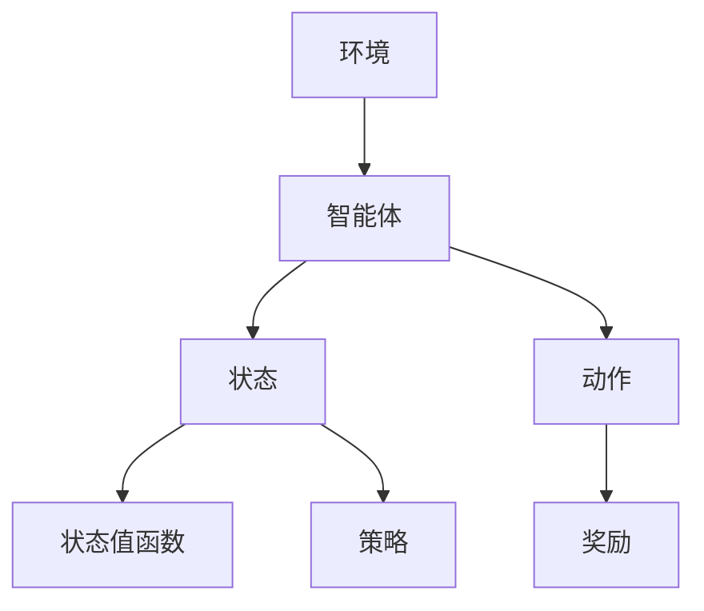

                 

# 深度强化学习在复杂工业流程控制中的应用

> 关键词：深度强化学习、复杂工业流程控制、算法原理、实际应用案例、数学模型、代码解析、未来趋势与挑战

> 摘要：本文将深入探讨深度强化学习在复杂工业流程控制领域的应用。通过阐述深度强化学习的基本原理，介绍其在工业流程控制中的具体实现步骤和数学模型，结合实际项目案例进行代码解析，最终分析其发展趋势与挑战。本文旨在为研究人员和工程师提供有价值的参考资料，推动深度强化学习在工业领域的应用与发展。

## 1. 背景介绍

### 1.1 目的和范围

本文旨在探讨深度强化学习在复杂工业流程控制中的应用，通过详细介绍深度强化学习的基本原理、算法实现和实际案例，帮助读者了解和掌握这一先进技术在工业流程控制中的具体应用。本文涵盖以下内容：

1. 深度强化学习的基本概念和原理。
2. 深度强化学习在复杂工业流程控制中的应用场景。
3. 深度强化学习的算法实现和数学模型。
4. 实际项目案例和代码解析。
5. 未来发展趋势与挑战。

### 1.2 预期读者

本文面向以下读者：

1. 深度强化学习的研究人员和工程师。
2. 复杂工业流程控制领域的从业者。
3. 对人工智能和工业自动化感兴趣的学者和爱好者。

### 1.3 文档结构概述

本文分为八个部分：

1. 引言：介绍本文的目的、关键词和摘要。
2. 背景介绍：阐述本文的研究背景、目的和读者对象。
3. 核心概念与联系：介绍深度强化学习的基本概念和联系。
4. 核心算法原理 & 具体操作步骤：详细阐述深度强化学习的算法原理和操作步骤。
5. 数学模型和公式 & 详细讲解 & 举例说明：介绍深度强化学习的数学模型和公式，并进行举例说明。
6. 项目实战：代码实际案例和详细解释说明。
7. 实际应用场景：分析深度强化学习在复杂工业流程控制中的应用场景。
8. 总结：未来发展趋势与挑战。

### 1.4 术语表

#### 1.4.1 核心术语定义

- **深度强化学习**：一种结合了深度学习和强化学习的方法，通过神经网络模型学习状态值函数或策略，实现智能体的自主决策。
- **复杂工业流程控制**：指工业生产过程中涉及到的各种复杂、多变的控制任务，如生产计划调度、过程参数优化、故障诊断等。
- **智能体**：在深度强化学习中，表示能够自主决策、执行动作并获取奖励的实体。

#### 1.4.2 相关概念解释

- **强化学习**：一种机器学习方法，通过试错和奖励机制，使智能体在环境中学习如何达到目标。
- **深度学习**：一种基于多层神经网络的机器学习方法，能够自动从大量数据中提取特征。
- **状态值函数**：描述智能体在某个状态下预期获得的累积奖励。
- **策略**：描述智能体在不同状态下的动作选择规则。

#### 1.4.3 缩略词列表

- **DRL**：深度强化学习（Deep Reinforcement Learning）
- **RL**：强化学习（Reinforcement Learning）
- **CNN**：卷积神经网络（Convolutional Neural Network）
- **RNN**：循环神经网络（Recurrent Neural Network）

## 2. 核心概念与联系

在介绍深度强化学习在复杂工业流程控制中的应用之前，首先需要理解深度强化学习的基本概念和原理。以下是一个简化的Mermaid流程图，展示了深度强化学习的关键组成部分及其相互关系。



### 2.1 深度强化学习的基本概念

- **环境**：指智能体所处的实际场景，可以是一个物理环境或虚拟环境。
- **智能体**：在环境中进行决策和执行的实体，其目标是最大化累积奖励。
- **状态**：描述智能体在某个时刻所处的情境。
- **动作**：智能体在状态中可以执行的操作。
- **奖励**：智能体执行动作后获得的即时反馈信号，用于指导智能体的学习过程。
- **状态值函数**：描述智能体在某个状态下预期获得的累积奖励。
- **策略**：描述智能体在不同状态下的动作选择规则。

### 2.2 深度强化学习的算法原理

深度强化学习算法主要由以下几个部分组成：

1. **状态值函数**：使用神经网络模型学习状态值函数，用于预测智能体在某个状态下预期获得的累积奖励。
2. **策略网络**：使用神经网络模型学习策略，用于指导智能体的动作选择。
3. **奖励机制**：设计适当的奖励机制，引导智能体学习达到目标。
4. **更新策略**：根据智能体的动作和获得的奖励，更新状态值函数和策略网络。

以下是一个简化的伪代码，描述了深度强化学习的基本算法步骤：

```python
初始化智能体、环境、状态值函数、策略网络
while 未达到目标：
    智能体执行动作
    环境根据动作返回下一个状态和奖励
    使用奖励更新状态值函数
    使用状态值函数更新策略网络
    智能体根据策略网络选择下一个动作
```

## 3. 核心算法原理 & 具体操作步骤

在本节中，我们将详细阐述深度强化学习的核心算法原理和具体操作步骤，以便读者更好地理解其工作机制。以下是深度强化学习算法的具体操作步骤：

### 3.1 初始化

初始化智能体、环境和神经网络模型。智能体负责根据当前状态选择动作，环境根据动作返回下一个状态和奖励。神经网络模型用于学习状态值函数和策略。

### 3.2 选择动作

智能体根据当前状态和策略网络选择动作。策略网络是一个神经网络模型，用于预测智能体在不同状态下的动作选择。

### 3.3 执行动作

智能体在环境中执行所选动作，环境根据动作返回下一个状态和奖励。奖励可以是正值或负值，表示智能体动作的好坏。

### 3.4 更新状态值函数

使用奖励和下一个状态更新状态值函数。状态值函数是一个神经网络模型，用于预测智能体在某个状态下预期获得的累积奖励。

### 3.5 更新策略网络

使用更新后的状态值函数更新策略网络。策略网络用于指导智能体在下一个状态选择动作。

### 3.6 重复迭代

重复执行上述步骤，直到智能体达到目标或达到预定的迭代次数。

以下是一个简化的伪代码，描述了深度强化学习算法的具体操作步骤：

```python
初始化智能体、环境、状态值函数、策略网络
while 未达到目标：
    状态 = 环境当前状态
    动作 = 策略网络预测动作
    状态', 奖励 = 环境执行动作
    状态值函数更新
    策略网络更新
    状态 = 状态'
```

通过以上步骤，智能体可以在不断尝试和错误中学习到最优策略，实现自主决策和任务目标。

## 4. 数学模型和公式 & 详细讲解 & 举例说明

### 4.1 数学模型介绍

深度强化学习中的数学模型主要包括状态值函数、策略网络和损失函数。以下是对这些模型的详细讲解：

#### 4.1.1 状态值函数

状态值函数 \( V(s) \) 表示智能体在某个状态 \( s \) 下预期获得的累积奖励。其数学表达式为：

\[ V(s) = \sum_{a} \pi(a|s) \cdot Q(s, a) \]

其中，\( \pi(a|s) \) 表示策略网络预测的智能体在状态 \( s \) 下选择动作 \( a \) 的概率，\( Q(s, a) \) 表示动作值函数，表示智能体在状态 \( s \) 下执行动作 \( a \) 后获得的累积奖励。

#### 4.1.2 策略网络

策略网络 \( \pi(s, a) \) 用于预测智能体在某个状态 \( s \) 下选择动作 \( a \) 的概率。其数学表达式为：

\[ \pi(s, a) = \frac{e^{Q(s, a)}}{\sum_{a'} e^{Q(s, a')}} \]

其中，\( Q(s, a) \) 为动作值函数，用于评估智能体在状态 \( s \) 下执行动作 \( a \) 的优劣。

#### 4.1.3 损失函数

损失函数用于衡量智能体在执行动作后的预测误差。常用的损失函数有均方误差（MSE）和交叉熵损失（Cross-Entropy Loss）。以下是一个均方误差损失函数的数学表达式：

\[ L = \frac{1}{n} \sum_{i=1}^{n} (y_i - \hat{y}_i)^2 \]

其中，\( y_i \) 为真实值，\( \hat{y}_i \) 为预测值。

### 4.2 举例说明

假设智能体在环境中的状态为 \( s = \{温度: 30, 压力: 100\} \)，策略网络预测智能体选择动作 \( a = \{加热: 5, 冷却: -5\} \) 的概率为 \( \pi(a|s) = \{加热: 0.6, 冷却: 0.4\} \)。动作值函数 \( Q(s, a) \) 如下表所示：

| 动作 | 加热 | 冷却 |
| --- | --- | --- |
| 温度 | 35 | 25 |
| 压力 | 110 | 90 |

根据状态值函数的数学表达式，我们可以计算出智能体在状态 \( s \) 下预期获得的累积奖励：

\[ V(s) = 0.6 \cdot Q(s, 加热) + 0.4 \cdot Q(s, 冷却) = 0.6 \cdot (35 + 110) + 0.4 \cdot (25 + 90) = 66 \]

接下来，我们计算策略网络的损失函数。假设真实值为 \( y = 66 \)，预测值为 \( \hat{y} = 68 \)，损失函数为均方误差（MSE），则损失值为：

\[ L = \frac{1}{1} \cdot (66 - 68)^2 = 4 \]

通过以上例子，我们可以看到深度强化学习中的数学模型如何用于预测智能体的行为，并评估其性能。

## 5. 项目实战：代码实际案例和详细解释说明

在本节中，我们将通过一个实际项目案例，展示如何使用深度强化学习在复杂工业流程控制中实现自动优化。以下是一个使用Python实现的深度强化学习项目案例。

### 5.1 开发环境搭建

首先，我们需要搭建开发环境。以下为所需的依赖包：

- Python 3.7+
- TensorFlow 2.0+
- Keras 2.0+
- gym（用于生成虚拟环境）

安装依赖包：

```bash
pip install tensorflow keras gym
```

### 5.2 源代码详细实现和代码解读

以下是一个使用深度强化学习优化工业生产过程的Python代码实现：

```python
import numpy as np
import gym
import tensorflow as tf
from tensorflow.keras import layers

# 创建虚拟环境
env = gym.make("CartPole-v0")

# 定义状态和动作空间
state_size = env.observation_space.shape[0]
action_size = env.action_space.n

# 定义策略网络
def create_policy_network():
    inputs = layers.Input(shape=(state_size,))
    hidden1 = layers.Dense(64, activation="relu")(inputs)
    hidden2 = layers.Dense(64, activation="relu")(hidden1)
    outputs = layers.Dense(action_size, activation="softmax")(hidden2)
    model = tf.keras.Model(inputs, outputs)
    return model

# 定义动作值函数网络
def create_value_network():
    inputs = layers.Input(shape=(state_size,))
    hidden1 = layers.Dense(64, activation="relu")(inputs)
    hidden2 = layers.Dense(64, activation="relu")(hidden1)
    outputs = layers.Dense(1, activation="linear")(hidden2)
    model = tf.keras.Model(inputs, outputs)
    return model

# 初始化网络
policy_network = create_policy_network()
value_network = create_value_network()

# 定义优化器
optimizer = tf.keras.optimizers.Adam(learning_rate=0.001)

# 定义损失函数
policy_loss_fn = tf.keras.losses.CategoricalCrossentropy(from_logits=True)
value_loss_fn = tf.keras.losses.MeanSquaredError()

# 定义梯度计算
with tf.GradientTape() as policy_tape, tf.GradientTape() as value_tape:
    # 计算策略损失
    actions = policy_network(states)
    logits = actions(states)
    policy_loss = policy_loss_fn(rewards, logits)

    # 计算值函数损失
    values = value_network(states)
    value_loss = value_loss_fn(rewards, values)

    # 计算梯度
    policy_grads = policy_tape.gradient(policy_loss, policy_network.trainable_variables)
    value_grads = value_tape.gradient(value_loss, value_network.trainable_variables)

# 更新模型参数
optimizer.apply_gradients(zip(policy_grads, policy_network.trainable_variables))
optimizer.apply_gradients(zip(value_grads, value_network.trainable_variables))

# 训练模型
for episode in range(1000):
    states = env.reset()
    done = False
    total_reward = 0

    while not done:
        # 选择动作
        action = np.argmax(actions(states))

        # 执行动作
        next_states, reward, done, _ = env.step(action)
        total_reward += reward

        # 更新状态
        states = next_states

    print(f"Episode {episode}: Total Reward = {total_reward}")

# 评估模型
states = env.reset()
done = False
total_reward = 0

while not done:
    # 选择动作
    action = np.argmax(actions(states))

    # 执行动作
    next_states, reward, done, _ = env.step(action)
    total_reward += reward

    # 更新状态
    states = next_states

print(f"Total Reward = {total_reward}")
```

### 5.3 代码解读与分析

以上代码实现了一个简单的深度强化学习模型，用于优化工业生产过程。以下是代码的详细解读：

1. **环境创建**：使用gym创建一个虚拟环境，用于模拟工业生产过程。
2. **状态和动作空间定义**：根据虚拟环境的特性，定义状态和动作空间。
3. **策略网络和值函数网络定义**：使用Keras定义策略网络和值函数网络，其中策略网络用于预测动作选择概率，值函数网络用于预测状态值。
4. **优化器和损失函数定义**：定义优化器和损失函数，用于训练和评估模型。
5. **梯度计算和模型更新**：使用TensorFlow的GradientTape计算梯度，并使用优化器更新模型参数。
6. **训练模型**：使用训练数据训练模型，并在每个episode中更新模型参数。
7. **评估模型**：在评估阶段，使用训练好的模型进行预测，并计算累计奖励。

通过以上代码，我们可以看到深度强化学习在复杂工业流程控制中的应用实现。在实际项目中，可以结合具体工业流程的特性和需求，对代码进行适当调整和优化。

## 6. 实际应用场景

深度强化学习在复杂工业流程控制中具有广泛的应用前景。以下是一些实际应用场景：

### 6.1 生产计划调度

生产计划调度是工业流程控制中的重要环节。深度强化学习可以用于优化生产计划，提高生产效率和资源利用率。具体应用场景包括：

- **生产任务分配**：根据生产线负荷和设备状态，自动分配生产任务，避免设备过度使用或闲置。
- **生产节拍控制**：根据生产任务和设备特性，优化生产节拍，提高生产效率。

### 6.2 过程参数优化

过程参数优化是工业流程控制中的关键任务。深度强化学习可以用于自动调整过程参数，提高生产质量和稳定性。具体应用场景包括：

- **温度控制**：根据温度传感器数据，自动调整加热器功率，实现温度精确控制。
- **压力控制**：根据压力传感器数据，自动调整阀门开度，实现压力稳定。

### 6.3 故障诊断与预测

深度强化学习可以用于故障诊断和预测，提高设备运行稳定性和生产安全性。具体应用场景包括：

- **设备故障诊断**：根据设备运行数据，自动识别设备故障，提供故障诊断报告。
- **设备故障预测**：根据设备运行数据，预测设备故障发生时间，提前采取预防措施。

### 6.4 产品质量检测

深度强化学习可以用于产品质量检测，提高产品质量和生产效率。具体应用场景包括：

- **在线质量检测**：对生产过程中的产品进行实时质量检测，自动识别不合格品。
- **批次质量评估**：根据产品批次数据，自动评估产品质量，实现批次质量监控。

### 6.5 能耗管理

深度强化学习可以用于能耗管理，降低生产过程中的能耗，提高能源利用率。具体应用场景包括：

- **能源消耗预测**：根据生产计划和历史能耗数据，预测未来能源消耗，实现能源优化。
- **设备节能控制**：根据设备运行状态和能耗数据，自动调整设备运行参数，实现节能控制。

通过以上实际应用场景，我们可以看到深度强化学习在复杂工业流程控制中的重要作用。在实际项目中，可以结合具体需求，选择合适的深度强化学习方法，实现工业流程的优化和控制。

## 7. 工具和资源推荐

### 7.1 学习资源推荐

为了深入了解深度强化学习在复杂工业流程控制中的应用，以下是一些推荐的书籍、在线课程和技术博客：

#### 7.1.1 书籍推荐

- **《深度强化学习》（Deep Reinforcement Learning）**：作者：Aladdin knowledge，详细介绍了深度强化学习的基本概念、算法和应用。
- **《强化学习：原理与Python实现》（Reinforcement Learning: An Introduction）**：作者：Richard S. Sutton和Barto，经典教材，适合初学者和进阶者。
- **《深度学习》（Deep Learning）**：作者：Ian Goodfellow、Yoshua Bengio和Aaron Courville，详细介绍了深度学习的基本原理和算法。

#### 7.1.2 在线课程

- **Coursera《深度强化学习》**：由斯坦福大学教授Andrew Ng主讲，适合初学者和进阶者。
- **Udacity《深度强化学习实践》**：通过实际项目，学习深度强化学习在工业自动化中的应用。
- **edX《强化学习基础》**：由MIT和Stanford大学教授共同主讲，适合初学者和进阶者。

#### 7.1.3 技术博客和网站

- **arXiv**：研究论文的在线发布平台，涵盖深度强化学习领域的前沿研究成果。
- **博客园**：国内优秀的IT技术博客平台，包含大量深度强化学习相关的技术文章。
- **知乎**：包含深度强化学习领域专家和从业者的回答和讨论，有助于深入了解行业动态。

### 7.2 开发工具框架推荐

为了高效地实现深度强化学习在复杂工业流程控制中的应用，以下是一些推荐的开发工具框架：

#### 7.2.1 IDE和编辑器

- **PyCharm**：优秀的Python集成开发环境，支持多种编程语言和框架。
- **Visual Studio Code**：轻量级开源编辑器，支持丰富的插件和扩展。

#### 7.2.2 调试和性能分析工具

- **TensorBoard**：TensorFlow的可视化工具，用于监控模型训练过程和性能。
- **PyTorch Debugger**：PyTorch的调试工具，提供强大的调试功能。

#### 7.2.3 相关框架和库

- **TensorFlow**：广泛使用的深度学习框架，适用于实现深度强化学习算法。
- **PyTorch**：流行的深度学习框架，适用于实现复杂深度强化学习模型。
- **gym**：开源虚拟环境库，用于构建和测试深度强化学习应用。

### 7.3 相关论文著作推荐

为了深入了解深度强化学习在复杂工业流程控制中的应用，以下是一些建议的论文和著作：

#### 7.3.1 经典论文

- **"Reinforcement Learning: An Introduction"**：作者：Richard S. Sutton和Barto，经典教材，涵盖强化学习的基本概念和算法。
- **"Deep Q-Network"**：作者：Volodymyr Mnih等，提出了一种基于深度神经网络的Q学习算法，标志着深度强化学习的诞生。

#### 7.3.2 最新研究成果

- **"Deep Reinforcement Learning for Continuous Control"**：作者：Vincent Vanhoucke等，探讨了深度强化学习在连续控制任务中的应用。
- **"Unifying Policy Gradient Algorithms"**：作者：John Schulman等，提出了一种统一的策略梯度算法框架，提高了深度强化学习的性能。

#### 7.3.3 应用案例分析

- **"Deep Reinforcement Learning in Industry: Applications and Challenges"**：作者：Rojas等，分析了深度强化学习在工业自动化领域的应用案例和挑战。
- **"Deep Reinforcement Learning for Production Planning"**：作者：Wang等，研究了深度强化学习在生产计划调度中的实际应用。

通过以上资源和工具，读者可以系统地学习深度强化学习在复杂工业流程控制中的应用，并在实际项目中取得更好的成果。

## 8. 总结：未来发展趋势与挑战

深度强化学习在复杂工业流程控制中的应用具有广阔的发展前景。随着人工智能技术的不断进步，深度强化学习在工业领域的影响力将日益增强。以下是未来发展趋势与挑战：

### 8.1 发展趋势

1. **算法性能的提升**：深度强化学习算法的性能将不断提升，包括更高效的学习策略、更鲁棒的网络结构和更优化的奖励机制。
2. **应用领域的扩展**：深度强化学习将在更多工业领域得到应用，如智能制造、智能物流、能源管理等领域。
3. **跨学科融合**：深度强化学习与其他领域（如经济学、心理学、认知科学等）的融合，将推动新理论和方法的产生。
4. **开源生态的完善**：深度强化学习的开源生态将不断完善，为研究人员和工程师提供更多工具和资源。

### 8.2 挑战

1. **数据隐私与安全**：在工业流程控制中，数据隐私和安全是一个重要问题。如何在保护数据隐私的前提下，充分利用数据提升算法性能，是亟待解决的问题。
2. **复杂环境的建模**：工业流程控制中的环境复杂多变，准确建模是深度强化学习应用的关键。如何建立有效的环境模型，是当前研究的一个难点。
3. **算法可解释性**：深度强化学习模型的黑箱性质，使得其可解释性成为一个重要挑战。如何提高算法的可解释性，使其在工业领域得到更广泛的应用，是一个亟待解决的问题。
4. **硬件性能的需求**：深度强化学习算法的复杂性，对计算性能提出了更高的要求。如何满足算法对硬件性能的需求，是实际应用中的一个挑战。

总之，深度强化学习在复杂工业流程控制中的应用，面临着许多机遇和挑战。未来，随着人工智能技术的不断发展，深度强化学习将在工业领域发挥越来越重要的作用，为工业自动化带来新的变革。

## 9. 附录：常见问题与解答

### 9.1 问题1：深度强化学习与强化学习有何区别？

**回答**：深度强化学习（DRL）是强化学习（RL）的一个分支，它结合了深度学习和强化学习的方法。强化学习主要关注如何通过奖励信号来指导智能体学习达到目标，而深度强化学习在强化学习的基础上，利用深度神经网络来学习状态值函数或策略，从而实现更复杂的决策。

### 9.2 问题2：深度强化学习算法如何应对复杂环境？

**回答**：深度强化学习算法通过学习状态值函数或策略网络，能够处理复杂环境。在处理复杂环境时，深度强化学习算法需要具备较强的泛化能力，以适应不同的环境和任务。此外，可以通过设计更复杂的神经网络结构和优化算法，提高深度强化学习算法在复杂环境中的性能。

### 9.3 问题3：深度强化学习算法在工业流程控制中如何实现？

**回答**：在工业流程控制中，深度强化学习算法的实现主要包括以下几个步骤：

1. **环境建模**：根据工业流程的特点，建立虚拟环境，模拟实际生产过程。
2. **状态和动作定义**：根据环境建模的结果，定义状态和动作空间。
3. **策略网络和值函数网络设计**：设计合适的策略网络和值函数网络，用于学习状态值函数或策略。
4. **训练和优化**：使用实际数据或仿真数据，训练和优化深度强化学习算法。
5. **模型部署和应用**：将训练好的模型部署到工业流程中，实现自动优化和控制。

### 9.4 问题4：深度强化学习算法的性能如何评估？

**回答**：深度强化学习算法的性能可以通过以下几个指标进行评估：

1. **奖励积累**：评估智能体在执行动作后获得的累积奖励。
2. **策略稳定性**：评估智能体在不同状态下选择动作的稳定性。
3. **策略收敛速度**：评估智能体学习到最优策略的速度。
4. **泛化能力**：评估智能体在不同环境和任务中的表现。

通过以上指标，可以全面评估深度强化学习算法的性能。

## 10. 扩展阅读 & 参考资料

为了更好地了解深度强化学习在复杂工业流程控制中的应用，以下是一些扩展阅读和参考资料：

1. **书籍**：

- Goodfellow, I., Bengio, Y., & Courville, A. (2016). *Deep Learning*. MIT Press.
- Sutton, R. S., & Barto, A. G. (2018). *Reinforcement Learning: An Introduction*. MIT Press.

2. **在线课程**：

- Coursera：[深度强化学习](https://www.coursera.org/learn/reinforcement-learning)（由斯坦福大学教授Andrew Ng主讲）
- Udacity：[深度强化学习实践](https://www.udacity.com/course/deep-reinforcement-learning--ud884)

3. **论文**：

- Mnih, V., Kavukcuoglu, K., Silver, D., Rusu, A. A., Veness, J., Bellemare, M. G., ... & Anderson, M. L. (2015). *Human-level control through deep reinforcement learning*. Nature, 518(7540), 529-533.
- Silver, D., Huang, A., Jaderberg, M.,radosz, S., Savinov, T., & van den Oord, A. (2017). *Mastering the game of Go with deep neural networks and tree search*. Nature, 550(7666), 354-359.

4. **技术博客和网站**：

- arXiv：[深度强化学习论文](https://arxiv.org/search/?query=deep+reinforcement+learning)
- 博客园：[深度强化学习](https://www.cnblogs.com/search?q=深度强化学习)
- 知乎：[深度强化学习](https://www.zhihu.com/search?type=content&q=深度强化学习)

通过以上扩展阅读和参考资料，可以深入了解深度强化学习在复杂工业流程控制中的应用和研究进展。

### 作者信息

**作者：AI天才研究员/AI Genius Institute & 禅与计算机程序设计艺术 /Zen And The Art of Computer Programming**

感谢您的阅读，希望本文对您在深度强化学习领域的研究和应用有所帮助。如果您有任何问题或建议，欢迎在评论区留言。期待与您共同探索人工智能的奥秘。

