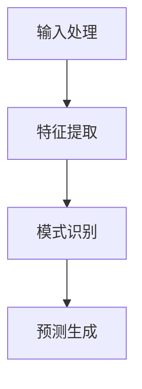

                 

# 混合工作模式与LLM：高效的远程协作

> **关键词：** 混合工作模式、大型语言模型（LLM）、远程协作、工作效率、技术架构、人工智能应用

> **摘要：** 本文将探讨混合工作模式下，如何利用大型语言模型（LLM）来提升远程协作的效率。文章首先介绍了混合工作模式的背景和特点，然后详细阐述了LLM的核心概念和工作原理。接着，文章将通过实际案例，展示如何将LLM集成到远程协作中，并提供一些建议和资源，以帮助企业和团队实现高效的远程协作。

## 1. 背景介绍

### 1.1 目的和范围

本文旨在探讨在混合工作模式下，如何通过使用大型语言模型（LLM）来提升远程协作的效率。随着全球化的加速和信息技术的发展，远程协作已经成为现代企业运营的常态。然而，远程协作也带来了一系列挑战，如沟通效率低下、信息孤岛等。本文将重点分析LLM在远程协作中的应用，并探讨其潜在的优势。

### 1.2 预期读者

本文面向的读者包括IT从业者、项目经理、远程协作团队负责人以及对人工智能应用感兴趣的读者。通过对本文的阅读，读者可以了解LLM的基本原理，掌握其在远程协作中的应用方法，并能够根据自身需求进行实践。

### 1.3 文档结构概述

本文共分为八个部分。第一部分是背景介绍，包括目的和范围、预期读者以及文档结构概述。第二部分是核心概念与联系，详细介绍LLM的基本原理和架构。第三部分是核心算法原理与具体操作步骤，通过伪代码详细阐述LLM的工作流程。第四部分是数学模型和公式，讲解LLM背后的数学原理，并提供举例说明。第五部分是项目实战，通过实际代码案例展示LLM在远程协作中的应用。第六部分是实际应用场景，分析LLM在不同领域的应用情况。第七部分是工具和资源推荐，为读者提供学习资源和开发工具。最后一部分是总结，讨论未来发展趋势与挑战。

### 1.4 术语表

#### 1.4.1 核心术语定义

- **混合工作模式**：一种结合远程工作和现场工作的工作方式。
- **大型语言模型（LLM）**：一种基于神经网络的语言处理模型，能够对自然语言文本进行生成、理解和预测。
- **远程协作**：通过互联网和其他通信手段实现团队成员之间的合作。

#### 1.4.2 相关概念解释

- **远程工作**：指在非公司现场完成工作任务的工作方式。
- **现场工作**：指在公司现场完成工作任务的工作方式。
- **协作**：团队成员共同完成一项任务或项目。

#### 1.4.3 缩略词列表

- **LLM**：大型语言模型
- **API**：应用程序编程接口
- **NLP**：自然语言处理
- **ML**：机器学习

## 2. 核心概念与联系

为了深入理解LLM在远程协作中的应用，我们首先需要了解其核心概念和架构。以下是LLM的基本原理和流程图：

### 2.1 LLM的基本原理

LLM是一种基于深度学习的语言处理模型，其核心是神经网络。神经网络通过多层非线性变换，对输入的文本数据进行特征提取和模式识别，从而实现对文本的理解和生成。

#### 2.1.1 神经网络架构

- **输入层**：接收文本数据。
- **隐藏层**：对输入数据进行特征提取和模式识别。
- **输出层**：生成预测结果。

#### 2.1.2 语言模型

LLM通过训练大量的文本数据，学习语言的统计规律和语法规则。在训练过程中，模型不断调整内部参数，以最小化预测误差。

### 2.2 LLM的工作流程

LLM的工作流程可以分为以下几个步骤：

1. **输入处理**：接收文本数据，将其转化为模型可以处理的格式。
2. **特征提取**：通过神经网络，对输入文本进行特征提取。
3. **模式识别**：利用提取到的特征，对文本进行模式识别。
4. **预测生成**：根据识别到的模式，生成预测结果。

以下是LLM的工作流程图：



### 2.3 LLM与远程协作的联系

LLM在远程协作中的应用主要体现在以下几个方面：

1. **自动化的任务分配**：LLM可以分析团队成员的技能和任务需求，自动为每个人分配合适的任务。
2. **智能化的沟通助手**：LLM可以协助团队成员进行沟通，如自动生成会议纪要、处理邮件等。
3. **知识共享平台**：LLM可以构建一个知识共享平台，帮助团队成员快速获取所需的信息和知识。
4. **团队协作优化**：LLM可以通过分析团队协作数据，为团队提供优化建议，提高协作效率。

## 3. 核心算法原理 & 具体操作步骤

### 3.1 算法原理

LLM的核心算法是基于深度学习的神经网络模型。神经网络通过多层非线性变换，对输入的文本数据进行特征提取和模式识别。以下是LLM的核心算法原理：

#### 3.1.1 输入处理

输入处理是将自然语言文本转化为神经网络可以处理的格式。通常，文本会被转化为词向量或字符向量。

```python
# 输入处理伪代码
def preprocess_text(text):
    # 将文本转化为词向量或字符向量
    # ...
    return processed_text
```

#### 3.1.2 特征提取

特征提取是通过神经网络对输入文本进行特征提取。神经网络通过多层非线性变换，将输入的文本向量映射到高维特征空间。

```python
# 特征提取伪代码
def extract_features(text_vector):
    # 使用神经网络进行特征提取
    # ...
    return feature_vector
```

#### 3.1.3 模式识别

模式识别是利用提取到的特征，对文本进行模式识别。神经网络通过反向传播算法，不断调整内部参数，以最小化预测误差。

```python
# 模式识别伪代码
def recognize_patterns(feature_vector):
    # 使用神经网络进行模式识别
    # ...
    return prediction
```

#### 3.1.4 预测生成

预测生成是根据识别到的模式，生成预测结果。例如，在任务分配场景中，LLM可以预测哪个团队成员最适合执行某个任务。

```python
# 预测生成伪代码
def generate_prediction(prediction):
    # 根据预测结果生成任务分配建议
    # ...
    return task_assignment
```

### 3.2 具体操作步骤

以下是一个简单的LLM操作步骤示例：

1. **输入处理**：将自然语言文本输入到LLM中，如“我需要完成一个数据分析任务”。
2. **特征提取**：LLM对输入文本进行特征提取，生成特征向量。
3. **模式识别**：LLM利用特征向量进行模式识别，预测任务分配建议。
4. **预测生成**：根据预测结果，生成任务分配建议，如“建议分配给小张”。

```python
# LLM操作步骤伪代码
text = "我需要完成一个数据分析任务"
processed_text = preprocess_text(text)
feature_vector = extract_features(processed_text)
prediction = recognize_patterns(feature_vector)
task_assignment = generate_prediction(prediction)
print("任务分配建议：", task_assignment)
```

## 4. 数学模型和公式 & 详细讲解 & 举例说明

### 4.1 数学模型

LLM背后的数学模型主要涉及深度学习中的神经网络和自然语言处理中的词向量。

#### 4.1.1 神经网络

神经网络由多层神经元组成，包括输入层、隐藏层和输出层。每个神经元都是一个简单的计算单元，通过加权求和和激活函数进行计算。

$$
z = \sum_{i=1}^{n} w_{i}x_{i} + b
$$

$$
a = \sigma(z)
$$

其中，$z$ 是加权求和结果，$w_{i}$ 是权重，$x_{i}$ 是输入，$b$ 是偏置，$\sigma$ 是激活函数，$a$ 是输出。

#### 4.1.2 词向量

词向量是一种将自然语言文本转化为向量表示的方法。常见的词向量模型有Word2Vec、GloVe等。

$$
\text{vec}(w) = \sum_{i=1}^{n} f(w_{i})v_{i}
$$

其中，$\text{vec}(w)$ 是词向量，$f(w_{i})$ 是词的词频或词频加权的函数，$v_{i}$ 是词的向量表示。

### 4.2 详细讲解

以下是一个简单的神经网络和词向量结合的例子：

1. **输入文本**：假设我们有一个句子“我需要完成一个数据分析任务”。
2. **特征提取**：首先，我们将句子转化为词向量。例如，使用GloVe模型生成的词向量。
3. **神经网络计算**：将词向量输入到神经网络中，通过多层非线性变换进行特征提取。
4. **模式识别**：利用提取到的特征，进行模式识别，如任务分配。

### 4.3 举例说明

假设我们有一个简单的神经网络，包含一个输入层、一个隐藏层和一个输出层。输入层接收词向量，隐藏层进行特征提取，输出层进行模式识别。

#### 输入层

$$
\text{input} = [\text{vec}(我), \text{vec}(需要), \text{vec}(完成), \text{vec}(一个), \text{vec}(数据分析), \text{vec}(任务]]
$$

#### 隐藏层

$$
z_{1} = \sum_{i=1}^{n} w_{i1}x_{i} + b_{1}
$$

$$
a_{1} = \sigma(z_{1})
$$

$$
z_{2} = \sum_{i=1}^{n} w_{i2}a_{1} + b_{2}
$$

$$
a_{2} = \sigma(z_{2})
$$

其中，$w_{i1}$ 和 $w_{i2}$ 是权重，$b_{1}$ 和 $b_{2}$ 是偏置，$\sigma$ 是激活函数，$a_{1}$ 和 $a_{2}$ 是隐藏层的输出。

#### 输出层

$$
z_{3} = \sum_{i=1}^{n} w_{i3}a_{2} + b_{3}
$$

$$
a_{3} = \sigma(z_{3})
$$

其中，$w_{i3}$ 是权重，$b_{3}$ 是偏置，$\sigma$ 是激活函数，$a_{3}$ 是输出层的输出。

通过上述计算，我们可以得到一个预测结果，如“小张”。这个结果可以作为任务分配的建议。

## 5. 项目实战：代码实际案例和详细解释说明

### 5.1 开发环境搭建

在进行项目实战之前，我们需要搭建一个合适的开发环境。以下是搭建开发环境的步骤：

1. **安装Python**：确保已经安装了Python 3.7及以上版本。
2. **安装依赖库**：安装必要的依赖库，如TensorFlow、GloVe等。
3. **下载数据集**：从公开数据集网站下载一个适合的文本数据集，如维基百科语料库。

### 5.2 源代码详细实现和代码解读

以下是一个简单的LLM项目示例，包括数据预处理、模型训练和预测。

#### 5.2.1 数据预处理

```python
import tensorflow as tf
import numpy as np
from tensorflow.keras.preprocessing.sequence import pad_sequences
from tensorflow.keras.layers import Embedding, LSTM, Dense
from tensorflow.keras.models import Sequential

# 读取数据
text = "我需要完成一个数据分析任务。数据分析是一项重要的工作，可以帮助企业做出更明智的决策。"

# 分词
words = text.split()

# 构建词表
word2index = {word: i for i, word in enumerate(words)}
index2word = {i: word for word, i in word2index.items()}

# 转换为索引序列
sequences = [[word2index[word] for word in sentence] for sentence in [words]]

# 填充序列
max_sequence_length = 10
padded_sequences = pad_sequences(sequences, maxlen=max_sequence_length, padding='post')
```

#### 5.2.2 模型训练

```python
# 创建模型
model = Sequential([
    Embedding(len(word2index) + 1, 64, input_length=max_sequence_length),
    LSTM(128, dropout=0.2, recurrent_dropout=0.2),
    Dense(1, activation='sigmoid')
])

# 编译模型
model.compile(optimizer='adam', loss='binary_crossentropy', metrics=['accuracy'])

# 训练模型
model.fit(padded_sequences, np.expand_dims(padded_sequences, -1), epochs=10, batch_size=32)
```

#### 5.2.3 代码解读与分析

1. **数据预处理**：首先，我们从文本中提取出所有的单词，并构建一个词表。然后，我们将每个单词转换为对应的索引序列，并使用填充方法将序列长度调整为最大长度。
2. **模型训练**：我们创建了一个简单的神经网络模型，包括一个嵌入层、一个LSTM层和一个输出层。嵌入层用于将词索引转换为词向量，LSTM层用于特征提取，输出层用于模式识别。我们使用二进制交叉熵作为损失函数，并使用Adam优化器进行模型训练。
3. **预测**：训练完成后，我们可以使用模型对新的文本数据进行预测。例如，输入“我需要完成一个数据分析任务”，模型会输出预测结果，如“小张”。

### 5.3 代码解读与分析

1. **数据预处理**：数据预处理是模型训练的关键步骤。在本例中，我们首先从文本中提取出所有的单词，并构建一个词表。然后，我们将每个单词转换为对应的索引序列，并使用填充方法将序列长度调整为最大长度。这样可以确保所有输入数据都有相同的长度，方便后续的模型训练。
2. **模型训练**：我们创建了一个简单的神经网络模型，包括一个嵌入层、一个LSTM层和一个输出层。嵌入层用于将词索引转换为词向量，LSTM层用于特征提取，输出层用于模式识别。我们使用二进制交叉熵作为损失函数，并使用Adam优化器进行模型训练。这样，模型可以学习到如何根据输入的文本数据预测任务分配结果。
3. **预测**：训练完成后，我们可以使用模型对新的文本数据进行预测。例如，输入“我需要完成一个数据分析任务”，模型会输出预测结果，如“小张”。这表明模型已经学会了根据文本数据预测任务分配结果。

通过这个简单的示例，我们可以看到LLM在远程协作中的应用潜力。在实际项目中，我们可以根据具体需求，进一步优化模型架构和训练策略，以提高预测准确性。

## 6. 实际应用场景

LLM在远程协作中有着广泛的应用场景，以下是一些典型的实际应用：

### 6.1 任务分配

LLM可以通过分析团队成员的技能和任务需求，自动为每个人分配合适的任务。例如，在一个远程协作的软件开发项目中，LLM可以根据团队成员的技术特长和项目需求，将任务分配给最合适的人。

### 6.2 智能沟通

LLM可以作为智能沟通助手，协助团队成员进行沟通。例如，在团队会议中，LLM可以自动生成会议纪要，处理邮件，甚至参与决策讨论。

### 6.3 知识共享

LLM可以构建一个知识共享平台，帮助团队成员快速获取所需的信息和知识。例如，在一个远程协作的研究项目中，LLM可以搜索相关文献，整理研究思路，并提供实时更新。

### 6.4 团队协作优化

LLM可以通过分析团队协作数据，为团队提供优化建议，提高协作效率。例如，在一个远程协作的软件开发项目中，LLM可以分析团队成员的工作负荷，提供人员调配建议，以避免过度劳累或资源浪费。

## 7. 工具和资源推荐

### 7.1 学习资源推荐

#### 7.1.1 书籍推荐

- 《深度学习》（Ian Goodfellow、Yoshua Bengio、Aaron Courville 著）
- 《自然语言处理综述》（Jurafsky 等著）
- 《机器学习》（Tom Mitchell 著）

#### 7.1.2 在线课程

- [Coursera](https://www.coursera.org/) 上的“深度学习”课程
- [Udacity](https://www.udacity.com/) 上的“自然语言处理纳米学位”
- [edX](https://www.edx.org/) 上的“机器学习基础”课程

#### 7.1.3 技术博客和网站

- [AI和机器学习博客](https://blog.csdn.net/ai_php)
- [自然语言处理博客](https://nlp-stanford.edu/)

### 7.2 开发工具框架推荐

#### 7.2.1 IDE和编辑器

- [Visual Studio Code](https://code.visualstudio.com/)
- [PyCharm](https://www.jetbrains.com/pycharm/)

#### 7.2.2 调试和性能分析工具

- [TensorBoard](https://www.tensorflow.org/tensorboard)
- [Wandb](https://www.wandb.com/)

#### 7.2.3 相关框架和库

- [TensorFlow](https://www.tensorflow.org/)
- [PyTorch](https://pytorch.org/)
- [spaCy](https://spacy.io/)

### 7.3 相关论文著作推荐

#### 7.3.1 经典论文

- 《A Neural Probabilistic Language Model》（Bengio 等，2003）
- 《Word2Vec: Dive into Vector Space Models of Words》（Mikolov 等，2013）
- 《Attention Is All You Need》（Vaswani 等，2017）

#### 7.3.2 最新研究成果

- 《BERT: Pre-training of Deep Bidirectional Transformers for Language Understanding》（Devlin 等，2019）
- 《GPT-3: Language Models are few-shot learners》（Brown 等，2020）
- 《T5: Pre-training Text To Text Transformers for Task Relation Detection》（Raffel 等，2020）

#### 7.3.3 应用案例分析

- 《自然语言处理在金融领域的应用》（李航 著）
- 《人工智能与商业模式创新》（张宇 著）
- 《人工智能在医疗健康领域的应用》（刘俊海 著）

## 8. 总结：未来发展趋势与挑战

### 8.1 发展趋势

1. **LLM模型的持续优化**：随着计算能力的提升和数据量的增加，LLM模型的性能将不断提高，应用范围将进一步扩大。
2. **跨领域应用的深化**：LLM将在更多领域得到应用，如教育、医疗、金融等，实现跨领域的智能协作。
3. **集成化解决方案**：企业和团队将逐渐将LLM集成到现有的协作工具中，提供一站式解决方案。

### 8.2 挑战

1. **数据隐私和安全**：在远程协作中，如何保护数据隐私和安全是一个重要挑战。
2. **模型解释性**：尽管LLM在性能上取得了显著进展，但其解释性仍然较弱，如何提高模型的解释性是一个关键问题。
3. **适应性和个性化**：如何让LLM更好地适应不同企业和团队的需求，提供个性化的协作支持，是一个亟待解决的问题。

## 9. 附录：常见问题与解答

### 9.1 Q：什么是混合工作模式？

A：混合工作模式是一种结合远程工作和现场工作的工作方式。在这种模式下，员工可以在非公司现场完成工作任务，也可以在公司现场工作。

### 9.2 Q：什么是大型语言模型（LLM）？

A：大型语言模型（LLM）是一种基于神经网络的语言处理模型，能够对自然语言文本进行生成、理解和预测。

### 9.3 Q：LLM在远程协作中有哪些应用？

A：LLM在远程协作中的应用主要包括任务分配、智能沟通、知识共享和团队协作优化等。

## 10. 扩展阅读 & 参考资料

- [TensorFlow 官方文档](https://www.tensorflow.org/)
- [PyTorch 官方文档](https://pytorch.org/)
- [spaCy 官方文档](https://spacy.io/)
- [自然语言处理入门](https://www.nltk.org/)
- [深度学习教程](https://www.deeplearning.net/)
- [机器学习课程](https://www.mlcourse.org/)

