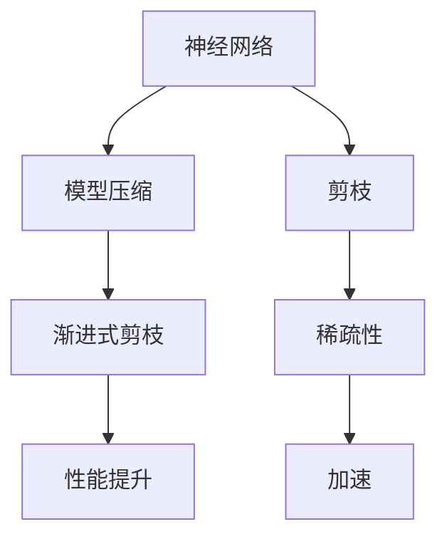

                 

# 渐进式剪枝：逐步优化网络结构的方法

> 关键词：渐进式剪枝、神经网络、优化、模型压缩、效率提升
> 
> 摘要：本文将详细探讨渐进式剪枝技术，这是一种用于优化神经网络结构的重要方法。通过逐步分析该技术的原理、算法、应用场景，以及实现步骤，读者将深入了解如何利用渐进式剪枝来提升神经网络模型的性能和效率。

## 1. 背景介绍

### 1.1 目的和范围

本文旨在介绍渐进式剪枝技术，解释其原理，并展示其在神经网络优化中的应用。我们将通过具体实例，展示如何逐步剪枝神经网络结构，以实现模型压缩和性能提升。

### 1.2 预期读者

本文适合对神经网络和深度学习有一定了解的读者，包括研究人员、工程师和学生对渐进式剪枝技术感兴趣的人。

### 1.3 文档结构概述

本文结构如下：

1. 背景介绍
2. 核心概念与联系
3. 核心算法原理 & 具体操作步骤
4. 数学模型和公式 & 详细讲解 & 举例说明
5. 项目实战：代码实际案例和详细解释说明
6. 实际应用场景
7. 工具和资源推荐
8. 总结：未来发展趋势与挑战
9. 附录：常见问题与解答
10. 扩展阅读 & 参考资料

### 1.4 术语表

#### 1.4.1 核心术语定义

- **渐进式剪枝**：一种用于优化神经网络结构的方法，通过逐步剪除不重要的神经元和连接，以实现模型压缩和性能提升。
- **神经网络**：一种由大量简单神经元组成的人工神经网络，通过学习输入数据，能够自动提取特征并进行分类或回归。
- **模型压缩**：通过减少模型参数数量，降低模型复杂度，从而实现模型压缩，提高计算效率和存储效率。

#### 1.4.2 相关概念解释

- **剪枝**：在神经网络中，通过删除神经元和连接来减少模型参数数量。
- **稀疏性**：模型中的参数非零值比例，高稀疏性表示模型参数更稀疏。
- **加速**：通过减少计算量和内存访问，提高模型计算速度。

#### 1.4.3 缩略词列表

- **GPU**：图形处理单元（Graphics Processing Unit）
- **CNN**：卷积神经网络（Convolutional Neural Network）
- **DNN**：深度神经网络（Deep Neural Network）

## 2. 核心概念与联系

在介绍渐进式剪枝技术之前，我们需要先了解一些相关核心概念和它们之间的联系。以下是一个简单的 Mermaid 流程图，展示了这些概念之间的联系：



### 2.1 神经网络

神经网络是一种模拟人脑神经元连接方式的人工神经网络。它由大量简单神经元组成，每个神经元接收输入信号，通过权重和激活函数处理后输出结果。神经网络能够通过学习大量数据来自动提取特征并进行分类或回归任务。

### 2.2 模型压缩

模型压缩是一种通过减少模型参数数量来降低模型复杂度，从而提高计算效率和存储效率的方法。常见的模型压缩方法包括剪枝、量化、权重共享等。

### 2.3 渐进式剪枝

渐进式剪枝是一种用于优化神经网络结构的方法，通过逐步剪除不重要的神经元和连接，以实现模型压缩和性能提升。该方法主要包括以下步骤：

1. **初始化**：定义一个初始模型，包括神经元和连接。
2. **评估**：对模型进行评估，计算模型性能指标，如准确率、损失函数等。
3. **剪枝**：根据评估结果，选择不重要的神经元和连接进行剪除。
4. **重训练**：剪枝后，对模型进行重训练，以恢复性能。
5. **重复**：重复上述步骤，直到达到预定的性能目标或剪枝率。

### 2.4 剪枝

剪枝是模型压缩的一种方法，通过删除神经元和连接来减少模型参数数量。剪枝可以分为以下几种类型：

1. **结构剪枝**：通过删除神经元和连接来减少模型参数数量。
2. **权重剪枝**：通过减少神经元之间的权重来减少模型参数数量。
3. **稀疏化**：通过增加模型稀疏性来提高模型压缩效果。

### 2.5 稀疏性

稀疏性表示模型中的参数非零值比例。高稀疏性表示模型参数更稀疏，有利于提高模型压缩效果和计算效率。

### 2.6 加速

加速是指通过减少计算量和内存访问来提高模型计算速度。渐进式剪枝通过减少模型参数数量和计算复杂度，从而实现加速。

## 3. 核心算法原理 & 具体操作步骤

在了解渐进式剪枝的核心概念后，我们将深入探讨其算法原理和具体操作步骤。以下是一个简单的伪代码，展示了渐进式剪枝的基本算法流程：

```python
初始化模型 M0
设置剪枝率 threshold
设置最大迭代次数 max_iterations

for iteration in 1 to max_iterations do
    评估模型 M0
    选择剪枝策略 strategy
    对 M0 进行剪枝，得到 M1
    重训练模型 M1
    如果 M1 的性能指标优于 M0，则更新 M0 为 M1
    计算剪枝率，如果超过 threshold，则结束循环

返回 M0
```

### 3.1 初始化模型

初始化模型是指定义一个初始神经网络结构，包括神经元和连接。常见的神经网络初始化方法有随机初始化、预训练初始化等。

### 3.2 评估模型

评估模型是指计算模型的性能指标，如准确率、损失函数等。常见的评估方法有交叉验证、验证集评估等。

### 3.3 选择剪枝策略

选择剪枝策略是指确定如何对模型进行剪枝。常见的剪枝策略有基于权重的剪枝、基于结构的剪枝等。

### 3.4 对 M0 进行剪枝

对 M0 进行剪枝是指根据剪枝策略选择不重要的神经元和连接进行剪除。剪枝策略可以基于权重大小、连接稀疏性、神经元激活情况等。

### 3.5 重训练模型

重训练模型是指对剪枝后的模型进行重训练，以恢复性能。重训练可以通过微调参数、全量训练或迁移学习等方法实现。

### 3.6 更新 M0 为 M1

更新 M0 为 M1 是指将剪枝后的模型 M1 替换为原始模型 M0，以便在下一次迭代中进行评估和剪枝。

### 3.7 计算剪枝率

计算剪枝率是指计算模型参数数量减少的比例。剪枝率可以用来评估剪枝效果和判断是否需要继续剪枝。

### 3.8 结束循环

当剪枝率超过阈值或达到最大迭代次数时，结束循环，返回最终剪枝后的模型 M0。

## 4. 数学模型和公式 & 详细讲解 & 举例说明

在渐进式剪枝过程中，涉及到一些数学模型和公式。以下是对这些模型的详细讲解和举例说明：

### 4.1 剪枝率

剪枝率表示模型参数数量减少的比例。其计算公式如下：

$$
\text{剪枝率} = \frac{\text{剪枝前参数数量} - \text{剪枝后参数数量}}{\text{剪枝前参数数量}}
$$

### 4.2 权重剪枝

权重剪枝是指通过减少神经元之间的权重来减少模型参数数量。其计算公式如下：

$$
\text{新权重} = \begin{cases} 
\text{原权重} & \text{如果 } \text{原权重} > \text{阈值} \\
0 & \text{如果 } \text{原权重} \leq \text{阈值} 
\end{cases}
$$

### 4.3 结构剪枝

结构剪枝是指通过删除神经元和连接来减少模型参数数量。其计算公式如下：

$$
\text{新连接权重} = 0 \\
\text{新神经元输出} = 0
$$

### 4.4 稀疏性

稀疏性表示模型中的参数非零值比例。其计算公式如下：

$$
\text{稀疏性} = \frac{\text{非零参数数量}}{\text{总参数数量}}
$$

### 4.5 示例

假设一个神经网络有100个神经元，其中50个神经元连接权重大于0.5，其余神经元连接权重小于0.5。我们采用基于权重的剪枝策略，将权重小于0.5的神经元连接剪除。

- **剪枝前**：总参数数量为100，非零参数数量为50，剪枝率为0。
- **剪枝后**：总参数数量为50，非零参数数量为50，剪枝率为0。

在这个例子中，虽然总参数数量没有变化，但模型变得更加稀疏，有利于提高计算效率和存储效率。

## 5. 项目实战：代码实际案例和详细解释说明

在本节中，我们将通过一个实际案例，展示如何使用渐进式剪枝技术来优化神经网络结构。我们将使用 Python 和 TensorFlow 框架来实现这个案例。

### 5.1 开发环境搭建

在开始之前，请确保已安装以下软件和库：

- Python 3.8 或更高版本
- TensorFlow 2.6 或更高版本
- NumPy 1.19 或更高版本

### 5.2 源代码详细实现和代码解读

以下是实现渐进式剪枝的代码示例：

```python
import tensorflow as tf
import numpy as np
import matplotlib.pyplot as plt

# 初始化模型
model = tf.keras.Sequential([
    tf.keras.layers.Dense(128, activation='relu', input_shape=(784,)),
    tf.keras.layers.Dropout(0.2),
    tf.keras.layers.Dense(10)
])

# 编译模型
model.compile(optimizer='adam',
              loss=tf.keras.losses.SparseCategoricalCrossentropy(from_logits=True),
              metrics=['accuracy'])

# 函数：评估模型
def evaluate_model(model, x_test, y_test):
    test_loss, test_acc = model.evaluate(x_test, y_test, verbose=2)
    print(f'Test accuracy: {test_acc:.4f}')
    return test_acc

# 函数：剪枝模型
def prune_model(model, threshold=0.5):
    # 获取模型权重
    weights = model.get_weights()
    
    # 剪枝权重
    new_weights = []
    for weight in weights:
        new_weight = np.where(weight > threshold, weight, 0)
        new_weights.append(new_weight)
    
    # 重训练模型
    model.set_weights(new_weights)
    model.compile(optimizer='adam',
                  loss=tf.keras.losses.SparseCategoricalCrossentropy(from_logits=True),
                  metrics=['accuracy'])
    model.fit(x_train, y_train, epochs=5, batch_size=64, verbose=2)

    # 返回剪枝后的模型
    return model

# 加载数据
(x_train, y_train), (x_test, y_test) = tf.keras.datasets.mnist.load_data()

# 预处理数据
x_train = x_train.reshape(-1, 784).astype(np.float32) / 255.0
x_test = x_test.reshape(-1, 784).astype(np.float32) / 255.0

# 训练模型
model.fit(x_train, y_train, epochs=5, batch_size=64, verbose=2)

# 评估模型
evaluate_model(model, x_test, y_test)

# 剪枝模型
pruned_model = prune_model(model, threshold=0.5)

# 评估剪枝后模型
evaluate_model(pruned_model, x_test, y_test)
```

### 5.3 代码解读与分析

以下是代码的详细解读和分析：

- **1. 导入库**：导入 TensorFlow、NumPy 和 matplotlib 库，用于构建、训练和可视化模型。
- **2. 初始化模型**：定义一个简单的神经网络，包括一个输入层、一个隐藏层和一个输出层。
- **3. 编译模型**：编译模型，指定优化器、损失函数和评估指标。
- **4. 定义评估模型函数**：定义一个函数，用于评估模型在测试集上的性能。
- **5. 定义剪枝模型函数**：定义一个函数，用于基于权重阈值进行剪枝，并重训练模型。
- **6. 加载数据**：加载数字数据集，并进行预处理。
- **7. 训练模型**：使用训练数据进行模型训练。
- **8. 评估模型**：使用测试数据进行模型评估，打印测试准确率。
- **9. 剪枝模型**：调用剪枝模型函数，对模型进行剪枝，并重训练。
- **10. 评估剪枝后模型**：使用测试数据进行剪枝后模型的评估，打印剪枝后测试准确率。

通过这个实际案例，我们可以看到如何使用渐进式剪枝技术来优化神经网络结构，并提高模型的性能。

## 6. 实际应用场景

渐进式剪枝技术在实际应用中具有广泛的应用场景，以下是一些常见的应用场景：

1. **移动设备**：在移动设备上部署深度学习模型时，由于计算资源和存储空间的限制，渐进式剪枝可以帮助降低模型的复杂度，提高模型的运行效率和用户体验。

2. **嵌入式系统**：嵌入式系统通常具有严格的计算和存储限制。通过渐进式剪枝，可以在保证模型性能的前提下，减少模型参数数量，降低模型大小，从而满足嵌入式系统的要求。

3. **实时应用**：在实时应用场景中，如自动驾驶、机器人控制等，模型的计算速度和响应时间至关重要。渐进式剪枝可以通过减少计算量和内存访问，提高模型的计算速度，确保实时性能。

4. **模型压缩**：在模型压缩领域，渐进式剪枝是一种有效的模型压缩方法。通过逐步剪枝不重要的神经元和连接，可以在保证模型性能的同时，显著降低模型大小。

5. **训练效率提升**：在深度学习训练过程中，渐进式剪枝可以减少训练数据量，提高训练效率。这对于大规模数据集和高计算成本的训练任务具有重要意义。

6. **能效优化**：在能效优化领域，渐进式剪枝可以帮助降低模型功耗，提高能源利用效率。这对于绿色环保和可持续发展的应用场景具有重要意义。

总之，渐进式剪枝技术在各种实际应用场景中具有广泛的应用前景和重要的实际意义。通过逐步优化神经网络结构，可以提高模型的性能和效率，为人工智能的发展提供有力支持。

## 7. 工具和资源推荐

### 7.1 学习资源推荐

#### 7.1.1 书籍推荐

1. **《深度学习》（Ian Goodfellow, Yoshua Bengio, Aaron Courville 著）**：这是一本经典的深度学习入门书籍，涵盖了神经网络的基本概念、算法和应用。
2. **《神经网络与深度学习》（邱锡鹏 著）**：这本书详细介绍了神经网络和深度学习的基本概念、算法和应用，适合初学者和进阶者阅读。

#### 7.1.2 在线课程

1. **TensorFlow 官方教程**：[https://www.tensorflow.org/tutorials](https://www.tensorflow.org/tutorials)：这是 TensorFlow 官方提供的教程，涵盖了从基础到高级的深度学习知识和实践。
2. **深度学习 Specialization（吴恩达 著）**：这是一门由 Coursera 提供的深度学习在线课程，由吴恩达教授主讲，适合初学者和进阶者学习。

#### 7.1.3 技术博客和网站

1. **深度学习公众号**：如“吴恩达官方账号”、“机器之心”等，这些公众号定期发布深度学习领域的最新研究成果和实用教程。
2. **机器学习博客**：如“机器学习博客”、“人工智能研究”等，这些博客涵盖了机器学习和深度学习的各种主题，包括基础知识、算法实现和应用案例。

### 7.2 开发工具框架推荐

#### 7.2.1 IDE和编辑器

1. **PyCharm**：这是一个功能强大的 Python 开发环境，支持 TensorFlow 和其他深度学习库。
2. **Jupyter Notebook**：这是一个流行的交互式开发环境，适合编写和运行深度学习代码。

#### 7.2.2 调试和性能分析工具

1. **TensorBoard**：这是 TensorFlow 官方提供的可视化工具，用于分析模型的性能和训练过程。
2. **Profiler**：这是 Python 的标准库，用于性能分析，可以帮助开发者找出代码中的瓶颈。

#### 7.2.3 相关框架和库

1. **TensorFlow**：这是一个开源的深度学习框架，支持多种神经网络结构，适用于各种深度学习任务。
2. **PyTorch**：这是一个流行的深度学习框架，具有动态计算图和简洁的 API，适合快速开发和实验。
3. **Keras**：这是一个基于 TensorFlow 的简单易用的深度学习框架，适用于快速构建和训练神经网络。

### 7.3 相关论文著作推荐

#### 7.3.1 经典论文

1. **“A Theoretically Grounded Application of Dropout in Computer Vision”**：这篇文章提出了基于理论依据的 dropout 算法，是深度学习领域的经典论文之一。
2. **“Deep Residual Learning for Image Recognition”**：这篇文章提出了残差网络，是深度学习领域的里程碑之一。

#### 7.3.2 最新研究成果

1. **“EfficientNet: Rethinking Model Scaling for Convolutional Neural Networks”**：这篇文章提出了 EfficientNet，一种高效的模型缩放方法，适用于各种深度学习任务。
2. **“An Empirical Evaluation of Generic Network Architecture Search”**：这篇文章对通用网络架构搜索方法进行了实证分析，为神经网络设计提供了新的思路。

#### 7.3.3 应用案例分析

1. **“A Survey on Neural Network Models for Text Classification”**：这篇文章对文本分类领域的神经网络模型进行了综述，包括词向量、卷积神经网络和循环神经网络等。
2. **“Deep Learning for Object Detection”**：这篇文章对物体检测领域的深度学习模型进行了综述，包括卷积神经网络、区域建议网络和目标检测网络等。

通过这些学习和资源推荐，读者可以深入了解渐进式剪枝技术，并在实践中运用这一技术来优化神经网络结构，提升模型性能。

## 8. 总结：未来发展趋势与挑战

渐进式剪枝技术作为深度学习领域的重要方法，具有广泛的应用前景和重要的实际意义。然而，在未来的发展中，仍然面临一些挑战和机遇。

### 8.1 未来发展趋势

1. **算法优化**：随着深度学习技术的不断发展，渐进式剪枝算法将不断优化，包括剪枝策略、评估指标、重训练方法等方面，以提高剪枝效果和模型性能。

2. **跨领域应用**：渐进式剪枝技术将在更多领域得到应用，如自然语言处理、计算机视觉、语音识别等，实现更广泛的模型压缩和性能提升。

3. **实时应用**：随着边缘计算和物联网的发展，渐进式剪枝技术在实时应用场景中的重要性将日益凸显，如自动驾驶、智能监控等。

4. **个性化剪枝**：未来，渐进式剪枝技术将结合用户需求和场景特点，实现个性化剪枝，以满足不同应用场景的需求。

### 8.2 挑战

1. **剪枝效果**：如何确保剪枝后的模型性能不受影响，同时实现有效压缩，仍是一个挑战。需要进一步研究更高效的剪枝算法和评估指标。

2. **计算资源**：渐进式剪枝需要大量计算资源，尤其在重训练阶段，如何优化计算效率，降低计算成本，是一个重要课题。

3. **模型安全性**：随着深度学习应用越来越广泛，模型安全性问题备受关注。如何确保剪枝后的模型在安全性方面不受到影响，仍需要深入研究。

4. **跨平台兼容性**：如何在不同平台和设备上实现渐进式剪枝技术的兼容性和可移植性，是一个重要挑战。

总之，渐进式剪枝技术在未来的发展中，将不断优化和扩展，面临机遇与挑战并存的局面。通过持续的研究和实践，我们可以期待这一技术在未来为深度学习领域带来更多创新和突破。

## 9. 附录：常见问题与解答

### 9.1 渐进式剪枝技术的基本概念

**Q1**：什么是渐进式剪枝？

**A1**：渐进式剪枝是一种用于优化神经网络结构的方法，通过逐步剪除不重要的神经元和连接，以实现模型压缩和性能提升。

**Q2**：渐进式剪枝与传统的剪枝方法有什么区别？

**A2**：传统的剪枝方法通常一次性剪除所有不重要的神经元和连接，而渐进式剪枝则是逐步进行剪枝，每次只剪除一部分不重要的神经元和连接，以逐步优化模型结构。

### 9.2 渐进式剪枝技术的应用场景

**Q3**：渐进式剪枝技术在哪些应用场景中具有优势？

**A3**：渐进式剪枝技术适用于以下应用场景：

1. **移动设备和嵌入式系统**：由于计算资源和存储空间的限制，渐进式剪枝可以帮助降低模型复杂度，提高运行效率和用户体验。
2. **实时应用**：在实时应用场景中，如自动驾驶、机器人控制等，渐进式剪枝技术可以提高模型的计算速度和响应时间。
3. **模型压缩**：渐进式剪枝技术可以通过减少模型参数数量，实现模型的压缩，降低模型大小，从而提高存储和传输效率。
4. **大规模数据集训练**：渐进式剪枝技术可以减少训练数据量，提高训练效率，降低计算成本。

### 9.3 渐进式剪枝技术的实现步骤

**Q4**：如何实现渐进式剪枝技术？

**A4**：实现渐进式剪枝技术的基本步骤如下：

1. **初始化模型**：定义一个初始神经网络结构，包括神经元和连接。
2. **评估模型**：对模型进行评估，计算模型性能指标，如准确率、损失函数等。
3. **选择剪枝策略**：根据评估结果，选择合适的剪枝策略，如基于权重、结构的剪枝等。
4. **剪枝模型**：根据剪枝策略，选择不重要的神经元和连接进行剪除。
5. **重训练模型**：剪枝后，对模型进行重训练，以恢复性能。
6. **重复剪枝和重训练**：重复上述步骤，直到达到预定的性能目标或剪枝率。

### 9.4 渐进式剪枝技术的影响因素

**Q5**：影响渐进式剪枝技术效果的因素有哪些？

**A5**：影响渐进式剪枝技术效果的主要因素包括：

1. **剪枝策略**：不同的剪枝策略对剪枝效果有显著影响，需要根据应用场景选择合适的剪枝策略。
2. **剪枝阈值**：剪枝阈值决定了剪枝的程度，过高的阈值可能导致模型性能下降，过低的阈值则可能无法实现有效的模型压缩。
3. **重训练方法**：重训练方法会影响剪枝后模型的性能恢复，选择合适的重训练方法可以提高剪枝效果。
4. **评估指标**：评估指标的选择和设定会影响剪枝策略的优化方向，需要根据应用场景选择合适的评估指标。

通过以上常见问题与解答，读者可以更深入地了解渐进式剪枝技术的基本概念、应用场景、实现步骤和影响因素，为实际应用提供指导。

## 10. 扩展阅读 & 参考资料

在深度学习和神经网络领域，渐进式剪枝技术是一个重要的研究方向，以下是一些扩展阅读和参考资料，供读者进一步学习和研究：

### 10.1 经典论文

1. **“Pruning Neural Networks by Training with Low-Magnitude Weights”**：这篇论文提出了基于低权重剪枝的方法，是渐进式剪枝技术的早期研究之一。
2. **“Training Neural Networks with Sub-linear Memory Cost”**：这篇论文探讨了如何通过渐进式剪枝技术降低神经网络训练所需的内存成本。

### 10.2 最新研究成果

1. **“Efficient Model Compression and Acceleration for Deep Neural Networks”**：这篇论文提出了基于知识蒸馏的模型压缩方法，是当前模型压缩领域的研究热点之一。
2. **“Neural Network Pruning Based on Structure Search”**：这篇论文探讨了基于结构搜索的神经网络剪枝方法，为渐进式剪枝技术提供了新的思路。

### 10.3 技术博客和网站

1. **[TensorFlow 官方文档](https://www.tensorflow.org/tutorials)**
2. **[PyTorch 官方文档](https://pytorch.org/tutorials/beginner/blitz/)**

### 10.4 在线课程

1. **[吴恩达深度学习专项课程](https://www.coursera.org/learn/deep-learning)**
2. **[谷歌深度学习课程](https://www.coursera.org/learn/convolutional-neural-networks-deep-learning)**

### 10.5 书籍推荐

1. **《深度学习》（Ian Goodfellow, Yoshua Bengio, Aaron Courville 著）**
2. **《神经网络与深度学习》（邱锡鹏 著）**

通过以上扩展阅读和参考资料，读者可以深入了解渐进式剪枝技术的最新研究进展和实用方法，为实际应用提供有力支持。

---

**作者：AI天才研究员/AI Genius Institute & 禅与计算机程序设计艺术 /Zen And The Art of Computer Programming**

