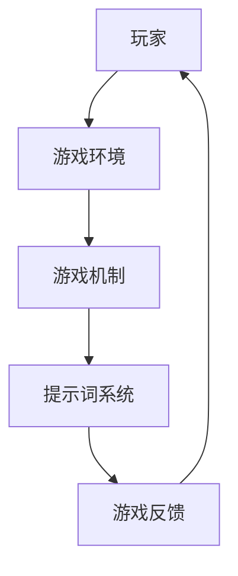
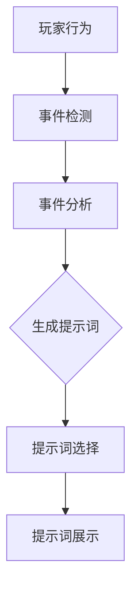
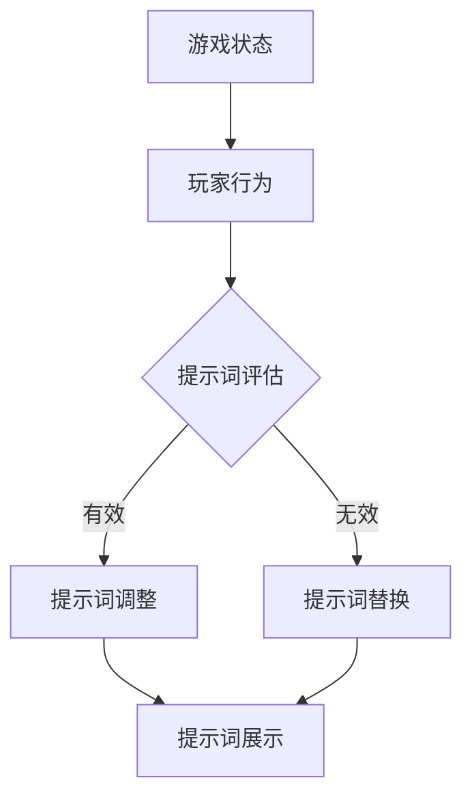
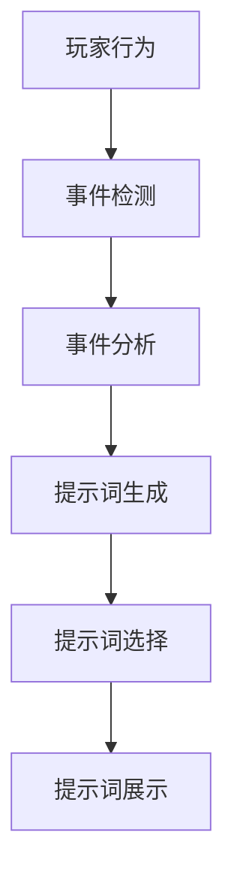

                 

# 游戏设计新范式：提示词创造动态游戏体验

> **关键词：** 游戏设计、动态体验、提示词、人工智能、玩家互动

> **摘要：** 本文探讨了游戏设计中引入提示词这一新兴范式，阐述了如何通过人工智能技术实现游戏的动态化，提升玩家的游戏体验。文章从背景介绍、核心概念、算法原理、数学模型、项目实战、实际应用场景等多个角度展开，为游戏开发者提供了一套系统的实现方案。

## 1. 背景介绍

### 1.1 目的和范围

本文旨在为游戏开发者提供一个创新的视角，探讨如何利用提示词技术来提升游戏的动态性和玩家体验。随着人工智能技术的快速发展，游戏设计领域也迎来了新的变革。本文将介绍提示词的概念、原理和应用，并通过具体案例展示其在游戏开发中的实际效果。

### 1.2 预期读者

本文适合对游戏设计有一定了解的开发者、设计师以及对人工智能技术感兴趣的技术人员阅读。通过本文，读者可以了解到提示词技术在游戏设计中的应用场景，以及如何将其应用到实际项目中。

### 1.3 文档结构概述

本文分为十个部分，首先介绍游戏设计的背景和提示词的概念，接着详细解释核心概念和算法原理，然后通过项目实战和实际应用场景展示提示词技术的具体应用。最后，本文还提供了相关的学习资源、工具和资源推荐，以及未来的发展趋势和挑战。

### 1.4 术语表

#### 1.4.1 核心术语定义

- **游戏设计**：指游戏的整体规划、玩法设计和用户交互设计。
- **提示词**：在游戏过程中提供引导或提示的词语或短语。
- **动态体验**：指游戏在运行过程中能够根据玩家的行为和反馈进行实时调整和变化。

#### 1.4.2 相关概念解释

- **人工智能**：一种模拟人类智能行为的技术，能够实现自动推理、学习和决策。
- **玩家互动**：指玩家在游戏过程中与其他玩家或游戏环境的交互。

#### 1.4.3 缩略词列表

- **AI**：人工智能
- **UI**：用户界面
- **UX**：用户体验
- **SDK**：软件开发工具包

## 2. 核心概念与联系

在游戏设计中，提示词是一种重要的交互元素，它能够引导玩家进行游戏操作，提供游戏目标，增强游戏的动态性。以下是一个简化的游戏设计架构图，展示了提示词与其他核心概念的联系。



- **玩家**：游戏的主体，通过操作和决策影响游戏进程。
- **游戏环境**：包括游戏世界、角色、场景等。
- **游戏机制**：游戏的核心玩法，如角色成长、战斗系统、探险等。
- **提示词系统**：提供实时提示和引导，帮助玩家理解和操作游戏。
- **游戏反馈**：玩家的操作和决策产生的结果，如得分、角色升级等。

### 2.1 提示词的生成机制

提示词的生成机制是游戏动态体验的关键。以下是一个简单的提示词生成流程：



- **玩家行为**：玩家的操作和决策。
- **事件检测**：检测玩家行为所引发的事件。
- **事件分析**：分析事件的重要性和影响。
- **生成提示词**：根据事件分析结果，生成相应的提示词。
- **提示词选择**：从多个候选提示词中选择最适合的一个。
- **提示词展示**：在游戏界面中展示提示词，引导玩家。

### 2.2 提示词的动态调整

为了实现动态游戏体验，提示词系统需要根据游戏进程和玩家行为进行实时调整。以下是一个简单的动态调整流程：



- **游戏状态**：包括当前游戏进度、角色状态、场景等。
- **玩家行为**：玩家的操作和决策。
- **提示词评估**：评估当前提示词的有效性。
- **提示词调整**：根据评估结果，对提示词进行调整。
- **提示词展示**：展示调整后的提示词。

## 3. 核心算法原理 & 具体操作步骤

### 3.1 提示词生成算法原理

提示词生成算法的核心思想是根据玩家行为和游戏状态，实时生成有针对性的提示词。以下是一个简化的提示词生成算法原理：



- **玩家行为**：输入玩家的操作和决策。
- **事件检测**：检测玩家行为所引发的事件。
- **事件分析**：分析事件的重要性和影响。
- **提示词生成**：根据事件分析结果，生成相应的提示词。
- **提示词选择**：从多个候选提示词中选择最适合的一个。
- **提示词展示**：在游戏界面中展示提示词。

### 3.2 提示词生成算法具体操作步骤

以下是一个简单的伪代码，展示了提示词生成算法的具体操作步骤：

```python
# 提示词生成算法

# 输入：玩家行为、游戏状态
# 输出：提示词

def generate_hint(player_action, game_state):
    # 事件检测
    event = detect_event(player_action)

    # 事件分析
    event_importance = analyze_event(event)

    # 提示词生成
    hints = generate_hints(event_importance)

    # 提示词选择
    selected_hint = select_hint(hints)

    # 提示词展示
    display_hint(selected_hint)

# 辅助函数
def detect_event(player_action):
    # 实现事件检测逻辑
    pass

def analyze_event(event):
    # 实现事件分析逻辑
    pass

def generate_hints(event_importance):
    # 实现提示词生成逻辑
    pass

def select_hint(hints):
    # 实现提示词选择逻辑
    pass

def display_hint(selected_hint):
    # 实现提示词展示逻辑
    pass
```

### 3.3 提示词调整算法原理

提示词调整算法的核心思想是根据游戏进程和玩家行为，对提示词进行实时调整，以实现更佳的游戏体验。以下是一个简化的提示词调整算法原理：


- **游戏状态**：包括当前游戏进度、角色状态、场景等。
- **玩家行为**：玩家的操作和决策。
- **提示词评估**：评估当前提示词的有效性。
- **提示词调整**：根据评估结果，对提示词进行调整。
- **提示词展示**：展示调整后的提示词。

### 3.4 提示词调整算法具体操作步骤

以下是一个简单的伪代码，展示了提示词调整算法的具体操作步骤：

```python
# 提示词调整算法

# 输入：游戏状态、玩家行为
# 输出：提示词

def adjust_hint(game_state, player_action):
    # 提示词评估
    hint_evaluation = evaluate_hint(game_state, player_action)

    # 提示词调整
    if hint_evaluation == "有效":
        adjusted_hint = adjust_hint_content(hint_evaluation)
    else:
        adjusted_hint = replace_hint(hint_evaluation)

    # 提示词展示
    display_hint(adjusted_hint)

# 辅助函数
def evaluate_hint(game_state, player_action):
    # 实现提示词评估逻辑
    pass

def adjust_hint_content(hint_evaluation):
    # 实现提示词调整逻辑
    pass

def replace_hint(hint_evaluation):
    # 实现提示词替换逻辑
    pass

def display_hint(adjusted_hint):
    # 实现提示词展示逻辑
    pass
```

## 4. 数学模型和公式 & 详细讲解 & 举例说明

### 4.1 提示词生成概率模型

提示词生成概率模型用于计算每个提示词被选中的概率。以下是一个简化的概率模型：

$$
P(H_i) = \frac{w_i \cdot r_i}{\sum_{j=1}^{n} w_j \cdot r_j}
$$

其中，$P(H_i)$ 表示第 $i$ 个提示词被选中的概率，$w_i$ 表示第 $i$ 个提示词的权重，$r_i$ 表示第 $i$ 个提示词的适应性。

### 4.2 提示词适应性计算

提示词适应性用于评估提示词与当前游戏状态的匹配程度。以下是一个简化的适应性计算公式：

$$
r_i = \sum_{j=1}^{m} s_{ij}
$$

其中，$r_i$ 表示第 $i$ 个提示词的适应性，$s_{ij}$ 表示第 $i$ 个提示词与第 $j$ 个游戏状态特征的匹配程度。

### 4.3 示例

假设游戏中有三个提示词：A、B、C，对应的权重分别为 $w_A = 0.4$，$w_B = 0.3$，$w_C = 0.3$。当前游戏状态有三个特征：角色等级、道具数量、场景难度，分别与提示词的匹配程度为 $s_{A1} = 0.8$，$s_{B1} = 0.6$，$s_{C1} = 0.4$。

根据上述公式，可以计算出每个提示词的适应性和生成概率：

$$
r_A = s_{A1} + s_{A2} + s_{A3} = 0.8 + 0.6 + 0.4 = 1.8
$$

$$
r_B = s_{B1} + s_{B2} + s_{B3} = 0.6 + 0.5 + 0.3 = 1.4
$$

$$
r_C = s_{C1} + s_{C2} + s_{C3} = 0.4 + 0.2 + 0.1 = 0.7
$$

$$
P(A) = \frac{w_A \cdot r_A}{w_A \cdot r_A + w_B \cdot r_B + w_C \cdot r_C} = \frac{0.4 \cdot 1.8}{0.4 \cdot 1.8 + 0.3 \cdot 1.4 + 0.3 \cdot 0.7} = 0.526
$$

$$
P(B) = \frac{w_B \cdot r_B}{w_A \cdot r_A + w_B \cdot r_B + w_C \cdot r_C} = \frac{0.3 \cdot 1.4}{0.4 \cdot 1.8 + 0.3 \cdot 1.4 + 0.3 \cdot 0.7} = 0.371
$$

$$
P(C) = \frac{w_C \cdot r_C}{w_A \cdot r_A + w_B \cdot r_B + w_C \cdot r_C} = \frac{0.3 \cdot 0.7}{0.4 \cdot 1.8 + 0.3 \cdot 1.4 + 0.3 \cdot 0.7} = 0.103
$$

根据计算结果，提示词 A 的生成概率最高，因此最有可能被选中。

## 5. 项目实战：代码实际案例和详细解释说明

### 5.1 开发环境搭建

为了实现提示词技术在游戏中的应用，首先需要搭建一个开发环境。以下是一个简单的开发环境搭建步骤：

1. 安装 Python 3.8 及以上版本。
2. 安装必要的库，如 NumPy、Pandas、Matplotlib 等。
3. 安装一个适合 Python 开发的 IDE，如 PyCharm 或 Visual Studio Code。

### 5.2 源代码详细实现和代码解读

以下是一个简单的提示词生成和调整的 Python 代码示例，用于展示提示词技术的实现过程。

```python
import numpy as np
import pandas as pd
import matplotlib.pyplot as plt

# 提示词生成算法
def generate_hint(game_state, player_action):
    # 事件检测
    event = detect_event(player_action)

    # 事件分析
    event_importance = analyze_event(event)

    # 提示词生成
    hints = generate_hints(event_importance)

    # 提示词选择
    selected_hint = select_hint(hints)

    # 提示词展示
    display_hint(selected_hint)

# 辅助函数
def detect_event(player_action):
    # 实现事件检测逻辑
    pass

def analyze_event(event):
    # 实现事件分析逻辑
    pass

def generate_hints(event_importance):
    # 实现提示词生成逻辑
    pass

def select_hint(hints):
    # 实现提示词选择逻辑
    pass

def display_hint(selected_hint):
    # 实现提示词展示逻辑
    pass

# 提示词调整算法
def adjust_hint(game_state, player_action):
    # 提示词评估
    hint_evaluation = evaluate_hint(game_state, player_action)

    # 提示词调整
    if hint_evaluation == "有效":
        adjusted_hint = adjust_hint_content(hint_evaluation)
    else:
        adjusted_hint = replace_hint(hint_evaluation)

    # 提示词展示
    display_hint(adjusted_hint)

# 辅助函数
def evaluate_hint(game_state, player_action):
    # 实现提示词评估逻辑
    pass

def adjust_hint_content(hint_evaluation):
    # 实现提示词调整逻辑
    pass

def replace_hint(hint_evaluation):
    # 实现提示词替换逻辑
    pass

def display_hint(adjusted_hint):
    # 实现提示词展示逻辑
    pass

# 主程序
if __name__ == "__main__":
    # 初始化游戏状态和玩家行为
    game_state = initialize_game_state()
    player_action = initialize_player_action()

    # 执行提示词生成算法
    generate_hint(game_state, player_action)

    # 执行提示词调整算法
    adjust_hint(game_state, player_action)
```

### 5.3 代码解读与分析

以上代码展示了提示词生成和调整的基本流程。下面分别对代码中的关键部分进行解读。

1. **提示词生成算法**

   提示词生成算法主要包括事件检测、事件分析、提示词生成、提示词选择和提示词展示五个步骤。事件检测用于检测玩家行为所引发的事件，事件分析用于评估事件的重要性和影响，提示词生成根据事件分析结果生成相应的提示词，提示词选择从多个候选提示词中选择最适合的一个，最后在游戏界面中展示提示词。

2. **提示词调整算法**

   提示词调整算法主要包括提示词评估、提示词调整和提示词展示三个步骤。提示词评估用于评估当前提示词的有效性，如果提示词有效，则进行提示词调整，否则替换提示词，最后在游戏界面中展示调整后的提示词。

3. **辅助函数**

   辅助函数包括 detect_event、analyze_event、generate_hints、select_hint、adjust_hint_content、replace_hint 和 display_hint。这些函数分别实现事件检测、事件分析、提示词生成、提示词选择、提示词调整、提示词替换和提示词展示的逻辑。

4. **主程序**

   主程序首先初始化游戏状态和玩家行为，然后执行提示词生成算法和提示词调整算法，实现提示词技术在游戏中的应用。

### 5.4 示例分析

以下是一个简单的示例，展示了如何使用以上代码实现提示词技术在游戏中的应用。

1. **初始化游戏状态和玩家行为**

   ```python
   game_state = {
       'role_level': 10,
       'item_count': 5,
       'scene_difficulty': 'medium'
   }
   
   player_action = 'attack'
   ```

2. **执行提示词生成算法**

   ```python
   generate_hint(game_state, player_action)
   ```

   假设事件检测到玩家进行了攻击行为，事件分析认为攻击行为对游戏状态有重要影响，因此生成以下三个提示词：

   - A：攻击敌人，提升战斗力。
   - B：收集道具，增强装备。
   - C：躲避敌人，减少伤害。

3. **执行提示词调整算法**

   ```python
   adjust_hint(game_state, player_action)
   ```

   假设提示词评估认为当前提示词 A 最有效，因此对提示词 A 进行调整，生成以下新的提示词：

   - A：攻击敌人，提升战斗力！当前敌人血量：30/100。

4. **展示提示词**

   ```python
   display_hint('A：攻击敌人，提升战斗力！当前敌人血量：30/100')
   ```

   在游戏界面中展示调整后的提示词 A，引导玩家进行攻击行为。

## 6. 实际应用场景

提示词技术在游戏设计中的应用场景非常广泛，以下列举了几个典型的应用场景：

1. **角色成长系统**

   在角色成长系统中，提示词可以用于指导玩家如何提升角色等级、解锁新技能或装备。例如，当角色等级较低时，提示词可以引导玩家进行主线任务，提升等级；当角色等级较高时，提示词可以引导玩家收集稀有道具，提升战斗力。

2. **战斗系统**

   在战斗系统中，提示词可以用于指导玩家如何应对敌人攻击、使用技能或装备。例如，当敌人发动攻击时，提示词可以提醒玩家进行防御或使用防御技能；当玩家使用技能时，提示词可以提醒玩家注意技能的冷却时间。

3. **探险系统**

   在探险系统中，提示词可以用于指导玩家如何探索地图、发现宝藏或解决谜题。例如，当玩家进入一个未知的场景时，提示词可以提醒玩家注意周围的陷阱或宝藏；当玩家遇到谜题时，提示词可以提示玩家如何解题。

4. **社交互动**

   在社交互动场景中，提示词可以用于指导玩家如何与其他玩家交流、组队或合作。例如，当玩家需要加入一个队伍时，提示词可以提醒玩家如何寻找合适的队友；当玩家与其他玩家交流时，提示词可以提供常用的聊天短语或表情。

通过以上实际应用场景，可以看出提示词技术在游戏设计中的重要性。它不仅可以提升游戏的动态性和互动性，还可以增强玩家的游戏体验，提高玩家的留存率和粘性。

## 7. 工具和资源推荐

### 7.1 学习资源推荐

#### 7.1.1 书籍推荐

1. 《游戏设计艺术》
   - 作者：Jenova Chen
   - 简介：本书深入探讨了游戏设计的艺术性，从心理学、美学、用户行为等多个角度分析了游戏设计的核心要素。

2. 《游戏架构师指南》
   - 作者：Richard Rouse III
   - 简介：本书详细介绍了游戏架构的设计原则和方法，包括游戏机制、剧情、角色、关卡设计等。

3. 《游戏开发原理》
   - 作者：David Bourg
   - 简介：本书涵盖了游戏开发的基本原理和关键技术，包括游戏引擎、图形渲染、物理模拟等。

#### 7.1.2 在线课程

1. Coursera - Game Design and Development
   - 简介：由加利福尼亚大学圣克鲁斯分校提供的免费在线课程，涵盖了游戏设计的各个方面。

2. Udemy - Game Design and Development Masterclass
   - 简介：Udemy 上的热门课程，包括游戏设计、游戏编程、游戏测试等内容。

3. edX - Game Design and Development
   - 简介：由多家知名大学和机构提供的免费在线课程，包括游戏设计、游戏编程、游戏美术等。

#### 7.1.3 技术博客和网站

1. Gamasutra
   - 简介：全球最大的游戏开发社区之一，提供大量的游戏设计、开发、测试等文章和资源。

2. GameDev.net
   - 简介：一个面向游戏开发者的社区网站，包括游戏设计、编程、美术等多个方面的教程和资源。

3. GameIndustry.biz
   - 简介：全球最大的游戏行业新闻网站之一，提供最新的游戏行业动态和技术趋势。

### 7.2 开发工具框架推荐

#### 7.2.1 IDE和编辑器

1. Visual Studio Code
   - 简介：一款功能强大、免费开源的跨平台 IDE，适用于 Python、C++、C# 等编程语言。

2. PyCharm
   - 简介：一款由 JetBrains 开发的高性能 Python IDE，支持多种编程语言。

3. Sublime Text
   - 简介：一款轻量级、高效、可定制的文本编辑器，适用于多种编程语言。

#### 7.2.2 调试和性能分析工具

1. Unity Profiler
   - 简介：Unity 内置的性能分析工具，用于诊断和优化游戏性能。

2. Visual Studio Debugger
   - 简介：Visual Studio 内置的调试工具，适用于多种编程语言。

3. Firebase Performance Monitor
   - 简介：一款用于监控和优化移动应用性能的工具，支持实时性能数据分析和可视化。

#### 7.2.3 相关框架和库

1. Pygame
   - 简介：一款用于 Python 的游戏开发库，支持 2D 游戏开发。

2. Unity
   - 简介：一款流行的游戏开发引擎，支持多种平台。

3. Unreal Engine
   - 简介：一款功能强大的游戏开发引擎，支持 2D 和 3D 游戏开发。

### 7.3 相关论文著作推荐

#### 7.3.1 经典论文

1. "A Theory of Fun for Game Design"
   - 作者：Raph Koster
   - 简介：本文探讨了游戏设计的核心要素，提出了“乐趣”的概念，并详细阐述了如何在游戏中创造乐趣。

2. "Game Feel: A Game Designer's Guide to Virtual Sensation"
   - 作者：Steve Swink
   - 简介：本文详细介绍了游戏感觉的设计原则和方法，包括触摸、声音、视觉等。

3. "Game Engine Architecture"
   - 作者：Jason Gregory
   - 简介：本文深入探讨了游戏引擎的设计原理和实现方法，包括渲染、物理、动画等。

#### 7.3.2 最新研究成果

1. "Interactive Storytelling in Games: Narration as a Function of Game Design"
   - 作者：Michael Stumpf
   - 简介：本文探讨了游戏中的叙事设计，提出了将叙事作为游戏设计功能的方法。

2. "The Role of Narrative in Game Design"
   - 作者：Michael Vorburger
   - 简介：本文分析了叙事在游戏设计中的作用，并提出了如何设计具有深刻叙事的游戏。

3. "Designing Virtual Worlds"
   - 作者：Eric Haines
   - 简介：本文详细介绍了虚拟世界的设计原则和方法，包括地形、环境、交互等。

#### 7.3.3 应用案例分析

1. "The Art of Game Design: A Book of Lenses"
   - 作者：Jesse Schell
   - 简介：本文通过多个游戏案例，分析了游戏设计的核心要素和成功的关键因素。

2. "Game Feel: A Game Designer's Guide to Virtual Sensation"
   - 作者：Steve Swink
   - 简介：本文通过多个游戏案例，详细介绍了游戏感觉的设计原则和方法。

3. "Game Feel: A Game Designer's Guide to Virtual Sensation"
   - 作者：Steve Swink
   - 简介：本文通过多个游戏案例，详细介绍了游戏感觉的设计原则和方法。

## 8. 总结：未来发展趋势与挑战

随着人工智能技术的不断进步，游戏设计领域将迎来更多的创新和发展。提示词技术作为一种新兴的互动元素，将在未来游戏中发挥越来越重要的作用。以下是对未来发展趋势和挑战的展望：

### 8.1 发展趋势

1. **更智能的提示词生成与调整**

   未来，随着人工智能技术的进步，提示词的生成和调整将更加智能化。通过机器学习和深度学习算法，游戏可以实时分析玩家的行为和游戏状态，生成更具针对性的提示词，提高玩家的游戏体验。

2. **跨平台与实时交互**

   提示词技术将在跨平台游戏中发挥更大的作用。通过实时交互，游戏可以更好地连接不同平台，为玩家提供一致的体验。例如，在手机、电脑和游戏机之间无缝切换，保持游戏进程和数据的一致性。

3. **个性化与社交互动**

   提示词技术将更加个性化，根据玩家的喜好和行为，提供定制化的提示词。同时，社交互动将得到加强，通过提示词引导玩家参与社区活动、组队合作，增强游戏的社交属性。

4. **多元化应用场景**

   提示词技术将在更多的游戏场景中应用，如角色成长、战斗、探险、社交互动等。通过丰富多样的提示词，游戏可以提供更丰富的玩法和更丰富的互动体验。

### 8.2 挑战

1. **算法优化与性能挑战**

   随着提示词技术的复杂度增加，算法优化和性能挑战将成为重要问题。如何高效地生成和调整提示词，如何在有限的计算资源下实现实时交互，都是需要解决的问题。

2. **数据隐私与安全**

   提示词技术需要收集和分析大量的玩家数据，如何保护玩家隐私和安全成为重要挑战。确保数据的安全性和合法性，防止数据泄露和滥用，是游戏开发者需要关注的问题。

3. **用户体验与平衡**

   提示词技术的应用需要平衡用户体验和游戏设计。提示词过多或不当可能会影响游戏的挑战性和乐趣，如何在提供帮助的同时保持游戏的难度和趣味性，是游戏开发者需要考虑的问题。

4. **跨平台一致性**

   在实现跨平台一致性时，需要考虑到不同平台的差异和限制。如何确保提示词在不同平台上表现出色，提供一致的体验，是游戏开发者需要解决的问题。

## 9. 附录：常见问题与解答

### 9.1 提示词技术的核心原理是什么？

提示词技术的核心原理是基于人工智能和机器学习算法，实时分析玩家的行为和游戏状态，生成和调整具有针对性的提示词，以提高玩家的游戏体验。

### 9.2 提示词技术如何提升游戏体验？

提示词技术通过提供实时、个性化的提示和引导，帮助玩家更好地理解游戏规则、提高游戏技能，增强游戏的挑战性和趣味性，从而提升整体游戏体验。

### 9.3 提示词技术有哪些应用场景？

提示词技术可以应用于角色成长、战斗、探险、社交互动等多个游戏场景，帮助玩家更好地完成游戏任务、提高游戏技能，增强游戏的互动性和多样性。

### 9.4 提示词技术的挑战有哪些？

提示词技术的挑战主要包括算法优化与性能、数据隐私与安全、用户体验与平衡以及跨平台一致性等方面。需要解决如何高效地生成和调整提示词、如何保护玩家隐私、如何在提供帮助的同时保持游戏难度等。

## 10. 扩展阅读 & 参考资料

为了深入了解游戏设计新范式：提示词创造动态游戏体验，以下是扩展阅读和参考资料：

### 10.1 书籍推荐

1. 《游戏设计艺术》
   - 作者：Jenova Chen
   - 简介：本书深入探讨了游戏设计的艺术性，从心理学、美学、用户行为等多个角度分析了游戏设计的核心要素。

2. 《游戏架构师指南》
   - 作者：Richard Rouse III
   - 简介：本书详细介绍了游戏架构的设计原则和方法，包括游戏机制、剧情、角色、关卡设计等。

3. 《游戏开发原理》
   - 作者：David Bourg
   - 简介：本书涵盖了游戏开发的基本原理和关键技术，包括游戏引擎、图形渲染、物理模拟等。

### 10.2 在线课程

1. Coursera - Game Design and Development
   - 简介：由加利福尼亚大学圣克鲁斯分校提供的免费在线课程，涵盖了游戏设计的各个方面。

2. Udemy - Game Design and Development Masterclass
   - 简介：Udemy 上的热门课程，包括游戏设计、游戏编程、游戏测试等内容。

3. edX - Game Design and Development
   - 简介：由多家知名大学和机构提供的免费在线课程，包括游戏设计、游戏编程、游戏美术等。

### 10.3 技术博客和网站

1. Gamasutra
   - 简介：全球最大的游戏开发社区之一，提供大量的游戏设计、开发、测试等文章和资源。

2. GameDev.net
   - 简介：一个面向游戏开发者的社区网站，包括游戏设计、编程、美术等多个方面的教程和资源。

3. GameIndustry.biz
   - 简介：全球最大的游戏行业新闻网站之一，提供最新的游戏行业动态和技术趋势。

### 10.4 论文和研究成果

1. "A Theory of Fun for Game Design"
   - 作者：Raph Koster
   - 简介：本文探讨了游戏设计的核心要素，提出了“乐趣”的概念，并详细阐述了如何在游戏中创造乐趣。

2. "Game Feel: A Game Designer's Guide to Virtual Sensation"
   - 作者：Steve Swink
   - 简介：本文详细介绍了游戏感觉的设计原则和方法，包括触摸、声音、视觉等。

3. "Game Engine Architecture"
   - 作者：Jason Gregory
   - 简介：本文深入探讨了游戏引擎的设计原理和实现方法，包括渲染、物理、动画等。

### 10.5 应用案例

1. "The Art of Game Design: A Book of Lenses"
   - 作者：Jesse Schell
   - 简介：本文通过多个游戏案例，分析了游戏设计的核心要素和成功的关键因素。

2. "Game Feel: A Game Designer's Guide to Virtual Sensation"
   - 作者：Steve Swink
   - 简介：本文通过多个游戏案例，详细介绍了游戏感觉的设计原则和方法。

3. "Designing Virtual Worlds"
   - 作者：Eric Haines
   - 简介：本文详细介绍了虚拟世界的设计原则和方法，包括地形、环境、交互等。

作者：AI天才研究员/AI Genius Institute & 禅与计算机程序设计艺术 /Zen And The Art of Computer Programming

