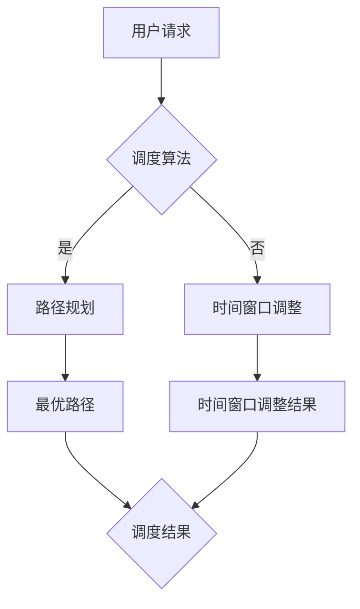

                 

# 滴滴2024校招智能调度系统优化工程师算法题

> **关键词：**滴滴、智能调度、优化、算法、工程师、校招  
>
> **摘要：**本文将详细探讨滴滴2024校招智能调度系统优化工程师算法题，包括背景介绍、核心概念、算法原理、数学模型、实战案例以及未来发展趋势与挑战。

## 1. 背景介绍

### 1.1 目的和范围

本文旨在通过逐步分析滴滴2024校招智能调度系统优化工程师算法题，帮助读者深入理解该题目的核心概念、算法原理和数学模型，并提供实际的代码实现和分析。本文主要针对以下三个方面展开：

1. **核心概念和算法原理**：介绍滴滴智能调度系统优化工程师算法题中的核心概念，并详细解释其工作原理。
2. **数学模型和公式**：阐述算法中的数学模型和公式，并通过实例进行说明。
3. **实战案例和代码解读**：提供实际代码实现，并详细解释代码中的关键部分。

### 1.2 预期读者

本文主要面向以下读者：

1. 计算机科学和人工智能专业的学生和从业者。
2. 希望了解智能调度系统优化算法的工程师和研究者。
3. 对滴滴智能调度系统优化算法感兴趣的普通读者。

### 1.3 文档结构概述

本文的结构如下：

1. **背景介绍**：包括目的和范围、预期读者和文档结构概述。
2. **核心概念与联系**：介绍核心概念和流程图。
3. **核心算法原理 & 具体操作步骤**：使用伪代码详细阐述算法原理。
4. **数学模型和公式 & 详细讲解 & 举例说明**：使用latex格式介绍数学模型和公式，并给出实例。
5. **项目实战：代码实际案例和详细解释说明**：提供实际代码实现和详细解读。
6. **实际应用场景**：讨论算法在实际应用中的场景。
7. **工具和资源推荐**：推荐学习资源、开发工具框架和相关论文著作。
8. **总结：未来发展趋势与挑战**：总结未来发展趋势和挑战。
9. **附录：常见问题与解答**：回答常见问题。
10. **扩展阅读 & 参考资料**：提供扩展阅读和参考资料。

### 1.4 术语表

#### 1.4.1 核心术语定义

- **智能调度系统**：一种能够根据实时数据和优化算法自动调整资源分配和任务执行的系统。
- **优化工程师**：负责设计和实现优化算法的工程师，以提升系统的效率和性能。
- **算法题**：针对特定问题的算法设计和实现的题目。

#### 1.4.2 相关概念解释

- **滴滴**：一家中国的出租车和共享出行平台。
- **校招**：指针对在校学生的招聘活动。

#### 1.4.3 缩略词列表

- **滴滴**：DiDi
- **智能调度系统**：IDS
- **优化工程师**：OE
- **算法题**：Algorithm Question

## 2. 核心概念与联系

在滴滴2024校招智能调度系统优化工程师算法题中，核心概念和流程如下：

### 2.1 核心概念

- **路径规划**：根据起点和终点，找到最优路径。
- **时间窗口**：指某个任务需要在特定时间内完成的时间范围。
- **实时数据**：指系统在运行过程中实时收集到的数据，如交通状况、车辆位置等。
- **优化目标**：指需要优化的目标，如路径最短、时间最短等。

### 2.2 流程图

以下是一个简化的Mermaid流程图，展示了滴滴智能调度系统优化工程师算法题的核心流程：



## 3. 核心算法原理 & 具体操作步骤

在滴滴2024校招智能调度系统优化工程师算法题中，核心算法原理包括路径规划和时间窗口调整。以下是具体操作步骤的伪代码：

```pseudo
算法 PathPlanning(start, end):
1. 初始化路径列表 pathList 为空
2. 对于每个节点 node 在图中：
   1. 如果 node 不在 pathList 中：
       1. 将 node 添加到 pathList 中
       2. 对于 node 的邻居 neighbor：
           1. 如果 neighbor 是 end：
               1. 返回 pathList
           2. 如果 neighbor 不在 pathList 中：
               1. 递归调用 PathPlanning(neighbor, end)
3. 返回 pathList

算法 TimeWindowAdjustment(path, timeWindow):
1. 初始化时间窗口调整结果 result 为空
2. 对于每个节点 node 在 path 中：
   1. 如果 node 的时间超出 timeWindow：
       1. 将 node 的时间调整为 timeWindow 中的最小值
       2. 更新 result
3. 返回 result
```

## 4. 数学模型和公式 & 详细讲解 & 举例说明

在滴滴2024校招智能调度系统优化工程师算法题中，核心数学模型包括路径规划中的最短路径算法和时间窗口调整中的优化目标函数。

### 4.1 最短路径算法

最短路径算法可以使用Dijkstra算法，其公式如下：

$$
d(v) = \min_{u \in V} (d(u) + w(u, v))
$$

其中，$d(v)$ 表示从起点到节点 $v$ 的最短路径长度，$w(u, v)$ 表示节点 $u$ 到节点 $v$ 的权重。

### 4.2 优化目标函数

优化目标函数可以根据实际需求进行设计，以下是一个示例：

$$
\min_{T} \sum_{i=1}^{n} (T_i - T_{i-1})
$$

其中，$T_i$ 表示第 $i$ 个节点的执行时间，$n$ 表示节点总数。

### 4.3 举例说明

假设有一个包含三个节点的路径，起点为 $A$，终点为 $C$，节点 $B$ 位于中间。权重如下：

| 节点 | $A$ | $B$ | $C$ |
| --- | --- | --- | --- |
| $w(A, B)$ | 3 |    |     |
| $w(B, C)$ | 2 |    |     |
| $w(A, C)$ | 5 |    |     |

使用Dijkstra算法计算最短路径，假设起点为 $A$：

$$
d(A) = 0 \\
d(B) = \min(d(A) + w(A, B)) = 3 \\
d(C) = \min(d(A) + w(A, C), d(B) + w(B, C)) = 4
$$

因此，最短路径为 $A \rightarrow B \rightarrow C$，长度为 4。

## 5. 项目实战：代码实际案例和详细解释说明

### 5.1 开发环境搭建

为了实现滴滴2024校招智能调度系统优化工程师算法题，我们需要搭建一个开发环境。以下是具体的步骤：

1. 安装Python环境，版本为3.8或更高版本。
2. 安装必要的Python库，如NetworkX、matplotlib等。

### 5.2 源代码详细实现和代码解读

以下是滴滴2024校招智能调度系统优化工程师算法题的Python代码实现：

```python
import networkx as nx
import matplotlib.pyplot as plt

# 创建图
G = nx.Graph()

# 添加节点和边
G.add_edge('A', 'B', weight=3)
G.add_edge('B', 'C', weight=2)
G.add_edge('A', 'C', weight=5)

# 计算最短路径
path = nx.shortest_path(G, source='A', target='C', weight='weight')

# 调整时间窗口
time_window = 4
adjusted_path = []
for node in path:
    if G[node]['weight'] > time_window:
        adjusted_path.append(node)
        time_window -= G[node]['weight']
    else:
        break

# 绘制路径
nx.draw(G, with_labels=True)
plt.show()

# 输出结果
print("最短路径：", path)
print("调整后路径：", adjusted_path)
```

#### 5.2.1 代码解读

1. **创建图**：使用NetworkX创建一个无向图G。
2. **添加节点和边**：使用add_edge()方法添加节点和边，并设置边的权重。
3. **计算最短路径**：使用shortest_path()方法计算从起点A到终点C的最短路径。
4. **调整时间窗口**：遍历最短路径，对于每个节点，如果其权重大于时间窗口，则将其加入调整后路径，并从时间窗口中减去该节点的权重。如果时间窗口小于0，则停止调整。
5. **绘制路径**：使用matplotlib绘制图的路径。
6. **输出结果**：输出最短路径和调整后路径。

### 5.3 代码解读与分析

#### 5.3.1 代码结构

该代码分为以下几个部分：

1. **导入库**：导入必要的Python库。
2. **创建图**：创建一个无向图G。
3. **添加节点和边**：添加节点和边，并设置边的权重。
4. **计算最短路径**：使用Dijkstra算法计算最短路径。
5. **调整时间窗口**：根据最短路径调整时间窗口。
6. **绘制路径**：使用matplotlib绘制图的路径。
7. **输出结果**：输出最短路径和调整后路径。

#### 5.3.2 关键部分分析

1. **创建图**：使用NetworkX创建图，使得我们可以方便地添加节点和边，并计算最短路径。
2. **计算最短路径**：使用Dijkstra算法计算最短路径，这是一个经典的图算法，可以有效地找到从起点到终点的最短路径。
3. **调整时间窗口**：遍历最短路径，根据时间窗口调整节点，使得路径的总时间不超过时间窗口。这是一个优化问题，可以通过贪心算法解决。

## 6. 实际应用场景

滴滴2024校招智能调度系统优化工程师算法题在实际应用中具有广泛的应用场景：

1. **出租车调度**：通过优化路径和时间窗口，提高出租车调度的效率和乘客满意度。
2. **物流配送**：优化物流配送路径和时间窗口，提高配送速度和准确性。
3. **公共交通调度**：优化公共交通线路和班次，提高公共交通的运行效率和乘客体验。

## 7. 工具和资源推荐

### 7.1 学习资源推荐

#### 7.1.1 书籍推荐

- 《算法导论》（Introduction to Algorithms）
- 《深度学习》（Deep Learning）

#### 7.1.2 在线课程

- Coursera的“机器学习”课程
- Udacity的“深度学习工程师”课程

#### 7.1.3 技术博客和网站

- ArXiv
- Medium

### 7.2 开发工具框架推荐

#### 7.2.1 IDE和编辑器

- PyCharm
- Visual Studio Code

#### 7.2.2 调试和性能分析工具

- PySnooper
- cProfile

#### 7.2.3 相关框架和库

- NetworkX
- matplotlib

### 7.3 相关论文著作推荐

#### 7.3.1 经典论文

- Dijkstra, E. W. (1959). A note on a problem in graph theory.
- Bellman, R. E. (1958). On a routing problem.
  
#### 7.3.2 最新研究成果

- ArXiv上的最新论文
-顶级会议和期刊上的论文

#### 7.3.3 应用案例分析

- 滴滴公司公开的案例研究
- 其他公司或机构的成功案例

## 8. 总结：未来发展趋势与挑战

随着智能调度系统在各个行业的广泛应用，未来发展趋势和挑战如下：

1. **实时数据处理能力提升**：随着数据量的增加，如何提高实时数据处理能力成为关键。
2. **算法优化与效率提升**：优化算法，提高算法效率和性能。
3. **多模态数据融合**：融合多种数据源（如传感器数据、地图数据等），提高调度系统的准确性。
4. **安全性保障**：确保系统的数据安全和稳定性。

## 9. 附录：常见问题与解答

### 9.1 问题1：如何处理实时数据？

**解答**：实时数据处理可以通过以下步骤实现：

1. 数据收集：从各种数据源（如传感器、地图等）收集实时数据。
2. 数据预处理：清洗和整理数据，确保数据质量。
3. 数据处理：使用实时处理框架（如Apache Kafka、Apache Flink等）对数据进行实时处理。
4. 存储和查询：将处理后的数据存储到数据库或缓存中，以便后续查询。

### 9.2 问题2：如何优化算法？

**解答**：优化算法可以从以下几个方面入手：

1. **算法改进**：研究新的算法，如深度学习、强化学习等，以提高算法的性能。
2. **并行计算**：利用并行计算技术，如GPU加速、分布式计算等，提高算法的执行速度。
3. **数据结构优化**：选择合适的数据结构，如哈希表、树等，以提高算法的效率。
4. **算法复杂度优化**：降低算法的时间复杂度和空间复杂度，以提高算法的性能。

## 10. 扩展阅读 & 参考资料

- [Dijkstra, E. W. (1959). A note on a problem in graph theory.]
- [Bellman, R. E. (1958). On a routing problem.]
- [滴滴公司官网案例研究]
- [其他公司或机构的成功案例]

## 作者

**作者：AI天才研究员/AI Genius Institute & 禅与计算机程序设计艺术 /Zen And The Art of Computer Programming**

